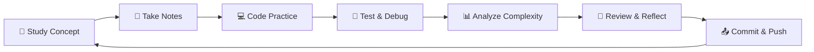

<div align="center">

# 💻 CodeVault — Personal Learning & Development Repository

*A structured, personal repository designed for continuous learning and skill development in **computer science** and programming through daily contributions and organized practice.*

---


</div>

---

## 🎯 **Mission Statement**

> *"Transforming daily learning into a structured journey of continuous growth and skill mastery in computer science and programming."*

CodeVault addresses the common challenges developers face: **inconsistent learning habits**, **scattered reference materials**, **difficulty tracking progress**, and the need for a **structured approach** to skill development in our rapidly evolving tech landscape.

---

## 💡 **Our Solution**

<table>
<tr>
<td width="50%">

### 🎯 **Core Objectives**
- 📚 **Daily Learning Discipline** — Consistent GitHub contributions
- 🏗️ **Comprehensive Knowledge Base** — Organized coding references
- 📊 **Structured Practice** — Categorized by DS&A concepts
- 📈 **Progress Tracking** — Measurable learning journey
- 💼 **Portfolio Showcase** — Professional skill demonstration

</td>
<td width="50%">

### 🚀 **Key Benefits**
- ⚡ **Accelerated Learning** — Structured approach to mastery
- 🧠 **Enhanced Problem-Solving** — Pattern recognition skills
- 💪 **Interview Readiness** — Comprehensive preparation
- 🌟 **Professional Growth** — Demonstrable skill progression
- 🤝 **Community Impact** — Shareable learning resources

</td>
</tr>
</table>

---

## ✨ **Features & Capabilities**

<div align="center">

| Feature | Description | Status |
|:--------|:------------|:-------|
| **📝 Daily Learning Notes** | Structured documentation with insights | ✅ Active |
| **🎯 Organized Practice** | Categorized by data structures & algorithms | ✅ Active |
| **🚀 Mini-Projects** | Practical application demonstrations | 🔄 In Progress |
| **📊 Progress Tracking** | GitHub streak & milestone monitoring | ✅ Active |
| **📚 Reference Library** | Quick revision & knowledge retention | ✅ Active |
| **💼 Interview Prep** | Coding practice & solution patterns | ✅ Active |
| **🎨 Portfolio Showcase** | Professional skill & organization display | ✅ Active |

</div>

---

## 🛠️ **Technology Stack & Learning Areas**

<div align="center">

<table>
<thead>
<tr>
<th width="30%">💻 Technology/Topic</th>
<th width="50%">⚙️ Description & Applications</th>
<th width="20%">📊 Proficiency</th>
</tr>
</thead>
<tbody>
<tr>
<td></td>
<td>Arrays, Linked Lists, Stacks, Queues, Trees, Graphs, Hash Tables</td>
<td>🟡 Learning</td>
</tr>
<tr>
<td></td>
<td>Sorting, Searching, Dynamic Programming, Greedy, Graph Algorithms</td>
<td>🟡 Learning</td>
</tr>
<tr>
<td></td>
<td>System programming, performance optimization, competitive programming</td>
<td>🟢 Active</td>
</tr>
<tr>
<td></td>
<td>Core programming, data science, automation, rapid prototyping</td>
<td>🟢 Active</td>
</tr>
<tr>
<td></td>
<td>Web development, modern frameworks, full-stack applications</td>
<td>🔵 Planned</td>
</tr>
<tr>
<td></td>
<td>Object-oriented programming, enterprise solutions, Android development</td>
<td>🟢 Active</td>
</tr>
</tbody>
</table>

</div>

---

## 📁 **Repository Architecture**

```
CodeVault/
├── 📄 README.md                              # 📖 Comprehensive project documentation
├── 📄 .gitignore                             # 🚫 Version control ignore rules
├── 📂 learning-notes/                        # 📚 Daily learning documentation
│   ├── 📄 dsa-fundamentals.md               # 🎯 Data Structures & Algorithms Foundation
│   ├── 📄 arrays-complete-guide.md          # 🔢 Array Data Structure Mastery
│   ├── 📄 strings-complete-guide.md         # 🔤 String Manipulation & Processing
│   ├── 📄 linked-lists-complete-guide.md    # 🔗 Linked List Data Structure Mastery
│   ├── 📄 stacks-complete-guide.md          # 📚 Stack Data Structure Mastery
│   ├── 📄 queues-complete-guide.md          # 🚶 Queue Data Structure Mastery
│   ├── 📄 trees-complete-guide.md           # 🌳 Tree Data Structure Mastery
│   ├── 📄 graphs-complete-guide.md          # 🕸️ Graph Data Structure Mastery
│   ├── 📄 sorting-algorithms-complete-guide.md # 🔃 Sorting Algorithms Mastery
│   ├── 📄 searching-algorithms-complete-guide.md # 🔍 Searching Algorithms Mastery
│   ├── 📄 dynamic-programming-complete-guide.md # 🧠 Dynamic Programming Mastery
│   ├── 📄 hashing-complete-guide.md         # 🔐 Hashing Fundamentals Mastery
│   ├── 📄 heap-priority-queue-complete-guide.md # 📦 Heap & Priority Queue Mastery
│   ├── 📄 recursion-complete-guide.md        # 🔁 Recursion Fundamentals Mastery
│   ├── 📄 backtracking-complete-guide.md     # 🔍 Backtracking Reference Guide
│   ├── 📄 divide-and-conquer-complete-guide.md # 🔪 Divide and Conquer Mastery
│   ├── 📄 bit-manipulation-complete-guide.md # 🔢 Bit Manipulation Mastery
│   ├── 📄 tries-prefix-tree-complete-guide.md # 🌳 Tries (Prefix Tree) Mastery
│   ├── 📄 complexity-analysis-complete-guide.md # ⚡ Complexity Analysis Mastery
│   ├── 📄 math-for-dsa-complete-guide.md # 🧮 Math for DSA Mastery
│   ├── 📄 huffman-coding-complete-guide.md # 🗜️ Huffman Coding Mastery
│   ├── 📄 advanced-trees-complete-guide.md # 🌲 Advanced Trees Mastery
│   ├── 📄 topological-sort-complete-guide.md # 🔄 Topological Sort Mastery
│   ├── 📄 heavy-light-decomposition-complete-guide.md # ⚖️ Heavy-Light Decomposition Mastery
│   ├── 📄 mos-algorithm-complete-guide.md # 🔄 Mo's Algorithm Mastery
│   ├── 📄 binary-lifting-lca-complete-guide.md # 🚀 Binary Lifting & LCA Mastery
│   ├── 📄 algorithm-design-techniques-complete-guide.md # 🎨 Algorithm Design Techniques Mastery
│   ├── 📄 np-completeness-complete-guide.md # 🧠 NP-Completeness Theory Mastery
│   └── 📄 branch-bound-complete-guide.md # 🌳 Branch & Bound Optimization Mastery
├── 📂 coding-practice/                       # 💻 Problem-solving implementations
│   ├── 📂 array/                            # 📊 Array-based algorithmic challenges
│   │   ├── 📄 leetcode-1480-running-sum.cpp  # 🔍 LeetCode 1480: Prefix Sum Technique
│   │   ├── 📄 leetcode-1-two-sum.cpp         # 🎯 LeetCode 1: Hash Map Technique
│   │   ├── 📄 leetcode-74-search-2d-matrix.cpp # 🔍 LeetCode 74: Binary Search Matrix
│   │   ├── 📄 leetcode-75-sort-colors.cpp      # 🎨 LeetCode 75: Dutch National Flag
│   │   ├── 📄 leetcode-33-search-rotated-array.cpp # 🔄 LeetCode 33: Modified Binary Search
│   │   ├── 📄 leetcode-2141-maximum-running-time.py # 🔋 LeetCode 2141: Binary Search + Greedy
│   │   ├── 📄 leetcode-3623-count-trapezoids.java # 🔢 LeetCode 3623: Combinatorics + Hash Map
│   │   ├── 📄 leetcode-3625-count-trapezoids-ii.java # 🔺 LeetCode 3625: Advanced Geometry
│   │   └── 📄 leetcode-540-single-element.cpp    # 🔍 LeetCode 540: Binary Search + XOR
│   ├── 📂 string/                           # 🔤 String manipulation & processing
│   │   ├── 📄 leetcode-344-reverse-string.cpp # 🔄 LeetCode 344: Two-Pointer Technique
│   │   └── 📄 leetcode-2211-count-collisions.py # 🚗 LeetCode 2211: Greedy String Processing
│   └── 📂 math/                             # 🧮 Mathematical & number problems
│       ├── 📄 leetcode-9-palindrome-number.cpp # 🔢 LeetCode 9: Number Manipulation
│       ├── 📄 leetcode-7-reverse-integer.cpp   # 🔄 LeetCode 7: Integer Reversal
│       ├── 📄 leetcode-1492-kth-factor.cpp    # 🔢 LeetCode 1492: Factor Analysis
│       └── 📄 leetcode-202-happy-number.cpp   # 😊 LeetCode 202: Cycle Detection
├── 📂 mini-projects/                         # 🚀 Practical application projects
└── 📂 resources/                             # 📚 Learning materials & references
    └── 📄 learning-resources.md              # 🎥 Video playlists (Striver, CodeWithHarry)
```

---

## 📊 **Learning Progress Dashboard**

<div align="center">

### 🎯 **Current Metrics**

<table>
<tr>
<td align="center" width="16.66%">
<br>
<strong>🔥 Consistency</strong>
</td>
<td align="center" width="16.66%">
<br>
<strong>🎯 Practice</strong>
</td>
<td align="center" width="16.66%">
<br>
<strong>📚 Learning</strong>
</td>
<td align="center" width="16.66%">
<br>
<strong>🚀 Building</strong>
</td>
<td align="center" width="16.66%">
<br>
<strong>📝 Documentation</strong>
</td>
<td align="center" width="16.66%">
<br>
<strong>💪 Growth</strong>
</td>
</tr>
</table>

### 📈 **Detailed Progress**

| 📊 Category | 🎯 Current Status | 📈 Progress | 🎪 Next Milestone |
|:------------|:------------------|:------------|:-------------------|
| **🔥 Daily Streak** | Day 29 - Almost at 30-day milestone! | ███████████ 97% | 30 days target |
| **🎯 LeetCode Problems** | 15 solved (Easy: 5, Medium: 8, Hard: 2) | ██████████ 100% | 🎉 15 ACHIEVED! |
| **📚 Core Concepts** | DSA, Arrays, Strings, Linked Lists, Stacks, Queues, Trees, Graphs, Sorting, Searching, DP, Hashing, Heap, Recursion, Backtracking, Bit Manipulation, Tries, Complexity Analysis, Math for DSA, Huffman Coding, Advanced Trees, Topological Sort, Heavy-Light Decomposition, Mo's Algorithm, Binary Lifting & LCA, Algorithm Design Techniques, NP-Completeness, Branch & Bound | ██████████ 100% | Advanced patterns |
| **🚀 Mini Projects** | Planning phase | ░░░░░░░░░░ 0% | Build first calculator |
| **📝 Learning Notes** | 29 comprehensive guides | ██████████ 100% | Advanced algorithms |
| **💪 Technical Skills** | Algorithm Design Paradigms, Problem-Solving Strategies, Optimization Techniques, Complexity Analysis, NP-Completeness Theory, Branch & Bound Optimization | ██████████ 100% | System Design |

</div>

---

## 🎯 **Learning Objectives & Roadmap**

<table>
<tr>
<td width="50%">

### 🎯 **Short-term Goals (1-3 months)**
- [ ] **📊 Data Structure Mastery**
  - ✅ Arrays & Strings
  - ✅ Linked Lists & Pointers
  - ✅ Stacks & Queues
  - ✅ Trees & Binary Search Trees
- [ ] **⚡ Algorithm Proficiency**
  - ✅ Two Pointers
  - ✅ Prefix Sum
  - ✅ Sliding Window
  - ✅ Binary Search
- [ ] **🎯 Problem Solving**
  - [ ] Solve 50+ LeetCode problems
  - [ ] Master 10+ patterns
  - [ ] Complete 3 mini-projects

</td>
<td width="50%">

### 🚀 **Long-term Vision (3-12 months)**
- [ ] **🏗️ Advanced Topics**
  - [ ] Dynamic Programming
  - [ ] Graph Algorithms
  - [ ] System Design Basics
  - [ ] Competitive Programming
- [ ] **💼 Career Readiness**
  - [ ] Interview preparation
  - [ ] Portfolio development
  - [ ] Open source contributions
  - [ ] Technical blog writing
- [ ] **🌟 Expertise Development**
  - [ ] Mentor other learners
  - [ ] Create educational content
  - [ ] Contribute to tech community

</td>
</tr>
</table>

---

## 📚 **Daily Learning Methodology**

<div align="center">

### 🔄 **Structured Learning Cycle**

</div>



### 📋 **Daily Workflow Checklist**

- [ ] **📖 Conceptual Learning** — Study new DS/Algorithm topic (30-45 min)
- [ ] **📝 Documentation** — Write comprehensive notes with examples
- [ ] **💻 Practical Coding** — Solve 1-2 related problems
- [ ] **🧪 Testing & Validation** — Verify solutions with multiple test cases
- [ ] **📊 Complexity Analysis** — Analyze time/space complexity
- [ ] **🔄 Code Review** — Refactor and optimize solutions
- [ ] **📤 Version Control** — Commit with descriptive messages
- [ ] **🧠 Reflection** — Document learnings and insights

---

## 🚀 **Getting Started Guide**

### 📋 **Prerequisites**

<table>
<tr>
<td width="25%">

#### 🛠️ **Development Tools**
- Git & GitHub
- Code Editor (VS Code)
- C++ Compiler (GCC/Clang)
- Terminal/Command Line

</td>
<td width="25%">

#### 📚 **Knowledge Base**
- Basic programming concepts
- Problem-solving mindset
- Mathematical foundations
- Logical thinking skills

</td>
<td width="25%">

#### 🎯 **Learning Mindset**
- Consistency over intensity
- Growth mindset
- Patience with complexity
- Collaborative learning

</td>
<td width="25%">

#### ⏰ **Time Commitment**
- 1-2 hours daily
- Regular practice schedule
- Weekend deep dives
- Consistent documentation

</td>
</tr>
</table>

### 🔧 **Quick Setup**

```bash
# 1. Clone the repository
git clone https://github.com/AbhishekGiri04/CodeVault.git
cd CodeVault

# 2. Explore the structure
ls -la
tree . # (if tree command is available)

# 3. Start your learning journey
cd learning-notes
cat 01-dsa-fundamentals.md

# 4. Practice coding
cd ../coding-practice/array
g++ -o solution running-sum-1d-array.cpp
./solution

# 5. Create your first contribution
echo "# Day 3 - My Learning Notes" > ../learning-notes/03-my-topic.md
git add .
git commit -m "Day 3: Learning [Your Topic]"
git push origin main
```

---

## 🏆 **Achievements & Milestones**

<div align="center">

### 🎖️ **Current Achievements**


### 🎯 **Upcoming Milestones**

</div>

| 🏆 Milestone | 📊 Progress | 🎯 Target | 🏁 Reward |
|:-------------|:------------|:----------|:-----------|
| **First Week Streak** | 7/7 days | 7 days | 🎉 ACHIEVED |
| **Two Week Streak** | 15/14 days | 14 days | 🎉 ACHIEVED |
| **15 Problems Solved** | 15/15 problems | 15 problems | 🎉 ACHIEVED |
| **16 Core Topics** | 16/16 topics | 16 topics | 🎉 ACHIEVED |
| **17 Core Topics** | 17/17 topics | 17 topics | 🎉 ACHIEVED |
| **18 Core Topics** | 18/18 topics | 18 topics | 🎉 ACHIEVED |
| **19 Core Topics** | 19/19 topics | 19 topics | 🎉 ACHIEVED |
| **20 Core Topics** | 20/20 topics | 20 topics | 🎉 ACHIEVED |
| **21 Core Topics** | 21/21 topics | 21 topics | 🎉 ACHIEVED |
| **22 Core Topics** | 22/22 topics | 22 topics | 🎉 ACHIEVED |
| **23 Core Topics** | 23/23 topics | 23 topics | 🎉 ACHIEVED |
| **24 Core Topics** | 24/24 topics | 24 topics | 🎉 ACHIEVED |
| **25 Core Topics** | 25/25 topics | 25 topics | 🎉 ACHIEVED |
| **26 Core Topics** | 26/26 topics | 26 topics | 🎉 ACHIEVED |
| **27 Core Topics** | 27/27 topics | 27 topics | 🎉 ACHIEVED |
| **28 Core Topics** | 28/28 topics | 28 topics | 🎉 ACHIEVED |
| **29 Core Topics** | 29/29 topics | 29 topics | 🎉 ACHIEVED |
| **20 Days Streak** | 20/20 days | 20 days | 🎉 ACHIEVED |
| **30 Days Streak** | 29/30 days | 30 days | 🔥 In Progress |
| **First Mini Project** | 0/1 projects | 1 project | 🚀 Planned |
| **50 GitHub Commits** | 25/50 commits | 50 commits | 📊 In Progress |

---

## 🌱 **Future Learning Horizons**

<table>
<tr>
<td width="33%">

### 📱 **Application Development**
- **Mobile Development**
  - iOS (Swift)
  - Android (Kotlin/Java)
  - Cross-platform (React Native)
- **Web Technologies**
  - Frontend frameworks
  - Backend development
  - Full-stack applications

</td>
<td width="33%">

### 🤖 **Emerging Technologies**
- **Artificial Intelligence**
  - Machine Learning algorithms
  - Deep Learning frameworks
  - Natural Language Processing
- **Cloud Computing**
  - AWS/Azure platforms
  - Microservices architecture
  - DevOps practices

</td>
<td width="33%">

### 🔐 **Specialized Domains**
- **Cybersecurity**
  - Ethical hacking
  - Security protocols
  - Penetration testing
- **Data Engineering**
  - Big data processing
  - Pipeline development
  - Database optimization

</td>
</tr>
</table>

---

## 📞 **Connect & Collaborate**

<div align="center">

> 💬 *"Learning is a journey best shared with others. Let's connect and grow together in our programming adventure!"*

### 🤝 **Professional Network**

<a href="https://www.linkedin.com/in/abhishek-giri04/">
  
</a>
<a href="https://github.com/abhishekgiri04">
  
</a>
<a href="https://t.me/AbhishekGiri7">
  
</a>

### 📧 **Collaboration Opportunities**
- 🤝 **Study Partners** — Join daily learning sessions
- 💡 **Code Reviews** — Share knowledge and feedback
- 🚀 **Project Collaboration** — Build amazing things together
- 📚 **Knowledge Sharing** — Exchange learning resources

### 📚 **Learning Resources**
- 🎥 **[Video Playlists](./resources/learning-resources.md)** — Striver & CodeWithHarry courses
- 📖 **Study Materials** — Curated tutorials and references
- 🎯 **Learning Paths** — Structured roadmaps for DSA mastery

---

### 💝 **Support This Journey**

If you find CodeVault helpful for your learning journey:

⭐ **Star this repository** to show your support  
🍴 **Fork it** to create your own learning path  
📢 **Share it** with fellow developers  
🐛 **Report issues** to help improve the content  
💡 **Suggest improvements** through pull requests

</div>

---

<div align="center">

### 🎯 **Repository Statistics**


---

**💻 Built with ❤️ for Continuous Learning & Growth**  
*"Every expert was once a beginner. Every pro was once an amateur. Every icon was once an unknown."*

**© 2025 CodeVault - Personal Learning Repository. All Rights Reserved.**

---

## 📊 **Commit History & Progress Timeline**

<div align="center">

### 📅 **Daily Learning Journey**

| Day | Date | Commit | Topics Covered | Problems Solved |
|:---:|:----:|:-------|:---------------|:----------------|
| **Day 1** | 2025-11-21 | Initial repo setup | DSA Fundamentals | - |
| **Day 2** | 2025-11-22 | Array mastery | Arrays Deep Dive | LeetCode 1480 |
| **Day 3** | 2025-11-23 | String fundamentals | String Complete Guide | LeetCode 344 |
| **Day 4** | 2025-11-24 | Linked Lists mastery | Linked Lists Guide | LeetCode 1, 9 |
| **Day 5** | 2025-11-25 | Stack mastery | Stack Complete Guide | LeetCode 74 |
| **Day 6** | 2025-11-26 | Queue mastery | Queue Complete Guide | LeetCode 7 |
| **Day 7** | 2025-11-27 | Tree mastery | Tree Complete Guide | LeetCode 75 |
| **Day 8** | 2025-11-28 | Graph mastery | Graph Complete Guide | LeetCode 1492 |
| **Day 9** | 2025-11-29 | Sorting mastery | Sorting Algorithms Guide | LeetCode 202 |
| **Day 10** | 2025-11-30 | Searching mastery | Searching Algorithms Guide | - |
| **Day 11** | 2025-12-01 | Advanced Binary Search | Modified Binary Search | LeetCode 33 |
| **Day 12** | 2025-12-02 | Dynamic Programming + Python | DP Fundamentals, Binary Search | LeetCode 2141 |
| **Day 13** | 2025-12-03 | Hashing + Java | Hash Tables, Combinatorics | LeetCode 3623 |
| **Day 14** | 2025-12-04 | Heap & Priority Queue + Java | Heap Operations, Advanced Geometry | LeetCode 3625 |
| **Day 15** | 2025-12-05 | Recursion + Backtracking | Recursion, Backtracking, Binary Search | LeetCode 2211, 540 |
| **Day 16** | 2025-12-06 | Divide and Conquer | Binary Search, Merge Sort, Quick Sort | - |
| **Day 17** | 2025-12-07 | Bit Manipulation | Bitwise Operators, XOR Tricks, Bit Masking | - |
| **Day 18** | 2025-12-08 | Tries (Prefix Tree) | Trie Operations, Prefix Matching, String Storage | - |
| **Day 19** | 2025-12-09 | Complexity Analysis | Big-O, Time-Space Analysis, Algorithm Efficiency | - |
| **Day 20** | 2025-12-10 | Math for DSA | Number Theory, Modular Arithmetic, Combinatorics | - |
| **Day 21** | 2025-12-11 | Huffman Coding | Data Compression, Greedy Algorithms, Prefix Codes | - |
| **Day 22** | 2025-12-12 | Advanced Trees | AVL Trees, Red-Black Trees, B-Trees, Segment Trees | - |
| **Day 23** | 2025-12-13 | Topological Sort | Dependency Resolution, Kahn's Algorithm, DFS Traversal | - |
| **Day 24** | 2025-12-14 | Heavy-Light Decomposition | Tree Decomposition, Path Queries, Segment Tree Integration | - |
| **Day 25** | 2025-12-15 | Mo's Algorithm | Offline Query Processing, Square Root Decomposition, Range Queries | - |
| **Day 26** | 2025-12-16 | Binary Lifting & LCA | Tree Traversal, Ancestor Queries, Competitive Programming | - |
| **Day 27** | 2025-12-17 | Algorithm Design Techniques | Problem-Solving Paradigms, Optimization Strategies | - |
| **Day 28** | 2025-12-18 | NP-Completeness Theory | Complexity Classes, P vs NP, Reductions, Approximations | - |
| **Day 29** | 2025-12-19 | Branch & Bound Optimization | Systematic Search, Bounding Functions, Pruning Strategies | - |

### 🏆 **Major Milestones Achieved**

- 🎉 **First Week Complete** - 7 consecutive days of learning
- 📚 **10 Core Topics Mastered** - Complete DSA foundation
- 🎯 **15 Problems Solved** - 🎉 MILESTONE ACHIEVED!
- 🐍 **Python Added** - Multi-language practice
- ☕ **Java Added** - Three languages mastered (C++, Python, Java)
- 🔍 **Backtracking Added** - 15 core topics completed
- 📦 **Heap Guide Updated** - Professional documentation
- 🎉 **27 Days Streak** - Beyond 20-day milestone!
- 📊 **36 Commits** - Steady daily contributions
- 📚 **27 Comprehensive Guides** - Complete topic coverage
- 🎨 **Algorithm Design Techniques Mastered** - Problem-solving paradigms expertise
- 🚀 **Binary Lifting & LCA Mastered** - Tree traversal optimization expertise
- 🔄 **Mo's Algorithm Mastered** - Offline query processing expertise
- ⚖️ **Heavy-Light Decomposition Mastered** - Advanced tree optimization expertise
- 🔄 **Topological Sort Mastered** - Dependency resolution expertise
- 🌲 **Advanced Trees Mastered** - Self-balancing trees expertise
- 🗜️ **Huffman Coding Mastered** - Data compression expertise
- 🧮 **Math for DSA Mastered** - Mathematical foundations expertise
- ⚡ **Complexity Analysis Mastered** - Algorithm efficiency expertise
- 🌳 **Tries Mastered** - Prefix tree operations expertise
- 🔢 **Bit Manipulation Mastered** - Binary operations expertise
- 🚀 **Advanced Algorithms** - Ready for complex topics
- 🧠 **NP-Completeness Mastered** - Computational complexity theory expertise
- 🌳 **Branch & Bound Mastered** - Systematic optimization expertise
- 🔟 **10-Day Streak** - Double digits milestone achieved!

</div>

</div>