# 🌲 Advanced Trees — Complete Professional <div align="center">Guide</div>

<div align="center">


**Master sophisticated tree structures for high-performance data operations**

</div>

---

## 📑 Table of Contents

1. [Introduction](#-introduction)
2. [Data Structure Types](#-data-structure-types)
3. [Tree Classification](#-tree-classification)
4. [Tree Selection Strategy](#-tree-selection-strategy)
5. [Tree Applications](#-tree-applications)
6. [Skewed Trees](#-skewed-trees)
7. [Implementation Guide](#-implementation-guide)
8. [Best Practices](#-best-practices)

---

## 🎯 Introduction

**Advanced Trees** are sophisticated data structures that extend basic binary trees with self-balancing properties, multi-way branching, or specialized query capabilities. They're essential for high-performance applications requiring guaranteed logarithmic operations.

---

## 🌳 Data Structure Types

<div align="center">

</div>

### 🔧 Data Structure Classification


---

## 🌳 Tree Classification

<div align="center">

</div>

### 🎯 Tree Types by Structure

```mermaid
flowchart TD
    A["Tree Classification"] --> B["By Number of Children"]
    A --> C["By Balance Property"]
    A --> D["By Storage Method"]
    
    B --> E["Binary Trees"]
    B --> F["Multi-way Trees"]
    B --> G["N-ary Trees"]
    
    C --> H["Self-Balancing"]
    C --> I["Non-Balancing"]
    
    D --> J["Memory-based"]
    D --> K["Disk-based"]
    
    E --> L["Each node ≤ 2 children"]
    F --> M["Each node > 2 children"]
    G --> N["Each node ≤ N children"]
    
    H --> O["AVL, Red-Black, Splay"]
    I --> P["Basic BST"]
    
    J --> Q["RAM optimization"]
    K --> R["B-Trees, B+ Trees"]
    
    classDef default fill:#f9f9f9,stroke:#333,stroke-width:2px,color:#000
    classDef category fill:#e8f5e8,stroke:#4caf50,stroke-width:2px,color:#000
    class B,C,D category
```



### 💻 Tree Properties Comparison

| Tree Type | Max Children | Height | Balance | Use Case |
|-----------|-------------|--------|---------|----------|
| **Binary Tree** | 2 | O(n) worst | No | Basic operations |
| **BST** | 2 | O(n) worst | No | Searching |
| **AVL Tree** | 2 | O(log n) | Strict | Search-heavy |
| **Red-Black** | 2 | O(log n) | Loose | Balanced R/W |
| **B-Tree** | m | O(log n) | Yes | Disk storage |
| **Segment Tree** | 2 | O(log n) | Yes | Range queries |

---

## 🎯 Tree Selection Strategy

### 🔧 Decision Framework

```mermaid
flowchart TD
    A["Choose Tree Structure"] --> B{"Primary Operation?"}
    
    B -->|"Search Heavy"| C["AVL Tree"]
    B -->|"Balanced R/W"| D["Red-Black Tree"]
    B -->|"Disk Storage"| E["B-Tree"]
    B -->|"Range Queries"| F{"Query Type?"}
    B -->|"Recent Access"| G["Splay Tree"]
    
    F -->|"Sum/Simple"| H["Fenwick Tree"]
    F -->|"Complex/Updates"| I["Segment Tree"]
    
    C --> J["✅ O(1.44 log n) height"]
    D --> K["✅ O(2 log n) height"]
    E --> L["✅ O(log_m n) height"]
    H --> M["✅ O(log n) operations"]
    I --> N["✅ O(log n) + lazy prop"]
    
    classDef default fill:#f9f9f9,stroke:#333,stroke-width:2px,color:#000
    classDef decision fill:#fff3e0,stroke:#ff9800,stroke-width:2px,color:#000
    classDef result fill:#e8f5e8,stroke:#4caf50,stroke-width:2px,color:#000
    class A,B,F decision
    class C,D,E,G,H,I result
```



### 📊 Performance Characteristics


---

## 🎯 Tree Applications

<div align="center">

</div>

### 🌐 Real-World Applications


### 💻 Application Examples

#### Database Indexing
```cpp
class DatabaseIndex {
    BTree index;
    
public:
    void createIndex(string column) {
        // Build B-Tree index for fast lookups
        for (auto& record : database) {
            index.insert(record.getValue(column), record.id);
        }
    }
    
    vector<Record> rangeQuery(int min, int max) {
        return index.rangeSearch(min, max);
    }
};
```

#### File System
```cpp
class FileSystem {
    BPlusTree directory;
    
public:
    void createFile(string path, File file) {
        directory.insert(path, file);
    }
    
    File findFile(string path) {
        return directory.search(path);
    }
    
    vector<File> listDirectory(string path) {
        return directory.rangeQuery(path + "/", path + "/~");
    }
};
```

---

## 🔄 Skewed Trees

<div align="center">

</div>

### 📐 Left and Right Skewed Trees


### 🔧 Skewed Tree Examples

#### Left Skewed Tree
```
    1
   /
  2
 /
3
```

#### Right Skewed Tree
```
1
 \
  2
   \
    3
```

### ⚖️ Balance Solutions

```cpp
class BalancedTreeSolutions {
public:
    // AVL Tree - Strict balancing
    class AVLTree {
        int getBalance(Node* node) {
            return getHeight(node->left) - getHeight(node->right);
        }
        
        Node* balance(Node* node) {
            int balance = getBalance(node);
            
            // Left heavy
            if (balance > 1) {
                if (getBalance(node->left) < 0)
                    node->left = leftRotate(node->left);
                return rightRotate(node);
            }
            
            // Right heavy
            if (balance < -1) {
                if (getBalance(node->right) > 0)
                    node->right = rightRotate(node->right);
                return leftRotate(node);
            }
            
            return node;
        }
    };
    
    // Red-Black Tree - Loose balancing
    class RedBlackTree {
        void insertFixup(Node* node) {
            while (node->parent && node->parent->color == RED) {
                // Rebalancing logic with rotations and recoloring
                if (node->parent == node->parent->parent->left) {
                    Node* uncle = node->parent->parent->right;
                    if (uncle && uncle->color == RED) {
                        // Case 1: Recolor
                        node->parent->color = BLACK;
                        uncle->color = BLACK;
                        node->parent->parent->color = RED;
                        node = node->parent->parent;
                    } else {
                        // Cases 2 & 3: Rotate
                        if (node == node->parent->right) {
                            node = node->parent;
                            leftRotate(node);
                        }
                        node->parent->color = BLACK;
                        node->parent->parent->color = RED;
                        rightRotate(node->parent->parent);
                    }
                }
                // Symmetric case for right subtree
            }
            root->color = BLACK;
        }
    };
};
```

---

## 💻 Implementation Guide

### 🔧 Basic Tree Node Structure

```cpp
// Generic tree node template
template<typename T>
struct TreeNode {
    T data;
    TreeNode* left;
    TreeNode* right;
    int height;  // For AVL
    bool color;  // For Red-Black (RED=true, BLACK=false)
    
    TreeNode(T val) : data(val), left(nullptr), right(nullptr), 
                      height(1), color(true) {}
};
```

### 🌳 AVL Tree Implementation

```cpp
class AVLTree {
private:
    TreeNode<int>* root;
    
    int getHeight(TreeNode<int>* node) {
        return node ? node->height : 0;
    }
    
    int getBalance(TreeNode<int>* node) {
        return node ? getHeight(node->left) - getHeight(node->right) : 0;
    }
    
    TreeNode<int>* rightRotate(TreeNode<int>* y) {
        TreeNode<int>* x = y->left;
        TreeNode<int>* T2 = x->right;
        
        x->right = y;
        y->left = T2;
        
        y->height = max(getHeight(y->left), getHeight(y->right)) + 1;
        x->height = max(getHeight(x->left), getHeight(x->right)) + 1;
        
        return x;
    }
    
    TreeNode<int>* leftRotate(TreeNode<int>* x) {
        TreeNode<int>* y = x->right;
        TreeNode<int>* T2 = y->left;
        
        y->left = x;
        x->right = T2;
        
        x->height = max(getHeight(x->left), getHeight(x->right)) + 1;
        y->height = max(getHeight(y->left), getHeight(y->right)) + 1;
        
        return y;
    }
    
public:
    TreeNode<int>* insert(TreeNode<int>* node, int key) {
        // Step 1: Normal BST insertion
        if (!node) return new TreeNode<int>(key);
        
        if (key < node->data)
            node->left = insert(node->left, key);
        else if (key > node->data)
            node->right = insert(node->right, key);
        else
            return node;
        
        // Step 2: Update height
        node->height = 1 + max(getHeight(node->left), getHeight(node->right));
        
        // Step 3: Get balance factor
        int balance = getBalance(node);
        
        // Step 4: Perform rotations
        // Left Left Case
        if (balance > 1 && key < node->left->data)
            return rightRotate(node);
        
        // Right Right Case
        if (balance < -1 && key > node->right->data)
            return leftRotate(node);
        
        // Left Right Case
        if (balance > 1 && key > node->left->data) {
            node->left = leftRotate(node->left);
            return rightRotate(node);
        }
        
        // Right Left Case
        if (balance < -1 && key < node->right->data) {
            node->right = rightRotate(node->right);
            return leftRotate(node);
        }
        
        return node;
    }
    
    void insert(int key) {
        root = insert(root, key);
    }
};
```

### 🔴 Red-Black Tree Implementation

```cpp
enum Color { RED, BLACK };

struct RBNode {
    int data;
    Color color;
    RBNode* left;
    RBNode* right;
    RBNode* parent;
    
    RBNode(int val) : data(val), color(RED), left(nullptr), 
                      right(nullptr), parent(nullptr) {}
};

class RedBlackTree {
private:
    RBNode* root;
    RBNode* NIL;  // Sentinel node
    
    void leftRotate(RBNode* x) {
        RBNode* y = x->right;
        x->right = y->left;
        
        if (y->left != NIL)
            y->left->parent = x;
        
        y->parent = x->parent;
        
        if (x->parent == NIL)
            root = y;
        else if (x == x->parent->left)
            x->parent->left = y;
        else
            x->parent->right = y;
        
        y->left = x;
        x->parent = y;
    }
    
    void insertFixup(RBNode* z) {
        while (z->parent->color == RED) {
            if (z->parent == z->parent->parent->left) {
                RBNode* y = z->parent->parent->right;  // Uncle
                
                if (y->color == RED) {
                    // Case 1: Uncle is red
                    z->parent->color = BLACK;
                    y->color = BLACK;
                    z->parent->parent->color = RED;
                    z = z->parent->parent;
                } else {
                    if (z == z->parent->right) {
                        // Case 2: Uncle is black, z is right child
                        z = z->parent;
                        leftRotate(z);
                    }
                    // Case 3: Uncle is black, z is left child
                    z->parent->color = BLACK;
                    z->parent->parent->color = RED;
                    rightRotate(z->parent->parent);
                }
            } else {
                // Symmetric cases
            }
        }
        root->color = BLACK;
    }
    
public:
    RedBlackTree() {
        NIL = new RBNode(0);
        NIL->color = BLACK;
        root = NIL;
    }
    
    void insert(int val) {
        RBNode* z = new RBNode(val);
        RBNode* y = NIL;
        RBNode* x = root;
        
        while (x != NIL) {
            y = x;
            if (z->data < x->data)
                x = x->left;
            else
                x = x->right;
        }
        
        z->parent = y;
        if (y == NIL)
            root = z;
        else if (z->data < y->data)
            y->left = z;
        else
            y->right = z;
        
        z->left = NIL;
        z->right = NIL;
        z->color = RED;
        
        insertFixup(z);
    }
};
```

---

## 💪 Best Practices

### ✅ Implementation Guidelines


### 🔧 Code Quality Tips

```cpp
// 1. Use RAII for memory management
class SafeAVLTree {
    unique_ptr<TreeNode> root;
    
public:
    ~SafeAVLTree() = default;  // Automatic cleanup
    
    void insert(int val) {
        root = insertHelper(move(root), val);
    }
};

// 2. Validate tree properties
bool isValidAVL(TreeNode* node) {
    if (!node) return true;
    
    int balance = getBalance(node);
    if (abs(balance) > 1) return false;
    
    return isValidAVL(node->left) && isValidAVL(node->right);
}

// 3. Handle edge cases
TreeNode* safeInsert(TreeNode* root, int val) {
    if (val == INT_MIN || val == INT_MAX) {
        throw invalid_argument("Invalid value");
    }
    
    return insert(root, val);
}
```

### 📊 Performance Optimization

```cpp
// Cache-friendly B-Tree node
struct CacheFriendlyBNode {
    static const int KEYS_PER_NODE = 15;  // Fit in cache line
    
    int keys[KEYS_PER_NODE];
    CacheFriendlyBNode* children[KEYS_PER_NODE + 1];
    int keyCount;
    bool isLeaf;
    
    // Padding to align to cache line boundary
    char padding[64 - sizeof(int) * (KEYS_PER_NODE + 2) - 
                 sizeof(void*) * (KEYS_PER_NODE + 1) - sizeof(bool)];
};
```

---

## 🎓 Summary

Advanced trees provide sophisticated solutions for complex data management:

✅ **Self-Balancing**: AVL and Red-Black trees guarantee O(log n) operations  
✅ **Disk Optimization**: B-Trees minimize disk I/O for large datasets  
✅ **Range Queries**: Segment and Fenwick trees excel at array operations  
✅ **Application Specific**: Choose based on access patterns and requirements  
✅ **Performance Critical**: Essential for high-performance systems  

**Key Insight**: "The right tree structure can transform O(n) operations into O(log n)"

---

<div align="center">

**🌲 Master Advanced Trees, Master Scalable Systems**

*Where sophisticated algorithms meet real-world performance*

</div>