# 🌲 Advanced Trees — Complete Professional Guide

<div align="center">


*Master sophisticated tree structures for high-performance data operations and system-level programming*

</div>

---

## 🌳 Advanced Trees Classification

<div align="center">

</div>


<div align="center">

</div>

### 🎯 Tree Selection Strategy

<div align="center">

</div>


<div align="center">

</div>

---

## 📑 Table of Contents

1. [Introduction](#-introduction)
2. [AVL Trees](#-avl-trees)
3. [Red-Black Trees](#-red-black-trees)
4. [B-Trees](#-b-trees)
5. [Segment Trees](#-segment-trees)
6. [Binary Indexed Trees](#-binary-indexed-trees)
7. [Comparison Analysis](#-comparison-analysis)
8. [Applications](#-applications)
9. [Implementation Strategies](#-implementation-strategies)
10. [Interview Problems](#-interview-problems)
11. [Performance Optimization](#-performance-optimization)
12. [Best Practices](#-best-practices)

---

## 🎯 Introduction

**Advanced Trees** are sophisticated data structures that extend basic binary trees with self-balancing properties, multi-way branching, or specialized query capabilities. They're essential for high-performance applications requiring guaranteed logarithmic operations.

### 🔑 Why Advanced Trees?

```
🚀 Performance Guarantee    → O(log n) operations always
⚖️ Self-Balancing         → Prevent worst-case scenarios
🎯 Specialized Operations  → Range queries, updates
💾 System Integration      → Database indexing, OS structures
🔧 Real-World Applications → Production-ready solutions
```

### 📊 Tree Categories

| Category | Examples | Primary Use |
|:---------|:---------|:------------|
| **Self-Balancing BST** | AVL, Red-Black | Search operations |
| **Multi-way Trees** | B-Tree, B+ Tree | Disk-based storage |
| **Range Query Trees** | Segment Tree, Fenwick Tree | Array operations |
| **Specialized Trees** | Splay Tree, Treap | Specific optimizations |

---

## 🌳 AVL Trees

### 🎯 Definition

**AVL Tree** is a self-balancing Binary Search Tree where the height difference between left and right subtrees (balance factor) is at most 1 for every node.

### ⚖️ AVL Balance and Rotation Strategy


### 📐 Balance Factor

```
Balance Factor = Height(Left Subtree) - Height(Right Subtree)
Allowed values: -1, 0, +1
```

### 🔄 Rotations

#### 1️⃣ Left-Left (LL) Rotation
```cpp
TreeNode* rightRotate(TreeNode* y) {
    TreeNode* x = y->left;
    TreeNode* T2 = x->right;
    
    // Perform rotation
    x->right = y;
    y->left = T2;
    
    // Update heights
    y->height = max(getHeight(y->left), getHeight(y->right)) + 1;
    x->height = max(getHeight(x->left), getHeight(x->right)) + 1;
    
    return x;  // New root
}
```

#### 2️⃣ Right-Right (RR) Rotation
```cpp
TreeNode* leftRotate(TreeNode* x) {
    TreeNode* y = x->right;
    TreeNode* T2 = y->left;
    
    // Perform rotation
    y->left = x;
    x->right = T2;
    
    // Update heights
    x->height = max(getHeight(x->left), getHeight(x->right)) + 1;
    y->height = max(getHeight(y->left), getHeight(y->right)) + 1;
    
    return y;  // New root
}
```

#### 3️⃣ Left-Right (LR) Rotation
```cpp
TreeNode* leftRightRotate(TreeNode* node) {
    node->left = leftRotate(node->left);
    return rightRotate(node);
}
```

#### 4️⃣ Right-Left (RL) Rotation
```cpp
TreeNode* rightLeftRotate(TreeNode* node) {
    node->right = rightRotate(node->right);
    return leftRotate(node);
}
```

### 💻 AVL Tree Implementation

```cpp
class AVLTree {
private:
    struct TreeNode {
        int val;
        TreeNode* left;
        TreeNode* right;
        int height;
        
        TreeNode(int x) : val(x), left(nullptr), right(nullptr), height(1) {}
    };
    
    TreeNode* root;
    
    int getHeight(TreeNode* node) {
        return node ? node->height : 0;
    }
    
    int getBalance(TreeNode* node) {
        return node ? getHeight(node->left) - getHeight(node->right) : 0;
    }
    
    TreeNode* insert(TreeNode* node, int val) {
        // Step 1: Normal BST insertion
        if (!node) return new TreeNode(val);
        
        if (val < node->val)
            node->left = insert(node->left, val);
        else if (val > node->val)
            node->right = insert(node->right, val);
        else
            return node;  // Duplicate values not allowed
        
        // Step 2: Update height
        node->height = 1 + max(getHeight(node->left), getHeight(node->right));
        
        // Step 3: Get balance factor
        int balance = getBalance(node);
        
        // Step 4: Perform rotations if unbalanced
        // Left Left Case
        if (balance > 1 && val < node->left->val)
            return rightRotate(node);
        
        // Right Right Case
        if (balance < -1 && val > node->right->val)
            return leftRotate(node);
        
        // Left Right Case
        if (balance > 1 && val > node->left->val) {
            node->left = leftRotate(node->left);
            return rightRotate(node);
        }
        
        // Right Left Case
        if (balance < -1 && val < node->right->val) {
            node->right = rightRotate(node->right);
            return leftRotate(node);
        }
        
        return node;
    }
    
public:
    void insert(int val) {
        root = insert(root, val);
    }
};
```

### 📊 AVL Tree Characteristics

| Property | Value |
|:---------|:------|
| **Height** | O(log n) |
| **Search** | O(log n) |
| **Insert** | O(log n) |
| **Delete** | O(log n) |
| **Space** | O(n) |

---

## 🔴 Red-Black Trees

### 🎯 Definition

**Red-Black Tree** is a self-balancing BST where each node has a color (red or black) and follows specific coloring rules to maintain balance.

### 🎨 Red-Black Tree Properties and Operations


### 📋 Properties

1. **Every node is either red or black**
2. **Root is always black**
3. **No two adjacent red nodes** (red node cannot have red parent or child)
4. **Every path from node to descendant leaves contains same number of black nodes**
5. **All leaves (NIL nodes) are black**

### 🎨 Node Structure

```cpp
enum Color { RED, BLACK };

struct RBNode {
    int data;
    Color color;
    RBNode* left;
    RBNode* right;
    RBNode* parent;
    
    RBNode(int val) : data(val), color(RED), left(nullptr), right(nullptr), parent(nullptr) {}
};
```

### 🔄 Red-Black Tree Operations

```cpp
class RedBlackTree {
private:
    RBNode* root;
    RBNode* NIL;  // Sentinel node
    
    void leftRotate(RBNode* x) {
        RBNode* y = x->right;
        x->right = y->left;
        
        if (y->left != NIL)
            y->left->parent = x;
        
        y->parent = x->parent;
        
        if (x->parent == NIL)
            root = y;
        else if (x == x->parent->left)
            x->parent->left = y;
        else
            x->parent->right = y;
        
        y->left = x;
        x->parent = y;
    }
    
    void insertFixup(RBNode* z) {
        while (z->parent->color == RED) {
            if (z->parent == z->parent->parent->left) {
                RBNode* y = z->parent->parent->right;  // Uncle
                
                if (y->color == RED) {
                    // Case 1: Uncle is red
                    z->parent->color = BLACK;
                    y->color = BLACK;
                    z->parent->parent->color = RED;
                    z = z->parent->parent;
                } else {
                    if (z == z->parent->right) {
                        // Case 2: Uncle is black, z is right child
                        z = z->parent;
                        leftRotate(z);
                    }
                    // Case 3: Uncle is black, z is left child
                    z->parent->color = BLACK;
                    z->parent->parent->color = RED;
                    rightRotate(z->parent->parent);
                }
            } else {
                // Symmetric cases for right subtree
                // ... (similar logic with left/right swapped)
            }
        }
        root->color = BLACK;
    }
    
public:
    void insert(int val) {
        RBNode* z = new RBNode(val);
        RBNode* y = NIL;
        RBNode* x = root;
        
        // Standard BST insertion
        while (x != NIL) {
            y = x;
            if (z->data < x->data)
                x = x->left;
            else
                x = x->right;
        }
        
        z->parent = y;
        if (y == NIL)
            root = z;
        else if (z->data < y->data)
            y->left = z;
        else
            y->right = z;
        
        z->left = NIL;
        z->right = NIL;
        z->color = RED;
        
        insertFixup(z);
    }
};
```

### 🆚 AVL vs Red-Black Comparison

| Feature | AVL Tree | Red-Black Tree |
|:--------|:---------|:---------------|
| **Balance** | Strictly balanced | Loosely balanced |
| **Height** | 1.44 log n | 2 log n |
| **Search** | Faster | Slightly slower |
| **Insert/Delete** | More rotations | Fewer rotations |
| **Use Cases** | Read-heavy | Write-heavy |

---

## 📚 B-Trees

### 🎯 Definition

**B-Tree** is a self-balancing multi-way search tree optimized for systems that read and write large blocks of data, particularly databases and file systems.

### 🏗️ B-Tree Structure and Operations


### 📋 Properties

For a B-Tree of order m:
- Every node has at most m children
- Every non-leaf node (except root) has at least ⌈m/2⌉ children
- Root has at least 2 children if it's not a leaf
- All leaves appear at the same level
- A non-leaf node with k children contains k-1 keys

### 💻 B-Tree Implementation

```cpp
class BTreeNode {
public:
    vector<int> keys;
    vector<BTreeNode*> children;
    int degree;  // Minimum degree
    bool isLeaf;
    
    BTreeNode(int deg, bool leaf) : degree(deg), isLeaf(leaf) {
        keys.reserve(2 * degree - 1);
        children.reserve(2 * degree);
    }
    
    void insertNonFull(int key) {
        int i = keys.size() - 1;
        
        if (isLeaf) {
            keys.push_back(0);
            while (i >= 0 && keys[i] > key) {
                keys[i + 1] = keys[i];
                i--;
            }
            keys[i + 1] = key;
        } else {
            while (i >= 0 && keys[i] > key)
                i--;
            
            if (children[i + 1]->keys.size() == 2 * degree - 1) {
                splitChild(i + 1, children[i + 1]);
                if (keys[i + 1] < key)
                    i++;
            }
            children[i + 1]->insertNonFull(key);
        }
    }
    
    void splitChild(int i, BTreeNode* y) {
        BTreeNode* z = new BTreeNode(y->degree, y->isLeaf);
        
        // Copy the last (degree-1) keys of y to z
        for (int j = 0; j < degree - 1; j++)
            z->keys.push_back(y->keys[j + degree]);
        
        // Copy the last degree children of y to z
        if (!y->isLeaf) {
            for (int j = 0; j < degree; j++)
                z->children.push_back(y->children[j + degree]);
        }
        
        // Reduce the number of keys in y
        y->keys.resize(degree - 1);
        
        // Create space for new child
        children.insert(children.begin() + i + 1, z);
        
        // Move the middle key of y to this node
        keys.insert(keys.begin() + i, y->keys[degree - 1]);
    }
};
```

### 📊 B-Tree Applications

| Application | Benefit |
|:------------|:--------|
| **Database Indexing** | Minimizes disk I/O |
| **File Systems** | Efficient directory structures |
| **Operating Systems** | Memory management |
| **Search Engines** | Index storage |

---

## 📊 Segment Trees

### 🎯 Definition

**Segment Tree** is a binary tree used for storing information about array segments, enabling efficient range queries and updates.

### 🔧 Segment Tree Operations Flow

```mermaid
flowchart TD
    A["Array [a₀, a₁, ..., aₙ₋₁]"] --> B["Build Segment Tree"]
    B --> C["Recursive Construction"]
    C --> D["Leaf nodes = Array elements"]
    C --> E["Internal nodes = Combined values"]
    
    F["Query(l, r)"] --> G{"Range Overlap?"}
    G -->|"No overlap"| H["Return identity"]
    G -->|"Complete overlap"| I["Return node value"]
    G -->|"Partial overlap"| J["Query both children"]
    J --> K["Combine results"]
    
    L["Update(idx, val)"] --> M["Update leaf node"]
    M --> N["Propagate up tree"]
    N --> O["Update parent values"]
    
    P["Lazy Propagation"] --> Q["Mark lazy updates"]
    Q --> R["Push down when needed"]
    R --> S["Efficient range updates"]
    
    style A fill:#ff6b6b
    style K fill:#4ecdc4
    style O fill:#96ceb4
    style S fill:#ffa500
```



### 🔧 Basic Structure

```cpp
class SegmentTree {
private:
    vector<int> tree;
    int n;
    
    void build(vector<int>& arr, int node, int start, int end) {
        if (start == end) {
            tree[node] = arr[start];
        } else {
            int mid = (start + end) / 2;
            build(arr, 2 * node, start, mid);
            build(arr, 2 * node + 1, mid + 1, end);
            tree[node] = tree[2 * node] + tree[2 * node + 1];
        }
    }
    
    void update(int node, int start, int end, int idx, int val) {
        if (start == end) {
            tree[node] = val;
        } else {
            int mid = (start + end) / 2;
            if (idx <= mid)
                update(2 * node, start, mid, idx, val);
            else
                update(2 * node + 1, mid + 1, end, idx, val);
            tree[node] = tree[2 * node] + tree[2 * node + 1];
        }
    }
    
    int query(int node, int start, int end, int l, int r) {
        if (r < start || end < l)
            return 0;  // Outside range
        
        if (l <= start && end <= r)
            return tree[node];  // Complete overlap
        
        // Partial overlap
        int mid = (start + end) / 2;
        int p1 = query(2 * node, start, mid, l, r);
        int p2 = query(2 * node + 1, mid + 1, end, l, r);
        return p1 + p2;
    }
    
public:
    SegmentTree(vector<int>& arr) {
        n = arr.size();
        tree.resize(4 * n);
        build(arr, 1, 0, n - 1);
    }
    
    void update(int idx, int val) {
        update(1, 0, n - 1, idx, val);
    }
    
    int rangeSum(int l, int r) {
        return query(1, 0, n - 1, l, r);
    }
};
```

### 🎯 Segment Tree Variants

#### Range Minimum Query (RMQ)
```cpp
class RMQSegmentTree {
    // Similar structure, but use min() instead of sum
    tree[node] = min(tree[2 * node], tree[2 * node + 1]);
};
```

#### Lazy Propagation
```cpp
class LazySegmentTree {
private:
    vector<int> tree, lazy;
    
    void push(int node, int start, int end) {
        if (lazy[node] != 0) {
            tree[node] += lazy[node];
            if (start != end) {
                lazy[2 * node] += lazy[node];
                lazy[2 * node + 1] += lazy[node];
            }
            lazy[node] = 0;
        }
    }
    
    void rangeUpdate(int node, int start, int end, int l, int r, int val) {
        push(node, start, end);
        if (start > r || end < l)
            return;
        
        if (start >= l && end <= r) {
            lazy[node] += val;
            push(node, start, end);
            return;
        }
        
        int mid = (start + end) / 2;
        rangeUpdate(2 * node, start, mid, l, r, val);
        rangeUpdate(2 * node + 1, mid + 1, end, l, r, val);
        
        push(2 * node, start, mid);
        push(2 * node + 1, mid + 1, end);
        tree[node] = tree[2 * node] + tree[2 * node + 1];
    }
};
```

---

## 🔢 Binary Indexed Trees (Fenwick Tree)

### 🎯 Definition

**Binary Indexed Tree (BIT)** or **Fenwick Tree** is a data structure that efficiently calculates prefix sums in O(log n) time using bit manipulation.

### 🔧 Fenwick Tree Bit Manipulation


### 💻 Implementation

```cpp
class FenwickTree {
private:
    vector<int> tree;
    int n;
    
public:
    FenwickTree(int size) : n(size) {
        tree.assign(n + 1, 0);
    }
    
    FenwickTree(vector<int>& arr) : n(arr.size()) {
        tree.assign(n + 1, 0);
        for (int i = 0; i < n; i++)
            update(i, arr[i]);
    }
    
    void update(int idx, int delta) {
        for (++idx; idx <= n; idx += idx & -idx)
            tree[idx] += delta;
    }
    
    int query(int idx) {
        int sum = 0;
        for (++idx; idx > 0; idx -= idx & -idx)
            sum += tree[idx];
        return sum;
    }
    
    int rangeQuery(int l, int r) {
        return query(r) - query(l - 1);
    }
};
```

### 🔍 Key Insight: Bit Manipulation

```cpp
// LSB (Least Significant Bit) extraction
int lsb = idx & (-idx);

// Examples:
// 12 = 1100₂, -12 = ...11110100₂, 12 & -12 = 4 = 100₂
// 10 = 1010₂, -10 = ...11110110₂, 10 & -10 = 2 = 10₂
```

---

## 🆚 Comparison Analysis

### 📊 Performance Comparison

<table>
<thead>
<tr>
<th>Data Structure</th>
<th>Search</th>
<th>Insert</th>
<th>Delete</th>
<th>Range Query</th>
<th>Space</th>
</tr>
</thead>
<tbody>
<tr>
<td><strong>AVL Tree</strong></td>
<td>O(log n)</td>
<td>O(log n)</td>
<td>O(log n)</td>
<td>O(n)</td>
<td>O(n)</td>
</tr>
<tr>
<td><strong>Red-Black Tree</strong></td>
<td>O(log n)</td>
<td>O(log n)</td>
<td>O(log n)</td>
<td>O(n)</td>
<td>O(n)</td>
</tr>
<tr>
<td><strong>B-Tree</strong></td>
<td>O(log n)</td>
<td>O(log n)</td>
<td>O(log n)</td>
<td>O(log n + k)</td>
<td>O(n)</td>
</tr>
<tr>
<td><strong>Segment Tree</strong></td>
<td>-</td>
<td>-</td>
<td>-</td>
<td>O(log n)</td>
<td>O(4n)</td>
</tr>
<tr>
<td><strong>Fenwick Tree</strong></td>
<td>-</td>
<td>-</td>
<td>-</td>
<td>O(log n)</td>
<td>O(n)</td>
</tr>
</tbody>
</table>

### 🎯 Use Case Selection

| Use Case | Recommended Structure |
|:---------|:---------------------|
| **Frequent searches** | AVL Tree |
| **Balanced read/write** | Red-Black Tree |
| **Database indexing** | B-Tree |
| **Range sum queries** | Fenwick Tree |
| **Complex range operations** | Segment Tree |
| **Memory-constrained** | Fenwick Tree |

---

## 🎯 Applications

### 🌐 Real-World Usage

#### Database Systems
```cpp
// B-Tree indexing in databases
class DatabaseIndex {
    BTree index;
    
public:
    void createIndex(string column) {
        // Build B-Tree index on column
    }
    
    vector<Record> rangeQuery(int min, int max) {
        // Use B-Tree for efficient range retrieval
    }
};
```

#### Operating Systems
```cpp
// Red-Black Tree in Linux CFS scheduler
class CFSScheduler {
    RedBlackTree runQueue;
    
public:
    void scheduleTask(Task* task) {
        runQueue.insert(task->vruntime, task);
    }
    
    Task* getNextTask() {
        return runQueue.getMinimum();
    }
};
```

#### Competitive Programming
```cpp
// Segment Tree for range queries
class RangeQuerySolver {
    SegmentTree segTree;
    
public:
    void solve() {
        int q;
        cin >> q;
        while (q--) {
            int type, l, r;
            cin >> type >> l >> r;
            
            if (type == 1) {
                cout << segTree.rangeSum(l, r) << "\n";
            } else {
                int val;
                cin >> val;
                segTree.update(l, val);
            }
        }
    }
};
```

---

## 🏆 Interview Problems

### ✅ Common Interview Questions

1. **Implement AVL Tree** - Complete self-balancing BST
2. **Range Sum Query** - Segment Tree or Fenwick Tree
3. **Balanced BST from Sorted Array** - Tree construction
4. **Lowest Common Ancestor** - Tree traversal optimization
5. **Range Update Queries** - Lazy propagation

### 🔥 Sample Problem: Range Sum Query

```cpp
class NumArray {
private:
    FenwickTree ft;
    vector<int> nums;
    
public:
    NumArray(vector<int>& nums) : nums(nums), ft(nums) {}
    
    void update(int index, int val) {
        int delta = val - nums[index];
        nums[index] = val;
        ft.update(index, delta);
    }
    
    int sumRange(int left, int right) {
        return ft.rangeQuery(left, right);
    }
};
```

---

## ⚡ Performance Optimization

### 🔧 Memory Optimization

```cpp
// Compact node representation
struct CompactAVLNode {
    int val : 24;        // 24 bits for value
    int height : 6;      // 6 bits for height (max 63)
    int balance : 2;     // 2 bits for balance factor (-1, 0, 1)
    CompactAVLNode* left;
    CompactAVLNode* right;
};
```

### ⚡ Cache Optimization

```cpp
// B-Tree with cache-friendly layout
class CacheFriendlyBTree {
private:
    static const int CACHE_LINE_SIZE = 64;
    static const int KEYS_PER_NODE = (CACHE_LINE_SIZE - sizeof(void*)) / sizeof(int);
    
    struct Node {
        int keys[KEYS_PER_NODE];
        Node* children[KEYS_PER_NODE + 1];
        int keyCount;
        bool isLeaf;
    };
};
```

---

## 💎 Best Practices

### ✅ Implementation Guidelines

```
✓ Choose appropriate tree based on use case
✓ Implement proper memory management
✓ Handle edge cases (empty trees, single nodes)
✓ Use iterative approaches when possible
✓ Optimize for cache locality
✓ Consider thread safety for concurrent access
```

### 🔧 Debugging Tips

```cpp
// Tree validation functions
bool isValidAVL(TreeNode* root) {
    return checkHeight(root) != -1;
}

int checkHeight(TreeNode* node) {
    if (!node) return 0;
    
    int leftHeight = checkHeight(node->left);
    if (leftHeight == -1) return -1;
    
    int rightHeight = checkHeight(node->right);
    if (rightHeight == -1) return -1;
    
    if (abs(leftHeight - rightHeight) > 1) return -1;
    
    return max(leftHeight, rightHeight) + 1;
}
```

---

## 📊 Complexity Summary

<div align="center">

| Tree Type | Height | Search | Insert | Delete | Space |
|:----------|:-------|:-------|:-------|:-------|:------|
| **AVL** | O(log n) | O(log n) | O(log n) | O(log n) | O(n) |
| **Red-Black** | O(log n) | O(log n) | O(log n) | O(log n) | O(n) |
| **B-Tree** | O(log n) | O(log n) | O(log n) | O(log n) | O(n) |
| **Segment** | O(log n) | - | - | - | O(4n) |
| **Fenwick** | - | - | - | - | O(n) |

</div>

---

## 🎓 Key Takeaways

<div align="center">

### 🌟 Master These Concepts

</div>

```
1. 🌳 AVL Trees = Strictly balanced BST with rotations
2. 🔴 Red-Black Trees = Loosely balanced with color properties
3. 📚 B-Trees = Multi-way trees for disk-based storage
4. 📊 Segment Trees = Range query specialists
5. 🔢 Fenwick Trees = Efficient prefix sum calculations
6. ⚖️ Balance trade-offs between operations
7. 🎯 Choose structure based on access patterns
8. 💾 Consider memory and cache implications
```

---

## 📚 Practice Resources

- **LeetCode**: Tree and range query problems
- **Codeforces**: Advanced data structure contests
- **GeeksforGeeks**: Implementation tutorials
- **CLRS**: Theoretical foundations

---

## 🎯 Interview Preparation

1. **Understand Rotations**: Master AVL and Red-Black rotations
2. **Implement from Scratch**: Practice coding without references
3. **Analyze Trade-offs**: Compare different tree structures
4. **Solve Range Problems**: Use Segment and Fenwick trees
5. **Optimize Solutions**: Consider memory and performance
6. **Handle Edge Cases**: Empty trees, single nodes, etc.

---

<div align="center">

### 🔥 One-Line Summary

**Advanced Trees = Sophisticated self-balancing and specialized tree structures for high-performance data operations and system-level programming**

---

**💻 Master advanced trees, master scalable systems!**

*"In the world of data structures, advanced trees are the backbone of high-performance systems and databases."*

</div>