# Algorithm Design Techniques — Complete Professional <div align="center">Guide</div>

<div align="center">


**Master fundamental problem-solving paradigms for efficient algorithm design**

</div>

---

## Table of Contents

1. [Introduction](#introduction)
2. [Data Structures Overview](#data-structures-overview)
3. [Algorithm Fundamentals](#algorithm-fundamentals)
4. [Algorithm Types](#algorithm-types)
5. [Brute Force](#brute-force)
6. [Divide & Conquer](#divide--conquer)
7. [Greedy Method](#greedy-method)
8. [Dynamic Programming](#dynamic-programming)
9. [Backtracking](#backtracking)
10. [Best Practices](#best-practices)

---

## Introduction

**Algorithm Design Techniques** are fundamental problem-solving paradigms that provide systematic approaches to developing efficient algorithms. Each technique offers a unique strategy for tackling computational problems.

### Why Study Design Techniques?

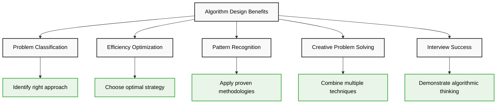

---

## Data Structures Overview

<div align="center">

</div>

### Data Structure Classification

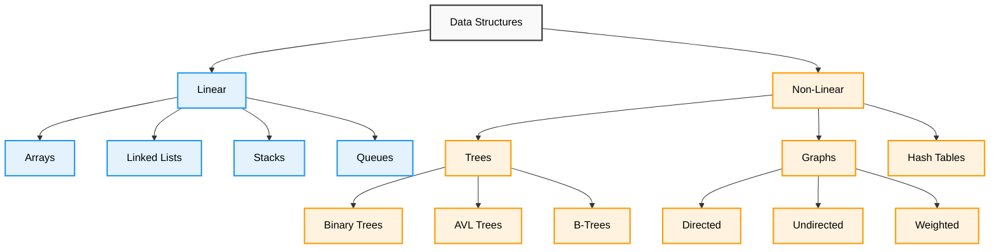

---

## Algorithm Fundamentals

<div align="center">

</div>

### How Algorithms Work

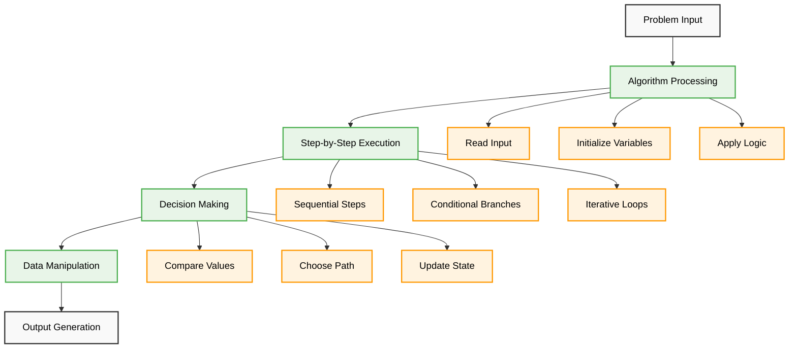

---

## Algorithm Types

<div align="center">

</div>

### Algorithm Categories

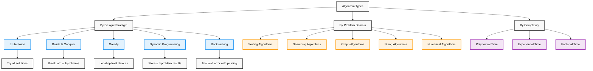

---

## Brute Force

### Definition

**Brute Force** is the most straightforward approach that examines all possible solutions to find the correct or optimal one.

### Strategy Flow

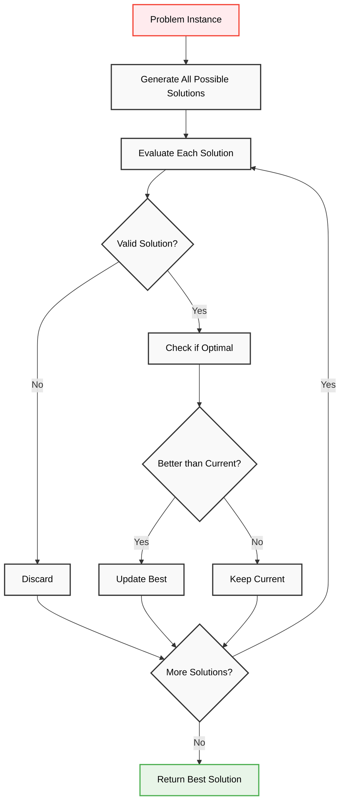

### Implementation Examples

#### Linear Search
```cpp
int linearSearch(vector<int>& arr, int target) {
    for (int i = 0; i < arr.size(); i++) {
        if (arr[i] == target) {
            return i;
        }
    }
    return -1;
}
// Time: O(n), Space: O(1)
```

#### Subset Sum
```cpp
bool hasSubsetSum(vector<int>& arr, int target) {
    int n = arr.size();
    
    // Try all 2^n subsets
    for (int mask = 0; mask < (1 << n); mask++) {
        int sum = 0;
        for (int i = 0; i < n; i++) {
            if (mask & (1 << i)) {
                sum += arr[i];
            }
        }
        if (sum == target) return true;
    }
    return false;
}
// Time: O(2^n × n), Space: O(1)
```

---

## Divide & Conquer

### Definition

**Divide & Conquer** breaks a problem into smaller independent subproblems, solves them recursively, and combines the results.

### Execution Flow

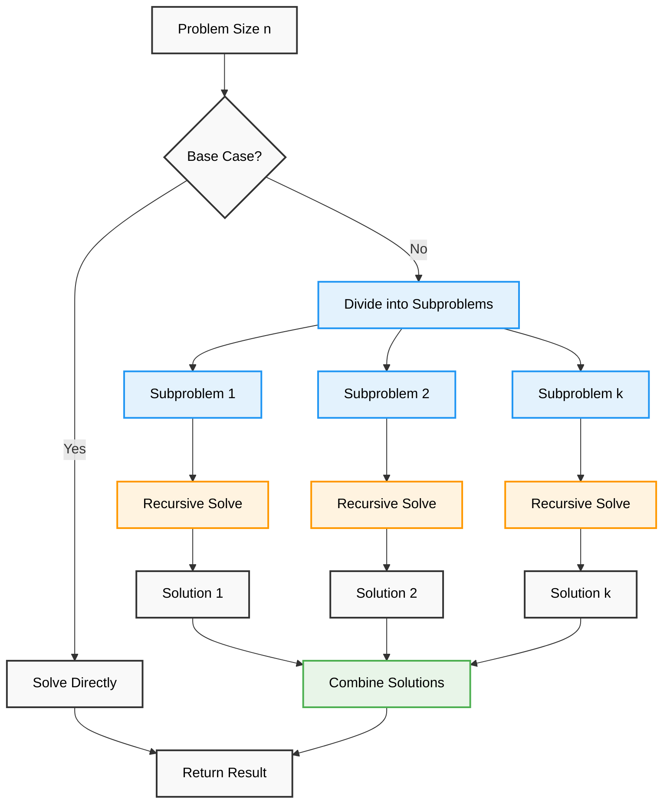

### Implementation Examples

#### Merge Sort
```cpp
void mergeSort(vector<int>& arr, int left, int right) {
    if (left < right) {
        int mid = left + (right - left) / 2;
        
        // Divide
        mergeSort(arr, left, mid);
        mergeSort(arr, mid + 1, right);
        
        // Combine
        merge(arr, left, mid, right);
    }
}
// Time: O(n log n), Space: O(n)
```

#### Binary Search
```cpp
int binarySearch(vector<int>& arr, int target, int left, int right) {
    if (left <= right) {
        int mid = left + (right - left) / 2;
        
        if (arr[mid] == target) return mid;
        
        if (arr[mid] > target) {
            return binarySearch(arr, target, left, mid - 1);
        } else {
            return binarySearch(arr, target, mid + 1, right);
        }
    }
    return -1;
}
// Time: O(log n), Space: O(log n)
```

---

## Greedy Method

### Definition

**Greedy Method** makes locally optimal choices at each step, hoping to achieve a global optimum.

### Decision Process

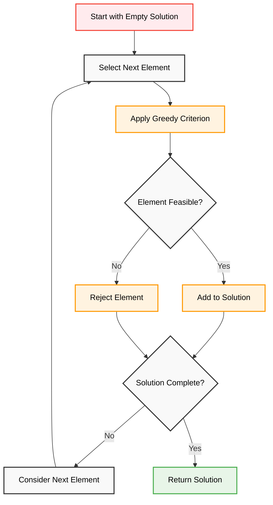

### Implementation Examples

#### Activity Selection
```cpp
int activitySelection(vector<pair<int, int>>& activities) {
    sort(activities.begin(), activities.end(), 
         [](const pair<int, int>& a, const pair<int, int>& b) {
             return a.second < b.second;
         });
    
    int count = 1;
    int lastFinish = activities[0].second;
    
    for (int i = 1; i < activities.size(); i++) {
        if (activities[i].first >= lastFinish) {
            count++;
            lastFinish = activities[i].second;
        }
    }
    
    return count;
}
// Time: O(n log n), Space: O(1)
```

---

## Dynamic Programming

### Definition

**Dynamic Programming** solves problems by breaking them into overlapping subproblems and storing results to avoid recomputation.

### Strategy Flow

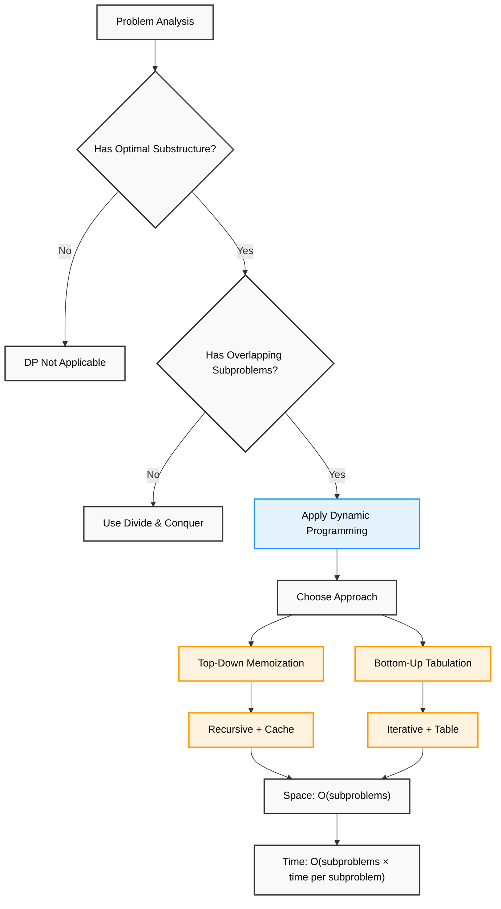

### Implementation Examples

#### Fibonacci (Memoization)
```cpp
class FibonacciMemo {
private:
    unordered_map<int, long long> memo;
    
public:
    long long fib(int n) {
        if (n <= 1) return n;
        
        if (memo.find(n) != memo.end()) {
            return memo[n];
        }
        
        memo[n] = fib(n - 1) + fib(n - 2);
        return memo[n];
    }
};
// Time: O(n), Space: O(n)
```

#### 0/1 Knapsack (Tabulation)
```cpp
int knapsack(vector<int>& weights, vector<int>& values, int capacity) {
    int n = weights.size();
    vector<vector<int>> dp(n + 1, vector<int>(capacity + 1, 0));
    
    for (int i = 1; i <= n; i++) {
        for (int w = 1; w <= capacity; w++) {
            if (weights[i-1] <= w) {
                dp[i][w] = max(values[i-1] + dp[i-1][w - weights[i-1]], 
                              dp[i-1][w]);
            } else {
                dp[i][w] = dp[i-1][w];
            }
        }
    }
    
    return dp[n][capacity];
}
// Time: O(n × capacity), Space: O(n × capacity)
```

---

## Backtracking

### Definition

**Backtracking** builds solutions incrementally and abandons candidates that cannot lead to a valid solution.

### Search Process

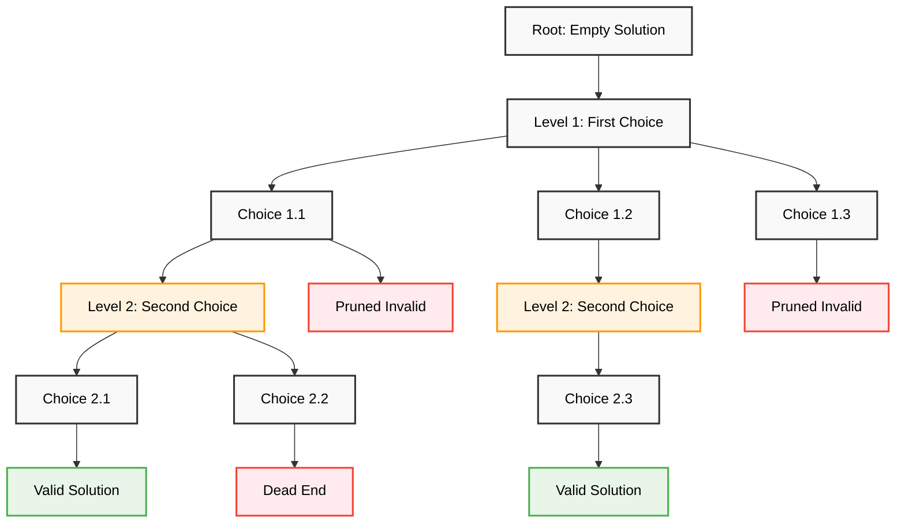

### Implementation Examples

#### N-Queens Problem
```cpp
class NQueens {
private:
    vector<vector<string>> solutions;
    
    bool isSafe(vector<string>& board, int row, int col, int n) {
        // Check column
        for (int i = 0; i < row; i++) {
            if (board[i][col] == 'Q') return false;
        }
        
        // Check diagonals
        for (int i = row - 1, j = col - 1; i >= 0 && j >= 0; i--, j--) {
            if (board[i][j] == 'Q') return false;
        }
        
        for (int i = row - 1, j = col + 1; i >= 0 && j < n; i--, j++) {
            if (board[i][j] == 'Q') return false;
        }
        
        return true;
    }
    
    void solve(vector<string>& board, int row, int n) {
        if (row == n) {
            solutions.push_back(board);
            return;
        }
        
        for (int col = 0; col < n; col++) {
            if (isSafe(board, row, col, n)) {
                board[row][col] = 'Q';
                solve(board, row + 1, n);
                board[row][col] = '.';  // Backtrack
            }
        }
    }
    
public:
    vector<vector<string>> solveNQueens(int n) {
        vector<string> board(n, string(n, '.'));
        solve(board, 0, n);
        return solutions;
    }
};
// Time: O(N!), Space: O(N²)
```

---

## Best Practices

### Design Guidelines

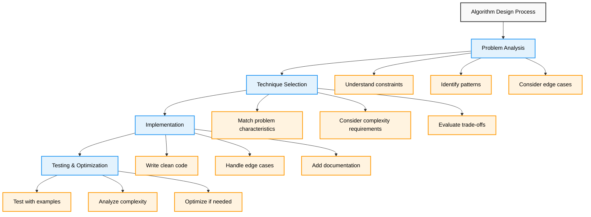

### Implementation Tips

```cpp
// Always consider problem characteristics
class AlgorithmSelector {
public:
    string selectTechnique(ProblemCharacteristics& problem) {
        if (problem.hasOptimalSubstructure && problem.hasOverlappingSubproblems) {
            return "Dynamic Programming";
        }
        
        if (problem.hasGreedyChoiceProperty && problem.hasOptimalSubstructure) {
            return "Greedy Method";
        }
        
        if (problem.canBeDividedIndependently) {
            return "Divide & Conquer";
        }
        
        if (problem.needsAllSolutions) {
            return "Backtracking";
        }
        
        return "Brute Force";
    }
};
```

### Technique Comparison

| Technique | Key Idea | Time Complexity | Space Complexity | Best For |
|-----------|----------|----------------|------------------|----------|
| **Brute Force** | Try all possibilities | O(2^n), O(n!) | O(1) | Small inputs |
| **Divide & Conquer** | Break and combine | O(n log n) | O(log n) | Independent subproblems |
| **Greedy** | Local optimum | O(n log n) | O(1) | Optimization problems |
| **Dynamic Programming** | Store subproblems | O(n²), O(n³) | O(n²) | Overlapping subproblems |
| **Backtracking** | Trial and error | O(2^n) | O(n) | Constraint satisfaction |

---

## Advanced Algorithm Operations

### Branch and Bound

**Branch and Bound** systematically explores solution space by branching on choices and bounding to prune unpromising paths.

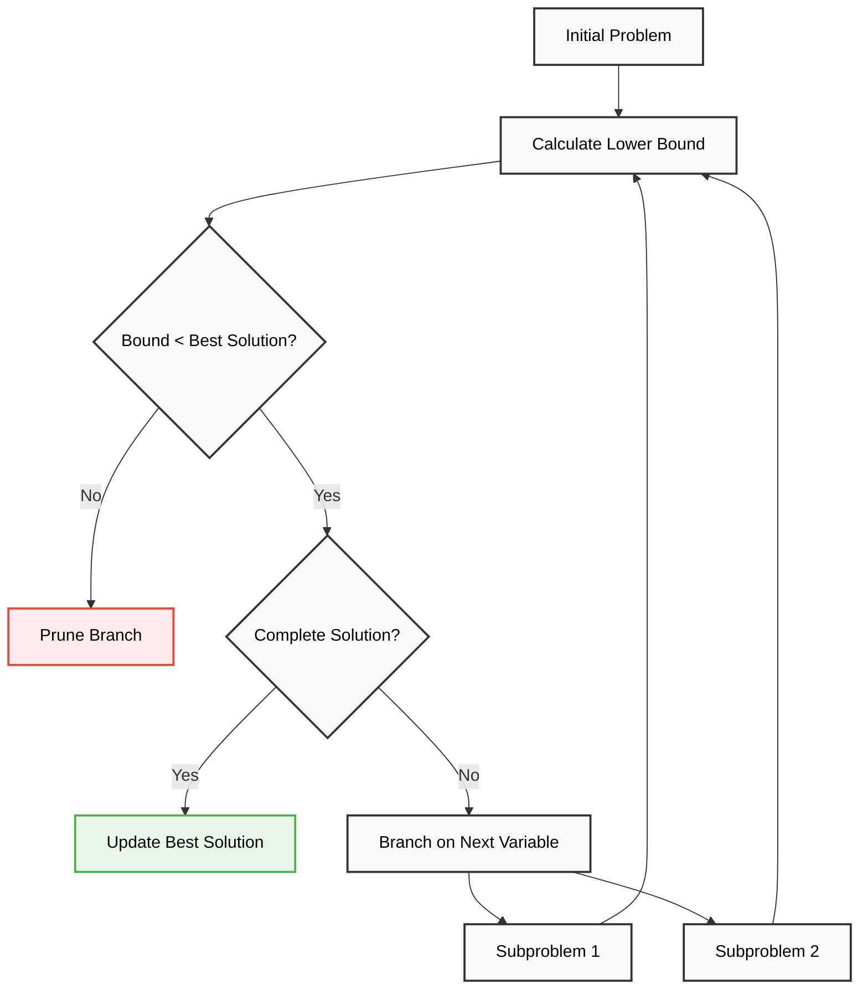

#### Traveling Salesman Problem
```cpp
class TSPBranchBound {
private:
    int n;
    vector<vector<int>> graph;
    int minCost = INT_MAX;
    
    int calculateBound(vector<bool>& visited, int currentCost, int level) {
        int bound = currentCost;
        
        // Add minimum edges for unvisited vertices
        for (int i = 0; i < n; i++) {
            if (!visited[i]) {
                int min1 = INT_MAX, min2 = INT_MAX;
                for (int j = 0; j < n; j++) {
                    if (i != j) {
                        if (graph[i][j] < min1) {
                            min2 = min1;
                            min1 = graph[i][j];
                        } else if (graph[i][j] < min2) {
                            min2 = graph[i][j];
                        }
                    }
                }
                bound += (min1 + min2) / 2;
            }
        }
        
        return bound;
    }
    
    void tspUtil(vector<bool>& visited, int currentCost, int level, int currentVertex) {
        if (level == n) {
            if (graph[currentVertex][0] != 0) {
                minCost = min(minCost, currentCost + graph[currentVertex][0]);
            }
            return;
        }
        
        for (int i = 0; i < n; i++) {
            if (!visited[i] && graph[currentVertex][i] != 0) {
                int newCost = currentCost + graph[currentVertex][i];
                int bound = calculateBound(visited, newCost, level + 1);
                
                if (bound < minCost) {
                    visited[i] = true;
                    tspUtil(visited, newCost, level + 1, i);
                    visited[i] = false;
                }
            }
        }
    }
    
public:
    int solveTSP(vector<vector<int>>& adjMatrix) {
        graph = adjMatrix;
        n = graph.size();
        vector<bool> visited(n, false);
        visited[0] = true;
        
        tspUtil(visited, 0, 1, 0);
        return minCost;
    }
};
// Time: O(n!), Space: O(n)
```

### Randomized Algorithms

**Randomized Algorithms** use random choices during execution to achieve good average-case performance.

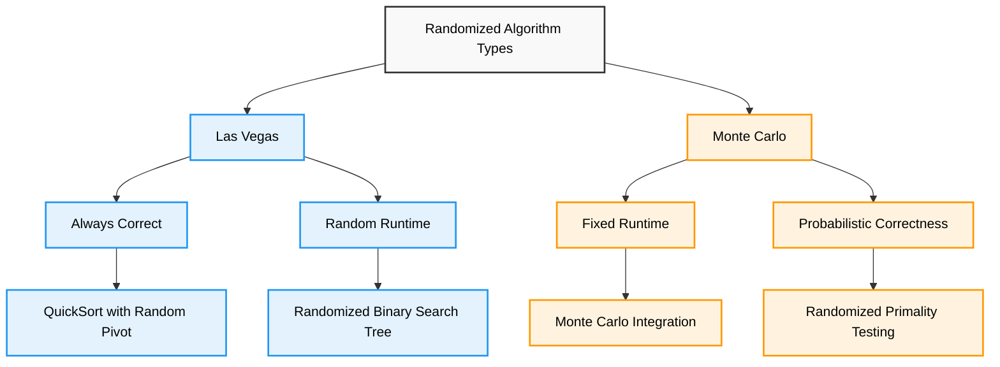

#### Randomized QuickSort
```cpp
class RandomizedQuickSort {
private:
    random_device rd;
    mt19937 gen;
    
    int randomizedPartition(vector<int>& arr, int low, int high) {
        uniform_int_distribution<> dis(low, high);
        int randomIndex = dis(gen);
        swap(arr[randomIndex], arr[high]);
        
        return partition(arr, low, high);
    }
    
    int partition(vector<int>& arr, int low, int high) {
        int pivot = arr[high];
        int i = low - 1;
        
        for (int j = low; j < high; j++) {
            if (arr[j] <= pivot) {
                i++;
                swap(arr[i], arr[j]);
            }
        }
        swap(arr[i + 1], arr[high]);
        return i + 1;
    }
    
    void quickSortUtil(vector<int>& arr, int low, int high) {
        if (low < high) {
            int pi = randomizedPartition(arr, low, high);
            quickSortUtil(arr, low, pi - 1);
            quickSortUtil(arr, pi + 1, high);
        }
    }
    
public:
    RandomizedQuickSort() : gen(rd()) {}
    
    void sort(vector<int>& arr) {
        quickSortUtil(arr, 0, arr.size() - 1);
    }
};
// Average Time: O(n log n), Worst Time: O(n²), Space: O(log n)
```

### Approximation Algorithms

**Approximation Algorithms** provide near-optimal solutions for NP-hard problems with guaranteed performance ratios.

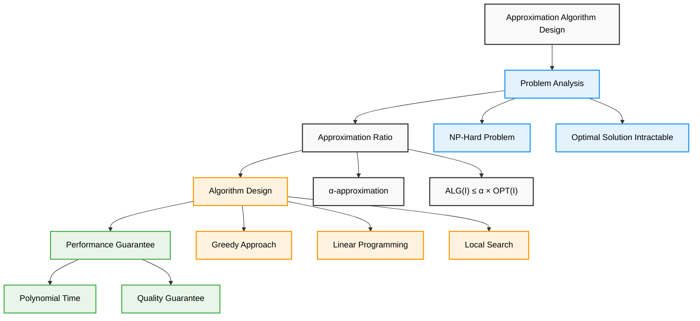

#### Vertex Cover Approximation
```cpp
class VertexCoverApprox {
public:
    vector<int> approximateVertexCover(int V, vector<pair<int, int>>& edges) {
        vector<bool> covered(edges.size(), false);
        vector<bool> inCover(V, false);
        vector<int> result;
        
        for (int i = 0; i < edges.size(); i++) {
            if (!covered[i]) {
                int u = edges[i].first;
                int v = edges[i].second;
                
                // Add both vertices to cover
                if (!inCover[u]) {
                    result.push_back(u);
                    inCover[u] = true;
                }
                if (!inCover[v]) {
                    result.push_back(v);
                    inCover[v] = true;
                }
                
                // Mark all edges incident to u or v as covered
                for (int j = 0; j < edges.size(); j++) {
                    if (edges[j].first == u || edges[j].first == v ||
                        edges[j].second == u || edges[j].second == v) {
                        covered[j] = true;
                    }
                }
            }
        }
        
        return result;
    }
};
// Time: O(E²), Space: O(V + E)
// Approximation Ratio: 2
```

### Parallel Algorithms

**Parallel Algorithms** utilize multiple processors to solve problems faster through concurrent execution.

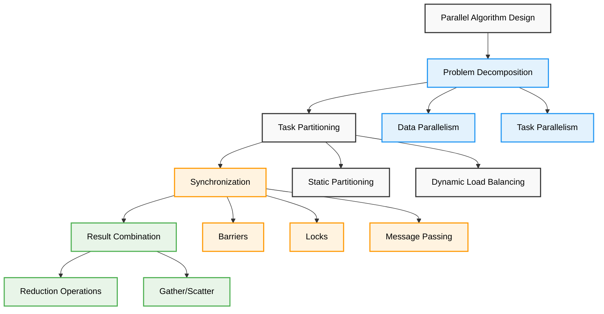

#### Parallel Merge Sort
```cpp
#include <thread>
#include <future>

class ParallelMergeSort {
private:
    void merge(vector<int>& arr, int left, int mid, int right) {
        vector<int> leftArr(arr.begin() + left, arr.begin() + mid + 1);
        vector<int> rightArr(arr.begin() + mid + 1, arr.begin() + right + 1);
        
        int i = 0, j = 0, k = left;
        
        while (i < leftArr.size() && j < rightArr.size()) {
            if (leftArr[i] <= rightArr[j]) {
                arr[k++] = leftArr[i++];
            } else {
                arr[k++] = rightArr[j++];
            }
        }
        
        while (i < leftArr.size()) arr[k++] = leftArr[i++];
        while (j < rightArr.size()) arr[k++] = rightArr[j++];
    }
    
    void parallelMergeSortUtil(vector<int>& arr, int left, int right, int depth) {
        if (left < right) {
            int mid = left + (right - left) / 2;
            
            if (depth > 0) {
                // Parallel execution
                auto leftFuture = async(launch::async, 
                    [this, &arr, left, mid, depth]() {
                        parallelMergeSortUtil(arr, left, mid, depth - 1);
                    });
                
                parallelMergeSortUtil(arr, mid + 1, right, depth - 1);
                leftFuture.wait();
            } else {
                // Sequential execution
                parallelMergeSortUtil(arr, left, mid, 0);
                parallelMergeSortUtil(arr, mid + 1, right, 0);
            }
            
            merge(arr, left, mid, right);
        }
    }
    
public:
    void sort(vector<int>& arr) {
        int maxDepth = log2(thread::hardware_concurrency());
        parallelMergeSortUtil(arr, 0, arr.size() - 1, maxDepth);
    }
};
// Time: O(n log n), Parallel Time: O(n log n / p), Space: O(n)
```

### Online Algorithms

**Online Algorithms** process input sequentially without knowledge of future inputs, making decisions with partial information.

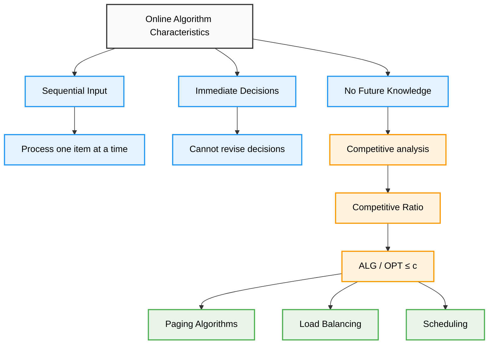

#### LRU Cache Implementation
```cpp
class LRUCache {
private:
    struct Node {
        int key, value;
        Node* prev;
        Node* next;
        Node(int k = 0, int v = 0) : key(k), value(v), prev(nullptr), next(nullptr) {}
    };
    
    int capacity;
    unordered_map<int, Node*> cache;
    Node* head;
    Node* tail;
    
    void addNode(Node* node) {
        node->prev = head;
        node->next = head->next;
        head->next->prev = node;
        head->next = node;
    }
    
    void removeNode(Node* node) {
        node->prev->next = node->next;
        node->next->prev = node->prev;
    }
    
    void moveToHead(Node* node) {
        removeNode(node);
        addNode(node);
    }
    
    Node* popTail() {
        Node* lastNode = tail->prev;
        removeNode(lastNode);
        return lastNode;
    }
    
public:
    LRUCache(int capacity) : capacity(capacity) {
        head = new Node();
        tail = new Node();
        head->next = tail;
        tail->prev = head;
    }
    
    int get(int key) {
        if (cache.find(key) != cache.end()) {
            Node* node = cache[key];
            moveToHead(node);
            return node->value;
        }
        return -1;
    }
    
    void put(int key, int value) {
        if (cache.find(key) != cache.end()) {
            Node* node = cache[key];
            node->value = value;
            moveToHead(node);
        } else {
            Node* newNode = new Node(key, value);
            
            if (cache.size() >= capacity) {
                Node* tail_node = popTail();
                cache.erase(tail_node->key);
                delete tail_node;
            }
            
            cache[key] = newNode;
            addNode(newNode);
        }
    }
};
// Time: O(1) for get and put, Space: O(capacity)
```

## Algorithm Complexity Analysis

### Complexity Classes

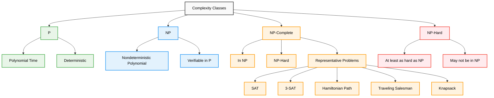

### Performance Comparison

| Algorithm Type | Best Case | Average Case | Worst Case | Space | Stability |
|----------------|-----------|--------------|------------|-------|----------|
| **Bubble Sort** | O(n) | O(n²) | O(n²) | O(1) | Stable |
| **Quick Sort** | O(n log n) | O(n log n) | O(n²) | O(log n) | Unstable |
| **Merge Sort** | O(n log n) | O(n log n) | O(n log n) | O(n) | Stable |
| **Heap Sort** | O(n log n) | O(n log n) | O(n log n) | O(1) | Unstable |
| **Radix Sort** | O(d(n+k)) | O(d(n+k)) | O(d(n+k)) | O(n+k) | Stable |
| **Binary Search** | O(1) | O(log n) | O(log n) | O(1) | N/A |
| **DFS/BFS** | O(V+E) | O(V+E) | O(V+E) | O(V) | N/A |
| **Dijkstra** | O(V²) | O(V²) | O(V²) | O(V) | N/A |
| **Floyd-Warshall** | O(V³) | O(V³) | O(V³) | O(V²) | N/A |

## Problem-Solving Framework

### Systematic Approach

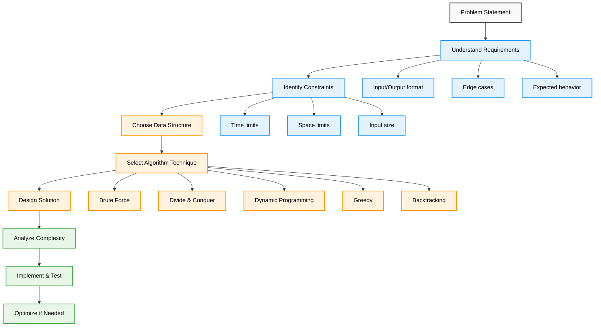

### Decision Tree for Technique Selection

```cpp
class TechniqueSelector {
public:
    string selectOptimalTechnique(ProblemCharacteristics problem) {
        // Check for specific problem patterns
        if (problem.needsAllSolutions) {
            return "Backtracking";
        }
        
        if (problem.hasOptimalSubstructure) {
            if (problem.hasOverlappingSubproblems) {
                return "Dynamic Programming";
            }
            if (problem.hasGreedyChoiceProperty) {
                return "Greedy Method";
            }
            if (problem.canBeDividedIndependently) {
                return "Divide & Conquer";
            }
        }
        
        if (problem.isNPHard && problem.needsApproximation) {
            return "Approximation Algorithm";
        }
        
        if (problem.hasRandomness || problem.needsAverageCase) {
            return "Randomized Algorithm";
        }
        
        if (problem.isOnline) {
            return "Online Algorithm";
        }
        
        if (problem.canUseParallelism) {
            return "Parallel Algorithm";
        }
        
        return "Brute Force";
    }
};
```

## Summary

Algorithm design techniques provide systematic approaches to problem-solving:

**Fundamental Techniques**: Master brute force, divide & conquer, greedy, dynamic programming, and backtracking  
**Advanced Methods**: Understand branch & bound, randomized, approximation, parallel, and online algorithms  
**Problem Classification**: Identify the right approach for each problem type  
**Complexity Analysis**: Analyze time and space requirements for optimal solutions  
**Implementation Skills**: Write clean, efficient code with proper error handling  
**Optimization Strategies**: Apply multiple techniques and choose the best approach  
**Interview Readiness**: Demonstrate algorithmic thinking and design skills  

**Key Insight**: "The right technique can transform an intractable problem into an elegant solution"

---

<div align="center">

**Master Design Techniques, Master Problem Solving**

*Where systematic thinking meets algorithmic elegance*

</div>