# 🎨 Algorithm Design Techniques — Complete Professional Guide

<div align="center">


*Master fundamental problem-solving paradigms for efficient algorithm design and competitive programming*


</div>

---

## 🎯 Algorithm Design Strategy Selection


## 📑 Table of Contents

1. [🎯 Introduction](#-introduction)
2. [💪 Brute Force](#-brute-force)
3. [🔄 Divide & Conquer](#-divide--conquer)
4. [📉 Decrease & Conquer](#-decrease--conquer)
5. [🔄 Transform & Conquer](#-transform--conquer)
6. [🎯 Greedy Method](#-greedy-method)
7. [🧠 Dynamic Programming](#-dynamic-programming)
8. [🔍 Backtracking](#-backtracking)
9. [🌳 Branch & Bound](#-branch--bound)
10. [🎲 Randomized Algorithms](#-randomized-algorithms)
11. [📊 Comparison & Selection](#-comparison--selection)
12. [💡 Best Practices](#-best-practices)

---

## 🎯 Introduction

**Algorithm Design Techniques** are fundamental problem-solving paradigms that provide systematic approaches to developing efficient algorithms. Each technique offers a unique strategy for tackling computational problems.

### 🔑 Why Study Design Techniques?

```
🎯 Problem Classification    → Identify the right approach
⚡ Efficiency Optimization  → Choose optimal strategy
🧠 Pattern Recognition      → Apply proven methodologies
💡 Creative Problem Solving → Combine multiple techniques
🏆 Interview Success        → Demonstrate algorithmic thinking
```

### 📊 Algorithm Design Paradigms Overview


### 📊 Algorithm Complexity Landscape


### 🔄 Problem-Solving Flow


---

## 💪 Brute Force

### 🎯 Definition

**Brute Force** is the most straightforward approach that examines all possible solutions to find the correct or optimal one.

### 🔄 Brute Force Strategy Flow


### 🔧 Core Strategy

```
1. Generate all possible solutions
2. Evaluate each solution
3. Select the valid/optimal solution
```

### 💻 Implementation Examples

#### Linear Search
```cpp
int linearSearch(vector<int>& arr, int target) {
    for (int i = 0; i < arr.size(); i++) {
        if (arr[i] == target) {
            return i;
        }
    }
    return -1;
}
// Time: O(n), Space: O(1)
```

#### Bubble Sort
```cpp
void bubbleSort(vector<int>& arr) {
    int n = arr.size();
    for (int i = 0; i < n - 1; i++) {
        for (int j = 0; j < n - i - 1; j++) {
            if (arr[j] > arr[j + 1]) {
                swap(arr[j], arr[j + 1]);
            }
        }
    }
}
// Time: O(n²), Space: O(1)
```

#### Subset Sum (Brute Force)
```cpp
bool hasSubsetSum(vector<int>& arr, int target) {
    int n = arr.size();
    
    // Try all 2^n subsets
    for (int mask = 0; mask < (1 << n); mask++) {
        int sum = 0;
        for (int i = 0; i < n; i++) {
            if (mask & (1 << i)) {
                sum += arr[i];
            }
        }
        if (sum == target) return true;
    }
    return false;
}
// Time: O(2^n × n), Space: O(1)
```

### 📊 Characteristics

| Aspect | Description |
|:-------|:------------|
| **Complexity** | Usually O(n²), O(2^n), O(n!) |
| **Correctness** | Always finds correct solution |
| **Implementation** | Simple and straightforward |
| **Scalability** | Poor for large inputs |

### ✅ When to Use

```
✓ Small input sizes
✓ No better algorithm known
✓ Correctness is critical
✓ Implementation simplicity needed
```

---

## 🔄 Divide & Conquer

### 🎯 Definition

**Divide & Conquer** breaks a problem into smaller independent subproblems, solves them recursively, and combines the results.

### 🔄 Divide & Conquer Execution Flow


### 🎯 Greedy Algorithm Decision Process


### 🔧 Core Strategy

```
1. Divide: Break problem into subproblems
2. Conquer: Solve subproblems recursively
3. Combine: Merge solutions
```

### 💻 Implementation Examples

#### Merge Sort
```cpp
void mergeSort(vector<int>& arr, int left, int right) {
    if (left < right) {
        int mid = left + (right - left) / 2;
        
        // Divide
        mergeSort(arr, left, mid);
        mergeSort(arr, mid + 1, right);
        
        // Combine
        merge(arr, left, mid, right);
    }
}

void merge(vector<int>& arr, int left, int mid, int right) {
    vector<int> temp(right - left + 1);
    int i = left, j = mid + 1, k = 0;
    
    while (i <= mid && j <= right) {
        if (arr[i] <= arr[j]) {
            temp[k++] = arr[i++];
        } else {
            temp[k++] = arr[j++];
        }
    }
    
    while (i <= mid) temp[k++] = arr[i++];
    while (j <= right) temp[k++] = arr[j++];
    
    for (int i = 0; i < k; i++) {
        arr[left + i] = temp[i];
    }
}
// Time: O(n log n), Space: O(n)
```

#### Binary Search
```cpp
int binarySearch(vector<int>& arr, int target, int left, int right) {
    if (left <= right) {
        int mid = left + (right - left) / 2;
        
        if (arr[mid] == target) return mid;
        
        if (arr[mid] > target) {
            return binarySearch(arr, target, left, mid - 1);
        } else {
            return binarySearch(arr, target, mid + 1, right);
        }
    }
    return -1;
}
// Time: O(log n), Space: O(log n)
```

#### Maximum Subarray (Divide & Conquer)
```cpp
int maxSubarraySum(vector<int>& arr, int left, int right) {
    if (left == right) return arr[left];
    
    int mid = left + (right - left) / 2;
    
    // Maximum sum in left and right halves
    int leftSum = maxSubarraySum(arr, left, mid);
    int rightSum = maxSubarraySum(arr, mid + 1, right);
    
    // Maximum sum crossing the middle
    int leftMax = INT_MIN, sum = 0;
    for (int i = mid; i >= left; i--) {
        sum += arr[i];
        leftMax = max(leftMax, sum);
    }
    
    int rightMax = INT_MIN;
    sum = 0;
    for (int i = mid + 1; i <= right; i++) {
        sum += arr[i];
        rightMax = max(rightMax, sum);
    }
    
    int crossSum = leftMax + rightMax;
    
    return max({leftSum, rightSum, crossSum});
}
// Time: O(n log n), Space: O(log n)
```

### 🎪 Dynamic Programming Strategy


---

## 📉 Decrease & Conquer

### 🎯 Definition

**Decrease & Conquer** reduces the problem size by a small amount, solves the smaller problem, then extends the solution.

### 🔧 Variants

1. **Decrease by 1**: Reduce size by constant
2. **Decrease by factor**: Reduce by constant factor
3. **Variable decrease**: Reduction varies

### 💻 Implementation Examples

#### Insertion Sort (Decrease by 1)
```cpp
void insertionSort(vector<int>& arr) {
    for (int i = 1; i < arr.size(); i++) {
        int key = arr[i];
        int j = i - 1;
        
        while (j >= 0 && arr[j] > key) {
            arr[j + 1] = arr[j];
            j--;
        }
        arr[j + 1] = key;
    }
}
// Time: O(n²), Space: O(1)
```

#### Binary Search (Decrease by factor)
```cpp
int binarySearchIterative(vector<int>& arr, int target) {
    int left = 0, right = arr.size() - 1;
    
    while (left <= right) {
        int mid = left + (right - left) / 2;
        
        if (arr[mid] == target) return mid;
        
        if (arr[mid] < target) {
            left = mid + 1;
        } else {
            right = mid - 1;
        }
    }
    return -1;
}
// Time: O(log n), Space: O(1)
```

#### Euclidean GCD (Variable decrease)
```cpp
int gcd(int a, int b) {
    if (b == 0) return a;
    return gcd(b, a % b);
}
// Time: O(log(min(a,b))), Space: O(log(min(a,b)))
```

---

## 🔄 Transform & Conquer

### 🎯 Definition

**Transform & Conquer** transforms the problem into a simpler or more familiar form, then solves it efficiently.

### 🔧 Types

1. **Representation Change**: Modify data structure
2. **Problem Reduction**: Convert to known problem
3. **Preconditioning**: Preprocess for efficiency

### 💻 Implementation Examples

#### Heap Sort (Representation Change)
```cpp
class HeapSort {
private:
    void heapify(vector<int>& arr, int n, int i) {
        int largest = i;
        int left = 2 * i + 1;
        int right = 2 * i + 2;
        
        if (left < n && arr[left] > arr[largest])
            largest = left;
        
        if (right < n && arr[right] > arr[largest])
            largest = right;
        
        if (largest != i) {
            swap(arr[i], arr[largest]);
            heapify(arr, n, largest);
        }
    }
    
public:
    void sort(vector<int>& arr) {
        int n = arr.size();
        
        // Transform array into heap
        for (int i = n / 2 - 1; i >= 0; i--) {
            heapify(arr, n, i);
        }
        
        // Extract elements from heap
        for (int i = n - 1; i > 0; i--) {
            swap(arr[0], arr[i]);
            heapify(arr, i, 0);
        }
    }
};
// Time: O(n log n), Space: O(1)
```

#### Balanced BST (Problem Reduction)
```cpp
TreeNode* sortedArrayToBST(vector<int>& nums, int left, int right) {
    if (left > right) return nullptr;
    
    int mid = left + (right - left) / 2;
    TreeNode* root = new TreeNode(nums[mid]);
    
    root->left = sortedArrayToBST(nums, left, mid - 1);
    root->right = sortedArrayToBST(nums, mid + 1, right);
    
    return root;
}
// Time: O(n), Space: O(log n)
```

---

## 🎯 Greedy Method

### 🎯 Definition

**Greedy Method** makes locally optimal choices at each step, hoping to achieve a global optimum.

### 🔧 Key Properties

1. **Greedy Choice Property**: Local optimum leads to global optimum
2. **Optimal Substructure**: Optimal solution contains optimal subsolutions

### 💻 Implementation Examples

#### Activity Selection
```cpp
int activitySelection(vector<pair<int, int>>& activities) {
    // Sort by finish time
    sort(activities.begin(), activities.end(), 
         [](const pair<int, int>& a, const pair<int, int>& b) {
             return a.second < b.second;
         });
    
    int count = 1;
    int lastFinish = activities[0].second;
    
    for (int i = 1; i < activities.size(); i++) {
        if (activities[i].first >= lastFinish) {
            count++;
            lastFinish = activities[i].second;
        }
    }
    
    return count;
}
// Time: O(n log n), Space: O(1)
```

#### Fractional Knapsack
```cpp
double fractionalKnapsack(vector<pair<int, int>>& items, int capacity) {
    // Sort by value/weight ratio
    sort(items.begin(), items.end(), 
         [](const pair<int, int>& a, const pair<int, int>& b) {
             return (double)a.first/a.second > (double)b.first/b.second;
         });
    
    double totalValue = 0;
    int currentWeight = 0;
    
    for (auto& item : items) {
        if (currentWeight + item.second <= capacity) {
            totalValue += item.first;
            currentWeight += item.second;
        } else {
            int remaining = capacity - currentWeight;
            totalValue += item.first * ((double)remaining / item.second);
            break;
        }
    }
    
    return totalValue;
}
// Time: O(n log n), Space: O(1)
```

#### Dijkstra's Algorithm
```cpp
vector<int> dijkstra(vector<vector<pair<int, int>>>& graph, int source) {
    int n = graph.size();
    vector<int> dist(n, INT_MAX);
    priority_queue<pair<int, int>, vector<pair<int, int>>, greater<pair<int, int>>> pq;
    
    dist[source] = 0;
    pq.push({0, source});
    
    while (!pq.empty()) {
        int u = pq.top().second;
        pq.pop();
        
        for (auto& edge : graph[u]) {
            int v = edge.first;
            int weight = edge.second;
            
            if (dist[u] + weight < dist[v]) {
                dist[v] = dist[u] + weight;
                pq.push({dist[v], v});
            }
        }
    }
    
    return dist;
}
// Time: O((V + E) log V), Space: O(V)
```

---

## 🎪 Dynamic Programming

### 🎯 Definition

**Dynamic Programming** solves problems by breaking them into overlapping subproblems and storing results to avoid recomputation.

### 🔧 Key Properties

1. **Optimal Substructure**: Optimal solution contains optimal subsolutions
2. **Overlapping Subproblems**: Same subproblems solved multiple times

### 🔧 Approaches

1. **Memoization (Top-Down)**: Recursive with caching
2. **Tabulation (Bottom-Up)**: Iterative table filling

### 💻 Implementation Examples

#### Fibonacci (Memoization)
```cpp
class FibonacciMemo {
private:
    unordered_map<int, long long> memo;
    
public:
    long long fib(int n) {
        if (n <= 1) return n;
        
        if (memo.find(n) != memo.end()) {
            return memo[n];
        }
        
        memo[n] = fib(n - 1) + fib(n - 2);
        return memo[n];
    }
};
// Time: O(n), Space: O(n)
```

#### 0/1 Knapsack (Tabulation)
```cpp
int knapsack(vector<int>& weights, vector<int>& values, int capacity) {
    int n = weights.size();
    vector<vector<int>> dp(n + 1, vector<int>(capacity + 1, 0));
    
    for (int i = 1; i <= n; i++) {
        for (int w = 1; w <= capacity; w++) {
            if (weights[i-1] <= w) {
                dp[i][w] = max(values[i-1] + dp[i-1][w - weights[i-1]], 
                              dp[i-1][w]);
            } else {
                dp[i][w] = dp[i-1][w];
            }
        }
    }
    
    return dp[n][capacity];
}
// Time: O(n × capacity), Space: O(n × capacity)
```

#### Longest Common Subsequence
```cpp
int longestCommonSubsequence(string text1, string text2) {
    int m = text1.length(), n = text2.length();
    vector<vector<int>> dp(m + 1, vector<int>(n + 1, 0));
    
    for (int i = 1; i <= m; i++) {
        for (int j = 1; j <= n; j++) {
            if (text1[i-1] == text2[j-1]) {
                dp[i][j] = dp[i-1][j-1] + 1;
            } else {
                dp[i][j] = max(dp[i-1][j], dp[i][j-1]);
            }
        }
    }
    
    return dp[m][n];
}
// Time: O(m × n), Space: O(m × n)
```

---

## 🔙 Backtracking

### 🎯 Definition

**Backtracking** builds solutions incrementally and abandons candidates that cannot lead to a valid solution.

### 🔙 Backtracking Search Tree

```mermaid
flowchart TD
    A["Root: Empty Solution"] --> B["Level 1: First Choice"]
    B --> C["Choice 1.1"]
    B --> D["Choice 1.2"]
    B --> E["Choice 1.3"]
    
    C --> F["Level 2: Second Choice"]
    C --> G["❌ Pruned (Invalid)"]
    D --> H["Level 2: Second Choice"]
    E --> I["❌ Pruned (Invalid)"]
    
    F --> J["Choice 2.1"]
    F --> K["Choice 2.2"]
    H --> L["Choice 2.3"]
    
    J --> M["✓ Valid Solution"]
    K --> N["❌ Dead End"]
    L --> O["✓ Valid Solution"]
    
    style A fill:#ff6b6b
    style M fill:#4ecdc4
    style O fill:#4ecdc4
    style G fill:#ff7675
    style I fill:#ff7675
    style N fill:#ff7675
```



### 🔧 Core Strategy

```
1. Choose: Make a choice
2. Explore: Recursively explore
3. Unchoose: Backtrack if needed
```

### 💻 Implementation Examples

#### N-Queens Problem
```cpp
class NQueens {
private:
    vector<vector<string>> solutions;
    
    bool isSafe(vector<string>& board, int row, int col, int n) {
        // Check column
        for (int i = 0; i < row; i++) {
            if (board[i][col] == 'Q') return false;
        }
        
        // Check diagonal
        for (int i = row - 1, j = col - 1; i >= 0 && j >= 0; i--, j--) {
            if (board[i][j] == 'Q') return false;
        }
        
        for (int i = row - 1, j = col + 1; i >= 0 && j < n; i--, j++) {
            if (board[i][j] == 'Q') return false;
        }
        
        return true;
    }
    
    void solve(vector<string>& board, int row, int n) {
        if (row == n) {
            solutions.push_back(board);
            return;
        }
        
        for (int col = 0; col < n; col++) {
            if (isSafe(board, row, col, n)) {
                board[row][col] = 'Q';
                solve(board, row + 1, n);
                board[row][col] = '.';  // Backtrack
            }
        }
    }
    
public:
    vector<vector<string>> solveNQueens(int n) {
        vector<string> board(n, string(n, '.'));
        solve(board, 0, n);
        return solutions;
    }
};
// Time: O(N!), Space: O(N²)
```

#### Subset Sum
```cpp
bool subsetSum(vector<int>& nums, int target, int index, int currentSum) {
    if (currentSum == target) return true;
    if (index >= nums.size() || currentSum > target) return false;
    
    // Include current element
    if (subsetSum(nums, target, index + 1, currentSum + nums[index])) {
        return true;
    }
    
    // Exclude current element
    return subsetSum(nums, target, index + 1, currentSum);
}
// Time: O(2^n), Space: O(n)
```

---

## 🌳 Branch & Bound

### 🎯 Definition

**Branch & Bound** is an optimization technique that systematically explores the solution space while pruning branches that cannot lead to optimal solutions.

### 🔧 Core Components

1. **Branching**: Generate child nodes
2. **Bounding**: Calculate bounds
3. **Pruning**: Eliminate non-promising branches

### 💻 Implementation Example

#### 0/1 Knapsack (Branch & Bound)
```cpp
struct Node {
    int level, profit, weight;
    double bound;
};

class KnapsackBB {
private:
    double calculateBound(Node u, int n, int capacity, 
                         vector<int>& weights, vector<int>& values) {
        if (u.weight >= capacity) return 0;
        
        double profitBound = u.profit;
        int j = u.level + 1;
        int totalWeight = u.weight;
        
        while (j < n && totalWeight + weights[j] <= capacity) {
            totalWeight += weights[j];
            profitBound += values[j];
            j++;
        }
        
        if (j < n) {
            profitBound += (capacity - totalWeight) * 
                          ((double)values[j] / weights[j]);
        }
        
        return profitBound;
    }
    
public:
    int knapsack(vector<int>& weights, vector<int>& values, int capacity) {
        int n = weights.size();
        
        // Sort by value/weight ratio
        vector<int> indices(n);
        iota(indices.begin(), indices.end(), 0);
        sort(indices.begin(), indices.end(), 
             [&](int a, int b) {
                 return (double)values[a]/weights[a] > (double)values[b]/weights[b];
             });
        
        queue<Node> q;
        Node u, v;
        
        u.level = -1;
        u.profit = u.weight = 0;
        u.bound = calculateBound(u, n, capacity, weights, values);
        
        q.push(u);
        int maxProfit = 0;
        
        while (!q.empty()) {
            u = q.front();
            q.pop();
            
            if (u.bound > maxProfit) {
                v.level = u.level + 1;
                
                // Include next item
                v.weight = u.weight + weights[indices[v.level]];
                v.profit = u.profit + values[indices[v.level]];
                
                if (v.weight <= capacity && v.profit > maxProfit) {
                    maxProfit = v.profit;
                }
                
                v.bound = calculateBound(v, n, capacity, weights, values);
                if (v.bound > maxProfit) {
                    q.push(v);
                }
                
                // Exclude next item
                v.weight = u.weight;
                v.profit = u.profit;
                v.bound = calculateBound(v, n, capacity, weights, values);
                if (v.bound > maxProfit) {
                    q.push(v);
                }
            }
        }
        
        return maxProfit;
    }
};
```

---

## 🎲 Randomized Algorithms

### 🎯 Definition

**Randomized Algorithms** use random numbers to make decisions during execution, often achieving better average-case performance.

### 🔧 Types

1. **Monte Carlo**: May give wrong answer with small probability
2. **Las Vegas**: Always correct, but running time varies

### 💻 Implementation Examples

#### Randomized Quick Sort
```cpp
class RandomizedQuickSort {
private:
    int randomPartition(vector<int>& arr, int low, int high) {
        int randomIndex = low + rand() % (high - low + 1);
        swap(arr[randomIndex], arr[high]);
        return partition(arr, low, high);
    }
    
    int partition(vector<int>& arr, int low, int high) {
        int pivot = arr[high];
        int i = low - 1;
        
        for (int j = low; j < high; j++) {
            if (arr[j] <= pivot) {
                i++;
                swap(arr[i], arr[j]);
            }
        }
        swap(arr[i + 1], arr[high]);
        return i + 1;
    }
    
    void quickSort(vector<int>& arr, int low, int high) {
        if (low < high) {
            int pi = randomPartition(arr, low, high);
            quickSort(arr, low, pi - 1);
            quickSort(arr, pi + 1, high);
        }
    }
    
public:
    void sort(vector<int>& arr) {
        srand(time(nullptr));
        quickSort(arr, 0, arr.size() - 1);
    }
};
// Average Time: O(n log n), Worst Time: O(n²)
```

#### Monte Carlo π Estimation
```cpp
double estimatePi(int numSamples) {
    int insideCircle = 0;
    srand(time(nullptr));
    
    for (int i = 0; i < numSamples; i++) {
        double x = (double)rand() / RAND_MAX;
        double y = (double)rand() / RAND_MAX;
        
        if (x * x + y * y <= 1.0) {
            insideCircle++;
        }
    }
    
    return 4.0 * insideCircle / numSamples;
}
```

---

## 🆚 Comparison & Selection

### 📊 Technique Comparison

<table>
<thead>
<tr>
<th>Technique</th>
<th>Key Idea</th>
<th>Time Complexity</th>
<th>Space Complexity</th>
<th>Best For</th>
</tr>
</thead>
<tbody>
<tr>
<td><strong>Brute Force</strong></td>
<td>Try all possibilities</td>
<td>O(2^n), O(n!)</td>
<td>O(1)</td>
<td>Small inputs, correctness</td>
</tr>
<tr>
<td><strong>Divide & Conquer</strong></td>
<td>Break and combine</td>
<td>O(n log n)</td>
<td>O(log n)</td>
<td>Independent subproblems</td>
</tr>
<tr>
<td><strong>Greedy</strong></td>
<td>Local optimum</td>
<td>O(n log n)</td>
<td>O(1)</td>
<td>Optimization problems</td>
</tr>
<tr>
<td><strong>Dynamic Programming</strong></td>
<td>Store subproblems</td>
<td>O(n²), O(n³)</td>
<td>O(n²)</td>
<td>Overlapping subproblems</td>
</tr>
<tr>
<td><strong>Backtracking</strong></td>
<td>Trial and error</td>
<td>O(2^n)</td>
<td>O(n)</td>
<td>Constraint satisfaction</td>
</tr>
<tr>
<td><strong>Branch & Bound</strong></td>
<td>Pruned search</td>
<td>Variable</td>
<td>O(2^n)</td>
<td>Optimization with pruning</td>
</tr>
</tbody>
</table>

### 🎯 Selection Guidelines

```cpp
// Decision Tree for Algorithm Selection
if (problem_size <= 100) {
    return "Brute Force";
} else if (has_optimal_substructure && has_overlapping_subproblems) {
    return "Dynamic Programming";
} else if (has_greedy_choice_property && has_optimal_substructure) {
    return "Greedy Method";
} else if (can_be_divided_independently) {
    return "Divide & Conquer";
} else if (need_all_solutions) {
    return "Backtracking";
} else if (need_optimal_solution_with_pruning) {
    return "Branch & Bound";
} else {
    return "Transform & Conquer or Randomized";
}
```

---

## 💎 Best Practices

### ✅ Design Guidelines

```
✓ Understand problem constraints and requirements
✓ Identify the underlying problem structure
✓ Consider multiple approaches before implementation
✓ Analyze time and space complexity
✓ Test with edge cases and large inputs
✓ Document algorithm choice reasoning
```

### 🔧 Implementation Tips

```cpp
// Always consider the problem characteristics
class AlgorithmSelector {
public:
    string selectTechnique(ProblemCharacteristics& problem) {
        if (problem.hasOptimalSubstructure && problem.hasOverlappingSubproblems) {
            return "Dynamic Programming";
        }
        
        if (problem.hasGreedyChoiceProperty && problem.hasOptimalSubstructure) {
            return "Greedy Method";
        }
        
        if (problem.canBeDividedIndependently) {
            return "Divide & Conquer";
        }
        
        if (problem.needsAllSolutions) {
            return "Backtracking";
        }
        
        return "Brute Force";
    }
};
```

### 🚫 Common Pitfalls

```
✗ Using brute force for large inputs
✗ Applying greedy without proving optimality
✗ Not considering space complexity in DP
✗ Excessive backtracking without pruning
✗ Ignoring randomization benefits
```

---

## 🎓 Key Takeaways

<div align="center">

### 🌟 Master These Concepts

</div>

```
1. 💪 Brute Force = Simple but inefficient exhaustive search
2. 🔄 Divide & Conquer = Break, solve, combine strategy
3. 📉 Decrease & Conquer = Reduce size incrementally
4. 🔄 Transform & Conquer = Change problem representation
5. 🎯 Greedy = Local optimum choices for global optimum
6. 🎪 Dynamic Programming = Optimal substructure + overlapping subproblems
7. 🔙 Backtracking = Systematic trial and error with pruning
8. 🌳 Branch & Bound = Optimized backtracking with bounds
9. 🎲 Randomized = Use randomness for better average performance
```

---

## 📚 Practice Resources

- **LeetCode**: Algorithm technique tags
- **GeeksforGeeks**: Design technique tutorials
- **Codeforces**: Competitive programming problems
- **CLRS**: Comprehensive algorithm textbook

---

## 🎯 Interview Tips

1. **Identify Pattern**: Recognize which technique fits the problem
2. **Justify Choice**: Explain why you chose a specific approach
3. **Analyze Complexity**: Always discuss time and space complexity
4. **Consider Alternatives**: Mention other possible approaches
5. **Optimize**: Discuss potential improvements and trade-offs
6. **Code Clean**: Implement with clear, readable code

---

<div align="center">

### 🔥 One-Line Summary

**Algorithm Design Techniques = Fundamental problem-solving paradigms providing systematic approaches for efficient algorithm development and optimization**

---

**💻 Master design techniques, master problem solving!**

*"In the art of algorithm design, choosing the right technique is half the battle won."*

</div>