# Amortized Analysis — Complete Professional <div align="center">Guide</div>

<div align="center">


**Master advanced performance analysis techniques for guaranteed algorithmic efficiency**

</div>

---

## Table of Contents

1. [Introduction](#introduction)
2. [Core Concepts](#core-concepts)
3. [Analysis Methods Overview](#analysis-methods-overview)
4. [Aggregate Method](#aggregate-method)
5. [Accounting Method](#accounting-method)
6. [Potential Method](#potential-method)
7. [Dynamic Array Analysis](#dynamic-array-analysis)
8. [Stack Operations](#stack-operations)
9. [Binary Counter](#binary-counter)
10. [Advanced Applications](#advanced-applications)
11. [Best Practices](#best-practices)

---

## Introduction

<div align="center">

</div>

**Amortized Analysis** is a technique for analyzing the average time per operation over a sequence of operations, providing guaranteed performance bounds without probabilistic assumptions.

### Why Amortized Analysis?

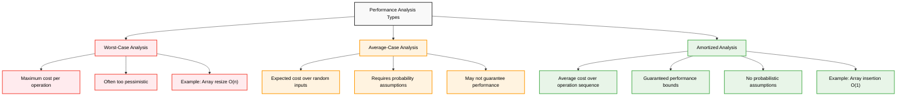

### Key Benefits

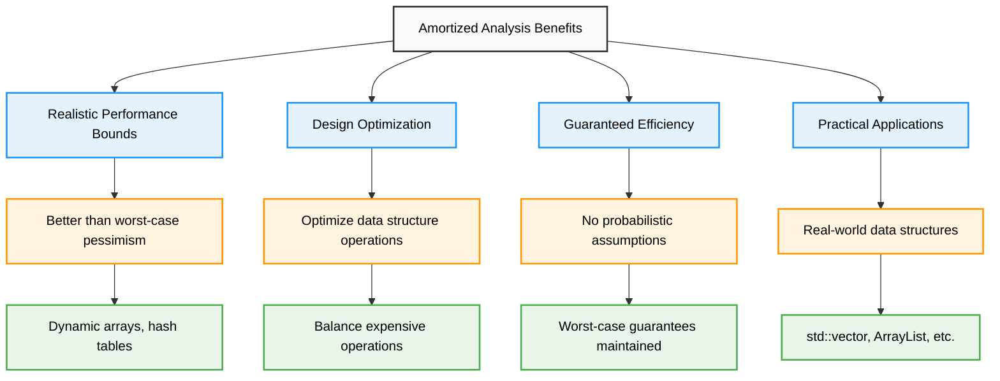

---

## Core Concepts

### Fundamental Principles

**Amortized Analysis** distributes the cost of expensive operations across multiple operations in a sequence.

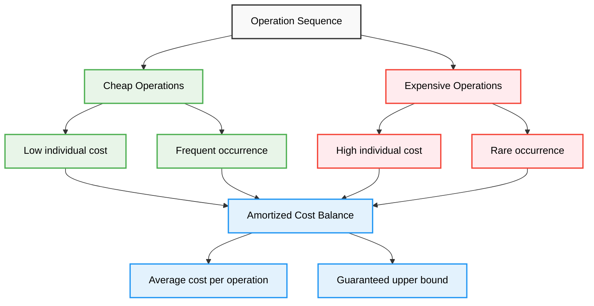

### Mathematical Foundation

```cpp
class AmortizedConcepts {
public:
    void explainBasicConcepts() {
        cout << "Amortized Analysis Fundamentals:" << endl;
        cout << "===============================" << endl;
        
        cout << "Key Idea:" << endl;
        cout << "- Analyze average cost over sequence of operations" << endl;
        cout << "- Expensive operations are balanced by cheap ones" << endl;
        cout << "- Provides guaranteed bounds without probability" << endl;
        
        cout << "\nMathematical Definition:" << endl;
        cout << "If T(n) is total cost of n operations, then:" << endl;
        cout << "Amortized cost = T(n) / n" << endl;
        
        cout << "\nExample - Dynamic Array:" << endl;
        cout << "- Individual insertions: mostly O(1), occasionally O(n)" << endl;
        cout << "- Sequence of n insertions: total cost O(n)" << endl;
        cout << "- Amortized cost per insertion: O(1)" << endl;
    }
    
    void compareWithOtherAnalysis() {
        cout << "\nComparison with Other Analysis Types:" << endl;
        cout << "====================================" << endl;
        
        cout << "Analysis Type    | Guarantees | Assumptions | Use Case" << endl;
        cout << "-----------------|------------|-------------|----------" << endl;
        cout << "Worst-Case       | Yes        | None        | Safety-critical" << endl;
        cout << "Average-Case     | No         | Input dist. | Typical performance" << endl;
        cout << "Amortized        | Yes        | None        | Sequence analysis" << endl;
        
        cout << "\nWhen to Use Amortized Analysis:" << endl;
        cout << "- Operations have varying costs" << endl;
        cout << "- Expensive operations are infrequent" << endl;
        cout << "- Need guaranteed bounds over sequences" << endl;
        cout << "- Designing efficient data structures" << endl;
    }
};
```

---

## Analysis Methods Overview

### Three Main Approaches

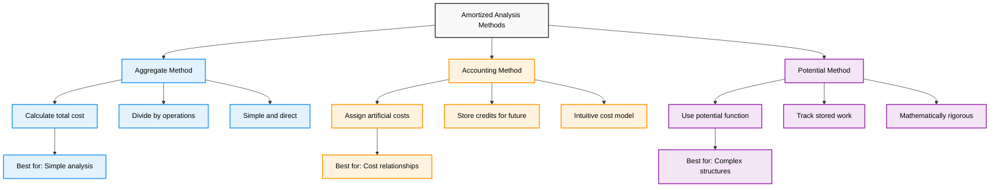

### Method Selection Guide

```cpp
class MethodSelection {
public:
    string selectMethod(ProblemCharacteristics problem) {
        cout << "Method Selection Guide:" << endl;
        cout << "======================" << endl;
        
        if (problem.hasSimpleCostStructure && problem.uniformOperations) {
            cout << "Recommended: Aggregate Method" << endl;
            cout << "Reason: Simple total cost calculation" << endl;
            return "Aggregate";
        }
        
        if (problem.hasClearCostRelationships && problem.intuitiveCredits) {
            cout << "Recommended: Accounting Method" << endl;
            cout << "Reason: Natural credit/debit model" << endl;
            return "Accounting";
        }
        
        if (problem.complexStateChanges || problem.needsRigorousProof) {
            cout << "Recommended: Potential Method" << endl;
            cout << "Reason: Mathematical precision required" << endl;
            return "Potential";
        }
        
        cout << "Default: Start with Aggregate Method" << endl;
        return "Aggregate";
    }
    
    void compareMethodComplexity() {
        cout << "\nMethod Complexity Comparison:" << endl;
        cout << "============================" << endl;
        
        cout << "Method      | Difficulty | Intuition | Rigor | Flexibility" << endl;
        cout << "------------|------------|-----------|-------|------------" << endl;
        cout << "Aggregate   | Easy       | High      | Low   | Low" << endl;
        cout << "Accounting  | Medium     | High      | Medium| Medium" << endl;
        cout << "Potential   | Hard       | Low       | High  | High" << endl;
    }
};
```

---

## Aggregate Method

### Definition and Process

**Aggregate Method** calculates the total cost of n operations and divides by n to get the amortized cost.

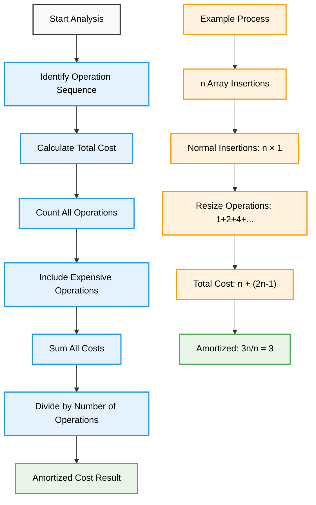

### Implementation Examples

#### Dynamic Array Analysis
```cpp
class AggregateMethodExamples {
public:
    // Dynamic Array with Doubling Strategy
    double analyzeDynamicArray(int n) {
        cout << "Aggregate Method - Dynamic Array Analysis:" << endl;
        cout << "=========================================" << endl;
        
        // Calculate insertion costs
        int insertionCost = n; // Each insertion costs 1
        
        // Calculate resize costs
        int resizeCost = 0;
        cout << "Resize costs at capacities: ";
        for (int capacity = 1; capacity < n; capacity *= 2) {
            resizeCost += capacity;
            cout << capacity << " ";
        }
        cout << endl;
        
        int totalCost = insertionCost + resizeCost;
        double amortizedCost = (double)totalCost / n;
        
        cout << "Analysis Results:" << endl;
        cout << "- Insertion costs: " << insertionCost << endl;
        cout << "- Resize costs: " << resizeCost << endl;
        cout << "- Total cost: " << totalCost << endl;
        cout << "- Operations: " << n << endl;
        cout << "- Amortized cost: " << amortizedCost << endl;
        
        // Theoretical bound
        cout << "Theoretical bound: resize cost ≤ 2n" << endl;
        cout << "Therefore: amortized cost ≤ 3" << endl;
        
        return amortizedCost;
    }
    
    // Binary Counter Analysis
    double analyzeBinaryCounter(int n) {
        cout << "\nAggregate Method - Binary Counter Analysis:" << endl;
        cout << "==========================================" << endl;
        
        int totalFlips = 0;
        
        // Bit i flips every 2^i operations
        cout << "Bit flip frequencies:" << endl;
        for (int bit = 0; bit < 32 && (1 << bit) <= n; bit++) {
            int frequency = 1 << bit;
            int flips = n / frequency;
            totalFlips += flips;
            
            cout << "Bit " << bit << ": flips every " << frequency 
                 << " ops, total flips = " << flips << endl;
        }
        
        double amortizedFlips = (double)totalFlips / n;
        
        cout << "Analysis Results:" << endl;
        cout << "- Total operations: " << n << endl;
        cout << "- Total bit flips: " << totalFlips << endl;
        cout << "- Amortized flips per increment: " << amortizedFlips << endl;
        cout << "- Theoretical bound: < 2 flips per increment" << endl;
        
        return amortizedFlips;
    }
    
    // Stack with Multipop Analysis
    void analyzeStackMultipop() {
        cout << "\nAggregate Method - Stack with Multipop:" << endl;
        cout << "======================================" << endl;
        
        cout << "Key Insight:" << endl;
        cout << "- Each element can be pushed at most once" << endl;
        cout << "- Each element can be popped at most once" << endl;
        cout << "- Total cost for n operations ≤ 2n" << endl;
        cout << "- Amortized cost per operation = O(1)" << endl;
        
        cout << "\nExample sequence:" << endl;
        cout << "Push(1), Push(2), Push(3), Multipop(2), Push(4)" << endl;
        cout << "Costs: 1 + 1 + 1 + 2 + 1 = 6" << endl;
        cout << "Operations: 5" << endl;
        cout << "Amortized: 6/5 = 1.2" << endl;
    }
};
```

---

## Accounting Method

### Definition and Process

**Accounting Method** assigns artificial costs to operations and stores excess cost as credit for future expensive operations.

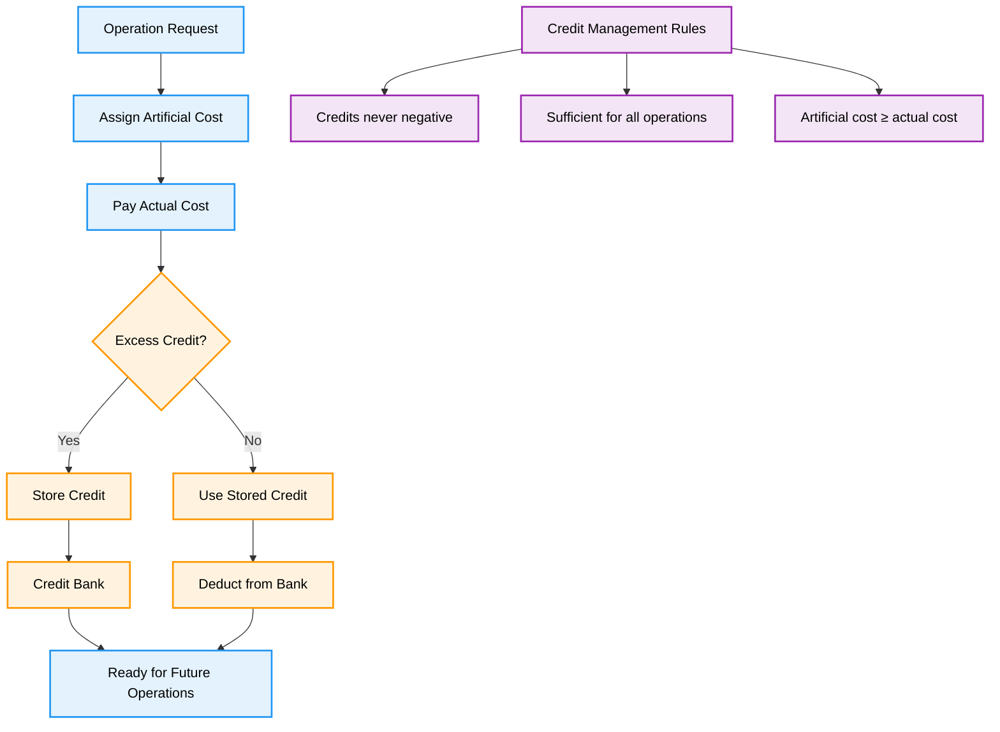

### Implementation Examples

#### Dynamic Array with Accounting
```cpp
class AccountingMethodExamples {
public:
    class DynamicArrayAccounting {
    private:
        vector<int> arr;
        int capacity;
        double totalCredit;
        
    public:
        DynamicArrayAccounting() : capacity(1), totalCredit(0) {
            arr.reserve(capacity);
        }
        
        void insert(int value) {
            cout << "\nInserting " << value << ":" << endl;
            
            // Charge 3 units per insertion
            double artificialCost = 3.0;
            double actualCost = 1.0; // Base insertion cost
            
            if (arr.size() == capacity) {
                // Resize needed
                double resizeCost = capacity; // Cost of copying elements
                actualCost += resizeCost;
                
                cout << "  Resize needed, copying " << capacity << " elements" << endl;
                cout << "  Using " << resizeCost << " credits for resize" << endl;
                
                if (totalCredit >= resizeCost) {
                    totalCredit -= resizeCost;
                } else {
                    cout << "  ERROR: Insufficient credits!" << endl;
                }
                
                capacity *= 2;
                arr.reserve(capacity);
            }
            
            arr.push_back(value);
            
            // Store excess as credit
            double excessCredit = artificialCost - 1.0; // 1.0 is base cost
            totalCredit += excessCredit;
            
            cout << "  Artificial cost: " << artificialCost << endl;
            cout << "  Actual cost: " << actualCost << endl;
            cout << "  Credit stored: " << excessCredit << endl;
            cout << "  Total credit: " << totalCredit << endl;
        }
        
        void analyzeCredits() {
            cout << "\nAccounting Analysis:" << endl;
            cout << "===================" << endl;
            cout << "Current size: " << arr.size() << endl;
            cout << "Current capacity: " << capacity << endl;
            cout << "Available credit: " << totalCredit << endl;
            cout << "Credit per element: " << totalCredit / arr.size() << endl;
            cout << "Amortized cost: 3 units per insertion" << endl;
        }
    };
    
    // Stack with Multipop Accounting
    class StackAccounting {
    private:
        stack<int> st;
        double totalCredit;
        
    public:
        StackAccounting() : totalCredit(0) {}
        
        void push(int value) {
            // Charge 2 units per push
            double artificialCost = 2.0;
            double actualCost = 1.0;
            
            st.push(value);
            
            // Store 1 unit as credit
            totalCredit += 1.0;
            
            cout << "Push " << value << ": charged " << artificialCost 
                 << ", stored 1 credit, total credit = " << totalCredit << endl;
        }
        
        void pop() {
            if (st.empty()) return;
            
            // Use 1 unit of credit
            totalCredit -= 1.0;
            
            int value = st.top();
            st.pop();
            
            cout << "Pop " << value << ": used 1 credit, remaining = " 
                 << totalCredit << endl;
        }
        
        void multipop(int k) {
            cout << "Multipop " << k << " elements:" << endl;
            for (int i = 0; i < k && !st.empty(); i++) {
                pop();
            }
        }
        
        void verifyInvariant() {
            cout << "\nInvariant Check:" << endl;
            cout << "Stack size: " << st.size() << endl;
            cout << "Available credit: " << totalCredit << endl;
            cout << "Invariant (credit = stack size): " 
                 << (abs(totalCredit - st.size()) < 0.001) << endl;
        }
    };
    
    void demonstrateAccounting() {
        cout << "Accounting Method Demonstration:" << endl;
        cout << "===============================" << endl;
        
        // Dynamic Array Example
        DynamicArrayAccounting dynArr;
        for (int i = 1; i <= 8; i++) {
            dynArr.insert(i);
        }
        dynArr.analyzeCredits();
        
        cout << "\n" << string(50, '-') << endl;
        
        // Stack Example
        StackAccounting stack;
        stack.push(1);
        stack.push(2);
        stack.push(3);
        stack.push(4);
        stack.verifyInvariant();
        
        stack.multipop(2);
        stack.verifyInvariant();
    }
};
```

---

## Potential Method

### Definition and Process

**Potential Method** uses a potential function Φ that maps data structure state to a number representing stored work.

**Formula**: Amortized Cost = Actual Cost + (Φ_after - Φ_before)

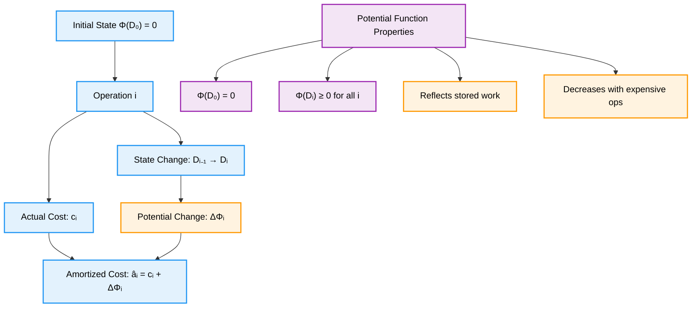

### Implementation Examples

#### Dynamic Array with Potential Method
```cpp
class PotentialMethodExamples {
public:
    class DynamicArrayPotential {
    private:
        vector<int> arr;
        int capacity;
        
        // Potential function: Φ = 2 * size - capacity
        double potential() const {
            return 2.0 * arr.size() - capacity;
        }
        
    public:
        DynamicArrayPotential() : capacity(1) {
            arr.reserve(capacity);
        }
        
        double insert(int value) {
            double potentialBefore = potential();
            double actualCost = 1.0; // Base insertion cost
            
            cout << "\nInserting " << value << ":" << endl;
            cout << "  Size before: " << arr.size() << ", Capacity: " << capacity << endl;
            cout << "  Potential before: " << potentialBefore << endl;
            
            if (arr.size() == capacity) {
                // Resize operation
                actualCost += capacity; // Cost of copying
                capacity *= 2;
                arr.reserve(capacity);
                cout << "  Resize: copied " << (capacity/2) << " elements" << endl;
                cout << "  New capacity: " << capacity << endl;
            }
            
            arr.push_back(value);
            double potentialAfter = potential();
            double potentialChange = potentialAfter - potentialBefore;
            double amortizedCost = actualCost + potentialChange;
            
            cout << "  Actual cost: " << actualCost << endl;
            cout << "  Potential after: " << potentialAfter << endl;
            cout << "  Potential change: " << potentialChange << endl;
            cout << "  Amortized cost: " << amortizedCost << endl;
            
            return amortizedCost;
        }
        
        void analyzePotentialFunction() {
            cout << "\nPotential Function Analysis:" << endl;
            cout << "===========================" << endl;
            cout << "Function: Φ = 2 * size - capacity" << endl;
            cout << "Current size: " << arr.size() << endl;
            cout << "Current capacity: " << capacity << endl;
            cout << "Current potential: " << potential() << endl;
            
            cout << "\nWhy this function works:" << endl;
            cout << "- Φ(empty array) = 2*0 - 1 = -1, but we set Φ₀ = 0" << endl;
            cout << "- Normal insertion: ΔΦ = +2, amortized = 1 + 2 = 3" << endl;
            cout << "- Resize insertion: ΔΦ = 2 - size, amortized = (1+size) + (2-size) = 3" << endl;
        }
    };
    
    // Binary Counter with Potential Method
    class BinaryCounterPotential {
    private:
        int counter;
        
        // Potential function: number of 1 bits
        double potential() const {
            return __builtin_popcount(counter);
        }
        
    public:
        BinaryCounterPotential() : counter(0) {}
        
        double increment() {
            double potentialBefore = potential();
            
            // Count bit flips (actual cost)
            int oldCounter = counter;
            counter++;
            int bitFlips = __builtin_popcount(oldCounter ^ counter);
            double actualCost = bitFlips;
            
            double potentialAfter = potential();
            double potentialChange = potentialAfter - potentialBefore;
            double amortizedCost = actualCost + potentialChange;
            
            cout << "Increment " << oldCounter << " → " << counter << ":" << endl;
            cout << "  Binary: " << bitset<4>(oldCounter) << " → " << bitset<4>(counter) << endl;
            cout << "  Bit flips: " << bitFlips << endl;
            cout << "  Potential: " << potentialBefore << " → " << potentialAfter << endl;
            cout << "  Amortized cost: " << amortizedCost << endl;
            
            return amortizedCost;
        }
        
        void analyzePotentialFunction() {
            cout << "\nBinary Counter Potential Analysis:" << endl;
            cout << "=================================" << endl;
            cout << "Function: Φ = number of 1 bits" << endl;
            cout << "Current value: " << counter << endl;
            cout << "Binary: " << bitset<8>(counter) << endl;
            cout << "Current potential: " << potential() << endl;
            
            cout << "\nWhy this function works:" << endl;
            cout << "- Each increment flips rightmost 0 and some 1s" << endl;
            cout << "- Flipping 0→1 increases potential by 1" << endl;
            cout << "- Flipping 1→0 decreases potential by 1" << endl;
            cout << "- Net effect: amortized cost ≤ 2" << endl;
        }
    };
    
    void demonstratePotentialMethod() {
        cout << "Potential Method Demonstration:" << endl;
        cout << "==============================" << endl;
        
        // Dynamic Array Example
        DynamicArrayPotential dynArr;
        for (int i = 1; i <= 5; i++) {
            dynArr.insert(i);
        }
        dynArr.analyzePotentialFunction();
        
        cout << "\n" << string(50, '-') << endl;
        
        // Binary Counter Example
        BinaryCounterPotential counter;
        for (int i = 0; i < 8; i++) {
            counter.increment();
        }
        counter.analyzePotentialFunction();
    }
};
```

---

## Dynamic Array Analysis

### Complete Analysis Using All Three Methods

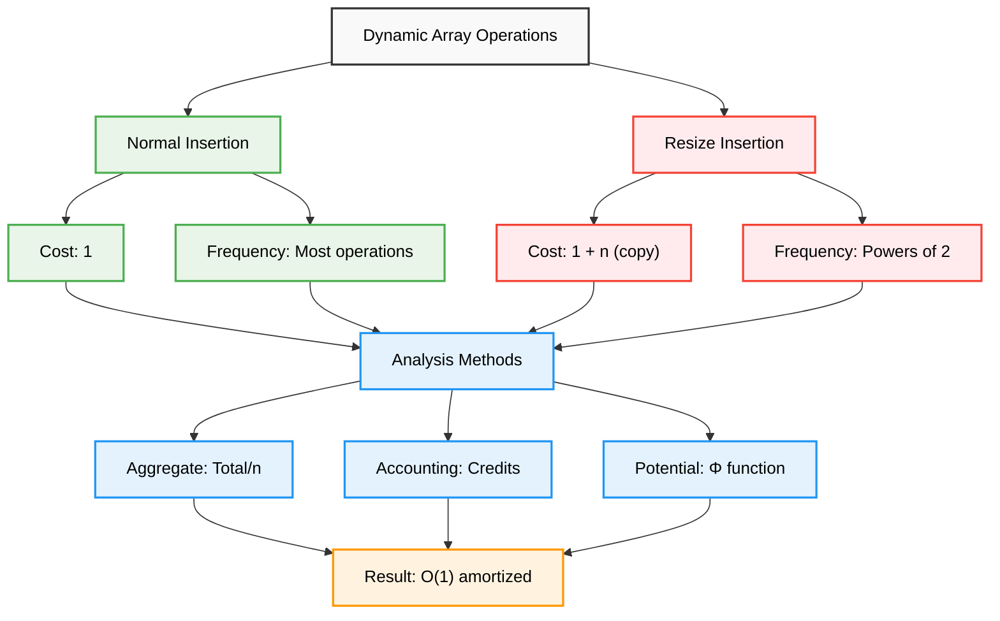

### Comprehensive Implementation

```cpp
class DynamicArrayCompleteAnalysis {
public:
    void completeAnalysis(int n) {
        cout << "DYNAMIC ARRAY COMPLETE AMORTIZED ANALYSIS" << endl;
        cout << "=========================================" << endl;
        cout << "Analyzing " << n << " insertions with doubling strategy\n" << endl;
        
        // Method 1: Aggregate Analysis
        aggregateAnalysis(n);
        cout << endl;
        
        // Method 2: Accounting Analysis
        accountingAnalysis(n);
        cout << endl;
        
        // Method 3: Potential Analysis
        potentialAnalysis(n);
        cout << endl;
        
        // Comparison and Insights
        compareAllMethods();
    }
    
private:
    void aggregateAnalysis(int n) {
        cout << "1. AGGREGATE METHOD" << endl;
        cout << "==================" << endl;
        
        // Calculate costs
        int insertCost = n; // Each insertion costs 1
        int resizeCost = 0;
        
        cout << "Resize operations occur at sizes: ";
        for (int size = 1; size < n; size *= 2) {
            resizeCost += size;
            cout << size << " ";
        }
        cout << endl;
        
        // Geometric series sum: 1 + 2 + 4 + ... + n/2 < 2n
        int totalCost = insertCost + resizeCost;
        double amortizedCost = (double)totalCost / n;
        
        cout << "Cost breakdown:" << endl;
        cout << "- Normal insertions: " << insertCost << endl;
        cout << "- Resize operations: " << resizeCost << " (< 2n)" << endl;
        cout << "- Total cost: " << totalCost << " (< 3n)" << endl;
        cout << "- Amortized per operation: " << amortizedCost << " (< 3)" << endl;
    }
    
    void accountingAnalysis(int n) {
        cout << "2. ACCOUNTING METHOD" << endl;
        cout << "===================" << endl;
        
        cout << "Credit scheme:" << endl;
        cout << "- Charge 3 units per insertion" << endl;
        cout << "- Pay 1 unit for actual insertion" << endl;
        cout << "- Store 2 units as credit" << endl;
        
        cout << "\nCredit usage:" << endl;
        cout << "- When array has size k, total credit = 2k" << endl;
        cout << "- Resize at size k costs k units (copying)" << endl;
        cout << "- Available credit = 2k ≥ k (sufficient)" << endl;
        
        cout << "\nResult: 3 units per insertion guarantees all costs covered" << endl;
    }
    
    void potentialAnalysis(int n) {
        cout << "3. POTENTIAL METHOD" << endl;
        cout << "==================" << endl;
        
        cout << "Potential function: Φ = 2 × size - capacity" << endl;
        
        cout << "\nNormal insertion analysis:" << endl;
        cout << "- Actual cost: 1" << endl;
        cout << "- Size increases by 1, capacity unchanged" << endl;
        cout << "- Potential change: +2" << endl;
        cout << "- Amortized cost: 1 + 2 = 3" << endl;
        
        cout << "\nResize insertion analysis:" << endl;
        cout << "- Actual cost: 1 + size (copying)" << endl;
        cout << "- Before resize: Φ = 2×size - size = size" << endl;
        cout << "- After resize: Φ = 2×(size+1) - 2×size = 2" << endl;
        cout << "- Potential change: 2 - size" << endl;
        cout << "- Amortized cost: (1 + size) + (2 - size) = 3" << endl;
    }
    
    void compareAllMethods() {
        cout << "COMPARISON OF ALL METHODS" << endl;
        cout << "========================" << endl;
        
        cout << "Method      | Amortized Cost | Complexity | Insight" << endl;
        cout << "------------|----------------|------------|--------" << endl;
        cout << "Aggregate   | ≤ 3           | Easy       | Total cost bound" << endl;
        cout << "Accounting  | = 3           | Medium     | Credit mechanism" << endl;
        cout << "Potential   | = 3           | Hard       | Energy function" << endl;
        
        cout << "\nKey Insights:" << endl;
        cout << "- All methods prove O(1) amortized insertion cost" << endl;
        cout << "- Expensive resize operations are rare (powers of 2)" << endl;
        cout << "- Cost is distributed across many cheap operations" << endl;
        cout << "- Doubling strategy is optimal for amortized performance" << endl;
        
        cout << "\nPractical Impact:" << endl;
        cout << "- std::vector, ArrayList use this strategy" << endl;
        cout << "- Provides predictable performance for sequences" << endl;
        cout << "- Better than increment-by-constant strategies" << endl;
    }
};
```

---

## Stack Operations

### Stack with Multipop Analysis

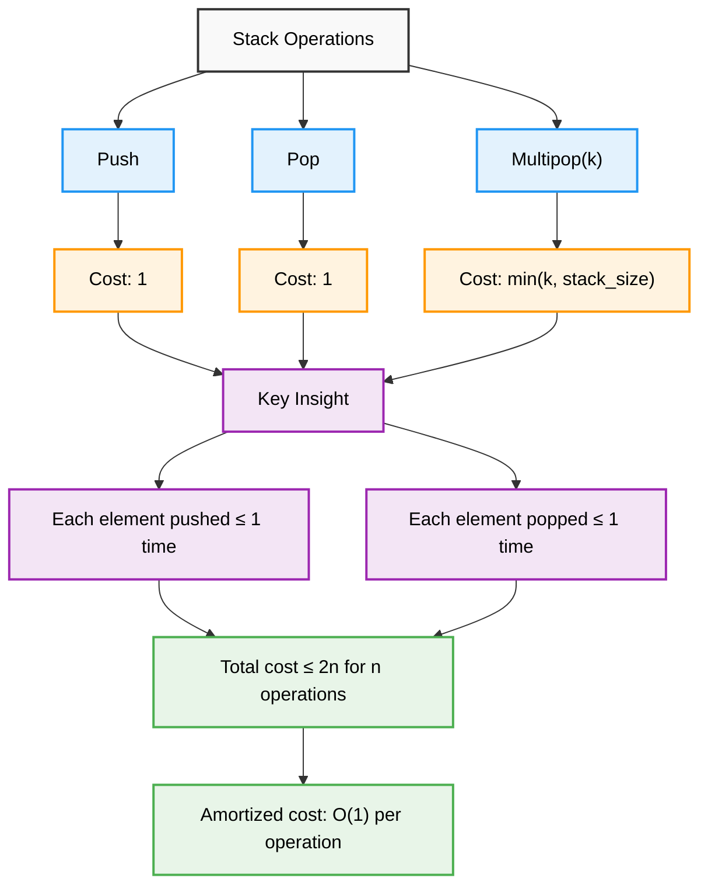

### Implementation and Analysis

```cpp
class StackMultipopAnalysis {
private:
    stack<int> st;
    int totalOperations;
    int totalCost;
    
public:
    StackMultipopAnalysis() : totalOperations(0), totalCost(0) {}
    
    void push(int value) {
        st.push(value);
        totalOperations++;
        totalCost += 1;
        
        cout << "Push " << value << " (cost: 1, stack size: " << st.size() << ")" << endl;
    }
    
    int pop() {
        if (st.empty()) return -1;
        
        int value = st.top();
        st.pop();
        totalOperations++;
        totalCost += 1;
        
        cout << "Pop " << value << " (cost: 1, stack size: " << st.size() << ")" << endl;
        return value;
    }
    
    vector<int> multipop(int k) {
        vector<int> result;
        int actualPops = min(k, (int)st.size());
        
        cout << "Multipop(" << k << ") - will pop " << actualPops << " elements:" << endl;
        
        for (int i = 0; i < actualPops; i++) {
            result.push_back(pop());
        }
        
        // Adjust operation count (multipop counts as 1 operation)
        totalOperations -= actualPops - 1;
        
        return result;
    }
    
    void analyzeAllMethods() {
        cout << "\nSTACK WITH MULTIPOP - ALL ANALYSIS METHODS" << endl;
        cout << "==========================================" << endl;
        
        // Aggregate Method
        cout << "1. AGGREGATE METHOD:" << endl;
        cout << "- Each element can be pushed at most once" << endl;
        cout << "- Each element can be popped at most once" << endl;
        cout << "- For n operations, total cost ≤ 2n" << endl;
        cout << "- Amortized cost per operation ≤ 2" << endl;
        
        // Accounting Method
        cout << "\n2. ACCOUNTING METHOD:" << endl;
        cout << "- Charge 2 units for each push" << endl;
        cout << "- 1 unit pays for push, 1 unit stored as credit" << endl;
        cout << "- Pop operations use stored credit (charge 0)" << endl;
        cout << "- Multipop uses accumulated credits" << endl;
        cout << "- Amortized: Push = 2, Pop = 0, Multipop = 0" << endl;
        
        // Potential Method
        cout << "\n3. POTENTIAL METHOD:" << endl;
        cout << "- Potential function: Φ = stack size" << endl;
        cout << "- Push: actual cost = 1, ΔΦ = +1, amortized = 2" << endl;
        cout << "- Pop: actual cost = 1, ΔΦ = -1, amortized = 0" << endl;
        cout << "- Multipop(k): actual cost = k, ΔΦ = -k, amortized = 0" << endl;
        
        cout << "\nCurrent Statistics:" << endl;
        cout << "- Total operations: " << totalOperations << endl;
        cout << "- Total actual cost: " << totalCost << endl;
        cout << "- Average cost per operation: " << (double)totalCost / totalOperations << endl;
        cout << "- Stack size: " << st.size() << endl;
    }
    
    void demonstrateOperations() {
        cout << "STACK MULTIPOP DEMONSTRATION" << endl;
        cout << "============================" << endl;
        
        // Push several elements
        for (int i = 1; i <= 6; i++) {
            push(i);
        }
        
        cout << "\nPerforming multipop(3):" << endl;
        vector<int> popped = multipop(3);
        cout << "Popped elements: ";
        for (int x : popped) cout << x << " ";
        cout << endl;
        
        cout << "\nPush more elements:" << endl;
        push(7);
        push(8);
        
        cout << "\nPerforming multipop(10) (more than stack size):" << endl;
        popped = multipop(10);
        cout << "Popped elements: ";
        for (int x : popped) cout << x << " ";
        cout << endl;
        
        analyzeAllMethods();
    }
};
```

---

## Binary Counter

### Bit Flip Analysis

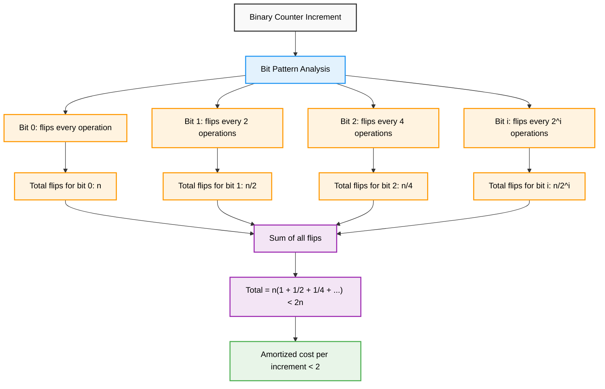

### Complete Implementation

```cpp
class BinaryCounterAnalysis {
private:
    int counter;
    int totalIncrements;
    int totalFlips;
    
public:
    BinaryCounterAnalysis() : counter(0), totalIncrements(0), totalFlips(0) {}
    
    int increment() {
        int oldCounter = counter;
        counter++;
        totalIncrements++;
        
        // Count bit flips
        int flips = __builtin_popcount(oldCounter ^ counter);
        totalFlips += flips;
        
        cout << "Increment " << setw(2) << oldCounter << " → " << setw(2) << counter 
             << " | Binary: " << bitset<4>(oldCounter) << " → " << bitset<4>(counter)
             << " | Flips: " << flips << endl;
        
        return flips;
    }
    
    void analyzeAllMethods(int n) {
        cout << "\nBINARY COUNTER - ALL ANALYSIS METHODS" << endl;
        cout << "====================================" << endl;
        
        // Aggregate Method
        cout << "1. AGGREGATE METHOD:" << endl;
        cout << "Bit flip frequencies:" << endl;
        int theoreticalFlips = 0;
        for (int bit = 0; bit < 8 && (1 << bit) <= n; bit++) {
            int frequency = 1 << bit;
            int flips = n / frequency;
            theoreticalFlips += flips;
            cout << "  Bit " << bit << ": flips every " << setw(2) << frequency 
                 << " operations, total = " << setw(3) << flips << endl;
        }
        cout << "Total theoretical flips: " << theoreticalFlips << endl;
        cout << "Amortized flips per increment: " << (double)theoreticalFlips / n << endl;
        
        // Accounting Method
        cout << "\n2. ACCOUNTING METHOD:" << endl;
        cout << "- Charge 2 units per increment" << endl;
        cout << "- 1 unit pays for setting rightmost 0 to 1" << endl;
        cout << "- 1 unit stored as credit on the new 1 bit" << endl;
        cout << "- When 1 bit flips to 0, use its stored credit" << endl;
        cout << "- Result: 2 units per increment covers all costs" << endl;
        
        // Potential Method
        cout << "\n3. POTENTIAL METHOD:" << endl;
        cout << "- Potential function: Φ = number of 1 bits" << endl;
        cout << "- Each increment flips rightmost 0 and some 1s" << endl;
        cout << "- Setting 0→1: +1 potential, cost paid by operation" << endl;
        cout << "- Setting 1→0: -1 potential, cost paid by potential decrease" << endl;
        cout << "- Net amortized cost ≤ 2 per increment" << endl;
        
        cout << "\nActual Results:" << endl;
        cout << "- Total increments: " << totalIncrements << endl;
        cout << "- Total bit flips: " << totalFlips << endl;
        cout << "- Average flips per increment: " << (double)totalFlips / totalIncrements << endl;
        cout << "- Current counter value: " << counter << endl;
        cout << "- Current 1-bits (potential): " << __builtin_popcount(counter) << endl;
    }
    
    void demonstrateIncrement(int n) {
        cout << "BINARY COUNTER DEMONSTRATION" << endl;
        cout << "============================" << endl;
        cout << "Incrementing from 0 to " << n-1 << ":" << endl;
        
        for (int i = 0; i < n; i++) {
            increment();
        }
        
        analyzeAllMethods(n);
    }
    
    void showBitFlipPattern() {
        cout << "\nBIT FLIP PATTERN ANALYSIS:" << endl;
        cout << "=========================" << endl;
        
        cout << "Operation | Binary | Flips | Pattern" << endl;
        cout << "----------|--------|-------|--------" << endl;
        
        int tempCounter = 0;
        for (int i = 0; i < 16; i++) {
            int oldCounter = tempCounter;
            tempCounter++;
            int flips = __builtin_popcount(oldCounter ^ tempCounter);
            
            cout << setw(9) << i << " | " << bitset<4>(tempCounter) 
                 << " | " << setw(5) << flips << " | ";
            
            // Show which bits flipped
            for (int bit = 0; bit < 4; bit++) {
                if ((oldCounter ^ tempCounter) & (1 << bit)) {
                    cout << "bit" << bit << " ";
                }
            }
            cout << endl;
        }
    }
};
```

---

## Advanced Applications

### Splay Trees

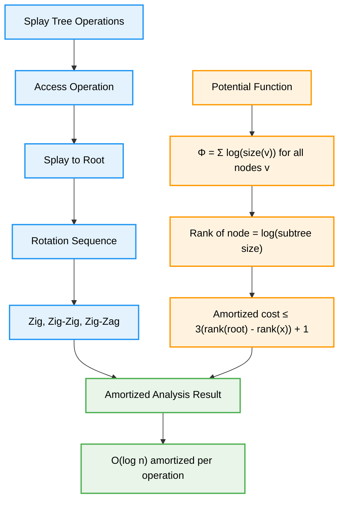

### Fibonacci Heap

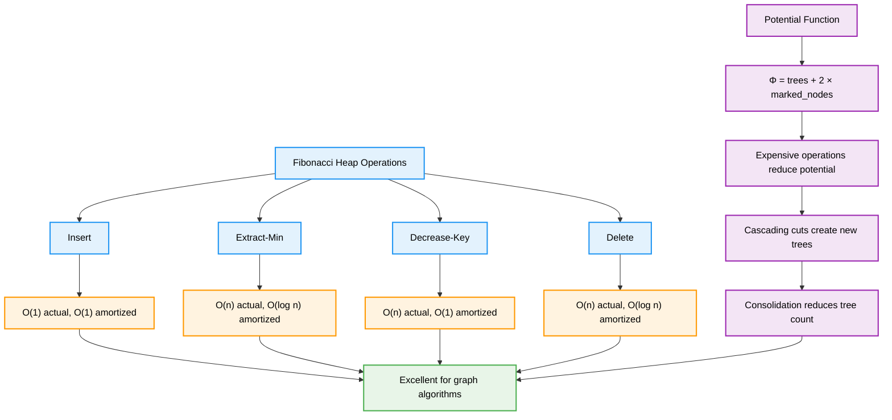

### Disjoint Set Union

```cpp
class DisjointSetAmortizedAnalysis {
private:
    vector<int> parent;
    vector<int> rank;
    
public:
    DisjointSetAmortizedAnalysis(int n) : parent(n), rank(n, 0) {
        for (int i = 0; i < n; i++) {
            parent[i] = i;
        }
    }
    
    int find(int x) {
        if (parent[x] != x) {
            parent[x] = find(parent[x]); // Path compression
        }
        return parent[x];
    }
    
    void unionSets(int x, int y) {
        int rootX = find(x);
        int rootY = find(y);
        
        if (rootX != rootY) {
            // Union by rank
            if (rank[rootX] < rank[rootY]) {
                parent[rootX] = rootY;
            } else if (rank[rootX] > rank[rootY]) {
                parent[rootY] = rootX;
            } else {
                parent[rootY] = rootX;
                rank[rootX]++;
            }
        }
    }
    
    void analyzeComplexity() {
        cout << "DISJOINT SET UNION AMORTIZED ANALYSIS" << endl;
        cout << "====================================" << endl;
        
        cout << "Without optimizations:" << endl;
        cout << "- Find: O(n) worst case (degenerate tree)" << endl;
        cout << "- Union: O(n) worst case" << endl;
        
        cout << "\nWith Union by Rank only:" << endl;
        cout << "- Tree height ≤ log n" << endl;
        cout << "- Find: O(log n)" << endl;
        cout << "- Union: O(log n)" << endl;
        
        cout << "\nWith Path Compression only:" << endl;
        cout << "- Amortized analysis complex" << endl;
        cout << "- Find: O(log n) amortized" << endl;
        
        cout << "\nWith both optimizations:" << endl;
        cout << "- Uses inverse Ackermann function α(n)" << endl;
        cout << "- Find: O(α(n)) amortized" << endl;
        cout << "- Union: O(α(n)) amortized" << endl;
        cout << "- α(n) ≤ 4 for all practical values of n" << endl;
        
        cout << "\nInverse Ackermann growth:" << endl;
        cout << "- α(16) = 3" << endl;
        cout << "- α(65536) = 4" << endl;
        cout << "- α(2^65536) = 5" << endl;
        cout << "- Practically constant!" << endl;
    }
};
```

---

## Best Practices

### Method Selection Guidelines

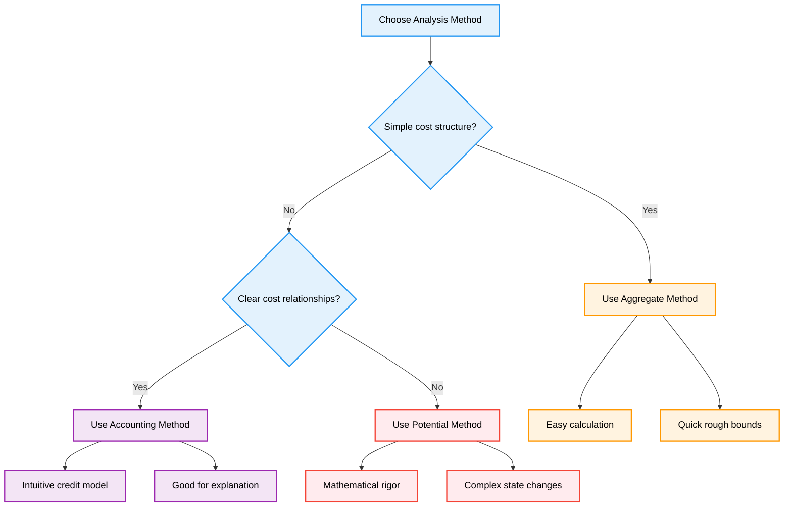

### Common Pitfalls and Solutions

```cpp
class AmortizedAnalysisBestPractices {
public:
    void commonPitfalls() {
        cout << "COMMON PITFALLS IN AMORTIZED ANALYSIS" << endl;
        cout << "====================================" << endl;
        
        cout << "1. NEGATIVE POTENTIAL:" << endl;
        cout << "Problem: Φ(state) < 0 violates potential method requirements" << endl;
        cout << "Solution: Ensure Φ(initial) = 0 and Φ(any state) ≥ 0" << endl;
        cout << "Example: Use Φ = max(0, 2×size - capacity) instead of 2×size - capacity" << endl;
        
        cout << "\n2. INSUFFICIENT CREDITS:" << endl;
        cout << "Problem: Credit balance goes negative in accounting method" << endl;
        cout << "Solution: Verify credit sufficiency for all operation sequences" << endl;
        cout << "Example: Stack needs 1 credit per element, not per operation" << endl;
        
        cout << "\n3. WRONG POTENTIAL FUNCTION:" << endl;
        cout << "Problem: Potential doesn't reflect actual stored work" << endl;
        cout << "Solution: Potential should increase with stored work, decrease with expensive ops" << endl;
        cout << "Example: Binary counter Φ = 1-bits, not total bits" << endl;
        
        cout << "\n4. CONFUSING AMORTIZED WITH AVERAGE:" << endl;
        cout << "Problem: Thinking amortized = expected over random inputs" << endl;
        cout << "Solution: Amortized provides worst-case guarantees over any sequence" << endl;
        cout << "Example: Dynamic array O(1) amortized ≠ O(1) expected" << endl;
    }
    
    void designGuidelines() {
        cout << "\nDESIGN GUIDELINES" << endl;
        cout << "=================" << endl;
        
        cout << "1. Identify expensive operations and their frequency" << endl;
        cout << "2. Find what makes operations expensive" << endl;
        cout << "3. Determine how to 'pay' for expensive operations" << endl;
        cout << "4. Choose appropriate analysis method" << endl;
        cout << "5. Verify bounds hold for all possible sequences" << endl;
        
        cout << "\nPOTENTIAL FUNCTION DESIGN:" << endl;
        cout << "- Should be 0 initially" << endl;
        cout << "- Should be non-negative always" << endl;
        cout << "- Should increase with 'stored work'" << endl;
        cout << "- Should decrease when work is 'released'" << endl;
        cout << "- Should make expensive operations have low amortized cost" << endl;
        
        cout << "\nACCOUNTING METHOD DESIGN:" << endl;
        cout << "- Assign costs that never make credits negative" << endl;
        cout << "- Store credits on data structure elements" << endl;
        cout << "- Use credits to pay for expensive operations" << endl;
        cout << "- Verify invariant: credits ≥ 0 always" << endl;
    }
    
    void practicalApplications() {
        cout << "\nPRACTICAL APPLICATIONS" << endl;
        cout << "=====================" << endl;
        
        cout << "Data Structures using Amortized Analysis:" << endl;
        cout << "- std::vector (dynamic array)" << endl;
        cout << "- std::unordered_map (hash table with resizing)" << endl;
        cout << "- Splay trees (self-adjusting BST)" << endl;
        cout << "- Fibonacci heaps (priority queues)" << endl;
        cout << "- Disjoint set union (union-find)" << endl;
        
        cout << "\nAlgorithms using Amortized Analysis:" << endl;
        cout << "- Incremental garbage collection" << endl;
        cout << "- Dynamic programming with memoization" << endl;
        cout << "- Online algorithms with competitive analysis" << endl;
        cout << "- Cache replacement policies" << endl;
        
        cout << "\nInterview Relevance:" << endl;
        cout << "- Explains why std::vector.push_back() is O(1)" << endl;
        cout << "- Justifies hash table performance claims" << endl;
        cout << "- Demonstrates advanced algorithmic thinking" << endl;
        cout << "- Shows understanding of practical vs theoretical complexity" << endl;
    }
};
```

---

## Summary

Amortized analysis provides powerful techniques for understanding the true performance of algorithms and data structures:

**Core Methods**: Master aggregate, accounting, and potential methods for different scenarios  
**Guaranteed Bounds**: Provides worst-case guarantees over operation sequences without probabilistic assumptions  
**Practical Relevance**: Explains performance of real-world data structures like dynamic arrays and hash tables  
**Design Tool**: Helps optimize data structure operations by balancing expensive and cheap operations  
**Interview Skills**: Demonstrates advanced algorithmic thinking and understanding of performance analysis  
**Mathematical Rigor**: Potential method provides formal framework for complex amortized analysis  

**Key Insight**: "Expensive operations are rare and balanced by many cheap operations, providing better practical bounds than pure worst-case analysis"

---

<div align="center">

**Master Amortized Analysis, Master Performance Optimization**

*Where mathematical rigor meets practical efficiency*

</div>