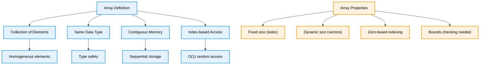
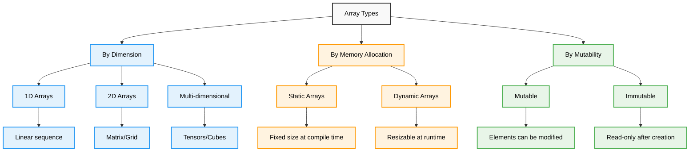
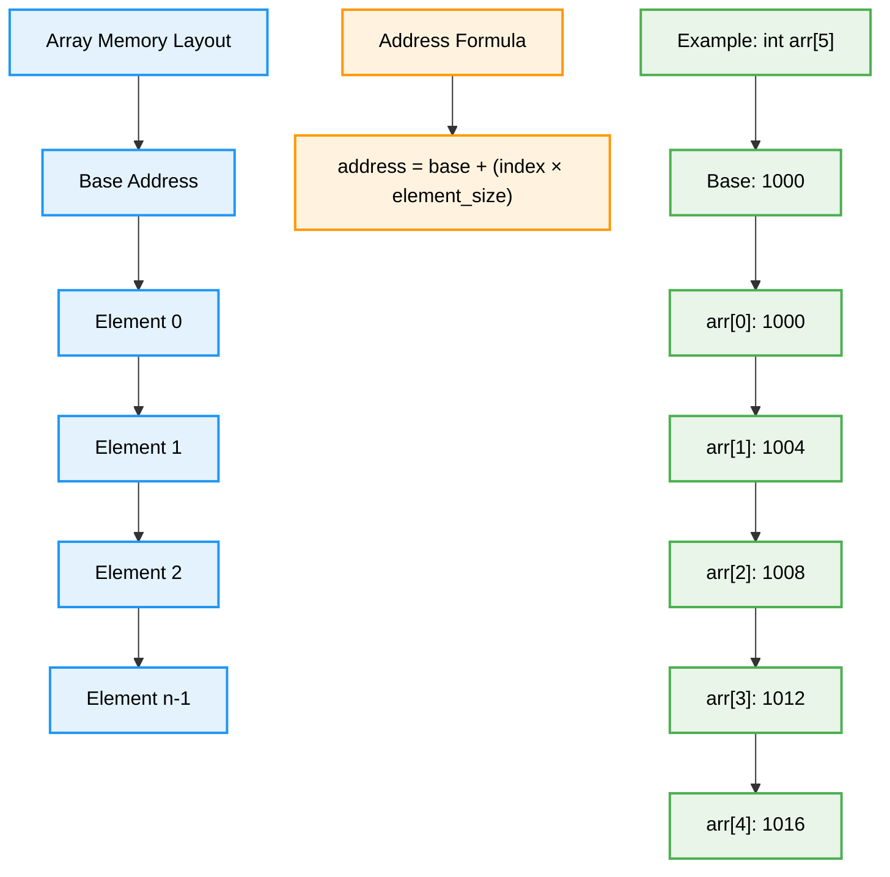
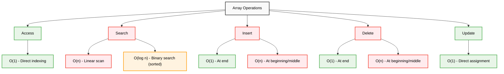
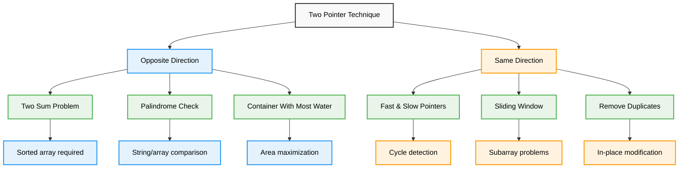
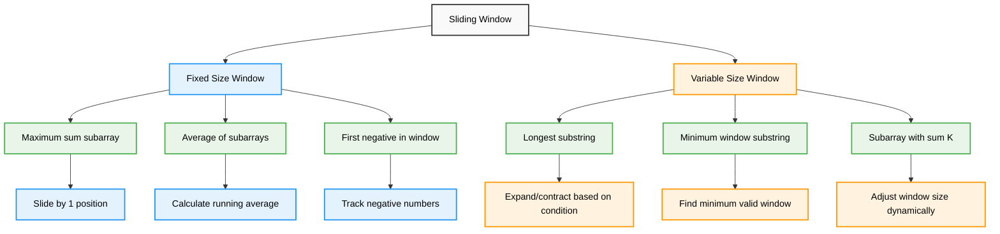
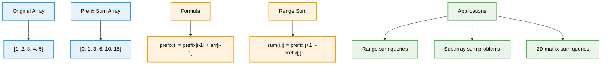
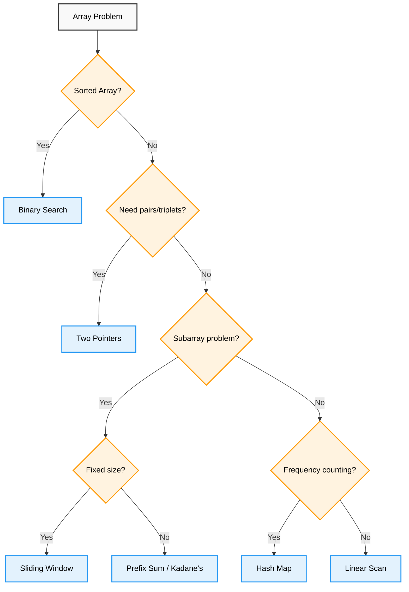

# Arrays — Complete Professional <div align="center">Guide</div>

<div align="center">


**Master the foundation of all data structures and algorithmic thinking**

</div>

---

## Table of Contents

1. [Introduction](#introduction)
2. [Array Fundamentals](#array-fundamentals)
3. [Types of Arrays](#types-of-arrays)
4. [Memory Layout](#memory-layout)
5. [Basic Operations](#basic-operations)
6. [Two Pointer Technique](#two-pointer-technique)
7. [Sliding Window Technique](#sliding-window-technique)
8. [Prefix Sum Technique](#prefix-sum-technique)
9. [Common Patterns](#common-patterns)
10. [Best Practices](#best-practices)

---

## Introduction

<div align="center">

</div>

**Arrays** are the most fundamental data structure in computer science, providing a collection of elements stored in contiguous memory locations. They serve as the building block for more complex data structures and are essential for efficient algorithm implementation.

### Why Arrays Matter

```mermaid
flowchart TD
    A["Arrays Importance"] --> B["Foundation of Programming"]
    A --> C["Memory Efficiency"]
    A --> D["Cache Performance"]
    A --> E["Algorithm Building Block"]
    
    B --> F["First data structure learned"]
    B --> G["Universal language support"]
    B --> H["Simple yet powerful concept"]
    
    C --> I["Contiguous memory allocation"]
    C --> J["Minimal memory overhead"]
    C --> K["Predictable memory usage"]
    
    D --> L["Spatial locality of reference"]
    D --> M["Cache-friendly access patterns"]
    D --> N["Hardware optimization benefits"]
    
    E --> O["Sorting algorithms foundation"]
    E --> P["Dynamic programming base"]
    E --> Q["Graph representation"]
    
    classDef default fill:#f9f9f9,stroke:#333,stroke-width:2px,color:#000
    classDef foundation fill:#e3f2fd,stroke:#2196f3,stroke-width:2px,color:#000
    classDef efficiency fill:#fff3e0,stroke:#ff9800,stroke-width:2px,color:#000
    classDef performance fill:#e8f5e8,stroke:#4caf50,stroke-width:2px,color:#000
    classDef algorithms fill:#f3e5f5,stroke:#9c27b0,stroke-width:2px,color:#000
    class B,F,G,H foundation
    class C,I,J,K efficiency
    class D,L,M,N performance
    class E,O,P,Q algorithms
```



---

## Array Fundamentals

<div align="center">

</div>

### Core Concepts



### Basic Array Declaration

```cpp
// Static Arrays (C++)
int arr[5];                    // Uninitialized array
int arr[5] = {1, 2, 3, 4, 5}; // Initialized array
int arr[] = {1, 2, 3, 4, 5};  // Size inferred from initializer

// Dynamic Arrays (C++)
vector<int> arr(5);            // Size 5, default initialized
vector<int> arr = {1, 2, 3, 4, 5}; // Initialized vector
vector<int> arr(5, 10);        // Size 5, all elements = 10
```

```python
# Python Lists (Dynamic Arrays)
arr = [1, 2, 3, 4, 5]         # Initialized list
arr = [0] * 5                 # Size 5, all zeros
arr = list(range(1, 6))       # [1, 2, 3, 4, 5]

# NumPy Arrays (for numerical computing)
import numpy as np
arr = np.array([1, 2, 3, 4, 5])  # NumPy array
arr = np.zeros(5)                # Array of zeros
arr = np.ones(5)                 # Array of ones
```

```java
// Java Arrays
int[] arr = new int[5];       // Uninitialized (default to 0)
int[] arr = {1, 2, 3, 4, 5};  // Initialized array
int[] arr = new int[]{1, 2, 3, 4, 5}; // Explicit initialization

// ArrayList (Dynamic)
ArrayList<Integer> arr = new ArrayList<>();
ArrayList<Integer> arr = new ArrayList<>(Arrays.asList(1, 2, 3, 4, 5));
```

---

## Types of Arrays

<div align="center">

</div>

### Array Classification



### 1D Array Example

<div align="center">

</div>

```cpp
class OneDimensionalArray {
public:
    void demonstrateBasics() {
        // Declaration and initialization
        vector<int> arr = {10, 20, 30, 40, 50};
        
        cout << "1D Array Operations:" << endl;
        cout << "Array: ";
        for (int i = 0; i < arr.size(); i++) {
            cout << arr[i] << " ";
        }
        cout << endl;
        
        // Access elements
        cout << "First element: " << arr[0] << endl;
        cout << "Last element: " << arr[arr.size() - 1] << endl;
        
        // Modify elements
        arr[2] = 35;
        cout << "After modification: ";
        for (int element : arr) {
            cout << element << " ";
        }
        cout << endl;
    }
    
    void arrayTraversal() {
        vector<int> arr = {1, 2, 3, 4, 5};
        
        // Forward traversal
        cout << "Forward: ";
        for (int i = 0; i < arr.size(); i++) {
            cout << arr[i] << " ";
        }
        cout << endl;
        
        // Backward traversal
        cout << "Backward: ";
        for (int i = arr.size() - 1; i >= 0; i--) {
            cout << arr[i] << " ";
        }
        cout << endl;
        
        // Range-based loop (C++11+)
        cout << "Range-based: ";
        for (const auto& element : arr) {
            cout << element << " ";
        }
        cout << endl;
    }
};
```

### 2D Arrays

<div align="center">

</div>

```cpp
class TwoDimensionalArray {
public:
    void demonstrate2DArrays() {
        // Static 2D array
        int matrix[3][4] = {
            {1, 2, 3, 4},
            {5, 6, 7, 8},
            {9, 10, 11, 12}
        };
        
        // Dynamic 2D array using vectors
        vector<vector<int>> dynamicMatrix = {
            {1, 2, 3, 4},
            {5, 6, 7, 8},
            {9, 10, 11, 12}
        };
        
        cout << "2D Array (Matrix):" << endl;
        for (int i = 0; i < 3; i++) {
            for (int j = 0; j < 4; j++) {
                cout << setw(3) << dynamicMatrix[i][j] << " ";
            }
            cout << endl;
        }
    }
    
    void matrixOperations() {
        vector<vector<int>> matrix = {
            {1, 2, 3},
            {4, 5, 6},
            {7, 8, 9}
        };
        
        int rows = matrix.size();
        int cols = matrix[0].size();
        
        // Row-wise traversal
        cout << "Row-wise traversal:" << endl;
        for (int i = 0; i < rows; i++) {
            for (int j = 0; j < cols; j++) {
                cout << matrix[i][j] << " ";
            }
            cout << endl;
        }
        
        // Column-wise traversal
        cout << "Column-wise traversal:" << endl;
        for (int j = 0; j < cols; j++) {
            for (int i = 0; i < rows; i++) {
                cout << matrix[i][j] << " ";
            }
            cout << endl;
        }
        
        // Diagonal traversal
        cout << "Main diagonal: ";
        for (int i = 0; i < min(rows, cols); i++) {
            cout << matrix[i][i] << " ";
        }
        cout << endl;
    }
};
```

---

## Memory Layout

### Address Calculation



```cpp
class MemoryLayoutDemo {
public:
    void demonstrateMemoryLayout() {
        int arr[5] = {10, 20, 30, 40, 50};
        
        cout << "Memory Layout Analysis:" << endl;
        cout << "======================" << endl;
        
        for (int i = 0; i < 5; i++) {
            cout << "arr[" << i << "] = " << setw(2) << arr[i] 
                 << " at address: " << &arr[i] 
                 << " (offset: " << (char*)&arr[i] - (char*)&arr[0] << ")" << endl;
        }
        
        cout << "\nElement size: " << sizeof(arr[0]) << " bytes" << endl;
        cout << "Total array size: " << sizeof(arr) << " bytes" << endl;
        
        // Demonstrate pointer arithmetic
        int* ptr = arr;
        cout << "\nPointer arithmetic:" << endl;
        for (int i = 0; i < 5; i++) {
            cout << "*(ptr + " << i << ") = " << *(ptr + i) << endl;
        }
    }
    
    void cacheLocalityDemo() {
        const int SIZE = 1000000;
        vector<int> arr(SIZE);
        
        // Initialize array
        for (int i = 0; i < SIZE; i++) {
            arr[i] = i;
        }
        
        auto start = chrono::high_resolution_clock::now();
        
        // Sequential access (cache-friendly)
        long long sum1 = 0;
        for (int i = 0; i < SIZE; i++) {
            sum1 += arr[i];
        }
        
        auto mid = chrono::high_resolution_clock::now();
        
        // Random access (cache-unfriendly)
        long long sum2 = 0;
        for (int i = 0; i < SIZE; i += 100) {
            sum2 += arr[i];
        }
        
        auto end = chrono::high_resolution_clock::now();
        
        auto sequential_time = chrono::duration_cast<chrono::microseconds>(mid - start);
        auto random_time = chrono::duration_cast<chrono::microseconds>(end - mid);
        
        cout << "Sequential access time: " << sequential_time.count() << " μs" << endl;
        cout << "Random access time: " << random_time.count() << " μs" << endl;
    }
};
```

---

## Basic Operations

### Operation Complexity



### Implementation Examples

```cpp
class ArrayOperations {
public:
    // Access operation - O(1)
    int access(const vector<int>& arr, int index) {
        if (index < 0 || index >= arr.size()) {
            throw out_of_range("Index out of bounds");
        }
        return arr[index];
    }
    
    // Linear search - O(n)
    int linearSearch(const vector<int>& arr, int target) {
        for (int i = 0; i < arr.size(); i++) {
            if (arr[i] == target) {
                return i;
            }
        }
        return -1; // Not found
    }
    
    // Binary search - O(log n) for sorted arrays
    int binarySearch(const vector<int>& arr, int target) {
        int left = 0, right = arr.size() - 1;
        
        while (left <= right) {
            int mid = left + (right - left) / 2;
            
            if (arr[mid] == target) {
                return mid;
            } else if (arr[mid] < target) {
                left = mid + 1;
            } else {
                right = mid - 1;
            }
        }
        return -1; // Not found
    }
    
    // Insert operation - O(n) worst case
    void insert(vector<int>& arr, int index, int value) {
        if (index < 0 || index > arr.size()) {
            throw out_of_range("Invalid index");
        }
        
        arr.insert(arr.begin() + index, value);
    }
    
    // Delete operation - O(n) worst case
    void deleteElement(vector<int>& arr, int index) {
        if (index < 0 || index >= arr.size()) {
            throw out_of_range("Index out of bounds");
        }
        
        arr.erase(arr.begin() + index);
    }
    
    // Update operation - O(1)
    void update(vector<int>& arr, int index, int value) {
        if (index < 0 || index >= arr.size()) {
            throw out_of_range("Index out of bounds");
        }
        
        arr[index] = value;
    }
};
```

---

## Two Pointer Technique

<div align="center">

</div>

### Two Pointer Patterns



### Implementation Examples

```cpp
class TwoPointerTechnique {
public:
    // Two Sum - Opposite pointers
    vector<int> twoSum(vector<int>& arr, int target) {
        int left = 0, right = arr.size() - 1;
        
        while (left < right) {
            int sum = arr[left] + arr[right];
            
            if (sum == target) {
                return {left, right};
            } else if (sum < target) {
                left++;
            } else {
                right--;
            }
        }
        return {}; // No solution found
    }
    
    // Palindrome check
    bool isPalindrome(const string& s) {
        int left = 0, right = s.length() - 1;
        
        while (left < right) {
            if (s[left] != s[right]) {
                return false;
            }
            left++;
            right--;
        }
        return true;
    }
    
    // Remove duplicates - Same direction pointers
    int removeDuplicates(vector<int>& arr) {
        if (arr.empty()) return 0;
        
        int slow = 0;
        for (int fast = 1; fast < arr.size(); fast++) {
            if (arr[fast] != arr[slow]) {
                slow++;
                arr[slow] = arr[fast];
            }
        }
        return slow + 1;
    }
    
    // Move zeros to end
    void moveZeros(vector<int>& arr) {
        int writeIndex = 0;
        
        // Move all non-zero elements to front
        for (int readIndex = 0; readIndex < arr.size(); readIndex++) {
            if (arr[readIndex] != 0) {
                arr[writeIndex] = arr[readIndex];
                writeIndex++;
            }
        }
        
        // Fill remaining positions with zeros
        while (writeIndex < arr.size()) {
            arr[writeIndex] = 0;
            writeIndex++;
        }
    }
    
    // Container with most water
    int maxArea(vector<int>& height) {
        int left = 0, right = height.size() - 1;
        int maxWater = 0;
        
        while (left < right) {
            int width = right - left;
            int currentHeight = min(height[left], height[right]);
            maxWater = max(maxWater, width * currentHeight);
            
            if (height[left] < height[right]) {
                left++;
            } else {
                right--;
            }
        }
        
        return maxWater;
    }
};
```

---

## Sliding Window Technique

<div align="center">

</div>

### Sliding Window Patterns



### Implementation Examples

```cpp
class SlidingWindowTechnique {
public:
    // Maximum sum of K consecutive elements - Fixed window
    int maxSumSubarray(const vector<int>& arr, int k) {
        if (arr.size() < k) return -1;
        
        // Calculate sum of first window
        int windowSum = 0;
        for (int i = 0; i < k; i++) {
            windowSum += arr[i];
        }
        
        int maxSum = windowSum;
        
        // Slide the window
        for (int i = k; i < arr.size(); i++) {
            windowSum = windowSum - arr[i - k] + arr[i];
            maxSum = max(maxSum, windowSum);
        }
        
        return maxSum;
    }
    
    // Longest substring with at most K distinct characters - Variable window
    int longestSubstringKDistinct(const string& s, int k) {
        if (s.empty() || k == 0) return 0;
        
        unordered_map<char, int> charCount;
        int left = 0, maxLength = 0;
        
        for (int right = 0; right < s.length(); right++) {
            charCount[s[right]]++;
            
            // Shrink window if more than k distinct characters
            while (charCount.size() > k) {
                charCount[s[left]]--;
                if (charCount[s[left]] == 0) {
                    charCount.erase(s[left]);
                }
                left++;
            }
            
            maxLength = max(maxLength, right - left + 1);
        }
        
        return maxLength;
    }
    
    // Minimum window substring
    string minWindow(const string& s, const string& t) {
        if (s.empty() || t.empty()) return "";
        
        unordered_map<char, int> required;
        for (char c : t) {
            required[c]++;
        }
        
        int left = 0, right = 0;
        int formed = 0; // Number of unique characters in current window with desired frequency
        int requiredSize = required.size();
        
        unordered_map<char, int> windowCounts;
        
        int minLen = INT_MAX;
        int minLeft = 0;
        
        while (right < s.length()) {
            char c = s[right];
            windowCounts[c]++;
            
            if (required.count(c) && windowCounts[c] == required[c]) {
                formed++;
            }
            
            // Try to contract the window
            while (left <= right && formed == requiredSize) {
                if (right - left + 1 < minLen) {
                    minLen = right - left + 1;
                    minLeft = left;
                }
                
                char leftChar = s[left];
                windowCounts[leftChar]--;
                if (required.count(leftChar) && windowCounts[leftChar] < required[leftChar]) {
                    formed--;
                }
                left++;
            }
            right++;
        }
        
        return minLen == INT_MAX ? "" : s.substr(minLeft, minLen);
    }
    
    // Subarray with sum equal to K
    int subarraySum(const vector<int>& arr, int k) {
        unordered_map<int, int> prefixSumCount;
        prefixSumCount[0] = 1; // Empty prefix
        
        int currentSum = 0;
        int count = 0;
        
        for (int num : arr) {
            currentSum += num;
            
            if (prefixSumCount.count(currentSum - k)) {
                count += prefixSumCount[currentSum - k];
            }
            
            prefixSumCount[currentSum]++;
        }
        
        return count;
    }
};
```

---

## Prefix Sum Technique

### Prefix Sum Array Concept



### Implementation Examples

```cpp
class PrefixSumTechnique {
private:
    vector<long long> prefixSum;
    
public:
    // Build prefix sum array
    PrefixSumTechnique(const vector<int>& arr) {
        prefixSum.resize(arr.size() + 1, 0);
        
        for (int i = 0; i < arr.size(); i++) {
            prefixSum[i + 1] = prefixSum[i] + arr[i];
        }
    }
    
    // Range sum query [left, right] inclusive - O(1)
    long long rangeSum(int left, int right) {
        if (left < 0 || right >= prefixSum.size() - 1 || left > right) {
            throw invalid_argument("Invalid range");
        }
        return prefixSum[right + 1] - prefixSum[left];
    }
    
    // Count subarrays with sum equal to K
    static int subarraySum(const vector<int>& arr, int k) {
        unordered_map<long long, int> prefixSumCount;
        prefixSumCount[0] = 1; // Empty prefix
        
        long long currentSum = 0;
        int count = 0;
        
        for (int num : arr) {
            currentSum += num;
            
            // Check if (currentSum - k) exists
            if (prefixSumCount.count(currentSum - k)) {
                count += prefixSumCount[currentSum - k];
            }
            
            prefixSumCount[currentSum]++;
        }
        
        return count;
    }
    
    // Maximum sum subarray (Kadane's algorithm)
    static int maxSubarraySum(const vector<int>& arr) {
        if (arr.empty()) return 0;
        
        int maxSoFar = arr[0];
        int maxEndingHere = arr[0];
        
        for (int i = 1; i < arr.size(); i++) {
            maxEndingHere = max(arr[i], maxEndingHere + arr[i]);
            maxSoFar = max(maxSoFar, maxEndingHere);
        }
        
        return maxSoFar;
    }
    
    // 2D Prefix Sum for matrix range queries
    class Matrix2DPrefixSum {
    private:
        vector<vector<long long>> prefixSum;
        
    public:
        Matrix2DPrefixSum(const vector<vector<int>>& matrix) {
            int rows = matrix.size();
            int cols = matrix[0].size();
            
            prefixSum.resize(rows + 1, vector<long long>(cols + 1, 0));
            
            for (int i = 1; i <= rows; i++) {
                for (int j = 1; j <= cols; j++) {
                    prefixSum[i][j] = matrix[i-1][j-1] 
                                    + prefixSum[i-1][j] 
                                    + prefixSum[i][j-1] 
                                    - prefixSum[i-1][j-1];
                }
            }
        }
        
        // Sum of rectangle from (r1,c1) to (r2,c2) inclusive
        long long rectangleSum(int r1, int c1, int r2, int c2) {
            return prefixSum[r2+1][c2+1] 
                 - prefixSum[r1][c2+1] 
                 - prefixSum[r2+1][c1] 
                 + prefixSum[r1][c1];
        }
    };
};
```

---

## Common Patterns

### Pattern Recognition



### Advanced Patterns

```cpp
class AdvancedArrayPatterns {
public:
    // Dutch National Flag (3-way partitioning)
    void dutchNationalFlag(vector<int>& arr) {
        int low = 0, mid = 0, high = arr.size() - 1;
        
        while (mid <= high) {
            if (arr[mid] == 0) {
                swap(arr[low], arr[mid]);
                low++;
                mid++;
            } else if (arr[mid] == 1) {
                mid++;
            } else { // arr[mid] == 2
                swap(arr[mid], arr[high]);
                high--;
                // Don't increment mid here
            }
        }
    }
    
    // Boyer-Moore Majority Element
    int majorityElement(const vector<int>& arr) {
        int candidate = 0, count = 0;
        
        // Phase 1: Find candidate
        for (int num : arr) {
            if (count == 0) {
                candidate = num;
            }
            count += (num == candidate) ? 1 : -1;
        }
        
        // Phase 2: Verify candidate (optional)
        count = 0;
        for (int num : arr) {
            if (num == candidate) count++;
        }
        
        return (count > arr.size() / 2) ? candidate : -1;
    }
    
    // Next Greater Element using stack
    vector<int> nextGreaterElement(const vector<int>& arr) {
        vector<int> result(arr.size(), -1);
        stack<int> st; // Store indices
        
        for (int i = 0; i < arr.size(); i++) {
            while (!st.empty() && arr[i] > arr[st.top()]) {
                result[st.top()] = arr[i];
                st.pop();
            }
            st.push(i);
        }
        
        return result;
    }
    
    // Trapping Rain Water
    int trapRainWater(const vector<int>& height) {
        if (height.empty()) return 0;
        
        int left = 0, right = height.size() - 1;
        int leftMax = 0, rightMax = 0;
        int water = 0;
        
        while (left < right) {
            if (height[left] < height[right]) {
                if (height[left] >= leftMax) {
                    leftMax = height[left];
                } else {
                    water += leftMax - height[left];
                }
                left++;
            } else {
                if (height[right] >= rightMax) {
                    rightMax = height[right];
                } else {
                    water += rightMax - height[right];
                }
                right--;
            }
        }
        
        return water;
    }
    
    // Product of Array Except Self
    vector<int> productExceptSelf(const vector<int>& nums) {
        int n = nums.size();
        vector<int> result(n, 1);
        
        // Left pass
        for (int i = 1; i < n; i++) {
            result[i] = result[i-1] * nums[i-1];
        }
        
        // Right pass
        int rightProduct = 1;
        for (int i = n-1; i >= 0; i--) {
            result[i] *= rightProduct;
            rightProduct *= nums[i];
        }
        
        return result;
    }
};
```

---

## Best Practices

### Performance Optimization

```cpp
class ArrayBestPractices {
public:
    // 1. Bounds checking
    int safeAccess(const vector<int>& arr, int index) {
        if (index >= 0 && index < arr.size()) {
            return arr[index];
        }
        throw out_of_range("Index out of bounds");
    }
    
    // 2. Cache-friendly access patterns
    void matrixMultiplication(const vector<vector<int>>& A, 
                             const vector<vector<int>>& B,
                             vector<vector<int>>& C) {
        int n = A.size();
        
        // Cache-friendly: iterate in row-major order
        for (int i = 0; i < n; i++) {
            for (int k = 0; k < n; k++) {
                for (int j = 0; j < n; j++) {
                    C[i][j] += A[i][k] * B[k][j];
                }
            }
        }
    }
    
    // 3. Memory pre-allocation
    vector<int> efficientConcatenation(const vector<vector<int>>& arrays) {
        // Calculate total size first
        size_t totalSize = 0;
        for (const auto& arr : arrays) {
            totalSize += arr.size();
        }
        
        // Pre-allocate result vector
        vector<int> result;
        result.reserve(totalSize);
        
        // Concatenate arrays
        for (const auto& arr : arrays) {
            result.insert(result.end(), arr.begin(), arr.end());
        }
        
        return result;
    }
    
    // 4. Use const references when not modifying
    int findSum(const vector<int>& arr) {
        int sum = 0;
        for (const auto& element : arr) {
            sum += element;
        }
        return sum;
    }
    
    // 5. Avoid unnecessary copies
    void processLargeArray(const vector<int>& arr) {
        // Good: pass by const reference
        for (const auto& element : arr) {
            // Process element
        }
    }
    
    // 6. Use appropriate data types
    void memoryEfficientStorage() {
        // For small values (0-255)
        vector<uint8_t> smallValues;
        
        // For boolean flags
        vector<bool> flags; // Bit-packed
        
        // For large integers
        vector<long long> largeValues;
    }
};
```

### Common Pitfalls to Avoid

```cpp
class ArrayPitfalls {
public:
    void demonstratePitfalls() {
        vector<int> arr = {1, 2, 3, 4, 5};
        
        // ❌ DON'T: Access without bounds checking
        // int value = arr[10]; // Undefined behavior
        
        // ✅ DO: Check bounds
        if (10 < arr.size()) {
            int value = arr[10];
        }
        
        // ❌ DON'T: Modify array while iterating
        // for (int i = 0; i < arr.size(); i++) {
        //     if (arr[i] % 2 == 0) {
        //         arr.erase(arr.begin() + i); // Changes size during iteration
        //     }
        // }
        
        // ✅ DO: Iterate backwards when removing elements
        for (int i = arr.size() - 1; i >= 0; i--) {
            if (arr[i] % 2 == 0) {
                arr.erase(arr.begin() + i);
            }
        }
        
        // ❌ DON'T: Ignore integer overflow
        // int sum = 0;
        // for (int i = 0; i < 1000000; i++) {
        //     sum += 1000000; // May overflow
        // }
        
        // ✅ DO: Use appropriate data types
        long long sum = 0;
        for (int i = 0; i < 1000000; i++) {
            sum += 1000000;
        }
    }
};
```

---

## Summary

Arrays are the cornerstone of programming and algorithm design. Master these key concepts:

**Fundamentals**: Understand memory layout, indexing, and basic operations  
**Advanced Techniques**: Two pointers, sliding window, and prefix sum for efficient solutions  
**Pattern Recognition**: Identify problem types and apply appropriate array techniques  
**Performance**: Write cache-friendly, bounds-safe, and memory-efficient code  
**Problem Solving**: Practice with various array problems to build intuition  

**Key Insight**: "Arrays provide the foundation for understanding all other data structures and algorithmic thinking"

---

<div align="center">

**Master Arrays, Master Programming**

*Where efficient algorithms begin with understanding memory and access patterns*

</div>