# 🔢 Arrays — Complete Professional Guide

<div align="center">


*Master the foundation of all data structures - Arrays and their operations*

</div>

---

## 📑 Table of Contents

1. [Introduction](#-introduction)
2. [Array Fundamentals](#-array-fundamentals)
3. [Memory Layout](#-memory-layout)
4. [Basic Operations](#-basic-operations)
5. [Advanced Techniques](#-advanced-techniques)
6. [Two Pointer Technique](#-two-pointer-technique)
7. [Sliding Window](#-sliding-window)
8. [Prefix Sum](#-prefix-sum)
9. [Common Patterns](#-common-patterns)
10. [Complexity Analysis](#-complexity-analysis)
11. [Best Practices](#-best-practices)

---

## 🎯 Introduction

<div align="center">

</div>

**Arrays** are the most fundamental data structure in computer science, providing a collection of elements stored in contiguous memory locations. They serve as the building block for more complex data structures.

<div align="center">

</div>

### 🔑 Why Study Arrays?

```mermaid
flowchart TD
    A["🔢 Arrays Importance"] --> B["🏗️ Foundation of Programming"]
    A --> C["💾 Memory Efficiency"]
    A --> D["⚡ Cache Performance"]
    A --> E["🎯 Algorithm Building Block"]
    A --> F["🚀 Performance Optimization"]
    
    B --> G["First data structure"]
    B --> H["Basic programming concept"]
    B --> I["Universal support"]
    
    C --> J["Contiguous memory"]
    C --> K["Minimal overhead"]
    C --> L["Predictable allocation"]
    
    D --> M["Spatial locality"]
    D --> N["Cache-friendly access"]
    D --> O["Hardware optimization"]
    
    E --> P["Sorting algorithms"]
    E --> Q["Searching techniques"]
    E --> R["Dynamic programming"]
    
    F --> S["O(1) access time"]
    F --> T["Efficient operations"]
    F --> U["System-level optimization"]
    
    style A fill:#e3f2fd
    style B fill:#c8e6c9
    style C fill:#fff3e0
    style D fill:#fce4ec
    style E fill:#f3e5f5
    style F fill:#e8f5e8
```



### 📊 Array Characteristics

| Property | Description | Impact |
|:---------|:------------|:-------|
| **Indexing** | O(1) random access | Fast element retrieval |
| **Memory** | Contiguous allocation | Cache-friendly operations |
| **Size** | Fixed (static) or dynamic | Memory planning required |
| **Type** | Homogeneous elements | Type safety and efficiency |

---

### 🏗️ Array Fundamentals

<div align="center">

</div>


<div align="center">

</div>

### 🔧 Array Declaration

```cpp
// Static Array Declaration
int arr[5];                    // Uninitialized
int arr[5] = {1, 2, 3, 4, 5}; // Initialized
int arr[] = {1, 2, 3, 4, 5};  // Size inferred

// Dynamic Array (C++)
vector<int> arr(5);            // Size 5, default values
vector<int> arr = {1, 2, 3, 4, 5}; // Initialized
```

```python
# Python Arrays (Lists)
arr = [1, 2, 3, 4, 5]         # Initialized
arr = [0] * 5                 # Size 5, all zeros
arr = list(range(1, 6))       # [1, 2, 3, 4, 5]
```

```java
// Java Arrays
int[] arr = new int[5];       // Uninitialized
int[] arr = {1, 2, 3, 4, 5};  // Initialized
int[] arr = new int[]{1, 2, 3, 4, 5}; // Explicit initialization
```

### 📊 Memory Layout

```mermaid
graph LR
    subgraph "Memory Layout"
        A["arr[0]"] --> B["arr[1]"]
        B --> C["arr[2]"]
        C --> D["arr[3]"]
        D --> E["arr[4]"]
    end
    
    subgraph "Address Calculation"
        F["Base Address + Index × Element Size"]
    end
```



---

## 🧠 Memory Layout

<div align="center">

</div>

### 🎯 Contiguous Memory Allocation

<div align="center">

</div>


```
Array: [10, 20, 30, 40, 50]
Memory Addresses (assuming 4-byte integers):

Index:   0    1    2    3    4
Value:  10   20   30   40   50
Address: 1000 1004 1008 1012 1016

Address Formula: base_address + (index × element_size)
```

### 💻 Address Calculation Example

```cpp
class ArrayMemoryDemo {
public:
    void demonstrateMemoryLayout() {
        int arr[5] = {10, 20, 30, 40, 50};
        
        cout << "Array Memory Layout:\n";
        for (int i = 0; i < 5; i++) {
            cout << "arr[" << i << "] = " << arr[i] 
                 << " at address: " << &arr[i] << endl;
        }
        
        // Address arithmetic
        cout << "\nAddress differences:\n";
        for (int i = 1; i < 5; i++) {
            cout << "Difference: " << (&arr[i] - &arr[i-1]) 
                 << " elements" << endl;
        }
    }
};
```

---

## ⚙️ Basic Operations

### 🔧 Core Operations Flowchart

```mermaid
flowchart TD
    A["🔢 Array Operations"] --> B["👁️ Access"]
    A --> C["➕ Insert"]
    A --> D["❌ Delete"]
    A --> E["🔍 Search"]
    A --> F["🔄 Update"]
    
    B --> B1["O(1) - Direct indexing"]
    B --> B2["Random access"]
    B --> B3["Memory address calculation"]
    
    C --> C1["O(n) - Shift elements"]
    C --> C2["Make space for new element"]
    C --> C3["Worst case: insert at beginning"]
    
    D --> D1["O(n) - Shift elements"]
    D --> D2["Fill gap after deletion"]
    D --> D3["Worst case: delete from beginning"]
    
    E --> E1["O(n) - Linear scan"]
    E --> E2["O(log n) - Binary search (sorted)"]
    E --> E3["Sequential comparison"]
    
    F --> F1["O(1) - Direct assignment"]
    F --> F2["Overwrite existing value"]
    F --> F3["No shifting required"]
    
    style A fill:#e3f2fd
    style B fill:#c8e6c9
    style C fill:#fff3e0
    style D fill:#ffcdd2
    style E fill:#fce4ec
    style F fill:#f3e5f5
```



### 💻 Implementation Examples

#### 1. Access Operation
```cpp
int access(vector<int>& arr, int index) {
    if (index < 0 || index >= arr.size()) {
        throw out_of_range("Index out of bounds");
    }
    return arr[index];  // O(1)
}
```

#### 2. Insert Operation
```cpp
void insert(vector<int>& arr, int index, int value) {
    if (index < 0 || index > arr.size()) {
        throw out_of_range("Invalid index");
    }
    
    arr.insert(arr.begin() + index, value);  // O(n)
}

// Manual implementation
void insertManual(vector<int>& arr, int index, int value) {
    arr.resize(arr.size() + 1);
    
    // Shift elements to the right
    for (int i = arr.size() - 1; i > index; i--) {
        arr[i] = arr[i - 1];
    }
    
    arr[index] = value;
}
```

#### 3. Delete Operation
```cpp
void deleteElement(vector<int>& arr, int index) {
    if (index < 0 || index >= arr.size()) {
        throw out_of_range("Index out of bounds");
    }
    
    // Shift elements to the left
    for (int i = index; i < arr.size() - 1; i++) {
        arr[i] = arr[i + 1];
    }
    
    arr.pop_back();  // Remove last element
}
```

#### 4. Search Operations
```cpp
// Linear Search
int linearSearch(vector<int>& arr, int target) {
    for (int i = 0; i < arr.size(); i++) {
        if (arr[i] == target) {
            return i;
        }
    }
    return -1;  // Not found
}

// Binary Search (for sorted arrays)
int binarySearch(vector<int>& arr, int target) {
    int left = 0, right = arr.size() - 1;
    
    while (left <= right) {
        int mid = left + (right - left) / 2;
        
        if (arr[mid] == target) return mid;
        
        if (arr[mid] < target) {
            left = mid + 1;
        } else {
            right = mid - 1;
        }
    }
    return -1;
}
```

---

## 🚀 Advanced Techniques

### 🎯 Two Pointer Technique

<div align="center">

</div>


#### Implementation Examples

```cpp
// Two Sum (Opposite Pointers)
vector<int> twoSum(vector<int>& arr, int target) {
    int left = 0, right = arr.size() - 1;
    
    while (left < right) {
        int sum = arr[left] + arr[right];
        
        if (sum == target) {
            return {left, right};
        } else if (sum < target) {
            left++;
        } else {
            right--;
        }
    }
    return {};
}

// Remove Duplicates (Same Direction)
int removeDuplicates(vector<int>& arr) {
    if (arr.empty()) return 0;
    
    int slow = 0;
    for (int fast = 1; fast < arr.size(); fast++) {
        if (arr[fast] != arr[slow]) {
            slow++;
            arr[slow] = arr[fast];
        }
    }
    return slow + 1;
}
```

### 🎯 Sliding Window Technique

<div align="center">

</div>


#### Implementation Examples

```cpp
// Maximum Sum of K consecutive elements
int maxSumSubarray(vector<int>& arr, int k) {
    if (arr.size() < k) return -1;
    
    // Calculate sum of first window
    int windowSum = 0;
    for (int i = 0; i < k; i++) {
        windowSum += arr[i];
    }
    
    int maxSum = windowSum;
    
    // Slide the window
    for (int i = k; i < arr.size(); i++) {
        windowSum = windowSum - arr[i - k] + arr[i];
        maxSum = max(maxSum, windowSum);
    }
    
    return maxSum;
}

// Longest Subarray with Sum <= K
int longestSubarrayWithSumK(vector<int>& arr, int k) {
    int left = 0, sum = 0, maxLength = 0;
    
    for (int right = 0; right < arr.size(); right++) {
        sum += arr[right];
        
        while (sum > k && left <= right) {
            sum -= arr[left];
            left++;
        }
        
        maxLength = max(maxLength, right - left + 1);
    }
    
    return maxLength;
}
```

### 🎯 Prefix Sum Technique

<div align="center">

</div>


#### Implementation Examples

```cpp
class PrefixSum {
private:
    vector<long long> prefix;
    
public:
    PrefixSum(vector<int>& arr) {
        prefix.resize(arr.size() + 1, 0);
        
        // Build prefix sum array
        for (int i = 0; i < arr.size(); i++) {
            prefix[i + 1] = prefix[i] + arr[i];
        }
    }
    
    // Range sum query [left, right] inclusive
    long long rangeSum(int left, int right) {
        return prefix[right + 1] - prefix[left];
    }
    
    // Count subarrays with sum equal to target
    int countSubarraysWithSum(vector<int>& arr, int target) {
        unordered_map<long long, int> prefixCount;
        prefixCount[0] = 1;  // Empty prefix
        
        long long currentSum = 0;
        int count = 0;
        
        for (int num : arr) {
            currentSum += num;
            
            if (prefixCount.find(currentSum - target) != prefixCount.end()) {
                count += prefixCount[currentSum - target];
            }
            
            prefixCount[currentSum]++;
        }
        
        return count;
    }
};
```

---

## 🎨 Common Patterns

### 🔧 Pattern Recognition Flowchart


### 💻 Pattern Implementations

#### 1. Dutch National Flag (3-way partitioning)
```cpp
void dutchNationalFlag(vector<int>& arr) {
    int low = 0, mid = 0, high = arr.size() - 1;
    
    while (mid <= high) {
        if (arr[mid] == 0) {
            swap(arr[low], arr[mid]);
            low++;
            mid++;
        } else if (arr[mid] == 1) {
            mid++;
        } else {  // arr[mid] == 2
            swap(arr[mid], arr[high]);
            high--;
            // Don't increment mid here
        }
    }
}
```

#### 2. Kadane's Algorithm (Maximum Subarray)
```cpp
int maxSubarraySum(vector<int>& arr) {
    int maxSoFar = arr[0];
    int maxEndingHere = arr[0];
    
    for (int i = 1; i < arr.size(); i++) {
        maxEndingHere = max(arr[i], maxEndingHere + arr[i]);
        maxSoFar = max(maxSoFar, maxEndingHere);
    }
    
    return maxSoFar;
}
```

#### 3. Boyer-Moore Majority Element
```cpp
int majorityElement(vector<int>& arr) {
    int candidate = 0, count = 0;
    
    // Phase 1: Find candidate
    for (int num : arr) {
        if (count == 0) {
            candidate = num;
        }
        count += (num == candidate) ? 1 : -1;
    }
    
    // Phase 2: Verify candidate (if needed)
    count = 0;
    for (int num : arr) {
        if (num == candidate) count++;
    }
    
    return (count > arr.size() / 2) ? candidate : -1;
}
```

---

## 📊 Complexity Analysis

### 🎯 Time Complexity Summary

| Operation | Best Case | Average Case | Worst Case |
|:----------|:----------|:-------------|:-----------|
| **Access** | O(1) | O(1) | O(1) |
| **Search** | O(1) | O(n) | O(n) |
| **Insert** | O(1) | O(n) | O(n) |
| **Delete** | O(1) | O(n) | O(n) |

### 🎯 Space Complexity

```cpp
// Space complexity examples
void spaceComplexityExamples() {
    // O(1) - Constant space
    int sum = 0;
    for (int i = 0; i < n; i++) {
        sum += arr[i];
    }
    
    // O(n) - Linear space
    vector<int> copy(arr.begin(), arr.end());
    
    // O(n) - Auxiliary array
    vector<int> prefixSum(n + 1, 0);
    for (int i = 0; i < n; i++) {
        prefixSum[i + 1] = prefixSum[i] + arr[i];
    }
}
```

---

## 🏆 Best Practices

### ✅ Do's

```cpp
// 1. Always check bounds
int safeAccess(vector<int>& arr, int index) {
    if (index >= 0 && index < arr.size()) {
        return arr[index];
    }
    throw out_of_range("Index out of bounds");
}

// 2. Use const when not modifying
int findMax(const vector<int>& arr) {
    if (arr.empty()) throw invalid_argument("Empty array");
    
    int maxVal = arr[0];
    for (int i = 1; i < arr.size(); i++) {
        maxVal = max(maxVal, arr[i]);
    }
    return maxVal;
}

// 3. Prefer iterators for generic code
template<typename Iterator>
auto findElement(Iterator begin, Iterator end, const auto& value) {
    return find(begin, end, value);
}
```

### ❌ Don'ts

```cpp
// Don't: Access without bounds checking
// arr[index] without validation

// Don't: Ignore integer overflow
// int sum = 0; for large arrays

// Don't: Use magic numbers
// for (int i = 0; i < 100; i++) // Use arr.size()

// Don't: Modify array while iterating
// for (int i = 0; i < arr.size(); i++) {
//     if (condition) arr.erase(arr.begin() + i);
// }
```

### 🎯 Performance Tips

```cpp
class ArrayOptimizations {
public:
    // 1. Cache-friendly access patterns
    void rowMajorAccess(vector<vector<int>>& matrix) {
        for (int i = 0; i < matrix.size(); i++) {
            for (int j = 0; j < matrix[i].size(); j++) {
                // Process matrix[i][j]
            }
        }
    }
    
    // 2. Minimize memory allocations
    void efficientConcatenation(const vector<vector<int>>& arrays) {
        int totalSize = 0;
        for (const auto& arr : arrays) {
            totalSize += arr.size();
        }
        
        vector<int> result;
        result.reserve(totalSize);  // Pre-allocate
        
        for (const auto& arr : arrays) {
            result.insert(result.end(), arr.begin(), arr.end());
        }
    }
    
    // 3. Use appropriate data types
    void memoryEfficientStorage() {
        // For small values (0-255)
        vector<uint8_t> smallValues;
        
        // For boolean flags
        vector<bool> flags;  // Bit-packed
        
        // For large collections
        vector<int> values;
        values.reserve(expectedSize);  // Avoid reallocations
    }
};
```

---

## 🎓 Summary

Arrays are the foundation of data structures and algorithms. Master these concepts:

✅ **Memory Layout**: Understand contiguous storage and address calculation  
✅ **Basic Operations**: Access, insert, delete, search with their complexities  
✅ **Advanced Techniques**: Two pointers, sliding window, prefix sum  
✅ **Common Patterns**: Recognize problem types and apply appropriate solutions  
✅ **Optimization**: Write cache-friendly, bounds-safe, efficient code  

**Next Steps**: Practice with LeetCode problems and explore dynamic arrays (vectors) and multi-dimensional arrays.

---

<div align="center">

**🎯 Master Arrays, Master Programming**

*The journey of a thousand algorithms begins with a single array*

</div>