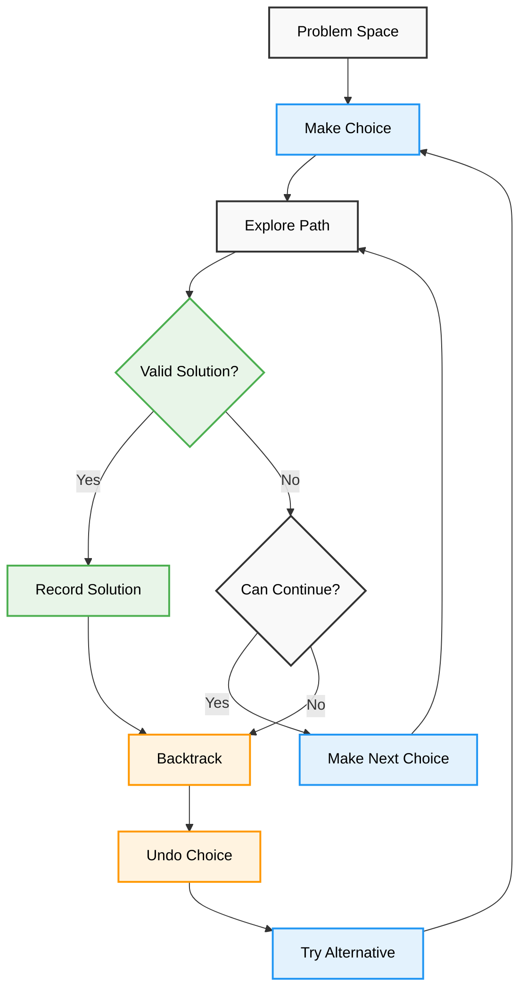
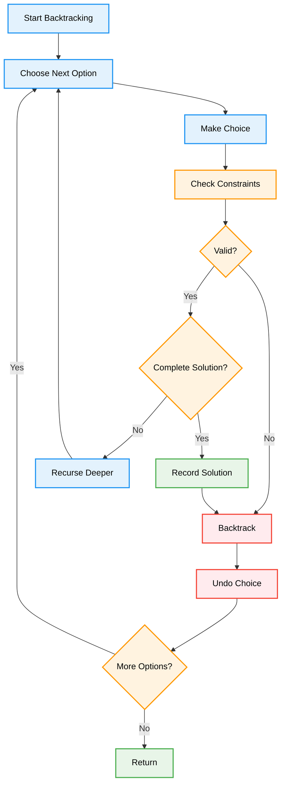
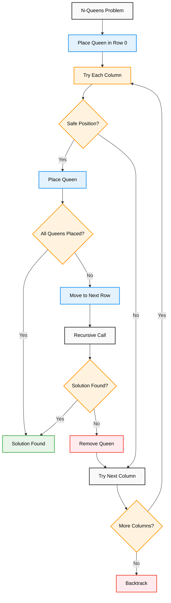
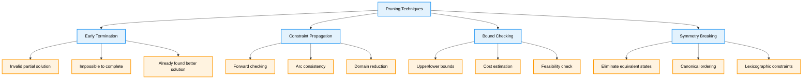
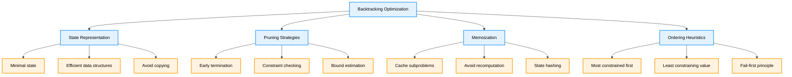

# Backtracking — Complete Professional <div align="center">Guide</div>

<div align="center">


**Master systematic exploration of solution spaces with intelligent pruning**

</div>

---

## Table of Contents

1. [Introduction](#introduction)
2. [Backtracking Framework](#backtracking-framework)
3. [Classic Problems](#classic-problems)
4. [Optimization Techniques](#optimization-techniques)
5. [Advanced Applications](#advanced-applications)
6. [Best Practices](#best-practices)

---

## Introduction

**Backtracking** is an algorithmic approach that incrementally builds solutions and abandons candidates that cannot lead to valid solutions. It's a systematic method for solving constraint satisfaction problems by exploring the solution space in a depth-first manner.

### Core Concept



---

## Backtracking Framework

<div align="center">

</div>

### Algorithm Structure



### Basic Template

```cpp
class BacktrackingTemplate {
public:
    vector<vector<int>> solutions;
    
    void solve() {
        vector<int> currentSolution;
        backtrack(currentSolution, 0);
    }
    
private:
    void backtrack(vector<int>& current, int level) {
        // Base case - complete solution found
        if (isComplete(current, level)) {
            if (isValid(current)) {
                solutions.push_back(current);
            }
            return;
        }
        
        // Try all possible choices at current level
        for (int choice : getPossibleChoices(current, level)) {
            // Make choice
            current.push_back(choice);
            
            // Check if choice is promising
            if (isPromising(current, level)) {
                backtrack(current, level + 1);
            }
            
            // Backtrack - undo choice
            current.pop_back();
        }
    }
    
    bool isComplete(const vector<int>& current, int level) {
        // Check if we have a complete solution
        return current.size() == targetSize;
    }
    
    bool isValid(const vector<int>& current) {
        // Validate the complete solution
        return true;
    }
    
    bool isPromising(const vector<int>& current, int level) {
        // Check if current partial solution can lead to valid solution
        return true;
    }
    
    vector<int> getPossibleChoices(const vector<int>& current, int level) {
        // Return available choices at current level
        return {};
    }
    
private:
    int targetSize = 0;
};
```

---

## Classic Problems

### N-Queens Problem

<div align="center">

</div>



```cpp
class NQueens {
public:
    vector<vector<string>> solveNQueens(int n) {
        vector<vector<string>> solutions;
        vector<string> board(n, string(n, '.'));
        
        backtrack(board, 0, solutions);
        return solutions;
    }
    
private:
    void backtrack(vector<string>& board, int row, vector<vector<string>>& solutions) {
        int n = board.size();
        
        // Base case - all queens placed
        if (row == n) {
            solutions.push_back(board);
            return;
        }
        
        // Try placing queen in each column of current row
        for (int col = 0; col < n; col++) {
            if (isSafe(board, row, col)) {
                // Make choice
                board[row][col] = 'Q';
                
                // Recurse to next row
                backtrack(board, row + 1, solutions);
                
                // Backtrack
                board[row][col] = '.';
            }
        }
    }
    
    bool isSafe(const vector<string>& board, int row, int col) {
        int n = board.size();
        
        // Check column
        for (int i = 0; i < row; i++) {
            if (board[i][col] == 'Q') return false;
        }
        
        // Check diagonal (top-left to bottom-right)
        for (int i = row - 1, j = col - 1; i >= 0 && j >= 0; i--, j--) {
            if (board[i][j] == 'Q') return false;
        }
        
        // Check anti-diagonal (top-right to bottom-left)
        for (int i = row - 1, j = col + 1; i >= 0 && j < n; i--, j++) {
            if (board[i][j] == 'Q') return false;
        }
        
        return true;
    }
};
```

### Generate Permutations

<div align="center">

</div>

```cpp
class Permutations {
public:
    // Generate all permutations
    vector<vector<int>> permute(vector<int>& nums) {
        vector<vector<int>> result;
        backtrack(nums, 0, result);
        return result;
    }
    
    // Generate permutations with duplicates
    vector<vector<int>> permuteUnique(vector<int>& nums) {
        vector<vector<int>> result;
        sort(nums.begin(), nums.end());
        vector<bool> used(nums.size(), false);
        vector<int> current;
        
        backtrackUnique(nums, used, current, result);
        return result;
    }
    
private:
    void backtrack(vector<int>& nums, int start, vector<vector<int>>& result) {
        // Base case - permutation complete
        if (start == nums.size()) {
            result.push_back(nums);
            return;
        }
        
        // Try each remaining element at current position
        for (int i = start; i < nums.size(); i++) {
            // Make choice - swap current element to start position
            swap(nums[start], nums[i]);
            
            // Recurse with next position
            backtrack(nums, start + 1, result);
            
            // Backtrack - restore original order
            swap(nums[start], nums[i]);
        }
    }
    
    void backtrackUnique(vector<int>& nums, vector<bool>& used, 
                        vector<int>& current, vector<vector<int>>& result) {
        // Base case - permutation complete
        if (current.size() == nums.size()) {
            result.push_back(current);
            return;
        }
        
        for (int i = 0; i < nums.size(); i++) {
            // Skip used elements
            if (used[i]) continue;
            
            // Skip duplicates - only use first occurrence
            if (i > 0 && nums[i] == nums[i-1] && !used[i-1]) continue;
            
            // Make choice
            used[i] = true;
            current.push_back(nums[i]);
            
            // Recurse
            backtrackUnique(nums, used, current, result);
            
            // Backtrack
            current.pop_back();
            used[i] = false;
        }
    }
};
```

### Sudoku Solver

<div align="center">

</div>

```cpp
class SudokuSolver {
public:
    void solveSudoku(vector<vector<char>>& board) {
        backtrack(board);
    }
    
private:
    bool backtrack(vector<vector<char>>& board) {
        // Find next empty cell
        for (int i = 0; i < 9; i++) {
            for (int j = 0; j < 9; j++) {
                if (board[i][j] == '.') {
                    // Try digits 1-9
                    for (char digit = '1'; digit <= '9'; digit++) {
                        if (isValid(board, i, j, digit)) {
                            // Make choice
                            board[i][j] = digit;
                            
                            // Recurse - if solution found, return true
                            if (backtrack(board)) {
                                return true;
                            }
                            
                            // Backtrack
                            board[i][j] = '.';
                        }
                    }
                    // No valid digit found for this cell
                    return false;
                }
            }
        }
        // All cells filled - solution found
        return true;
    }
    
    bool isValid(vector<vector<char>>& board, int row, int col, char digit) {
        for (int i = 0; i < 9; i++) {
            // Check row
            if (board[row][i] == digit) return false;
            
            // Check column
            if (board[i][col] == digit) return false;
            
            // Check 3x3 box
            int boxRow = 3 * (row / 3) + i / 3;
            int boxCol = 3 * (col / 3) + i % 3;
            if (board[boxRow][boxCol] == digit) return false;
        }
        return true;
    }
};
```

### Word Search

<div align="center">

</div>

```cpp
class WordSearch {
public:
    bool exist(vector<vector<char>>& board, string word) {
        int rows = board.size();
        int cols = board[0].size();
        
        // Try starting from each cell
        for (int i = 0; i < rows; i++) {
            for (int j = 0; j < cols; j++) {
                if (backtrack(board, word, i, j, 0)) {
                    return true;
                }
            }
        }
        return false;
    }
    
private:
    bool backtrack(vector<vector<char>>& board, const string& word, 
                   int row, int col, int index) {
        // Base case - word found
        if (index == word.length()) return true;
        
        // Check bounds and character match
        if (row < 0 || row >= board.size() || 
            col < 0 || col >= board[0].size() || 
            board[row][col] != word[index]) {
            return false;
        }
        
        // Mark cell as visited
        char temp = board[row][col];
        board[row][col] = '#';
        
        // Explore all 4 directions
        bool found = backtrack(board, word, row + 1, col, index + 1) ||
                    backtrack(board, word, row - 1, col, index + 1) ||
                    backtrack(board, word, row, col + 1, index + 1) ||
                    backtrack(board, word, row, col - 1, index + 1);
        
        // Backtrack - restore cell
        board[row][col] = temp;
        
        return found;
    }
};
```

---

## Optimization Techniques

### Pruning Strategies

<div align="center">

</div>



```cpp
class OptimizedBacktracking {
public:
    // Combination Sum with pruning
    vector<vector<int>> combinationSum(vector<int>& candidates, int target) {
        vector<vector<int>> result;
        vector<int> current;
        
        // Sort for pruning optimization
        sort(candidates.begin(), candidates.end());
        
        backtrack(candidates, target, 0, current, result);
        return result;
    }
    
    // Subset sum with pruning
    bool canPartition(vector<int>& nums) {
        int sum = accumulate(nums.begin(), nums.end(), 0);
        if (sum % 2 != 0) return false;
        
        int target = sum / 2;
        sort(nums.rbegin(), nums.rend()); // Sort descending for better pruning
        
        return backtrack(nums, target, 0);
    }
    
private:
    void backtrack(vector<int>& candidates, int target, int start,
                   vector<int>& current, vector<vector<int>>& result) {
        if (target == 0) {
            result.push_back(current);
            return;
        }
        
        for (int i = start; i < candidates.size(); i++) {
            // Pruning: if current candidate > target, all remaining will be too
            if (candidates[i] > target) break;
            
            current.push_back(candidates[i]);
            backtrack(candidates, target - candidates[i], i, current, result);
            current.pop_back();
        }
    }
    
    bool backtrack(vector<int>& nums, int target, int index) {
        if (target == 0) return true;
        if (index >= nums.size() || target < 0) return false;
        
        // Pruning: if largest remaining number > target, skip
        if (nums[index] > target) return false;
        
        // Try including current number
        if (backtrack(nums, target - nums[index], index + 1)) {
            return true;
        }
        
        // Try excluding current number
        return backtrack(nums, target, index + 1);
    }
};
```

### Memoization in Backtracking

<div align="center">

</div>

```cpp
class MemoizedBacktracking {
public:
    // Word Break with memoization
    bool wordBreak(string s, vector<string>& wordDict) {
        unordered_set<string> words(wordDict.begin(), wordDict.end());
        unordered_map<string, bool> memo;
        
        return backtrack(s, words, memo);
    }
    
    // Palindrome Partitioning with memoization
    vector<vector<string>> partition(string s) {
        vector<vector<string>> result;
        vector<string> current;
        unordered_map<string, bool> palindromeCache;
        
        backtrack(s, 0, current, result, palindromeCache);
        return result;
    }
    
private:
    bool backtrack(const string& s, const unordered_set<string>& words,
                   unordered_map<string, bool>& memo) {
        if (s.empty()) return true;
        
        if (memo.count(s)) return memo[s];
        
        for (int i = 1; i <= s.length(); i++) {
            string prefix = s.substr(0, i);
            
            if (words.count(prefix) && backtrack(s.substr(i), words, memo)) {
                memo[s] = true;
                return true;
            }
        }
        
        memo[s] = false;
        return false;
    }
    
    void backtrack(const string& s, int start, vector<string>& current,
                   vector<vector<string>>& result, unordered_map<string, bool>& cache) {
        if (start >= s.length()) {
            result.push_back(current);
            return;
        }
        
        for (int end = start; end < s.length(); end++) {
            string substring = s.substr(start, end - start + 1);
            
            if (isPalindrome(substring, cache)) {
                current.push_back(substring);
                backtrack(s, end + 1, current, result, cache);
                current.pop_back();
            }
        }
    }
    
    bool isPalindrome(const string& s, unordered_map<string, bool>& cache) {
        if (cache.count(s)) return cache[s];
        
        int left = 0, right = s.length() - 1;
        while (left < right) {
            if (s[left] != s[right]) {
                cache[s] = false;
                return false;
            }
            left++;
            right--;
        }
        
        cache[s] = true;
        return true;
    }
};
```

---

## Advanced Applications

### Constraint Satisfaction Problems

```cpp
class ConstraintSatisfaction {
public:
    // Graph Coloring
    bool graphColoring(vector<vector<int>>& graph, int colors) {
        int n = graph.size();
        vector<int> coloring(n, 0);
        
        return backtrack(graph, coloring, 0, colors);
    }
    
    // Cryptarithmetic Puzzle
    bool solveCryptarithmetic(string word1, string word2, string result) {
        unordered_set<char> letters;
        for (char c : word1 + word2 + result) {
            if (isalpha(c)) letters.insert(c);
        }
        
        vector<char> letterList(letters.begin(), letters.end());
        vector<int> assignment(10, -1); // digit -> letter mapping
        vector<bool> used(10, false);   // used digits
        
        return backtrack(letterList, 0, assignment, used, word1, word2, result);
    }
    
private:
    bool backtrack(vector<vector<int>>& graph, vector<int>& coloring, 
                   int vertex, int colors) {
        int n = graph.size();
        
        if (vertex == n) return true; // All vertices colored
        
        for (int color = 1; color <= colors; color++) {
            if (isSafeColor(graph, coloring, vertex, color)) {
                coloring[vertex] = color;
                
                if (backtrack(graph, coloring, vertex + 1, colors)) {
                    return true;
                }
                
                coloring[vertex] = 0; // backtrack
            }
        }
        
        return false;
    }
    
    bool isSafeColor(vector<vector<int>>& graph, vector<int>& coloring, 
                     int vertex, int color) {
        for (int i = 0; i < graph.size(); i++) {
            if (graph[vertex][i] && coloring[i] == color) {
                return false;
            }
        }
        return true;
    }
    
    bool backtrack(vector<char>& letters, int index, vector<int>& assignment,
                   vector<bool>& used, const string& word1, 
                   const string& word2, const string& result) {
        if (index == letters.size()) {
            return isValidAssignment(assignment, word1, word2, result);
        }
        
        char letter = letters[index];
        
        for (int digit = 0; digit <= 9; digit++) {
            if (!used[digit]) {
                // Leading zeros not allowed
                if (digit == 0 && (letter == word1[0] || letter == word2[0] || 
                                  letter == result[0])) {
                    continue;
                }
                
                assignment[digit] = letter;
                used[digit] = true;
                
                if (backtrack(letters, index + 1, assignment, used, 
                             word1, word2, result)) {
                    return true;
                }
                
                assignment[digit] = -1;
                used[digit] = false;
            }
        }
        
        return false;
    }
    
    bool isValidAssignment(vector<int>& assignment, const string& word1,
                          const string& word2, const string& result) {
        // Convert words to numbers and check if equation holds
        // Implementation details omitted for brevity
        return true;
    }
};
```

---

## Best Practices

### Performance Optimization



### Implementation Guidelines

```cpp
class BacktrackingBestPractices {
public:
    // ✅ Good: Efficient state management
    void efficientBacktrack(vector<int>& state, int level) {
        if (isComplete(state)) {
            processResult(state);
            return;
        }
        
        for (int choice : getChoices(level)) {
            if (isPromising(state, choice)) {
                // Make choice
                state.push_back(choice);
                
                // Recurse
                efficientBacktrack(state, level + 1);
                
                // Backtrack
                state.pop_back();
            }
        }
    }
    
    // ✅ Good: Early pruning
    bool isPromising(const vector<int>& state, int choice) {
        // Check constraints early
        if (!satisfiesConstraints(state, choice)) return false;
        
        // Estimate if completion is possible
        if (!canComplete(state, choice)) return false;
        
        return true;
    }
    
    // ✅ Good: Memoization for overlapping subproblems
    unordered_map<string, bool> memo;
    
    bool memoizedBacktrack(const string& state) {
        if (memo.count(state)) return memo[state];
        
        // ... backtracking logic ...
        
        memo[state] = result;
        return result;
    }
    
private:
    bool isComplete(const vector<int>& state) { return false; }
    void processResult(const vector<int>& state) {}
    vector<int> getChoices(int level) { return {}; }
    bool satisfiesConstraints(const vector<int>& state, int choice) { return true; }
    bool canComplete(const vector<int>& state, int choice) { return true; }
};
```

### Common Pitfalls

```cpp
class BacktrackingPitfalls {
public:
    // ❌ Bad: Forgetting to backtrack
    void badBacktrack(vector<int>& state) {
        if (isComplete(state)) return;
        
        for (int choice : getChoices()) {
            state.push_back(choice);
            badBacktrack(state);
            // Missing: state.pop_back();
        }
    }
    
    // ❌ Bad: Inefficient state copying
    void inefficientBacktrack(vector<int> state) { // Pass by value!
        if (isComplete(state)) return;
        
        for (int choice : getChoices()) {
            state.push_back(choice); // Creates new copy each time
            inefficientBacktrack(state);
        }
    }
    
    // ❌ Bad: No pruning
    void noPruning(vector<int>& state) {
        if (isComplete(state)) return;
        
        for (int choice : getChoices()) {
            state.push_back(choice);
            // Should check if choice is promising!
            noPruning(state);
            state.pop_back();
        }
    }
    
private:
    bool isComplete(const vector<int>& state) { return false; }
    vector<int> getChoices() { return {}; }
};
```

---

## Summary

Backtracking provides a systematic approach to exploring solution spaces:

**Core Concepts**: Choose, explore, backtrack pattern for systematic search  
**Classic Problems**: N-Queens, permutations, Sudoku, word search demonstrate key techniques  
**Optimization**: Pruning, memoization, and constraint propagation improve efficiency  
**State Management**: Proper choice and undo operations are critical for correctness  
**Performance**: Early termination and intelligent ordering reduce search space  

**Key Insight**: "Backtracking is exhaustive search made intelligent through systematic exploration and pruning"

---

<div align="center">

**Master Systematic Exploration with Smart Abandonment**

*Where brute force meets intelligent search*

</div>