# 🔍 Backtracking — Complete Professional Guide

<div align="center">


*Master systematic exploration of solution spaces with intelligent pruning*

</div>

---

## 🎯 Introduction

**Backtracking** is an algorithmic approach that incrementally builds solutions and abandons candidates that cannot lead to valid solutions.

### 🔑 Backtracking Framework

```mermaid
flowchart TD
    A["🔍 Start Backtracking"] --> B["🎯 Choose Option"]
    B --> C["🔍 Explore Path"]
    C --> D{"Valid Solution?"}
    D -->|Yes| E["🏆 Record Solution"]
    D -->|No| F{"Can Continue?"}
    F -->|Yes| G["➕ Make Choice"]
    F -->|No| H["⬅️ Backtrack"]
    G --> C
    H --> I["❌ Undo Choice"]
    I --> J["🔄 Try Next Option"]
    E --> H
    J --> B
    
    style A fill:#e3f2fd
    style E fill:#c8e6c9
    style H fill:#ffcdd2
```



### 💻 Basic Template

```cpp
class BacktrackingTemplate {
public:
    vector<vector<int>> solutions;
    
    void backtrack(vector<int>& current, /* other parameters */) {
        // Base case - found valid solution
        if (isValidSolution(current)) {
            solutions.push_back(current);
            return;
        }
        
        // Try all possible choices
        for (int choice : getPossibleChoices()) {
            // Make choice
            current.push_back(choice);
            
            // Explore with this choice
            if (isValidChoice(current, choice)) {
                backtrack(current /* updated parameters */);
            }
            
            // Backtrack - undo choice
            current.pop_back();
        }
    }
    
private:
    bool isValidSolution(const vector<int>& current) {
        // Check if current state is a complete solution
        return false;
    }
    
    bool isValidChoice(const vector<int>& current, int choice) {
        // Check if choice is valid in current state
        return true;
    }
    
    vector<int> getPossibleChoices() {
        // Return all possible choices at current state
        return {};
    }
};
```

---

## 🎯 Classic Problems

```mermaid
mindmap
  root))🔍 Backtracking Problems((
    👑 N-Queens
      Place N queens
      No attacks
      Board constraints
      Pruning strategies
    🔄 Permutations
      All arrangements
      With/without duplicates
      Lexicographic order
      Optimization tricks
    🔢 Sudoku Solver
      9x9 grid
      Constraint satisfaction
      Validation rules
      Efficient backtracking
    🔍 Word Search
      Grid traversal
      Path finding
      State management
      Direction exploration
    🎯 Combination Sum
      Target sum
      Candidate selection
      Pruning optimization
      Multiple solutions
```



### 🔧 N-Queens Problem

```cpp
class NQueens {
public:
    vector<vector<string>> solveNQueens(int n) {
        vector<vector<string>> solutions;
        vector<string> board(n, string(n, '.'));
        
        backtrack(board, 0, solutions);
        return solutions;
    }
    
private:
    void backtrack(vector<string>& board, int row, vector<vector<string>>& solutions) {
        if (row == board.size()) {
            solutions.push_back(board);
            return;
        }
        
        for (int col = 0; col < board.size(); col++) {
            if (isValid(board, row, col)) {
                board[row][col] = 'Q';
                backtrack(board, row + 1, solutions);
                board[row][col] = '.';
            }
        }
    }
    
    bool isValid(const vector<string>& board, int row, int col) {
        int n = board.size();
        
        // Check column
        for (int i = 0; i < row; i++) {
            if (board[i][col] == 'Q') return false;
        }
        
        // Check diagonal
        for (int i = row - 1, j = col - 1; i >= 0 && j >= 0; i--, j--) {
            if (board[i][j] == 'Q') return false;
        }
        
        // Check anti-diagonal
        for (int i = row - 1, j = col + 1; i >= 0 && j < n; i--, j++) {
            if (board[i][j] == 'Q') return false;
        }
        
        return true;
    }
};
```

### 🔧 Generate Permutations

```cpp
class Permutations {
public:
    vector<vector<int>> permute(vector<int>& nums) {
        vector<vector<int>> result;
        backtrack(nums, 0, result);
        return result;
    }
    
    // With duplicates
    vector<vector<int>> permuteUnique(vector<int>& nums) {
        vector<vector<int>> result;
        sort(nums.begin(), nums.end());
        vector<bool> used(nums.size(), false);
        vector<int> current;
        
        backtrackUnique(nums, used, current, result);
        return result;
    }
    
private:
    void backtrack(vector<int>& nums, int start, vector<vector<int>>& result) {
        if (start == nums.size()) {
            result.push_back(nums);
            return;
        }
        
        for (int i = start; i < nums.size(); i++) {
            swap(nums[start], nums[i]);
            backtrack(nums, start + 1, result);
            swap(nums[start], nums[i]); // backtrack
        }
    }
    
    void backtrackUnique(vector<int>& nums, vector<bool>& used, 
                        vector<int>& current, vector<vector<int>>& result) {
        if (current.size() == nums.size()) {
            result.push_back(current);
            return;
        }
        
        for (int i = 0; i < nums.size(); i++) {
            if (used[i]) continue;
            if (i > 0 && nums[i] == nums[i-1] && !used[i-1]) continue;
            
            used[i] = true;
            current.push_back(nums[i]);
            backtrackUnique(nums, used, current, result);
            current.pop_back();
            used[i] = false;
        }
    }
};
```

### 🔧 Sudoku Solver

```cpp
class SudokuSolver {
public:
    void solveSudoku(vector<vector<char>>& board) {
        backtrack(board);
    }
    
private:
    bool backtrack(vector<vector<char>>& board) {
        for (int i = 0; i < 9; i++) {
            for (int j = 0; j < 9; j++) {
                if (board[i][j] == '.') {
                    for (char c = '1'; c <= '9'; c++) {
                        if (isValid(board, i, j, c)) {
                            board[i][j] = c;
                            
                            if (backtrack(board)) {
                                return true;
                            }
                            
                            board[i][j] = '.'; // backtrack
                        }
                    }
                    return false;
                }
            }
        }
        return true;
    }
    
    bool isValid(vector<vector<char>>& board, int row, int col, char c) {
        for (int i = 0; i < 9; i++) {
            // Check row
            if (board[row][i] == c) return false;
            
            // Check column
            if (board[i][col] == c) return false;
            
            // Check 3x3 box
            if (board[3 * (row / 3) + i / 3][3 * (col / 3) + i % 3] == c) {
                return false;
            }
        }
        return true;
    }
};
```

### 🔧 Word Search

```cpp
class WordSearch {
public:
    bool exist(vector<vector<char>>& board, string word) {
        for (int i = 0; i < board.size(); i++) {
            for (int j = 0; j < board[0].size(); j++) {
                if (backtrack(board, word, i, j, 0)) {
                    return true;
                }
            }
        }
        return false;
    }
    
private:
    bool backtrack(vector<vector<char>>& board, const string& word, 
                   int row, int col, int index) {
        if (index == word.length()) return true;
        
        if (row < 0 || row >= board.size() || 
            col < 0 || col >= board[0].size() || 
            board[row][col] != word[index]) {
            return false;
        }
        
        char temp = board[row][col];
        board[row][col] = '#'; // Mark as visited
        
        bool found = backtrack(board, word, row + 1, col, index + 1) ||
                    backtrack(board, word, row - 1, col, index + 1) ||
                    backtrack(board, word, row, col + 1, index + 1) ||
                    backtrack(board, word, row, col - 1, index + 1);
        
        board[row][col] = temp; // Restore
        return found;
    }
};
```

---

## 🎯 Optimization Techniques

### 🔧 Pruning Strategies

```cpp
class BacktrackingOptimizations {
public:
    // Combination Sum with pruning
    vector<vector<int>> combinationSum(vector<int>& candidates, int target) {
        vector<vector<int>> result;
        vector<int> current;
        
        sort(candidates.begin(), candidates.end()); // Enable pruning
        backtrack(candidates, target, 0, current, result);
        return result;
    }
    
private:
    void backtrack(vector<int>& candidates, int target, int start,
                   vector<int>& current, vector<vector<int>>& result) {
        if (target == 0) {
            result.push_back(current);
            return;
        }
        
        for (int i = start; i < candidates.size(); i++) {
            if (candidates[i] > target) break; // Pruning: early termination
            
            current.push_back(candidates[i]);
            backtrack(candidates, target - candidates[i], i, current, result);
            current.pop_back();
        }
    }
};
```

### 🔧 Memoization in Backtracking

```cpp
class MemoizedBacktracking {
public:
    bool wordBreak(string s, vector<string>& wordDict) {
        unordered_set<string> words(wordDict.begin(), wordDict.end());
        unordered_map<string, bool> memo;
        
        return backtrack(s, words, memo);
    }
    
private:
    bool backtrack(const string& s, const unordered_set<string>& words,
                   unordered_map<string, bool>& memo) {
        if (s.empty()) return true;
        
        if (memo.count(s)) return memo[s];
        
        for (int i = 1; i <= s.length(); i++) {
            string prefix = s.substr(0, i);
            
            if (words.count(prefix) && backtrack(s.substr(i), words, memo)) {
                memo[s] = true;
                return true;
            }
        }
        
        memo[s] = false;
        return false;
    }
};
```

---

## 🏆 Best Practices

### ✅ Do's

```cpp
// 1. Use proper state management
class GoodBacktracking {
public:
    void backtrack(vector<int>& state, int index) {
        if (isComplete(state)) {
            processResult(state);
            return;
        }
        
        for (int choice : getChoices(index)) {
            if (isValid(state, choice)) {
                // Make choice
                state.push_back(choice);
                
                // Recurse
                backtrack(state, index + 1);
                
                // Backtrack
                state.pop_back();
            }
        }
    }
    
private:
    bool isComplete(const vector<int>& state) { return false; }
    bool isValid(const vector<int>& state, int choice) { return true; }
    void processResult(const vector<int>& state) {}
    vector<int> getChoices(int index) { return {}; }
};

// 2. Implement early termination
bool canReachTarget(vector<int>& current, int target) {
    int sum = accumulate(current.begin(), current.end(), 0);
    return sum <= target; // Prune if already exceeded
}

// 3. Use appropriate data structures
void efficientBacktracking() {
    unordered_set<string> visited; // Fast lookup for visited states
    vector<int> path;              // Efficient for push/pop operations
}
```

### ❌ Don'ts

```cpp
// Don't: Forget to backtrack
// state.push_back(choice);
// backtrack(state);
// // Missing: state.pop_back();

// Don't: Use inefficient state representation
// string state; // Slow for modifications
// Use vector<int> instead

// Don't: Skip pruning opportunities
// Always check if current path can lead to solution
```

---

## 🎓 Summary

Backtracking systematically explores solution spaces:

✅ **Framework**: Choose, explore, backtrack pattern  
✅ **Applications**: N-Queens, permutations, Sudoku, word search  
✅ **Optimization**: Pruning, memoization, early termination  
✅ **State Management**: Proper choice and undo operations  
✅ **Complexity**: Often exponential, but pruning helps  

---

<div align="center">

**🔍 Explore Every Possibility Intelligently**

*Systematic search with smart abandonment*

</div>