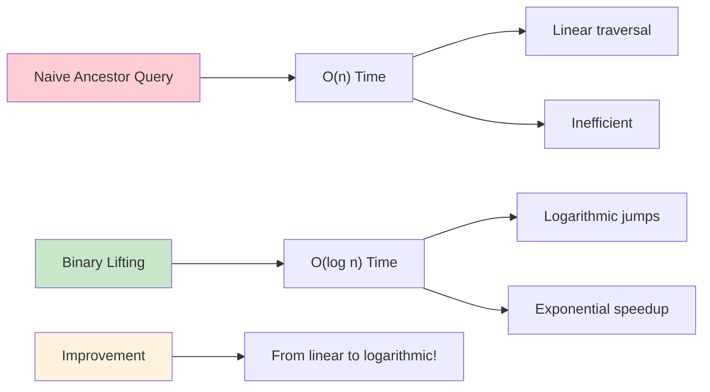
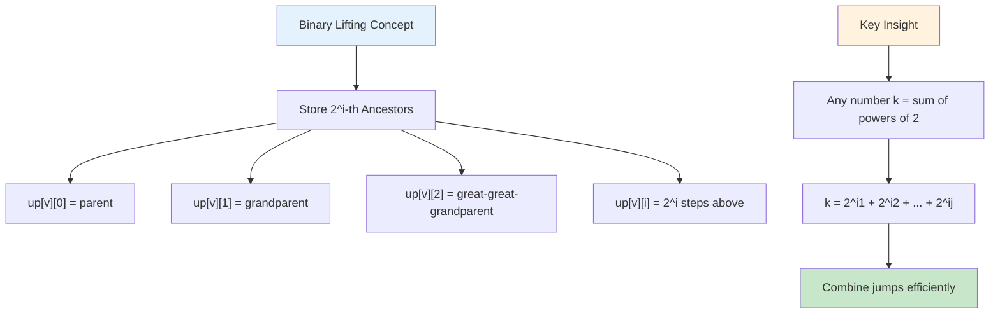
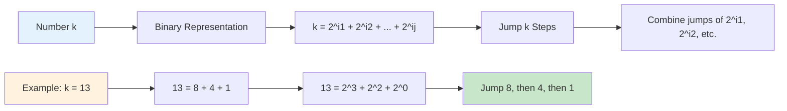

# 🚀 Binary Lifting & LCA — Complete Professional Guide

<div align="center">


*Master efficient tree traversal and ancestor queries for competitive programming and advanced tree algorithms*

</div>

---

## 📑 Table of Contents

1. [Introduction](#-introduction)
2. [LCA Fundamentals](#-lca-fundamentals)
3. [Binary Lifting Concept](#-binary-lifting-concept)
4. [Implementation](#-implementation)
5. [Query Operations](#-query-operations)
6. [Advanced Applications](#-advanced-applications)
7. [Optimization Techniques](#-optimization-techniques)
8. [Comparison with Other Methods](#-comparison-with-other-methods)
9. [Interview Problems](#-interview-problems)
10. [Complexity Analysis](#-complexity-analysis)
11. [Real-World Applications](#-real-world-applications)
12. [Best Practices](#-best-practices)

---

## 🎯 Introduction

**Binary Lifting** is a preprocessing technique that enables efficient ancestor queries in trees by storing powers-of-2 ancestors. Combined with **LCA (Lowest Common Ancestor)** algorithms, it provides O(log n) solutions for tree traversal problems.

### 🔑 Key Innovation



```
Naive Ancestor Query: O(n)
Binary Lifting: O(log n)

Speedup: From linear to logarithmic!
```

### 💡 Core Applications

```mermaid
mindmap
  root))🚀 Binary Lifting Applications((
    🌳 LCA Queries
      Find common ancestors
      O(log n) per query
      Tree path problems
      Genealogy systems
    🔢 K-th Ancestor
      Jump k steps up
      Binary representation
      Efficient traversal
      Path compression
    📍 Distance Queries
      Calculate path lengths
      Tree distances
      Shortest paths
      Network analysis
    📊 Tree DP
      Dynamic programming
      Optimization problems
      State transitions
      Recursive solutions
```

- **LCA Queries**: Find common ancestors efficiently
- **K-th Ancestor**: Jump k steps up in O(log n)
- **Distance Queries**: Calculate path lengths
- **Tree DP**: Optimize dynamic programming on trees

---

## 🌳 LCA Fundamentals

### 🎯 Definition

**Lowest Common Ancestor (LCA)** of two nodes u and v is the deepest node that is an ancestor of both u and v.

### 📊 Visual Example

```
        1
      /   \
     2     3
    / \   / \
   4   5 6   7
  /
 8

LCA(4, 5) = 2
LCA(4, 6) = 1  
LCA(8, 7) = 1
LCA(4, 8) = 4
```

### 🔍 Properties

```
✓ LCA(u, u) = u
✓ LCA(u, v) = LCA(v, u)
✓ If u is ancestor of v, then LCA(u, v) = u
✓ LCA is unique for any pair of nodes
```

---

## 🚀 Binary Lifting Concept

### 🎯 Core Idea



Store **2^i-th ancestor** for each node and each power i.

```cpp
up[v][i] = 2^i-th ancestor of node v

up[v][0] = parent of v (2^0 = 1 step)
up[v][1] = grandparent of v (2^1 = 2 steps)
up[v][2] = great-great-grandparent (2^2 = 4 steps)
...
up[v][i] = 2^i steps above v
```

### 📊 Preprocessing Table

```
Node:  1  2  3  4  5  6  7  8
up[i][0]: -1 1  1  2  2  3  3  4
up[i][1]: -1 -1 -1 1  1  1  1  2
up[i][2]: -1 -1 -1 -1 -1 -1 -1 1
```

### 💡 Key Insight



Any number k can be represented as sum of powers of 2:
```
k = 2^i1 + 2^i2 + ... + 2^ij

To jump k steps: combine jumps of 2^i1, 2^i2, etc.
```

---

## 💻 Implementation

### 🔧 Complete Binary Lifting Class

```cpp
class BinaryLifting {
private:
    int n, LOG;
    vector<vector<int>> adj;
    vector<vector<int>> up;
    vector<int> depth;
    
    void dfs(int v, int parent, int d) {
        up[v][0] = parent;
        depth[v] = d;
        
        for (int u : adj[v]) {
            if (u != parent) {
                dfs(u, v, d + 1);
            }
        }
    }
    
    void preprocess() {
        // Fill up table using DP
        for (int i = 1; i < LOG; i++) {
            for (int v = 0; v < n; v++) {
                if (up[v][i-1] != -1) {
                    up[v][i] = up[up[v][i-1]][i-1];
                }
            }
        }
    }
    
public:
    BinaryLifting(int nodes) : n(nodes) {
        LOG = ceil(log2(n)) + 1;
        adj.resize(n);
        up.assign(n, vector<int>(LOG, -1));
        depth.resize(n);
    }
    
    void addEdge(int u, int v) {
        adj[u].push_back(v);
        adj[v].push_back(u);
    }
    
    void build(int root = 0) {
        dfs(root, -1, 0);
        preprocess();
    }
    
    int kthAncestor(int node, int k) {
        if (depth[node] < k) return -1;
        
        for (int i = 0; i < LOG; i++) {
            if (k & (1 << i)) {
                node = up[node][i];
                if (node == -1) return -1;
            }
        }
        return node;
    }
    
    int lca(int u, int v) {
        // Make u deeper than v
        if (depth[u] < depth[v]) swap(u, v);
        
        // Bring u to same level as v
        int diff = depth[u] - depth[v];
        u = kthAncestor(u, diff);
        
        if (u == v) return u;
        
        // Binary search for LCA
        for (int i = LOG - 1; i >= 0; i--) {
            if (up[u][i] != -1 && up[u][i] != up[v][i]) {
                u = up[u][i];
                v = up[v][i];
            }
        }
        
        return up[u][0];
    }
    
    int distance(int u, int v) {
        return depth[u] + depth[v] - 2 * depth[lca(u, v)];
    }
    
    bool isAncestor(int u, int v) {
        return lca(u, v) == u;
    }
};
```

### 🔧 Step-by-Step Preprocessing

```cpp
void buildBinaryLifting(int root) {
    // Step 1: DFS to compute depths and direct parents
    function<void(int, int, int)> dfs = [&](int v, int parent, int d) {
        up[v][0] = parent;
        depth[v] = d;
        
        for (int u : adj[v]) {
            if (u != parent) {
                dfs(u, v, d + 1);
            }
        }
    };
    
    dfs(root, -1, 0);
    
    // Step 2: Fill binary lifting table
    for (int i = 1; i < LOG; i++) {
        for (int v = 0; v < n; v++) {
            if (up[v][i-1] != -1) {
                up[v][i] = up[up[v][i-1]][i-1];
            }
        }
    }
}
```

---

## 🔍 Query Operations

### 🎯 K-th Ancestor Query

```cpp
int kthAncestor(int node, int k) {
    // Check if k-th ancestor exists
    if (depth[node] < k) return -1;
    
    // Use binary representation of k
    for (int i = 0; i < LOG; i++) {
        if (k & (1 << i)) {
            node = up[node][i];
            if (node == -1) return -1;
        }
    }
    return node;
}
```

**Example**: Find 5th ancestor
```
k = 5 = 101₂ = 4 + 1
Jump 4 steps: node = up[node][2]
Jump 1 step: node = up[node][0]
```

### 🎯 LCA Query Algorithm

```cpp
int lca(int u, int v) {
    // Step 1: Make u the deeper node
    if (depth[u] < depth[v]) swap(u, v);
    
    // Step 2: Bring u to same level as v
    int diff = depth[u] - depth[v];
    for (int i = 0; i < LOG; i++) {
        if (diff & (1 << i)) {
            u = up[u][i];
        }
    }
    
    // Step 3: If same node, return it
    if (u == v) return u;
    
    // Step 4: Binary search for LCA
    for (int i = LOG - 1; i >= 0; i--) {
        if (up[u][i] != up[v][i]) {
            u = up[u][i];
            v = up[v][i];
        }
    }
    
    // Parent of current position is LCA
    return up[u][0];
}
```

### 🎯 Distance Between Nodes

```cpp
int distance(int u, int v) {
    int lca_node = lca(u, v);
    return depth[u] + depth[v] - 2 * depth[lca_node];
}
```

---

## 🎓 Advanced Applications

### 🔥 Path Queries

```cpp
class PathQueries {
private:
    BinaryLifting bl;
    vector<long long> nodeValue;
    
public:
    long long pathSum(int u, int v) {
        int lca_node = bl.lca(u, v);
        long long sum = 0;
        
        // Sum from u to LCA
        int curr = u;
        while (curr != lca_node) {
            sum += nodeValue[curr];
            curr = bl.kthAncestor(curr, 1);
        }
        
        // Sum from v to LCA
        curr = v;
        while (curr != lca_node) {
            sum += nodeValue[curr];
            curr = bl.kthAncestor(curr, 1);
        }
        
        // Add LCA value
        sum += nodeValue[lca_node];
        
        return sum;
    }
    
    long long pathMax(int u, int v) {
        // Similar implementation for maximum value on path
    }
};
```

### 🌳 Tree DP with Binary Lifting

```cpp
class TreeDP {
private:
    BinaryLifting bl;
    vector<vector<long long>> dp;  // dp[node][k] = answer for subtree rooted at node with parameter k
    
public:
    void computeDP() {
        function<void(int, int)> dfs = [&](int v, int parent) {
            // Base case
            dp[v][0] = nodeValue[v];
            
            for (int u : adj[v]) {
                if (u != parent) {
                    dfs(u, v);
                    
                    // Combine results from children
                    for (int k = 1; k < MAX_K; k++) {
                        dp[v][k] = max(dp[v][k], dp[u][k-1] + nodeValue[v]);
                    }
                }
            }
        };
        
        dfs(0, -1);
    }
    
    long long querySubtree(int node, int k) {
        return dp[node][k];
    }
};
```

### 🎯 Heavy-Light Decomposition Integration

```cpp
class HLDWithBinaryLifting {
private:
    BinaryLifting bl;
    // HLD components...
    
public:
    int lcaHLD(int u, int v) {
        // Use binary lifting for LCA in HLD
        return bl.lca(u, v);
    }
    
    long long pathQuery(int u, int v) {
        int lca_node = bl.lca(u, v);
        
        // Query path u -> lca using HLD
        long long result = 0;
        result += queryPathToAncestor(u, lca_node);
        result += queryPathToAncestor(v, lca_node);
        result -= nodeValue[lca_node];  // Remove double counting
        
        return result;
    }
};
```

---

## ⚡ Optimization Techniques

### 🔧 Memory Optimization

```cpp
class CompactBinaryLifting {
private:
    // Use smaller data types when possible
    vector<vector<uint16_t>> up;  // If n < 65536
    vector<uint16_t> depth;
    
public:
    // Reduce LOG based on actual tree height
    void optimizeLog() {
        int maxDepth = *max_element(depth.begin(), depth.end());
        LOG = ceil(log2(maxDepth)) + 1;
    }
};
```

### ⚡ Cache Optimization

```cpp
class CacheOptimizedBL {
private:
    // Store frequently accessed ancestors separately
    vector<int> parent, grandparent;
    vector<vector<int>> up;
    
public:
    int fastLCA(int u, int v) {
        // Quick checks for common cases
        if (parent[u] == parent[v]) return parent[u];
        if (grandparent[u] == grandparent[v]) return grandparent[u];
        
        // Fall back to full binary lifting
        return slowLCA(u, v);
    }
};
```

---

## 🆚 Comparison with Other Methods

### 📊 LCA Methods Comparison

<table>
<thead>
<tr>
<th>Method</th>
<th>Preprocessing</th>
<th>Query Time</th>
<th>Space</th>
<th>Implementation</th>
</tr>
</thead>
<tbody>
<tr>
<td><strong>Naive DFS</strong></td>
<td>O(1)</td>
<td>O(n)</td>
<td>O(n)</td>
<td>Very Easy</td>
</tr>
<tr>
<td><strong>Binary Lifting</strong></td>
<td>O(n log n)</td>
<td>O(log n)</td>
<td>O(n log n)</td>
<td>Easy</td>
</tr>
<tr>
<td><strong>Euler Tour + RMQ</strong></td>
<td>O(n log n)</td>
<td>O(1)</td>
<td>O(n)</td>
<td>Complex</td>
</tr>
<tr>
<td><strong>Tarjan's Offline</strong></td>
<td>O(n α(n))</td>
<td>O(1)</td>
<td>O(n)</td>
<td>Complex</td>
</tr>
</tbody>
</table>

### 🎯 When to Use Binary Lifting

```
✅ Use Binary Lifting when:
- Need k-th ancestor queries
- Online LCA queries required
- Implementation simplicity preferred
- Memory is not extremely constrained

❌ Avoid when:
- Only few LCA queries (use naive)
- Need O(1) LCA with tight memory
- Offline queries possible (use Tarjan's)
```

---

## 🏆 Interview Problems

### ✅ Common Problem Types

1. **LCA Queries** - Basic ancestor finding
2. **K-th Ancestor** - Jump queries in trees
3. **Distance Queries** - Path lengths between nodes
4. **Path Queries** - Sum/Max/Min on tree paths
5. **Tree DP** - Dynamic programming with ancestor queries

### 🔥 Sample Problem: Tree Path Queries

```cpp
class TreePathQueries {
private:
    BinaryLifting bl;
    vector<long long> values;
    
public:
    TreePathQueries(vector<vector<int>>& tree, vector<long long>& nodeValues) 
        : bl(tree.size()), values(nodeValues) {
        
        for (int i = 0; i < tree.size(); i++) {
            for (int j : tree[i]) {
                bl.addEdge(i, j);
            }
        }
        bl.build(0);
    }
    
    long long pathSum(int u, int v) {
        int lca_node = bl.lca(u, v);
        long long sum = values[lca_node];
        
        // Add path from u to lca (excluding lca)
        int curr = u;
        while (curr != lca_node) {
            sum += values[curr];
            curr = bl.kthAncestor(curr, 1);
        }
        
        // Add path from v to lca (excluding lca)
        curr = v;
        while (curr != lca_node) {
            sum += values[curr];
            curr = bl.kthAncestor(curr, 1);
        }
        
        return sum;
    }
    
    int kthNodeOnPath(int u, int v, int k) {
        int lca_node = bl.lca(u, v);
        int distToLCA = bl.distance(u, lca_node);
        
        if (k <= distToLCA) {
            return bl.kthAncestor(u, k);
        } else {
            int remaining = bl.distance(u, v) - k;
            return bl.kthAncestor(v, remaining);
        }
    }
};
```

### 🎯 Usage Example

```cpp
int main() {
    int n = 7;
    vector<vector<int>> tree(n);
    vector<long long> values = {1, 2, 3, 4, 5, 6, 7};
    
    // Build tree
    tree[0] = {1, 2};
    tree[1] = {0, 3, 4};
    tree[2] = {0, 5, 6};
    // ... add more edges
    
    TreePathQueries tpq(tree, values);
    
    // Query path sum from node 3 to node 6
    cout << tpq.pathSum(3, 6) << endl;
    
    // Find 2nd node on path from 3 to 6
    cout << tpq.kthNodeOnPath(3, 6, 2) << endl;
    
    return 0;
}
```

---

## ⏱️ Complexity Analysis

### 📊 Time Complexity

| Operation | Complexity | Explanation |
|:----------|:-----------|:------------|
| **Preprocessing** | O(n log n) | Fill up table for all nodes |
| **LCA Query** | O(log n) | Binary search approach |
| **K-th Ancestor** | O(log n) | Binary representation of k |
| **Distance Query** | O(log n) | Uses LCA internally |
| **Path Query** | O(log n + path_length) | Depends on implementation |

### 💾 Space Complexity

| Component | Space | Description |
|:----------|:------|:------------|
| **Up Table** | O(n log n) | Main binary lifting table |
| **Depth Array** | O(n) | Node depths |
| **Adjacency List** | O(n) | Tree structure |
| **Total** | **O(n log n)** | Dominated by up table |

---

## 🌐 Real-World Applications

### 🏢 Corporate Hierarchy

```cpp
class CorporateHierarchy {
private:
    BinaryLifting bl;
    vector<string> employeeNames;
    vector<int> salaryLevels;
    
public:
    string findCommonManager(string emp1, string emp2) {
        int id1 = getEmployeeId(emp1);
        int id2 = getEmployeeId(emp2);
        int managerId = bl.lca(id1, id2);
        return employeeNames[managerId];
    }
    
    int hierarchyDistance(string emp1, string emp2) {
        int id1 = getEmployeeId(emp1);
        int id2 = getEmployeeId(emp2);
        return bl.distance(id1, id2);
    }
};
```

### 🌐 Network Routing

```cpp
class NetworkRouting {
private:
    BinaryLifting bl;
    vector<int> bandwidth;
    
public:
    int findBottleneck(int source, int destination) {
        int lca_node = bl.lca(source, destination);
        int minBandwidth = INT_MAX;
        
        // Check path source -> lca
        int curr = source;
        while (curr != lca_node) {
            minBandwidth = min(minBandwidth, bandwidth[curr]);
            curr = bl.kthAncestor(curr, 1);
        }
        
        // Check path destination -> lca
        curr = destination;
        while (curr != lca_node) {
            minBandwidth = min(minBandwidth, bandwidth[curr]);
            curr = bl.kthAncestor(curr, 1);
        }
        
        return minBandwidth;
    }
};
```

---

## 💎 Best Practices

### ✅ Implementation Guidelines

```
✓ Always validate input (tree connectivity)
✓ Handle edge cases (root queries, same node)
✓ Use appropriate LOG value (ceil(log2(n)) + 1)
✓ Initialize up table with -1 for non-existent ancestors
✓ Test with small examples first
✓ Consider memory constraints for large trees
```

### 🔧 Optimization Tips

```cpp
// Precompute LOG to avoid repeated calculations
const int MAXN = 100005;
const int LOG = 20;  // Sufficient for n ≤ 10^6

// Use fast I/O for competitive programming
ios_base::sync_with_stdio(false);
cin.tie(NULL);

// Memory optimization for large trees
if (n < 1000) LOG = 10;  // Adjust based on tree size
```

### 🚫 Common Pitfalls

```
✗ Forgetting to handle root node (parent = -1)
✗ Using insufficient LOG value
✗ Not checking for -1 in up table
✗ Swapping u and v incorrectly in LCA
✗ Off-by-one errors in k-th ancestor
```

---

## 🎓 Key Takeaways

<div align="center">

### 🌟 Master These Concepts

</div>

```
1. 🚀 Binary Lifting = Preprocess 2^i ancestors for fast queries
2. 🌳 LCA = Deepest common ancestor of two nodes
3. ⚡ O(log n) queries vs O(n) naive approach
4. 🎯 K-th ancestor using binary representation
5. 📊 Applications in tree DP, HLD, path queries
6. 💾 Trade space O(n log n) for time O(log n)
7. 🏆 Essential for competitive programming
8. 🔧 Foundation for advanced tree algorithms
```

---

## 📚 Practice Resources

- **Codeforces**: LCA and Binary Lifting tags
- **AtCoder**: Tree algorithm problems
- **SPOJ**: Classical tree problems
- **LeetCode**: Tree traversal and ancestor problems

---

## 🎯 Interview Tips

1. **Explain Preprocessing**: Show how up table is built
2. **Demonstrate Queries**: Walk through LCA algorithm step-by-step
3. **Analyze Complexity**: Prove O(log n) query time
4. **Handle Edge Cases**: Root node, same node queries
5. **Discuss Applications**: Tree DP, path queries, distance calculations
6. **Compare Methods**: Binary lifting vs other LCA approaches

---

<div align="center">

### 🔥 One-Line Summary

**Binary Lifting = Efficient tree traversal technique using preprocessed power-of-2 ancestors for O(log n) LCA and ancestor queries**

---

**💻 Master Binary Lifting, master tree algorithms!**

*"In the world of tree algorithms, Binary Lifting is the key to transforming linear traversals into logarithmic leaps."*

</div>