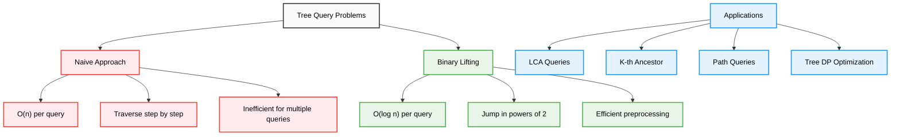
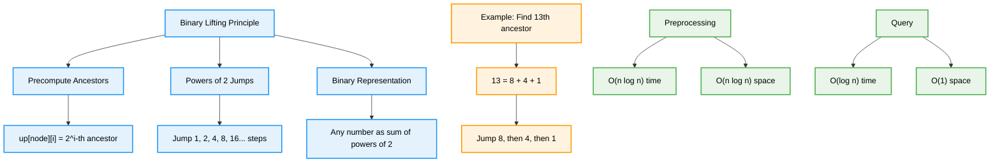
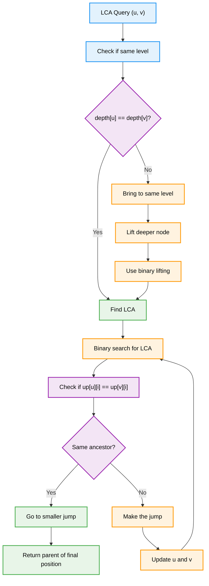
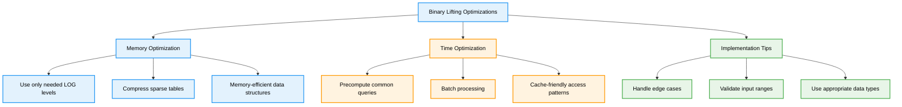

# Binary Lifting — Complete Professional <div align="center">Guide</div>

<div align="center">


**Master efficient tree traversal and ancestor queries with logarithmic complexity**

</div>

---

## Table of Contents

1. [Introduction](#introduction)
2. [Binary Lifting Concept](#binary-lifting-concept)
3. [Lowest Common Ancestor](#lowest-common-ancestor)
4. [Implementation](#implementation)
5. [Advanced Applications](#advanced-applications)
6. [Best Practices](#best-practices)

---

## Introduction

<div align="center">

</div>

**Binary Lifting** is a powerful technique used to efficiently answer ancestor queries in trees. It preprocesses the tree to enable O(log n) queries for finding the k-th ancestor of any node or the Lowest Common Ancestor (LCA) of two nodes.

### Why Binary Lifting?



---

## Binary Lifting Concept

### Core Idea



### Binary Lifting Table

```cpp
class BinaryLiftingBasics {
public:
    void demonstrateConcept() {
        cout << "Binary Lifting Table Construction:" << endl;
        cout << "=================================" << endl;
        
        cout << "For each node i and power j:" << endl;
        cout << "up[i][j] = 2^j-th ancestor of node i" << endl;
        cout << endl;
        
        cout << "Recurrence relation:" << endl;
        cout << "up[i][0] = parent[i]" << endl;
        cout << "up[i][j] = up[up[i][j-1]][j-1]" << endl;
        cout << endl;
        
        cout << "Example for finding 13th ancestor:" << endl;
        cout << "13 in binary = 1101" << endl;
        cout << "13 = 8 + 4 + 1 = 2^3 + 2^2 + 2^0" << endl;
        cout << "Jump: 8 steps -> 4 steps -> 1 step" << endl;
    }
    
    void showBinaryDecomposition(int k) {
        cout << "Finding " << k << "th ancestor:" << endl;
        cout << k << " in binary: ";
        
        vector<int> powers;
        for (int i = 0; i < 20; i++) {
            if (k & (1 << i)) {
                powers.push_back(i);
                cout << "1";
            } else {
                cout << "0";
            }
        }
        reverse(powers.begin(), powers.end());
        
        cout << endl << "Powers of 2: ";
        for (int p : powers) {
            cout << "2^" << p << " ";
        }
        cout << endl;
    }
};
```

---

## Lowest Common Ancestor

<div align="center">

</div>

### LCA Algorithm Flow



### LCA Implementation

```cpp
class LCA_BinaryLifting {
private:
    int n, LOG;
    vector<vector<int>> up;
    vector<int> depth;
    vector<vector<int>> adj;
    
public:
    LCA_BinaryLifting(int nodes) : n(nodes) {
        LOG = ceil(log2(n)) + 1;
        up.assign(n, vector<int>(LOG, -1));
        depth.assign(n, 0);
        adj.resize(n);
    }
    
    void addEdge(int u, int v) {
        adj[u].push_back(v);
        adj[v].push_back(u);
    }
    
    void preprocess(int root = 0) {
        // DFS to set up parent and depth
        dfs(root, -1);
        
        // Fill binary lifting table
        for (int j = 1; j < LOG; j++) {
            for (int i = 0; i < n; i++) {
                if (up[i][j-1] != -1) {
                    up[i][j] = up[up[i][j-1]][j-1];
                }
            }
        }
    }
    
    int lca(int u, int v) {
        // Make u the deeper node
        if (depth[u] < depth[v]) swap(u, v);
        
        // Bring u to the same level as v
        int diff = depth[u] - depth[v];
        for (int i = 0; i < LOG; i++) {
            if ((diff >> i) & 1) {
                u = up[u][i];
            }
        }
        
        // If v is ancestor of u
        if (u == v) return u;
        
        // Binary search for LCA
        for (int i = LOG - 1; i >= 0; i--) {
            if (up[u][i] != up[v][i]) {
                u = up[u][i];
                v = up[v][i];
            }
        }
        
        return up[u][0]; // Parent of current position
    }
    
    int kthAncestor(int node, int k) {
        if (depth[node] < k) return -1;
        
        for (int i = 0; i < LOG; i++) {
            if ((k >> i) & 1) {
                node = up[node][i];
                if (node == -1) return -1;
            }
        }
        return node;
    }
    
    int distance(int u, int v) {
        return depth[u] + depth[v] - 2 * depth[lca(u, v)];
    }
    
private:
    void dfs(int node, int parent) {
        up[node][0] = parent;
        
        for (int child : adj[node]) {
            if (child != parent) {
                depth[child] = depth[node] + 1;
                dfs(child, node);
            }
        }
    }
};
```

---

## Implementation

### Complete Binary Lifting Class

```cpp
class BinaryLifting {
private:
    int n, LOG;
    vector<vector<int>> up;
    vector<int> depth;
    vector<vector<int>> tree;
    
public:
    BinaryLifting(int nodes) : n(nodes) {
        LOG = ceil(log2(n)) + 1;
        up.assign(n, vector<int>(LOG, -1));
        depth.assign(n, 0);
        tree.resize(n);
    }
    
    void addEdge(int u, int v) {
        tree[u].push_back(v);
        tree[v].push_back(u);
    }
    
    void build(int root = 0) {
        dfs(root, -1);
        
        // Build binary lifting table
        for (int j = 1; j < LOG; j++) {
            for (int i = 0; i < n; i++) {
                if (up[i][j-1] != -1) {
                    up[i][j] = up[up[i][j-1]][j-1];
                }
            }
        }
    }
    
    // Find k-th ancestor of node
    int kthAncestor(int node, int k) {
        if (depth[node] < k) return -1;
        
        for (int i = 0; i < LOG; i++) {
            if ((k >> i) & 1) {
                node = up[node][i];
                if (node == -1) return -1;
            }
        }
        return node;
    }
    
    // Find LCA of two nodes
    int lca(int u, int v) {
        if (depth[u] < depth[v]) swap(u, v);
        
        // Bring to same level
        int diff = depth[u] - depth[v];
        u = kthAncestor(u, diff);
        
        if (u == v) return u;
        
        // Binary search for LCA
        for (int i = LOG - 1; i >= 0; i--) {
            if (up[u][i] != up[v][i]) {
                u = up[u][i];
                v = up[v][i];
            }
        }
        
        return up[u][0];
    }
    
    // Distance between two nodes
    int distance(int u, int v) {
        return depth[u] + depth[v] - 2 * depth[lca(u, v)];
    }
    
    // Check if u is ancestor of v
    bool isAncestor(int u, int v) {
        return lca(u, v) == u;
    }
    
    // Find node on path from u to v at distance k from u
    int nodeOnPath(int u, int v, int k) {
        int l = lca(u, v);
        int dist_u_l = depth[u] - depth[l];
        int dist_v_l = depth[v] - depth[l];
        
        if (k <= dist_u_l) {
            return kthAncestor(u, k);
        } else if (k <= dist_u_l + dist_v_l) {
            return kthAncestor(v, dist_u_l + dist_v_l - k);
        } else {
            return -1; // k is beyond the path
        }
    }
    
private:
    void dfs(int node, int parent) {
        up[node][0] = parent;
        
        for (int child : tree[node]) {
            if (child != parent) {
                depth[child] = depth[node] + 1;
                dfs(child, node);
            }
        }
    }
};
```

### Usage Example

```cpp
class BinaryLiftingDemo {
public:
    void demonstrateUsage() {
        // Create tree: 0-1-2-3-4
        //              |
        //              5-6
        BinaryLifting bl(7);
        
        bl.addEdge(0, 1);
        bl.addEdge(1, 2);
        bl.addEdge(2, 3);
        bl.addEdge(3, 4);
        bl.addEdge(0, 5);
        bl.addEdge(5, 6);
        
        bl.build(0); // Root at node 0
        
        cout << "Binary Lifting Demo:" << endl;
        cout << "===================" << endl;
        
        // K-th ancestor queries
        cout << "2nd ancestor of node 4: " << bl.kthAncestor(4, 2) << endl; // Should be 2
        cout << "3rd ancestor of node 6: " << bl.kthAncestor(6, 3) << endl; // Should be -1
        
        // LCA queries
        cout << "LCA of nodes 4 and 6: " << bl.lca(4, 6) << endl; // Should be 0
        cout << "LCA of nodes 3 and 4: " << bl.lca(3, 4) << endl; // Should be 3
        
        // Distance queries
        cout << "Distance between 4 and 6: " << bl.distance(4, 6) << endl; // Should be 6
        cout << "Distance between 2 and 3: " << bl.distance(2, 3) << endl; // Should be 1
        
        // Path queries
        cout << "Node at distance 2 from 4 towards 6: " << bl.nodeOnPath(4, 6, 2) << endl;
    }
};
```

---

## Advanced Applications

### Tree Path Queries

```cpp
class TreePathQueries {
private:
    BinaryLifting bl;
    vector<long long> values;
    vector<long long> prefixSum;
    
public:
    TreePathQueries(int n) : bl(n), values(n), prefixSum(n) {}
    
    void addEdge(int u, int v) {
        bl.addEdge(u, v);
    }
    
    void setValue(int node, long long val) {
        values[node] = val;
    }
    
    void build(int root = 0) {
        bl.build(root);
        computePrefixSums(root, -1, 0);
    }
    
    // Sum of values on path from u to v
    long long pathSum(int u, int v) {
        int l = bl.lca(u, v);
        return prefixSum[u] + prefixSum[v] - 2 * prefixSum[l] + values[l];
    }
    
    // Maximum value on path from u to v
    long long pathMax(int u, int v) {
        long long maxVal = LLONG_MIN;
        
        // Path from u to lca
        int curr = u;
        int l = bl.lca(u, v);
        
        while (curr != l) {
            maxVal = max(maxVal, values[curr]);
            curr = bl.kthAncestor(curr, 1);
        }
        
        // Path from v to lca
        curr = v;
        while (curr != l) {
            maxVal = max(maxVal, values[curr]);
            curr = bl.kthAncestor(curr, 1);
        }
        
        maxVal = max(maxVal, values[l]);
        return maxVal;
    }
    
private:
    void computePrefixSums(int node, int parent, long long sum) {
        sum += values[node];
        prefixSum[node] = sum;
        
        for (int child : bl.tree[node]) {
            if (child != parent) {
                computePrefixSums(child, node, sum);
            }
        }
    }
};
```

### Heavy-Light Decomposition Integration

```cpp
class HeavyLightWithBinaryLifting {
private:
    BinaryLifting bl;
    vector<int> heavy, head, pos, subtreeSize;
    int currentPos;
    
public:
    HeavyLightWithBinaryLifting(int n) : bl(n), heavy(n, -1), head(n), pos(n), subtreeSize(n), currentPos(0) {}
    
    void addEdge(int u, int v) {
        bl.addEdge(u, v);
    }
    
    void build(int root = 0) {
        bl.build(root);
        dfs1(root, -1);
        dfs2(root, root);
    }
    
    // Query using both techniques
    int efficientLCA(int u, int v) {
        // Use Heavy-Light for nodes on same heavy path
        while (head[u] != head[v]) {
            if (bl.depth[head[u]] > bl.depth[head[v]]) {
                u = bl.kthAncestor(head[u], 1);
            } else {
                v = bl.kthAncestor(head[v], 1);
            }
        }
        
        // Use binary lifting for final comparison
        return bl.depth[u] < bl.depth[v] ? u : v;
    }
    
private:
    int dfs1(int node, int parent) {
        subtreeSize[node] = 1;
        int maxSubtree = 0;
        
        for (int child : bl.tree[node]) {
            if (child != parent) {
                int childSize = dfs1(child, node);
                subtreeSize[node] += childSize;
                
                if (childSize > maxSubtree) {
                    maxSubtree = childSize;
                    heavy[node] = child;
                }
            }
        }
        
        return subtreeSize[node];
    }
    
    void dfs2(int node, int h) {
        head[node] = h;
        pos[node] = currentPos++;
        
        if (heavy[node] != -1) {
            dfs2(heavy[node], h);
        }
        
        for (int child : bl.tree[node]) {
            if (child != heavy[node] && child != bl.up[node][0]) {
                dfs2(child, child);
            }
        }
    }
};
```

---

## Best Practices

### Optimization Techniques



### Performance Considerations

```cpp
class OptimizedBinaryLifting {
private:
    int n, LOG;
    vector<vector<int>> up;
    vector<int> depth;
    
public:
    OptimizedBinaryLifting(int nodes) : n(nodes) {
        // Optimize LOG calculation
        LOG = 32 - __builtin_clz(n);
        up.assign(n, vector<int>(LOG, -1));
        depth.assign(n, 0);
    }
    
    // Memory-efficient preprocessing
    void buildOptimized(const vector<vector<int>>& tree, int root = 0) {
        // Use iterative DFS to avoid stack overflow
        stack<pair<int, int>> st;
        st.push({root, -1});
        
        while (!st.empty()) {
            auto [node, parent] = st.top();
            st.pop();
            
            up[node][0] = parent;
            
            for (int child : tree[node]) {
                if (child != parent) {
                    depth[child] = depth[node] + 1;
                    st.push({child, node});
                }
            }
        }
        
        // Build table level by level for better cache performance
        for (int j = 1; j < LOG; j++) {
            for (int i = 0; i < n; i++) {
                if (up[i][j-1] != -1) {
                    up[i][j] = up[up[i][j-1]][j-1];
                }
            }
        }
    }
    
    // Optimized LCA with early termination
    int lcaOptimized(int u, int v) {
        if (u == v) return u;
        
        if (depth[u] < depth[v]) swap(u, v);
        
        // Lift u to same level as v
        int diff = depth[u] - depth[v];
        for (int i = 0; i < LOG; i++) {
            if ((diff >> i) & 1) {
                u = up[u][i];
            }
        }
        
        if (u == v) return u;
        
        // Binary search with early termination
        for (int i = LOG - 1; i >= 0; i--) {
            if (up[u][i] != up[v][i]) {
                u = up[u][i];
                v = up[v][i];
            }
        }
        
        return up[u][0];
    }
    
    // Batch LCA queries for better performance
    vector<int> batchLCA(const vector<pair<int, int>>& queries) {
        vector<int> results;
        results.reserve(queries.size());
        
        for (const auto& [u, v] : queries) {
            results.push_back(lcaOptimized(u, v));
        }
        
        return results;
    }
};
```

### Common Pitfalls and Solutions

```cpp
class BinaryLiftingPitfalls {
public:
    void demonstrateCommonMistakes() {
        cout << "Common Binary Lifting Pitfalls:" << endl;
        cout << "===============================" << endl;
        
        cout << "1. Incorrect LOG calculation:" << endl;
        cout << "   ❌ LOG = log2(n)  // May be insufficient" << endl;
        cout << "   ✅ LOG = ceil(log2(n)) + 1  // Safe margin" << endl;
        
        cout << "2. Not handling root node:" << endl;
        cout << "   ❌ up[root][0] = root  // Creates cycle" << endl;
        cout << "   ✅ up[root][0] = -1    // Proper termination" << endl;
        
        cout << "3. Forgetting to check bounds:" << endl;
        cout << "   ❌ return up[node][i]  // May return -1" << endl;
        cout << "   ✅ if (up[node][i] == -1) return -1" << endl;
        
        cout << "4. Inefficient depth calculation:" << endl;
        cout << "   ❌ Recalculate depth in each query" << endl;
        cout << "   ✅ Precompute during DFS" << endl;
    }
    
    // Safe implementation with error checking
    int safeKthAncestor(int node, int k, const vector<vector<int>>& up, 
                       const vector<int>& depth) {
        if (k < 0 || node < 0 || node >= up.size()) return -1;
        if (k == 0) return node;
        if (depth[node] < k) return -1;
        
        int LOG = up[0].size();
        
        for (int i = 0; i < LOG; i++) {
            if ((k >> i) & 1) {
                node = up[node][i];
                if (node == -1) return -1;
            }
        }
        
        return node;
    }
};
```

---

## Summary

Binary Lifting provides efficient solutions for tree queries:

**Core Technique**: Precompute 2^i-th ancestors for all nodes and powers  
**Key Applications**: LCA queries, k-th ancestor, path queries, tree navigation  
**Complexity**: O(n log n) preprocessing, O(log n) per query  
**Optimization**: Memory-efficient implementation and batch processing  
**Integration**: Combines well with other tree algorithms like Heavy-Light Decomposition  

**Key Insight**: "Binary lifting transforms linear tree traversal into logarithmic jumps using powers of 2"

---

<div align="center">

**Master Efficient Tree Navigation with Binary Lifting**

*Where logarithmic complexity meets tree algorithm elegance*

</div>