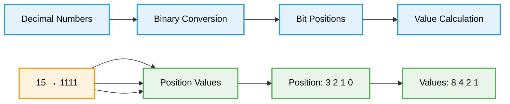
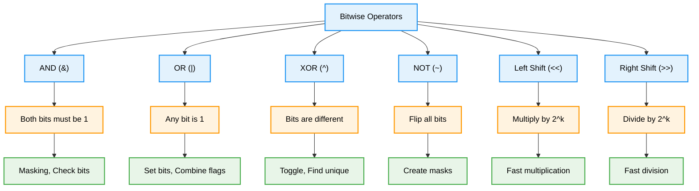
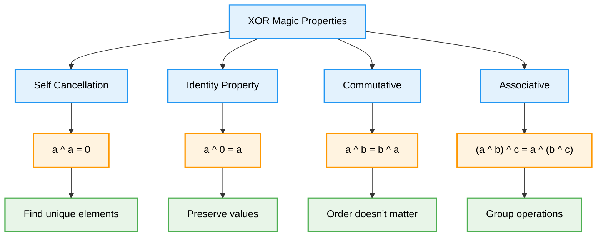
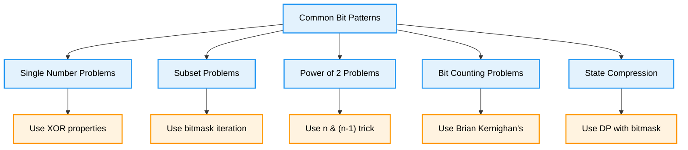

# Bit Manipulation — Complete Professional <div align="center">Guide</div>

<div align="center">


**Master the art of binary operations for ultra-efficient problem solving**

</div>

---

## Table of Contents

1. [Introduction](#introduction)
2. [Binary Fundamentals](#binary-fundamentals)
3. [Bitwise Operators](#bitwise-operators)
4. [XOR Magic](#xor-magic)
5. [Essential Bit Tricks](#essential-bit-tricks)
6. [Practical Applications](#practical-applications)
7. [Common Patterns](#common-patterns)
8. [Best Practices](#best-practices)

---

## Introduction

**Bit Manipulation** is a low-level programming technique that operates directly on binary representations of numbers. It's one of the most powerful tools for writing highly optimized code with O(1) time complexity for most operations.

### Why Bit Manipulation?

```mermaid
flowchart TD
    A["Bit Manipulation Benefits"] --> B["Ultra-Fast Performance"]
    A --> C["Memory Efficient"]
    A --> D["CPU-Level Operations"]
    A --> E["Elegant Solutions"]
    
    B --> F["O(1) operations"]
    B --> G["Hardware optimized"]
    B --> H["No function calls"]
    
    C --> I["Compact representation"]
    C --> J["State compression"]
    C --> K["Flag systems"]
    
    D --> L["Direct hardware support"]
    D --> M["Assembly level"]
    D --> N["Processor instructions"]
    
    E --> O["Simple code"]
    E --> P["Complex problems"]
    E --> Q["Mathematical elegance"]
    
    classDef default fill:#f9f9f9,stroke:#333,stroke-width:2px,color:#000
    classDef benefits fill:#e3f2fd,stroke:#2196f3,stroke-width:2px,color:#000
    classDef performance fill:#e8f5e8,stroke:#4caf50,stroke-width:2px,color:#000
    classDef efficiency fill:#fff3e0,stroke:#ff9800,stroke-width:2px,color:#000
    classDef hardware fill:#f3e5f5,stroke:#9c27b0,stroke-width:2px,color:#000
    classDef elegance fill:#ffebee,stroke:#f44336,stroke-width:2px,color:#000
    class A benefits
    class B,F,G,H performance
    class C,I,J,K efficiency
    class D,L,M,N hardware
    class E,O,P,Q elegance
```



---

## Binary Fundamentals

<div align="center">

</div>

### Binary Representation



### Key Terminology

**MSB (Most Significant Bit)**: Leftmost bit with highest value  
**LSB (Least Significant Bit)**: Rightmost bit with lowest value  
**Set Bit**: Bit with value 1  
**Clear Bit**: Bit with value 0  
**Bit Position**: Index from right (0-indexed)  

### Performance Comparison

| Operation | Traditional | Bit Manipulation | Speedup |
|-----------|-------------|------------------|---------|
| Check Even/Odd | `n % 2 == 0` | `n & 1` | 2-3x faster |
| Multiply by 2 | `n * 2` | `n << 1` | 5-10x faster |
| Divide by 2 | `n / 2` | `n >> 1` | 3-5x faster |
| Power of 2 Check | Loop/Log | `n & (n-1) == 0` | 100x faster |

---

## Bitwise Operators

<div align="center">

</div>

### Operator Overview



### AND Operator (&)

**Rule**: Result is 1 only if BOTH bits are 1

```cpp
// Truth Table: 0&0=0, 0&1=0, 1&0=0, 1&1=1
// Example: 5 & 3 = 0101 & 0011 = 0001 = 1

// Use Cases:
bool isEven(int n) { return (n & 1) == 0; }
bool isBitSet(int n, int pos) { return (n & (1 << pos)) != 0; }
int clearBit(int n, int pos) { return n & ~(1 << pos); }
```

### OR Operator (|)

**Rule**: Result is 1 if ANY bit is 1

```cpp
// Truth Table: 0|0=0, 0|1=1, 1|0=1, 1|1=1
// Example: 5 | 3 = 0101 | 0011 = 0111 = 7

// Use Cases:
int setBit(int n, int pos) { return n | (1 << pos); }
int combineFlags(int flag1, int flag2) { return flag1 | flag2; }
```

### XOR Operator (^)

<div align="center">

</div>

**Rule**: Result is 1 if bits are DIFFERENT

```cpp
// Truth Table: 0^0=0, 0^1=1, 1^0=1, 1^1=0
// Example: 5 ^ 3 = 0101 ^ 0011 = 0110 = 6

// XOR Properties:
// a ^ a = 0 (Self-cancellation)
// a ^ 0 = a (Identity)
// a ^ b = b ^ a (Commutative)
// (a ^ b) ^ c = a ^ (b ^ c) (Associative)

// Use Cases:
int toggleBit(int n, int pos) { return n ^ (1 << pos); }
void swapNumbers(int& a, int& b) { a ^= b; b ^= a; a ^= b; }
int findUnique(vector<int>& arr) {
    int result = 0;
    for (int x : arr) result ^= x;
    return result;
}
```

### Shift Operators

```cpp
// Left Shift (<<): Multiply by 2^k
int multiplyBy4(int n) { return n << 2; } // n * 2^2 = n * 4

// Right Shift (>>): Divide by 2^k
int divideBy8(int n) { return n >> 3; } // n / 2^3 = n / 8

// Create powers of 2
int powerOf2(int k) { return 1 << k; } // 2^k
```

---

## XOR Magic

### XOR Properties and Applications



### Classic XOR Problems

```cpp
// Problem 1: Find Single Unique Number
// Array where every element appears twice except one
int findSingle(vector<int>& nums) {
    int result = 0;
    for (int num : nums) {
        result ^= num; // Duplicates cancel out
    }
    return result;
}

// Problem 2: Swap Without Temporary Variable
void swapXOR(int& a, int& b) {
    if (a != b) { // Avoid self-assignment
        a ^= b;
        b ^= a;
        a ^= b;
    }
}

// Problem 3: Find Two Unique Numbers
vector<int> findTwoUnique(vector<int>& nums) {
    int xorAll = 0;
    for (int num : nums) xorAll ^= num;
    
    // Find rightmost set bit
    int rightBit = xorAll & -xorAll;
    
    int num1 = 0, num2 = 0;
    for (int num : nums) {
        if (num & rightBit) {
            num1 ^= num;
        } else {
            num2 ^= num;
        }
    }
    return {num1, num2};
}
```

---

## Essential Bit Tricks

### Core Operations

```mermaid
flowchart TD
    A["Essential Bit Tricks"] --> B["Check Operations"]
    A --> C["Modify Operations"]
    A --> D["Count Operations"]
    A --> E["Special Tricks"]
    
    B --> F["Even/Odd: n & 1"]
    B --> G["Power of 2: n & (n-1) == 0"]
    B --> H["Bit Set: n & (1 << i)"]
    
    C --> I["Set Bit: n | (1 << i)"]
    C --> J["Clear Bit: n & ~(1 << i)"]
    C --> K["Toggle Bit: n ^ (1 << i)"]
    
    D --> L["Count Set Bits"]
    D --> M["Brian Kernighan's Algorithm"]
    
    E --> N["Remove Rightmost: n & (n-1)"]
    E --> O["Get Rightmost: n & -n"]
    E --> P["Isolate Rightmost: n ^ (n-1)"]
    
    classDef default fill:#f9f9f9,stroke:#333,stroke-width:2px,color:#000
    classDef category fill:#e3f2fd,stroke:#2196f3,stroke-width:2px,color:#000
    classDef check fill:#fff3e0,stroke:#ff9800,stroke-width:2px,color:#000
    classDef modify fill:#e8f5e8,stroke:#4caf50,stroke-width:2px,color:#000
    classDef count fill:#f3e5f5,stroke:#9c27b0,stroke-width:2px,color:#000
    classDef special fill:#ffebee,stroke:#f44336,stroke-width:2px,color:#000
    class A category
    class B,F,G,H check
    class C,I,J,K modify
    class D,L,M count
    class E,N,O,P special
```



### Implementation Examples

```cpp
class BitTricks {
public:
    // 1. Check if number is even
    bool isEven(int n) {
        return (n & 1) == 0;
    }
    
    // 2. Check if power of 2
    bool isPowerOf2(int n) {
        return n > 0 && (n & (n - 1)) == 0;
    }
    
    // 3. Count set bits (Brian Kernighan's Algorithm)
    int countSetBits(int n) {
        int count = 0;
        while (n) {
            n &= (n - 1); // Remove rightmost set bit
            count++;
        }
        return count;
    }
    
    // 4. Get rightmost set bit
    int getRightmostSetBit(int n) {
        return n & -n;
    }
    
    // 5. Remove rightmost set bit
    int removeRightmostSetBit(int n) {
        return n & (n - 1);
    }
    
    // 6. Check if i-th bit is set
    bool isBitSet(int n, int i) {
        return (n & (1 << i)) != 0;
    }
    
    // 7. Set i-th bit
    int setBit(int n, int i) {
        return n | (1 << i);
    }
    
    // 8. Clear i-th bit
    int clearBit(int n, int i) {
        return n & ~(1 << i);
    }
    
    // 9. Toggle i-th bit
    int toggleBit(int n, int i) {
        return n ^ (1 << i);
    }
    
    // 10. Fast multiplication/division by powers of 2
    int multiplyBy2Power(int n, int k) {
        return n << k; // n * 2^k
    }
    
    int divideBy2Power(int n, int k) {
        return n >> k; // n / 2^k
    }
};
```

---

## Practical Applications

<div align="center">

</div>

### Real-World Use Cases

```mermaid
flowchart TD
    A["Practical Applications"] --> B["System Programming"]
    A --> C["Graphics & Gaming"]
    A --> D["Cryptography"]
    A --> E["Networking"]
    A --> F["Competitive Programming"]
    
    B --> G["Memory management"]
    B --> H["File permissions"]
    B --> I["Hardware control"]
    
    C --> J["Color manipulation"]
    C --> K["Sprite masking"]
    C --> L["Collision detection"]
    
    D --> M["Encryption algorithms"]
    D --> N["Hash functions"]
    D --> O["Random number generation"]
    
    E --> P["IP address operations"]
    E --> Q["Packet headers"]
    E --> R["Protocol flags"]
    
    F --> S["State compression"]
    F --> T["Fast arithmetic"]
    F --> U["Subset enumeration"]
    
    classDef default fill:#f9f9f9,stroke:#333,stroke-width:2px,color:#000
    classDef domain fill:#e3f2fd,stroke:#2196f3,stroke-width:2px,color:#000
    classDef system fill:#fff3e0,stroke:#ff9800,stroke-width:2px,color:#000
    classDef graphics fill:#e8f5e8,stroke:#4caf50,stroke-width:2px,color:#000
    classDef crypto fill:#f3e5f5,stroke:#9c27b0,stroke-width:2px,color:#000
    classDef network fill:#ffebee,stroke:#f44336,stroke-width:2px,color:#000
    classDef competitive fill:#e1f5fe,stroke:#0277bd,stroke-width:2px,color:#000
    class A domain
    class B,G,H,I system
    class C,J,K,L graphics
    class D,M,N,O crypto
    class E,P,Q,R network
    class F,S,T,U competitive
```



### Implementation Examples

```cpp
// 1. Permission System
class PermissionSystem {
    enum Permission {
        READ = 1 << 0,    // 001
        WRITE = 1 << 1,   // 010
        EXECUTE = 1 << 2  // 100
    };
    
    int userPermissions = 0;
    
public:
    void grantPermission(Permission perm) {
        userPermissions |= perm;
    }
    
    void revokePermission(Permission perm) {
        userPermissions &= ~perm;
    }
    
    bool hasPermission(Permission perm) {
        return (userPermissions & perm) != 0;
    }
};

// 2. Subset Generation
void generateAllSubsets(vector<int>& nums) {
    int n = nums.size();
    int totalSubsets = 1 << n; // 2^n
    
    for (int mask = 0; mask < totalSubsets; mask++) {
        cout << "{ ";
        for (int i = 0; i < n; i++) {
            if (mask & (1 << i)) {
                cout << nums[i] << " ";
            }
        }
        cout << "}" << endl;
    }
}

// 3. Fast Exponentiation
long long fastPower(long long base, long long exp) {
    long long result = 1;
    while (exp > 0) {
        if (exp & 1) { // If exp is odd
            result *= base;
        }
        base *= base;
        exp >>= 1; // Divide exp by 2
    }
    return result;
}

// 4. Color Manipulation (RGB)
class ColorManipulation {
public:
    // Extract RGB components
    int getRed(int color) { return (color >> 16) & 0xFF; }
    int getGreen(int color) { return (color >> 8) & 0xFF; }
    int getBlue(int color) { return color & 0xFF; }
    
    // Create color from RGB
    int createColor(int r, int g, int b) {
        return (r << 16) | (g << 8) | b;
    }
    
    // Blend colors
    int blendColors(int color1, int color2) {
        int r = (getRed(color1) + getRed(color2)) / 2;
        int g = (getGreen(color1) + getGreen(color2)) / 2;
        int b = (getBlue(color1) + getBlue(color2)) / 2;
        return createColor(r, g, b);
    }
};
```

---

## Common Patterns

### Pattern Recognition



### Problem Categories

```cpp
// 1. Single Number Variants
int singleNumber(vector<int>& nums) {
    int result = 0;
    for (int num : nums) result ^= num;
    return result;
}

// 2. Subset Sum using Bitmask
bool canPartition(vector<int>& nums) {
    int sum = accumulate(nums.begin(), nums.end(), 0);
    if (sum % 2) return false;
    
    int target = sum / 2;
    vector<bool> dp(target + 1, false);
    dp[0] = true;
    
    for (int num : nums) {
        for (int j = target; j >= num; j--) {
            dp[j] = dp[j] || dp[j - num];
        }
    }
    return dp[target];
}

// 3. Count Set Bits in Range
int countBits(int n) {
    vector<int> result(n + 1);
    for (int i = 1; i <= n; i++) {
        result[i] = result[i >> 1] + (i & 1);
    }
    return result[n];
}

// 4. Maximum XOR
int findMaximumXOR(vector<int>& nums) {
    int maxXor = 0, mask = 0;
    
    for (int i = 30; i >= 0; i--) {
        mask |= (1 << i);
        unordered_set<int> prefixes;
        
        for (int num : nums) {
            prefixes.insert(num & mask);
        }
        
        int candidate = maxXor | (1 << i);
        for (int prefix : prefixes) {
            if (prefixes.count(candidate ^ prefix)) {
                maxXor = candidate;
                break;
            }
        }
    }
    return maxXor;
}
```

---

## Best Practices

### Optimization Guidelines

```mermaid
flowchart TD
    A["Best Practices"] --> B["Performance Tips"]
    A --> C["Readability Guidelines"]
    A --> D["Common Pitfalls"]
    A --> E["Testing Strategies"]
    
    B --> F["Use bit ops for hot paths"]
    B --> G["Prefer shifts over multiply/divide"]
    B --> H["Cache bit manipulation results"]
    
    C --> I["Comment complex operations"]
    C --> J["Use meaningful variable names"]
    C --> K["Explain bit tricks"]
    
    D --> L["Watch for integer overflow"]
    D --> M["Handle negative numbers"]
    D --> N["Consider endianness"]
    
    E --> O["Test edge cases"]
    E --> P["Verify with small examples"]
    E --> Q["Check boundary conditions"]
    
    classDef default fill:#f9f9f9,stroke:#333,stroke-width:2px,color:#000
    classDef category fill:#e3f2fd,stroke:#2196f3,stroke-width:2px,color:#000
    classDef performance fill:#e8f5e8,stroke:#4caf50,stroke-width:2px,color:#000
    classDef readability fill:#fff3e0,stroke:#ff9800,stroke-width:2px,color:#000
    classDef pitfalls fill:#ffebee,stroke:#f44336,stroke-width:2px,color:#000
    classDef testing fill:#f3e5f5,stroke:#9c27b0,stroke-width:2px,color:#000
    class A category
    class B,F,G,H performance
    class C,I,J,K readability
    class D,L,M,N pitfalls
    class E,O,P,Q testing
```



### Do's and Don'ts

**✅ Do's:**
- Use bit manipulation for performance-critical code
- Prefer `(n & 1)` over `(n % 2)` for even/odd checks
- Use `(1 << k)` instead of `pow(2, k)`
- Comment complex bit operations clearly
- Test with edge cases (0, negative numbers, overflow)

**❌ Don'ts:**
- Don't overuse for simple operations where readability matters
- Avoid unclear bit tricks without proper documentation
- Don't assume fixed integer sizes (32-bit vs 64-bit)
- Avoid bit manipulation in code that prioritizes readability
- Don't forget to handle signed integer edge cases

### Code Examples

```cpp
// ✅ Good: Clear and documented
bool isPowerOfTwo(int n) {
    // A power of 2 has exactly one bit set
    // n & (n-1) removes the rightmost set bit
    return n > 0 && (n & (n - 1)) == 0;
}

// ❌ Bad: Unclear without comments
bool check(int n) {
    return n > 0 && !(n & (n - 1));
}

// ✅ Good: Handles edge cases
int countSetBits(int n) {
    if (n < 0) return -1; // Handle negative input
    
    int count = 0;
    while (n) {
        n &= (n - 1); // Remove rightmost set bit
        count++;
    }
    return count;
}
```

---

## Summary

Bit manipulation provides ultra-efficient solutions for many programming problems:

**Core Operations**: Master AND, OR, XOR, NOT, and shift operators for fundamental bit operations  
**XOR Magic**: Leverage XOR properties for elegant solutions to unique element problems  
**Essential Tricks**: Use `n & (n-1)` for power of 2 checks and bit counting algorithms  
**Practical Applications**: Apply to system programming, graphics, cryptography, and competitive programming  
**Performance**: Achieve O(1) time complexity for most operations with hardware-level efficiency  

**Key Insight**: "Bit manipulation transforms complex problems into elegant solutions using the fundamental language of computers"

---

<div align="center">

**Master Bits, Master Efficiency**

*Where binary operations meet algorithmic elegance*

</div>