# 🔢 Bit Manipulation — Complete Professional Guide

<div align="center">


*Master the art of binary operations for ultra-efficient problem solving*

</div>

---

## 📑 Table of Contents

1. [Introduction](#-introduction)
2. [Why Bit Manipulation?](#-why-bit-manipulation)
3. [Binary Representation Basics](#-binary-representation-basics)
4. [Bitwise Operators](#-bitwise-operators)
5. [Essential Bit Tricks](#-essential-bit-tricks)
6. [XOR Magic](#-xor-magic)
7. [Bit Masking](#-bit-masking)
8. [Common Patterns](#-common-patterns)
9. [Interview Problems](#-interview-problems)
10. [Complexity Analysis](#-complexity-analysis)
11. [Best Practices](#-best-practices)

---

## 🎯 Introduction

**Bit Manipulation** is a low-level programming technique that operates directly on binary representations of numbers. It's one of the most powerful tools in a programmer's arsenal for writing highly optimized code.

### 🔑 Key Concepts

- **Bit**: The smallest unit of data (0 or 1)
- **Binary**: Base-2 number system used by computers
- **Bitwise Operations**: Direct manipulation of bits
- **Performance**: O(1) time complexity for most operations

### 💡 Real-World Applications

| Domain | Application |
|:-------|:------------|
| **Systems Programming** | Memory management, flags, permissions |
| **Cryptography** | Encryption algorithms, hash functions |
| **Graphics** | Color manipulation, image processing |
| **Networking** | IP address operations, packet headers |
| **Competitive Programming** | Fast arithmetic, state compression |
| **Embedded Systems** | Hardware control, register manipulation |

---

## 🚀 Why Bit Manipulation?

### ✅ Advantages

```mermaid
flowchart TD
    A["🔢 Bit Manipulation Benefits"] --> B["🔥 Ultra-Fast Performance"]
    A --> C["💾 Memory Efficient"]
    A --> D["⚡ CPU-Level Operations"]
    A --> E["🎯 Elegant Solutions"]
    A --> F["🔐 Security Applications"]
    
    B --> G["O(1) operations"]
    B --> H["Hardware optimized"]
    B --> I["No function calls"]
    
    C --> J["Compact representation"]
    C --> K["State compression"]
    C --> L["Flag systems"]
    
    D --> M["Direct hardware support"]
    D --> N["Assembly level"]
    D --> O["Processor instructions"]
    
    E --> P["Simple code"]
    E --> Q["Complex problems"]
    E --> R["Mathematical elegance"]
    
    F --> S["Cryptographic operations"]
    F --> T["Hash functions"]
    F --> U["Encryption algorithms"]
    
    style A fill:#e3f2fd
    style B fill:#c8e6c9
    style C fill:#fff3e0
    style D fill:#fce4ec
    style E fill:#f3e5f5
    style F fill:#e8f5e8
```



### 📊 Performance Comparison

| Operation | Normal Approach | Bit Manipulation |
|:----------|:----------------|:-----------------|
| Check Even/Odd | `n % 2 == 0` | `n & 1` |
| Multiply by 2 | `n * 2` | `n << 1` |
| Divide by 2 | `n / 2` | `n >> 1` |
| Power of 2 Check | Loop/Log | `n & (n-1) == 0` |
| Swap Numbers | Temp variable | XOR trick |

---

## 📐 Binary Representation Basics

### 🔢 Decimal to Binary Conversion

```
Decimal → Binary

0  →  0000
1  →  0001
2  →  0010
3  →  0011
4  →  0100
5  →  0101
6  →  0110
7  →  0111
8  →  1000
15 →  1111
```

### 📍 Bit Positions

```
Number: 13 (Decimal)
Binary: 1101

Position:  3  2  1  0
Bit:       1  1  0  1
Value:     8  4  0  1  = 13

MSB (Most Significant Bit)  ←  1101  →  LSB (Least Significant Bit)
```

### 🎯 Important Terminology

- **MSB**: Leftmost bit (highest value)
- **LSB**: Rightmost bit (lowest value)
- **Set Bit**: Bit with value 1
- **Clear Bit**: Bit with value 0
- **Bit Position**: Index from right (0-indexed)

---

## ⚙️ Bitwise Operators


### 1️⃣ AND Operator (&)

**Rule**: Result is 1 only if BOTH bits are 1

```
Truth Table:
0 & 0 = 0
0 & 1 = 0
1 & 0 = 0
1 & 1 = 1

Example:
  5 & 3
  0101
& 0011
------
  0001  →  1
```

**✅ Use Cases:**
- Check if bit is set
- Clear specific bits
- Check even/odd: `n & 1`
- Extract specific bits (masking)

### 2️⃣ OR Operator (|)

**Rule**: Result is 1 if ANY bit is 1

```
Truth Table:
0 | 0 = 0
0 | 1 = 1
1 | 0 = 1
1 | 1 = 1

Example:
  5 | 3
  0101
| 0011
------
  0111  →  7
```

**✅ Use Cases:**
- Set specific bits
- Combine bit flags
- Union operations

### 3️⃣ XOR Operator (^)

**Rule**: Result is 1 if bits are DIFFERENT

```
Truth Table:
0 ^ 0 = 0
0 ^ 1 = 1
1 ^ 0 = 1
1 ^ 1 = 0

Example:
  5 ^ 3
  0101
^ 0011
------
  0110  →  6
```

**✅ Use Cases:**
- Find unique elements
- Swap without temp variable
- Toggle bits
- Detect differences

**🔥 XOR Properties:**
```
a ^ a = 0        (Self-cancellation)
a ^ 0 = a        (Identity)
a ^ b = b ^ a    (Commutative)
(a ^ b) ^ c = a ^ (b ^ c)  (Associative)
```

### 4️⃣ NOT Operator (~)

**Rule**: Flips all bits (1→0, 0→1)

```
Example:
~5
  00000101
  ↓
  11111010  →  -6 (in 2's complement)
```

**✅ Use Cases:**
- Bit inversion
- Creating masks
- Complement operations

### 5️⃣ Left Shift (<<)

**Rule**: Shifts bits left, fills with 0

```
Example:
5 << 1
  0101  →  1010  (10)

5 << 2
  0101  →  10100  (20)

Formula: n << k = n × 2^k
```

**✅ Use Cases:**
- Fast multiplication by powers of 2
- Create bit masks
- Position bits

### 6️⃣ Right Shift (>>)

**Rule**: Shifts bits right, discards LSB

```
Example:
5 >> 1
  0101  →  0010  (2)

5 >> 2
  0101  →  0001  (1)

Formula: n >> k = n ÷ 2^k
```

**✅ Use Cases:**
- Fast division by powers of 2
- Extract higher bits
- Reduce numbers

---

## 🎪 Essential Bit Tricks

```mermaid
flowchart TD
    A["🎪 Essential Bit Tricks"] --> B["Check Even/Odd"]
    A --> C["Set/Clear/Toggle Bits"]
    A --> D["Power of 2 Operations"]
    A --> E["Count Set Bits"]
    A --> F["Remove Rightmost Set Bit"]
    
    B --> G["n & 1"]
    B --> H["O(1) operation"]
    
    C --> I["Set: n | (1 << i)"]
    C --> J["Clear: n & ~(1 << i)"]
    C --> K["Toggle: n ^ (1 << i)"]
    
    D --> L["Check: n & (n-1) == 0"]
    D --> M["Most important trick"]
    
    E --> N["Brian Kernighan's"]
    E --> O["O(set bits)"]
    
    F --> P["n & (n-1)"]
    F --> Q["Core operation"]
    
    style A fill:#e3f2fd
    style B fill:#c8e6c9
    style C fill:#fff3e0
    style D fill:#fce4ec
    style E fill:#f3e5f5
    style F fill:#e8f5e8
```



### 1. Check Even or Odd

```cpp
// Traditional
if (n % 2 == 0) // even

// Bit Manipulation ⚡
if (n & 1) // odd
else       // even
```

**Logic**: LSB is 1 for odd, 0 for even

---

### 2. Check if i-th Bit is Set

```cpp
bool isSet(int n, int i) {
    return (n & (1 << i)) != 0;
}

// Example: Check if 2nd bit of 5 (0101) is set
// 5 & (1 << 2) = 0101 & 0100 = 0100 ≠ 0 → TRUE
```

---

### 3. Set i-th Bit

```cpp
int setBit(int n, int i) {
    return n | (1 << i);
}

// Example: Set 1st bit of 5 (0101)
// 5 | (1 << 1) = 0101 | 0010 = 0111 = 7
```

---

### 4. Clear i-th Bit

```cpp
int clearBit(int n, int i) {
    return n & ~(1 << i);
}

// Example: Clear 2nd bit of 5 (0101)
// 5 & ~(1 << 2) = 0101 & 1011 = 0001 = 1
```

---

### 5. Toggle i-th Bit

```cpp
int toggleBit(int n, int i) {
    return n ^ (1 << i);
}

// Example: Toggle 0th bit of 5 (0101)
// 5 ^ (1 << 0) = 0101 ^ 0001 = 0100 = 4
```

---

### 6. Remove Rightmost Set Bit

```cpp
int removeRightmostSetBit(int n) {
    return n & (n - 1);
}

// Example: 12 (1100)
// 12 & 11 = 1100 & 1011 = 1000 = 8
```

**🔥 Most Important Trick!**

---

### 7. Check if Power of Two

```cpp
bool isPowerOfTwo(int n) {
    return n > 0 && (n & (n - 1)) == 0;
}

// Power of 2 has only ONE set bit
// 8 = 1000, 8-1 = 0111, 1000 & 0111 = 0000
```

---

### 8. Count Set Bits (Brian Kernighan's Algorithm)

```cpp
int countSetBits(int n) {
    int count = 0;
    while (n) {
        n = n & (n - 1);  // Remove rightmost set bit
        count++;
    }
    return count;
}

// Time: O(number of set bits)
```

---

### 9. Get Rightmost Set Bit

```cpp
int getRightmostSetBit(int n) {
    return n & -n;
}

// Example: 12 (1100)
// -12 in 2's complement = 0100
// 1100 & 0100 = 0100 = 4
```

---

### 10. Clear All Bits from MSB to i-th Bit

```cpp
int clearBitsMSBtoI(int n, int i) {
    int mask = (1 << i) - 1;
    return n & mask;
}
```

---

## 🎭 XOR Magic

### 🔥 Problem 1: Find Single Unique Number

**Problem**: Array where every element appears twice except one. Find the unique element.

```cpp
int findUnique(vector<int>& nums) {
    int result = 0;
    for (int num : nums) {
        result ^= num;
    }
    return result;
}

// Example: [4, 1, 2, 1, 2]
// 4 ^ 1 ^ 2 ^ 1 ^ 2 = 4
// (1 ^ 1) = 0, (2 ^ 2) = 0, 4 ^ 0 = 4
```

**Time**: O(n) | **Space**: O(1)

---

### 🔥 Problem 2: Swap Two Numbers Without Temp

```cpp
void swap(int& a, int& b) {
    a = a ^ b;
    b = a ^ b;  // b = (a ^ b) ^ b = a
    a = a ^ b;  // a = (a ^ b) ^ a = b
}

// Example: a=5, b=3
// a = 5 ^ 3 = 6
// b = 6 ^ 3 = 5
// a = 6 ^ 5 = 3
```

---

### 🔥 Problem 3: Find Two Unique Numbers

**Problem**: Array where every element appears twice except two. Find both unique elements.

```cpp
vector<int> findTwoUnique(vector<int>& nums) {
    int xorAll = 0;
    for (int num : nums) xorAll ^= num;
    
    // Find rightmost set bit
    int rightmostBit = xorAll & -xorAll;
    
    int num1 = 0, num2 = 0;
    for (int num : nums) {
        if (num & rightmostBit)
            num1 ^= num;
        else
            num2 ^= num;
    }
    
    return {num1, num2};
}
```

---

## 🎯 Bit Masking

**Bit Masking** uses bits to represent states, sets, or flags.

### Example: Subset Generation

```cpp
void generateSubsets(vector<int>& nums) {
    int n = nums.size();
    int totalSubsets = 1 << n;  // 2^n
    
    for (int mask = 0; mask < totalSubsets; mask++) {
        cout << "{ ";
        for (int i = 0; i < n; i++) {
            if (mask & (1 << i)) {
                cout << nums[i] << " ";
            }
        }
        cout << "}\n";
    }
}

// For [1,2,3]:
// mask=0 (000) → {}
// mask=1 (001) → {1}
// mask=2 (010) → {2}
// mask=3 (011) → {1,2}
// ...
```

### Example: Permission System

```cpp
const int READ = 1 << 0;    // 001
const int WRITE = 1 << 1;   // 010
const int EXECUTE = 1 << 2; // 100

int permissions = 0;

// Grant permissions
permissions |= READ;
permissions |= WRITE;

// Check permission
if (permissions & READ) {
    cout << "Can read\n";
}

// Revoke permission
permissions &= ~WRITE;
```

---

## 🎨 Common Patterns

### Pattern 1: Iterate Through All Subsets

```cpp
for (int mask = 0; mask < (1 << n); mask++) {
    // Process subset represented by mask
}
```

---

### Pattern 2: Check All Bits

```cpp
for (int i = 0; i < 32; i++) {
    if (n & (1 << i)) {
        // i-th bit is set
    }
}
```

---

### Pattern 3: DP with Bitmask

```cpp
int dp[1 << n];  // State compression
// Each bit represents inclusion/exclusion
```

---

## 🏆 Interview Problems

### ✅ Easy Level

1. **Single Number** (LeetCode 136)
2. **Number of 1 Bits** (LeetCode 191)
3. **Power of Two** (LeetCode 231)
4. **Reverse Bits** (LeetCode 190)
5. **Missing Number** (LeetCode 268)

### ✅ Medium Level

6. **Single Number II** (LeetCode 137)
7. **Single Number III** (LeetCode 260)
8. **Bitwise AND of Numbers Range** (LeetCode 201)
9. **Maximum XOR of Two Numbers** (LeetCode 421)
10. **Subsets** (LeetCode 78)

### ✅ Hard Level

11. **Maximum XOR Queries** (LeetCode 1707)
12. **Minimum XOR Sum** (LeetCode 1879)
13. **Shortest Path Visiting All Nodes** (LeetCode 847)

---

## ⏱️ Complexity Analysis

### Time Complexity

| Operation | Complexity |
|:----------|:-----------|
| AND, OR, XOR, NOT | O(1) |
| Left/Right Shift | O(1) |
| Count Set Bits | O(log n) or O(set bits) |
| Check Power of 2 | O(1) |
| Generate Subsets | O(2^n × n) |

### Space Complexity

- Most operations: **O(1)**
- Extremely memory efficient
- No extra data structures needed

---

## 💎 Best Practices

### ✅ Do's

```
✓ Use bit manipulation for performance-critical code
✓ Prefer (n & 1) over (n % 2) for even/odd checks
✓ Use (1 << k) instead of pow(2, k)
✓ Comment complex bit operations
✓ Test with edge cases (0, negative numbers)
```

### ❌ Don'ts

```
✗ Don't overuse for simple operations
✗ Avoid unclear bit tricks without comments
✗ Don't assume 32-bit integers always
✗ Avoid bit manipulation for readability-critical code
```

---

## 🎓 Key Takeaways

<div align="center">

### 🌟 Master These Concepts

</div>

```
1. 🔥 n & (n-1) removes rightmost set bit
2. 🎯 XOR properties: a^a=0, a^0=a
3. ⚡ Left shift multiplies, right shift divides by 2
4. 🎪 Bit masking for state representation
5. 💡 Check power of 2: n>0 && (n&(n-1))==0
6. 🚀 Count bits: Brian Kernighan's algorithm
7. 🎭 Generate subsets using bitmask
8. 🔐 AND for checking, OR for setting, XOR for toggling
```

---

## 📚 Practice Resources

- **LeetCode**: Bit Manipulation tag
- **Codeforces**: Bitmask DP problems
- **GeeksforGeeks**: Bit tricks articles
- **HackerRank**: Bit manipulation challenges

---

## 🎯 Interview Tips

1. **Recognize Patterns**: XOR for unique elements, bitmask for subsets
2. **Explain Logic**: Always explain the bit operation reasoning
3. **Test Edge Cases**: 0, negative numbers, overflow
4. **Optimize**: Mention bit manipulation as optimization
5. **Practice**: Solve 20+ problems to build intuition

---

<div align="center">

### 🔥 One-Line Summary

**Bit Manipulation = Ultra-fast, memory-efficient operations using binary magic for elegant problem solving**

---

**💻 Master bits, master efficiency!**

*"In the world of computing, everything is just 0s and 1s. Master them, and you master everything."*

</div>
