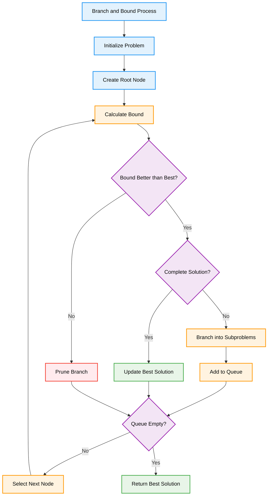
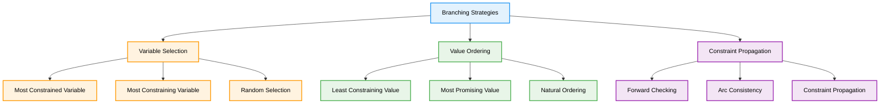

# Branch and Bound — Complete Professional <div align="center">Guide</div>

<div align="center">


**Master systematic optimization through intelligent search space exploration**

</div>

---

## Table of Contents

1. [Introduction](#introduction)
2. [Core Concepts](#core-concepts)
3. [Branching Strategy](#branching-strategy)
4. [Bounding Techniques](#bounding-techniques)
5. [Pruning Methods](#pruning-methods)
6. [Classic Problems](#classic-problems)
7. [Implementation Strategies](#implementation-strategies)
8. [Best Practices](#best-practices)

---

## Introduction

**Branch and Bound** is a systematic optimization algorithm that explores the solution space by dividing it into smaller subproblems (branching) and using bounds to eliminate unpromising regions (pruning). It's particularly effective for solving combinatorial optimization problems.

### Algorithm Overview



---

## Core Concepts

### Key Components

```mermaid
flowchart TD
    A["Branch and Bound Components"] --> B["Branching"]
    A --> C["Bounding"]
    A --> D["Pruning"]
    A --> E["Selection Strategy"]
    
    B --> F["Divide problem space"]
    B --> G["Create subproblems"]
    B --> H["Systematic exploration"]
    
    C --> I["Upper/Lower bounds"]
    C --> J["Feasibility check"]
    C --> K["Optimality estimation"]
    
    D --> L["Eliminate branches"]
    D --> M["Reduce search space"]
    D --> N["Improve efficiency"]
    
    E --> O["Best-first search"]
    E --> P["Depth-first search"]
    E --> Q["Breadth-first search"]
    
    classDef default fill:#f9f9f9,stroke:#333,stroke-width:2px,color:#000
    classDef component fill:#e3f2fd,stroke:#2196f3,stroke-width:2px,color:#000
    classDef branching fill:#fff3e0,stroke:#ff9800,stroke-width:2px,color:#000
    classDef bounding fill:#e8f5e8,stroke:#4caf50,stroke-width:2px,color:#000
    classDef pruning fill:#f3e5f5,stroke:#9c27b0,stroke-width:2px,color:#000
    classDef strategy fill:#ffebee,stroke:#f44336,stroke-width:2px,color:#000
    class A component
    class B,F,G,H branching
    class C,I,J,K bounding
    class D,L,M,N pruning
    class E,O,P,Q strategy
```



### Algorithm Characteristics

**Time Complexity**: O(b^d) worst case, where b is branching factor and d is depth  
**Space Complexity**: O(b^d) for storing the search tree  
**Optimality**: Guarantees optimal solution if bounds are admissible  
**Completeness**: Always finds solution if one exists  

---

## Branching Strategy

<div align="center">

</div>

### Branching Techniques



### Implementation Example

```cpp
class BranchingStrategy {
public:
    // Generic branching for optimization problems
    vector<Node> branch(const Node& current) {
        vector<Node> children;
        
        // Select variable to branch on
        int variable = selectVariable(current);
        
        // Create branches for each possible value
        for (int value : getDomain(variable)) {
            Node child = current;
            child.assign(variable, value);
            
            if (isValid(child)) {
                children.push_back(child);
            }
        }
        
        return children;
    }
    
private:
    int selectVariable(const Node& node) {
        // Most constrained variable heuristic
        int bestVar = -1;
        int minDomainSize = INT_MAX;
        
        for (int var = 0; var < numVariables; var++) {
            if (!node.isAssigned(var)) {
                int domainSize = getDomainSize(var, node);
                if (domainSize < minDomainSize) {
                    minDomainSize = domainSize;
                    bestVar = var;
                }
            }
        }
        
        return bestVar;
    }
    
    vector<int> getDomain(int variable) {
        // Return possible values for variable
        return possibleValues[variable];
    }
    
    bool isValid(const Node& node) {
        // Check if partial assignment is valid
        return checkConstraints(node);
    }
    
private:
    int numVariables;
    vector<vector<int>> possibleValues;
};
```

---

## Bounding Techniques

<div align="center">

</div>

### Bound Calculation Methods

```mermaid
flowchart TD
    A["Bounding Methods"] --> B["Linear Programming Relaxation"]
    A --> C["Lagrangian Relaxation"]
    A --> D["Greedy Bounds"]
    A --> E["Problem-Specific Bounds"]
    
    B --> F["Remove integer constraints"]
    B --> G["Solve continuous problem"]
    B --> H["Provides tight bounds"]
    
    C --> I["Dualize constraints"]
    C --> J["Decompose problem"]
    C --> K["Often tighter than LP"]
    
    D --> L["Quick approximation"]
    D --> M["Fast computation"]
    D --> N["May be loose"]
    
    E --> O["Domain knowledge"]
    E --> P["Problem structure"]
    E --> Q["Custom heuristics"]
    
    classDef default fill:#f9f9f9,stroke:#333,stroke-width:2px,color:#000
    classDef method fill:#e3f2fd,stroke:#2196f3,stroke-width:2px,color:#000
    classDef lp fill:#fff3e0,stroke:#ff9800,stroke-width:2px,color:#000
    classDef lagrangian fill:#e8f5e8,stroke:#4caf50,stroke-width:2px,color:#000
    classDef greedy fill:#f3e5f5,stroke:#9c27b0,stroke-width:2px,color:#000
    classDef specific fill:#ffebee,stroke:#f44336,stroke-width:2px,color:#000
    class A method
    class B,F,G,H lp
    class C,I,J,K lagrangian
    class D,L,M,N greedy
    class E,O,P,Q specific
```



### Bound Implementation

```cpp
class BoundCalculator {
public:
    // Calculate lower bound for minimization problem
    double calculateLowerBound(const Node& node) {
        switch (boundingMethod) {
            case LP_RELAXATION:
                return lpRelaxationBound(node);
            case GREEDY_BOUND:
                return greedyBound(node);
            case PROBLEM_SPECIFIC:
                return problemSpecificBound(node);
            default:
                return 0.0;
        }
    }
    
private:
    double lpRelaxationBound(const Node& node) {
        // Solve linear programming relaxation
        LinearProgram lp = createRelaxation(node);
        return lp.solve();
    }
    
    double greedyBound(const Node& node) {
        // Quick greedy approximation
        double bound = node.currentCost;
        
        // Add optimistic estimate for remaining decisions
        for (int var : node.unassignedVariables) {
            bound += getBestPossibleContribution(var, node);
        }
        
        return bound;
    }
    
    double problemSpecificBound(const Node& node) {
        // Custom bound based on problem structure
        // Example: For TSP, use minimum spanning tree
        return customBoundCalculation(node);
    }
    
private:
    enum BoundingMethod { LP_RELAXATION, GREEDY_BOUND, PROBLEM_SPECIFIC };
    BoundingMethod boundingMethod;
};
```

---

## Pruning Methods

<div align="center">

</div>

### Pruning Strategies

```mermaid
flowchart TD
    A["Pruning Techniques"] --> B["Bound-based Pruning"]
    A --> C["Feasibility Pruning"]
    A --> D["Dominance Pruning"]
    A --> E["Symmetry Breaking"]
    
    B --> F["Lower bound ≥ Upper bound"]
    B --> G["Cannot improve best solution"]
    B --> H["Most common pruning"]
    
    C --> I["Constraint violation"]
    C --> J["Infeasible partial solution"]
    C --> K["Early detection"]
    
    D --> L["Solution A dominates B"]
    D --> M["A is better in all aspects"]
    D --> N["Eliminate dominated solutions"]
    
    E --> O["Identical subproblems"]
    E --> P["Reduce redundant search"]
    E --> Q["Problem-specific rules"]
    
    classDef default fill:#f9f9f9,stroke:#333,stroke-width:2px,color:#000
    classDef technique fill:#e3f2fd,stroke:#2196f3,stroke-width:2px,color:#000
    classDef bound fill:#fff3e0,stroke:#ff9800,stroke-width:2px,color:#000
    classDef feasibility fill:#e8f5e8,stroke:#4caf50,stroke-width:2px,color:#000
    classDef dominance fill:#f3e5f5,stroke:#9c27b0,stroke-width:2px,color:#000
    classDef symmetry fill:#ffebee,stroke:#f44336,stroke-width:2px,color:#000
    class A technique
    class B,F,G,H bound
    class C,I,J,K feasibility
    class D,L,M,N dominance
    class E,O,P,Q symmetry
```



### Pruning Implementation

```cpp
class PruningManager {
public:
    bool shouldPrune(const Node& node, double bestSolution) {
        // Bound-based pruning
        if (boundBasedPruning(node, bestSolution)) {
            return true;
        }
        
        // Feasibility pruning
        if (feasibilityPruning(node)) {
            return true;
        }
        
        // Dominance pruning
        if (dominancePruning(node)) {
            return true;
        }
        
        // Symmetry breaking
        if (symmetryPruning(node)) {
            return true;
        }
        
        return false;
    }
    
private:
    bool boundBasedPruning(const Node& node, double bestSolution) {
        double lowerBound = calculateLowerBound(node);
        return lowerBound >= bestSolution;
    }
    
    bool feasibilityPruning(const Node& node) {
        return !isPartialSolutionFeasible(node);
    }
    
    bool dominancePruning(const Node& node) {
        // Check if any existing node dominates this one
        for (const Node& existing : exploredNodes) {
            if (dominates(existing, node)) {
                return true;
            }
        }
        return false;
    }
    
    bool symmetryPruning(const Node& node) {
        // Problem-specific symmetry breaking rules
        return hasSymmetricEquivalent(node);
    }
    
private:
    vector<Node> exploredNodes;
};
```

---

## Classic Problems

### Job Assignment Problem

<div align="center">

</div>

```cpp
class JobAssignmentBB {
private:
    vector<vector<int>> cost;
    int n;
    int bestCost;
    vector<int> bestAssignment;
    
public:
    JobAssignmentBB(vector<vector<int>>& costMatrix) : cost(costMatrix) {
        n = cost.size();
        bestCost = INT_MAX;
        bestAssignment.resize(n);
    }
    
    vector<int> solve() {
        vector<int> assignment(n, -1);
        vector<bool> jobTaken(n, false);
        
        branchAndBound(assignment, jobTaken, 0, 0);
        return bestAssignment;
    }
    
private:
    void branchAndBound(vector<int>& assignment, vector<bool>& jobTaken, 
                       int worker, int currentCost) {
        // Base case: all workers assigned
        if (worker == n) {
            if (currentCost < bestCost) {
                bestCost = currentCost;
                bestAssignment = assignment;
            }
            return;
        }
        
        // Try assigning each available job to current worker
        for (int job = 0; job < n; job++) {
            if (!jobTaken[job]) {
                // Calculate bound
                int newCost = currentCost + cost[worker][job];
                int bound = newCost + calculateLowerBound(assignment, jobTaken, worker + 1);
                
                // Prune if bound is not better than best solution
                if (bound < bestCost) {
                    assignment[worker] = job;
                    jobTaken[job] = true;
                    
                    branchAndBound(assignment, jobTaken, worker + 1, newCost);
                    
                    // Backtrack
                    assignment[worker] = -1;
                    jobTaken[job] = false;
                }
            }
        }
    }
    
    int calculateLowerBound(vector<int>& assignment, vector<bool>& jobTaken, int worker) {
        int bound = 0;
        
        // For each remaining worker, add minimum cost among available jobs
        for (int w = worker; w < n; w++) {
            int minCost = INT_MAX;
            for (int j = 0; j < n; j++) {
                if (!jobTaken[j]) {
                    minCost = min(minCost, cost[w][j]);
                }
            }
            if (minCost != INT_MAX) {
                bound += minCost;
            }
        }
        
        return bound;
    }
};
```

### 0/1 Knapsack Problem

<div align="center">

</div>

```cpp
class KnapsackBB {
private:
    struct Item {
        int weight, value;
        double ratio;
        int index;
    };
    
    vector<Item> items;
    int capacity;
    int bestValue;
    vector<bool> bestSolution;
    
public:
    KnapsackBB(vector<int>& weights, vector<int>& values, int cap) : capacity(cap) {
        int n = weights.size();
        items.resize(n);
        bestValue = 0;
        bestSolution.resize(n, false);
        
        // Create items with value-to-weight ratio
        for (int i = 0; i < n; i++) {
            items[i] = {weights[i], values[i], (double)values[i]/weights[i], i};
        }
        
        // Sort by ratio in descending order
        sort(items.begin(), items.end(), 
             [](const Item& a, const Item& b) { return a.ratio > b.ratio; });
    }
    
    vector<bool> solve() {
        vector<bool> currentSolution(items.size(), false);
        branchAndBound(0, 0, 0, currentSolution);
        return bestSolution;
    }
    
private:
    void branchAndBound(int index, int currentWeight, int currentValue, 
                       vector<bool>& currentSolution) {
        // Base case: processed all items
        if (index == items.size()) {
            if (currentValue > bestValue) {
                bestValue = currentValue;
                bestSolution = currentSolution;
            }
            return;
        }
        
        // Calculate upper bound using fractional knapsack
        double upperBound = currentValue + fractionalBound(index, currentWeight);
        
        // Prune if bound is not better than best solution
        if (upperBound <= bestValue) {
            return;
        }
        
        // Branch 1: Include current item (if feasible)
        if (currentWeight + items[index].weight <= capacity) {
            currentSolution[index] = true;
            branchAndBound(index + 1, currentWeight + items[index].weight, 
                          currentValue + items[index].value, currentSolution);
            currentSolution[index] = false;
        }
        
        // Branch 2: Exclude current item
        branchAndBound(index + 1, currentWeight, currentValue, currentSolution);
    }
    
    double fractionalBound(int index, int currentWeight) {
        double bound = 0;
        int remainingCapacity = capacity - currentWeight;
        
        // Add items greedily until capacity is full
        for (int i = index; i < items.size() && remainingCapacity > 0; i++) {
            if (items[i].weight <= remainingCapacity) {
                bound += items[i].value;
                remainingCapacity -= items[i].weight;
            } else {
                // Add fractional part
                bound += items[i].ratio * remainingCapacity;
                break;
            }
        }
        
        return bound;
    }
};
```

---

## Implementation Strategies

### Generic Branch and Bound Framework

```cpp
template<typename Node, typename Solution>
class BranchAndBound {
public:
    Solution solve(const Node& root) {
        priority_queue<Node> queue;
        queue.push(root);
        
        Solution bestSolution;
        double bestValue = getWorstPossibleValue();
        
        while (!queue.empty()) {
            Node current = queue.top();
            queue.pop();
            
            // Calculate bound
            double bound = calculateBound(current);
            
            // Prune if bound is not promising
            if (!isPromising(bound, bestValue)) {
                continue;
            }
            
            // Check if complete solution
            if (isComplete(current)) {
                double value = evaluateSolution(current);
                if (isBetter(value, bestValue)) {
                    bestValue = value;
                    bestSolution = extractSolution(current);
                }
            } else {
                // Branch into subproblems
                vector<Node> children = branch(current);
                for (const Node& child : children) {
                    if (isFeasible(child)) {
                        queue.push(child);
                    }
                }
            }
        }
        
        return bestSolution;
    }
    
protected:
    virtual double calculateBound(const Node& node) = 0;
    virtual vector<Node> branch(const Node& node) = 0;
    virtual bool isComplete(const Node& node) = 0;
    virtual bool isFeasible(const Node& node) = 0;
    virtual double evaluateSolution(const Node& node) = 0;
    virtual Solution extractSolution(const Node& node) = 0;
    virtual bool isPromising(double bound, double bestValue) = 0;
    virtual bool isBetter(double value, double bestValue) = 0;
    virtual double getWorstPossibleValue() = 0;
};
```

---

## Best Practices

### Optimization Guidelines

```mermaid
flowchart TD
    A["Best Practices"] --> B["Bound Quality"]
    A --> C["Branching Strategy"]
    A --> D["Node Selection"]
    A --> E["Memory Management"]
    
    B --> F["Tight bounds reduce search"]
    B --> G["Balance computation vs tightness"]
    B --> H["Problem-specific bounds"]
    
    C --> I["Good variable ordering"]
    C --> J["Constraint propagation"]
    C --> K["Symmetry breaking"]
    
    D --> L["Best-first for optimal"]
    D --> M["Depth-first for memory"]
    D --> N["Hybrid approaches"]
    
    E --> O["Limit queue size"]
    E --> P["Garbage collection"]
    E --> Q["Memory-efficient structures"]
    
    classDef default fill:#f9f9f9,stroke:#333,stroke-width:2px,color:#000
    classDef category fill:#e3f2fd,stroke:#2196f3,stroke-width:2px,color:#000
    classDef bound fill:#fff3e0,stroke:#ff9800,stroke-width:2px,color:#000
    classDef branching fill:#e8f5e8,stroke:#4caf50,stroke-width:2px,color:#000
    classDef selection fill:#f3e5f5,stroke:#9c27b0,stroke-width:2px,color:#000
    classDef memory fill:#ffebee,stroke:#f44336,stroke-width:2px,color:#000
    class A category
    class B,F,G,H bound
    class C,I,J,K branching
    class D,L,M,N selection
    class E,O,P,Q memory
```



### Performance Tips

```cpp
class OptimizedBranchAndBound {
public:
    // Use efficient data structures
    void optimizeDataStructures() {
        // Use priority queue for best-first search
        priority_queue<Node, vector<Node>, NodeComparator> queue;
        
        // Use hash set for visited states
        unordered_set<string> visited;
        
        // Use memory pool for node allocation
        MemoryPool<Node> nodePool;
    }
    
    // Implement effective pruning
    bool shouldPrune(const Node& node) {
        // Multiple pruning criteria
        return boundPruning(node) || 
               feasibilityPruning(node) || 
               dominancePruning(node) ||
               symmetryPruning(node);
    }
    
    // Use problem-specific optimizations
    void applyProblemSpecificOptimizations() {
        // Precompute bounds
        precomputeBounds();
        
        // Use problem structure
        exploitProblemStructure();
        
        // Apply domain-specific heuristics
        applyHeuristics();
    }
    
private:
    void precomputeBounds() {
        // Cache frequently used bound calculations
    }
    
    void exploitProblemStructure() {
        // Use problem-specific properties
    }
    
    void applyHeuristics() {
        // Domain knowledge for better branching
    }
};
```

---

## Summary

Branch and Bound provides systematic optimization through intelligent search:

**Core Strategy**: Divide problem space (branch) and eliminate unpromising regions (bound)  
**Key Components**: Branching strategy, bounding function, pruning criteria, node selection  
**Classic Applications**: Job assignment, knapsack, traveling salesman, scheduling problems  
**Optimization**: Tight bounds, effective pruning, good branching heuristics  
**Performance**: Exponential worst-case but often much better with good bounds and pruning  

**Key Insight**: "Branch and Bound transforms exhaustive search into intelligent exploration through systematic pruning"

---

<div align="center">

**Master Systematic Optimization with Intelligent Search**

*Where exhaustive exploration meets smart elimination*

</div>