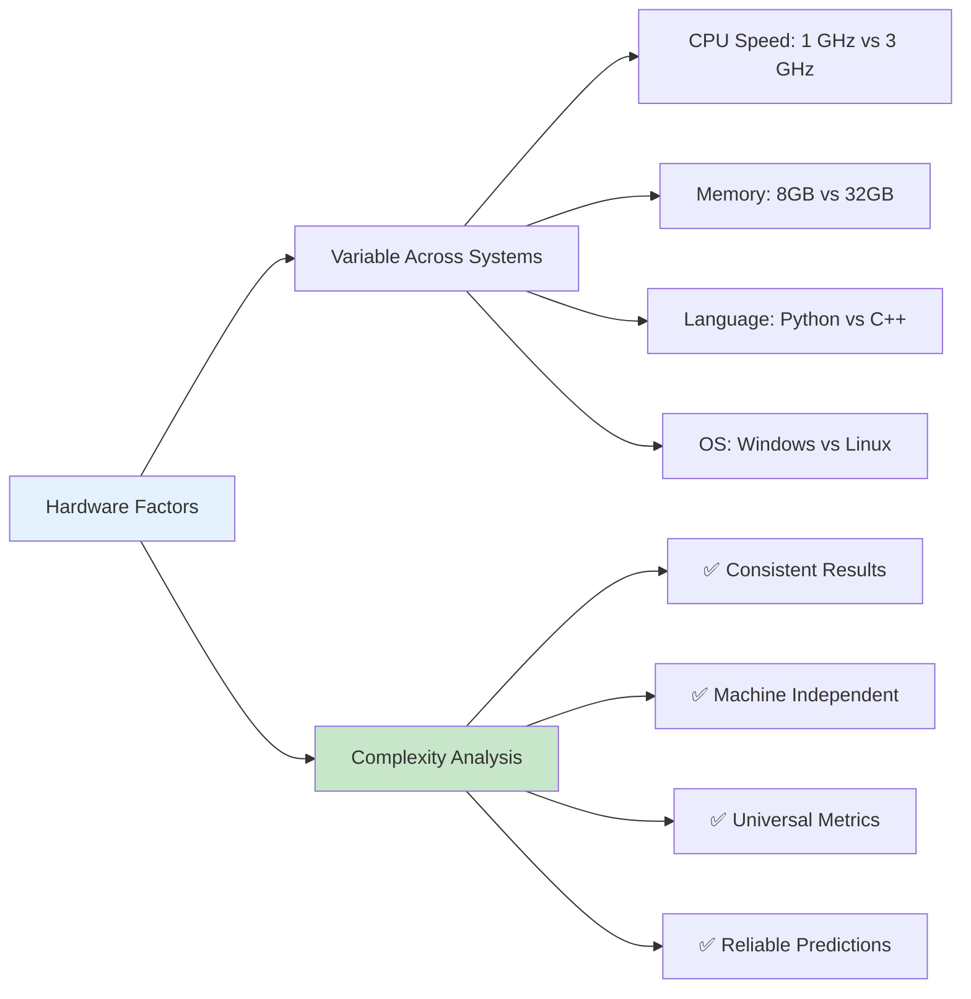
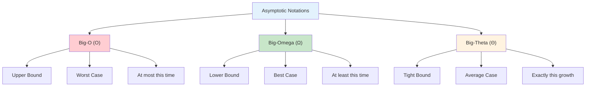

# ⚡ Complexity Analysis — Complete Professional Guide

<div align="center">


*Master the science of measuring algorithm efficiency and performance optimization*

</div>

---

## 📑 Table of Contents

1. [Introduction](#-introduction)
2. [Why Complexity Analysis?](#-why-complexity-analysis)
3. [Asymptotic Notations](#-asymptotic-notations)
4. [Best, Worst & Average Case](#-best-worst--average-case)
5. [Amortized Analysis](#-amortized-analysis)
6. [Master Theorem](#-master-theorem)
7. [Space Complexity](#-space-complexity)
8. [Recurrence Relations](#-recurrence-relations)
9. [Common Complexity Classes](#-common-complexity-classes)
10. [Analysis Techniques](#-analysis-techniques)
11. [Practical Examples](#-practical-examples)
12. [Interview Strategies](#-interview-strategies)
13. [Best Practices](#-best-practices)

---

## 🎯 Introduction

**Complexity Analysis** is the systematic study of algorithm efficiency, measuring how resource requirements (time and space) grow as input size increases. It's the foundation for comparing and optimizing algorithms.

### 🔑 Key Concepts

- **Time Complexity**: Number of operations performed
- **Space Complexity**: Amount of memory used
- **Input Size (n)**: The size of the problem instance
- **Growth Rate**: How complexity changes with input size

### 💡 Why It Matters

```mermaid
flowchart TD
    A["⚡ Complexity Analysis Importance"] --> B["🚀 Performance Prediction"]
    A --> C["⚖️ Algorithm Comparison"]
    A --> D["🎯 Optimization Guidance"]
    A --> E["💼 Interview Success"]
    A --> F["🏗️ System Design"]
    
    B --> G["Estimate algorithm behavior"]
    B --> H["Scalability assessment"]
    B --> I["Resource planning"]
    
    C --> J["Choose best solution"]
    C --> K["Trade-off analysis"]
    C --> L["Performance comparison"]
    
    D --> M["Identify bottlenecks"]
    D --> N["Optimization opportunities"]
    D --> O["Efficiency improvements"]
    
    E --> P["Technical interviews"]
    E --> Q["Problem-solving skills"]
    E --> R["Algorithm knowledge"]
    
    F --> S["Scale applications"]
    F --> T["Architecture decisions"]
    F --> U["Resource allocation"]
    
    style A fill:#e3f2fd
    style B fill:#c8e6c9
    style C fill:#fff3e0
    style D fill:#fce4ec
    style E fill:#f3e5f5
    style F fill:#e8f5e8
```



---

## 🚀 Why Complexity Analysis?

### ✅ Hardware Independence

<div align="center">

</div>



Complexity analysis provides **machine-independent** performance metrics:

| Factor | Variable Across Systems | Complexity Analysis |
|:-------|:----------------------|:-------------------|
| **CPU Speed** | 1 GHz vs 3 GHz | ✅ Consistent |
| **Memory** | 8GB vs 32GB | ✅ Consistent |
| **Language** | Python vs C++ | ✅ Consistent |
| **OS** | Windows vs Linux | ✅ Consistent |

### 📊 Scalability Prediction

<div align="center">

</div>

```cpp
// Example: Linear vs Quadratic Growth
// n = 1000
Linear: O(n)      → 1,000 operations
Quadratic: O(n²)  → 1,000,000 operations

// n = 10,000
Linear: O(n)      → 10,000 operations
Quadratic: O(n²)  → 100,000,000 operations
```

### 🎯 Decision Making

- **Small inputs**: Constant factors matter more
- **Large inputs**: Growth rate dominates
- **Real-world**: Balance between time and space

---

## 📐 Asymptotic Notations

Asymptotic analysis describes algorithm behavior as **n → ∞**.



### 1️⃣ Big-O Notation (Upper Bound)

<div align="center">

</div>

**Definition**: f(n) = O(g(n)) if there exist constants c > 0 and n₀ such that f(n) ≤ c·g(n) for all n ≥ n₀.

```
Meaning: "At most this much time"
Usage: Worst-case analysis, upper bound guarantees
```

**Examples**:
```cpp
T(n) = 3n² + 5n + 2  →  O(n²)
T(n) = 2n + 100      →  O(n)
T(n) = 5             →  O(1)
```

**Visual Representation**:
```
f(n) ≤ c·g(n)

     |
     |    f(n)
     |   /
     |  /
     | /_____ c·g(n)
     |/
     |________________
                    n
```

---

### 2️⃣ Big-Ω Notation (Lower Bound)

**Definition**: f(n) = Ω(g(n)) if there exist constants c > 0 and n₀ such that f(n) ≥ c·g(n) for all n ≥ n₀.

```
Meaning: "At least this much time"
Usage: Best-case analysis, lower bound guarantees
```

**Examples**:
```cpp
T(n) = 3n² + n  →  Ω(n²)
T(n) = n log n  →  Ω(n log n)
```

---

### 3️⃣ Big-Θ Notation (Tight Bound)

**Definition**: f(n) = Θ(g(n)) if f(n) = O(g(n)) AND f(n) = Ω(g(n)).

```
Meaning: "Exactly this growth rate"
Usage: Precise algorithmic classification
```

**Examples**:
```cpp
T(n) = 3n + 2   →  Θ(n)
T(n) = n² + n   →  Θ(n²)
```

**Relationship**:
```
If T(n) = O(g(n)) AND T(n) = Ω(g(n))
Then T(n) = Θ(g(n))
```

---

### 📊 Notation Comparison

| Notation | Meaning | Use Case | Example |
|:---------|:--------|:---------|:--------|
| **O(g(n))** | Upper bound | Worst case | "Algorithm takes at most O(n²)" |
| **Ω(g(n))** | Lower bound | Best case | "Algorithm takes at least Ω(n)" |
| **Θ(g(n))** | Tight bound | Average case | "Algorithm takes exactly Θ(n log n)" |

---

## 🎭 Best, Worst & Average Case

Different inputs can lead to different performance characteristics.

<div align="center">

</div>

### 📊 Case Analysis

| Case | Description | When to Use |
|:-----|:------------|:------------|
| **Best Case** | Minimum possible time | Optimistic scenario |
| **Worst Case** | Maximum possible time | **Most important for interviews** |
| **Average Case** | Expected time over all inputs | Realistic performance |

### 🔍 Example: Linear Search

```cpp
int linearSearch(vector<int>& arr, int target) {
    for (int i = 0; i < arr.size(); i++) {
        if (arr[i] == target) return i;
    }
    return -1;
}
```

**Analysis**:
- **Best Case**: O(1) - Element at index 0
- **Worst Case**: O(n) - Element not found or at last position
- **Average Case**: O(n) - Element at random position

### 🔄 Example: Quick Sort

```cpp
void quickSort(vector<int>& arr, int low, int high) {
    if (low < high) {
        int pi = partition(arr, low, high);
        quickSort(arr, low, pi - 1);
        quickSort(arr, pi + 1, high);
    }
}
```

**Analysis**:
- **Best Case**: O(n log n) - Perfect pivot selection
- **Average Case**: O(n log n) - Random pivot selection
- **Worst Case**: O(n²) - Always worst pivot (sorted array)

---

## 🔄 Amortized Analysis

**Purpose**: Find the average cost per operation over a sequence of operations, even when individual operations vary in cost.

### 🎯 When to Use

- Dynamic arrays (resizing)
- Hash tables (rehashing)
- Union-Find operations
- Splay trees

### 📊 Analysis Methods

1. **Aggregate Method**: Total cost ÷ Number of operations
2. **Accounting Method**: Assign credits to operations
3. **Potential Method**: Use potential function

### 🔥 Example: Dynamic Array Insertion

```cpp
class DynamicArray {
private:
    int* arr;
    int size;
    int capacity;
    
public:
    void push(int val) {
        if (size == capacity) {
            resize();  // Expensive: O(n)
        }
        arr[size++] = val;  // Cheap: O(1)
    }
    
private:
    void resize() {
        capacity *= 2;
        int* newArr = new int[capacity];
        for (int i = 0; i < size; i++) {
            newArr[i] = arr[i];  // Copy all elements
        }
        delete[] arr;
        arr = newArr;
    }
};
```

**Cost Analysis**:
```
Operation 1: Insert → O(1)
Operation 2: Insert → O(1)
Operation 3: Insert → O(1)
Operation 4: Insert → O(1)
Operation 5: Insert + Resize → O(n)
...

Total cost for n operations: O(n)
Amortized cost per operation: O(n)/n = O(1)
```

### 💡 Key Insight

Even though resizing costs O(n), it happens infrequently (every power of 2), making the **amortized cost O(1)**.

---

## 🧮 Master Theorem

<div align="center">

</div>

**Purpose**: Solve recurrence relations of the form T(n) = aT(n/b) + f(n).

### 📐 Parameters

- **a**: Number of subproblems
- **b**: Factor by which subproblem size is reduced
- **f(n)**: Cost of work done outside recursive calls

### 🎯 Three Cases

#### Case 1: f(n) < n^(log_b a)

```
If f(n) = O(n^(log_b a - ε)) for some ε > 0
Then T(n) = Θ(n^(log_b a))
```

#### Case 2: f(n) = n^(log_b a)

```
If f(n) = Θ(n^(log_b a))
Then T(n) = Θ(n^(log_b a) × log n)
```

#### Case 3: f(n) > n^(log_b a)

```
If f(n) = Ω(n^(log_b a + ε)) for some ε > 0
AND af(n/b) ≤ cf(n) for some c < 1 (regularity condition)
Then T(n) = Θ(f(n))
```

### 🔥 Examples

#### Example 1: Merge Sort
```
T(n) = 2T(n/2) + n

a = 2, b = 2
log_b a = log_2 2 = 1
f(n) = n = n¹

Case 2: f(n) = Θ(n^1)
Result: T(n) = Θ(n log n)
```

#### Example 2: Binary Search
```
T(n) = T(n/2) + 1

a = 1, b = 2
log_b a = log_2 1 = 0
f(n) = 1 = n⁰

Case 2: f(n) = Θ(n⁰)
Result: T(n) = Θ(log n)
```

#### Example 3: Strassen's Matrix Multiplication
```
T(n) = 7T(n/2) + n²

a = 7, b = 2
log_b a = log_2 7 ≈ 2.81
f(n) = n²

Case 1: f(n) = O(n^2.81-ε)
Result: T(n) = Θ(n^2.81)
```

---

## 💾 Space Complexity

**Space Complexity** measures the amount of memory an algorithm uses relative to input size.

### 🔧 Types of Space

1. **Input Space**: Memory for input data
2. **Auxiliary Space**: Extra memory used by algorithm
3. **Total Space**: Input + Auxiliary space

### 📊 Common Space Complexities

#### O(1) - Constant Space
```cpp
int findMax(vector<int>& arr) {
    int maxVal = arr[0];
    for (int i = 1; i < arr.size(); i++) {
        if (arr[i] > maxVal) {
            maxVal = arr[i];
        }
    }
    return maxVal;
}
// Uses only a few variables regardless of input size
```

#### O(n) - Linear Space
```cpp
vector<int> reverseArray(vector<int>& arr) {
    vector<int> reversed(arr.size());
    for (int i = 0; i < arr.size(); i++) {
        reversed[i] = arr[arr.size() - 1 - i];
    }
    return reversed;
}
// Creates new array of size n
```

#### O(log n) - Logarithmic Space
```cpp
int binarySearch(vector<int>& arr, int target, int left, int right) {
    if (left > right) return -1;
    
    int mid = left + (right - left) / 2;
    if (arr[mid] == target) return mid;
    
    if (arr[mid] > target)
        return binarySearch(arr, target, left, mid - 1);
    else
        return binarySearch(arr, target, mid + 1, right);
}
// Recursion depth = log n
```

#### O(n²) - Quadratic Space
```cpp
vector<vector<int>> createMatrix(int n) {
    vector<vector<int>> matrix(n, vector<int>(n, 0));
    return matrix;
}
// 2D array of size n×n
```

---

## 🔄 Recurrence Relations

**Recurrence Relations** define the runtime of recursive algorithms.

### 📊 Common Patterns

#### 1. Linear Recurrence
```
T(n) = T(n-1) + O(1)
Solution: T(n) = O(n)

Example: Factorial, Fibonacci (naive)
```

#### 2. Divide and Conquer
```
T(n) = aT(n/b) + f(n)
Solution: Use Master Theorem

Example: Merge Sort, Quick Sort
```

#### 3. Binary Recursion
```
T(n) = 2T(n-1) + O(1)
Solution: T(n) = O(2^n)

Example: Tower of Hanoi
```

#### 4. Tree Recursion
```
T(n) = T(n-1) + T(n-2) + O(1)
Solution: T(n) = O(φ^n) where φ = golden ratio

Example: Fibonacci (naive implementation)
```

### 🔧 Solving Techniques

#### Substitution Method
1. Guess the solution
2. Prove by induction
3. Verify base cases

#### Recursion Tree Method
1. Draw recursion tree
2. Calculate cost at each level
3. Sum all levels

#### Master Theorem
Use for divide-and-conquer recurrences

---

## 📊 Common Complexity Classes

### ⚡ Time Complexity Hierarchy

<div align="center">

</div>

```
O(1) < O(log n) < O(n) < O(n log n) < O(n²) < O(n³) < O(2^n) < O(n!)
```

<table>
<thead>
<tr>
<th>Complexity</th>
<th>Name</th>
<th>Example</th>
<th>n=10</th>
<th>n=100</th>
<th>n=1000</th>
</tr>
</thead>
<tbody>
<tr>
<td><strong>O(1)</strong></td>
<td>Constant</td>
<td>Array access</td>
<td>1</td>
<td>1</td>
<td>1</td>
</tr>
<tr>
<td><strong>O(log n)</strong></td>
<td>Logarithmic</td>
<td>Binary search</td>
<td>3</td>
<td>7</td>
<td>10</td>
</tr>
<tr>
<td><strong>O(n)</strong></td>
<td>Linear</td>
<td>Linear search</td>
<td>10</td>
<td>100</td>
<td>1,000</td>
</tr>
<tr>
<td><strong>O(n log n)</strong></td>
<td>Linearithmic</td>
<td>Merge sort</td>
<td>33</td>
<td>664</td>
<td>9,966</td>
</tr>
<tr>
<td><strong>O(n²)</strong></td>
<td>Quadratic</td>
<td>Bubble sort</td>
<td>100</td>
<td>10,000</td>
<td>1,000,000</td>
</tr>
<tr>
<td><strong>O(n³)</strong></td>
<td>Cubic</td>
<td>Matrix multiplication</td>
<td>1,000</td>
<td>1,000,000</td>
<td>1,000,000,000</td>
</tr>
<tr>
<td><strong>O(2^n)</strong></td>
<td>Exponential</td>
<td>Subset generation</td>
<td>1,024</td>
<td>1.3×10³⁰</td>
<td>1.1×10³⁰¹</td>
</tr>
<tr>
<td><strong>O(n!)</strong></td>
<td>Factorial</td>
<td>Permutations</td>
<td>3,628,800</td>
<td>9.3×10¹⁵⁷</td>
<td>4.0×10²⁵⁶⁷</td>
</tr>
</tbody>
</table>

---

## 🔬 Analysis Techniques

### 1️⃣ Loop Analysis

#### Single Loop
```cpp
for (int i = 0; i < n; i++) {
    // O(1) operation
}
// Time: O(n)
```

#### Nested Loops
```cpp
for (int i = 0; i < n; i++) {
    for (int j = 0; j < n; j++) {
        // O(1) operation
    }
}
// Time: O(n²)
```

#### Dependent Loops
```cpp
for (int i = 0; i < n; i++) {
    for (int j = i; j < n; j++) {
        // O(1) operation
    }
}
// Time: n + (n-1) + (n-2) + ... + 1 = n(n+1)/2 = O(n²)
```

### 2️⃣ Recursive Analysis

#### Linear Recursion
```cpp
void printNumbers(int n) {
    if (n <= 0) return;
    cout << n << " ";
    printNumbers(n - 1);
}
// T(n) = T(n-1) + O(1) = O(n)
```

#### Binary Recursion
```cpp
int fibonacci(int n) {
    if (n <= 1) return n;
    return fibonacci(n-1) + fibonacci(n-2);
}
// T(n) = T(n-1) + T(n-2) + O(1) = O(2^n)
```

### 3️⃣ Divide and Conquer Analysis

```cpp
void mergeSort(vector<int>& arr, int left, int right) {
    if (left < right) {
        int mid = left + (right - left) / 2;
        mergeSort(arr, left, mid);      // T(n/2)
        mergeSort(arr, mid + 1, right); // T(n/2)
        merge(arr, left, mid, right);   // O(n)
    }
}
// T(n) = 2T(n/2) + O(n) = O(n log n)
```

---

## 🎯 Practical Examples

### Example 1: Two Sum Problem

#### Brute Force Approach
```cpp
vector<int> twoSum(vector<int>& nums, int target) {
    for (int i = 0; i < nums.size(); i++) {
        for (int j = i + 1; j < nums.size(); j++) {
            if (nums[i] + nums[j] == target) {
                return {i, j};
            }
        }
    }
    return {};
}
// Time: O(n²), Space: O(1)
```

#### Optimized Hash Map Approach
```cpp
vector<int> twoSum(vector<int>& nums, int target) {
    unordered_map<int, int> map;
    for (int i = 0; i < nums.size(); i++) {
        int complement = target - nums[i];
        if (map.find(complement) != map.end()) {
            return {map[complement], i};
        }
        map[nums[i]] = i;
    }
    return {};
}
// Time: O(n), Space: O(n)
```

### Example 2: Finding Maximum Subarray

#### Brute Force
```cpp
int maxSubarraySum(vector<int>& nums) {
    int maxSum = INT_MIN;
    for (int i = 0; i < nums.size(); i++) {
        for (int j = i; j < nums.size(); j++) {
            int currentSum = 0;
            for (int k = i; k <= j; k++) {
                currentSum += nums[k];
            }
            maxSum = max(maxSum, currentSum);
        }
    }
    return maxSum;
}
// Time: O(n³), Space: O(1)
```

#### Kadane's Algorithm
```cpp
int maxSubarraySum(vector<int>& nums) {
    int maxSum = nums[0];
    int currentSum = nums[0];
    
    for (int i = 1; i < nums.size(); i++) {
        currentSum = max(nums[i], currentSum + nums[i]);
        maxSum = max(maxSum, currentSum);
    }
    return maxSum;
}
// Time: O(n), Space: O(1)
```

---

## 🏆 Interview Strategies

### 🎯 Step-by-Step Approach

1. **Understand the Problem**
   - Clarify input/output
   - Ask about constraints
   - Consider edge cases

2. **Start with Brute Force**
   - Always mention the naive approach
   - Analyze its complexity
   - Explain why it's suboptimal

3. **Optimize Gradually**
   - Identify bottlenecks
   - Apply optimization techniques
   - Trade space for time if needed

4. **Analyze Complexity**
   - State time and space complexity
   - Explain your reasoning
   - Compare with alternatives

### 💡 Common Optimization Techniques

| Technique | Description | Example |
|:----------|:------------|:--------|
| **Hash Maps** | Trade space for time | Two Sum |
| **Two Pointers** | Reduce nested loops | 3Sum |
| **Sliding Window** | Optimize subarray problems | Max subarray |
| **Dynamic Programming** | Avoid recomputation | Fibonacci |
| **Divide & Conquer** | Break into subproblems | Merge Sort |

### 🔥 Interview Tips

```
✓ Always analyze both time and space complexity
✓ Mention the best, average, and worst cases when relevant
✓ Explain trade-offs between different approaches
✓ Use Big-O notation correctly
✓ Consider practical constraints (memory limits, etc.)
✓ Practice explaining complexity in simple terms
```

---

## 💎 Best Practices

### ✅ Do's

```
✓ Focus on the dominant term in Big-O
✓ Consider both time and space complexity
✓ Analyze worst-case scenarios for interviews
✓ Use amortized analysis for data structures
✓ Apply Master Theorem for divide-and-conquer
✓ Consider practical factors (cache, constants)
```

### ❌ Don'ts

```
✗ Don't ignore lower-order terms in analysis
✗ Don't confuse best/worst/average cases
✗ Don't forget about space complexity
✗ Don't over-optimize for unrealistic constraints
✗ Don't use incorrect notation (O vs Θ vs Ω)
```

---

## 📚 Summary Table

<div align="center">

| Concept | Purpose | Key Insight |
|:--------|:--------|:------------|
| **Big-O** | Upper bound | "At most this time" |
| **Big-Ω** | Lower bound | "At least this time" |
| **Big-Θ** | Tight bound | "Exactly this growth" |
| **Amortized** | Average cost | "Expensive operations are rare" |
| **Master Theorem** | Solve recurrences | "Divide and conquer analysis" |
| **Space Complexity** | Memory usage | "Time vs space trade-offs" |

</div>

---

## 🎓 Key Takeaways

<div align="center">

### 🌟 Master These Concepts

</div>

```
1. 🎯 Big-O describes worst-case upper bounds
2. ⚡ Focus on growth rate, ignore constants
3. 🔄 Amortized analysis for data structures
4. 🧮 Master Theorem for divide-and-conquer
5. 💾 Consider both time and space complexity
6. 🎭 Understand best/worst/average cases
7. 🔍 Practice complexity analysis daily
8. 💡 Optimize step by step in interviews
```

---

## 📚 Practice Resources

- **LeetCode**: Time/Space complexity analysis
- **GeeksforGeeks**: Complexity analysis tutorials
- **CLRS**: Introduction to Algorithms textbook
- **MIT OpenCourseWare**: Algorithm analysis lectures

---

## 🎯 Interview Preparation

1. **Master Basic Complexities**: O(1), O(log n), O(n), O(n log n), O(n²)
2. **Practice Analysis**: Analyze 50+ algorithms
3. **Understand Trade-offs**: Time vs space decisions
4. **Learn Patterns**: Common optimization techniques
5. **Explain Clearly**: Practice verbalizing complexity analysis

---

<div align="center">

### 🔥 One-Line Summary

**Complexity Analysis = The science of measuring and optimizing algorithm efficiency for scalable software solutions**

---

**💻 Master complexity, master algorithms!**

*"In algorithms, efficiency is not just about speed—it's about scalability, predictability, and making the right trade-offs."*

</div>