# Complexity Analysis — Complete Professional <div align="center">Guide</div>

<div align="center">


**Master algorithm performance analysis and optimization techniques**

</div>

---

## Table of Contents

1. [Introduction](#introduction)
2. [Big-O Notation](#big-o-notation)
3. [Time Complexity](#time-complexity)
4. [Space Complexity](#space-complexity)
5. [Master Theorem](#master-theorem)
6. [Complexity Hierarchy](#complexity-hierarchy)
7. [Practical Applications](#practical-applications)
8. [Best Practices](#best-practices)

---

## Introduction

**Complexity Analysis** is the systematic study of algorithm performance in terms of time and space requirements. It provides a mathematical framework to compare algorithms and predict their behavior as input size grows, enabling optimal algorithm selection for different scenarios.

<div align="center">

</div>

### Why Complexity Analysis Matters


---

## Big-O Notation

<div align="center">

</div>

### Asymptotic Notations

> **💡 Key Insight**: Big-O notation describes the upper bound of algorithm performance, providing worst-case scenario analysis.

```mermaid
flowchart TD
    A["Asymptotic Notations"] --> B["Big-O (O)"]
    A --> C["Big-Omega (Ω)"]
    A --> D["Big-Theta (Θ)"]
    A --> E["Little-o (o)"]
    A --> F["Little-omega (ω)"]
    
    B --> G["Upper Bound"]
    B --> H["Worst Case"]
    B --> I["f(n) ≤ c·g(n)"]
    
    C --> J["Lower Bound"]
    C --> K["Best Case"]
    C --> L["f(n) ≥ c·g(n)"]
    
    D --> M["Tight Bound"]
    D --> N["Average Case"]
    D --> O["c₁·g(n) ≤ f(n) ≤ c₂·g(n)"]
    
    E --> P["Strict Upper Bound"]
    E --> Q["lim f(n)/g(n) = 0"]
    
    F --> R["Strict Lower Bound"]
    F --> S["lim f(n)/g(n) = ∞"]
    
    classDef default fill:#f9f9f9,stroke:#333,stroke-width:2px,color:#000
    classDef notation fill:#e3f2fd,stroke:#2196f3,stroke-width:2px,color:#000
    classDef bigo fill:#fff3e0,stroke:#ff9800,stroke-width:2px,color:#000
    classDef omega fill:#e8f5e8,stroke:#4caf50,stroke-width:2px,color:#000
    classDef theta fill:#f3e5f5,stroke:#9c27b0,stroke-width:2px,color:#000
    classDef little fill:#ffebee,stroke:#f44336,stroke-width:2px,color:#000
    class A notation
    class B,G,H,I bigo
    class C,J,K,L omega
    class D,M,N,O theta
    class E,P,Q,F,R,S little
```



### Mathematical Definitions

```cpp
// Big-O Notation Examples
class ComplexityExamples {
public:
    // O(1) - Constant Time
    int getFirstElement(vector<int>& arr) {
        return arr[0];  // Always takes same time
    }
    
    // O(log n) - Logarithmic Time
    int binarySearch(vector<int>& arr, int target) {
        int left = 0, right = arr.size() - 1;
        while (left <= right) {
            int mid = left + (right - left) / 2;
            if (arr[mid] == target) return mid;
            else if (arr[mid] < target) left = mid + 1;
            else right = mid - 1;
        }
        return -1;
    }
    
    // O(n) - Linear Time
    int findMax(vector<int>& arr) {
        int maxVal = arr[0];
        for (int i = 1; i < arr.size(); i++) {
            if (arr[i] > maxVal) {
                maxVal = arr[i];
            }
        }
        return maxVal;
    }
    
    // O(n log n) - Linearithmic Time
    void mergeSort(vector<int>& arr, int left, int right) {
        if (left < right) {
            int mid = left + (right - left) / 2;
            mergeSort(arr, left, mid);
            mergeSort(arr, mid + 1, right);
            merge(arr, left, mid, right);
        }
    }
    
    // O(n²) - Quadratic Time
    void bubbleSort(vector<int>& arr) {
        int n = arr.size();
        for (int i = 0; i < n - 1; i++) {
            for (int j = 0; j < n - i - 1; j++) {
                if (arr[j] > arr[j + 1]) {
                    swap(arr[j], arr[j + 1]);
                }
            }
        }
    }
    
    // O(2ⁿ) - Exponential Time
    int fibonacci(int n) {
        if (n <= 1) return n;
        return fibonacci(n - 1) + fibonacci(n - 2);
    }
};
```

---

## Time Complexity

<div align="center">

</div>

### Common Time Complexities

> **⚡ Performance Tip**: Understanding time complexity helps choose the right algorithm for your data size and performance requirements.

| Complexity | Name | Example Operations | Growth Rate |
|------------|------|-------------------|-------------|
| **O(1)** | Constant | Array access, hash lookup | Excellent |
| **O(log n)** | Logarithmic | Binary search, heap operations | Very Good |
| **O(n)** | Linear | Array traversal, linear search | Good |
| **O(n log n)** | Linearithmic | Merge sort, heap sort | Acceptable |
| **O(n²)** | Quadratic | Bubble sort, nested loops | Poor |
| **O(n³)** | Cubic | Matrix multiplication | Very Poor |
| **O(2ⁿ)** | Exponential | Recursive fibonacci | Terrible |
| **O(n!)** | Factorial | Traveling salesman (brute force) | Catastrophic |

### Time Complexity Analysis Framework


### Practical Time Complexity Examples

```cpp
class TimeComplexityAnalysis {
public:
    // O(1) - Constant time operations
    void constantTimeOperations() {
        // Array access
        int value = arr[5];           // O(1)
        
        // Hash table operations
        unordered_map<int, int> map;
        map[key] = value;             // O(1) average
        
        // Stack/Queue operations
        stack<int> st;
        st.push(10);                  // O(1)
        st.pop();                     // O(1)
    }
    
    // O(n) - Linear time complexity
    int linearSearch(vector<int>& arr, int target) {
        for (int i = 0; i < arr.size(); i++) {  // O(n)
            if (arr[i] == target) {
                return i;
            }
        }
        return -1;
    }
    
    // O(n²) - Quadratic time complexity
    void printAllPairs(vector<int>& arr) {
        int n = arr.size();
        for (int i = 0; i < n; i++) {           // O(n)
            for (int j = 0; j < n; j++) {       // O(n)
                cout << arr[i] << ", " << arr[j] << endl;
            }
        }
        // Total: O(n) × O(n) = O(n²)
    }
    
    // O(log n) - Logarithmic time complexity
    int binarySearchRecursive(vector<int>& arr, int target, int left, int right) {
        if (left > right) return -1;
        
        int mid = left + (right - left) / 2;
        if (arr[mid] == target) return mid;
        
        if (arr[mid] > target) {
            return binarySearchRecursive(arr, target, left, mid - 1);
        } else {
            return binarySearchRecursive(arr, target, mid + 1, right);
        }
        // Each recursive call reduces problem size by half: O(log n)
    }
    
    // O(n log n) - Linearithmic time complexity
    void quickSort(vector<int>& arr, int low, int high) {
        if (low < high) {
            int pi = partition(arr, low, high);    // O(n)
            quickSort(arr, low, pi - 1);           // T(n/2)
            quickSort(arr, pi + 1, high);          // T(n/2)
        }
        // Recurrence: T(n) = 2T(n/2) + O(n) = O(n log n)
    }
    
private:
    vector<int> arr;
    int key, value;
    
    int partition(vector<int>& arr, int low, int high) {
        int pivot = arr[high];
        int i = low - 1;
        
        for (int j = low; j < high; j++) {
            if (arr[j] < pivot) {
                i++;
                swap(arr[i], arr[j]);
            }
        }
        swap(arr[i + 1], arr[high]);
        return i + 1;
    }
};
```

---

## Space Complexity

<div align="center">

</div>

### Space Complexity Components

> **🔧 Memory Optimization**: Space complexity includes both auxiliary space and input space considerations.


### Space Complexity Examples

```cpp
class SpaceComplexityAnalysis {
public:
    // O(1) - Constant space
    int findMaxConstantSpace(vector<int>& arr) {
        int maxVal = arr[0];        // O(1) space
        for (int i = 1; i < arr.size(); i++) {
            if (arr[i] > maxVal) {
                maxVal = arr[i];    // Reusing same variable
            }
        }
        return maxVal;
        // Total space: O(1)
    }
    
    // O(n) - Linear space
    vector<int> createCopy(vector<int>& arr) {
        vector<int> copy(arr.size());   // O(n) space
        for (int i = 0; i < arr.size(); i++) {
            copy[i] = arr[i];
        }
        return copy;
        // Total space: O(n)
    }
    
    // O(log n) - Logarithmic space (recursive binary search)
    int binarySearchRecursive(vector<int>& arr, int target, int left, int right) {
        if (left > right) return -1;
        
        int mid = left + (right - left) / 2;
        if (arr[mid] == target) return mid;
        
        if (arr[mid] > target) {
            return binarySearchRecursive(arr, target, left, mid - 1);
        } else {
            return binarySearchRecursive(arr, target, mid + 1, right);
        }
        // Call stack depth: O(log n)
    }
    
    // O(n) - Linear space (recursive factorial)
    long long factorial(int n) {
        if (n <= 1) return 1;
        return n * factorial(n - 1);
        // Call stack depth: O(n)
    }
    
    // O(n²) - Quadratic space
    vector<vector<int>> createMatrix(int n) {
        vector<vector<int>> matrix(n, vector<int>(n, 0));
        return matrix;
        // Total space: O(n²)
    }
    
    // Space-time tradeoff example
    class FibonacciMemoization {
    private:
        unordered_map<int, long long> memo;  // O(n) space
        
    public:
        long long fibonacci(int n) {
            if (n <= 1) return n;
            
            if (memo.find(n) != memo.end()) {
                return memo[n];
            }
            
            memo[n] = fibonacci(n - 1) + fibonacci(n - 2);
            return memo[n];
            // Time: O(n), Space: O(n) - trading space for time
        }
    };
};
```

---

## Master Theorem

<div align="center">

</div>

### Master Theorem Formula

> **📐 Mathematical Tool**: The Master Theorem provides a systematic way to solve recurrence relations of the form T(n) = aT(n/b) + f(n).

**For recurrence relation: T(n) = aT(n/b) + f(n)**

Where:
- **a ≥ 1**: Number of subproblems
- **b > 1**: Factor by which problem size is reduced
- **f(n)**: Cost of work done outside recursive calls

### Master Theorem Cases

```mermaid
flowchart TD
    A["Master Theorem Cases"] --> B["Case 1: f(n) = O(n^(log_b(a) - ε))"]
    A --> C["Case 2: f(n) = Θ(n^(log_b(a)))"]
    A --> D["Case 3: f(n) = Ω(n^(log_b(a) + ε))"]
    
    B --> E["T(n) = Θ(n^(log_b(a)))"]
    B --> F["Recursion dominates"]
    B --> G["Example: T(n) = 8T(n/2) + n²"]
    
    C --> H["T(n) = Θ(n^(log_b(a)) × log n)"]
    C --> I["Balanced case"]
    C --> J["Example: T(n) = 2T(n/2) + n"]
    
    D --> K["T(n) = Θ(f(n))"]
    D --> L["Non-recursive work dominates"]
    D --> M["Example: T(n) = 2T(n/2) + n²"]
    
    classDef default fill:#f9f9f9,stroke:#333,stroke-width:2px,color:#000
    classDef theorem fill:#e3f2fd,stroke:#2196f3,stroke-width:2px,color:#000
    classDef case1 fill:#fff3e0,stroke:#ff9800,stroke-width:2px,color:#000
    classDef case2 fill:#e8f5e8,stroke:#4caf50,stroke-width:2px,color:#000
    classDef case3 fill:#f3e5f5,stroke:#9c27b0,stroke-width:2px,color:#000
    class A theorem
    class B,E,F,G case1
    class C,H,I,J case2
    class D,K,L,M case3
```



### Master Theorem Applications

```cpp
class MasterTheoremExamples {
public:
    // Example 1: Merge Sort
    // T(n) = 2T(n/2) + O(n)
    // a = 2, b = 2, f(n) = n
    // log_b(a) = log_2(2) = 1
    // f(n) = n = Θ(n^1) → Case 2
    // Result: T(n) = Θ(n log n)
    void mergeSort(vector<int>& arr, int left, int right) {
        if (left < right) {
            int mid = left + (right - left) / 2;
            mergeSort(arr, left, mid);          // T(n/2)
            mergeSort(arr, mid + 1, right);     // T(n/2)
            merge(arr, left, mid, right);       // O(n)
        }
    }
    
    // Example 2: Binary Search
    // T(n) = T(n/2) + O(1)
    // a = 1, b = 2, f(n) = 1
    // log_b(a) = log_2(1) = 0
    // f(n) = 1 = Θ(n^0) → Case 2
    // Result: T(n) = Θ(log n)
    int binarySearch(vector<int>& arr, int target, int left, int right) {
        if (left > right) return -1;
        
        int mid = left + (right - left) / 2;
        if (arr[mid] == target) return mid;
        
        if (arr[mid] > target) {
            return binarySearch(arr, target, left, mid - 1);  // T(n/2)
        } else {
            return binarySearch(arr, target, mid + 1, right); // T(n/2)
        }
        // Constant work: O(1)
    }
    
    // Example 3: Strassen's Matrix Multiplication
    // T(n) = 7T(n/2) + O(n²)
    // a = 7, b = 2, f(n) = n²
    // log_b(a) = log_2(7) ≈ 2.807
    // f(n) = n² = O(n^(2.807 - ε)) → Case 1
    // Result: T(n) = Θ(n^2.807)
    
    // Example 4: Case 3 Example
    // T(n) = 2T(n/2) + n²
    // a = 2, b = 2, f(n) = n²
    // log_b(a) = log_2(2) = 1
    // f(n) = n² = Ω(n^(1 + ε)) → Case 3
    // Result: T(n) = Θ(n²)
    
private:
    void merge(vector<int>& arr, int left, int mid, int right) {
        // Merge implementation - O(n) time
        vector<int> temp(right - left + 1);
        int i = left, j = mid + 1, k = 0;
        
        while (i <= mid && j <= right) {
            if (arr[i] <= arr[j]) {
                temp[k++] = arr[i++];
            } else {
                temp[k++] = arr[j++];
            }
        }
        
        while (i <= mid) temp[k++] = arr[i++];
        while (j <= right) temp[k++] = arr[j++];
        
        for (int i = 0; i < k; i++) {
            arr[left + i] = temp[i];
        }
    }
};
```

---

## Complexity Hierarchy

<div align="center">

</div>

### Growth Rate Comparison

> **📊 Performance Scale**: Understanding the relative growth rates helps in algorithm selection for different input sizes.

```mermaid
flowchart TD
    A["Complexity Hierarchy (Best to Worst)"] --> B["O(1) - Constant"]
    B --> C["O(log n) - Logarithmic"]
    C --> D["O(√n) - Square Root"]
    D --> E["O(n) - Linear"]
    E --> F["O(n log n) - Linearithmic"]
    F --> G["O(n²) - Quadratic"]
    G --> H["O(n³) - Cubic"]
    H --> I["O(2ⁿ) - Exponential"]
    I --> J["O(n!) - Factorial"]
    
    classDef default fill:#f9f9f9,stroke:#333,stroke-width:2px,color:#000
    classDef excellent fill:#e8f5e8,stroke:#4caf50,stroke-width:3px,color:#000
    classDef good fill:#fff3e0,stroke:#ff9800,stroke-width:2px,color:#000
    classDef acceptable fill:#e3f2fd,stroke:#2196f3,stroke-width:2px,color:#000
    classDef poor fill:#f3e5f5,stroke:#9c27b0,stroke-width:2px,color:#000
    classDef terrible fill:#ffebee,stroke:#f44336,stroke-width:2px,color:#000
    class A,B,C excellent
    class D,E good
    class F acceptable
    class G,H poor
    class I,J terrible
```



### Practical Input Size Guidelines

| Complexity | n = 10 | n = 100 | n = 1,000 | n = 10,000 | n = 100,000 | Practical Limit |
|------------|--------|---------|-----------|------------|-------------|-----------------|
| **O(1)** | 1 | 1 | 1 | 1 | 1 | ∞ |
| **O(log n)** | 3 | 7 | 10 | 13 | 17 | Very Large |
| **O(n)** | 10 | 100 | 1K | 10K | 100K | ~10⁸ |
| **O(n log n)** | 30 | 700 | 10K | 130K | 1.7M | ~10⁶ |
| **O(n²)** | 100 | 10K | 1M | 100M | 10B | ~10⁴ |
| **O(n³)** | 1K | 1M | 1B | 1T | 1000T | ~500 |
| **O(2ⁿ)** | 1K | 10³⁰ | ∞ | ∞ | ∞ | ~30 |
| **O(n!)** | 3.6M | ∞ | ∞ | ∞ | ∞ | ~10 |

### Algorithm Selection Guide

```cpp
class AlgorithmSelectionGuide {
public:
    // Choose algorithm based on input size and constraints
    void selectSortingAlgorithm(int n, bool stableRequired, bool inPlace) {
        if (n < 10) {
            // Use insertion sort for small arrays
            insertionSort();  // O(n²) but fast for small n
        }
        else if (n < 1000) {
            if (stableRequired) {
                mergeSort();  // O(n log n), stable, O(n) space
            } else {
                quickSort();  // O(n log n) average, O(1) space
            }
        }
        else {
            if (inPlace && !stableRequired) {
                heapSort();   // O(n log n) guaranteed, O(1) space
            } else if (stableRequired) {
                mergeSort();  // O(n log n), stable
            } else {
                introSort();  // Hybrid: quick + heap + insertion
            }
        }
    }
    
    // Search algorithm selection
    template<typename T>
    int selectSearchAlgorithm(vector<T>& data, T target, bool isSorted) {
        if (isSorted) {
            if (data.size() > 1000) {
                return binarySearch(data, target);     // O(log n)
            } else {
                return linearSearch(data, target);     // O(n) but cache-friendly
            }
        } else {
            if (data.size() > 10000) {
                // Consider building hash table first
                unordered_set<T> hashSet(data.begin(), data.end());
                return hashSet.find(target) != hashSet.end() ? 1 : -1;  // O(1) average
            } else {
                return linearSearch(data, target);     // O(n)
            }
        }
    }
    
private:
    void insertionSort() { /* Implementation */ }
    void mergeSort() { /* Implementation */ }
    void quickSort() { /* Implementation */ }
    void heapSort() { /* Implementation */ }
    void introSort() { /* Implementation */ }
    
    template<typename T>
    int binarySearch(vector<T>& data, T target) { /* Implementation */ }
    
    template<typename T>
    int linearSearch(vector<T>& data, T target) { /* Implementation */ }
};
```

---

## Practical Applications

### Real-World Performance Considerations

> **🌐 System Design**: Complexity analysis is crucial for scalable system design and performance optimization.


### Performance Optimization Strategies

```cpp
class PerformanceOptimization {
public:
    // Strategy 1: Reduce time complexity
    vector<int> twoSumOptimized(vector<int>& nums, int target) {
        unordered_map<int, int> map;  // O(n) space for O(n) time
        
        for (int i = 0; i < nums.size(); i++) {
            int complement = target - nums[i];
            if (map.find(complement) != map.end()) {
                return {map[complement], i};
            }
            map[nums[i]] = i;
        }
        return {};
        // Improved from O(n²) to O(n) using space-time tradeoff
    }
    
    // Strategy 2: Cache-friendly algorithms
    void matrixMultiplicationOptimized(vector<vector<int>>& A, 
                                     vector<vector<int>>& B, 
                                     vector<vector<int>>& C) {
        int n = A.size();
        
        // Cache-friendly order: i-k-j instead of i-j-k
        for (int i = 0; i < n; i++) {
            for (int k = 0; k < n; k++) {
                for (int j = 0; j < n; j++) {
                    C[i][j] += A[i][k] * B[k][j];
                }
            }
        }
        // Same O(n³) complexity but better cache performance
    }
    
    // Strategy 3: Early termination
    bool linearSearchWithEarlyExit(vector<int>& arr, int target) {
        for (int i = 0; i < arr.size(); i++) {
            if (arr[i] == target) {
                return true;  // Early termination
            }
            if (arr[i] > target && isSorted(arr)) {
                return false; // Early exit for sorted arrays
            }
        }
        return false;
    }
    
    // Strategy 4: Divide and conquer optimization
    long long powerOptimized(long long base, int exp) {
        if (exp == 0) return 1;
        if (exp == 1) return base;
        
        if (exp % 2 == 0) {
            long long half = powerOptimized(base, exp / 2);
            return half * half;  // O(log n) instead of O(n)
        } else {
            return base * powerOptimized(base, exp - 1);
        }
    }
    
    // Strategy 5: Memoization for dynamic programming
    class FibonacciOptimized {
    private:
        vector<long long> memo;
        
    public:
        FibonacciOptimized(int maxN) : memo(maxN + 1, -1) {}
        
        long long fibonacci(int n) {
            if (n <= 1) return n;
            if (memo[n] != -1) return memo[n];
            
            memo[n] = fibonacci(n - 1) + fibonacci(n - 2);
            return memo[n];
            // Improved from O(2ⁿ) to O(n)
        }
    };
    
private:
    bool isSorted(const vector<int>& arr) {
        for (int i = 1; i < arr.size(); i++) {
            if (arr[i] < arr[i-1]) return false;
        }
        return true;
    }
};
```

---

## Best Practices

### Complexity Analysis Guidelines

> **🎯 Best Practice**: Always analyze both time and space complexity, consider average and worst-case scenarios.


### Professional Analysis Template

```cpp
/**
 * Algorithm Complexity Analysis Template
 * 
 * Function: algorithmName
 * Purpose: Brief description of what the algorithm does
 * 
 * Time Complexity:
 *   - Best Case: O(?) - when does this occur?
 *   - Average Case: O(?) - typical scenario
 *   - Worst Case: O(?) - when does this occur?
 * 
 * Space Complexity:
 *   - Auxiliary Space: O(?) - extra space used
 *   - Total Space: O(?) - including input space
 * 
 * Input Constraints:
 *   - n: size of input
 *   - Assumptions about input (sorted, positive, etc.)
 * 
 * Trade-offs:
 *   - What are we optimizing for?
 *   - What are we sacrificing?
 * 
 * Alternative Approaches:
 *   - Other algorithms with different complexity
 *   - When to use each approach
 */

class ComplexityAnalysisTemplate {
public:
    /**
     * Example: Binary Search Implementation
     * 
     * Time Complexity:
     *   - Best Case: O(1) - target is at middle
     *   - Average Case: O(log n) - typical binary search
     *   - Worst Case: O(log n) - target not found or at ends
     * 
     * Space Complexity:
     *   - Auxiliary Space: O(1) - iterative version
     *   - Total Space: O(n) - input array space
     * 
     * Input Constraints:
     *   - Array must be sorted
     *   - n >= 0 (can handle empty arrays)
     * 
     * Trade-offs:
     *   - Requires sorted input (preprocessing cost)
     *   - Much faster than linear search for large datasets
     */
    int binarySearch(const vector<int>& arr, int target) {
        int left = 0, right = arr.size() - 1;
        
        while (left <= right) {                    // O(log n) iterations
            int mid = left + (right - left) / 2;   // O(1) operation
            
            if (arr[mid] == target) {              // O(1) comparison
                return mid;                        // Best case: O(1)
            }
            else if (arr[mid] < target) {          // O(1) comparison
                left = mid + 1;                    // O(1) assignment
            }
            else {
                right = mid - 1;                   // O(1) assignment
            }
        }
        
        return -1;                                 // O(1) return
        
        // Total: O(log n) time, O(1) space
    }
    
    /**
     * Performance Measurement Example
     */
    void measurePerformance() {
        vector<int> sizes = {1000, 10000, 100000, 1000000};
        
        for (int n : sizes) {
            vector<int> data(n);
            iota(data.begin(), data.end(), 1);  // Fill with 1, 2, 3, ...
            
            auto start = chrono::high_resolution_clock::now();
            
            // Perform algorithm
            int result = binarySearch(data, n/2);
            
            auto end = chrono::high_resolution_clock::now();
            auto duration = chrono::duration_cast<chrono::microseconds>(end - start);
            
            cout << "n = " << n << ", Time = " << duration.count() 
                 << " microseconds" << endl;
        }
        
        // Expected: logarithmic growth in execution time
    }
};
```

---

## Summary

**Complexity Analysis** is fundamental to algorithm design and system optimization. Key takeaways:

### Essential Concepts
- **Big-O Notation**: Describes upper bound performance characteristics
- **Time vs Space**: Understanding the trade-offs between execution time and memory usage
- **Master Theorem**: Systematic approach to solving divide-and-conquer recurrences
- **Growth Rates**: Relative performance scaling with input size

### Practical Applications
- **Algorithm Selection**: Choose appropriate algorithms based on input size and constraints
- **Performance Optimization**: Identify bottlenecks and optimization opportunities
- **System Design**: Plan for scalability and resource requirements
- **Interview Preparation**: Essential skill for technical interviews

### Best Practices
- Always analyze both best, average, and worst-case scenarios
- Consider practical constraints like cache performance and memory hierarchy
- Document complexity assumptions and trade-offs clearly
- Measure actual performance to validate theoretical analysis

> **🎯 Master's Insight**: Complexity analysis is not just about mathematical notation—it's about making informed engineering decisions that impact real-world system performance and scalability.

---

<div align="center">

**📊 Master Complexity Analysis • Optimize Performance • Build Scalable Systems**

*From Theory to Practice • Analysis to Optimization • Understanding to Mastery*

</div>