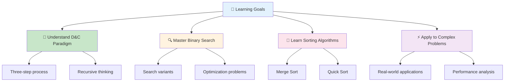
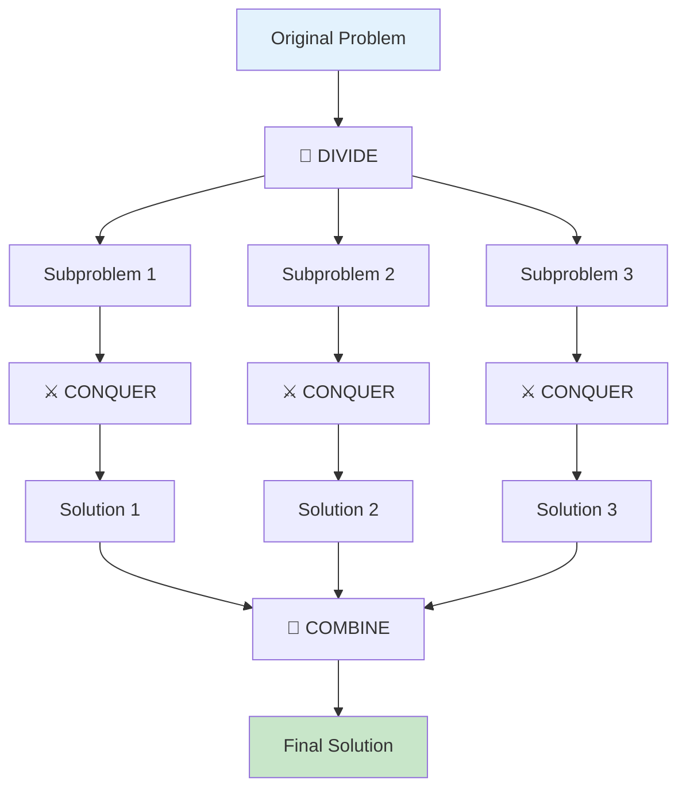
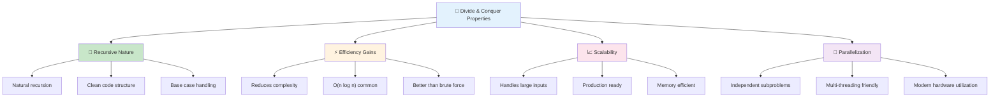

<div align="center">

# 🚀 Divide and Conquer – Complete Professional Guide

*Mastering Problem Decomposition and Efficient Solutions*

---


</div>

---

## 🎯 **Learning Objectives**

> *Master the art of breaking problems into manageable pieces*



- 🔪 Understand divide and conquer paradigm
- 🔍 Master binary search and variants
- 🔄 Learn merge sort and quick sort
- ⚡ Apply D&C to solve complex problems

---

## 📖 **1. What is Divide and Conquer?**

<table>
<tr>
<td width="50%">

### 🔪 **Core Concept**
*Break problem into smaller subproblems*



**Three Steps:**
- 🔪 **Divide** - Split into subproblems
- ⚔️ **Conquer** - Solve recursively
- 🔗 **Combine** - Merge results

</td>
<td width="50%">

### ⚡ **The D&C Formula**
*Divide → Solve → Combine*

**Process:**
```
Problem
  ↓ Divide
Subproblem₁  Subproblem₂
  ↓ Conquer    ↓ Conquer
Solution₁    Solution₂
  ↓ Combine
Final Solution
```

**Key Properties:**
- 🔄 **Recursive** - Natural recursion
- ⚡ **Efficient** - Reduces complexity
- 📈 **Scalable** - Works on large inputs
- 🔀 **Parallelizable** - Independent subproblems

</td>
</tr>
</table>

### 🌟 **Why D&C Matters?**

```mermaid
mindmap
  root))🚀 Divide & Conquer Benefits((
    ⚡ Efficiency
      Reduces complexity
      O(n log n) algorithms
      Better than brute force
      Optimal solutions
    📊 Scalability
      Handles large inputs
      Production ready
      Memory efficient
      Predictable performance
    🔄 Optimization
      Eliminates redundancy
      Focuses on essentials
      Prunes search space
      Smart problem solving
    🔀 Parallelization
      Independent subproblems
      Multi-threading friendly
      Distributed computing
      Modern hardware utilization
```

---

## 🏗️ **2. Characteristics**

### 📊 **Key Properties**



<div align="center">

| Property | Description | Benefit |
|:---------|:------------|:--------|
| **🔄 Recursive** | Uses recursion naturally | Clean code |
| **⚡ Efficient** | Reduces complexity | Fast execution |
| **📈 Scalable** | Works on large inputs | Production ready |
| **🔀 Parallelizable** | Subproblems independent | Multi-threading |

</div>

---

## 🔍 **3. Binary Search**

### 📊 **Classic D&C Algorithm**

<table>
<tr>
<td width="50%">

**Problem:**  
Search in sorted array

**Approach:**
1. Find middle element
2. Compare with target
3. Eliminate half
4. Repeat

**Time:** O(log n)  
**Space:** O(1) iterative, O(log n) recursive

</td>
<td width="50%">

**Implementation:**
```cpp
int binarySearch(int arr[], int n, int target) {
    int left = 0, right = n - 1;
    
    while (left <= right) {
        int mid = left + (right - left) / 2;
        
        if (arr[mid] == target)
            return mid;
        else if (arr[mid] < target)
            left = mid + 1;
        else
            right = mid - 1;
    }
    
    return -1;
}
```

</td>
</tr>
</table>

### 🎯 **Binary Search Variants**

<div align="center">

| Variant | Purpose | Use Case |
|:--------|:--------|:---------|
| **First Occurrence** | Find leftmost match | Duplicates |
| **Last Occurrence** | Find rightmost match | Duplicates |
| **Lower Bound** | First ≥ target | Range queries |
| **Upper Bound** | First > target | Range queries |
| **Search on Answer** | Find optimal value | Optimization |

</div>

---

## 🔀 **4. Merge Sort**

### 📊 **Stable Sorting Algorithm**

<table>
<tr>
<td width="50%">

**Algorithm:**
1. Divide array into halves
2. Recursively sort each half
3. Merge sorted halves

**Characteristics:**
- ✅ Stable sort
- ❌ Not in-place
- ✅ Predictable performance
- ✅ Good for linked lists

</td>
<td width="50%">

**Example:**
```
[38, 27, 43, 3, 9]
     ↓ Divide
[38, 27]  [43, 3, 9]
     ↓ Divide
[38][27]  [43][3, 9]
     ↓ Conquer
[27, 38]  [3, 9, 43]
     ↓ Combine
[3, 9, 27, 38, 43]
```

</td>
</tr>
</table>

### ⏱️ **Complexity Analysis**

<div align="center">

| Case | Time Complexity | Space Complexity |
|:-----|:----------------|:-----------------|
| **Best** | O(n log n) | O(n) |
| **Average** | O(n log n) | O(n) |
| **Worst** | O(n log n) | O(n) |

</div>

---

## ⚡ **5. Quick Sort**

### 📊 **Fast In-Place Sorting**

<table>
<tr>
<td width="50%">

**Algorithm:**
1. Choose pivot element
2. Partition around pivot
3. Recursively sort partitions

**Characteristics:**
- ❌ Not stable
- ✅ In-place
- ✅ Fast average case
- ❌ Worst case O(n²)

</td>
<td width="50%">

**Pivot Strategies:**
- **First Element** - Simple
- **Last Element** - Common
- **Random** - Avoids worst case
- **Median of Three** - Best practice

**Partitioning:**
```
[3, 7, 8, 5, 2, 1, 9, 6, 4]
Pivot = 4
[3, 2, 1] 4 [7, 8, 5, 9, 6]
```

</td>
</tr>
</table>

### ⏱️ **Complexity Analysis**

<div align="center">

| Case | Time Complexity | Space Complexity |
|:-----|:----------------|:-----------------|
| **Best** | O(n log n) | O(log n) |
| **Average** | O(n log n) | O(log n) |
| **Worst** | O(n²) | O(log n) |

</div>

---

## 🆚 **6. Merge Sort vs Quick Sort**

<div align="center">

| Feature | Merge Sort | Quick Sort |
|:--------|:-----------|:-----------|
| **Type** | Divide & Conquer | Divide & Conquer |
| **Stability** | ✅ Stable | ❌ Not stable |
| **In-place** | ❌ No | ✅ Yes |
| **Best Case** | O(n log n) | O(n log n) |
| **Worst Case** | O(n log n) | O(n²) |
| **Space** | O(n) | O(log n) |
| **Practical Speed** | Moderate | Very fast |
| **Use Case** | Linked lists, stability | Arrays, speed |

</div>

---

## 🎯 **7. When to Use Which?**

<table>
<tr>
<td width="50%">

### 🔍 **Binary Search**

**Use When:**
- Data is sorted
- Need O(log n) search
- Finding boundaries
- Optimization problems

**Examples:**
- Search in sorted array
- Find peak element
- Minimum in rotated array

</td>
<td width="50%">

### 🔀 **Merge Sort**

**Use When:**
- Stability required
- Linked list sorting
- External sorting
- Predictable performance

**Examples:**
- Sorting linked lists
- Inversion count
- External merge sort

</td>
</tr>
<tr>
<td width="50%">

### ⚡ **Quick Sort**

**Use When:**
- Arrays to sort
- Speed is priority
- In-place sorting needed
- Average case acceptable

**Examples:**
- General array sorting
- Kth smallest element
- Partition problems

</td>
<td width="50%">

### 🔪 **General D&C**

**Use When:**
- Problem divisible
- Subproblems independent
- Combine step efficient
- Recursion applicable

**Examples:**
- Matrix multiplication
- Closest pair of points
- Strassen's algorithm

</td>
</tr>
</table>

---

## 🌍 **8. Applications**

<table>
<tr>
<td width="50%">

### 🌐 **Real-World Uses**
- 🗄️ Database searching
- 📁 File sorting
- 🔍 Search engines
- 🎮 Game algorithms
- 📊 Data analysis

</td>
<td width="50%">

### 💻 **Algorithm Applications**
- 🔢 Sorting algorithms
- 🔍 Searching techniques
- 🧮 Matrix operations
- 📈 Optimization problems
- 🎯 Competitive programming

</td>
</tr>
</table>

---

## 📘 **9. Classic D&C Problems**

<div align="center">

| Difficulty | Problem | Pattern | Priority |
|:-----------|:--------|:--------|:---------|
| **🟢 Easy** | Binary Search | Search | ⭐⭐⭐ |
| **🟢 Easy** | Merge Two Sorted Arrays | Merge | ⭐⭐⭐ |
| **🟡 Medium** | Merge Sort | Sorting | ⭐⭐⭐ |
| **🟡 Medium** | Quick Sort | Sorting | ⭐⭐⭐ |
| **🟡 Medium** | Kth Largest Element | Quick Select | ⭐⭐⭐ |
| **🟡 Medium** | Search in Rotated Array | Binary Search | ⭐⭐ |
| **🔴 Hard** | Median of Two Sorted Arrays | Binary Search | ⭐⭐ |
| **🔴 Hard** | Count of Smaller After Self | Merge Sort | ⭐ |

</div>

---

## 🎯 **10. Key Takeaways**

<div align="center">

### 💡 **Essential Insights**

</div>

> 🔪 **Divide and Conquer**: Break problems into smaller pieces  
> 🔍 **Binary Search**: O(log n) searching in sorted data  
> 🔀 **Merge Sort**: Stable O(n log n) sorting  
> ⚡ **Quick Sort**: Fast average O(n log n) sorting  
> 🎯 **Choose Wisely**: Right algorithm for right problem  

---

## 📚 **11. Next Steps**

<table>
<tr>
<td width="50%">

### 🎯 **Immediate Goals**
- [ ] Implement binary search
- [ ] Code merge sort
- [ ] Practice quick sort
- [ ] Solve 10+ D&C problems

</td>
<td width="50%">

### 🚀 **Long-term Objectives**
- [ ] Master all variants
- [ ] Optimize implementations
- [ ] Learn advanced D&C
- [ ] Apply to real problems

</td>
</tr>
</table>

---

<div align="center">

### 📊 **Learning Progress**


---

**📅 Topic**: Divide and Conquer | **🎯 Focus**: Problem Decomposition | **⏰ Level**: Intermediate

*"Divide and Conquer: The art of breaking complexity into simplicity"*

</div>
