# 🔪 Divide and Conquer — Complete Professional <div align="center">Guide</div>

<div align="center">


**Master the art of breaking problems into manageable pieces**

</div>

---

## 📑 Table of Contents

1. [Introduction](#introduction)
2. [Core Principles](#core-principles)
3. [Binary Search](#binary-search)
4. [Merge Sort](#merge-sort)
5. [Quick Sort](#quick-sort)
6. [Advanced Applications](#advanced-applications)
7. [Implementation Guide](#implementation-guide)
8. [Best Practices](#best-practices)

---

## Introduction

**Divide and Conquer** is a fundamental algorithmic paradigm that solves complex problems by breaking them into smaller, more manageable subproblems. This approach follows a three-step process: divide the problem, conquer the subproblems recursively, and combine the results.

<div align="center">

</div>

### Core Concept

```mermaid
flowchart TD
    A["Original Problem"] --> B["🔪 DIVIDE"]
    B --> C["Subproblem 1"]
    B --> D["Subproblem 2"]
    B --> E["Subproblem 3"]
    
    C --> F["⚔️ CONQUER"]
    D --> G["⚔️ CONQUER"]
    E --> H["⚔️ CONQUER"]
    
    F --> I["Solution 1"]
    G --> J["Solution 2"]
    H --> K["Solution 3"]
    
    I --> L["🔗 COMBINE"]
    J --> L
    K --> L
    
    L --> M["Final Solution"]
    
    classDef default fill:#f9f9f9,stroke:#333,stroke-width:2px,color:#000
    classDef divide fill:#e3f2fd,stroke:#2196f3,stroke-width:2px,color:#000
    classDef conquer fill:#fff3e0,stroke:#ff9800,stroke-width:2px,color:#000
    classDef combine fill:#e8f5e8,stroke:#4caf50,stroke-width:2px,color:#000
    class A,B divide
    class C,D,E,F,G,H conquer
    class I,J,K,L,M combine
```



---

## Core Principles

### The Three-Step Process

```mermaid
flowchart TD
    A["Divide and Conquer Paradigm"] --> B["🔪 Divide"]
    A --> C["⚔️ Conquer"]
    A --> D["🔗 Combine"]
    
    B --> E["Break into subproblems"]
    B --> F["Reduce problem size"]
    B --> G["Independent parts"]
    
    C --> H["Solve recursively"]
    C --> I["Base case handling"]
    C --> J["Smaller instances"]
    
    D --> K["Merge solutions"]
    D --> L["Build final result"]
    D --> M["Efficient combination"]
    
    classDef default fill:#f9f9f9,stroke:#333,stroke-width:2px,color:#000
    classDef paradigm fill:#e3f2fd,stroke:#2196f3,stroke-width:2px,color:#000
    classDef divide fill:#fff3e0,stroke:#ff9800,stroke-width:2px,color:#000
    classDef conquer fill:#e8f5e8,stroke:#4caf50,stroke-width:2px,color:#000
    classDef combine fill:#f3e5f5,stroke:#9c27b0,stroke-width:2px,color:#000
    class A paradigm
    class B,E,F,G divide
    class C,H,I,J conquer
    class D,K,L,M combine
```



### Key Characteristics

<div align="center">

</div>

| Property | Description | Benefit |
|----------|-------------|---------|
| **🔄 Recursive** | Uses recursion naturally | Clean code structure |
| **⚡ Efficient** | Reduces complexity | Better performance |
| **📈 Scalable** | Works on large inputs | Production ready |
| **🔀 Parallelizable** | Independent subproblems | Multi-threading friendly |

---

## Binary Search

### Classic Divide and Conquer Algorithm

<div align="center">

</div>

### Algorithm Framework


### Implementation

```cpp
class BinarySearch {
public:
    // Standard binary search
    int search(vector<int>& arr, int target) {
        int left = 0, right = arr.size() - 1;
        
        while (left <= right) {
            int mid = left + (right - left) / 2;
            
            if (arr[mid] == target) {
                return mid;
            } else if (arr[mid] < target) {
                left = mid + 1;
            } else {
                right = mid - 1;
            }
        }
        
        return -1; // Not found
    }
    
    // Recursive implementation
    int searchRecursive(vector<int>& arr, int target, int left, int right) {
        if (left > right) return -1;
        
        int mid = left + (right - left) / 2;
        
        if (arr[mid] == target) {
            return mid;
        } else if (arr[mid] < target) {
            return searchRecursive(arr, target, mid + 1, right);
        } else {
            return searchRecursive(arr, target, left, mid - 1);
        }
    }
    
    // Find first occurrence
    int findFirst(vector<int>& arr, int target) {
        int left = 0, right = arr.size() - 1;
        int result = -1;
        
        while (left <= right) {
            int mid = left + (right - left) / 2;
            
            if (arr[mid] == target) {
                result = mid;
                right = mid - 1; // Continue searching left
            } else if (arr[mid] < target) {
                left = mid + 1;
            } else {
                right = mid - 1;
            }
        }
        
        return result;
    }
};
```

### Binary Search Variants


---

## Merge Sort

### Stable Divide and Conquer Sorting

<div align="center">

</div>

### Algorithm Process


### Implementation

```cpp
class MergeSort {
public:
    void mergeSort(vector<int>& arr, int left, int right) {
        if (left < right) {
            int mid = left + (right - left) / 2;
            
            // Divide
            mergeSort(arr, left, mid);
            mergeSort(arr, mid + 1, right);
            
            // Conquer
            merge(arr, left, mid, right);
        }
    }
    
private:
    void merge(vector<int>& arr, int left, int mid, int right) {
        int n1 = mid - left + 1;
        int n2 = right - mid;
        
        // Create temporary arrays
        vector<int> leftArr(n1), rightArr(n2);
        
        // Copy data to temporary arrays
        for (int i = 0; i < n1; i++)
            leftArr[i] = arr[left + i];
        for (int j = 0; j < n2; j++)
            rightArr[j] = arr[mid + 1 + j];
        
        // Merge the temporary arrays
        int i = 0, j = 0, k = left;
        
        while (i < n1 && j < n2) {
            if (leftArr[i] <= rightArr[j]) {
                arr[k] = leftArr[i];
                i++;
            } else {
                arr[k] = rightArr[j];
                j++;
            }
            k++;
        }
        
        // Copy remaining elements
        while (i < n1) {
            arr[k] = leftArr[i];
            i++;
            k++;
        }
        
        while (j < n2) {
            arr[k] = rightArr[j];
            j++;
            k++;
        }
    }
};
```

### Merge Sort Characteristics

| Aspect | Details |
|--------|---------|
| **Time Complexity** | O(n log n) - all cases |
| **Space Complexity** | O(n) - for temporary arrays |
| **Stability** | ✅ Stable |
| **In-place** | ❌ No |
| **Best for** | Linked lists, external sorting |

---

## Quick Sort

### Fast In-Place Sorting

<div align="center">

</div>

### Algorithm Process


### Implementation

```cpp
class QuickSort {
public:
    void quickSort(vector<int>& arr, int low, int high) {
        if (low < high) {
            // Partition the array
            int pi = partition(arr, low, high);
            
            // Recursively sort elements before and after partition
            quickSort(arr, low, pi - 1);
            quickSort(arr, pi + 1, high);
        }
    }
    
private:
    int partition(vector<int>& arr, int low, int high) {
        int pivot = arr[high]; // Choose last element as pivot
        int i = low - 1; // Index of smaller element
        
        for (int j = low; j < high; j++) {
            // If current element is smaller than or equal to pivot
            if (arr[j] <= pivot) {
                i++;
                swap(arr[i], arr[j]);
            }
        }
        
        swap(arr[i + 1], arr[high]);
        return i + 1;
    }
    
    // Randomized version for better average case
    void randomizedQuickSort(vector<int>& arr, int low, int high) {
        if (low < high) {
            // Randomly choose pivot
            int randomIndex = low + rand() % (high - low + 1);
            swap(arr[randomIndex], arr[high]);
            
            int pi = partition(arr, low, high);
            randomizedQuickSort(arr, low, pi - 1);
            randomizedQuickSort(arr, pi + 1, high);
        }
    }
};
```

### Quick Sort vs Merge Sort

```mermaid
flowchart TD
    A["Sorting Algorithm Comparison"] --> B["Quick Sort"]
    A --> C["Merge Sort"]
    
    B --> D["✅ In-place"]
    B --> E["✅ Fast average case"]
    B --> F["❌ Not stable"]
    B --> G["❌ O(n²) worst case"]
    
    C --> H["❌ Extra space O(n)"]
    C --> I["✅ Stable"]
    C --> J["✅ O(n log n) guaranteed"]
    C --> K["✅ Predictable performance"]
    
    classDef default fill:#f9f9f9,stroke:#333,stroke-width:2px,color:#000
    classDef comparison fill:#e3f2fd,stroke:#2196f3,stroke-width:2px,color:#000
    classDef quick fill:#fff3e0,stroke:#ff9800,stroke-width:2px,color:#000
    classDef merge fill:#e8f5e8,stroke:#4caf50,stroke-width:2px,color:#000
    classDef pros fill:#f3e5f5,stroke:#9c27b0,stroke-width:2px,color:#000
    classDef cons fill:#ffebee,stroke:#f44336,stroke-width:2px,color:#000
    class A comparison
    class B,D,E quick
    class C,H,I merge
    class F,G,J,K pros
```



---

## Advanced Applications

### Matrix Multiplication (Strassen's Algorithm)


### Closest Pair of Points

```cpp
class ClosestPair {
public:
    struct Point {
        double x, y;
    };
    
    double closestPairRec(vector<Point>& px, vector<Point>& py) {
        int n = px.size();
        
        // Base case for small arrays
        if (n <= 3) {
            return bruteForce(px);
        }
        
        // Divide
        int mid = n / 2;
        Point midPoint = px[mid];
        
        vector<Point> pyl(mid), pyr(n - mid);
        int li = 0, ri = 0;
        
        for (int i = 0; i < n; i++) {
            if (py[i].x <= midPoint.x && li < mid) {
                pyl[li++] = py[i];
            } else {
                pyr[ri++] = py[i];
            }
        }
        
        // Conquer
        double dl = closestPairRec(vector<Point>(px.begin(), px.begin() + mid), pyl);
        double dr = closestPairRec(vector<Point>(px.begin() + mid, px.end()), pyr);
        
        double d = min(dl, dr);
        
        // Combine
        vector<Point> strip;
        for (int i = 0; i < n; i++) {
            if (abs(py[i].x - midPoint.x) < d) {
                strip.push_back(py[i]);
            }
        }
        
        return min(d, stripClosest(strip, d));
    }
    
private:
    double bruteForce(vector<Point>& points) {
        double minDist = DBL_MAX;
        for (int i = 0; i < points.size(); i++) {
            for (int j = i + 1; j < points.size(); j++) {
                minDist = min(minDist, distance(points[i], points[j]));
            }
        }
        return minDist;
    }
    
    double distance(Point p1, Point p2) {
        return sqrt((p1.x - p2.x) * (p1.x - p2.x) + (p1.y - p2.y) * (p1.y - p2.y));
    }
    
    double stripClosest(vector<Point>& strip, double d) {
        double minDist = d;
        sort(strip.begin(), strip.end(), [](Point a, Point b) { return a.y < b.y; });
        
        for (int i = 0; i < strip.size(); i++) {
            for (int j = i + 1; j < strip.size() && (strip[j].y - strip[i].y) < minDist; j++) {
                minDist = min(minDist, distance(strip[i], strip[j]));
            }
        }
        
        return minDist;
    }
};
```

---

## Implementation Guide

### Generic Divide and Conquer Template

```cpp
template<typename T>
class DivideConquerTemplate {
public:
    T solve(vector<T>& input, int left, int right) {
        // Base case
        if (left >= right) {
            return baseCaseSolution(input, left, right);
        }
        
        // Divide
        int mid = left + (right - left) / 2;
        
        // Conquer
        T leftResult = solve(input, left, mid);
        T rightResult = solve(input, mid + 1, right);
        
        // Combine
        return combine(leftResult, rightResult, input, left, mid, right);
    }
    
private:
    virtual T baseCaseSolution(vector<T>& input, int left, int right) = 0;
    virtual T combine(T leftResult, T rightResult, vector<T>& input, 
                     int left, int mid, int right) = 0;
};
```

### Performance Analysis Framework


---

## Best Practices

### Algorithm Selection Guidelines


### Common Pitfalls and Solutions

```cpp
class DivideConquerBestPractices {
public:
    // ❌ Common Mistake: Inefficient base case
    int inefficientRecursion(vector<int>& arr, int left, int right) {
        if (left == right) return arr[left];
        // This creates unnecessary recursive calls
        int mid = (left + right) / 2;
        return max(inefficientRecursion(arr, left, mid),
                  inefficientRecursion(arr, mid + 1, right));
    }
    
    // ✅ Better: Efficient base case handling
    int efficientRecursion(vector<int>& arr, int left, int right) {
        // Handle small cases directly
        if (left == right) return arr[left];
        if (left + 1 == right) return max(arr[left], arr[right]);
        
        int mid = left + (right - left) / 2;
        return max(efficientRecursion(arr, left, mid),
                  efficientRecursion(arr, mid + 1, right));
    }
    
    // ❌ Common Mistake: Integer overflow in mid calculation
    int overflowProne(int left, int right) {
        return (left + right) / 2; // Can overflow
    }
    
    // ✅ Better: Overflow-safe mid calculation
    int overflowSafe(int left, int right) {
        return left + (right - left) / 2; // Safe from overflow
    }
    
    // ✅ Optimization: Iterative for tail recursion
    int iterativeBinarySearch(vector<int>& arr, int target) {
        int left = 0, right = arr.size() - 1;
        
        while (left <= right) {
            int mid = left + (right - left) / 2;
            if (arr[mid] == target) return mid;
            else if (arr[mid] < target) left = mid + 1;
            else right = mid - 1;
        }
        
        return -1;
    }
};
```

### Performance Optimization Tips

| Technique | Description | When to Use |
|-----------|-------------|-------------|
| **Tail Recursion** | Convert to iteration | Stack overflow concerns |
| **Memoization** | Cache subproblem results | Overlapping subproblems |
| **Threshold Switching** | Use simple algorithm for small inputs | Overhead concerns |
| **Parallelization** | Process subproblems concurrently | Multi-core systems |

---

## Summary

**Divide and Conquer** is a powerful algorithmic paradigm that breaks complex problems into manageable pieces. Key insights:

### Essential Concepts
- **Three-Step Process**: Divide, conquer, and combine
- **Recursive Nature**: Natural fit for recursive solutions
- **Efficiency Gains**: Often achieves better time complexity
- **Parallelization**: Independent subproblems enable parallel processing

### Classic Applications
- **Binary Search**: O(log n) searching in sorted data
- **Merge Sort**: Stable O(n log n) sorting algorithm
- **Quick Sort**: Fast average-case O(n log n) sorting
- **Advanced Problems**: Matrix multiplication, closest pair

### Best Practices
- Choose appropriate base cases for efficiency
- Use overflow-safe calculations
- Consider iterative alternatives for tail recursion
- Optimize for specific problem characteristics

> **Master's Insight**: Divide and conquer transforms complex problems into simple, manageable pieces. The key is identifying how to divide effectively and combine efficiently.

---

<div align="center">

**🔪 Master Divide and Conquer • Break Down Complexity • Build Efficient Solutions**

*From Theory to Practice • Decomposition to Implementation • Understanding to Mastery*

</div>