# 🧠 Dynamic Programming — Complete Professional Guide

<div align="center">


*Master the art of solving complex problems by breaking them into optimal subproblems*

</div>

---

## 📑 Table of Contents

1. [Introduction](#-introduction)
2. [Core Concepts](#-core-concepts)
3. [Problem Identification](#-problem-identification)
4. [Memoization Approach](#-memoization-approach)
5. [Tabulation Approach](#-tabulation-approach)
6. [Classic Problems](#-classic-problems)
7. [DP Patterns](#-dp-patterns)
8. [Optimization Techniques](#-optimization-techniques)
9. [Advanced Topics](#-advanced-topics)
10. [Best Practices](#-best-practices)

---

## 🎯 Introduction

**Dynamic Programming (DP)** is an algorithmic paradigm that solves complex problems by breaking them down into simpler subproblems and storing the results to avoid redundant calculations.

### 🔑 Why Dynamic Programming?

```mermaid
flowchart TD
    A["🧠 Dynamic Programming"] --> B["🔄 Overlapping Subproblems"]
    A --> C["🎯 Optimal Substructure"]
    A --> D["⚡ Efficiency Gain"]
    
    B --> E["Same subproblems solved multiple times"]
    B --> F["Store results to avoid recomputation"]
    
    C --> G["Optimal solution contains optimal subproblems"]
    C --> H["Build solution from smaller solutions"]
    
    D --> I["Exponential → Polynomial"]
    D --> J["O(2^n) → O(n^2)"]
    
    E --> K["📝 Memoization"]
    F --> K
    G --> L["📊 Tabulation"]
    H --> L
    
    K --> M["Top-Down Approach"]
    L --> N["Bottom-Up Approach"]
    
    style A fill:#e3f2fd
    style D fill:#c8e6c9
    style K fill:#fff3e0
    style L fill:#fce4ec
```



### 📊 DP vs Other Approaches

| Approach | Time Complexity | Space Usage | Implementation |
|:---------|:----------------|:------------|:---------------|
| **Brute Force** | O(2^n) or worse | O(1) | Simple |
| **Memoization** | O(n×m) | O(n×m) | Recursive |
| **Tabulation** | O(n×m) | O(n×m) | Iterative |
| **Space Optimized** | O(n×m) | O(min(n,m)) | Advanced |

---

## 🏗️ Core Concepts

### 🎯 Essential Properties

#### 1. Optimal Substructure


#### 2. Overlapping Subproblems
```mermaid
graph TD
    A[fib(5)] --> B[fib(4)]
    A --> C[fib(3)]
    
    B --> D[fib(3)]
    B --> E[fib(2)]
    
    C --> F[fib(2)]
    C --> G[fib(1)]
    
    D --> H[fib(2)]
    D --> I[fib(1)]
    
    style D fill:#ff9999
    style F fill:#ff9999
    style H fill:#ff9999
```

### 🔧 DP Decision Framework

```mermaid
flowchart TD
    A["Problem Analysis"] --> B{"Optimal Substructure?"}
    B -->|No| C["DP Not Applicable"]
    B -->|Yes| D{"Overlapping Subproblems?"}
    
    D -->|No| E["Use Divide & Conquer"]
    D -->|Yes| F["🧠 Use Dynamic Programming"]
    
    F --> G{"Natural Recursion?"}
    G -->|Yes| H["📝 Memoization (Top-Down)"]
    G -->|No| I["📊 Tabulation (Bottom-Up)"]
    
    H --> J["Recursive + Cache"]
    I --> K["Iterative + Table"]
    
    style A fill:#e3f2fd
    style F fill:#c8e6c9
    style H fill:#fff3e0
    style I fill:#fce4ec
```



---

## 🔍 Problem Identification

### 🎯 DP Problem Patterns

```mermaid
mindmap
  root))🧠 DP Problem Types((
    🔢 Counting Problems
      Ways to reach target
      Number of paths
      Coin combinations
      Climbing stairs
    🎯 Optimization Problems
      Minimum/Maximum cost
      Shortest/Longest path
      Best strategy
      Resource allocation
    ✅ Decision Problems
      Yes/No feasibility
      Can we achieve target
      Subset existence
      Reachability
    🔤 String/Sequence
      Longest subsequence
      Edit distance
      Pattern matching
      Palindrome problems
    📊 Interval Problems
      Matrix chain multiplication
      Optimal binary search tree
      Palindrome partitioning
      Burst balloons
```



### 💻 Pattern Recognition

#### 1. Counting Problems
```cpp
// Count ways to climb stairs (1 or 2 steps)
int climbStairs(int n) {
    if (n <= 2) return n;
    
    vector<int> dp(n + 1);
    dp[1] = 1;
    dp[2] = 2;
    
    for (int i = 3; i <= n; i++) {
        dp[i] = dp[i-1] + dp[i-2];
    }
    
    return dp[n];
}
```

#### 2. Optimization Problems
```cpp
// Minimum path sum in grid
int minPathSum(vector<vector<int>>& grid) {
    int m = grid.size(), n = grid[0].size();
    vector<vector<int>> dp(m, vector<int>(n));
    
    dp[0][0] = grid[0][0];
    
    // Initialize first row
    for (int j = 1; j < n; j++) {
        dp[0][j] = dp[0][j-1] + grid[0][j];
    }
    
    // Initialize first column
    for (int i = 1; i < m; i++) {
        dp[i][0] = dp[i-1][0] + grid[i][0];
    }
    
    // Fill the DP table
    for (int i = 1; i < m; i++) {
        for (int j = 1; j < n; j++) {
            dp[i][j] = min(dp[i-1][j], dp[i][j-1]) + grid[i][j];
        }
    }
    
    return dp[m-1][n-1];
}
```

---

## 📝 Memoization Approach

### 🎯 Top-Down Strategy


### 💻 Implementation Examples

#### 1. Fibonacci with Memoization
```cpp
class FibonacciMemo {
private:
    unordered_map<int, long long> memo;
    
public:
    long long fib(int n) {
        if (n <= 1) return n;
        
        if (memo.find(n) != memo.end()) {
            return memo[n];
        }
        
        memo[n] = fib(n-1) + fib(n-2);
        return memo[n];
    }
};
```

#### 2. Longest Common Subsequence
```cpp
class LCSMemo {
private:
    vector<vector<int>> memo;
    string text1, text2;
    
    int solve(int i, int j) {
        if (i == text1.length() || j == text2.length()) {
            return 0;
        }
        
        if (memo[i][j] != -1) {
            return memo[i][j];
        }
        
        if (text1[i] == text2[j]) {
            memo[i][j] = 1 + solve(i+1, j+1);
        } else {
            memo[i][j] = max(solve(i+1, j), solve(i, j+1));
        }
        
        return memo[i][j];
    }
    
public:
    int longestCommonSubsequence(string text1, string text2) {
        this->text1 = text1;
        this->text2 = text2;
        memo.assign(text1.length(), vector<int>(text2.length(), -1));
        
        return solve(0, 0);
    }
};
```

#### 3. 0/1 Knapsack Problem
```cpp
class KnapsackMemo {
private:
    vector<vector<int>> memo;
    vector<int> weights, values;
    
    int solve(int i, int capacity) {
        if (i == weights.size() || capacity == 0) {
            return 0;
        }
        
        if (memo[i][capacity] != -1) {
            return memo[i][capacity];
        }
        
        // Don't take current item
        int exclude = solve(i+1, capacity);
        
        // Take current item (if possible)
        int include = 0;
        if (weights[i] <= capacity) {
            include = values[i] + solve(i+1, capacity - weights[i]);
        }
        
        memo[i][capacity] = max(include, exclude);
        return memo[i][capacity];
    }
    
public:
    int knapsack(vector<int>& w, vector<int>& v, int W) {
        weights = w;
        values = v;
        memo.assign(w.size(), vector<int>(W+1, -1));
        
        return solve(0, W);
    }
};
```

---

## 📊 Tabulation Approach

### 🎯 Bottom-Up Strategy

```mermaid
graph TD
    A[Base Cases] --> B[Build Table Iteratively]
    B --> C[Use Previous Results]
    C --> D[Final Answer]
    
    E[dp[0]] --> F[dp[1]]
    F --> G[dp[2]]
    G --> H[...]
    H --> I[dp[n]]
```

### 💻 Implementation Examples

#### 1. Coin Change Problem
```cpp
int coinChange(vector<int>& coins, int amount) {
    vector<int> dp(amount + 1, amount + 1);
    dp[0] = 0;
    
    for (int i = 1; i <= amount; i++) {
        for (int coin : coins) {
            if (coin <= i) {
                dp[i] = min(dp[i], dp[i - coin] + 1);
            }
        }
    }
    
    return dp[amount] > amount ? -1 : dp[amount];
}
```

#### 2. Longest Increasing Subsequence
```cpp
int lengthOfLIS(vector<int>& nums) {
    int n = nums.size();
    vector<int> dp(n, 1);
    
    for (int i = 1; i < n; i++) {
        for (int j = 0; j < i; j++) {
            if (nums[j] < nums[i]) {
                dp[i] = max(dp[i], dp[j] + 1);
            }
        }
    }
    
    return *max_element(dp.begin(), dp.end());
}
```

#### 3. Edit Distance
```cpp
int minDistance(string word1, string word2) {
    int m = word1.length(), n = word2.length();
    vector<vector<int>> dp(m + 1, vector<int>(n + 1));
    
    // Base cases
    for (int i = 0; i <= m; i++) dp[i][0] = i;
    for (int j = 0; j <= n; j++) dp[0][j] = j;
    
    for (int i = 1; i <= m; i++) {
        for (int j = 1; j <= n; j++) {
            if (word1[i-1] == word2[j-1]) {
                dp[i][j] = dp[i-1][j-1];
            } else {
                dp[i][j] = 1 + min({
                    dp[i-1][j],    // Delete
                    dp[i][j-1],    // Insert
                    dp[i-1][j-1]   // Replace
                });
            }
        }
    }
    
    return dp[m][n];
}
```

---

## 🎨 Classic Problems

### 🔧 Problem Categories


### 💻 Advanced Problem Solutions

#### 1. Maximum Product Subarray
```cpp
int maxProduct(vector<int>& nums) {
    int maxSoFar = nums[0];
    int maxEndingHere = nums[0];
    int minEndingHere = nums[0];
    
    for (int i = 1; i < nums.size(); i++) {
        int temp = maxEndingHere;
        
        maxEndingHere = max({nums[i], 
                           maxEndingHere * nums[i], 
                           minEndingHere * nums[i]});
        
        minEndingHere = min({nums[i], 
                           temp * nums[i], 
                           minEndingHere * nums[i]});
        
        maxSoFar = max(maxSoFar, maxEndingHere);
    }
    
    return maxSoFar;
}
```

#### 2. House Robber (Circular)
```cpp
int rob(vector<int>& nums) {
    int n = nums.size();
    if (n == 1) return nums[0];
    if (n == 2) return max(nums[0], nums[1]);
    
    // Case 1: Rob houses 0 to n-2
    auto robLinear = [](vector<int>& houses, int start, int end) {
        int prev2 = 0, prev1 = 0;
        for (int i = start; i <= end; i++) {
            int current = max(prev1, prev2 + houses[i]);
            prev2 = prev1;
            prev1 = current;
        }
        return prev1;
    };
    
    int case1 = robLinear(nums, 0, n-2);
    int case2 = robLinear(nums, 1, n-1);
    
    return max(case1, case2);
}
```

#### 3. Palindromic Substrings
```cpp
int countSubstrings(string s) {
    int n = s.length();
    vector<vector<bool>> dp(n, vector<bool>(n, false));
    int count = 0;
    
    // Single characters are palindromes
    for (int i = 0; i < n; i++) {
        dp[i][i] = true;
        count++;
    }
    
    // Check for 2-character palindromes
    for (int i = 0; i < n-1; i++) {
        if (s[i] == s[i+1]) {
            dp[i][i+1] = true;
            count++;
        }
    }
    
    // Check for palindromes of length 3 and more
    for (int len = 3; len <= n; len++) {
        for (int i = 0; i <= n - len; i++) {
            int j = i + len - 1;
            
            if (s[i] == s[j] && dp[i+1][j-1]) {
                dp[i][j] = true;
                count++;
            }
        }
    }
    
    return count;
}
```

---

## 🚀 Optimization Techniques

### 🎯 Space Optimization

```mermaid
graph TD
    A[2D DP Table] --> B[Identify Dependencies]
    B --> C[Previous Row Only?]
    C -->|Yes| D[1D Array]
    C -->|No| E[Rolling Array]
    
    D --> F[O(n) Space]
    E --> G[O(2×n) Space]
```

### 💻 Space-Optimized Examples

#### 1. Fibonacci (O(1) Space)
```cpp
int fibOptimized(int n) {
    if (n <= 1) return n;
    
    int prev2 = 0, prev1 = 1;
    
    for (int i = 2; i <= n; i++) {
        int current = prev1 + prev2;
        prev2 = prev1;
        prev1 = current;
    }
    
    return prev1;
}
```

#### 2. Unique Paths (Space Optimized)
```cpp
int uniquePaths(int m, int n) {
    vector<int> dp(n, 1);
    
    for (int i = 1; i < m; i++) {
        for (int j = 1; j < n; j++) {
            dp[j] += dp[j-1];
        }
    }
    
    return dp[n-1];
}
```

#### 3. Knapsack (Space Optimized)
```cpp
int knapsackOptimized(vector<int>& weights, vector<int>& values, int W) {
    vector<int> dp(W + 1, 0);
    
    for (int i = 0; i < weights.size(); i++) {
        for (int w = W; w >= weights[i]; w--) {
            dp[w] = max(dp[w], dp[w - weights[i]] + values[i]);
        }
    }
    
    return dp[W];
}
```

---

## 🎯 DP Patterns

### 🔧 Common DP Patterns

```mermaid
graph TD
    A[DP Patterns] --> B[Linear DP]
    A --> C[Grid DP]
    A --> D[Interval DP]
    A --> E[Tree DP]
    A --> F[State Machine DP]
    
    B --> G[dp[i] depends on dp[i-1]]
    C --> H[dp[i][j] depends on neighbors]
    D --> I[dp[i][j] for range [i,j]]
    E --> J[dp[node] for subtree]
    F --> K[dp[i][state] for transitions]
```

### 💻 Pattern Templates

#### 1. Linear DP Template
```cpp
template<typename T>
class LinearDP {
public:
    vector<T> solve(vector<T>& input) {
        int n = input.size();
        vector<T> dp(n);
        
        // Base case
        dp[0] = baseCase(input[0]);
        
        // Fill DP array
        for (int i = 1; i < n; i++) {
            dp[i] = transition(dp, input, i);
        }
        
        return dp;
    }
    
private:
    virtual T baseCase(T first) = 0;
    virtual T transition(vector<T>& dp, vector<T>& input, int i) = 0;
};
```

#### 2. Grid DP Template
```cpp
template<typename T>
class GridDP {
public:
    vector<vector<T>> solve(vector<vector<T>>& grid) {
        int m = grid.size(), n = grid[0].size();
        vector<vector<T>> dp(m, vector<T>(n));
        
        // Initialize base cases
        initializeBase(dp, grid);
        
        // Fill DP table
        for (int i = 1; i < m; i++) {
            for (int j = 1; j < n; j++) {
                dp[i][j] = transition(dp, grid, i, j);
            }
        }
        
        return dp;
    }
    
private:
    virtual void initializeBase(vector<vector<T>>& dp, 
                               vector<vector<T>>& grid) = 0;
    virtual T transition(vector<vector<T>>& dp, 
                        vector<vector<T>>& grid, 
                        int i, int j) = 0;
};
```

---

## 🏆 Best Practices

### ✅ Do's

```cpp
// 1. Clear state definition
struct DPState {
    int position;
    int capacity;
    bool canUse;
    
    // Define hash function for memoization
    bool operator==(const DPState& other) const {
        return position == other.position && 
               capacity == other.capacity && 
               canUse == other.canUse;
    }
};

// 2. Handle edge cases
int dpSolution(vector<int>& input) {
    if (input.empty()) return 0;
    if (input.size() == 1) return input[0];
    
    // Main DP logic
    vector<int> dp(input.size());
    // ... implementation
    
    return dp.back();
}

// 3. Use appropriate data types
class DPSolver {
private:
    // Use long long for large sums
    vector<vector<long long>> memo;
    
    // Use unordered_map for sparse states
    unordered_map<string, int> cache;
    
public:
    // Clear interface
    int solve(const vector<int>& input, int target);
};
```

### ❌ Don'ts

```cpp
// Don't: Forget to initialize DP table
// vector<int> dp(n); // Uninitialized values

// Don't: Use wrong base cases
// dp[0] = 1; // Without considering problem constraints

// Don't: Ignore integer overflow
// int result = dp[i] + dp[j]; // May overflow

// Don't: Use inefficient state representation
// map<vector<int>, int> memo; // Slow for large vectors
```

### 🎯 Debugging Tips

```cpp
class DPDebugger {
public:
    template<typename T>
    void printDPTable(const vector<vector<T>>& dp, 
                     const string& name = "DP") {
        cout << name << " Table:\n";
        for (int i = 0; i < dp.size(); i++) {
            for (int j = 0; j < dp[i].size(); j++) {
                cout << setw(4) << dp[i][j] << " ";
            }
            cout << "\n";
        }
        cout << "\n";
    }
    
    void validateTransition(int expected, int actual, 
                          int i, int j) {
        if (expected != actual) {
            cout << "Transition error at (" << i << "," << j 
                 << "): expected " << expected 
                 << ", got " << actual << "\n";
        }
    }
};
```

---

## 🎓 Summary

Dynamic Programming is a powerful technique for optimization problems. Master these concepts:

✅ **Problem Recognition**: Identify optimal substructure and overlapping subproblems  
✅ **Approach Selection**: Choose between memoization and tabulation  
✅ **State Definition**: Define clear, minimal state representation  
✅ **Transition Formula**: Derive correct recurrence relations  
✅ **Base Cases**: Handle edge cases properly  
✅ **Optimization**: Apply space optimization when possible  

**Next Steps**: Practice classic DP problems and learn advanced techniques like digit DP and probability DP.

---

<div align="center">

**🧠 Think Recursively, Solve Iteratively**

*Dynamic Programming: Where optimal solutions meet efficient computation*

</div>