# 🧠 Dynamic Programming — Complete Professional <div align="center">Guide</div>

<div align="center">


**Master the art of solving complex problems by breaking them into optimal subproblems**

</div>

---

## 📑 Table of Contents

1. [Introduction](#introduction)
2. [Core Concepts](#core-concepts)
3. [Problem Identification](#problem-identification)
4. [Memoization Approach](#memoization-approach)
5. [Tabulation Approach](#tabulation-approach)
6. [Classic Problems](#classic-problems)
7. [DP Patterns](#dp-patterns)
8. [Optimization Techniques](#optimization-techniques)
9. [Best Practices](#best-practices)

---

## Introduction

**Dynamic Programming (DP)** is an algorithmic paradigm that solves complex problems by breaking them down into simpler subproblems and storing the results to avoid redundant calculations. It transforms exponential time complexity into polynomial time by eliminating overlapping computations.

<div align="center">

</div>

### Why Dynamic Programming?

```mermaid
flowchart TD
    A["🧠 Dynamic Programming"] --> B["🔄 Overlapping Subproblems"]
    A --> C["🎯 Optimal Substructure"]
    A --> D["⚡ Efficiency Gain"]
    
    B --> E["Same subproblems solved multiple times"]
    B --> F["Store results to avoid recomputation"]
    
    C --> G["Optimal solution contains optimal subproblems"]
    C --> H["Build solution from smaller solutions"]
    
    D --> I["Exponential → Polynomial"]
    D --> J["O(2^n) → O(n²)"]
    
    classDef default fill:#f9f9f9,stroke:#333,stroke-width:2px,color:#000
    classDef concept fill:#e3f2fd,stroke:#2196f3,stroke-width:2px,color:#000
    classDef overlap fill:#fff3e0,stroke:#ff9800,stroke-width:2px,color:#000
    classDef optimal fill:#e8f5e8,stroke:#4caf50,stroke-width:2px,color:#000
    classDef efficiency fill:#f3e5f5,stroke:#9c27b0,stroke-width:2px,color:#000
    class A concept
    class B,E,F overlap
    class C,G,H optimal
    class D,I,J efficiency
```



### DP vs Other Approaches

| Approach | Time Complexity | Space Usage | Implementation |
|----------|----------------|-------------|----------------|
| **Brute Force** | O(2^n) or worse | O(1) | Simple |
| **Memoization** | O(n×m) | O(n×m) | Recursive |
| **Tabulation** | O(n×m) | O(n×m) | Iterative |
| **Space Optimized** | O(n×m) | O(min(n,m)) | Advanced |

---

## Core Concepts

### Essential Properties

<div align="center">

</div>


### DP Decision Framework

```mermaid
flowchart TD
    A["Problem Analysis"] --> B{"Optimal Substructure?"}
    B -->|No| C["DP Not Applicable"]
    B -->|Yes| D{"Overlapping Subproblems?"}
    
    D -->|No| E["Use Divide & Conquer"]
    D -->|Yes| F["🧠 Use Dynamic Programming"]
    
    F --> G{"Natural Recursion?"}
    G -->|Yes| H["📝 Memoization Top-Down"]
    G -->|No| I["📊 Tabulation Bottom-Up"]
    
    H --> J["Recursive + Cache"]
    I --> K["Iterative + Table"]
    
    classDef default fill:#f9f9f9,stroke:#333,stroke-width:2px,color:#000
    classDef analysis fill:#e3f2fd,stroke:#2196f3,stroke-width:2px,color:#000
    classDef decision fill:#fff3e0,stroke:#ff9800,stroke-width:2px,color:#000
    classDef approach fill:#e8f5e8,stroke:#4caf50,stroke-width:2px,color:#000
    classDef implementation fill:#f3e5f5,stroke:#9c27b0,stroke-width:2px,color:#000
    class A analysis
    class B,D,G decision
    class F approach
    class H,I,J,K implementation
```



---

## Problem Identification

### DP Problem Patterns

```mermaid
flowchart TD
    A["DP Problem Types"] --> B["🔢 Counting Problems"]
    A --> C["🎯 Optimization Problems"]
    A --> D["✅ Decision Problems"]
    A --> E["🔤 String/Sequence"]
    A --> F["📊 Interval Problems"]
    
    B --> G["Ways to reach target"]
    B --> H["Number of paths"]
    B --> I["Coin combinations"]
    
    C --> J["Minimum/Maximum cost"]
    C --> K["Shortest/Longest path"]
    C --> L["Best strategy"]
    
    D --> M["Yes/No feasibility"]
    D --> N["Can we achieve target"]
    D --> O["Subset existence"]
    
    E --> P["Longest subsequence"]
    E --> Q["Edit distance"]
    E --> R["Pattern matching"]
    
    F --> S["Matrix chain multiplication"]
    F --> T["Palindrome partitioning"]
    F --> U["Burst balloons"]
    
    classDef default fill:#f9f9f9,stroke:#333,stroke-width:2px,color:#000
    classDef types fill:#e3f2fd,stroke:#2196f3,stroke-width:2px,color:#000
    classDef counting fill:#fff3e0,stroke:#ff9800,stroke-width:2px,color:#000
    classDef optimization fill:#e8f5e8,stroke:#4caf50,stroke-width:2px,color:#000
    classDef decision fill:#f3e5f5,stroke:#9c27b0,stroke-width:2px,color:#000
    classDef string fill:#ffebee,stroke:#f44336,stroke-width:2px,color:#000
    classDef interval fill:#e0f2f1,stroke:#009688,stroke-width:2px,color:#000
    class A types
    class B,G,H,I counting
    class C,J,K,L optimization
    class D,M,N,O decision
    class E,P,Q,R string
    class F,S,T,U interval
```

<div align="center">

</div>



### Pattern Recognition Examples

#### Counting Problems
```cpp
// Count ways to climb stairs (1 or 2 steps)
int climbStairs(int n) {
    if (n <= 2) return n;
    
    vector<int> dp(n + 1);
    dp[1] = 1;
    dp[2] = 2;
    
    for (int i = 3; i <= n; i++) {
        dp[i] = dp[i-1] + dp[i-2];
    }
    
    return dp[n];
}
```

#### Optimization Problems
```cpp
// Minimum path sum in grid
int minPathSum(vector<vector<int>>& grid) {
    int m = grid.size(), n = grid[0].size();
    vector<vector<int>> dp(m, vector<int>(n));
    
    dp[0][0] = grid[0][0];
    
    // Initialize first row and column
    for (int j = 1; j < n; j++) dp[0][j] = dp[0][j-1] + grid[0][j];
    for (int i = 1; i < m; i++) dp[i][0] = dp[i-1][0] + grid[i][0];
    
    // Fill the DP table
    for (int i = 1; i < m; i++) {
        for (int j = 1; j < n; j++) {
            dp[i][j] = min(dp[i-1][j], dp[i][j-1]) + grid[i][j];
        }
    }
    
    return dp[m-1][n-1];
}
```

---

## Memoization Approach

### Top-Down Strategy

<div align="center">

</div>


### Implementation Examples

#### Fibonacci with Memoization
```cpp
class FibonacciMemo {
private:
    unordered_map<int, long long> memo;
    
public:
    long long fib(int n) {
        if (n <= 1) return n;
        
        if (memo.find(n) != memo.end()) {
            return memo[n];
        }
        
        memo[n] = fib(n-1) + fib(n-2);
        return memo[n];
    }
};
```

#### 0/1 Knapsack Problem
```cpp
class KnapsackMemo {
private:
    vector<vector<int>> memo;
    vector<int> weights, values;
    
    int solve(int i, int capacity) {
        if (i == weights.size() || capacity == 0) return 0;
        
        if (memo[i][capacity] != -1) return memo[i][capacity];
        
        // Don't take current item
        int exclude = solve(i+1, capacity);
        
        // Take current item (if possible)
        int include = 0;
        if (weights[i] <= capacity) {
            include = values[i] + solve(i+1, capacity - weights[i]);
        }
        
        memo[i][capacity] = max(include, exclude);
        return memo[i][capacity];
    }
    
public:
    int knapsack(vector<int>& w, vector<int>& v, int W) {
        weights = w; values = v;
        memo.assign(w.size(), vector<int>(W+1, -1));
        return solve(0, W);
    }
};
```

---

## Tabulation Approach

### Bottom-Up Strategy

<div align="center">

</div>


### Implementation Examples

#### Coin Change Problem
```cpp
int coinChange(vector<int>& coins, int amount) {
    vector<int> dp(amount + 1, amount + 1);
    dp[0] = 0;
    
    for (int i = 1; i <= amount; i++) {
        for (int coin : coins) {
            if (coin <= i) {
                dp[i] = min(dp[i], dp[i - coin] + 1);
            }
        }
    }
    
    return dp[amount] > amount ? -1 : dp[amount];
}
```

#### Edit Distance
```cpp
int minDistance(string word1, string word2) {
    int m = word1.length(), n = word2.length();
    vector<vector<int>> dp(m + 1, vector<int>(n + 1));
    
    // Base cases
    for (int i = 0; i <= m; i++) dp[i][0] = i;
    for (int j = 0; j <= n; j++) dp[0][j] = j;
    
    for (int i = 1; i <= m; i++) {
        for (int j = 1; j <= n; j++) {
            if (word1[i-1] == word2[j-1]) {
                dp[i][j] = dp[i-1][j-1];
            } else {
                dp[i][j] = 1 + min({
                    dp[i-1][j],    // Delete
                    dp[i][j-1],    // Insert
                    dp[i-1][j-1]   // Replace
                });
            }
        }
    }
    
    return dp[m][n];
}
```

---

## Classic Problems

### Problem Categories


### Advanced Problem Solutions

#### Maximum Product Subarray
```cpp
int maxProduct(vector<int>& nums) {
    int maxSoFar = nums[0];
    int maxEndingHere = nums[0];
    int minEndingHere = nums[0];
    
    for (int i = 1; i < nums.size(); i++) {
        int temp = maxEndingHere;
        
        maxEndingHere = max({nums[i], 
                           maxEndingHere * nums[i], 
                           minEndingHere * nums[i]});
        
        minEndingHere = min({nums[i], 
                           temp * nums[i], 
                           minEndingHere * nums[i]});
        
        maxSoFar = max(maxSoFar, maxEndingHere);
    }
    
    return maxSoFar;
}
```

#### House Robber (Circular)
```cpp
int rob(vector<int>& nums) {
    int n = nums.size();
    if (n == 1) return nums[0];
    if (n == 2) return max(nums[0], nums[1]);
    
    auto robLinear = [](vector<int>& houses, int start, int end) {
        int prev2 = 0, prev1 = 0;
        for (int i = start; i <= end; i++) {
            int current = max(prev1, prev2 + houses[i]);
            prev2 = prev1;
            prev1 = current;
        }
        return prev1;
    };
    
    return max(robLinear(nums, 0, n-2), robLinear(nums, 1, n-1));
}
```

---

## DP Patterns

### Common DP Patterns

<div align="center">

</div>


---

## Optimization Techniques

### Space Optimization

```mermaid
flowchart TD
    A["2D DP Table"] --> B["Identify Dependencies"]
    B --> C["Previous Row Only?"]
    C -->|Yes| D["1D Array"]
    C -->|No| E["Rolling Array"]
    
    D --> F["O(n) Space"]
    E --> G["O(2n) Space"]
    
    H["Original: O(n×m)"] --> I["Optimized: O(min(n,m))"]
    
    classDef default fill:#f9f9f9,stroke:#333,stroke-width:2px,color:#000
    classDef optimization fill:#e3f2fd,stroke:#2196f3,stroke-width:2px,color:#000
    classDef analysis fill:#fff3e0,stroke:#ff9800,stroke-width:2px,color:#000
    classDef result fill:#e8f5e8,stroke:#4caf50,stroke-width:2px,color:#000
    classDef comparison fill:#f3e5f5,stroke:#9c27b0,stroke-width:2px,color:#000
    class A,B optimization
    class C analysis
    class D,E,F,G result
    class H,I comparison
```



### Space-Optimized Examples

#### Fibonacci (O(1) Space)
```cpp
int fibOptimized(int n) {
    if (n <= 1) return n;
    
    int prev2 = 0, prev1 = 1;
    
    for (int i = 2; i <= n; i++) {
        int current = prev1 + prev2;
        prev2 = prev1;
        prev1 = current;
    }
    
    return prev1;
}
```

#### Knapsack (Space Optimized)
```cpp
int knapsackOptimized(vector<int>& weights, vector<int>& values, int W) {
    vector<int> dp(W + 1, 0);
    
    for (int i = 0; i < weights.size(); i++) {
        for (int w = W; w >= weights[i]; w--) {
            dp[w] = max(dp[w], dp[w - weights[i]] + values[i]);
        }
    }
    
    return dp[W];
}
```

---

## Best Practices

### Algorithm Selection Guidelines


### Common Pitfalls and Solutions

```cpp
class DPBestPractices {
public:
    // ✅ Clear state definition
    struct DPState {
        int position;
        int capacity;
        bool canUse;
    };
    
    // ✅ Handle edge cases
    int dpSolution(vector<int>& input) {
        if (input.empty()) return 0;
        if (input.size() == 1) return input[0];
        
        vector<int> dp(input.size());
        dp[0] = input[0];
        // Main DP logic
        return dp.back();
    }
    
    // ✅ Use appropriate data types
    vector<vector<long long>> memo;  // For large sums
    unordered_map<string, int> cache;  // For sparse states
    
    // ❌ Common Mistake: Wrong initialization
    // vector<int> dp(n); // Uninitialized values
    
    // ✅ Correct: Proper initialization
    vector<int> dp(n, -1); // Or appropriate default value
    
    // ❌ Common Mistake: Ignoring integer overflow
    // int result = dp[i] + dp[j]; // May overflow
    
    // ✅ Correct: Handle overflow
    long long result = (long long)dp[i] + dp[j];
};
```

### Performance Optimization Tips

| Technique | Description | When to Use |
|-----------|-------------|-------------|
| **Space Optimization** | Reduce 2D to 1D array | When only previous row needed |
| **Rolling Array** | Use two arrays alternately | When need previous few rows |
| **State Compression** | Use bitmask for states | When states can be represented as bits |
| **Bottom-up** | Avoid recursion overhead | When iteration is natural |

---

## Summary

**Dynamic Programming** is a powerful optimization technique that transforms complex problems into manageable solutions. Key insights:

### Essential Concepts
- **Optimal Substructure**: Problems can be broken into optimal subproblems
- **Overlapping Subproblems**: Same subproblems appear multiple times
- **Memoization vs Tabulation**: Top-down vs bottom-up approaches
- **Space Optimization**: Reduce memory usage when possible

### Problem-Solving Strategy
- **Identify DP Pattern**: Recognize counting, optimization, or decision problems
- **Define State**: Clear representation of subproblems
- **Find Recurrence**: Relationship between states
- **Handle Base Cases**: Proper initialization and edge cases

### Best Practices
- Choose appropriate approach based on problem characteristics
- Use proper data types to avoid overflow
- Optimize space when memory is constrained
- Test with edge cases and large inputs

> **Master's Insight**: Dynamic programming is about recognizing that complex problems often have simple recursive structures. The key is identifying the optimal substructure and overlapping subproblems, then choosing the right implementation approach.

---

<div align="center">

**🧠 Think Recursively, Solve Iteratively • Master Optimization • Build Efficient Solutions**

*From Theory to Practice • Recursion to Iteration • Understanding to Mastery*

</div>