# 🧠 Dynamic Programming — Complete Professional Guide

<div align="center">


**Master the art of solving complex problems by breaking them into optimal subproblems**

</div>

---

## 📑 Table of Contents

1. [Introduction](#-introduction)
2. [Core Concepts](#️-core-concepts)
3. [Problem Identification](#-problem-identification)
4. [Memoization Approach](#-memoization-approach)
5. [Tabulation Approach](#-tabulation-approach)
6. [Classic Problems](#-classic-problems)
7. [DP Patterns](#-dp-patterns)
8. [Optimization Techniques](#-optimization-techniques)
9. [Best Practices](#-best-practices)

---

## 🎯 Introduction

<div align="center">

</div>

**Dynamic Programming (DP)** is an algorithmic paradigm that solves complex problems by breaking them down into simpler subproblems and storing the results to avoid redundant calculations.

### 🔑 Why Dynamic Programming?

```mermaid
flowchart TD
    A["🧠 Dynamic Programming"] --> B["🔄 Overlapping Subproblems"]
    A --> C["🎯 Optimal Substructure"]
    A --> D["⚡ Efficiency Gain"]
    
    B --> E["Same subproblems solved multiple times"]
    B --> F["Store results to avoid recomputation"]
    
    C --> G["Optimal solution contains optimal subproblems"]
    C --> H["Build solution from smaller solutions"]
    
    D --> I["Exponential → Polynomial"]
    D --> J["O(2^n) → O(n²)"]
    
    E --> K["📝 Memoization"]
    F --> K
    G --> L["📊 Tabulation"]
    H --> L
    
    K --> M["Top-Down Approach"]
    L --> N["Bottom-Up Approach"]
```



### 📊 DP vs Other Approaches

| Approach | Time Complexity | Space Usage | Implementation |
|----------|----------------|-------------|----------------|
| Brute Force | O(2^n) or worse | O(1) | Simple |
| Memoization | O(n×m) | O(n×m) | Recursive |
| Tabulation | O(n×m) | O(n×m) | Iterative |
| Space Optimized | O(n×m) | O(min(n,m)) | Advanced |

---

## 🏗️ Core Concepts

<div align="center">

</div>

### 🎯 Essential Properties

#### 1. Optimal Substructure


#### 2. Overlapping Subproblems


### 🔧 DP Decision Framework

```mermaid
flowchart TD
    A["Problem Analysis"] --> B{"Optimal Substructure?"}
    B -->|No| C["DP Not Applicable"]
    B -->|Yes| D{"Overlapping Subproblems?"}
    
    D -->|No| E["Use Divide & Conquer"]
    D -->|Yes| F["🧠 Use Dynamic Programming"]
    
    F --> G{"Natural Recursion?"}
    G -->|Yes| H["📝 Memoization Top-Down"]
    G -->|No| I["📊 Tabulation Bottom-Up"]
    
    H --> J["Recursive + Cache"]
    I --> K["Iterative + Table"]
```



---

## 🔍 Problem Identification

<div align="center">

</div>

### 🎯 DP Problem Patterns

```mermaid
mindmap
  root))🧠 DP Problem Types((
    🔢 Counting Problems
      Ways to reach target
      Number of paths
      Coin combinations
      Climbing stairs
    🎯 Optimization Problems
      Minimum/Maximum cost
      Shortest/Longest path
      Best strategy
      Resource allocation
    ✅ Decision Problems
      Yes/No feasibility
      Can we achieve target
      Subset existence
      Reachability
    🔤 String/Sequence
      Longest subsequence
      Edit distance
      Pattern matching
      Palindrome problems
    📊 Interval Problems
      Matrix chain multiplication
      Optimal binary search tree
      Palindrome partitioning
      Burst balloons
```



### 💻 Pattern Recognition

#### 1. Counting Problems
```cpp
// Count ways to climb stairs (1 or 2 steps)
int climbStairs(int n) {
    if (n <= 2) return n;
    
    vector<int> dp(n + 1);
    dp[1] = 1;
    dp[2] = 2;
    
    for (int i = 3; i <= n; i++) {
        dp[i] = dp[i-1] + dp[i-2];
    }
    
    return dp[n];
}
```

#### 2. Optimization Problems
```cpp
// Minimum path sum in grid
int minPathSum(vector<vector<int>>& grid) {
    int m = grid.size(), n = grid[0].size();
    vector<vector<int>> dp(m, vector<int>(n));
    
    dp[0][0] = grid[0][0];
    
    // Initialize first row and column
    for (int j = 1; j < n; j++) dp[0][j] = dp[0][j-1] + grid[0][j];
    for (int i = 1; i < m; i++) dp[i][0] = dp[i-1][0] + grid[i][0];
    
    // Fill the DP table
    for (int i = 1; i < m; i++) {
        for (int j = 1; j < n; j++) {
            dp[i][j] = min(dp[i-1][j], dp[i][j-1]) + grid[i][j];
        }
    }
    
    return dp[m-1][n-1];
}
```

---

## 📝 Memoization Approach

<div align="center">

</div>

### 🎯 Top-Down Strategy


### 💻 Implementation Examples

#### 1. Fibonacci with Memoization
```cpp
class FibonacciMemo {
private:
    unordered_map<int, long long> memo;
    
public:
    long long fib(int n) {
        if (n <= 1) return n;
        
        if (memo.find(n) != memo.end()) {
            return memo[n];
        }
        
        memo[n] = fib(n-1) + fib(n-2);
        return memo[n];
    }
};
```

#### 2. 0/1 Knapsack Problem
```cpp
class KnapsackMemo {
private:
    vector<vector<int>> memo;
    vector<int> weights, values;
    
    int solve(int i, int capacity) {
        if (i == weights.size() || capacity == 0) return 0;
        
        if (memo[i][capacity] != -1) return memo[i][capacity];
        
        // Don't take current item
        int exclude = solve(i+1, capacity);
        
        // Take current item (if possible)
        int include = 0;
        if (weights[i] <= capacity) {
            include = values[i] + solve(i+1, capacity - weights[i]);
        }
        
        memo[i][capacity] = max(include, exclude);
        return memo[i][capacity];
    }
    
public:
    int knapsack(vector<int>& w, vector<int>& v, int W) {
        weights = w; values = v;
        memo.assign(w.size(), vector<int>(W+1, -1));
        return solve(0, W);
    }
};
```

---

## 📊 Tabulation Approach

<div align="center">

</div>

### 🎯 Bottom-Up Strategy


### 💻 Implementation Examples

#### 1. Coin Change Problem
```cpp
int coinChange(vector<int>& coins, int amount) {
    vector<int> dp(amount + 1, amount + 1);
    dp[0] = 0;
    
    for (int i = 1; i <= amount; i++) {
        for (int coin : coins) {
            if (coin <= i) {
                dp[i] = min(dp[i], dp[i - coin] + 1);
            }
        }
    }
    
    return dp[amount] > amount ? -1 : dp[amount];
}
```

#### 2. Edit Distance
```cpp
int minDistance(string word1, string word2) {
    int m = word1.length(), n = word2.length();
    vector<vector<int>> dp(m + 1, vector<int>(n + 1));
    
    // Base cases
    for (int i = 0; i <= m; i++) dp[i][0] = i;
    for (int j = 0; j <= n; j++) dp[0][j] = j;
    
    for (int i = 1; i <= m; i++) {
        for (int j = 1; j <= n; j++) {
            if (word1[i-1] == word2[j-1]) {
                dp[i][j] = dp[i-1][j-1];
            } else {
                dp[i][j] = 1 + min({
                    dp[i-1][j],    // Delete
                    dp[i][j-1],    // Insert
                    dp[i-1][j-1]   // Replace
                });
            }
        }
    }
    
    return dp[m][n];
}
```

---

## 🎨 Classic Problems

### 🔧 Problem Categories


### 💻 Advanced Problem Solutions

#### 1. Maximum Product Subarray
```cpp
int maxProduct(vector<int>& nums) {
    int maxSoFar = nums[0];
    int maxEndingHere = nums[0];
    int minEndingHere = nums[0];
    
    for (int i = 1; i < nums.size(); i++) {
        int temp = maxEndingHere;
        
        maxEndingHere = max({nums[i], 
                           maxEndingHere * nums[i], 
                           minEndingHere * nums[i]});
        
        minEndingHere = min({nums[i], 
                           temp * nums[i], 
                           minEndingHere * nums[i]});
        
        maxSoFar = max(maxSoFar, maxEndingHere);
    }
    
    return maxSoFar;
}
```

#### 2. House Robber (Circular)
```cpp
int rob(vector<int>& nums) {
    int n = nums.size();
    if (n == 1) return nums[0];
    if (n == 2) return max(nums[0], nums[1]);
    
    auto robLinear = [](vector<int>& houses, int start, int end) {
        int prev2 = 0, prev1 = 0;
        for (int i = start; i <= end; i++) {
            int current = max(prev1, prev2 + houses[i]);
            prev2 = prev1;
            prev1 = current;
        }
        return prev1;
    };
    
    return max(robLinear(nums, 0, n-2), robLinear(nums, 1, n-1));
}
```

---

## 🚀 Optimization Techniques

<div align="center">

</div>

### 🎯 Space Optimization


### 💻 Space-Optimized Examples

#### 1. Fibonacci (O(1) Space)
```cpp
int fibOptimized(int n) {
    if (n <= 1) return n;
    
    int prev2 = 0, prev1 = 1;
    
    for (int i = 2; i <= n; i++) {
        int current = prev1 + prev2;
        prev2 = prev1;
        prev1 = current;
    }
    
    return prev1;
}
```

#### 2. Knapsack (Space Optimized)
```cpp
int knapsackOptimized(vector<int>& weights, vector<int>& values, int W) {
    vector<int> dp(W + 1, 0);
    
    for (int i = 0; i < weights.size(); i++) {
        for (int w = W; w >= weights[i]; w--) {
            dp[w] = max(dp[w], dp[w - weights[i]] + values[i]);
        }
    }
    
    return dp[W];
}
```

---

## 🎯 DP Patterns

### 🔧 Common DP Patterns


---

## 🏆 Best Practices

### ✅ Do's

```cpp
// 1. Clear state definition
struct DPState {
    int position;
    int capacity;
    bool canUse;
};

// 2. Handle edge cases
int dpSolution(vector<int>& input) {
    if (input.empty()) return 0;
    if (input.size() == 1) return input[0];
    
    vector<int> dp(input.size());
    // Main DP logic
    return dp.back();
}

// 3. Use appropriate data types
class DPSolver {
private:
    vector<vector<long long>> memo;  // For large sums
    unordered_map<string, int> cache;  // For sparse states
};
```

### ❌ Don'ts

```cpp
// Don't: Forget to initialize DP table
// vector<int> dp(n); // Uninitialized values

// Don't: Use wrong base cases
// dp[0] = 1; // Without considering problem constraints

// Don't: Ignore integer overflow
// int result = dp[i] + dp[j]; // May overflow
```

---

## 🎓 Summary

Dynamic Programming is a powerful technique for optimization problems. Master these concepts:

✅ **Problem Recognition**: Identify optimal substructure and overlapping subproblems  
✅ **Approach Selection**: Choose between memoization and tabulation  
✅ **State Definition**: Define clear, minimal state representation  
✅ **Transition Formula**: Derive correct recurrence relations  
✅ **Base Cases**: Handle edge cases properly  
✅ **Optimization**: Apply space optimization when possible  

**Next Steps**: Practice classic DP problems and learn advanced techniques like digit DP and probability DP.

---

<div align="center">

**🧠 Think Recursively, Solve Iteratively**

*Dynamic Programming: Where optimal solutions meet efficient computation*

</div>