# 🌲 Fenwick Tree (Binary Indexed Tree) Complete Guide

<div align="center">


*Master space-efficient data structure for dynamic prefix sum queries*

</div>

## 📋 Table of Contents
- [Introduction](#introduction)
- [Core Concepts](#core-concepts)
- [Basic Operations](#basic-operations)
- [Implementation](#implementation)
- [Advanced Variants](#advanced-variants)
- [Applications](#applications)
- [Comparison with Other Structures](#comparison-with-other-structures)
- [Interview Problems](#interview-problems)
- [Best Practices](#best-practices)

---

## 🎯 Introduction

**Fenwick Tree (Binary Indexed Tree - BIT)** is a space-efficient data structure that supports prefix sum queries and point updates in O(log n) time, making it ideal for dynamic array problems with frequent updates and range queries.

### 🔑 Key Features

```mermaid
mindmap
  root))🌲 Fenwick Tree((
    ⚡ Efficient Operations
      O(log n) updates
      O(log n) queries
      Fast prefix sums
      Range operations
    💾 Space Efficient
      O(n) space complexity
      Array-based structure
      No extra pointers
      Cache friendly
    🔧 Implementation
      Bit manipulation
      LSB operations
      Simple code
      Elegant design
    🎯 Applications
      Dynamic arrays
      Range sum queries
      Frequency counting
      Inversion counting
```

- **Efficient Updates**: O(log n) point updates
- **Fast Queries**: O(log n) prefix sum queries
- **Space Efficient**: O(n) space complexity
- **Simple Implementation**: Elegant bit manipulation based approach

### 🌟 When to Use Fenwick Tree

```mermaid
flowchart TD
    A["Problem Analysis"] --> B{"Frequent Updates?"}
    B -->|Yes| C{"Range Queries?"}
    B -->|No| D["Use Prefix Sum Array"]
    
    C -->|Yes| E{"Point Updates Only?"}
    C -->|No| F["Use Simple Array"]
    
    E -->|Yes| G["🌲 Use Fenwick Tree"]
    E -->|No| H["Consider Segment Tree"]
    
    G --> I["Perfect for:"]
    I --> J["Dynamic prefix sums"]
    I --> K["Frequency counting"]
    I --> L["Inversion counting"]
    I --> M["Range sum queries"]
    
    style A fill:#e3f2fd
    style G fill:#c8e6c9
    style I fill:#fff3e0
```



- **Frequent Updates**: Array elements change frequently
- **Range Sum Queries**: Need cumulative sums over ranges
- **Dynamic Arrays**: Array size and values change during execution
- **Performance Critical**: Need better than O(n) update complexity

---

## 🧩 Core Concepts

### 🔢 Binary Index Manipulation


```cpp
class BinaryIndexConcepts {
public:
    // Least Significant Bit (LSB) - Core operation
    int LSB(int x) {
        return x & (-x);
    }
    
    void demonstrateLSB() {
        cout << "LSB Demonstration:" << endl;
        cout << "==================" << endl;
        
        vector<int> examples = {1, 2, 3, 4, 5, 6, 7, 8, 12, 16};
        
        for (int x : examples) {
            int lsb = LSB(x);
            cout << "x = " << x << " (binary: " << bitset<8>(x) 
                 << "), LSB = " << lsb << endl;
        }
        
        cout << "\nLSB determines responsibility range size!" << endl;
    }
    
    // Understanding index responsibility
    void explainResponsibility() {
        cout << "\nIndex Responsibility in Fenwick Tree:" << endl;
        cout << "====================================" << endl;
        
        for (int i = 1; i <= 16; i++) {
            int lsb = LSB(i);
            int start = i - lsb + 1;
            int end = i;
            
            cout << "BIT[" << i << "] covers range [" << start << ", " << end 
                 << "] (size: " << lsb << ")" << endl;
        }
    }
    
    // Visualize tree structure
    void visualizeStructure() {
        cout << "\nFenwick Tree Structure (n=8):" << endl;
        cout << "=============================" << endl;
        cout << "       8" << endl;
        cout << "      /|" << endl;
        cout << "     4 |" << endl;
        cout << "    /| |" << endl;
        cout << "   2 | |" << endl;
        cout << "  /| | |" << endl;
        cout << " 1 | | |" << endl;
        cout << "   3 | |" << endl;
        cout << "     5 |" << endl;
        cout << "       6" << endl;
        cout << "       |" << endl;
        cout << "       7" << endl;
        
        cout << "\nEach node covers a range based on its LSB!" << endl;
    }
};
```

### 📊 Range Coverage Pattern

```cpp
class RangeCoverageAnalysis {
public:
    void analyzeRanges(int n) {
        cout << "Range Coverage Analysis for n = " << n << ":" << endl;
        cout << "============================================" << endl;
        
        for (int i = 1; i <= n; i++) {
            int lsb = i & (-i);
            int start = i - lsb + 1;
            
            cout << "Index " << setw(2) << i << ": ";
            cout << "LSB = " << setw(2) << lsb << ", ";
            cout << "Range [" << setw(2) << start << ", " << setw(2) << i << "], ";
            cout << "Binary: " << bitset<8>(i) << endl;
        }
    }
    
    void demonstrateUpdatePath(int index, int n) {
        cout << "\nUpdate path for index " << index << ":" << endl;
        cout << "=================================" << endl;
        
        int current = index;
        while (current <= n) {
            cout << "Update BIT[" << current << "]" << endl;
            current += current & (-current);
        }
    }
    
    void demonstrateQueryPath(int index) {
        cout << "\nQuery path for prefix sum up to " << index << ":" << endl;
        cout << "=============================================" << endl;
        
        int current = index;
        while (current > 0) {
            cout << "Add BIT[" << current << "]" << endl;
            current -= current & (-current);
        }
    }
};
```

---

## ⚙️ Basic Operations

### 🔄 Standard Fenwick Tree Implementation

```cpp
class FenwickTree {
private:
    vector<int> BIT;
    int n;
    
public:
    FenwickTree(int size) : n(size) {
        BIT.assign(n + 1, 0); // 1-indexed
    }
    
    FenwickTree(vector<int>& arr) : n(arr.size()) {
        BIT.assign(n + 1, 0);
        
        // Build tree from array
        for (int i = 0; i < n; i++) {
            update(i + 1, arr[i]); // Convert to 1-indexed
        }
    }
    
    // Point update: add val to index i
    void update(int i, int val) {
        while (i <= n) {
            BIT[i] += val;
            i += i & (-i); // Move to next responsible parent
        }
    }
    
    // Prefix sum query: sum from 1 to i
    int query(int i) {
        int sum = 0;
        while (i > 0) {
            sum += BIT[i];
            i -= i & (-i); // Move to parent
        }
        return sum;
    }
    
    // Range sum query: sum from l to r (1-indexed)
    int rangeQuery(int l, int r) {
        if (l > r) return 0;
        return query(r) - query(l - 1);
    }
    
    // Set value at index i (not add)
    void setValue(int i, int val) {
        int currentVal = rangeQuery(i, i);
        update(i, val - currentVal);
    }
    
    // Get current value at index i
    int getValue(int i) {
        return rangeQuery(i, i);
    }
    
    // Debug: print internal BIT array
    void printBIT() {
        cout << "BIT array: ";
        for (int i = 1; i <= n; i++) {
            cout << BIT[i] << " ";
        }
        cout << endl;
    }
    
    // Visualize tree structure
    void visualize() {
        cout << "Fenwick Tree Visualization:" << endl;
        cout << "==========================" << endl;
        
        for (int i = 1; i <= n; i++) {
            int lsb = i & (-i);
            int start = i - lsb + 1;
            
            cout << "BIT[" << i << "] = " << BIT[i] 
                 << " (covers [" << start << ", " << i << "])" << endl;
        }
    }
};

// Usage demonstration
void demonstrateFenwickTree() {
    cout << "Fenwick Tree Demonstration:" << endl;
    cout << "===========================" << endl;
    
    vector<int> arr = {1, 2, 3, 4, 5};
    FenwickTree ft(arr);
    
    cout << "Original array: ";
    for (int x : arr) cout << x << " ";
    cout << endl;
    
    ft.printBIT();
    ft.visualize();
    
    // Test queries
    cout << "\nPrefix sum queries:" << endl;
    for (int i = 1; i <= 5; i++) {
        cout << "Sum[1.." << i << "] = " << ft.query(i) << endl;
    }
    
    // Test range queries
    cout << "\nRange sum queries:" << endl;
    cout << "Sum[2..4] = " << ft.rangeQuery(2, 4) << endl;
    cout << "Sum[1..3] = " << ft.rangeQuery(1, 3) << endl;
    
    // Test updates
    cout << "\nAfter updating index 3 by +10:" << endl;
    ft.update(3, 10);
    ft.printBIT();
    
    cout << "New Sum[1..5] = " << ft.query(5) << endl;
    cout << "New Sum[2..4] = " << ft.rangeQuery(2, 4) << endl;
}
```

---

## 🚀 Advanced Variants

### 📈 Range Update Point Query (RUPQ)

```cpp
class FenwickTreeRUPQ {
private:
    FenwickTree diff; // Difference array BIT
    
public:
    FenwickTreeRUPQ(int n) : diff(n) {}
    
    FenwickTreeRUPQ(vector<int>& arr) : diff(arr.size()) {
        // Build difference array
        for (int i = 0; i < arr.size(); i++) {
            int diffVal = arr[i];
            if (i > 0) diffVal -= arr[i-1];
            diff.update(i + 1, diffVal);
        }
    }
    
    // Range update: add val to range [l, r]
    void rangeUpdate(int l, int r, int val) {
        diff.update(l, val);      // Start of range
        diff.update(r + 1, -val); // End of range + 1
    }
    
    // Point query: get value at index i
    int pointQuery(int i) {
        return diff.query(i);
    }
    
    void demonstrate() {
        cout << "Range Update Point Query Demonstration:" << endl;
        cout << "======================================" << endl;
        
        vector<int> arr = {1, 2, 3, 4, 5};
        cout << "Original array: ";
        for (int x : arr) cout << x << " ";
        cout << endl;
        
        // Range update [2, 4] += 10
        rangeUpdate(2, 4, 10);
        
        cout << "After range update [2,4] += 10:" << endl;
        for (int i = 1; i <= 5; i++) {
            cout << "arr[" << i << "] = " << pointQuery(i) << endl;
        }
    }
};
```

### 📊 Range Update Range Query (RURQ)

```cpp
class FenwickTreeRURQ {
private:
    FenwickTree BIT1, BIT2; // Two BITs for range updates and queries
    
public:
    FenwickTreeRURQ(int n) : BIT1(n), BIT2(n) {}
    
    // Range update: add val to range [l, r]
    void rangeUpdate(int l, int r, int val) {
        BIT1.update(l, val);
        BIT1.update(r + 1, -val);
        BIT2.update(l, val * (l - 1));
        BIT2.update(r + 1, -val * r);
    }
    
    // Prefix sum query
    int prefixQuery(int i) {
        return BIT1.query(i) * i - BIT2.query(i);
    }
    
    // Range sum query
    int rangeQuery(int l, int r) {
        return prefixQuery(r) - prefixQuery(l - 1);
    }
    
    void demonstrate() {
        cout << "Range Update Range Query Demonstration:" << endl;
        cout << "======================================" << endl;
        
        // Start with array [0, 0, 0, 0, 0]
        cout << "Initial array: [0, 0, 0, 0, 0]" << endl;
        
        // Range update [1, 3] += 5
        rangeUpdate(1, 3, 5);
        cout << "After range update [1,3] += 5:" << endl;
        for (int i = 1; i <= 5; i++) {
            cout << "Sum[1.." << i << "] = " << prefixQuery(i) << endl;
        }
        
        // Range update [2, 4] += 3
        rangeUpdate(2, 4, 3);
        cout << "\nAfter range update [2,4] += 3:" << endl;
        cout << "Range sum [1,5] = " << rangeQuery(1, 5) << endl;
        cout << "Range sum [2,3] = " << rangeQuery(2, 3) << endl;
    }
};
```

### 🎯 2D Fenwick Tree

```cpp
class FenwickTree2D {
private:
    vector<vector<int>> BIT;
    int n, m;
    
public:
    FenwickTree2D(int rows, int cols) : n(rows), m(cols) {
        BIT.assign(n + 1, vector<int>(m + 1, 0));
    }
    
    // Point update: add val to position (r, c)
    void update(int r, int c, int val) {
        for (int i = r; i <= n; i += i & (-i)) {
            for (int j = c; j <= m; j += j & (-j)) {
                BIT[i][j] += val;
            }
        }
    }
    
    // Rectangle sum query from (1,1) to (r,c)
    int query(int r, int c) {
        int sum = 0;
        for (int i = r; i > 0; i -= i & (-i)) {
            for (int j = c; j > 0; j -= j & (-j)) {
                sum += BIT[i][j];
            }
        }
        return sum;
    }
    
    // Rectangle sum query from (r1,c1) to (r2,c2)
    int rangeQuery(int r1, int c1, int r2, int c2) {
        return query(r2, c2) - query(r1 - 1, c2) 
               - query(r2, c1 - 1) + query(r1 - 1, c1 - 1);
    }
    
    void demonstrate() {
        cout << "2D Fenwick Tree Demonstration:" << endl;
        cout << "==============================" << endl;
        
        // Update some positions
        update(1, 1, 5);
        update(2, 2, 3);
        update(3, 3, 7);
        
        cout << "After updates:" << endl;
        cout << "Sum of rectangle (1,1) to (2,2) = " << rangeQuery(1, 1, 2, 2) << endl;
        cout << "Sum of rectangle (1,1) to (3,3) = " << rangeQuery(1, 1, 3, 3) << endl;
    }
};
```

---

## 🎯 Applications

### 📊 Inversion Count

```cpp
class InversionCount {
public:
    // Count inversions using Fenwick Tree
    long long countInversions(vector<int>& arr) {
        int n = arr.size();
        
        // Coordinate compression
        vector<int> sorted = arr;
        sort(sorted.begin(), sorted.end());
        sorted.erase(unique(sorted.begin(), sorted.end()), sorted.end());
        
        FenwickTree ft(sorted.size());
        long long inversions = 0;
        
        for (int i = n - 1; i >= 0; i--) {
            // Find compressed coordinate
            int pos = lower_bound(sorted.begin(), sorted.end(), arr[i]) - sorted.begin() + 1;
            
            // Count elements smaller than arr[i] that appear after i
            inversions += ft.query(pos - 1);
            
            // Add current element
            ft.update(pos, 1);
        }
        
        return inversions;
    }
    
    void demonstrate() {
        cout << "Inversion Count Demonstration:" << endl;
        cout << "==============================" << endl;
        
        vector<int> arr = {8, 4, 2, 1};
        cout << "Array: ";
        for (int x : arr) cout << x << " ";
        cout << endl;
        
        long long inv = countInversions(arr);
        cout << "Number of inversions: " << inv << endl;
        
        // Manual verification
        cout << "Inversions: ";
        for (int i = 0; i < arr.size(); i++) {
            for (int j = i + 1; j < arr.size(); j++) {
                if (arr[i] > arr[j]) {
                    cout << "(" << arr[i] << "," << arr[j] << ") ";
                }
            }
        }
        cout << endl;
    }
};
```

### 🔢 Order Statistics

```cpp
class OrderStatistics {
private:
    FenwickTree ft;
    int maxVal;
    
public:
    OrderStatistics(int maxValue) : ft(maxValue), maxVal(maxValue) {}
    
    // Insert element
    void insert(int x) {
        ft.update(x, 1);
    }
    
    // Remove element
    void remove(int x) {
        ft.update(x, -1);
    }
    
    // Find k-th smallest element (1-indexed)
    int kthSmallest(int k) {
        int left = 1, right = maxVal;
        
        while (left < right) {
            int mid = (left + right) / 2;
            if (ft.query(mid) >= k) {
                right = mid;
            } else {
                left = mid + 1;
            }
        }
        
        return left;
    }
    
    // Count elements less than x
    int countLess(int x) {
        return ft.query(x - 1);
    }
    
    // Count elements in range [l, r]
    int countRange(int l, int r) {
        return ft.rangeQuery(l, r);
    }
    
    void demonstrate() {
        cout << "Order Statistics Demonstration:" << endl;
        cout << "===============================" << endl;
        
        vector<int> elements = {3, 1, 4, 1, 5, 9, 2, 6};
        
        cout << "Inserting elements: ";
        for (int x : elements) {
            cout << x << " ";
            insert(x);
        }
        cout << endl;
        
        cout << "\nOrder statistics:" << endl;
        for (int k = 1; k <= 5; k++) {
            cout << k << "-th smallest: " << kthSmallest(k) << endl;
        }
        
        cout << "\nCount queries:" << endl;
        cout << "Elements < 5: " << countLess(5) << endl;
        cout << "Elements in [2,6]: " << countRange(2, 6) << endl;
    }
};
```

### 📈 Dynamic Range Minimum Query

```cpp
class DynamicRMQ {
private:
    struct Node {
        int minVal, count;
        Node() : minVal(INT_MAX), count(0) {}
        Node(int val, int cnt) : minVal(val), count(cnt) {}
    };
    
    vector<Node> BIT;
    int n;
    
    Node combine(Node a, Node b) {
        if (a.minVal < b.minVal) return a;
        if (b.minVal < a.minVal) return b;
        return Node(a.minVal, a.count + b.count);
    }
    
public:
    DynamicRMQ(int size) : n(size) {
        BIT.assign(n + 1, Node());
    }
    
    void update(int i, int val) {
        while (i <= n) {
            BIT[i] = combine(BIT[i], Node(val, 1));
            i += i & (-i);
        }
    }
    
    Node query(int i) {
        Node result;
        while (i > 0) {
            result = combine(result, BIT[i]);
            i -= i & (-i);
        }
        return result;
    }
    
    void demonstrate() {
        cout << "Dynamic Range Minimum Query:" << endl;
        cout << "============================" << endl;
        
        vector<int> arr = {3, 2, 1, 4, 5};
        
        for (int i = 0; i < arr.size(); i++) {
            update(i + 1, arr[i]);
        }
        
        for (int i = 1; i <= 5; i++) {
            Node result = query(i);
            cout << "Min in [1.." << i << "] = " << result.minVal 
                 << " (count: " << result.count << ")" << endl;
        }
    }
};
```

---

## 🔄 Comparison with Other Structures

### 📊 Performance Comparison

```cpp
class DataStructureComparison {
public:
    void compareStructures() {
        cout << "Data Structure Comparison:" << endl;
        cout << "==========================" << endl;
        
        cout << "Structure        | Update | Query | Space | Implementation" << endl;
        cout << "-----------------|--------|-------|-------|---------------" << endl;
        cout << "Prefix Sum       | O(n)   | O(1)  | O(n)  | Simple" << endl;
        cout << "Fenwick Tree     | O(log n)| O(log n)| O(n)| Medium" << endl;
        cout << "Segment Tree     | O(log n)| O(log n)| O(4n)| Complex" << endl;
        cout << "Sqrt Decomp      | O(1)   | O(√n) | O(n)  | Medium" << endl;
        
        cout << "\nWhen to use each:" << endl;
        cout << "=================" << endl;
        
        cout << "Prefix Sum:" << endl;
        cout << "- Static array (no updates)" << endl;
        cout << "- Only range sum queries" << endl;
        
        cout << "Fenwick Tree:" << endl;
        cout << "- Point updates + range queries" << endl;
        cout << "- Sum/frequency operations" << endl;
        cout << "- Memory constraints" << endl;
        
        cout << "Segment Tree:" << endl;
        cout << "- Complex range operations (min, max, gcd)" << endl;
        cout << "- Range updates needed" << endl;
        cout << "- Lazy propagation required" << endl;
        
        cout << "Sqrt Decomposition:" << endl;
        cout << "- Simple implementation needed" << endl;
        cout << "- Moderate performance acceptable" << endl;
    }
    
    void benchmarkPerformance() {
        cout << "\nPerformance Benchmark (n=100000):" << endl;
        cout << "==================================" << endl;
        
        int n = 100000;
        vector<int> arr(n);
        for (int i = 0; i < n; i++) arr[i] = rand() % 1000;
        
        // Fenwick Tree
        auto start = chrono::high_resolution_clock::now();
        FenwickTree ft(arr);
        
        for (int i = 0; i < 10000; i++) {
            ft.update(rand() % n + 1, rand() % 100);
            ft.query(rand() % n + 1);
        }
        
        auto end = chrono::high_resolution_clock::now();
        auto duration = chrono::duration_cast<chrono::milliseconds>(end - start);
        
        cout << "Fenwick Tree: " << duration.count() << " ms" << endl;
        cout << "Memory usage: ~" << (n * sizeof(int)) / 1024 << " KB" << endl;
    }
};
```

---

## 🎯 Interview Problems

### Problem 1: Count of Smaller Numbers After Self
```cpp
class CountSmallerAfterSelf {
public:
    vector<int> countSmaller(vector<int>& nums) {
        int n = nums.size();
        vector<int> result(n);
        
        // Coordinate compression
        vector<int> sorted = nums;
        sort(sorted.begin(), sorted.end());
        sorted.erase(unique(sorted.begin(), sorted.end()), sorted.end());
        
        FenwickTree ft(sorted.size());
        
        // Process from right to left
        for (int i = n - 1; i >= 0; i--) {
            int pos = lower_bound(sorted.begin(), sorted.end(), nums[i]) - sorted.begin() + 1;
            
            // Count smaller elements
            result[i] = ft.query(pos - 1);
            
            // Add current element
            ft.update(pos, 1);
        }
        
        return result;
    }
    
    void demonstrate() {
        cout << "Count Smaller Numbers After Self:" << endl;
        cout << "=================================" << endl;
        
        vector<int> nums = {5, 2, 6, 1};
        vector<int> result = countSmaller(nums);
        
        cout << "Input: ";
        for (int x : nums) cout << x << " ";
        cout << endl;
        
        cout << "Output: ";
        for (int x : result) cout << x << " ";
        cout << endl;
        
        cout << "Explanation:" << endl;
        for (int i = 0; i < nums.size(); i++) {
            cout << "After " << nums[i] << ": " << result[i] << " smaller numbers" << endl;
        }
    }
};
```

### Problem 2: Range Sum Query - Mutable
```cpp
class NumArray {
private:
    FenwickTree ft;
    vector<int> nums;
    
public:
    NumArray(vector<int>& nums) : nums(nums), ft(nums.size()) {
        for (int i = 0; i < nums.size(); i++) {
            ft.update(i + 1, nums[i]);
        }
    }
    
    void update(int index, int val) {
        int diff = val - nums[index];
        nums[index] = val;
        ft.update(index + 1, diff);
    }
    
    int sumRange(int left, int right) {
        return ft.rangeQuery(left + 1, right + 1);
    }
    
    void demonstrate() {
        cout << "Range Sum Query - Mutable:" << endl;
        cout << "==========================" << endl;
        
        vector<int> arr = {1, 3, 5};
        cout << "Initial array: ";
        for (int x : arr) cout << x << " ";
        cout << endl;
        
        cout << "sumRange(0, 2) = " << sumRange(0, 2) << endl;
        
        update(1, 2);
        cout << "After update(1, 2):" << endl;
        cout << "sumRange(0, 2) = " << sumRange(0, 2) << endl;
    }
};
```

### Problem 3: Reversals in Array
```cpp
class ReversalsInArray {
public:
    int countReversals(vector<int>& arr) {
        int n = arr.size();
        
        // Coordinate compression
        vector<int> sorted = arr;
        sort(sorted.begin(), sorted.end());
        sorted.erase(unique(sorted.begin(), sorted.end()), sorted.end());
        
        FenwickTree ft(sorted.size());
        int reversals = 0;
        
        for (int i = 0; i < n; i++) {
            int pos = lower_bound(sorted.begin(), sorted.end(), arr[i]) - sorted.begin() + 1;
            
            // Count elements greater than arr[i] seen so far
            reversals += ft.query(sorted.size()) - ft.query(pos);
            
            // Add current element
            ft.update(pos, 1);
        }
        
        return reversals;
    }
    
    void demonstrate() {
        cout << "Count Reversals in Array:" << endl;
        cout << "=========================" << endl;
        
        vector<int> arr = {2, 3, 8, 6, 1};
        cout << "Array: ";
        for (int x : arr) cout << x << " ";
        cout << endl;
        
        int reversals = countReversals(arr);
        cout << "Number of reversals: " << reversals << endl;
        
        // Manual verification
        cout << "Reversals: ";
        for (int i = 0; i < arr.size(); i++) {
            for (int j = i + 1; j < arr.size(); j++) {
                if (arr[i] > arr[j]) {
                    cout << "(" << i << "," << j << ") ";
                }
            }
        }
        cout << endl;
    }
};
```

---

## 💡 Best Practices

### 🎯 Implementation Guidelines
```cpp
class FenwickTreeBestPractices {
public:
    void implementationTips() {
        cout << "Fenwick Tree Implementation Best Practices:" << endl;
        cout << "==========================================" << endl;
        
        cout << "1. Always use 1-based indexing:" << endl;
        cout << "   - BIT array size = n + 1" << endl;
        cout << "   - Convert 0-based input to 1-based" << endl;
        
        cout << "2. LSB calculation:" << endl;
        cout << "   - Use i & (-i) for LSB" << endl;
        cout << "   - Equivalent to i & (~i + 1)" << endl;
        
        cout << "3. Update operation:" << endl;
        cout << "   - while (i <= n) { BIT[i] += val; i += i & (-i); }" << endl;
        
        cout << "4. Query operation:" << endl;
        cout << "   - while (i > 0) { sum += BIT[i]; i -= i & (-i); }" << endl;
        
        cout << "5. Range query:" << endl;
        cout << "   - rangeSum(l, r) = query(r) - query(l-1)" << endl;
    }
    
    void commonMistakes() {
        cout << "\nCommon Mistakes to Avoid:" << endl;
        cout << "=========================" << endl;
        
        cout << "❌ Using 0-based indexing" << endl;
        cout << "✅ Use 1-based indexing for BIT" << endl;
        
        cout << "❌ Forgetting i += i & (-i) in update" << endl;
        cout << "✅ Always move to next responsible parent" << endl;
        
        cout << "❌ Wrong range calculation" << endl;
        cout << "✅ Remember: query(r) - query(l-1)" << endl;
        
        cout << "❌ Confusing with segment tree" << endl;
        cout << "✅ Fenwick is for prefix operations only" << endl;
        
        cout << "❌ Not handling coordinate compression" << endl;
        cout << "✅ Compress large values before using BIT" << endl;
    }
    
    void optimizationTips() {
        cout << "\nOptimization Tips:" << endl;
        cout << "==================" << endl;
        
        cout << "1. Memory optimization:" << endl;
        cout << "   - Use int instead of long long when possible" << endl;
        cout << "   - Consider coordinate compression for sparse data" << endl;
        
        cout << "2. Performance optimization:" << endl;
        cout << "   - Batch updates when possible" << endl;
        cout << "   - Use iterative instead of recursive approach" << endl;
        
        cout << "3. Code optimization:" << endl;
        cout << "   - Inline LSB calculation" << endl;
        cout << "   - Use bit manipulation tricks" << endl;
        
        cout << "4. Problem-specific optimization:" << endl;
        cout << "   - Choose appropriate variant (RUPQ, RURQ)" << endl;
        cout << "   - Consider offline processing for better complexity" << endl;
    }
};
```

### 🧪 Testing Framework
```cpp
class FenwickTreeTesting {
public:
    void testCorrectness() {
        cout << "Fenwick Tree Correctness Testing:" << endl;
        cout << "=================================" << endl;
        
        // Test with random data
        int n = 1000;
        vector<int> arr(n);
        for (int i = 0; i < n; i++) {
            arr[i] = rand() % 100;
        }
        
        FenwickTree ft(arr);
        
        // Verify prefix sums
        bool correct = true;
        for (int i = 1; i <= n; i++) {
            int expected = 0;
            for (int j = 0; j < i; j++) {
                expected += arr[j];
            }
            
            if (ft.query(i) != expected) {
                correct = false;
                break;
            }
        }
        
        cout << "Prefix sum test: " << (correct ? "PASSED" : "FAILED") << endl;
        
        // Test updates
        for (int test = 0; test < 100; test++) {
            int idx = rand() % n;
            int val = rand() % 50;
            
            arr[idx] += val;
            ft.update(idx + 1, val);
        }
        
        // Verify after updates
        correct = true;
        for (int i = 1; i <= n; i++) {
            int expected = 0;
            for (int j = 0; j < i; j++) {
                expected += arr[j];
            }
            
            if (ft.query(i) != expected) {
                correct = false;
                break;
            }
        }
        
        cout << "Update test: " << (correct ? "PASSED" : "FAILED") << endl;
    }
    
    void performanceBenchmark() {
        cout << "\nPerformance Benchmark:" << endl;
        cout << "======================" << endl;
        
        vector<int> sizes = {1000, 10000, 100000};
        
        for (int n : sizes) {
            vector<int> arr(n, 1);
            FenwickTree ft(arr);
            
            auto start = chrono::high_resolution_clock::now();
            
            for (int i = 0; i < 10000; i++) {
                ft.update(rand() % n + 1, 1);
                ft.query(rand() % n + 1);
            }
            
            auto end = chrono::high_resolution_clock::now();
            auto duration = chrono::duration_cast<chrono::microseconds>(end - start);
            
            cout << "n = " << n << ": " << duration.count() << " μs" << endl;
        }
    }
};
```

---

## 📊 Complexity Analysis

### ⏰ Time Complexity
- **Update**: O(log n) - traverse up the tree
- **Query**: O(log n) - traverse up the tree  
- **Range Query**: O(log n) - two prefix queries
- **Build**: O(n log n) - n updates

### 💾 Space Complexity
- **Standard BIT**: O(n) - single array
- **2D BIT**: O(n × m) - 2D array
- **RURQ**: O(n) - two BIT arrays

### 🎯 Practical Performance
- **Constants**: Very low, faster than segment tree
- **Cache Friendly**: Sequential memory access pattern
- **Implementation**: Simple and bug-free

---

## 🌟 Key Takeaways

1. **Binary Index Magic**: LSB determines responsibility range
2. **1-Based Indexing**: Essential for correct bit manipulation
3. **Versatile Structure**: Multiple variants for different needs
4. **Performance**: Excellent for prefix operations
5. **Interview Favorite**: Common in competitive programming

### 🎯 Interview Quick Reference
- **Purpose**: Efficient prefix sum queries with updates
- **Time**: O(log n) for both update and query
- **Space**: O(n) memory usage
- **Key Operation**: i & (-i) for LSB
- **Use Cases**: Range sums, inversions, order statistics
- **Advantage**: Simpler than segment tree for sum operations

---

*Master Fenwick Tree to efficiently handle dynamic range sum queries with elegant bit manipulation! 🌲*