# 🌲 Fenwick Tree (Binary Indexed Tree) — Complete Guide

<div align="center">


**Master space-efficient data structure for dynamic prefix sum queries**

</div>

---

## 📑 Table of Contents

1. [Introduction](#-introduction)
2. [Core Concepts](#-core-concepts)
3. [Basic Operations](#-basic-operations)
4. [Implementation](#-implementation)
5. [Advanced Variants](#-advanced-variants)
6. [Applications](#-applications)
7. [Interview Problems](#-interview-problems)
8. [Best Practices](#-best-practices)

---

## 🎯 Introduction

<div align="center">

</div>

**Fenwick Tree (Binary Indexed Tree - BIT)** is a space-efficient data structure that supports prefix sum queries and point updates in O(log n) time, making it ideal for dynamic array problems with frequent updates and range queries.

### 🔑 Key Features

```mermaid
mindmap
  root))🌲 Fenwick Tree((
    ⚡ Efficient Operations
      O(log n) updates
      O(log n) queries
      Fast prefix sums
      Range operations
    💾 Space Efficient
      O(n) space complexity
      Array-based structure
      No extra pointers
      Cache friendly
    🔧 Implementation
      Bit manipulation
      LSB operations
      Simple code
      Elegant design
    🎯 Applications
      Dynamic arrays
      Range sum queries
      Frequency counting
      Inversion counting
```

### 🌟 When to Use Fenwick Tree

```mermaid
flowchart TD
    A["Problem Analysis"] --> B{"Frequent Updates?"}
    B -->|Yes| C{"Range Queries?"}
    B -->|No| D["Use Prefix Sum Array"]
    
    C -->|Yes| E{"Point Updates Only?"}
    C -->|No| F["Use Simple Array"]
    
    E -->|Yes| G["🌲 Use Fenwick Tree"]
    E -->|No| H["Consider Segment Tree"]
    
    G --> I["Perfect for:"]
    I --> J["Dynamic prefix sums"]
    I --> K["Frequency counting"]
    I --> L["Inversion counting"]
    I --> M["Range sum queries"]
```



---

## 🧩 Core Concepts

<div align="center">

</div>

### 🔢 Binary Index Manipulation


### 💻 LSB Demonstration

```cpp
class BinaryIndexConcepts {
public:
    // Least Significant Bit (LSB) - Core operation
    int LSB(int x) {
        return x & (-x);
    }
    
    void demonstrateLSB() {
        cout << "LSB Demonstration:" << endl;
        cout << "==================" << endl;
        
        vector<int> examples = {1, 2, 3, 4, 5, 6, 7, 8, 12, 16};
        
        for (int x : examples) {
            int lsb = LSB(x);
            cout << "x = " << x << " (binary: " << bitset<8>(x) 
                 << "), LSB = " << lsb << endl;
        }
    }
    
    // Understanding index responsibility
    void explainResponsibility() {
        cout << "\nIndex Responsibility in Fenwick Tree:" << endl;
        cout << "====================================" << endl;
        
        for (int i = 1; i <= 16; i++) {
            int lsb = LSB(i);
            int start = i - lsb + 1;
            int end = i;
            
            cout << "BIT[" << i << "] covers range [" << start << ", " << end 
                 << "] (size: " << lsb << ")" << endl;
        }
    }
};
```

---

## ⚙️ Basic Operations

<div align="center">

</div>

### 🔄 Standard Fenwick Tree Implementation

```cpp
class FenwickTree {
private:
    vector<int> BIT;
    int n;
    
public:
    FenwickTree(int size) : n(size) {
        BIT.assign(n + 1, 0); // 1-indexed
    }
    
    FenwickTree(vector<int>& arr) : n(arr.size()) {
        BIT.assign(n + 1, 0);
        
        // Build tree from array
        for (int i = 0; i < n; i++) {
            update(i + 1, arr[i]); // Convert to 1-indexed
        }
    }
    
    // Point update: add val to index i
    void update(int i, int val) {
        while (i <= n) {
            BIT[i] += val;
            i += i & (-i); // Move to next responsible parent
        }
    }
    
    // Prefix sum query: sum from 1 to i
    int query(int i) {
        int sum = 0;
        while (i > 0) {
            sum += BIT[i];
            i -= i & (-i); // Move to parent
        }
        return sum;
    }
    
    // Range sum query: sum from l to r (1-indexed)
    int rangeQuery(int l, int r) {
        if (l > r) return 0;
        return query(r) - query(l - 1);
    }
    
    // Set value at index i (not add)
    void setValue(int i, int val) {
        int currentVal = rangeQuery(i, i);
        update(i, val - currentVal);
    }
    
    // Get current value at index i
    int getValue(int i) {
        return rangeQuery(i, i);
    }
};
```

### 📊 Operation Visualization

```mermaid
graph TD
    A[Update Operation] --> B[Start at index i]
    B --> C[Add value to BIT[i]]
    C --> D[i += i & (-i)]
    D --> E{i <= n?}
    E -->|Yes| C
    E -->|No| F[Done]
    
    G[Query Operation] --> H[Start at index i]
    H --> I[Add BIT[i] to sum]
    I --> J[i -= i & (-i)]
    J --> K{i > 0?}
    K -->|Yes| I
    K -->|No| L[Return sum]
```

---

## 🎆 Advanced Variants

### 🔄 Range Update Point Query (RUPQ)

```cpp
class FenwickTreeRUPQ {
private:
    FenwickTree diff; // Difference array BIT
    
public:
    FenwickTreeRUPQ(int n) : diff(n) {}
    
    // Range update: add val to range [l, r]
    void rangeUpdate(int l, int r, int val) {
        diff.update(l, val);      // Start of range
        diff.update(r + 1, -val); // End of range + 1
    }
    
    // Point query: get value at index i
    int pointQuery(int i) {
        return diff.query(i);
    }
};
```

### 📊 2D Fenwick Tree

```cpp
class FenwickTree2D {
private:
    vector<vector<long long>> BIT;
    int n, m;
    
public:
    FenwickTree2D(int rows, int cols) : n(rows), m(cols) {
        BIT.assign(n + 1, vector<long long>(m + 1, 0));
    }
    
    void update(int x, int y, long long val) {
        for (int i = x; i <= n; i += i & (-i)) {
            for (int j = y; j <= m; j += j & (-j)) {
                BIT[i][j] += val;
            }
        }
    }
    
    long long query(int x, int y) {
        long long sum = 0;
        for (int i = x; i > 0; i -= i & (-i)) {
            for (int j = y; j > 0; j -= j & (-j)) {
                sum += BIT[i][j];
            }
        }
        return sum;
    }
    
    long long rangeQuery(int x1, int y1, int x2, int y2) {
        return query(x2, y2) - query(x1 - 1, y2) - 
               query(x2, y1 - 1) + query(x1 - 1, y1 - 1);
    }
};
```

---

## 🎯 Applications

### 📊 Frequency Counting

```cpp
class FrequencyCounter {
private:
    FenwickTree ft;
    unordered_map<int, int> compressed;
    vector<int> values;
    
public:
    FrequencyCounter(vector<int>& nums) : ft(nums.size()) {
        // Coordinate compression
        values = nums;
        sort(values.begin(), values.end());
        values.erase(unique(values.begin(), values.end()), values.end());
        
        for (int i = 0; i < values.size(); i++) {
            compressed[values[i]] = i + 1;
        }
    }
    
    void add(int val) {
        int idx = compressed[val];
        ft.update(idx, 1);
    }
    
    void remove(int val) {
        int idx = compressed[val];
        ft.update(idx, -1);
    }
    
    int countLessEqual(int val) {
        auto it = upper_bound(values.begin(), values.end(), val);
        if (it == values.begin()) return 0;
        
        int idx = compressed[*(--it)];
        return ft.query(idx);
    }
};
```

### 🔄 Inversion Count

```cpp
class InversionCounter {
public:
    long long countInversions(vector<int>& arr) {
        // Coordinate compression
        vector<int> sorted = arr;
        sort(sorted.begin(), sorted.end());
        sorted.erase(unique(sorted.begin(), sorted.end()), sorted.end());
        
        unordered_map<int, int> compressed;
        for (int i = 0; i < sorted.size(); i++) {
            compressed[sorted[i]] = i + 1;
        }
        
        FenwickTree ft(sorted.size());
        long long inversions = 0;
        
        for (int i = arr.size() - 1; i >= 0; i--) {
            int idx = compressed[arr[i]];
            inversions += ft.query(idx - 1);
            ft.update(idx, 1);
        }
        
        return inversions;
    }
};
```

---

## 🏆 Interview Problems

### ✅ Problem 1: Count Smaller Numbers After Self

```cpp
class CountSmallerAfterSelf {
public:
    vector<int> countSmaller(vector<int>& nums) {
        int n = nums.size();
        vector<int> result(n);
        
        // Coordinate compression
        vector<int> sorted = nums;
        sort(sorted.begin(), sorted.end());
        sorted.erase(unique(sorted.begin(), sorted.end()), sorted.end());
        
        FenwickTree ft(sorted.size());
        
        // Process from right to left
        for (int i = n - 1; i >= 0; i--) {
            int pos = lower_bound(sorted.begin(), sorted.end(), nums[i]) - sorted.begin() + 1;
            
            // Count smaller elements
            result[i] = ft.query(pos - 1);
            
            // Add current element
            ft.update(pos, 1);
        }
        
        return result;
    }
};
```

### ✅ Problem 2: Range Sum Query - Mutable

```cpp
class NumArray {
private:
    FenwickTree ft;
    vector<int> nums;
    
public:
    NumArray(vector<int>& nums) : nums(nums), ft(nums.size()) {
        for (int i = 0; i < nums.size(); i++) {
            ft.update(i + 1, nums[i]);
        }
    }
    
    void update(int index, int val) {
        int diff = val - nums[index];
        nums[index] = val;
        ft.update(index + 1, diff);
    }
    
    int sumRange(int left, int right) {
        return ft.rangeQuery(left + 1, right + 1);
    }
};
```

---

## 💪 Best Practices

### ✅ Implementation Guidelines

```cpp
class FenwickTreeBestPractices {
public:
    void implementationTips() {
        cout << "Fenwick Tree Best Practices:" << endl;
        cout << "============================" << endl;
        
        cout << "1. Always use 1-based indexing" << endl;
        cout << "2. LSB calculation: i & (-i)" << endl;
        cout << "3. Update: while (i <= n) { BIT[i] += val; i += i & (-i); }" << endl;
        cout << "4. Query: while (i > 0) { sum += BIT[i]; i -= i & (-i); }" << endl;
        cout << "5. Range query: query(r) - query(l-1)" << endl;
    }
    
    void commonMistakes() {
        cout << "\nCommon Mistakes:" << endl;
        cout << "=================" << endl;
        
        cout << "❌ Using 0-based indexing" << endl;
        cout << "✅ Use 1-based indexing for BIT" << endl;
        
        cout << "❌ Forgetting coordinate compression" << endl;
        cout << "✅ Compress large values before using BIT" << endl;
        
        cout << "❌ Wrong range calculation" << endl;
        cout << "✅ Remember: query(r) - query(l-1)" << endl;
    }
};
```

### 📊 Performance Comparison

| Data Structure | Update | Range Query | Space | Implementation |
|----------------|--------|-------------|-------|----------------|
| **Array** | O(1) | O(n) | O(n) | Very Easy |
| **Prefix Sum** | O(n) | O(1) | O(n) | Easy |
| **Fenwick Tree** | O(log n) | O(log n) | O(n) | Medium |
| **Segment Tree** | O(log n) | O(log n) | O(4n) | Hard |

---

## 🎓 Summary

Fenwick Tree is a powerful data structure for dynamic prefix operations:

✅ **Efficient Operations**: O(log n) updates and queries  
✅ **Space Efficient**: O(n) space complexity  
✅ **Simple Implementation**: Elegant bit manipulation  
✅ **Versatile**: Multiple variants for different needs  
✅ **Interview Favorite**: Common in competitive programming  

**Next Steps**: Practice with range sum problems and learn coordinate compression techniques.

---

<div align="center">

**🌲 Master Fenwick Trees, Master Efficient Range Operations**

*Where bit manipulation meets algorithmic elegance*

</div>