# 🎯 DSA Fundamentals — Complete Professional <div align="center">Guide</div>

<div align="center">


**Build a solid foundation in Data Structures and Algorithms**

</div>

---

## 📑 Table of Contents

1. [Introduction](#introduction)
2. [What are Data Structures?](#what-are-data-structures)
3. [What are Algorithms?](#what-are-algorithms)
4. [Algorithm Analysis](#algorithm-analysis)
5. [Big O Notation](#big-o-notation)
6. [Space vs Time Complexity](#space-vs-time-complexity)
7. [Problem Solving Approach](#problem-solving-approach)
8. [Getting Started](#getting-started)

---

## Introduction

**Data Structures and Algorithms (DSA)** form the foundation of computer science and software engineering. They provide efficient ways to organize data and solve computational problems.

<div align="center">

</div>

### Why Study DSA?

```mermaid
flowchart TD
    A["🎯 DSA Importance"] --> B["🧠 Problem Solving"]
    A --> C["⚡ Efficiency"]
    A --> D["💼 Interview Success"]
    A --> E["🏗️ System Design"]
    A --> F["🚀 Career Growth"]
    
    B --> G["Logical Thinking"]
    B --> H["Algorithm Design"]
    B --> I["Pattern Recognition"]
    
    C --> J["Optimal Solutions"]
    C --> K["Resource Management"]
    C --> L["Scalability"]
    
    D --> M["Technical Interviews"]
    D --> N["Coding Challenges"]
    D --> O["Problem Analysis"]
    
    E --> P["Scalable Systems"]
    E --> Q["Architecture Decisions"]
    E --> R["Performance Optimization"]
    
    F --> S["Senior Roles"]
    F --> T["Technical Leadership"]
    F --> U["Innovation"]
    
    classDef default fill:#f9f9f9,stroke:#333,stroke-width:2px,color:#000
    classDef importance fill:#e3f2fd,stroke:#2196f3,stroke-width:2px,color:#000
    classDef problem fill:#fff3e0,stroke:#ff9800,stroke-width:2px,color:#000
    classDef efficiency fill:#e8f5e8,stroke:#4caf50,stroke-width:2px,color:#000
    classDef interview fill:#f3e5f5,stroke:#9c27b0,stroke-width:2px,color:#000
    classDef system fill:#ffebee,stroke:#f44336,stroke-width:2px,color:#000
    classDef career fill:#e0f2f1,stroke:#009688,stroke-width:2px,color:#000
    class A importance
    class B,G,H,I problem
    class C,J,K,L efficiency
    class D,M,N,O interview
    class E,P,Q,R system
    class F,S,T,U career
```



### DSA in Real World

| Application | Data Structure | Algorithm | Impact |
|-------------|----------------|-----------|--------|
| **Google Search** | Hash Tables, Trees | PageRank | Instant results |
| **GPS Navigation** | Graphs | Dijkstra's | Shortest routes |
| **Social Media** | Graphs, Hash Tables | BFS/DFS | Friend suggestions |
| **Databases** | B-Trees, Hash Tables | Indexing | Fast queries |

---

## What are Data Structures?

**Data Structures** are ways of organizing and storing data to enable efficient access and modification.

<div align="center">

</div>

### Classification of Data Structures

<div align="center">

</div>


### Data Structure Examples

```cpp
// Array - Fixed size, contiguous memory
int arr[5] = {1, 2, 3, 4, 5};

// Dynamic Array (Vector)
vector<int> vec = {1, 2, 3, 4, 5};

// Linked List Node
struct ListNode {
    int data;
    ListNode* next;
    
    ListNode(int val) : data(val), next(nullptr) {}
};

// Stack - LIFO (Last In, First Out)
stack<int> stk;
stk.push(10);
stk.push(20);
int top = stk.top(); // 20
stk.pop();

// Queue - FIFO (First In, First Out)
queue<int> q;
q.push(10);
q.push(20);
int front = q.front(); // 10
q.pop();

// Hash Table (Map)
unordered_map<string, int> hashMap;
hashMap["apple"] = 5;
hashMap["banana"] = 3;
```

---

## What are Algorithms?

**Algorithms** are step-by-step procedures for solving problems or performing computations.

<div align="center">

</div>

### Algorithm Categories

```mermaid
flowchart TD
    A["⚡ Algorithms"] --> B["🔄 Sorting"]
    A --> C["🔍 Searching"]
    A --> D["🕸️ Graph Algorithms"]
    A --> E["📊 Dynamic Programming"]
    A --> F["🎯 Greedy"]
    
    B --> G["Comparison-based"]
    B --> H["Non-comparison"]
    
    C --> I["Linear Search"]
    C --> J["Binary Search"]
    
    D --> K["BFS/DFS"]
    D --> L["Shortest Path"]
    
    E --> M["Memoization"]
    E --> N["Tabulation"]
    
    F --> O["Activity Selection"]
    F --> P["Huffman Coding"]
    
    classDef default fill:#f9f9f9,stroke:#333,stroke-width:2px,color:#000
    classDef main fill:#e3f2fd,stroke:#2196f3,stroke-width:2px,color:#000
    classDef sorting fill:#fff3e0,stroke:#ff9800,stroke-width:2px,color:#000
    classDef searching fill:#e8f5e8,stroke:#4caf50,stroke-width:2px,color:#000
    classDef graphAlgo fill:#f3e5f5,stroke:#9c27b0,stroke-width:2px,color:#000
    classDef dp fill:#ffebee,stroke:#f44336,stroke-width:2px,color:#000
    classDef greedy fill:#e0f2f1,stroke:#009688,stroke-width:2px,color:#000
    class A main
    class B,G,H sorting
    class C,I,J searching
    class D,K,L graphAlgo
    class E,M,N dp
    class F,O,P greedy
```



### Algorithm Examples

```cpp
// Linear Search Algorithm
int linearSearch(vector<int>& arr, int target) {
    for (int i = 0; i < arr.size(); i++) {
        if (arr[i] == target) {
            return i; // Found at index i
        }
    }
    return -1; // Not found
}

// Binary Search Algorithm (for sorted arrays)
int binarySearch(vector<int>& arr, int target) {
    int left = 0, right = arr.size() - 1;
    
    while (left <= right) {
        int mid = left + (right - left) / 2;
        
        if (arr[mid] == target) {
            return mid;
        } else if (arr[mid] < target) {
            left = mid + 1;
        } else {
            right = mid - 1;
        }
    }
    
    return -1; // Not found
}

// Bubble Sort Algorithm
void bubbleSort(vector<int>& arr) {
    int n = arr.size();
    
    for (int i = 0; i < n - 1; i++) {
        bool swapped = false;
        
        for (int j = 0; j < n - i - 1; j++) {
            if (arr[j] > arr[j + 1]) {
                swap(arr[j], arr[j + 1]);
                swapped = true;
            }
        }
        
        if (!swapped) break; // Array is sorted
    }
}
```

---

## Algorithm Analysis

**Algorithm Analysis** helps us understand the efficiency and performance characteristics of algorithms.

<div align="center">

</div>

### Why Analyze Algorithms?


---

## Big O Notation

**Big O Notation** describes the upper bound of an algorithm's time or space complexity as input size grows.

### Common Big O Complexities


### Growth Rate Comparison

| Input Size | O(1) | O(log n) | O(n) | O(n log n) | O(n²) | O(2ⁿ) |
|------------|------|----------|------|------------|-------|-------|
| **10** | 1 | 3 | 10 | 33 | 100 | 1,024 |
| **100** | 1 | 7 | 100 | 664 | 10,000 | 1.3×10³⁰ |
| **1,000** | 1 | 10 | 1,000 | 9,966 | 1,000,000 | ∞ |

---

## Space vs Time Complexity

Understanding the trade-off between time and space is crucial for algorithm design.

<div align="center">

</div>

### Space-Time Trade-off


---

## Problem Solving Approach

A systematic approach to solving DSA problems efficiently.

### Problem Solving Framework


---

## Getting Started

### Learning Path


---

## Summary

DSA fundamentals provide the foundation for all advanced topics. Master these concepts:

### Essential Concepts
- **Data Structures**: Understand when and how to use different structures
- **Algorithms**: Learn common algorithmic patterns and techniques
- **Complexity Analysis**: Always analyze time and space complexity
- **Problem Solving**: Follow a systematic approach to tackle problems

### Best Practices
- **Practice**: Consistent daily practice with increasing difficulty
- **Optimization**: Start simple, then optimize for better performance
- **Testing**: Always test with edge cases and various inputs
- **Documentation**: Write clean, readable code with proper comments

> **Master's Insight**: Strong fundamentals in DSA are like a solid foundation for a building - they enable you to construct increasingly complex and sophisticated solutions with confidence.

---

<div align="center">

**🎯 Master the Fundamentals • Build Strong Foundations • Achieve Excellence**

*From Theory to Practice • Concepts to Implementation • Understanding to Mastery*

</div>