# 🎯 DSA Fundamentals — Complete Professional Guide

<div align="center">


**Build a solid foundation in Data Structures and Algorithms**

</div>

---

## 📑 Table of Contents

1. [Introduction](#-introduction)
2. [What are Data Structures?](#-what-are-data-structures)
3. [What are Algorithms?](#-what-are-algorithms)
4. [Algorithm Analysis](#-algorithm-analysis)
5. [Big O Notation](#-big-o-notation)
6. [Space vs Time Complexity](#-space-vs-time-complexity)
7. [Problem Solving Approach](#-problem-solving-approach)
8. [Getting Started](#-getting-started)

---

## 🎯 Introduction

**Data Structures and Algorithms (DSA)** form the foundation of computer science and software engineering. They provide efficient ways to organize data and solve computational problems.

### 🔑 Why Study DSA?

```mermaid
flowchart TD
    A["🎯 DSA Importance"] --> B["🧠 Problem Solving"]
    A --> C["⚡ Efficiency"]
    A --> D["💼 Interview Success"]
    A --> E["🏗️ System Design"]
    A --> F["🚀 Career Growth"]
    
    B --> G["Logical Thinking"]
    B --> H["Algorithm Design"]
    B --> I["Pattern Recognition"]
    
    C --> J["Optimal Solutions"]
    C --> K["Resource Management"]
    C --> L["Scalability"]
    
    D --> M["Technical Interviews"]
    D --> N["Coding Challenges"]
    D --> O["Problem Analysis"]
    
    E --> P["Scalable Systems"]
    E --> Q["Architecture Decisions"]
    E --> R["Performance Optimization"]
    
    F --> S["Senior Roles"]
    F --> T["Technical Leadership"]
    F --> U["Innovation"]
    
    style A fill:#e3f2fd
    style B fill:#c8e6c9
    style C fill:#fff3e0
    style D fill:#fce4ec
    style E fill:#f3e5f5
    style F fill:#e8f5e8
```



### 📊 DSA in Real World

| Application | Data Structure | Algorithm | Impact |
|:------------|:---------------|:----------|:-------|
| **Google Search** | Hash Tables, Trees | PageRank | Instant results |
| **GPS Navigation** | Graphs | Dijkstra's | Shortest routes |
| **Social Media** | Graphs, Hash Tables | BFS/DFS | Friend suggestions |
| **Databases** | B-Trees, Hash Tables | Indexing | Fast queries |

---

## 📊 What are Data Structures?

<div align="center">

</div>

<div align="center">

</div>

**Data Structures** are ways of organizing and storing data to enable efficient access and modification.

### 🎯 Classification of Data Structures


### 💻 Data Structure Examples

```cpp
// Array - Fixed size, contiguous memory
int arr[5] = {1, 2, 3, 4, 5};

// Dynamic Array (Vector)
vector<int> vec = {1, 2, 3, 4, 5};

// Linked List Node
struct ListNode {
    int data;
    ListNode* next;
    
    ListNode(int val) : data(val), next(nullptr) {}
};

// Stack - LIFO (Last In, First Out)
stack<int> stk;
stk.push(10);
stk.push(20);
int top = stk.top(); // 20
stk.pop();

// Queue - FIFO (First In, First Out)
queue<int> q;
q.push(10);
q.push(20);
int front = q.front(); // 10
q.pop();

// Hash Table (Map)
unordered_map<string, int> hashMap;
hashMap["apple"] = 5;
hashMap["banana"] = 3;
```

### 🔧 Choosing the Right Data Structure

```cpp
class DataStructureSelector {
public:
    string selectDataStructure(const string& operation, const string& pattern) {
        if (operation == "search" && pattern == "frequent") {
            return "Hash Table - O(1) average lookup";
        }
        
        if (operation == "insert_delete" && pattern == "beginning") {
            return "Linked List - O(1) at head";
        }
        
        if (operation == "range_query" && pattern == "sorted") {
            return "Binary Search Tree - O(log n) operations";
        }
        
        if (operation == "priority" && pattern == "max_min") {
            return "Heap - O(log n) insert/extract";
        }
        
        return "Array - General purpose, O(1) access";
    }
};
```

---

## ⚡ What are Algorithms?

<div align="center">

</div>

**Algorithms** are step-by-step procedures for solving problems or performing computations.

### 🎯 Algorithm Categories

```mermaid
mindmap
  root))⚡ Algorithms((
    🔄 Sorting
      Comparison-based
        Bubble Sort
        Merge Sort
        Quick Sort
        Heap Sort
      Non-comparison
        Counting Sort
        Radix Sort
        Bucket Sort
    🔍 Searching
      Linear Search
      Binary Search
      Ternary Search
      Exponential Search
      Interpolation Search
    🕸️ Graph Algorithms
      Traversal
        BFS
        DFS
      Shortest Path
        Dijkstra
        Bellman-Ford
        Floyd-Warshall
      MST
        Kruskal
        Prim
    📊 Dynamic Programming
      Memoization
      Tabulation
      Optimization
      State machines
    🎯 Greedy
      Activity Selection
      Huffman Coding
      Fractional Knapsack
      Job Scheduling
```



### 💻 Algorithm Examples

```cpp
// Linear Search Algorithm
int linearSearch(vector<int>& arr, int target) {
    for (int i = 0; i < arr.size(); i++) {
        if (arr[i] == target) {
            return i; // Found at index i
        }
    }
    return -1; // Not found
}

// Binary Search Algorithm (for sorted arrays)
int binarySearch(vector<int>& arr, int target) {
    int left = 0, right = arr.size() - 1;
    
    while (left <= right) {
        int mid = left + (right - left) / 2;
        
        if (arr[mid] == target) {
            return mid;
        } else if (arr[mid] < target) {
            left = mid + 1;
        } else {
            right = mid - 1;
        }
    }
    
    return -1; // Not found
}

// Bubble Sort Algorithm
void bubbleSort(vector<int>& arr) {
    int n = arr.size();
    
    for (int i = 0; i < n - 1; i++) {
        bool swapped = false;
        
        for (int j = 0; j < n - i - 1; j++) {
            if (arr[j] > arr[j + 1]) {
                swap(arr[j], arr[j + 1]);
                swapped = true;
            }
        }
        
        if (!swapped) break; // Array is sorted
    }
}
```

---

## 📈 Algorithm Analysis

<div align="center">

</div>

**Algorithm Analysis** helps us understand the efficiency and performance characteristics of algorithms.

### 🎯 Why Analyze Algorithms?


### 💻 Analysis Examples

```cpp
class AlgorithmAnalysis {
public:
    // O(1) - Constant Time
    int getFirstElement(vector<int>& arr) {
        if (arr.empty()) return -1;
        return arr[0]; // Always takes same time
    }
    
    // O(n) - Linear Time
    int findMax(vector<int>& arr) {
        if (arr.empty()) return -1;
        
        int maxVal = arr[0];
        for (int i = 1; i < arr.size(); i++) { // n-1 iterations
            if (arr[i] > maxVal) {
                maxVal = arr[i];
            }
        }
        return maxVal;
    }
    
    // O(n²) - Quadratic Time
    void printAllPairs(vector<int>& arr) {
        for (int i = 0; i < arr.size(); i++) {     // n iterations
            for (int j = 0; j < arr.size(); j++) { // n iterations each
                cout << "(" << arr[i] << ", " << arr[j] << ") ";
            }
        }
    }
    
    // O(log n) - Logarithmic Time
    int binarySearchRecursive(vector<int>& arr, int target, int left, int right) {
        if (left > right) return -1;
        
        int mid = left + (right - left) / 2;
        
        if (arr[mid] == target) {
            return mid;
        } else if (arr[mid] > target) {
            return binarySearchRecursive(arr, target, left, mid - 1);
        } else {
            return binarySearchRecursive(arr, target, mid + 1, right);
        }
    }
};
```

---

## 📊 Big O Notation

**Big O Notation** describes the upper bound of an algorithm's time or space complexity as input size grows.

### 🎯 Common Big O Complexities

```mermaid
flowchart TD
    A[Big O Complexities] --> B[O1 - Constant]
    A --> C[Olog n - Logarithmic]
    A --> D[On - Linear]
    A --> E[On log n - Linearithmic]
    A --> F[On² - Quadratic]
    A --> G[O2ⁿ - Exponential]
    
    B --> H[Array access]
    C --> I[Binary search]
    D --> J[Linear search]
    E --> K[Merge sort]
    F --> L[Bubble sort]
    G --> M[Fibonacci naive]
```



### 📈 Growth Rate Comparison

| Input Size | O(1) | O(log n) | O(n) | O(n log n) | O(n²) | O(2ⁿ) |
|:-----------|:-----|:---------|:-----|:-----------|:------|:------|
| **10** | 1 | 3 | 10 | 33 | 100 | 1,024 |
| **100** | 1 | 7 | 100 | 664 | 10,000 | 1.3×10³⁰ |
| **1,000** | 1 | 10 | 1,000 | 9,966 | 1,000,000 | ∞ |

### 💻 Big O Examples

```cpp
class BigOExamples {
public:
    // O(1) - Constant Time
    bool isEmpty(vector<int>& arr) {
        return arr.empty(); // Single operation
    }
    
    // O(log n) - Logarithmic Time
    int binarySearch(vector<int>& arr, int target) {
        int left = 0, right = arr.size() - 1;
        
        while (left <= right) { // Halves search space each iteration
            int mid = left + (right - left) / 2;
            
            if (arr[mid] == target) return mid;
            else if (arr[mid] < target) left = mid + 1;
            else right = mid - 1;
        }
        
        return -1;
    }
    
    // O(n) - Linear Time
    int sum(vector<int>& arr) {
        int total = 0;
        for (int num : arr) { // Visits each element once
            total += num;
        }
        return total;
    }
    
    // O(n log n) - Linearithmic Time
    void mergeSort(vector<int>& arr, int left, int right) {
        if (left < right) {
            int mid = left + (right - left) / 2;
            
            mergeSort(arr, left, mid);      // T(n/2)
            mergeSort(arr, mid + 1, right); // T(n/2)
            merge(arr, left, mid, right);   // O(n)
        }
    }
    
    // O(n²) - Quadratic Time
    void selectionSort(vector<int>& arr) {
        for (int i = 0; i < arr.size() - 1; i++) {     // n iterations
            int minIdx = i;
            for (int j = i + 1; j < arr.size(); j++) { // n-i iterations
                if (arr[j] < arr[minIdx]) {
                    minIdx = j;
                }
            }
            swap(arr[i], arr[minIdx]);
        }
    }
    
private:
    void merge(vector<int>& arr, int left, int mid, int right) {
        // Merge implementation - O(n)
        vector<int> temp(right - left + 1);
        int i = left, j = mid + 1, k = 0;
        
        while (i <= mid && j <= right) {
            if (arr[i] <= arr[j]) {
                temp[k++] = arr[i++];
            } else {
                temp[k++] = arr[j++];
            }
        }
        
        while (i <= mid) temp[k++] = arr[i++];
        while (j <= right) temp[k++] = arr[j++];
        
        for (int i = 0; i < k; i++) {
            arr[left + i] = temp[i];
        }
    }
};
```

---

## ⚖️ Space vs Time Complexity

Understanding the trade-off between time and space is crucial for algorithm design.

### 🎯 Space-Time Trade-off


### 💻 Trade-off Examples

```cpp
class SpaceTimeTradeoff {
public:
    // Time Optimized: O(1) time, O(n) space
    class FastLookup {
    private:
        unordered_set<int> elements;
        
    public:
        FastLookup(vector<int>& arr) {
            for (int num : arr) {
                elements.insert(num); // Preprocessing: O(n) time, O(n) space
            }
        }
        
        bool contains(int target) {
            return elements.count(target); // O(1) time
        }
    };
    
    // Space Optimized: O(n) time, O(1) space
    bool containsSpaceOptimized(vector<int>& arr, int target) {
        for (int num : arr) { // O(n) time, O(1) space
            if (num == target) return true;
        }
        return false;
    }
    
    // Fibonacci: Time vs Space
    
    // Space optimized: O(n) time, O(1) space
    int fibonacciSpaceOptimized(int n) {
        if (n <= 1) return n;
        
        int prev2 = 0, prev1 = 1;
        for (int i = 2; i <= n; i++) {
            int current = prev1 + prev2;
            prev2 = prev1;
            prev1 = current;
        }
        return prev1;
    }
    
    // Time optimized with memoization: O(n) time, O(n) space
    int fibonacciMemoized(int n, unordered_map<int, int>& memo) {
        if (n <= 1) return n;
        
        if (memo.find(n) != memo.end()) {
            return memo[n];
        }
        
        memo[n] = fibonacciMemoized(n-1, memo) + fibonacciMemoized(n-2, memo);
        return memo[n];
    }
};
```

---

## 🧩 Problem Solving Approach

A systematic approach to solving DSA problems efficiently.

### 🎯 Problem Solving Framework


### 💻 Problem Solving Template

```cpp
class ProblemSolvingTemplate {
public:
    /*
     * Step 1: Understand the Problem
     * - What is the input?
     * - What is the expected output?
     * - What are the constraints?
     * - Are there any edge cases?
     */
    
    /*
     * Step 2: Plan the Solution
     * - What data structure is most appropriate?
     * - What algorithm should I use?
     * - What's the expected time/space complexity?
     */
    
    /*
     * Step 3: Implement
     * - Write clean, readable code
     * - Handle edge cases
     * - Add comments for complex logic
     */
    
    // Example: Two Sum Problem
    vector<int> twoSum(vector<int>& nums, int target) {
        // Step 1: Understand
        // Input: array of integers, target sum
        // Output: indices of two numbers that add up to target
        // Constraints: exactly one solution exists
        
        // Step 2: Plan
        // Use hash map for O(1) lookup
        // Time: O(n), Space: O(n)
        
        // Step 3: Implement
        unordered_map<int, int> numToIndex;
        
        for (int i = 0; i < nums.size(); i++) {
            int complement = target - nums[i];
            
            if (numToIndex.find(complement) != numToIndex.end()) {
                return {numToIndex[complement], i};
            }
            
            numToIndex[nums[i]] = i;
        }
        
        return {}; // Should never reach here given constraints
    }
    
    /*
     * Step 4: Test
     * - Test with provided examples
     * - Test edge cases (empty array, single element, etc.)
     * - Test with large inputs
     */
    
    /*
     * Step 5: Optimize
     * - Can we reduce time complexity?
     * - Can we reduce space complexity?
     * - Are there any redundant operations?
     */
};
```

---

## 🚀 Getting Started

### 🎯 Learning Path


### 💻 Practice Strategy

```cpp
class LearningStrategy {
public:
    void dailyPractice() {
        // Week 1-2: Fundamentals
        practiceArrays();
        practiceStrings();
        
        // Week 3-4: Linear Data Structures
        practiceLinkedLists();
        practiceStacksQueues();
        
        // Week 5-6: Non-linear Data Structures
        practiceTrees();
        practiceGraphs();
        
        // Week 7-8: Algorithms
        practiceSorting();
        practiceSearching();
        
        // Week 9-10: Advanced Topics
        practiceDynamicProgramming();
        practiceGreedyAlgorithms();
    }
    
private:
    void practiceArrays() {
        // Solve 5-10 array problems daily
        // Focus on: two pointers, sliding window, prefix sum
    }
    
    // ... other practice methods
};
```

### 🎯 Essential Resources

```cpp
class StudyResources {
public:
    vector<string> getBooks() {
        return {
            "Introduction to Algorithms (CLRS)",
            "Algorithm Design Manual (Skiena)",
            "Cracking the Coding Interview",
            "Elements of Programming Interviews"
        };
    }
    
    vector<string> getOnlinePlatforms() {
        return {
            "LeetCode - Interview preparation",
            "HackerRank - Skill development",
            "Codeforces - Competitive programming",
            "GeeksforGeeks - Tutorials and practice"
        };
    }
    
    vector<string> getYouTubeChannels() {
        return {
            "Abdul Bari - Algorithm explanations",
            "Tushar Roy - Coding interviews",
            "Back To Back SWE - Problem solving",
            "William Fiset - Data structures"
        };
    }
};
```

---

## 🏆 Best Practices

### ✅ Do's

```cpp
// 1. Start with brute force, then optimize
vector<int> twoSumBruteForce(vector<int>& nums, int target) {
    // O(n²) solution first
    for (int i = 0; i < nums.size(); i++) {
        for (int j = i + 1; j < nums.size(); j++) {
            if (nums[i] + nums[j] == target) {
                return {i, j};
            }
        }
    }
    return {};
}

// Then optimize to O(n)
vector<int> twoSumOptimized(vector<int>& nums, int target) {
    unordered_map<int, int> map;
    for (int i = 0; i < nums.size(); i++) {
        int complement = target - nums[i];
        if (map.count(complement)) {
            return {map[complement], i};
        }
        map[nums[i]] = i;
    }
    return {};
}

// 2. Always consider edge cases
bool isValidInput(vector<int>& arr) {
    return !arr.empty() && arr.size() <= 10000; // Check constraints
}

// 3. Write clean, readable code
int findMaxElement(vector<int>& arr) {
    if (arr.empty()) {
        throw invalid_argument("Array cannot be empty");
    }
    
    int maxElement = arr[0];
    for (int i = 1; i < arr.size(); i++) {
        if (arr[i] > maxElement) {
            maxElement = arr[i];
        }
    }
    
    return maxElement;
}
```

### ❌ Don'ts

```cpp
// Don't: Ignore time/space complexity
// Don't: Skip edge case testing
// Don't: Write overly complex solutions initially
// Don't: Forget to trace through your algorithm with examples
```

---

## 🎓 Summary

DSA fundamentals provide the foundation for all advanced topics. Master these concepts:

✅ **Data Structures**: Understand when and how to use different structures  
✅ **Algorithms**: Learn common algorithmic patterns and techniques  
✅ **Complexity Analysis**: Always analyze time and space complexity  
✅ **Problem Solving**: Follow a systematic approach to tackle problems  
✅ **Practice**: Consistent daily practice with increasing difficulty  
✅ **Optimization**: Start simple, then optimize for better performance  

**Next Steps**: Begin with arrays and strings, then progress through the learning path systematically.

---

<div align="center">

**🎯 Master the Fundamentals, Master Everything**

*Strong foundations enable limitless growth in computer science*

</div>