# 🕸️ Graphs — Complete Professional Guide

<div align="center">


*Master network structures and graph algorithms for complex relationship modeling*

</div>

---

## 📑 Table of Contents

1. [Introduction](#-introduction)
2. [Graph Fundamentals](#-graph-fundamentals)
3. [Graph Representation](#-graph-representation)
4. [Graph Traversals](#-graph-traversals)
5. [Shortest Path Algorithms](#-shortest-path-algorithms)
6. [Minimum Spanning Tree](#-minimum-spanning-tree)
7. [Topological Sorting](#-topological-sorting)
8. [Cycle Detection](#-cycle-detection)
9. [Advanced Algorithms](#-advanced-algorithms)
10. [Best Practices](#-best-practices)

---

## 🎯 Introduction

**Graphs** are versatile data structures consisting of vertices (nodes) connected by edges, used to model relationships and networks in various domains.

### 🔑 Why Study Graphs?

```mermaid
mindmap
  root))🕸️ Graphs Applications((
    🌐 Social Networks
      Friend connections
      Influence propagation
      Community detection
      Recommendation systems
    🗺️ Transportation
      Route planning
      Traffic optimization
      Shortest paths
      Network analysis
    💻 Computer Networks
      Internet topology
      Network protocols
      Load balancing
      Fault tolerance
    📅 Dependencies
      Task scheduling
      Build systems
      Package management
      Workflow optimization
    🧬 Biology
      Protein interactions
      Gene networks
      Evolutionary trees
      Metabolic pathways
```



### 📊 Graph Applications

| Domain | Application | Algorithm |
|:-------|:------------|:----------|
| **Social Media** | Friend suggestions | BFS/DFS |
| **Maps** | Shortest route | Dijkstra |
| **Compilers** | Dependency resolution | Topological Sort |
| **Networks** | Minimum cost connection | MST |

---

## 🏗️ Graph Fundamentals

### 🎯 Graph Types


### 💻 Graph Implementation

```cpp
// Adjacency List Representation
class Graph {
private:
    int vertices;
    vector<vector<int>> adjList;
    bool isDirected;
    
public:
    Graph(int v, bool directed = false) : vertices(v), isDirected(directed) {
        adjList.resize(v);
    }
    
    void addEdge(int u, int v) {
        adjList[u].push_back(v);
        if (!isDirected) {
            adjList[v].push_back(u);
        }
    }
    
    void printGraph() {
        for (int i = 0; i < vertices; i++) {
            cout << i << ": ";
            for (int neighbor : adjList[i]) {
                cout << neighbor << " ";
            }
            cout << endl;
        }
    }
    
    vector<vector<int>>& getAdjList() { return adjList; }
    int getVertices() const { return vertices; }
};

// Weighted Graph
class WeightedGraph {
private:
    int vertices;
    vector<vector<pair<int, int>>> adjList; // {neighbor, weight}
    
public:
    WeightedGraph(int v) : vertices(v) {
        adjList.resize(v);
    }
    
    void addEdge(int u, int v, int weight) {
        adjList[u].push_back({v, weight});
        adjList[v].push_back({u, weight}); // For undirected
    }
    
    vector<vector<pair<int, int>>>& getAdjList() { return adjList; }
};
```

---

## 📊 Graph Representation

### 🎯 Representation Methods

```mermaid
graph LR
    A[Graph Representation] --> B[Adjacency Matrix]
    A --> C[Adjacency List]
    A --> D[Edge List]
    
    B --> E[O(V²) space]
    C --> F[O(V+E) space]
    D --> G[O(E) space]
```

### 💻 Implementation Comparison

```cpp
// Adjacency Matrix
class AdjacencyMatrix {
private:
    vector<vector<int>> matrix;
    int vertices;
    
public:
    AdjacencyMatrix(int v) : vertices(v) {
        matrix.assign(v, vector<int>(v, 0));
    }
    
    void addEdge(int u, int v, int weight = 1) {
        matrix[u][v] = weight;
        matrix[v][u] = weight; // For undirected
    }
    
    bool hasEdge(int u, int v) {
        return matrix[u][v] != 0;
    }
    
    int getWeight(int u, int v) {
        return matrix[u][v];
    }
};

// Edge List
struct Edge {
    int src, dest, weight;
    
    Edge(int s, int d, int w) : src(s), dest(d), weight(w) {}
    
    bool operator<(const Edge& other) const {
        return weight < other.weight;
    }
};

class EdgeList {
private:
    vector<Edge> edges;
    int vertices;
    
public:
    EdgeList(int v) : vertices(v) {}
    
    void addEdge(int u, int v, int weight = 1) {
        edges.emplace_back(u, v, weight);
    }
    
    vector<Edge>& getEdges() { return edges; }
};
```

---

## 🔄 Graph Traversals

### 🎯 Traversal Algorithms


### 💻 BFS Implementation

```cpp
class BFS {
public:
    vector<int> bfsTraversal(Graph& graph, int start) {
        vector<int> result;
        vector<bool> visited(graph.getVertices(), false);
        queue<int> q;
        
        visited[start] = true;
        q.push(start);
        
        while (!q.empty()) {
            int vertex = q.front();
            q.pop();
            result.push_back(vertex);
            
            for (int neighbor : graph.getAdjList()[vertex]) {
                if (!visited[neighbor]) {
                    visited[neighbor] = true;
                    q.push(neighbor);
                }
            }
        }
        
        return result;
    }
    
    // BFS for shortest path in unweighted graph
    vector<int> shortestPath(Graph& graph, int start, int end) {
        vector<int> parent(graph.getVertices(), -1);
        vector<bool> visited(graph.getVertices(), false);
        queue<int> q;
        
        visited[start] = true;
        q.push(start);
        
        while (!q.empty()) {
            int vertex = q.front();
            q.pop();
            
            if (vertex == end) break;
            
            for (int neighbor : graph.getAdjList()[vertex]) {
                if (!visited[neighbor]) {
                    visited[neighbor] = true;
                    parent[neighbor] = vertex;
                    q.push(neighbor);
                }
            }
        }
        
        // Reconstruct path
        vector<int> path;
        int current = end;
        while (current != -1) {
            path.push_back(current);
            current = parent[current];
        }
        
        reverse(path.begin(), path.end());
        return path;
    }
};
```

### 💻 DFS Implementation

```cpp
class DFS {
public:
    vector<int> dfsTraversal(Graph& graph, int start) {
        vector<int> result;
        vector<bool> visited(graph.getVertices(), false);
        dfsHelper(graph, start, visited, result);
        return result;
    }
    
    // Iterative DFS
    vector<int> dfsIterative(Graph& graph, int start) {
        vector<int> result;
        vector<bool> visited(graph.getVertices(), false);
        stack<int> stk;
        
        stk.push(start);
        
        while (!stk.empty()) {
            int vertex = stk.top();
            stk.pop();
            
            if (!visited[vertex]) {
                visited[vertex] = true;
                result.push_back(vertex);
                
                // Add neighbors in reverse order for correct traversal
                auto& neighbors = graph.getAdjList()[vertex];
                for (auto it = neighbors.rbegin(); it != neighbors.rend(); ++it) {
                    if (!visited[*it]) {
                        stk.push(*it);
                    }
                }
            }
        }
        
        return result;
    }
    
private:
    void dfsHelper(Graph& graph, int vertex, vector<bool>& visited, vector<int>& result) {
        visited[vertex] = true;
        result.push_back(vertex);
        
        for (int neighbor : graph.getAdjList()[vertex]) {
            if (!visited[neighbor]) {
                dfsHelper(graph, neighbor, visited, result);
            }
        }
    }
};
```

---

## 🛣️ Shortest Path Algorithms

### 🎯 Algorithm Selection


### 💻 Dijkstra's Algorithm

```cpp
class Dijkstra {
public:
    vector<int> shortestPath(WeightedGraph& graph, int start) {
        int vertices = graph.getVertices();
        vector<int> dist(vertices, INT_MAX);
        priority_queue<pair<int, int>, vector<pair<int, int>>, greater<pair<int, int>>> pq;
        
        dist[start] = 0;
        pq.push({0, start});
        
        while (!pq.empty()) {
            int u = pq.top().second;
            int d = pq.top().first;
            pq.pop();
            
            if (d > dist[u]) continue;
            
            for (auto& edge : graph.getAdjList()[u]) {
                int v = edge.first;
                int weight = edge.second;
                
                if (dist[u] + weight < dist[v]) {
                    dist[v] = dist[u] + weight;
                    pq.push({dist[v], v});
                }
            }
        }
        
        return dist;
    }
    
    // Path reconstruction
    vector<int> getPath(WeightedGraph& graph, int start, int end) {
        int vertices = graph.getVertices();
        vector<int> dist(vertices, INT_MAX);
        vector<int> parent(vertices, -1);
        priority_queue<pair<int, int>, vector<pair<int, int>>, greater<pair<int, int>>> pq;
        
        dist[start] = 0;
        pq.push({0, start});
        
        while (!pq.empty()) {
            int u = pq.top().second;
            int d = pq.top().first;
            pq.pop();
            
            if (d > dist[u]) continue;
            
            for (auto& edge : graph.getAdjList()[u]) {
                int v = edge.first;
                int weight = edge.second;
                
                if (dist[u] + weight < dist[v]) {
                    dist[v] = dist[u] + weight;
                    parent[v] = u;
                    pq.push({dist[v], v});
                }
            }
        }
        
        // Reconstruct path
        vector<int> path;
        int current = end;
        while (current != -1) {
            path.push_back(current);
            current = parent[current];
        }
        
        reverse(path.begin(), path.end());
        return path;
    }
};
```

### 💻 Bellman-Ford Algorithm

```cpp
class BellmanFord {
public:
    pair<vector<int>, bool> shortestPath(EdgeList& graph, int vertices, int start) {
        vector<int> dist(vertices, INT_MAX);
        dist[start] = 0;
        
        // Relax edges V-1 times
        for (int i = 0; i < vertices - 1; i++) {
            for (Edge& edge : graph.getEdges()) {
                if (dist[edge.src] != INT_MAX && 
                    dist[edge.src] + edge.weight < dist[edge.dest]) {
                    dist[edge.dest] = dist[edge.src] + edge.weight;
                }
            }
        }
        
        // Check for negative cycles
        bool hasNegativeCycle = false;
        for (Edge& edge : graph.getEdges()) {
            if (dist[edge.src] != INT_MAX && 
                dist[edge.src] + edge.weight < dist[edge.dest]) {
                hasNegativeCycle = true;
                break;
            }
        }
        
        return {dist, hasNegativeCycle};
    }
};
```

---

## 🌳 Minimum Spanning Tree

### 🎯 MST Algorithms


### 💻 Kruskal's Algorithm

```cpp
class UnionFind {
private:
    vector<int> parent, rank;
    
public:
    UnionFind(int n) : parent(n), rank(n, 0) {
        iota(parent.begin(), parent.end(), 0);
    }
    
    int find(int x) {
        if (parent[x] != x) {
            parent[x] = find(parent[x]);
        }
        return parent[x];
    }
    
    bool unite(int x, int y) {
        int px = find(x), py = find(y);
        if (px == py) return false;
        
        if (rank[px] < rank[py]) swap(px, py);
        parent[py] = px;
        if (rank[px] == rank[py]) rank[px]++;
        
        return true;
    }
};

class Kruskal {
public:
    vector<Edge> findMST(EdgeList& graph, int vertices) {
        vector<Edge> mst;
        vector<Edge> edges = graph.getEdges();
        
        sort(edges.begin(), edges.end());
        
        UnionFind uf(vertices);
        
        for (Edge& edge : edges) {
            if (uf.unite(edge.src, edge.dest)) {
                mst.push_back(edge);
                if (mst.size() == vertices - 1) break;
            }
        }
        
        return mst;
    }
};
```

### 💻 Prim's Algorithm

```cpp
class Prim {
public:
    vector<Edge> findMST(WeightedGraph& graph, int start = 0) {
        int vertices = graph.getVertices();
        vector<Edge> mst;
        vector<bool> inMST(vertices, false);
        priority_queue<pair<int, pair<int, int>>, 
                      vector<pair<int, pair<int, int>>>, 
                      greater<pair<int, pair<int, int>>>> pq;
        
        inMST[start] = true;
        
        // Add all edges from start vertex
        for (auto& edge : graph.getAdjList()[start]) {
            pq.push({edge.second, {start, edge.first}});
        }
        
        while (!pq.empty() && mst.size() < vertices - 1) {
            int weight = pq.top().first;
            int u = pq.top().second.first;
            int v = pq.top().second.second;
            pq.pop();
            
            if (inMST[v]) continue;
            
            inMST[v] = true;
            mst.emplace_back(u, v, weight);
            
            // Add all edges from newly added vertex
            for (auto& edge : graph.getAdjList()[v]) {
                if (!inMST[edge.first]) {
                    pq.push({edge.second, {v, edge.first}});
                }
            }
        }
        
        return mst;
    }
};
```

---

## 📋 Topological Sorting

### 🎯 Topological Sort Applications


### 💻 Implementation

```cpp
class TopologicalSort {
public:
    // Kahn's Algorithm (BFS-based)
    vector<int> topologicalSortBFS(Graph& graph) {
        int vertices = graph.getVertices();
        vector<int> indegree(vertices, 0);
        
        // Calculate indegrees
        for (int u = 0; u < vertices; u++) {
            for (int v : graph.getAdjList()[u]) {
                indegree[v]++;
            }
        }
        
        queue<int> q;
        for (int i = 0; i < vertices; i++) {
            if (indegree[i] == 0) {
                q.push(i);
            }
        }
        
        vector<int> result;
        while (!q.empty()) {
            int u = q.front();
            q.pop();
            result.push_back(u);
            
            for (int v : graph.getAdjList()[u]) {
                indegree[v]--;
                if (indegree[v] == 0) {
                    q.push(v);
                }
            }
        }
        
        return result.size() == vertices ? result : vector<int>();
    }
    
    // DFS-based
    vector<int> topologicalSortDFS(Graph& graph) {
        int vertices = graph.getVertices();
        vector<bool> visited(vertices, false);
        stack<int> stk;
        
        for (int i = 0; i < vertices; i++) {
            if (!visited[i]) {
                dfsHelper(graph, i, visited, stk);
            }
        }
        
        vector<int> result;
        while (!stk.empty()) {
            result.push_back(stk.top());
            stk.pop();
        }
        
        return result;
    }
    
private:
    void dfsHelper(Graph& graph, int vertex, vector<bool>& visited, stack<int>& stk) {
        visited[vertex] = true;
        
        for (int neighbor : graph.getAdjList()[vertex]) {
            if (!visited[neighbor]) {
                dfsHelper(graph, neighbor, visited, stk);
            }
        }
        
        stk.push(vertex);
    }
};
```

---

## 🔄 Cycle Detection

### 🎯 Cycle Detection Methods


### 💻 Implementation

```cpp
class CycleDetection {
public:
    // Cycle in undirected graph
    bool hasCycleUndirected(Graph& graph) {
        int vertices = graph.getVertices();
        vector<bool> visited(vertices, false);
        
        for (int i = 0; i < vertices; i++) {
            if (!visited[i]) {
                if (dfsUndirected(graph, i, -1, visited)) {
                    return true;
                }
            }
        }
        
        return false;
    }
    
    // Cycle in directed graph
    bool hasCycleDirected(Graph& graph) {
        int vertices = graph.getVertices();
        vector<int> color(vertices, 0); // 0: white, 1: gray, 2: black
        
        for (int i = 0; i < vertices; i++) {
            if (color[i] == 0) {
                if (dfsDirected(graph, i, color)) {
                    return true;
                }
            }
        }
        
        return false;
    }
    
private:
    bool dfsUndirected(Graph& graph, int vertex, int parent, vector<bool>& visited) {
        visited[vertex] = true;
        
        for (int neighbor : graph.getAdjList()[vertex]) {
            if (!visited[neighbor]) {
                if (dfsUndirected(graph, neighbor, vertex, visited)) {
                    return true;
                }
            } else if (neighbor != parent) {
                return true; // Back edge found
            }
        }
        
        return false;
    }
    
    bool dfsDirected(Graph& graph, int vertex, vector<int>& color) {
        color[vertex] = 1; // Gray
        
        for (int neighbor : graph.getAdjList()[vertex]) {
            if (color[neighbor] == 1) {
                return true; // Back edge to gray vertex
            }
            if (color[neighbor] == 0 && dfsDirected(graph, neighbor, color)) {
                return true;
            }
        }
        
        color[vertex] = 2; // Black
        return false;
    }
};
```

---

## 🏆 Best Practices

### ✅ Do's

```cpp
// 1. Choose appropriate representation
class GraphOptimizer {
public:
    // Dense graphs: Adjacency Matrix
    // Sparse graphs: Adjacency List
    static unique_ptr<Graph> createOptimalGraph(int vertices, int edges) {
        if (edges > vertices * (vertices - 1) / 4) {
            // Dense graph - use matrix
            return make_unique<AdjacencyMatrix>(vertices);
        } else {
            // Sparse graph - use list
            return make_unique<Graph>(vertices);
        }
    }
};

// 2. Handle disconnected components
vector<vector<int>> getAllComponents(Graph& graph) {
    int vertices = graph.getVertices();
    vector<bool> visited(vertices, false);
    vector<vector<int>> components;
    
    for (int i = 0; i < vertices; i++) {
        if (!visited[i]) {
            vector<int> component;
            dfsComponent(graph, i, visited, component);
            components.push_back(component);
        }
    }
    
    return components;
}

// 3. Use appropriate algorithms
class AlgorithmSelector {
public:
    static string selectShortestPathAlgorithm(bool hasNegativeWeights, 
                                            bool isSparse, 
                                            bool singleSource) {
        if (hasNegativeWeights) {
            return "Bellman-Ford";
        } else if (singleSource) {
            return "Dijkstra";
        } else {
            return "Floyd-Warshall";
        }
    }
};
```

---

## 🎓 Summary

Graphs are powerful structures for modeling relationships. Master these concepts:

✅ **Graph Types**: Directed, undirected, weighted, unweighted  
✅ **Representations**: Adjacency list, matrix, edge list  
✅ **Traversals**: BFS for shortest paths, DFS for connectivity  
✅ **Shortest Paths**: Dijkstra, Bellman-Ford, Floyd-Warshall  
✅ **MST**: Kruskal's and Prim's algorithms  
✅ **Topological Sort**: For DAGs and dependency resolution  

**Next Steps**: Study advanced graph algorithms like network flow and strongly connected components.

---

<div align="center">

**🕸️ Connect the Dots with Graphs**

*From social networks to shortest paths, graphs model our connected world*

</div>