# 🕸️ Graphs — Complete Professional <div align="center">Guide</div>

<div align="center">


**Master the art of modeling relationships and connections**

</div>

---

## 📑 Table of Contents

1. [Introduction](#introduction)
2. [Graph Fundamentals](#graph-fundamentals)
3. [Graph Representation](#graph-representation)
4. [Graph Traversal](#graph-traversal)
5. [Shortest Path Algorithms](#shortest-path-algorithms)
6. [Minimum Spanning Tree](#minimum-spanning-tree)
7. [Cycle Detection](#cycle-detection)
8. [Advanced Applications](#advanced-applications)

---

## Introduction

**Graphs** are fundamental data structures that model relationships between entities. They consist of vertices (nodes) connected by edges, making them perfect for representing networks, social connections, maps, and countless real-world scenarios.

<div align="center">

</div>

### Real-World Applications

```mermaid
flowchart TD
    A["🕸️ Graph Applications"] --> B["🌐 Social Networks"]
    A --> C["🗺️ Navigation Systems"]
    A --> D["💻 Computer Networks"]
    A --> E["🧬 Biological Networks"]
    A --> F["📊 Recommendation Systems"]
    
    B --> G["Friend connections"]
    B --> H["Influence propagation"]
    
    C --> I["Route planning"]
    C --> J["Traffic optimization"]
    
    D --> K["Internet topology"]
    D --> L["Network protocols"]
    
    E --> M["Protein interactions"]
    E --> N["Gene networks"]
    
    F --> O["User preferences"]
    F --> P["Content similarity"]
    
    classDef default fill:#f9f9f9,stroke:#333,stroke-width:2px,color:#000
    classDef applications fill:#e3f2fd,stroke:#2196f3,stroke-width:2px,color:#000
    classDef social fill:#fff3e0,stroke:#ff9800,stroke-width:2px,color:#000
    classDef navigation fill:#e8f5e8,stroke:#4caf50,stroke-width:2px,color:#000
    classDef network fill:#f3e5f5,stroke:#9c27b0,stroke-width:2px,color:#000
    classDef biological fill:#ffebee,stroke:#f44336,stroke-width:2px,color:#000
    classDef recommendation fill:#e0f2f1,stroke:#009688,stroke-width:2px,color:#000
    class A applications
    class B,G,H social
    class C,I,J navigation
    class D,K,L network
    class E,M,N biological
    class F,O,P recommendation
```



---

## Graph Fundamentals

### Components of Graphs

<div align="center">

</div>

### Basic Graph Structure


### Graph Types

<div align="center">

</div>


### Directed Graphs

<div align="center">

</div>

### Weighted Graphs

<div align="center">

</div>

---

## Graph Representation

### Implementation Methods

```mermaid
flowchart TD
    A["Graph Representation"] --> B["Adjacency Matrix"]
    A --> C["Adjacency List"]
    A --> D["Edge List"]
    
    B --> E["2D Array"]
    B --> F["Space: O(V²)"]
    B --> G["Edge Check: O(1)"]
    
    C --> H["Array of Lists"]
    C --> I["Space: O(V + E)"]
    C --> J["Edge Check: O(degree)"]
    
    D --> K["List of Edges"]
    D --> L["Space: O(E)"]
    D --> M["Edge Check: O(E)"]
    
    classDef default fill:#f9f9f9,stroke:#333,stroke-width:2px,color:#000
    classDef representation fill:#e3f2fd,stroke:#2196f3,stroke-width:2px,color:#000
    classDef matrix fill:#fff3e0,stroke:#ff9800,stroke-width:2px,color:#000
    classDef list fill:#e8f5e8,stroke:#4caf50,stroke-width:2px,color:#000
    classDef edge fill:#f3e5f5,stroke:#9c27b0,stroke-width:2px,color:#000
    class A representation
    class B,E,F,G matrix
    class C,H,I,J list
    class D,K,L,M edge
```



### Implementation Code

```cpp
class Graph {
private:
    int vertices;
    
public:
    // Adjacency List Representation
    vector<vector<int>> adjList;
    
    // Adjacency Matrix Representation
    vector<vector<int>> adjMatrix;
    
    Graph(int v) : vertices(v) {
        adjList.resize(v);
        adjMatrix.assign(v, vector<int>(v, 0));
    }
    
    // Add edge to adjacency list
    void addEdgeList(int u, int v, bool directed = false) {
        adjList[u].push_back(v);
        if (!directed) {
            adjList[v].push_back(u);
        }
    }
    
    // Add edge to adjacency matrix
    void addEdgeMatrix(int u, int v, int weight = 1, bool directed = false) {
        adjMatrix[u][v] = weight;
        if (!directed) {
            adjMatrix[v][u] = weight;
        }
    }
    
    // Print adjacency list
    void printAdjList() {
        for (int i = 0; i < vertices; i++) {
            cout << "Vertex " << i << ": ";
            for (int neighbor : adjList[i]) {
                cout << neighbor << " ";
            }
            cout << endl;
        }
    }
    
    // Print adjacency matrix
    void printAdjMatrix() {
        for (int i = 0; i < vertices; i++) {
            for (int j = 0; j < vertices; j++) {
                cout << adjMatrix[i][j] << " ";
            }
            cout << endl;
        }
    }
};

// Weighted Graph Implementation
class WeightedGraph {
private:
    int vertices;
    vector<vector<pair<int, int>>> adjList; // {neighbor, weight}
    
public:
    WeightedGraph(int v) : vertices(v) {
        adjList.resize(v);
    }
    
    void addEdge(int u, int v, int weight, bool directed = false) {
        adjList[u].push_back({v, weight});
        if (!directed) {
            adjList[v].push_back({u, weight});
        }
    }
    
    vector<pair<int, int>>& getNeighbors(int vertex) {
        return adjList[vertex];
    }
    
    int getVertices() const { return vertices; }
};
```

### Representation Comparison

| Aspect | Adjacency Matrix | Adjacency List | Edge List |
|--------|------------------|----------------|-----------|
| **Space** | O(V²) | O(V + E) | O(E) |
| **Add Edge** | O(1) | O(1) | O(1) |
| **Remove Edge** | O(1) | O(V) | O(E) |
| **Check Edge** | O(1) | O(degree) | O(E) |
| **Best For** | Dense graphs | Sparse graphs | Simple operations |

---

## Graph Traversal

### Breadth-First Search (BFS) vs Depth-First Search (DFS)

<div align="center">

</div>

### BFS Algorithm


### DFS Algorithm


### Implementation

```cpp
class GraphTraversal {
private:
    Graph& graph;
    
public:
    GraphTraversal(Graph& g) : graph(g) {}
    
    // Breadth-First Search
    vector<int> BFS(int start) {
        vector<bool> visited(graph.getVertices(), false);
        vector<int> result;
        queue<int> q;
        
        visited[start] = true;
        q.push(start);
        
        while (!q.empty()) {
            int current = q.front();
            q.pop();
            result.push_back(current);
            
            // Visit all unvisited neighbors
            for (int neighbor : graph.adjList[current]) {
                if (!visited[neighbor]) {
                    visited[neighbor] = true;
                    q.push(neighbor);
                }
            }
        }
        
        return result;
    }
    
    // Depth-First Search (Recursive)
    vector<int> DFS(int start) {
        vector<bool> visited(graph.getVertices(), false);
        vector<int> result;
        DFSUtil(start, visited, result);
        return result;
    }
    
private:
    void DFSUtil(int vertex, vector<bool>& visited, vector<int>& result) {
        visited[vertex] = true;
        result.push_back(vertex);
        
        // Recursively visit all unvisited neighbors
        for (int neighbor : graph.adjList[vertex]) {
            if (!visited[neighbor]) {
                DFSUtil(neighbor, visited, result);
            }
        }
    }
    
public:
    // Iterative DFS using stack
    vector<int> DFSIterative(int start) {
        vector<bool> visited(graph.getVertices(), false);
        vector<int> result;
        stack<int> stk;
        
        stk.push(start);
        
        while (!stk.empty()) {
            int current = stk.top();
            stk.pop();
            
            if (!visited[current]) {
                visited[current] = true;
                result.push_back(current);
                
                // Add neighbors to stack (reverse order for correct traversal)
                for (auto it = graph.adjList[current].rbegin(); 
                     it != graph.adjList[current].rend(); ++it) {
                    if (!visited[*it]) {
                        stk.push(*it);
                    }
                }
            }
        }
        
        return result;
    }
    
    // Check if path exists between two vertices
    bool hasPath(int start, int end) {
        if (start == end) return true;
        
        vector<bool> visited(graph.getVertices(), false);
        queue<int> q;
        
        visited[start] = true;
        q.push(start);
        
        while (!q.empty()) {
            int current = q.front();
            q.pop();
            
            for (int neighbor : graph.adjList[current]) {
                if (neighbor == end) return true;
                
                if (!visited[neighbor]) {
                    visited[neighbor] = true;
                    q.push(neighbor);
                }
            }
        }
        
        return false;
    }
};
```

### BFS vs DFS Comparison

```mermaid
flowchart TD
    A["Traversal Comparison"] --> B["BFS Characteristics"]
    A --> C["DFS Characteristics"]
    
    B --> D["✅ Shortest path (unweighted)"]
    B --> E["✅ Level-by-level exploration"]
    B --> F["❌ More memory usage"]
    B --> G["🔧 Uses Queue"]
    
    C --> H["✅ Less memory usage"]
    C --> I["✅ Path finding"]
    C --> J["✅ Topological sorting"]
    C --> K["🔧 Uses Stack/Recursion"]
    
    classDef default fill:#f9f9f9,stroke:#333,stroke-width:2px,color:#000
    classDef comparison fill:#e3f2fd,stroke:#2196f3,stroke-width:2px,color:#000
    classDef bfs fill:#fff3e0,stroke:#ff9800,stroke-width:2px,color:#000
    classDef dfs fill:#e8f5e8,stroke:#4caf50,stroke-width:2px,color:#000
    class A comparison
    class B,D,E,F,G bfs
    class C,H,I,J,K dfs
```



---

## Shortest Path Algorithms

<div align="center">

</div>

### Algorithm Categories


### Dijkstra's Algorithm

```cpp
class ShortestPath {
public:
    // Dijkstra's Algorithm - Single Source Shortest Path
    vector<int> dijkstra(WeightedGraph& graph, int source) {
        int vertices = graph.getVertices();
        vector<int> distance(vertices, INT_MAX);
        vector<bool> visited(vertices, false);
        
        // Priority queue: {distance, vertex}
        priority_queue<pair<int, int>, vector<pair<int, int>>, greater<pair<int, int>>> pq;
        
        distance[source] = 0;
        pq.push({0, source});
        
        while (!pq.empty()) {
            int u = pq.top().second;
            pq.pop();
            
            if (visited[u]) continue;
            visited[u] = true;
            
            // Update distances to neighbors
            for (auto& edge : graph.getNeighbors(u)) {
                int v = edge.first;
                int weight = edge.second;
                
                if (!visited[v] && distance[u] + weight < distance[v]) {
                    distance[v] = distance[u] + weight;
                    pq.push({distance[v], v});
                }
            }
        }
        
        return distance;
    }
    
    // Bellman-Ford Algorithm - Handles negative weights
    pair<vector<int>, bool> bellmanFord(WeightedGraph& graph, int source) {
        int vertices = graph.getVertices();
        vector<int> distance(vertices, INT_MAX);
        distance[source] = 0;
        
        // Relax edges V-1 times
        for (int i = 0; i < vertices - 1; i++) {
            for (int u = 0; u < vertices; u++) {
                if (distance[u] == INT_MAX) continue;
                
                for (auto& edge : graph.getNeighbors(u)) {
                    int v = edge.first;
                    int weight = edge.second;
                    
                    if (distance[u] + weight < distance[v]) {
                        distance[v] = distance[u] + weight;
                    }
                }
            }
        }
        
        // Check for negative cycles
        for (int u = 0; u < vertices; u++) {
            if (distance[u] == INT_MAX) continue;
            
            for (auto& edge : graph.getNeighbors(u)) {
                int v = edge.first;
                int weight = edge.second;
                
                if (distance[u] + weight < distance[v]) {
                    return {distance, false}; // Negative cycle detected
                }
            }
        }
        
        return {distance, true}; // No negative cycle
    }
    
    // Floyd-Warshall Algorithm - All Pairs Shortest Path
    vector<vector<int>> floydWarshall(vector<vector<int>>& graph) {
        int vertices = graph.size();
        vector<vector<int>> distance = graph;
        
        // Initialize distances
        for (int i = 0; i < vertices; i++) {
            for (int j = 0; j < vertices; j++) {
                if (i == j) {
                    distance[i][j] = 0;
                } else if (graph[i][j] == 0) {
                    distance[i][j] = INT_MAX;
                }
            }
        }
        
        // Floyd-Warshall main algorithm
        for (int k = 0; k < vertices; k++) {
            for (int i = 0; i < vertices; i++) {
                for (int j = 0; j < vertices; j++) {
                    if (distance[i][k] != INT_MAX && distance[k][j] != INT_MAX) {
                        distance[i][j] = min(distance[i][j], 
                                           distance[i][k] + distance[k][j]);
                    }
                }
            }
        }
        
        return distance;
    }
    
    // Get shortest path (not just distance)
    vector<int> getPath(vector<vector<int>>& parent, int source, int target) {
        vector<int> path;
        if (parent[source][target] == -1) return path; // No path
        
        function<void(int, int)> buildPath = [&](int i, int j) {
            if (i == j) {
                path.push_back(i);
            } else if (parent[i][j] == -1) {
                return; // No path
            } else {
                buildPath(i, parent[i][j]);
                path.push_back(j);
            }
        };
        
        buildPath(source, target);
        return path;
    }
};
```

### Algorithm Comparison

| Algorithm | Time Complexity | Space | Negative Weights | Use Case |
|-----------|----------------|-------|------------------|----------|
| **Dijkstra** | O((V + E) log V) | O(V) | ❌ No | Single source, non-negative |
| **Bellman-Ford** | O(VE) | O(V) | ✅ Yes | Single source, negative weights |
| **Floyd-Warshall** | O(V³) | O(V²) | ✅ Yes | All pairs, small graphs |
| **BFS** | O(V + E) | O(V) | N/A | Unweighted graphs |

---

## Minimum Spanning Tree

<div align="center">

</div>

### MST Algorithms


### Implementation

```cpp
class MinimumSpanningTree {
private:
    // Union-Find data structure for Kruskal's algorithm
    class UnionFind {
    private:
        vector<int> parent, rank;
        
    public:
        UnionFind(int n) : parent(n), rank(n, 0) {
            iota(parent.begin(), parent.end(), 0);
        }
        
        int find(int x) {
            if (parent[x] != x) {
                parent[x] = find(parent[x]); // Path compression
            }
            return parent[x];
        }
        
        bool unite(int x, int y) {
            int px = find(x), py = find(y);
            if (px == py) return false;
            
            // Union by rank
            if (rank[px] < rank[py]) {
                parent[px] = py;
            } else if (rank[px] > rank[py]) {
                parent[py] = px;
            } else {
                parent[py] = px;
                rank[px]++;
            }
            return true;
        }
    };
    
public:
    struct Edge {
        int u, v, weight;
        bool operator<(const Edge& other) const {
            return weight < other.weight;
        }
    };
    
    // Kruskal's Algorithm
    pair<int, vector<Edge>> kruskal(int vertices, vector<Edge>& edges) {
        sort(edges.begin(), edges.end());
        
        UnionFind uf(vertices);
        vector<Edge> mst;
        int totalWeight = 0;
        
        for (const Edge& edge : edges) {
            if (uf.unite(edge.u, edge.v)) {
                mst.push_back(edge);
                totalWeight += edge.weight;
                
                if (mst.size() == vertices - 1) break;
            }
        }
        
        return {totalWeight, mst};
    }
    
    // Prim's Algorithm
    pair<int, vector<Edge>> prim(WeightedGraph& graph, int start = 0) {
        int vertices = graph.getVertices();
        vector<bool> inMST(vertices, false);
        vector<int> key(vertices, INT_MAX);
        vector<int> parent(vertices, -1);
        
        // Priority queue: {weight, vertex}
        priority_queue<pair<int, int>, vector<pair<int, int>>, greater<pair<int, int>>> pq;
        
        key[start] = 0;
        pq.push({0, start});
        
        vector<Edge> mst;
        int totalWeight = 0;
        
        while (!pq.empty()) {
            int u = pq.top().second;
            pq.pop();
            
            if (inMST[u]) continue;
            inMST[u] = true;
            
            if (parent[u] != -1) {
                mst.push_back({parent[u], u, key[u]});
                totalWeight += key[u];
            }
            
            // Update keys of adjacent vertices
            for (auto& edge : graph.getNeighbors(u)) {
                int v = edge.first;
                int weight = edge.second;
                
                if (!inMST[v] && weight < key[v]) {
                    key[v] = weight;
                    parent[v] = u;
                    pq.push({key[v], v});
                }
            }
        }
        
        return {totalWeight, mst};
    }
    
    // Check if graph is connected (required for MST)
    bool isConnected(WeightedGraph& graph) {
        int vertices = graph.getVertices();
        if (vertices == 0) return true;
        
        vector<bool> visited(vertices, false);
        queue<int> q;
        
        q.push(0);
        visited[0] = true;
        int visitedCount = 1;
        
        while (!q.empty()) {
            int u = q.front();
            q.pop();
            
            for (auto& edge : graph.getNeighbors(u)) {
                int v = edge.first;
                if (!visited[v]) {
                    visited[v] = true;
                    visitedCount++;
                    q.push(v);
                }
            }
        }
        
        return visitedCount == vertices;
    }
};
```

---

## Cycle Detection

<div align="center">

</div>

### Cycle Detection Methods

```mermaid
flowchart TD
    A["Cycle Detection"] --> B["Undirected Graphs"]
    A --> C["Directed Graphs"]
    
    B --> D["DFS with Parent Tracking"]
    B --> E["Union-Find"]
    
    C --> F["DFS with Colors"]
    C --> G["Topological Sort"]
    C --> H["Floyd's Algorithm"]
    
    D --> I["O(V + E) time"]
    E --> J["O(E α(V)) time"]
    
    F --> K["White-Gray-Black"]
    G --> L["Kahn's Algorithm"]
    H --> M["For functional graphs"]
    
    classDef default fill:#f9f9f9,stroke:#333,stroke-width:2px,color:#000
    classDef detection fill:#e3f2fd,stroke:#2196f3,stroke-width:2px,color:#000
    classDef undirected fill:#fff3e0,stroke:#ff9800,stroke-width:2px,color:#000
    classDef directed fill:#e8f5e8,stroke:#4caf50,stroke-width:2px,color:#000
    classDef methods fill:#f3e5f5,stroke:#9c27b0,stroke-width:2px,color:#000
    class A detection
    class B,D,E,I,J undirected
    class C,F,G,H,K,L,M directed
```



### Implementation

```cpp
class CycleDetection {
public:
    // Cycle detection in undirected graph using DFS
    bool hasCycleUndirected(Graph& graph) {
        int vertices = graph.adjList.size();
        vector<bool> visited(vertices, false);
        
        for (int i = 0; i < vertices; i++) {
            if (!visited[i]) {
                if (dfsUndirected(graph, i, -1, visited)) {
                    return true;
                }
            }
        }
        return false;
    }
    
private:
    bool dfsUndirected(Graph& graph, int vertex, int parent, vector<bool>& visited) {
        visited[vertex] = true;
        
        for (int neighbor : graph.adjList[vertex]) {
            if (!visited[neighbor]) {
                if (dfsUndirected(graph, neighbor, vertex, visited)) {
                    return true;
                }
            } else if (neighbor != parent) {
                return true; // Back edge found (cycle)
            }
        }
        return false;
    }
    
public:
    // Cycle detection in directed graph using DFS with colors
    bool hasCycleDirected(Graph& graph) {
        int vertices = graph.adjList.size();
        vector<int> color(vertices, 0); // 0: white, 1: gray, 2: black
        
        for (int i = 0; i < vertices; i++) {
            if (color[i] == 0) {
                if (dfsDirected(graph, i, color)) {
                    return true;
                }
            }
        }
        return false;
    }
    
private:
    bool dfsDirected(Graph& graph, int vertex, vector<int>& color) {
        color[vertex] = 1; // Mark as gray (being processed)
        
        for (int neighbor : graph.adjList[vertex]) {
            if (color[neighbor] == 1) {
                return true; // Back edge to gray vertex (cycle)
            }
            if (color[neighbor] == 0 && dfsDirected(graph, neighbor, color)) {
                return true;
            }
        }
        
        color[vertex] = 2; // Mark as black (completely processed)
        return false;
    }
    
public:
    // Cycle detection using Union-Find (for undirected graphs)
    bool hasCycleUnionFind(int vertices, vector<pair<int, int>>& edges) {
        vector<int> parent(vertices);
        iota(parent.begin(), parent.end(), 0);
        
        function<int(int)> find = [&](int x) {
            return parent[x] == x ? x : parent[x] = find(parent[x]);
        };
        
        for (auto& edge : edges) {
            int u = find(edge.first);
            int v = find(edge.second);
            
            if (u == v) return true; // Cycle found
            parent[u] = v;
        }
        
        return false;
    }
    
    // Topological sort to detect cycle in directed graph
    bool hasCycleTopological(Graph& graph) {
        int vertices = graph.adjList.size();
        vector<int> indegree(vertices, 0);
        
        // Calculate indegrees
        for (int i = 0; i < vertices; i++) {
            for (int neighbor : graph.adjList[i]) {
                indegree[neighbor]++;
            }
        }
        
        queue<int> q;
        for (int i = 0; i < vertices; i++) {
            if (indegree[i] == 0) {
                q.push(i);
            }
        }
        
        int processedVertices = 0;
        while (!q.empty()) {
            int vertex = q.front();
            q.pop();
            processedVertices++;
            
            for (int neighbor : graph.adjList[vertex]) {
                indegree[neighbor]--;
                if (indegree[neighbor] == 0) {
                    q.push(neighbor);
                }
            }
        }
        
        return processedVertices != vertices; // Cycle exists if not all vertices processed
    }
};
```

---

## Advanced Applications

### Topological Sorting

```cpp
class TopologicalSort {
public:
    // Kahn's Algorithm (BFS-based)
    vector<int> topologicalSortKahn(Graph& graph) {
        int vertices = graph.adjList.size();
        vector<int> indegree(vertices, 0);
        vector<int> result;
        
        // Calculate indegrees
        for (int i = 0; i < vertices; i++) {
            for (int neighbor : graph.adjList[i]) {
                indegree[neighbor]++;
            }
        }
        
        queue<int> q;
        for (int i = 0; i < vertices; i++) {
            if (indegree[i] == 0) {
                q.push(i);
            }
        }
        
        while (!q.empty()) {
            int vertex = q.front();
            q.pop();
            result.push_back(vertex);
            
            for (int neighbor : graph.adjList[vertex]) {
                indegree[neighbor]--;
                if (indegree[neighbor] == 0) {
                    q.push(neighbor);
                }
            }
        }
        
        return result.size() == vertices ? result : vector<int>(); // Empty if cycle exists
    }
    
    // DFS-based topological sort
    vector<int> topologicalSortDFS(Graph& graph) {
        int vertices = graph.adjList.size();
        vector<bool> visited(vertices, false);
        stack<int> stk;
        
        for (int i = 0; i < vertices; i++) {
            if (!visited[i]) {
                dfsTopological(graph, i, visited, stk);
            }
        }
        
        vector<int> result;
        while (!stk.empty()) {
            result.push_back(stk.top());
            stk.pop();
        }
        
        return result;
    }
    
private:
    void dfsTopological(Graph& graph, int vertex, vector<bool>& visited, stack<int>& stk) {
        visited[vertex] = true;
        
        for (int neighbor : graph.adjList[vertex]) {
            if (!visited[neighbor]) {
                dfsTopological(graph, neighbor, visited, stk);
            }
        }
        
        stk.push(vertex);
    }
};
```

### Strongly Connected Components

```cpp
class StronglyConnectedComponents {
public:
    // Kosaraju's Algorithm
    vector<vector<int>> findSCCs(Graph& graph) {
        int vertices = graph.adjList.size();
        vector<bool> visited(vertices, false);
        stack<int> finishOrder;
        
        // Step 1: Fill vertices in stack according to their finishing times
        for (int i = 0; i < vertices; i++) {
            if (!visited[i]) {
                dfs1(graph, i, visited, finishOrder);
            }
        }
        
        // Step 2: Create transpose graph
        Graph transpose = getTranspose(graph);
        
        // Step 3: Process vertices in order defined by stack
        fill(visited.begin(), visited.end(), false);
        vector<vector<int>> sccs;
        
        while (!finishOrder.empty()) {
            int vertex = finishOrder.top();
            finishOrder.pop();
            
            if (!visited[vertex]) {
                vector<int> component;
                dfs2(transpose, vertex, visited, component);
                sccs.push_back(component);
            }
        }
        
        return sccs;
    }
    
private:
    void dfs1(Graph& graph, int vertex, vector<bool>& visited, stack<int>& finishOrder) {
        visited[vertex] = true;
        
        for (int neighbor : graph.adjList[vertex]) {
            if (!visited[neighbor]) {
                dfs1(graph, neighbor, visited, finishOrder);
            }
        }
        
        finishOrder.push(vertex);
    }
    
    void dfs2(Graph& graph, int vertex, vector<bool>& visited, vector<int>& component) {
        visited[vertex] = true;
        component.push_back(vertex);
        
        for (int neighbor : graph.adjList[vertex]) {
            if (!visited[neighbor]) {
                dfs2(graph, neighbor, visited, component);
            }
        }
    }
    
    Graph getTranspose(Graph& graph) {
        int vertices = graph.adjList.size();
        Graph transpose(vertices);
        
        for (int i = 0; i < vertices; i++) {
            for (int neighbor : graph.adjList[i]) {
                transpose.addEdgeList(neighbor, i, true); // Reverse edge
            }
        }
        
        return transpose;
    }
};
```

---

## Summary

**Graphs** are versatile data structures that model relationships and connections in countless applications. Key insights:

### Essential Concepts
- **Vertices and Edges**: Basic building blocks of graph structures
- **Representation**: Choose between adjacency list, matrix, or edge list based on use case
- **Traversal**: BFS for shortest paths, DFS for connectivity and cycles
- **Algorithms**: Specialized algorithms for shortest paths, MST, and cycle detection

### Core Algorithms
- **BFS/DFS**: Foundation for most graph algorithms
- **Dijkstra's**: Shortest paths with non-negative weights
- **Bellman-Ford**: Handles negative weights and detects negative cycles
- **Kruskal's/Prim's**: Minimum spanning tree construction
- **Topological Sort**: Ordering vertices in directed acyclic graphs

### Best Practices
- Choose appropriate representation based on graph density
- Consider edge weights and direction when selecting algorithms
- Handle disconnected components in traversal algorithms
- Use Union-Find for efficient cycle detection in undirected graphs

> **Master's Insight**: Graphs model the connected world around us. Understanding graph algorithms opens doors to solving complex real-world problems in networks, optimization, and relationship analysis.

---

<div align="center">

**🕸️ Master Graph Algorithms • Model Relationships • Solve Network Problems**

*From Theory to Practice • Connections to Solutions • Understanding to Mastery*

</div>