# 🎯 Greedy Algorithms — Complete Professional Guide

<div align="center">


*Master locally optimal choices that lead to globally optimal solutions*

</div>

---

## 🎯 Introduction

**Greedy Algorithms** make locally optimal choices at each step, hoping to find a global optimum. They work when local optimal choices lead to global optimal solutions.

### 🔑 Greedy Strategy


### 💻 Greedy Template

```cpp
class GreedyTemplate {
public:
    int greedySolution(vector<int>& input) {
        // Sort input based on greedy criteria
        sort(input.begin(), input.end(), greedyComparator);
        
        int result = 0;
        
        for (int item : input) {
            if (isValidChoice(item)) {
                result += makeChoice(item);
            }
        }
        
        return result;
    }
    
private:
    static bool greedyComparator(int a, int b) {
        // Define sorting criteria for greedy choice
        return a < b;
    }
    
    bool isValidChoice(int item) {
        // Check if choice is valid
        return true;
    }
    
    int makeChoice(int item) {
        // Make the greedy choice
        return item;
    }
};
```

---

## 🎯 Classic Problems

### 📊 Greedy Problem Categories

```mermaid
mindmap
  root))🎯 Greedy Problems((
    📅 Scheduling
      Activity Selection
      Job Scheduling
      Task Assignment
      Meeting Rooms
    📦 Optimization
      Fractional Knapsack
      Coin Change
      Minimum Spanning Tree
      Shortest Path
    🗜️ Compression
      Huffman Coding
      Data Encoding
      File Compression
      Optimal Codes
    🔢 Graph Problems
      Minimum Cut
      Maximum Flow
      Network Design
      Resource Allocation
```



### 🔧 Activity Selection Algorithm

```mermaid
flowchart TD
    A["Activities with start/end times"] --> B["Sort by end time"]
    B --> C["Select first activity"]
    C --> D["For each remaining activity"]
    D --> E{"Start ≥ last end time?"}
    E -->|Yes| F["Select activity"]
    E -->|No| G["Skip activity"]
    F --> H["Update last end time"]
    G --> I["Next activity"]
    H --> I
    I --> J{"More activities?"}
    J -->|Yes| D
    J -->|No| K["Return selected activities"]
    
    style A fill:#e3f2fd
    style K fill:#c8e6c9
```



```cpp
class ActivitySelection {
public:
    struct Activity {
        int start, end;
        
        Activity(int s, int e) : start(s), end(e) {}
    };
    
    int maxActivities(vector<Activity>& activities) {
        // Sort by end time (greedy choice)
        sort(activities.begin(), activities.end(), 
             [](const Activity& a, const Activity& b) {
                 return a.end < b.end;
             });
        
        int count = 0;
        int lastEndTime = 0;
        
        for (const Activity& activity : activities) {
            if (activity.start >= lastEndTime) {
                count++;
                lastEndTime = activity.end;
            }
        }
        
        return count;
    }
    
    // Return actual activities selected
    vector<Activity> getSelectedActivities(vector<Activity>& activities) {
        sort(activities.begin(), activities.end(), 
             [](const Activity& a, const Activity& b) {
                 return a.end < b.end;
             });
        
        vector<Activity> selected;
        int lastEndTime = 0;
        
        for (const Activity& activity : activities) {
            if (activity.start >= lastEndTime) {
                selected.push_back(activity);
                lastEndTime = activity.end;
            }
        }
        
        return selected;
    }
};
```

### 🔧 Fractional Knapsack

### 🔧 Fractional Knapsack Strategy


```cpp
class FractionalKnapsack {
public:
    struct Item {
        int weight, value;
        double ratio;
        
        Item(int w, int v) : weight(w), value(v), ratio((double)v / w) {}
    };
    
    double maxValue(vector<Item>& items, int capacity) {
        // Sort by value-to-weight ratio (greedy choice)
        sort(items.begin(), items.end(), 
             [](const Item& a, const Item& b) {
                 return a.ratio > b.ratio;
             });
        
        double totalValue = 0.0;
        int remainingCapacity = capacity;
        
        for (const Item& item : items) {
            if (remainingCapacity >= item.weight) {
                // Take entire item
                totalValue += item.value;
                remainingCapacity -= item.weight;
            } else {
                // Take fraction of item
                totalValue += item.ratio * remainingCapacity;
                break;
            }
        }
        
        return totalValue;
    }
};
```

### 🔧 Huffman Coding

```cpp
class HuffmanCoding {
public:
    struct Node {
        char ch;
        int freq;
        Node* left;
        Node* right;
        
        Node(char c, int f) : ch(c), freq(f), left(nullptr), right(nullptr) {}
        Node(int f) : ch(0), freq(f), left(nullptr), right(nullptr) {}
    };
    
    struct Compare {
        bool operator()(Node* a, Node* b) {
            return a->freq > b->freq; // Min heap
        }
    };
    
    Node* buildHuffmanTree(vector<pair<char, int>>& frequencies) {
        priority_queue<Node*, vector<Node*>, Compare> minHeap;
        
        // Create leaf nodes
        for (const auto& pair : frequencies) {
            minHeap.push(new Node(pair.first, pair.second));
        }
        
        // Build tree bottom-up
        while (minHeap.size() > 1) {
            Node* right = minHeap.top(); minHeap.pop();
            Node* left = minHeap.top(); minHeap.pop();
            
            Node* merged = new Node(left->freq + right->freq);
            merged->left = left;
            merged->right = right;
            
            minHeap.push(merged);
        }
        
        return minHeap.top();
    }
    
    void generateCodes(Node* root, string code, unordered_map<char, string>& codes) {
        if (!root) return;
        
        if (root->ch != 0) { // Leaf node
            codes[root->ch] = code.empty() ? "0" : code;
            return;
        }
        
        generateCodes(root->left, code + "0", codes);
        generateCodes(root->right, code + "1", codes);
    }
};
```

### 🔧 Coin Change (Greedy)

```cpp
class CoinChangeGreedy {
public:
    // Works only for canonical coin systems (like US coins)
    int minCoins(vector<int>& coins, int amount) {
        sort(coins.rbegin(), coins.rend()); // Sort in descending order
        
        int count = 0;
        
        for (int coin : coins) {
            while (amount >= coin) {
                amount -= coin;
                count++;
            }
        }
        
        return amount == 0 ? count : -1;
    }
    
    // Return actual coins used
    vector<int> getCoinsUsed(vector<int>& coins, int amount) {
        sort(coins.rbegin(), coins.rend());
        
        vector<int> result;
        
        for (int coin : coins) {
            while (amount >= coin) {
                amount -= coin;
                result.push_back(coin);
            }
        }
        
        return amount == 0 ? result : vector<int>();
    }
};
```

---

## 🎯 Advanced Greedy Problems

### 🔧 Job Scheduling

```cpp
class JobScheduling {
public:
    struct Job {
        int id, deadline, profit;
        
        Job(int i, int d, int p) : id(i), deadline(d), profit(p) {}
    };
    
    pair<int, int> maxProfitJobs(vector<Job>& jobs) {
        // Sort by profit in descending order
        sort(jobs.begin(), jobs.end(), 
             [](const Job& a, const Job& b) {
                 return a.profit > b.profit;
             });
        
        int maxDeadline = 0;
        for (const Job& job : jobs) {
            maxDeadline = max(maxDeadline, job.deadline);
        }
        
        vector<bool> slot(maxDeadline + 1, false);
        int jobCount = 0, totalProfit = 0;
        
        for (const Job& job : jobs) {
            // Find free slot for this job (from deadline backwards)
            for (int j = job.deadline; j > 0; j--) {
                if (!slot[j]) {
                    slot[j] = true;
                    jobCount++;
                    totalProfit += job.profit;
                    break;
                }
            }
        }
        
        return {jobCount, totalProfit};
    }
};
```

### 🔧 Minimum Platforms

```cpp
class MinimumPlatforms {
public:
    int findMinPlatforms(vector<int>& arrivals, vector<int>& departures) {
        sort(arrivals.begin(), arrivals.end());
        sort(departures.begin(), departures.end());
        
        int platforms = 0, maxPlatforms = 0;
        int i = 0, j = 0;
        
        while (i < arrivals.size() && j < departures.size()) {
            if (arrivals[i] <= departures[j]) {
                platforms++;
                maxPlatforms = max(maxPlatforms, platforms);
                i++;
            } else {
                platforms--;
                j++;
            }
        }
        
        return maxPlatforms;
    }
};
```

### 🔧 Gas Station

```cpp
class GasStation {
public:
    int canCompleteCircuit(vector<int>& gas, vector<int>& cost) {
        int totalGas = 0, totalCost = 0;
        int currentGas = 0, start = 0;
        
        for (int i = 0; i < gas.size(); i++) {
            totalGas += gas[i];
            totalCost += cost[i];
            currentGas += gas[i] - cost[i];
            
            if (currentGas < 0) {
                start = i + 1;
                currentGas = 0;
            }
        }
        
        return totalGas >= totalCost ? start : -1;
    }
};
```

---

## 🎯 When Greedy Works

### 🔧 Greedy Choice Property

```cpp
class GreedyValidation {
public:
    // Example: Proving greedy works for activity selection
    bool proveActivitySelection() {
        /*
         * Greedy Choice Property:
         * - Choose activity with earliest end time
         * - This choice is always part of some optimal solution
         * 
         * Optimal Substructure:
         * - After choosing first activity, remaining problem
         *   is independent subproblem
         */
        return true;
    }
    
    // Counter-example: 0/1 Knapsack
    void counterExample() {
        /*
         * Greedy doesn't work for 0/1 Knapsack:
         * Items: {value: 10, weight: 5}, {value: 20, weight: 20}, {value: 15, weight: 15}
         * Capacity: 20
         * 
         * Greedy by ratio: Take first item (ratio=2), then can't fit others
         * Result: value = 10
         * 
         * Optimal: Take second and third items
         * Result: value = 35
         */
    }
};
```

---

## 🏆 Best Practices

### ✅ Do's

```cpp
// 1. Verify greedy choice property
bool verifyGreedyChoice(const string& problem) {
    // Check if local optimal choice leads to global optimum
    // Prove using exchange argument or cut-and-paste
    return true;
}

// 2. Sort input appropriately
void sortForGreedy(vector<int>& input, const string& criteria) {
    if (criteria == "value") {
        sort(input.rbegin(), input.rend()); // Descending
    } else if (criteria == "ratio") {
        sort(input.begin(), input.end(), customComparator);
    }
}

// 3. Handle edge cases
int safeGreedy(vector<int>& input) {
    if (input.empty()) return 0;
    
    sort(input.begin(), input.end());
    
    int result = 0;
    for (int item : input) {
        if (isValidChoice(item)) {
            result += item;
        }
    }
    
    return result;
}

private:
    static bool customComparator(int a, int b) { return a < b; }
    bool isValidChoice(int item) { return item > 0; }
```

### ❌ Don'ts

```cpp
// Don't: Use greedy without proving correctness
// Don't: Assume greedy works for all optimization problems
// Don't: Forget to sort input when needed
// Don't: Ignore edge cases (empty input, single element)
```

---

## 🎓 Summary

Greedy algorithms make locally optimal choices:

✅ **Strategy**: Local optimal → Global optimal  
✅ **Properties**: Greedy choice property, optimal substructure  
✅ **Applications**: Activity selection, Huffman coding, MST  
✅ **Limitations**: Doesn't work for all problems (0/1 Knapsack)  
✅ **Proof**: Exchange argument, cut-and-paste technique  

---

<div align="center">

**🎯 Choose Wisely, Optimize Globally**

*Local decisions with global impact*

</div>