```mermaid
flowchart TD
    A["Fractional Knapsack Process"] --> B["Calculate Value/Weight Ratio"]
    B --> C["Sort by Ratio (Descending)"]
    C --> D["Initialize Capacity"]
    D --> E["For Each Item"]
    E --> F{Capacity ≥ Item Weight?}
    F -->|Yes| G["Take Entire Item"]
    F -->|No| H["Take Fraction"]
    G --> I["Update Capacity"]
    H --> J["Fill Remaining Capacity"]
    I --> K{More Items & Capacity?}
    J --> L["Knapsack Full"]
    K -->|Yes| E
    K -->|No| L
    
    classDef default fill:#f9f9f9,stroke:#333,stroke-width:2px,color:#000
    classDef process fill:#e3f2fd,stroke:#2196f3,stroke-width:2px,color:#000
    classDef calculation fill:#fff3e0,stroke:#ff9800,stroke-width:2px,color:#000
    classDef selection fill:#e8f5e8,stroke:#4caf50,stroke-width:2px,color:#000
    classDef decision fill:#f3e5f5,stroke:#9c27b0,stroke-width:2px,color:#000
    class A,B,C process
    class D,I calculation
    class E,F,G,H selection
    class K,L decision
```

# 🎯 Greedy Algorithms — Complete Professional <div align="center">Guide</div>

<div align="center">


**Master the art of making locally optimal choices for global solutions**

</div>

---

## 📑 Table of Contents

1. [Introduction](#introduction)
2. [Greedy Strategy](#greedy-strategy)
3. [Activity Selection Problem](#activity-selection-problem)
4. [Fractional Knapsack](#fractional-knapsack)
5. [Huffman Coding](#huffman-coding)
6. [Minimum Spanning Tree](#minimum-spanning-tree)
7. [Advanced Applications](#advanced-applications)
8. [Best Practices](#best-practices)

---

## Introduction

**Greedy Algorithms** solve optimization problems by making the locally optimal choice at each step, hoping to find a global optimum. This approach works for problems with optimal substructure and greedy choice properties.

<div align="center">

</div>

### Core Principle

```mermaid
flowchart TD
    A["🎯 Greedy Algorithm Process"] --> B["Make Local Choice"]
    B --> C["Check Feasibility"]
    C --> D{Valid Choice?}
    D -->|Yes| E["Add to Solution"]
    D -->|No| F["Try Next Option"]
    E --> G{Problem Solved?}
    F --> G
    G -->|No| B
    G -->|Yes| H["Optimal Solution"]
    
    classDef default fill:#f9f9f9,stroke:#333,stroke-width:2px,color:#000
    classDef process fill:#e3f2fd,stroke:#2196f3,stroke-width:2px,color:#000
    classDef choice fill:#fff3e0,stroke:#ff9800,stroke-width:2px,color:#000
    classDef validation fill:#e8f5e8,stroke:#4caf50,stroke-width:2px,color:#000
    classDef solution fill:#f3e5f5,stroke:#9c27b0,stroke-width:2px,color:#000
    class A,B process
    class C,D,F choice
    class E,G validation
    class H solution
```



---

## Greedy Strategy

### Key Properties


### When to Use Greedy Algorithms


---

## Activity Selection Problem

### Problem Statement

Select maximum number of non-overlapping activities from a given set of activities with start and finish times.

### Algorithm Strategy

```mermaid
flowchart TD
    A["Activity Selection Strategy"] --> B["Sort by Finish Time"]
    B --> C["Select First Activity"]
    C --> D["For Each Remaining Activity"]
    D --> E{Start ≥ Last Finish?}
    E -->|Yes| F["Select Activity"]
    E -->|No| G["Skip Activity"]
    F --> H["Update Last Finish Time"]
    G --> I{More Activities?}
    H --> I
    I -->|Yes| D
    I -->|No| J["Return Selected Activities"]
    
    classDef default fill:#f9f9f9,stroke:#333,stroke-width:2px,color:#000
    classDef strategy fill:#e3f2fd,stroke:#2196f3,stroke-width:2px,color:#000
    classDef sort fill:#fff3e0,stroke:#ff9800,stroke-width:2px,color:#000
    classDef select fill:#e8f5e8,stroke:#4caf50,stroke-width:2px,color:#000
    classDef decision fill:#f3e5f5,stroke:#9c27b0,stroke-width:2px,color:#000
    class A,B strategy
    class C,F,H sort
    class D,E,G select
    class I,J decision
```



### Implementation

```cpp
class ActivitySelection {
public:
    struct Activity {
        int start, finish, id;
        
        Activity(int s, int f, int i) : start(s), finish(f), id(i) {}
    };
    
    // Activity Selection - Greedy Algorithm
    vector<int> selectActivities(vector<Activity>& activities) {
        // Sort activities by finish time
        sort(activities.begin(), activities.end(), 
             [](const Activity& a, const Activity& b) {
                 return a.finish < b.finish;
             });
        
        vector<int> selected;
        if (activities.empty()) return selected;
        
        // Select first activity
        selected.push_back(activities[0].id);
        int lastFinish = activities[0].finish;
        
        // Select remaining activities
        for (int i = 1; i < activities.size(); i++) {
            if (activities[i].start >= lastFinish) {
                selected.push_back(activities[i].id);
                lastFinish = activities[i].finish;
            }
        }
        
        return selected;
    }
    
    // Maximum number of activities
    int maxActivities(vector<pair<int, int>>& intervals) {
        if (intervals.empty()) return 0;
        
        // Sort by finish time
        sort(intervals.begin(), intervals.end(), 
             [](const pair<int, int>& a, const pair<int, int>& b) {
                 return a.second < b.second;
             });
        
        int count = 1;
        int lastFinish = intervals[0].second;
        
        for (int i = 1; i < intervals.size(); i++) {
            if (intervals[i].first >= lastFinish) {
                count++;
                lastFinish = intervals[i].second;
            }
        }
        
        return count;
    }
    
    // Print selected activities with details
    void printSelection(vector<Activity>& activities, vector<int>& selected) {
        cout << "Selected Activities:\n";
        for (int id : selected) {
            for (const Activity& act : activities) {
                if (act.id == id) {
                    cout << "Activity " << id << ": [" << act.start 
                         << ", " << act.finish << "]\n";
                    break;
                }
            }
        }
    }
};
```

---

## Fractional Knapsack

<div align="center">

</div>

### Problem Strategy

<div align="center">

</div>

### Algorithm Process



### Implementation

```cpp
class FractionalKnapsack {
public:
    struct Item {
        int value, weight;
        double ratio;
        int id;
        
        Item(int v, int w, int i) : value(v), weight(w), id(i) {
            ratio = (double)value / weight;
        }
    };
    
    // Fractional Knapsack - Greedy Solution
    double fractionalKnapsack(int capacity, vector<Item>& items) {
        // Sort items by value-to-weight ratio in descending order
        sort(items.begin(), items.end(), 
             [](const Item& a, const Item& b) {
                 return a.ratio > b.ratio;
             });
        
        double totalValue = 0.0;
        int currentCapacity = capacity;
        
        for (const Item& item : items) {
            if (currentCapacity >= item.weight) {
                // Take the entire item
                totalValue += item.value;
                currentCapacity -= item.weight;
            } else if (currentCapacity > 0) {
                // Take fraction of the item
                double fraction = (double)currentCapacity / item.weight;
                totalValue += item.value * fraction;
                currentCapacity = 0;
                break;
            }
        }
        
        return totalValue;
    }
    
    // Get detailed solution with fractions
    pair<double, vector<pair<int, double>>> getDetailedSolution(int capacity, vector<Item>& items) {
        sort(items.begin(), items.end(), 
             [](const Item& a, const Item& b) {
                 return a.ratio > b.ratio;
             });
        
        double totalValue = 0.0;
        int currentCapacity = capacity;
        vector<pair<int, double>> solution; // {item_id, fraction_taken}
        
        for (const Item& item : items) {
            if (currentCapacity >= item.weight) {
                // Take entire item
                totalValue += item.value;
                currentCapacity -= item.weight;
                solution.push_back({item.id, 1.0});
            } else if (currentCapacity > 0) {
                // Take fraction
                double fraction = (double)currentCapacity / item.weight;
                totalValue += item.value * fraction;
                solution.push_back({item.id, fraction});
                currentCapacity = 0;
                break;
            }
        }
        
        return {totalValue, solution};
    }
    
    // Compare with 0/1 Knapsack (for educational purposes)
    int zeroOneKnapsack(int capacity, vector<Item>& items) {
        int n = items.size();
        vector<vector<int>> dp(n + 1, vector<int>(capacity + 1, 0));
        
        for (int i = 1; i <= n; i++) {
            for (int w = 1; w <= capacity; w++) {
                if (items[i-1].weight <= w) {
                    dp[i][w] = max(dp[i-1][w], 
                                  dp[i-1][w - items[i-1].weight] + items[i-1].value);
                } else {
                    dp[i][w] = dp[i-1][w];
                }
            }
        }
        
        return dp[n][capacity];
    }
    
    // Print solution details
    void printSolution(vector<Item>& items, vector<pair<int, double>>& solution, double totalValue) {
        cout << "Fractional Knapsack Solution:\n";
        cout << "Items taken:\n";
        
        for (auto& [itemId, fraction] : solution) {
            for (const Item& item : items) {
                if (item.id == itemId) {
                    cout << "Item " << itemId << ": ";
                    if (fraction == 1.0) {
                        cout << "Complete item";
                    } else {
                        cout << fraction * 100 << "% of item";
                    }
                    cout << " (Value: " << item.value * fraction 
                         << ", Weight: " << item.weight * fraction << ")\n";
                    break;
                }
            }
        }
        
        cout << "Total Value: " << totalValue << endl;
    }
};
```

---

## Huffman Coding

<div align="center">

</div>

### Algorithm Process


### Implementation

```cpp
class HuffmanCoding {
private:
    struct Node {
        char character;
        int frequency;
        Node* left;
        Node* right;
        
        Node(char ch, int freq) : character(ch), frequency(freq), left(nullptr), right(nullptr) {}
        Node(int freq) : character('\0'), frequency(freq), left(nullptr), right(nullptr) {}
    };
    
    struct Compare {
        bool operator()(Node* a, Node* b) {
            if (a->frequency == b->frequency) {
                return a->character > b->character; // For consistent ordering
            }
            return a->frequency > b->frequency;
        }
    };
    
public:
    // Build Huffman Tree
    Node* buildHuffmanTree(unordered_map<char, int>& frequencies) {
        priority_queue<Node*, vector<Node*>, Compare> minHeap;
        
        // Create leaf nodes and add to heap
        for (auto& [ch, freq] : frequencies) {
            minHeap.push(new Node(ch, freq));
        }
        
        // Build tree
        while (minHeap.size() > 1) {
            Node* left = minHeap.top(); minHeap.pop();
            Node* right = minHeap.top(); minHeap.pop();
            
            Node* internal = new Node(left->frequency + right->frequency);
            internal->left = left;
            internal->right = right;
            
            minHeap.push(internal);
        }
        
        return minHeap.top();
    }
    
    // Generate Huffman codes
    void generateCodes(Node* root, string code, unordered_map<char, string>& codes) {
        if (!root) return;
        
        // Leaf node
        if (!root->left && !root->right) {
            codes[root->character] = code.empty() ? "0" : code; // Handle single character
            return;
        }
        
        generateCodes(root->left, code + "0", codes);
        generateCodes(root->right, code + "1", codes);
    }
    
    // Encode text using Huffman codes
    string encode(const string& text, unordered_map<char, string>& codes) {
        string encoded = "";
        for (char ch : text) {
            encoded += codes[ch];
        }
        return encoded;
    }
    
    // Decode text using Huffman tree
    string decode(const string& encoded, Node* root) {
        string decoded = "";
        Node* current = root;
        
        for (char bit : encoded) {
            if (bit == '0') {
                current = current->left;
            } else {
                current = current->right;
            }
            
            // Leaf node reached
            if (!current->left && !current->right) {
                decoded += current->character;
                current = root;
            }
        }
        
        return decoded;
    }
    
    // Complete Huffman coding process
    pair<string, unordered_map<char, string>> huffmanCompress(const string& text) {
        // Count frequencies
        unordered_map<char, int> frequencies;
        for (char ch : text) {
            frequencies[ch]++;
        }
        
        // Build tree
        Node* root = buildHuffmanTree(frequencies);
        
        // Generate codes
        unordered_map<char, string> codes;
        generateCodes(root, "", codes);
        
        // Encode text
        string encoded = encode(text, codes);
        
        return {encoded, codes};
    }
    
    // Calculate compression ratio
    double getCompressionRatio(const string& original, const string& compressed) {
        int originalBits = original.length() * 8; // ASCII uses 8 bits per character
        int compressedBits = compressed.length();
        
        return (double)compressedBits / originalBits;
    }
    
    // Print Huffman codes
    void printCodes(unordered_map<char, string>& codes) {
        cout << "Huffman Codes:\n";
        for (auto& [ch, code] : codes) {
            cout << "'" << ch << "': " << code << endl;
        }
    }
    
    // Print tree structure
    void printTree(Node* root, string prefix = "", bool isLast = true) {
        if (!root) return;
        
        cout << prefix;
        cout << (isLast ? "└── " : "├── ");
        
        if (!root->left && !root->right) {
            cout << "'" << root->character << "' (" << root->frequency << ")\n";
        } else {
            cout << "Internal (" << root->frequency << ")\n";
        }
        
        if (root->left || root->right) {
            if (root->right) {
                printTree(root->right, prefix + (isLast ? "    " : "│   "), !root->left);
            }
            if (root->left) {
                printTree(root->left, prefix + (isLast ? "    " : "│   "), true);
            }
        }
    }
};
```

---

## Minimum Spanning Tree

### Greedy MST Algorithms


### Implementation (Simplified)

```cpp
class GreedyMST {
public:
    struct Edge {
        int u, v, weight;
        bool operator<(const Edge& other) const {
            return weight < other.weight;
        }
    };
    
    // Kruskal's Algorithm - Greedy MST
    pair<int, vector<Edge>> kruskalMST(int vertices, vector<Edge>& edges) {
        sort(edges.begin(), edges.end());
        
        vector<int> parent(vertices);
        iota(parent.begin(), parent.end(), 0);
        
        function<int(int)> find = [&](int x) {
            return parent[x] == x ? x : parent[x] = find(parent[x]);
        };
        
        vector<Edge> mst;
        int totalWeight = 0;
        
        for (const Edge& edge : edges) {
            int pu = find(edge.u), pv = find(edge.v);
            if (pu != pv) {
                parent[pu] = pv;
                mst.push_back(edge);
                totalWeight += edge.weight;
                
                if (mst.size() == vertices - 1) break;
            }
        }
        
        return {totalWeight, mst};
    }
};
```

---

## Advanced Applications

### Job Scheduling

```cpp
class JobScheduling {
public:
    struct Job {
        int id, deadline, profit;
        
        Job(int i, int d, int p) : id(i), deadline(d), profit(p) {}
    };
    
    // Job scheduling with deadlines - Greedy approach
    pair<int, vector<int>> scheduleJobs(vector<Job>& jobs) {
        // Sort jobs by profit in descending order
        sort(jobs.begin(), jobs.end(), 
             [](const Job& a, const Job& b) {
                 return a.profit > b.profit;
             });
        
        int maxDeadline = 0;
        for (const Job& job : jobs) {
            maxDeadline = max(maxDeadline, job.deadline);
        }
        
        vector<int> schedule(maxDeadline + 1, -1);
        vector<int> selectedJobs;
        int totalProfit = 0;
        
        for (const Job& job : jobs) {
            // Find latest available slot before deadline
            for (int slot = job.deadline; slot >= 1; slot--) {
                if (schedule[slot] == -1) {
                    schedule[slot] = job.id;
                    selectedJobs.push_back(job.id);
                    totalProfit += job.profit;
                    break;
                }
            }
        }
        
        return {totalProfit, selectedJobs};
    }
};
```

### Coin Change (Greedy - works for canonical systems)

```cpp
class CoinChange {
public:
    // Greedy coin change (works for canonical coin systems)
    vector<int> greedyCoinChange(vector<int>& coins, int amount) {
        sort(coins.rbegin(), coins.rend()); // Sort in descending order
        
        vector<int> result;
        
        for (int coin : coins) {
            while (amount >= coin) {
                result.push_back(coin);
                amount -= coin;
            }
        }
        
        return amount == 0 ? result : vector<int>(); // Empty if not possible
    }
    
    // Check if coin system is canonical (greedy works optimally)
    bool isCanonical(vector<int>& coins) {
        // This is a simplified check - full verification is complex
        sort(coins.begin(), coins.end());
        
        // For most practical coin systems, if largest coin < 2 * second largest,
        // the system is likely canonical
        if (coins.size() >= 2) {
            return coins.back() < 2 * coins[coins.size() - 2];
        }
        
        return true;
    }
};
```

---

## Best Practices

### Algorithm Selection Guidelines


### Common Pitfalls and Solutions

```cpp
class GreedyBestPractices {
public:
    // ❌ Common Mistake: Assuming greedy always works
    // Example: 0/1 Knapsack (greedy doesn't work optimally)
    int incorrectKnapsack(vector<pair<int, int>>& items, int capacity) {
        // This greedy approach doesn't work for 0/1 knapsack
        sort(items.begin(), items.end(), 
             [](const pair<int, int>& a, const pair<int, int>& b) {
                 return (double)a.first/a.second > (double)b.first/b.second;
             });
        
        int totalValue = 0;
        for (auto& [value, weight] : items) {
            if (capacity >= weight) {
                totalValue += value;
                capacity -= weight;
            }
        }
        return totalValue; // This may not be optimal!
    }
    
    // ✅ Better: Verify greedy choice property first
    bool verifyGreedyChoice(/* problem parameters */) {
        // Implement verification logic
        // Check if local optimal choice leads to global optimum
        return true; // Placeholder
    }
    
    // ✅ Best Practice: Prove correctness
    void proveCorrectness() {
        // 1. Prove greedy choice property
        // 2. Prove optimal substructure
        // 3. Use exchange argument or induction
    }
    
    // ✅ Handle edge cases
    vector<int> robustGreedyAlgorithm(vector<int>& input) {
        if (input.empty()) return {};
        if (input.size() == 1) return input;
        
        // Sort with stable sort for consistent results
        stable_sort(input.begin(), input.end());
        
        // Implement greedy logic with bounds checking
        vector<int> result;
        // ... implementation
        
        return result;
    }
};
```

### Performance Optimization

| Technique | Description | When to Use |
|-----------|-------------|-------------|
| **Sorting Optimization** | Use appropriate sorting algorithm | Large datasets |
| **Priority Queue** | Use heap for dynamic selection | Prim's algorithm, Huffman coding |
| **Union-Find** | Optimize with path compression | Kruskal's algorithm |
| **Early Termination** | Stop when solution is complete | MST algorithms |

---

## Summary

**Greedy Algorithms** provide efficient solutions to optimization problems by making locally optimal choices. Key insights:

### Essential Concepts
- **Greedy Choice Property**: Local optimum leads to global optimum
- **Optimal Substructure**: Problem can be broken into subproblems
- **No Backtracking**: Once choice is made, never reconsider
- **Efficiency**: Usually linear or near-linear time complexity

### Classic Applications
- **Activity Selection**: Maximum non-overlapping activities
- **Fractional Knapsack**: Maximize value with weight constraint
- **Huffman Coding**: Optimal prefix-free encoding
- **MST Algorithms**: Minimum spanning tree construction

### Best Practices
- Verify greedy choice property before implementation
- Prove correctness using exchange argument or induction
- Handle edge cases and empty inputs
- Consider sorting strategy for optimal performance

> **Master's Insight**: Greedy algorithms are powerful when they work, but dangerous when they don't. Always verify the greedy choice property and prove correctness before trusting the locally optimal approach.

---

<div align="center">

**🎯 Master Greedy Algorithms • Make Optimal Choices • Build Efficient Solutions**

*From Theory to Practice • Local to Global • Understanding to Mastery*

</div>