# 🔐 Hashing — Complete Professional <div align="center">Guide</div>

<div align="center">


**Master the art of constant-time data access and storage**

</div>

---

## 📑 Table of Contents

1. [Introduction](#introduction)
2. [Hash Functions](#hash-functions)
3. [Hash Tables](#hash-tables)
4. [Collision Handling](#collision-handling)
5. [Advanced Techniques](#advanced-techniques)
6. [Applications](#applications)
7. [Implementation Guide](#implementation-guide)
8. [Best Practices](#best-practices)

---

## Introduction

**Hashing** is a technique that maps data of arbitrary size to fixed-size values using hash functions. It enables constant-time average case operations for insertion, deletion, and search, making it fundamental to modern computing.

<div align="center">

</div>

### Core Concept

```mermaid
flowchart TD
    A["🔐 Hashing Process"] --> B["Input Data"]
    B --> C["Hash Function"]
    C --> D["Hash Value"]
    D --> E["Array Index"]
    E --> F["Store/Retrieve Data"]
    
    B --> G["Key: 'apple'"]
    C --> H["h(key) = key % table_size"]
    D --> I["Hash: 5"]
    E --> J["Index: 5"]
    F --> K["table[5] = value"]
    
    classDef default fill:#f9f9f9,stroke:#333,stroke-width:2px,color:#000
    classDef process fill:#e3f2fd,stroke:#2196f3,stroke-width:2px,color:#000
    classDef input fill:#fff3e0,stroke:#ff9800,stroke-width:2px,color:#000
    classDef function fill:#e8f5e8,stroke:#4caf50,stroke-width:2px,color:#000
    classDef output fill:#f3e5f5,stroke:#9c27b0,stroke-width:2px,color:#000
    class A,B,C,D,E,F process
    class G input
    class H function
    class I,J output
    class K output
```



---

## Hash Functions

<div align="center">

</div>

### Properties of Good Hash Functions

```mermaid
flowchart TD
    A["Good Hash Function Properties"] --> B["Deterministic"]
    A --> C["Uniform Distribution"]
    A --> D["Fast Computation"]
    A --> E["Avalanche Effect"]
    
    B --> F["Same input → Same output"]
    C --> G["Keys spread evenly across table"]
    D --> H["O(1) computation time"]
    E --> I["Small input change → Large output change"]
    
    classDef default fill:#f9f9f9,stroke:#333,stroke-width:2px,color:#000
    classDef properties fill:#e3f2fd,stroke:#2196f3,stroke-width:2px,color:#000
    classDef deterministic fill:#fff3e0,stroke:#ff9800,stroke-width:2px,color:#000
    classDef uniform fill:#e8f5e8,stroke:#4caf50,stroke-width:2px,color:#000
    classDef fast fill:#f3e5f5,stroke:#9c27b0,stroke-width:2px,color:#000
    classDef avalanche fill:#ffebee,stroke:#f44336,stroke-width:2px,color:#000
    class A properties
    class B,F deterministic
    class C,G uniform
    class D,H fast
    class E,I avalanche
```



### Common Hash Functions

```cpp
class HashFunctions {
public:
    // Division Method
    int divisionHash(int key, int tableSize) {
        return key % tableSize;
    }
    
    // Multiplication Method
    int multiplicationHash(int key, int tableSize) {
        const double A = 0.6180339887; // (√5 - 1) / 2
        double fractionalPart = key * A - floor(key * A);
        return floor(tableSize * fractionalPart);
    }
    
    // String Hash Function (djb2)
    unsigned long stringHash(const string& str) {
        unsigned long hash = 5381;
        for (char c : str) {
            hash = ((hash << 5) + hash) + c; // hash * 33 + c
        }
        return hash;
    }
    
    // Polynomial Rolling Hash
    long long polynomialHash(const string& str, int base = 31, int mod = 1e9 + 7) {
        long long hash = 0;
        long long power = 1;
        
        for (char c : str) {
            hash = (hash + (c - 'a' + 1) * power) % mod;
            power = (power * base) % mod;
        }
        
        return hash;
    }
    
    // Universal Hash Function
    int universalHash(int key, int a, int b, int p, int m) {
        return ((a * key + b) % p) % m;
    }
    
    // FNV-1a Hash (for strings)
    uint32_t fnv1aHash(const string& str) {
        const uint32_t FNV_PRIME = 16777619;
        const uint32_t FNV_OFFSET_BASIS = 2166136261;
        
        uint32_t hash = FNV_OFFSET_BASIS;
        for (char c : str) {
            hash ^= c;
            hash *= FNV_PRIME;
        }
        
        return hash;
    }
};
```

---

## Hash Tables

### Hash Table Structure


### Basic Hash Table Implementation

```cpp
template<typename K, typename V>
class HashTable {
private:
    struct Entry {
        K key;
        V value;
        bool isDeleted;
        
        Entry() : isDeleted(true) {}
        Entry(K k, V v) : key(k), value(v), isDeleted(false) {}
    };
    
    vector<Entry> table;
    int size;
    int capacity;
    
    int hash(const K& key) {
        return std::hash<K>{}(key) % capacity;
    }
    
    void resize() {
        vector<Entry> oldTable = table;
        capacity *= 2;
        table.assign(capacity, Entry());
        size = 0;
        
        for (const Entry& entry : oldTable) {
            if (!entry.isDeleted) {
                insert(entry.key, entry.value);
            }
        }
    }
    
public:
    HashTable(int initialCapacity = 16) : capacity(initialCapacity), size(0) {
        table.assign(capacity, Entry());
    }
    
    void insert(const K& key, const V& value) {
        if (size >= capacity * 0.75) {
            resize();
        }
        
        int index = hash(key);
        int originalIndex = index;
        
        while (!table[index].isDeleted && table[index].key != key) {
            index = (index + 1) % capacity;
            if (index == originalIndex) {
                resize();
                insert(key, value);
                return;
            }
        }
        
        if (table[index].isDeleted) {
            size++;
        }
        
        table[index] = Entry(key, value);
    }
    
    bool search(const K& key, V& value) {
        int index = hash(key);
        int originalIndex = index;
        
        while (!table[index].isDeleted || table[index].key == key) {
            if (!table[index].isDeleted && table[index].key == key) {
                value = table[index].value;
                return true;
            }
            index = (index + 1) % capacity;
            if (index == originalIndex) break;
        }
        
        return false;
    }
    
    bool remove(const K& key) {
        int index = hash(key);
        int originalIndex = index;
        
        while (!table[index].isDeleted || table[index].key == key) {
            if (!table[index].isDeleted && table[index].key == key) {
                table[index].isDeleted = true;
                size--;
                return true;
            }
            index = (index + 1) % capacity;
            if (index == originalIndex) break;
        }
        
        return false;
    }
    
    double loadFactor() const {
        return (double)size / capacity;
    }
    
    int getSize() const { return size; }
    int getCapacity() const { return capacity; }
};
```

---

## Collision Handling

<div align="center">

</div>

### Collision Resolution Methods

```mermaid
flowchart TD
    A["Collision Resolution"] --> B["Open Addressing"]
    A --> C["Separate Chaining"]
    
    B --> D["Linear Probing"]
    B --> E["Quadratic Probing"]
    B --> F["Double Hashing"]
    
    C --> G["Linked Lists"]
    C --> H["Dynamic Arrays"]
    C --> I["Balanced Trees"]
    
    D --> J["h(k) + i"]
    E --> K["h(k) + i²"]
    F --> L["h₁(k) + i·h₂(k)"]
    
    G --> M["Simple implementation"]
    H --> N["Better cache performance"]
    I --> O["Worst-case O(log n)"]
    
    classDef default fill:#f9f9f9,stroke:#333,stroke-width:2px,color:#000
    classDef resolution fill:#e3f2fd,stroke:#2196f3,stroke-width:2px,color:#000
    classDef open fill:#fff3e0,stroke:#ff9800,stroke-width:2px,color:#000
    classDef separate fill:#e8f5e8,stroke:#4caf50,stroke-width:2px,color:#000
    classDef probing fill:#f3e5f5,stroke:#9c27b0,stroke-width:2px,color:#000
    classDef chaining fill:#ffebee,stroke:#f44336,stroke-width:2px,color:#000
    class A resolution
    class B,D,E,F,J,K,L open
    class C,G,H,I,M,N,O separate
```



### Separate Chaining Implementation

```cpp
template<typename K, typename V>
class SeparateChainingHashTable {
private:
    struct Node {
        K key;
        V value;
        Node* next;
        
        Node(K k, V v) : key(k), value(v), next(nullptr) {}
    };
    
    vector<Node*> table;
    int capacity;
    int size;
    
    int hash(const K& key) {
        return std::hash<K>{}(key) % capacity;
    }
    
public:
    SeparateChainingHashTable(int cap = 16) : capacity(cap), size(0) {
        table.assign(capacity, nullptr);
    }
    
    void insert(const K& key, const V& value) {
        int index = hash(key);
        Node* current = table[index];
        
        // Check if key already exists
        while (current) {
            if (current->key == key) {
                current->value = value;
                return;
            }
            current = current->next;
        }
        
        // Insert new node at beginning of chain
        Node* newNode = new Node(key, value);
        newNode->next = table[index];
        table[index] = newNode;
        size++;
    }
    
    bool search(const K& key, V& value) {
        int index = hash(key);
        Node* current = table[index];
        
        while (current) {
            if (current->key == key) {
                value = current->value;
                return true;
            }
            current = current->next;
        }
        
        return false;
    }
    
    bool remove(const K& key) {
        int index = hash(key);
        Node* current = table[index];
        Node* prev = nullptr;
        
        while (current) {
            if (current->key == key) {
                if (prev) {
                    prev->next = current->next;
                } else {
                    table[index] = current->next;
                }
                delete current;
                size--;
                return true;
            }
            prev = current;
            current = current->next;
        }
        
        return false;
    }
    
    ~SeparateChainingHashTable() {
        for (Node* head : table) {
            while (head) {
                Node* temp = head;
                head = head->next;
                delete temp;
            }
        }
    }
};
```

### Open Addressing Implementation

```cpp
template<typename K, typename V>
class OpenAddressingHashTable {
private:
    enum EntryState { EMPTY, OCCUPIED, DELETED };
    
    struct Entry {
        K key;
        V value;
        EntryState state;
        
        Entry() : state(EMPTY) {}
    };
    
    vector<Entry> table;
    int capacity;
    int size;
    
    int hash1(const K& key) {
        return std::hash<K>{}(key) % capacity;
    }
    
    int hash2(const K& key) {
        return 7 - (std::hash<K>{}(key) % 7);
    }
    
    // Linear probing
    int linearProbe(const K& key, int attempt) {
        return (hash1(key) + attempt) % capacity;
    }
    
    // Quadratic probing
    int quadraticProbe(const K& key, int attempt) {
        return (hash1(key) + attempt * attempt) % capacity;
    }
    
    // Double hashing
    int doubleHash(const K& key, int attempt) {
        return (hash1(key) + attempt * hash2(key)) % capacity;
    }
    
public:
    OpenAddressingHashTable(int cap = 16) : capacity(cap), size(0) {
        table.resize(capacity);
    }
    
    void insert(const K& key, const V& value) {
        if (size >= capacity * 0.75) {
            resize();
        }
        
        for (int i = 0; i < capacity; i++) {
            int index = doubleHash(key, i);
            
            if (table[index].state != OCCUPIED) {
                table[index].key = key;
                table[index].value = value;
                table[index].state = OCCUPIED;
                if (table[index].state != OCCUPIED) size++;
                return;
            } else if (table[index].key == key) {
                table[index].value = value;
                return;
            }
        }
    }
    
    bool search(const K& key, V& value) {
        for (int i = 0; i < capacity; i++) {
            int index = doubleHash(key, i);
            
            if (table[index].state == EMPTY) {
                return false;
            } else if (table[index].state == OCCUPIED && table[index].key == key) {
                value = table[index].value;
                return true;
            }
        }
        return false;
    }
    
private:
    void resize() {
        vector<Entry> oldTable = table;
        capacity *= 2;
        table.assign(capacity, Entry());
        size = 0;
        
        for (const Entry& entry : oldTable) {
            if (entry.state == OCCUPIED) {
                insert(entry.key, entry.value);
            }
        }
    }
};
```

---

## Advanced Techniques

### Robin Hood Hashing

```cpp
class RobinHoodHashTable {
private:
    struct Entry {
        string key;
        int value;
        int distance; // Distance from ideal position
        bool isEmpty;
        
        Entry() : distance(0), isEmpty(true) {}
        Entry(string k, int v, int d) : key(k), value(v), distance(d), isEmpty(false) {}
    };
    
    vector<Entry> table;
    int capacity;
    int size;
    
    int hash(const string& key) {
        return std::hash<string>{}(key) % capacity;
    }
    
public:
    void insert(const string& key, int value) {
        int index = hash(key);
        int distance = 0;
        Entry toInsert(key, value, distance);
        
        while (true) {
            if (table[index].isEmpty) {
                table[index] = toInsert;
                size++;
                return;
            }
            
            // Robin Hood: if current entry is richer, swap
            if (table[index].distance < toInsert.distance) {
                swap(table[index], toInsert);
            }
            
            index = (index + 1) % capacity;
            toInsert.distance++;
        }
    }
};
```

### Cuckoo Hashing

```cpp
class CuckooHashTable {
private:
    vector<pair<string, int>> table1, table2;
    int capacity;
    int size;
    
    int hash1(const string& key) {
        return std::hash<string>{}(key) % capacity;
    }
    
    int hash2(const string& key) {
        return (std::hash<string>{}(key) / capacity) % capacity;
    }
    
public:
    CuckooHashTable(int cap = 16) : capacity(cap), size(0) {
        table1.assign(capacity, {"", -1});
        table2.assign(capacity, {"", -1});
    }
    
    bool insert(const string& key, int value) {
        if (search(key) != -1) return false; // Key already exists
        
        string currentKey = key;
        int currentValue = value;
        
        for (int i = 0; i < capacity; i++) {
            int index1 = hash1(currentKey);
            
            if (table1[index1].first.empty()) {
                table1[index1] = {currentKey, currentValue};
                size++;
                return true;
            }
            
            // Evict from table1
            swap(currentKey, table1[index1].first);
            swap(currentValue, table1[index1].second);
            
            int index2 = hash2(currentKey);
            
            if (table2[index2].first.empty()) {
                table2[index2] = {currentKey, currentValue};
                size++;
                return true;
            }
            
            // Evict from table2
            swap(currentKey, table2[index2].first);
            swap(currentValue, table2[index2].second);
        }
        
        // Rehash if cycle detected
        return false;
    }
    
    int search(const string& key) {
        int index1 = hash1(key);
        if (table1[index1].first == key) {
            return table1[index1].second;
        }
        
        int index2 = hash2(key);
        if (table2[index2].first == key) {
            return table2[index2].second;
        }
        
        return -1; // Not found
    }
};
```

---

## Applications

<div align="center">

</div>

### Real-World Applications

```mermaid
flowchart TD
    A["🔐 Hashing Applications"] --> B["Database Indexing"]
    A --> C["Caching Systems"]
    A --> D["Cryptography"]
    A --> E["Data Deduplication"]
    A --> F["Load Balancing"]
    
    B --> G["Fast record lookup"]
    C --> H["Web caches, CPU caches"]
    D --> I["Password storage, digital signatures"]
    E --> J["File systems, backup systems"]
    F --> K["Consistent hashing"]
    
    classDef default fill:#f9f9f9,stroke:#333,stroke-width:2px,color:#000
    classDef applications fill:#e3f2fd,stroke:#2196f3,stroke-width:2px,color:#000
    classDef database fill:#fff3e0,stroke:#ff9800,stroke-width:2px,color:#000
    classDef caching fill:#e8f5e8,stroke:#4caf50,stroke-width:2px,color:#000
    classDef crypto fill:#f3e5f5,stroke:#9c27b0,stroke-width:2px,color:#000
    classDef dedup fill:#ffebee,stroke:#f44336,stroke-width:2px,color:#000
    classDef balance fill:#e0f2f1,stroke:#009688,stroke-width:2px,color:#000
    class A applications
    class B,G database
    class C,H caching
    class D,I crypto
    class E,J dedup
    class F,K balance
```



### Practical Implementations

```cpp
class HashingApplications {
public:
    // LRU Cache using hash table + doubly linked list
    class LRUCache {
    private:
        struct Node {
            int key, value;
            Node* prev;
            Node* next;
            Node(int k, int v) : key(k), value(v), prev(nullptr), next(nullptr) {}
        };
        
        unordered_map<int, Node*> cache;
        Node* head;
        Node* tail;
        int capacity;
        
        void addNode(Node* node) {
            node->prev = head;
            node->next = head->next;
            head->next->prev = node;
            head->next = node;
        }
        
        void removeNode(Node* node) {
            node->prev->next = node->next;
            node->next->prev = node->prev;
        }
        
        void moveToHead(Node* node) {
            removeNode(node);
            addNode(node);
        }
        
        Node* popTail() {
            Node* lastNode = tail->prev;
            removeNode(lastNode);
            return lastNode;
        }
        
    public:
        LRUCache(int cap) : capacity(cap) {
            head = new Node(0, 0);
            tail = new Node(0, 0);
            head->next = tail;
            tail->prev = head;
        }
        
        int get(int key) {
            if (cache.find(key) != cache.end()) {
                Node* node = cache[key];
                moveToHead(node);
                return node->value;
            }
            return -1;
        }
        
        void put(int key, int value) {
            if (cache.find(key) != cache.end()) {
                Node* node = cache[key];
                node->value = value;
                moveToHead(node);
            } else {
                Node* newNode = new Node(key, value);
                
                if (cache.size() >= capacity) {
                    Node* tail_node = popTail();
                    cache.erase(tail_node->key);
                    delete tail_node;
                }
                
                cache[key] = newNode;
                addNode(newNode);
            }
        }
    };
    
    // Bloom Filter for membership testing
    class BloomFilter {
    private:
        vector<bool> bitArray;
        int size;
        int numHashes;
        
        vector<int> getHashes(const string& item) {
            vector<int> hashes;
            hash<string> hasher;
            
            for (int i = 0; i < numHashes; i++) {
                int hashValue = hasher(item + to_string(i)) % size;
                hashes.push_back(hashValue);
            }
            
            return hashes;
        }
        
    public:
        BloomFilter(int s, int k) : size(s), numHashes(k) {
            bitArray.assign(size, false);
        }
        
        void add(const string& item) {
            vector<int> hashes = getHashes(item);
            for (int hash : hashes) {
                bitArray[hash] = true;
            }
        }
        
        bool mightContain(const string& item) {
            vector<int> hashes = getHashes(item);
            for (int hash : hashes) {
                if (!bitArray[hash]) {
                    return false;
                }
            }
            return true;
        }
    };
    
    // Consistent Hashing for load balancing
    class ConsistentHashing {
    private:
        map<int, string> ring;
        int virtualNodes;
        
        int hash(const string& key) {
            return std::hash<string>{}(key);
        }
        
    public:
        ConsistentHashing(int vnodes = 150) : virtualNodes(vnodes) {}
        
        void addServer(const string& server) {
            for (int i = 0; i < virtualNodes; i++) {
                string virtualKey = server + ":" + to_string(i);
                int hashValue = hash(virtualKey);
                ring[hashValue] = server;
            }
        }
        
        void removeServer(const string& server) {
            for (int i = 0; i < virtualNodes; i++) {
                string virtualKey = server + ":" + to_string(i);
                int hashValue = hash(virtualKey);
                ring.erase(hashValue);
            }
        }
        
        string getServer(const string& key) {
            if (ring.empty()) return "";
            
            int hashValue = hash(key);
            auto it = ring.lower_bound(hashValue);
            
            if (it == ring.end()) {
                it = ring.begin();
            }
            
            return it->second;
        }
    };
};
```

---

## Implementation Guide

### Performance Optimization Tips


---

## Best Practices

### Common Pitfalls and Solutions

```cpp
class HashingBestPractices {
public:
    // ❌ Poor hash function
    int badHash(const string& str) {
        return str.length(); // Terrible distribution
    }
    
    // ✅ Better hash function
    size_t goodHash(const string& str) {
        return std::hash<string>{}(str);
    }
    
    // ❌ Ignoring load factor
    void badInsert(vector<int>& table, int key) {
        int index = key % table.size();
        table[index] = key; // May cause many collisions
    }
    
    // ✅ Monitor and resize
    void goodInsert(vector<int>& table, int& size, int key) {
        if (size >= table.size() * 0.75) {
            resize(table, size);
        }
        // Then insert with proper collision handling
    }
    
    // ✅ Proper resize implementation
    void resize(vector<int>& table, int& size) {
        vector<int> oldTable = table;
        table.assign(table.size() * 2, -1);
        size = 0;
        
        for (int value : oldTable) {
            if (value != -1) {
                // Re-insert with new table size
                goodInsert(table, size, value);
            }
        }
    }
};
```

### Performance Comparison

| Method | Average Case | Worst Case | Space | Best For |
|--------|-------------|------------|-------|----------|
| **Separate Chaining** | O(1) | O(n) | O(n) | General purpose |
| **Linear Probing** | O(1) | O(n) | O(n) | Cache-friendly |
| **Robin Hood** | O(1) | O(log n) | O(n) | Predictable performance |
| **Cuckoo Hashing** | O(1) | O(1) | O(n) | Guaranteed O(1) lookup |

---

## Summary

**Hashing** provides efficient constant-time operations for data storage and retrieval. Key insights:

### Essential Concepts
- **Hash Functions**: Map keys to array indices with good distribution
- **Collision Resolution**: Handle multiple keys mapping to same index
- **Load Factor**: Balance between space and time efficiency
- **Dynamic Resizing**: Maintain performance as data grows

### Core Techniques
- **Separate Chaining**: Use linked lists for collision resolution
- **Open Addressing**: Find alternative positions within the table
- **Advanced Methods**: Robin Hood, Cuckoo hashing for special needs
- **Applications**: Caching, databases, cryptography, load balancing

### Best Practices
- Choose appropriate hash function for your data type
- Monitor load factor and resize when necessary
- Select collision resolution based on access patterns
- Consider cache performance and memory layout

> **Master's Insight**: Hashing transforms the fundamental problem of searching from O(n) to O(1) average case. The key is balancing hash function quality, collision resolution strategy, and load factor management.

---

<div align="center">

**🔐 Master Hashing Techniques • Achieve Constant Time • Build Efficient Systems**

*From Theory to Practice • Keys to Values • Understanding to Mastery*

</div>