# 📦 Heap — Complete Professional Guide

<div align="center">


*Master priority-based data structure for efficient operations*

</div>

---

## 🎯 Introduction

<div align="center">

</div>

**Heap** is a complete binary tree that satisfies the heap property: parent nodes are either greater (max-heap) or smaller (min-heap) than their children.

### 🔑 Heap Properties

```mermaid
graph TD
    A[Heap Properties] --> B[Complete Binary Tree]
    A --> C[Heap Property]
    A --> D[Array Representation]
    
    B --> E[All levels filled except last]
    C --> F[Max-heap: parent ≥ children]
    C --> G[Min-heap: parent ≤ children]
    D --> H[Parent at i/2, children at 2i, 2i+1]
```



### 🔄 Heap Operations Flow

```mermaid
flowchart TD
    A["📦 Heap Operations"] --> B["⬆️ Insert"]
    A --> C["⬇️ Extract"]
    A --> D["👁️ Peek"]
    A --> E["🏗️ Build"]
    
    B --> F["Add to end"]
    F --> G["Heapify Up"]
    G --> H["O(log n)"]
    
    C --> I["Remove root"]
    I --> J["Move last to root"]
    J --> K["Heapify Down"]
    K --> L["O(log n)"]
    
    D --> M["Return root"]
    M --> N["O(1)"]
    
    E --> O["Bottom-up approach"]
    O --> P["O(n)"]
    
    style A fill:#e3f2fd
    style H fill:#c8e6c9
    style L fill:#c8e6c9
    style N fill:#c8e6c9
    style P fill:#c8e6c9
```



### 💻 Complete Heap Implementation

```cpp
class MaxHeap {
private:
    vector<int> heap;
    
    void heapifyUp(int index) {
        while (index > 0) {
            int parent = (index - 1) / 2;
            if (heap[index] <= heap[parent]) break;
            
            swap(heap[index], heap[parent]);
            index = parent;
        }
    }
    
    void heapifyDown(int index) {
        int size = heap.size();
        
        while (true) {
            int largest = index;
            int left = 2 * index + 1;
            int right = 2 * index + 2;
            
            if (left < size && heap[left] > heap[largest]) {
                largest = left;
            }
            
            if (right < size && heap[right] > heap[largest]) {
                largest = right;
            }
            
            if (largest == index) break;
            
            swap(heap[index], heap[largest]);
            index = largest;
        }
    }
    
public:
    void insert(int val) {
        heap.push_back(val);
        heapifyUp(heap.size() - 1);
    }
    
    int extractMax() {
        if (heap.empty()) throw runtime_error("Heap is empty");
        
        int maxVal = heap[0];
        heap[0] = heap.back();
        heap.pop_back();
        
        if (!heap.empty()) {
            heapifyDown(0);
        }
        
        return maxVal;
    }
    
    int peek() {
        if (heap.empty()) throw runtime_error("Heap is empty");
        return heap[0];
    }
    
    bool empty() {
        return heap.empty();
    }
    
    int size() {
        return heap.size();
    }
};
```

---

## 🎯 Applications

<div align="center">

</div>

### 🔧 Priority Queue Problems

```mermaid
flowchart TD
    A["📦 Heap Applications"] --> B["🎯 Priority Queues"]
    A --> C["🔢 Top-K Problems"]
    A --> D["🔀 Merge Operations"]
    A --> E["📊 Graph Algorithms"]
    
    B --> F["Task scheduling"]
    B --> G["Event simulation"]
    B --> H["Dijkstra's algorithm"]
    B --> I["A* pathfinding"]
    
    C --> J["K largest elements"]
    C --> K["K smallest elements"]
    C --> L["K frequent elements"]
    C --> M["Sliding window maximum"]
    
    D --> N["Merge K sorted arrays"]
    D --> O["Merge K sorted lists"]
    D --> P["External sorting"]
    D --> Q["Stream processing"]
    
    E --> R["Minimum spanning tree"]
    E --> S["Shortest path algorithms"]
    E --> T["Network flow"]
    E --> U["Huffman coding"]
    
    classDef default fill:#333,stroke:#fff,stroke-width:2px,color:#fff
```



```cpp
class HeapProblems {
public:
    // K largest elements
    vector<int> findKLargest(vector<int>& nums, int k) {
        priority_queue<int, vector<int>, greater<int>> minHeap;
        
        for (int num : nums) {
            minHeap.push(num);
            if (minHeap.size() > k) {
                minHeap.pop();
            }
        }
        
        vector<int> result;
        while (!minHeap.empty()) {
            result.push_back(minHeap.top());
            minHeap.pop();
        }
        
        return result;
    }
    
    // Merge K sorted lists
    ListNode* mergeKLists(vector<ListNode*>& lists) {
        auto compare = [](ListNode* a, ListNode* b) {
            return a->val > b->val;
        };
        
        priority_queue<ListNode*, vector<ListNode*>, decltype(compare)> minHeap(compare);
        
        for (ListNode* list : lists) {
            if (list) minHeap.push(list);
        }
        
        ListNode dummy(0);
        ListNode* current = &dummy;
        
        while (!minHeap.empty()) {
            ListNode* node = minHeap.top();
            minHeap.pop();
            
            current->next = node;
            current = current->next;
            
            if (node->next) {
                minHeap.push(node->next);
            }
        }
        
        return dummy.next;
    }
    
    // Top K frequent elements
    vector<int> topKFrequent(vector<int>& nums, int k) {
        unordered_map<int, int> freq;
        for (int num : nums) {
            freq[num]++;
        }
        
        auto compare = [](const pair<int, int>& a, const pair<int, int>& b) {
            return a.second > b.second;
        };
        
        priority_queue<pair<int, int>, vector<pair<int, int>>, decltype(compare)> minHeap(compare);
        
        for (const auto& p : freq) {
            minHeap.push(p);
            if (minHeap.size() > k) {
                minHeap.pop();
            }
        }
        
        vector<int> result;
        while (!minHeap.empty()) {
            result.push_back(minHeap.top().first);
            minHeap.pop();
        }
        
        return result;
    }
};
```

### 🔧 Heap Sort Algorithm


```cpp
void heapSort(vector<int>& arr) {
    int n = arr.size();
    
    // Build max heap
    for (int i = n / 2 - 1; i >= 0; i--) {
        heapify(arr, n, i);
    }
    
    // Extract elements one by one
    for (int i = n - 1; i > 0; i--) {
        swap(arr[0], arr[i]);
        heapify(arr, i, 0);
    }
}

void heapify(vector<int>& arr, int n, int i) {
    int largest = i;
    int left = 2 * i + 1;
    int right = 2 * i + 2;
    
    if (left < n && arr[left] > arr[largest]) {
        largest = left;
    }
    
    if (right < n && arr[right] > arr[largest]) {
        largest = right;
    }
    
    if (largest != i) {
        swap(arr[i], arr[largest]);
        heapify(arr, n, largest);
    }
}
```

---

## 🏆 Best Practices

### ✅ Do's


```cpp
// 1. Use STL priority_queue for most cases
void useSTLHeap() {
    priority_queue<int> maxHeap;                    // Max heap
    priority_queue<int, vector<int>, greater<int>> minHeap; // Min heap
    
    maxHeap.push(10);
    int max = maxHeap.top();
    maxHeap.pop();
}

// 2. Custom comparator for complex objects
struct Task {
    int priority;
    string name;
};

struct TaskComparator {
    bool operator()(const Task& a, const Task& b) {
        return a.priority < b.priority; // Higher priority first
    }
};

void useCustomComparator() {
    priority_queue<Task, vector<Task>, TaskComparator> taskQueue;
}
```

---

## 🎓 Summary

```mermaid
flowchart TD
    A["📦 Heap Mastery"] --> B["🌳 Structure"]
    A --> C["⚡ Operations"]
    A --> D["🎯 Applications"]
    A --> E["📊 Performance"]
    
    B --> F["Complete Binary Tree"]
    B --> G["Array Representation"]
    B --> H["Heap Property"]
    
    C --> I["Insert: O(log n)"]
    C --> J["Extract: O(log n)"]
    C --> K["Peek: O(1)"]
    C --> L["Build: O(n)"]
    
    D --> M["Priority Queues"]
    D --> N["Heap Sort"]
    D --> O["Graph Algorithms"]
    D --> P["Top-K Problems"]
    
    E --> Q["Time Efficient"]
    E --> R["Space Efficient"]
    E --> S["Cache Friendly"]
    
    classDef default fill:#333,stroke:#fff,stroke-width:2px,color:#fff
```



Heaps provide efficient priority-based operations:

✅ **Complete Binary Tree**: Efficient array representation  
✅ **O(log n)**: Insert and extract operations  
✅ **O(1)**: Peek at min/max element  
✅ **Applications**: Priority queues, heap sort, graph algorithms  

---

<div align="center">

**📦 Heap Up the Performance**

*Priority-driven data organization*

</div>