# 📦 Heap — Complete Professional <div align="center">Guide</div>

<div align="center">


**Master the art of efficient priority-based data management**

</div>

---

## 📑 Table of Contents

1. [Introduction](#introduction)
2. [Heap Properties](#heap-properties)
3. [Heap Operations](#heap-operations)
4. [Heap Implementation](#heap-implementation)
5. [Heap Sort](#heap-sort)
6. [Priority Queue](#priority-queue)
7. [Advanced Applications](#advanced-applications)
8. [Best Practices](#best-practices)

---

## Introduction

**Heap** is a specialized tree-based data structure that satisfies the heap property. It's commonly implemented as a binary heap using arrays, providing efficient access to the maximum or minimum element, making it perfect for priority queues and sorting algorithms.

<div align="center">

</div>

### Core Concept


---

## Heap Properties

### Types of Heaps

```mermaid
flowchart TD
    A["Heap Types"] --> B["Max Heap"]
    A --> C["Min Heap"]
    A --> D["Binary Heap"]
    A --> E["d-ary Heap"]
    
    B --> F["Root = Maximum element"]
    B --> G["Parent ≥ Children"]
    
    C --> H["Root = Minimum element"]
    C --> I["Parent ≤ Children"]
    
    D --> J["Each node has ≤ 2 children"]
    E --> K["Each node has ≤ d children"]
    
    classDef default fill:#f9f9f9,stroke:#333,stroke-width:2px,color:#000
    classDef types fill:#e3f2fd,stroke:#2196f3,stroke-width:2px,color:#000
    classDef max fill:#fff3e0,stroke:#ff9800,stroke-width:2px,color:#000
    classDef min fill:#e8f5e8,stroke:#4caf50,stroke-width:2px,color:#000
    classDef binary fill:#f3e5f5,stroke:#9c27b0,stroke-width:2px,color:#000
    classDef dary fill:#ffebee,stroke:#f44336,stroke-width:2px,color:#000
    class A types
    class B,F,G max
    class C,H,I min
    class D,J binary
    class E,K dary
```



### Heap vs Other Data Structures

| Operation | Heap | BST | Array (Sorted) | Array (Unsorted) |
|-----------|------|-----|----------------|------------------|
| **Find Min/Max** | O(1) | O(log n) | O(1) | O(n) |
| **Insert** | O(log n) | O(log n) | O(n) | O(1) |
| **Delete Min/Max** | O(log n) | O(log n) | O(n) | O(n) |
| **Build Heap** | O(n) | O(n log n) | O(n log n) | O(1) |

---

## Heap Operations

### Fundamental Operations


---

## Heap Implementation

### Binary Heap Class

```cpp
template<typename T>
class BinaryHeap {
private:
    vector<T> heap;
    bool isMaxHeap;
    
    int parent(int i) { return (i - 1) / 2; }
    int leftChild(int i) { return 2 * i + 1; }
    int rightChild(int i) { return 2 * i + 2; }
    
    bool compare(const T& a, const T& b) {
        return isMaxHeap ? a > b : a < b;
    }
    
    void heapifyUp(int index) {
        while (index > 0 && compare(heap[index], heap[parent(index)])) {
            swap(heap[index], heap[parent(index)]);
            index = parent(index);
        }
    }
    
    void heapifyDown(int index) {
        int size = heap.size();
        
        while (leftChild(index) < size) {
            int targetChild = leftChild(index);
            
            // Find the appropriate child to compare with
            if (rightChild(index) < size && 
                compare(heap[rightChild(index)], heap[leftChild(index)])) {
                targetChild = rightChild(index);
            }
            
            if (compare(heap[targetChild], heap[index])) {
                swap(heap[index], heap[targetChild]);
                index = targetChild;
            } else {
                break;
            }
        }
    }
    
public:
    BinaryHeap(bool maxHeap = true) : isMaxHeap(maxHeap) {}
    
    // Build heap from array in O(n)
    BinaryHeap(vector<T>& arr, bool maxHeap = true) : heap(arr), isMaxHeap(maxHeap) {
        buildHeap();
    }
    
    void insert(const T& value) {
        heap.push_back(value);
        heapifyUp(heap.size() - 1);
    }
    
    T extractTop() {
        if (heap.empty()) {
            throw runtime_error("Heap is empty");
        }
        
        T top = heap[0];
        heap[0] = heap.back();
        heap.pop_back();
        
        if (!heap.empty()) {
            heapifyDown(0);
        }
        
        return top;
    }
    
    T peek() const {
        if (heap.empty()) {
            throw runtime_error("Heap is empty");
        }
        return heap[0];
    }
    
    void buildHeap() {
        // Start from last non-leaf node and heapify down
        for (int i = heap.size() / 2 - 1; i >= 0; i--) {
            heapifyDown(i);
        }
    }
    
    bool empty() const { return heap.empty(); }
    int size() const { return heap.size(); }
    
    // For debugging
    void printHeap() const {
        for (const T& val : heap) {
            cout << val << " ";
        }
        cout << endl;
    }
    
    // Get heap as array (for heap sort)
    vector<T> getArray() const { return heap; }
};
```

### Min-Max Heap Implementation

```cpp
template<typename T>
class MinMaxHeap {
private:
    vector<T> heap;
    
    bool isMinLevel(int index) {
        int level = floor(log2(index + 1));
        return level % 2 == 0;
    }
    
    void heapifyUp(int index) {
        if (index == 0) return;
        
        int parentIdx = (index - 1) / 2;
        
        if (isMinLevel(index)) {
            if (heap[index] > heap[parentIdx]) {
                swap(heap[index], heap[parentIdx]);
                heapifyUpMax(parentIdx);
            } else {
                heapifyUpMin(index);
            }
        } else {
            if (heap[index] < heap[parentIdx]) {
                swap(heap[index], heap[parentIdx]);
                heapifyUpMin(parentIdx);
            } else {
                heapifyUpMax(index);
            }
        }
    }
    
    void heapifyUpMin(int index) {
        int grandparent = (index - 3) / 4;
        if (index > 2 && heap[index] < heap[grandparent]) {
            swap(heap[index], heap[grandparent]);
            heapifyUpMin(grandparent);
        }
    }
    
    void heapifyUpMax(int index) {
        int grandparent = (index - 3) / 4;
        if (index > 2 && heap[index] > heap[grandparent]) {
            swap(heap[index], heap[grandparent]);
            heapifyUpMax(grandparent);
        }
    }
    
public:
    void insert(const T& value) {
        heap.push_back(value);
        heapifyUp(heap.size() - 1);
    }
    
    T getMin() const {
        if (heap.empty()) throw runtime_error("Heap is empty");
        return heap[0];
    }
    
    T getMax() const {
        if (heap.empty()) throw runtime_error("Heap is empty");
        if (heap.size() == 1) return heap[0];
        if (heap.size() == 2) return heap[1];
        return max(heap[1], heap[2]);
    }
    
    bool empty() const { return heap.empty(); }
    int size() const { return heap.size(); }
};
```

---

## Heap Sort

<div align="center">

</div>

### Heap Sort Algorithm


### Implementation

```cpp
class HeapSort {
public:
    static void heapSort(vector<int>& arr) {
        int n = arr.size();
        
        // Build max heap
        buildMaxHeap(arr);
        
        // Extract elements one by one
        for (int i = n - 1; i > 0; i--) {
            swap(arr[0], arr[i]);
            maxHeapify(arr, 0, i);
        }
    }
    
private:
    static void buildMaxHeap(vector<int>& arr) {
        int n = arr.size();
        // Start from last non-leaf node
        for (int i = n / 2 - 1; i >= 0; i--) {
            maxHeapify(arr, i, n);
        }
    }
    
    static void maxHeapify(vector<int>& arr, int i, int heapSize) {
        int largest = i;
        int left = 2 * i + 1;
        int right = 2 * i + 2;
        
        if (left < heapSize && arr[left] > arr[largest]) {
            largest = left;
        }
        
        if (right < heapSize && arr[right] > arr[largest]) {
            largest = right;
        }
        
        if (largest != i) {
            swap(arr[i], arr[largest]);
            maxHeapify(arr, largest, heapSize);
        }
    }
    
public:
    // In-place heap sort with custom comparator
    template<typename Compare>
    static void heapSort(vector<int>& arr, Compare comp) {
        int n = arr.size();
        
        // Build heap
        for (int i = n / 2 - 1; i >= 0; i--) {
            heapify(arr, i, n, comp);
        }
        
        // Extract elements
        for (int i = n - 1; i > 0; i--) {
            swap(arr[0], arr[i]);
            heapify(arr, 0, i, comp);
        }
    }
    
private:
    template<typename Compare>
    static void heapify(vector<int>& arr, int i, int heapSize, Compare comp) {
        int target = i;
        int left = 2 * i + 1;
        int right = 2 * i + 2;
        
        if (left < heapSize && comp(arr[target], arr[left])) {
            target = left;
        }
        
        if (right < heapSize && comp(arr[target], arr[right])) {
            target = right;
        }
        
        if (target != i) {
            swap(arr[i], arr[target]);
            heapify(arr, target, heapSize, comp);
        }
    }
};
```

---

## Priority Queue

### STL Priority Queue Usage

```cpp
class PriorityQueueExamples {
public:
    void basicUsage() {
        // Max heap (default)
        priority_queue<int> maxHeap;
        maxHeap.push(10);
        maxHeap.push(30);
        maxHeap.push(20);
        
        cout << "Max: " << maxHeap.top() << endl; // 30
        maxHeap.pop();
        
        // Min heap
        priority_queue<int, vector<int>, greater<int>> minHeap;
        minHeap.push(10);
        minHeap.push(30);
        minHeap.push(20);
        
        cout << "Min: " << minHeap.top() << endl; // 10
    }
    
    // Custom comparator for objects
    struct Task {
        string name;
        int priority;
        
        Task(string n, int p) : name(n), priority(p) {}
    };
    
    struct TaskComparator {
        bool operator()(const Task& a, const Task& b) {
            return a.priority < b.priority; // Higher priority first
        }
    };
    
    void customComparator() {
        priority_queue<Task, vector<Task>, TaskComparator> taskQueue;
        
        taskQueue.push(Task("Low Priority", 1));
        taskQueue.push(Task("High Priority", 10));
        taskQueue.push(Task("Medium Priority", 5));
        
        while (!taskQueue.empty()) {
            cout << taskQueue.top().name << " (Priority: " 
                 << taskQueue.top().priority << ")" << endl;
            taskQueue.pop();
        }
    }
    
    // Lambda comparator
    void lambdaComparator() {
        auto cmp = [](const pair<int, string>& a, const pair<int, string>& b) {
            return a.first > b.first; // Min heap based on first element
        };
        
        priority_queue<pair<int, string>, vector<pair<int, string>>, decltype(cmp)> pq(cmp);
        
        pq.push({3, "Three"});
        pq.push({1, "One"});
        pq.push({2, "Two"});
        
        while (!pq.empty()) {
            cout << pq.top().second << endl;
            pq.pop();
        }
    }
};
```

---

## Advanced Applications

### Dijkstra's Algorithm with Heap

```cpp
class DijkstraWithHeap {
public:
    vector<int> dijkstra(vector<vector<pair<int, int>>>& graph, int source) {
        int n = graph.size();
        vector<int> distance(n, INT_MAX);
        priority_queue<pair<int, int>, vector<pair<int, int>>, greater<pair<int, int>>> pq;
        
        distance[source] = 0;
        pq.push({0, source});
        
        while (!pq.empty()) {
            int u = pq.top().second;
            int dist = pq.top().first;
            pq.pop();
            
            if (dist > distance[u]) continue;
            
            for (auto& edge : graph[u]) {
                int v = edge.first;
                int weight = edge.second;
                
                if (distance[u] + weight < distance[v]) {
                    distance[v] = distance[u] + weight;
                    pq.push({distance[v], v});
                }
            }
        }
        
        return distance;
    }
};
```

### K-Way Merge

```cpp
class KWayMerge {
public:
    vector<int> mergeKSortedArrays(vector<vector<int>>& arrays) {
        struct Element {
            int value;
            int arrayIndex;
            int elementIndex;
            
            Element(int v, int ai, int ei) : value(v), arrayIndex(ai), elementIndex(ei) {}
        };
        
        auto cmp = [](const Element& a, const Element& b) {
            return a.value > b.value; // Min heap
        };
        
        priority_queue<Element, vector<Element>, decltype(cmp)> pq(cmp);
        vector<int> result;
        
        // Initialize heap with first element from each array
        for (int i = 0; i < arrays.size(); i++) {
            if (!arrays[i].empty()) {
                pq.push(Element(arrays[i][0], i, 0));
            }
        }
        
        while (!pq.empty()) {
            Element current = pq.top();
            pq.pop();
            
            result.push_back(current.value);
            
            // Add next element from the same array
            if (current.elementIndex + 1 < arrays[current.arrayIndex].size()) {
                pq.push(Element(
                    arrays[current.arrayIndex][current.elementIndex + 1],
                    current.arrayIndex,
                    current.elementIndex + 1
                ));
            }
        }
        
        return result;
    }
};
```

### Top K Elements

```cpp
class TopKElements {
public:
    // Find K largest elements
    vector<int> findKLargest(vector<int>& nums, int k) {
        priority_queue<int, vector<int>, greater<int>> minHeap; // Min heap of size k
        
        for (int num : nums) {
            minHeap.push(num);
            if (minHeap.size() > k) {
                minHeap.pop();
            }
        }
        
        vector<int> result;
        while (!minHeap.empty()) {
            result.push_back(minHeap.top());
            minHeap.pop();
        }
        
        return result;
    }
    
    // Find K smallest elements
    vector<int> findKSmallest(vector<int>& nums, int k) {
        priority_queue<int> maxHeap; // Max heap of size k
        
        for (int num : nums) {
            maxHeap.push(num);
            if (maxHeap.size() > k) {
                maxHeap.pop();
            }
        }
        
        vector<int> result;
        while (!maxHeap.empty()) {
            result.push_back(maxHeap.top());
            maxHeap.pop();
        }
        
        return result;
    }
    
    // Kth largest element (QuickSelect alternative)
    int findKthLargest(vector<int>& nums, int k) {
        priority_queue<int, vector<int>, greater<int>> minHeap;
        
        for (int num : nums) {
            minHeap.push(num);
            if (minHeap.size() > k) {
                minHeap.pop();
            }
        }
        
        return minHeap.top();
    }
};
```

### Median from Data Stream

```cpp
class MedianFinder {
private:
    priority_queue<int> maxHeap; // Left half (smaller elements)
    priority_queue<int, vector<int>, greater<int>> minHeap; // Right half (larger elements)
    
public:
    void addNum(int num) {
        if (maxHeap.empty() || num <= maxHeap.top()) {
            maxHeap.push(num);
        } else {
            minHeap.push(num);
        }
        
        // Balance heaps
        if (maxHeap.size() > minHeap.size() + 1) {
            minHeap.push(maxHeap.top());
            maxHeap.pop();
        } else if (minHeap.size() > maxHeap.size() + 1) {
            maxHeap.push(minHeap.top());
            minHeap.pop();
        }
    }
    
    double findMedian() {
        if (maxHeap.size() == minHeap.size()) {
            return (maxHeap.top() + minHeap.top()) / 2.0;
        } else if (maxHeap.size() > minHeap.size()) {
            return maxHeap.top();
        } else {
            return minHeap.top();
        }
    }
};
```

---

## Best Practices

### Performance Optimization


### Common Pitfalls and Solutions

```cpp
class HeapBestPractices {
public:
    // ❌ Incorrect heap property maintenance
    void badInsert(vector<int>& heap, int value) {
        heap.push_back(value);
        // Missing heapify up!
    }
    
    // ✅ Proper insertion with heapify up
    void goodInsert(vector<int>& heap, int value) {
        heap.push_back(value);
        heapifyUp(heap, heap.size() - 1);
    }
    
    // ❌ Inefficient heap construction
    vector<int> badBuildHeap(vector<int>& arr) {
        vector<int> heap;
        for (int val : arr) {
            goodInsert(heap, val); // O(n log n)
        }
        return heap;
    }
    
    // ✅ Efficient heap construction
    vector<int> goodBuildHeap(vector<int>& arr) {
        vector<int> heap = arr;
        // Build heap in O(n)
        for (int i = heap.size() / 2 - 1; i >= 0; i--) {
            heapifyDown(heap, i);
        }
        return heap;
    }
    
    // ✅ Proper heapify implementations
    void heapifyUp(vector<int>& heap, int index) {
        while (index > 0) {
            int parent = (index - 1) / 2;
            if (heap[index] <= heap[parent]) break;
            swap(heap[index], heap[parent]);
            index = parent;
        }
    }
    
    void heapifyDown(vector<int>& heap, int index) {
        int size = heap.size();
        while (2 * index + 1 < size) {
            int child = 2 * index + 1;
            if (child + 1 < size && heap[child + 1] > heap[child]) {
                child++;
            }
            if (heap[index] >= heap[child]) break;
            swap(heap[index], heap[child]);
            index = child;
        }
    }
};
```

### Application Guidelines

| Use Case | Heap Type | Why |
|----------|-----------|-----|
| **Task Scheduling** | Min Heap | Earliest deadline first |
| **Dijkstra's Algorithm** | Min Heap | Shortest distance first |
| **Top K Problems** | Fixed-size heap | Memory efficient |
| **Median Finding** | Two heaps | Balanced partitioning |
| **Merge K Lists** | Min Heap | Efficient comparison |

---

## Summary

**Heaps** provide efficient priority-based operations essential for many algorithms and applications. Key insights:

### Essential Concepts
- **Complete Binary Tree**: Efficient array representation
- **Heap Property**: Parent-child relationship maintains order
- **O(log n) Operations**: Insert and extract with logarithmic complexity
- **O(n) Build**: Efficient heap construction from array

### Core Applications
- **Priority Queues**: Task scheduling, event simulation
- **Sorting**: Heap sort with O(n log n) guaranteed performance
- **Graph Algorithms**: Dijkstra's shortest path, Prim's MST
- **Selection Problems**: Finding top K elements, median

### Best Practices
- Use array-based implementation for memory efficiency
- Build heap in O(n) rather than inserting elements one by one
- Choose appropriate heap type based on operation frequency
- Consider d-ary heaps for specific performance requirements

> **Master's Insight**: Heaps excel at maintaining partial order efficiently. They're the go-to choice when you need quick access to extremal elements without full sorting overhead.

---

<div align="center">

**📦 Master Heap Data Structure • Prioritize Efficiently • Build Optimal Solutions**

*From Theory to Practice • Priority to Performance • Understanding to Mastery*

</div>