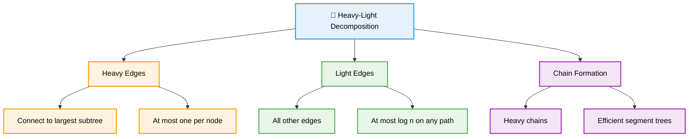
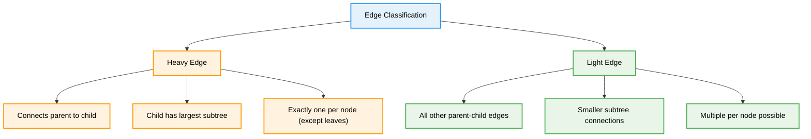
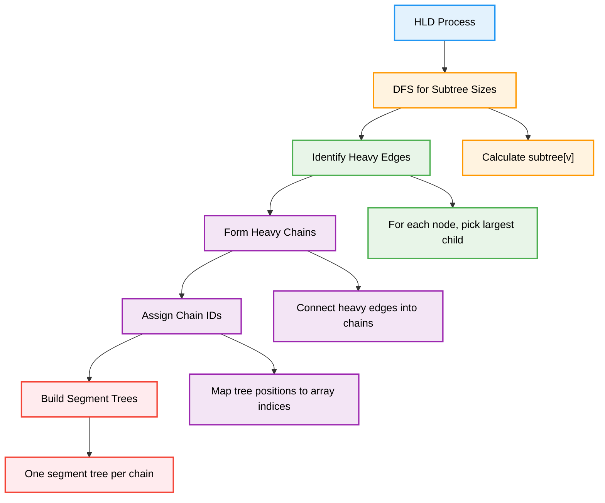
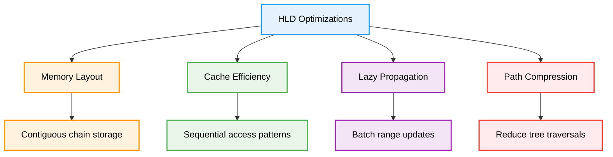
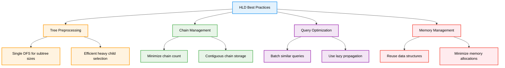

# 🔗 Heavy-Light Decomposition — Complete Professional <div align="center">Guide</div>

<div align="center">


**Master advanced tree decomposition for efficient path queries**

</div>

---

## 📑 Table of Contents

1. [Introduction](#introduction)
2. [Core Concepts](#core-concepts)
3. [Decomposition Process](#decomposition-process)
4. [Implementation](#implementation)
5. [Path Queries](#path-queries)
6. [Advanced Applications](#advanced-applications)
7. [Optimization Techniques](#optimization-techniques)
8. [Best Practices](#best-practices)

---

## Introduction

**Heavy-Light Decomposition (HLD)** is an advanced tree algorithm technique that decomposes a tree into a set of chains, enabling efficient path queries and updates in O(log²n) time. It's particularly useful for problems involving path operations on trees.

<div align="center">

</div>

### Core Principle



---

## Core Concepts

### Heavy and Light Edges

<div align="center">

</div>

### Edge Classification



### Chain Formation

<div align="center">

</div>

---

## Decomposition Process

### Algorithm Steps



### Decomposition Example

<div align="center">

</div>

---

## Implementation

### Heavy-Light Decomposition Class

```cpp
class HeavyLightDecomposition {
private:
    int n, timer;
    vector<vector<int>> adj;
    vector<int> parent, depth, subtree_size, heavy_child;
    vector<int> chain_head, chain_id, pos_in_chain;
    vector<vector<int>> chains;
    
public:
    HeavyLightDecomposition(int size) : n(size), timer(0) {
        adj.resize(n);
        parent.resize(n);
        depth.resize(n);
        subtree_size.resize(n);
        heavy_child.assign(n, -1);
        chain_head.resize(n);
        chain_id.resize(n);
        pos_in_chain.resize(n);
    }
    
    void addEdge(int u, int v) {
        adj[u].push_back(v);
        adj[v].push_back(u);
    }
    
    void decompose(int root = 0) {
        dfs1(root, -1);
        dfs2(root, root);
    }
    
private:
    void dfs1(int v, int p) {
        parent[v] = p;
        subtree_size[v] = 1;
        
        for (int u : adj[v]) {
            if (u != p) {
                depth[u] = depth[v] + 1;
                dfs1(u, v);
                subtree_size[v] += subtree_size[u];
                
                // Find heavy child (child with largest subtree)
                if (heavy_child[v] == -1 || subtree_size[u] > subtree_size[heavy_child[v]]) {
                    heavy_child[v] = u;
                }
            }
        }
    }
    
    void dfs2(int v, int head) {
        chain_head[v] = head;
        chain_id[v] = chains.size();
        
        if (chains.empty() || chain_head[v] != chain_head[chains.back().back()]) {
            chains.push_back(vector<int>());
        }
        
        pos_in_chain[v] = chains[chain_id[v]].size();
        chains[chain_id[v]].push_back(v);
        
        // Process heavy child first
        if (heavy_child[v] != -1) {
            dfs2(heavy_child[v], head);
        }
        
        // Process light children
        for (int u : adj[v]) {
            if (u != parent[v] && u != heavy_child[v]) {
                dfs2(u, u); // Start new chain
            }
        }
    }
    
public:
    // Query path from u to v
    vector<pair<int, pair<int, int>>> getPathChains(int u, int v) {
        vector<pair<int, pair<int, int>>> result;
        
        while (chain_head[u] != chain_head[v]) {
            if (depth[chain_head[u]] < depth[chain_head[v]]) {
                swap(u, v);
            }
            
            result.push_back({chain_id[u], {pos_in_chain[chain_head[u]], pos_in_chain[u]}});
            u = parent[chain_head[u]];
        }
        
        // Same chain
        if (depth[u] > depth[v]) swap(u, v);
        result.push_back({chain_id[u], {pos_in_chain[u], pos_in_chain[v]}});
        
        return result;
    }
    
    int lca(int u, int v) {
        while (chain_head[u] != chain_head[v]) {
            if (depth[chain_head[u]] < depth[chain_head[v]]) {
                swap(u, v);
            }
            u = parent[chain_head[u]];
        }
        return depth[u] < depth[v] ? u : v;
    }
    
    int distance(int u, int v) {
        return depth[u] + depth[v] - 2 * depth[lca(u, v)];
    }
    
    // Debug functions
    void printChains() {
        for (int i = 0; i < chains.size(); i++) {
            cout << "Chain " << i << ": ";
            for (int v : chains[i]) {
                cout << v << " ";
            }
            cout << endl;
        }
    }
    
    void printHeavyEdges() {
        cout << "Heavy edges: ";
        for (int v = 0; v < n; v++) {
            if (heavy_child[v] != -1) {
                cout << "(" << v << "," << heavy_child[v] << ") ";
            }
        }
        cout << endl;
    }
};
```

---

## Path Queries

### Segment Tree Integration

<div align="center">

</div>

### Path Query Implementation

```cpp
class HLDWithQueries {
private:
    HeavyLightDecomposition hld;
    vector<SegmentTree> segment_trees;
    
public:
    HLDWithQueries(int n) : hld(n) {}
    
    void addEdge(int u, int v) {
        hld.addEdge(u, v);
    }
    
    void build(vector<int>& values) {
        hld.decompose();
        
        // Create segment tree for each chain
        for (int i = 0; i < hld.chains.size(); i++) {
            vector<int> chain_values;
            for (int v : hld.chains[i]) {
                chain_values.push_back(values[v]);
            }
            segment_trees.push_back(SegmentTree(chain_values));
        }
    }
    
    // Query sum on path from u to v
    long long queryPath(int u, int v) {
        long long result = 0;
        auto path_chains = hld.getPathChains(u, v);
        
        for (auto& [chain_id, range] : path_chains) {
            result += segment_trees[chain_id].query(range.first, range.second);
        }
        
        return result;
    }
    
    // Update value at node v
    void updateNode(int v, int new_value) {
        int chain = hld.chain_id[v];
        int pos = hld.pos_in_chain[v];
        segment_trees[chain].update(pos, new_value);
    }
    
    // Update path from u to v
    void updatePath(int u, int v, int delta) {
        auto path_chains = hld.getPathChains(u, v);
        
        for (auto& [chain_id, range] : path_chains) {
            segment_trees[chain_id].updateRange(range.first, range.second, delta);
        }
    }
};

// Simple Segment Tree for demonstration
class SegmentTree {
private:
    vector<long long> tree, lazy;
    int n;
    
    void push(int node, int start, int end) {
        if (lazy[node] != 0) {
            tree[node] += lazy[node] * (end - start + 1);
            if (start != end) {
                lazy[2 * node] += lazy[node];
                lazy[2 * node + 1] += lazy[node];
            }
            lazy[node] = 0;
        }
    }
    
    void updateRange(int node, int start, int end, int l, int r, int delta) {
        push(node, start, end);
        if (start > r || end < l) return;
        
        if (start >= l && end <= r) {
            lazy[node] += delta;
            push(node, start, end);
            return;
        }
        
        int mid = (start + end) / 2;
        updateRange(2 * node, start, mid, l, r, delta);
        updateRange(2 * node + 1, mid + 1, end, l, r, delta);
        
        push(2 * node, start, mid);
        push(2 * node + 1, mid + 1, end);
        tree[node] = tree[2 * node] + tree[2 * node + 1];
    }
    
    long long queryRange(int node, int start, int end, int l, int r) {
        if (start > r || end < l) return 0;
        
        push(node, start, end);
        if (start >= l && end <= r) return tree[node];
        
        int mid = (start + end) / 2;
        return queryRange(2 * node, start, mid, l, r) +
               queryRange(2 * node + 1, mid + 1, end, l, r);
    }
    
public:
    SegmentTree(vector<int>& arr) : n(arr.size()) {
        tree.resize(4 * n);
        lazy.resize(4 * n);
        build(arr, 1, 0, n - 1);
    }
    
    void build(vector<int>& arr, int node, int start, int end) {
        if (start == end) {
            tree[node] = arr[start];
        } else {
            int mid = (start + end) / 2;
            build(arr, 2 * node, start, mid);
            build(arr, 2 * node + 1, mid + 1, end);
            tree[node] = tree[2 * node] + tree[2 * node + 1];
        }
    }
    
    void update(int pos, int value) {
        updateRange(1, 0, n - 1, pos, pos, value - query(pos, pos));
    }
    
    void updateRange(int l, int r, int delta) {
        updateRange(1, 0, n - 1, l, r, delta);
    }
    
    long long query(int l, int r) {
        return queryRange(1, 0, n - 1, l, r);
    }
};
```

---

## Advanced Applications

### LCA with HLD

```cpp
class LCAWithHLD {
private:
    HeavyLightDecomposition hld;
    
public:
    LCAWithHLD(int n) : hld(n) {}
    
    void addEdge(int u, int v) {
        hld.addEdge(u, v);
    }
    
    void build() {
        hld.decompose();
    }
    
    int lca(int u, int v) {
        return hld.lca(u, v);
    }
    
    int distance(int u, int v) {
        return hld.distance(u, v);
    }
    
    bool isAncestor(int u, int v) {
        return hld.lca(u, v) == u;
    }
};
```

### Subtree Queries with HLD

```cpp
class SubtreeQueries {
private:
    HeavyLightDecomposition hld;
    SegmentTree seg_tree;
    vector<int> tin, tout;
    int timer;
    
    void dfs(int v, int p, vector<int>& values, vector<int>& euler_tour) {
        tin[v] = timer++;
        euler_tour.push_back(values[v]);
        
        for (int u : hld.adj[v]) {
            if (u != p) {
                dfs(u, v, values, euler_tour);
            }
        }
        
        tout[v] = timer - 1;
    }
    
public:
    SubtreeQueries(int n) : hld(n), timer(0) {
        tin.resize(n);
        tout.resize(n);
    }
    
    void build(vector<int>& values) {
        vector<int> euler_tour;
        dfs(0, -1, values, euler_tour);
        seg_tree = SegmentTree(euler_tour);
    }
    
    long long querySubtree(int v) {
        return seg_tree.query(tin[v], tout[v]);
    }
    
    void updateSubtree(int v, int delta) {
        seg_tree.updateRange(tin[v], tout[v], delta);
    }
};
```

---

## Optimization Techniques

### Performance Optimizations



### Optimized Implementation

```cpp
class OptimizedHLD {
private:
    int n, timer;
    vector<vector<int>> adj;
    vector<int> parent, depth, subtree_size, heavy_child;
    vector<int> chain_head, pos;
    
public:
    OptimizedHLD(int size) : n(size), timer(0) {
        adj.resize(n);
        parent.resize(n);
        depth.resize(n);
        subtree_size.resize(n);
        heavy_child.assign(n, -1);
        chain_head.resize(n);
        pos.resize(n);
    }
    
    void decompose(int root = 0) {
        dfs1(root, -1);
        dfs2(root, root);
    }
    
private:
    void dfs1(int v, int p) {
        parent[v] = p;
        subtree_size[v] = 1;
        
        for (int& u : adj[v]) {
            if (u != p) {
                depth[u] = depth[v] + 1;
                dfs1(u, v);
                subtree_size[v] += subtree_size[u];
                
                if (heavy_child[v] == -1 || subtree_size[u] > subtree_size[heavy_child[v]]) {
                    heavy_child[v] = u;
                }
            }
        }
        
        // Move heavy child to front for better cache performance
        if (heavy_child[v] != -1) {
            for (int i = 0; i < adj[v].size(); i++) {
                if (adj[v][i] == heavy_child[v]) {
                    swap(adj[v][0], adj[v][i]);
                    break;
                }
            }
        }
    }
    
    void dfs2(int v, int head) {
        chain_head[v] = head;
        pos[v] = timer++;
        
        if (heavy_child[v] != -1) {
            dfs2(heavy_child[v], head);
        }
        
        for (int u : adj[v]) {
            if (u != parent[v] && u != heavy_child[v]) {
                dfs2(u, u);
            }
        }
    }
    
public:
    template<typename F>
    void processPath(int u, int v, F&& func) {
        while (chain_head[u] != chain_head[v]) {
            if (depth[chain_head[u]] < depth[chain_head[v]]) {
                swap(u, v);
            }
            
            func(pos[chain_head[u]], pos[u]);
            u = parent[chain_head[u]];
        }
        
        if (depth[u] > depth[v]) swap(u, v);
        func(pos[u], pos[v]);
    }
    
    int lca(int u, int v) {
        while (chain_head[u] != chain_head[v]) {
            if (depth[chain_head[u]] < depth[chain_head[v]]) {
                swap(u, v);
            }
            u = parent[chain_head[u]];
        }
        return depth[u] < depth[v] ? u : v;
    }
};
```

---

## Best Practices

### Implementation Guidelines



### Common Pitfalls and Solutions

```cpp
class HLDBestPractices {
public:
    // ❌ Incorrect heavy child selection
    void badHeavyChild(int v) {
        int maxSize = 0;
        for (int u : adj[v]) {
            if (subtree_size[u] > maxSize) {
                heavy_child[v] = u; // Missing parent check!
                maxSize = subtree_size[u];
            }
        }
    }
    
    // ✅ Correct heavy child selection
    void goodHeavyChild(int v, int p) {
        int maxSize = 0;
        for (int u : adj[v]) {
            if (u != p && subtree_size[u] > maxSize) {
                heavy_child[v] = u;
                maxSize = subtree_size[u];
            }
        }
    }
    
    // ❌ Inefficient path processing
    long long badPathQuery(int u, int v) {
        long long result = 0;
        while (u != v) {
            result += getValue(u);
            u = parent[u]; // O(n) in worst case
        }
        return result;
    }
    
    // ✅ Efficient HLD path processing
    long long goodPathQuery(int u, int v) {
        long long result = 0;
        while (chain_head[u] != chain_head[v]) {
            if (depth[chain_head[u]] < depth[chain_head[v]]) {
                swap(u, v);
            }
            // Query entire chain segment at once
            result += queryChain(chain_head[u], u);
            u = parent[chain_head[u]];
        }
        // Final segment in same chain
        if (depth[u] > depth[v]) swap(u, v);
        result += queryChain(u, v);
        return result;
    }
    
private:
    vector<vector<int>> adj;
    vector<int> parent, subtree_size, heavy_child, chain_head, depth;
    
    long long getValue(int v) { return 0; } // Placeholder
    long long queryChain(int u, int v) { return 0; } // Placeholder
};
```

### Performance Comparison

| Operation | Naive | LCA + Segment Tree | HLD |
|-----------|-------|-------------------|-----|
| **Preprocessing** | O(1) | O(n log n) | O(n) |
| **Path Query** | O(n) | O(log n) per LCA | O(log²n) |
| **Path Update** | O(n) | Not efficient | O(log²n) |
| **Space** | O(n) | O(n log n) | O(n) |

---

## Summary

**Heavy-Light Decomposition** transforms tree path operations from linear to logarithmic complexity. Key insights:

### Essential Concepts
- **Heavy Edges**: Connect to largest subtree child
- **Light Edges**: All other parent-child connections
- **Chain Formation**: Heavy edges form efficient query chains
- **Logarithmic Guarantee**: At most O(log n) light edges on any path

### Core Applications
- **Path Queries**: Sum, maximum, minimum on tree paths
- **Path Updates**: Range updates on tree paths
- **LCA Queries**: Efficient lowest common ancestor
- **Subtree Operations**: Combined with Euler tour technique

### Best Practices
- Preprocess tree structure efficiently in single DFS
- Use segment trees with lazy propagation for chain queries
- Optimize memory layout for better cache performance
- Handle edge cases in path processing carefully

> **Master's Insight**: HLD bridges the gap between tree algorithms and array-based data structures, enabling efficient path operations that would otherwise require complex tree-specific solutions.

---

<div align="center">

**🔗 Master Heavy-Light Decomposition • Optimize Tree Queries • Build Efficient Solutions**

*From Theory to Practice • Trees to Arrays • Understanding to Mastery*

</div>