# ⚖️ Heavy-Light Decomposition — Complete Professional Guide

<div align="center">


*Master advanced tree decomposition for lightning-fast path queries and competitive programming excellence*

</div>

---

## 📑 Table of Contents

1. [Introduction](#-introduction)
2. [Core Concepts](#-core-concepts)
3. [Heavy vs Light Edges](#-heavy-vs-light-edges)
4. [Algorithm Implementation](#-algorithm-implementation)
5. [Segment Tree Integration](#-segment-tree-integration)
6. [Query Processing](#-query-processing)
7. [Update Operations](#-update-operations)
8. [Complexity Analysis](#-complexity-analysis)
9. [Applications](#-applications)
10. [Advanced Techniques](#-advanced-techniques)
11. [Interview Problems](#-interview-problems)
12. [Best Practices](#-best-practices)

---

## 🎯 Introduction

**Heavy-Light Decomposition (HLD)** is an advanced tree decomposition technique that breaks down a tree into chains, enabling efficient path queries and updates in O(log²n) time using segment trees.

### 🔑 Key Innovation

```
Normal Tree Path Query: O(n)
HLD + Segment Tree: O(log²n)

Speedup: From linear to logarithmic!
```

### 💡 Core Idea

```mermaid
flowchart TD
    A["🌳 Original Tree"] --> B["⚖️ Classify Edges"]
    B --> C["🔗 Form Chains"]
    C --> D["📊 Map to Segment Tree"]
    D --> E["⚡ Fast Queries"]
    
    B --> F["Heavy: Largest subtree"]
    B --> G["Light: All others"]
    
    C --> H["Chain heavy edges"]
    C --> I["At most log n chains"]
    
    D --> J["Contiguous indices"]
    D --> K["Range operations"]
    
    E --> L["O(log²n) path queries"]
    
    style A fill:#e3f2fd
    style E fill:#c8e6c9
    style L fill:#c8e6c9
```



- **Decompose** tree into heavy and light edges
- **Chain** heavy edges together
- **Map** chains to segment tree indices
- **Query** paths by traversing chains

---

## 🏗️ Core Concepts

### 🎯 Definitions


#### Heavy Child
```cpp
For node u with children v1, v2, ..., vk:
Heavy child = child with maximum subtree size
```

#### Heavy Edge
```cpp
Edge u → v is heavy if:
v is the heavy child of u
```

#### Light Edge
```cpp
All other edges (non-heavy edges)
```

#### Chain
```cpp
Maximal sequence of heavy edges
Each chain has a head (topmost node)
```

### 📊 Key Property

```mermaid
flowchart LR
    A["Root to Leaf Path"] --> B["At most log n light edges"]
    B --> C["Each light edge halves subtree"]
    C --> D["Logarithmic bound guaranteed"]
    
    E["Path Query Complexity"] --> F["Traverse ≤ log n chains"]
    F --> G["Each chain: O(log n) segment tree"]
    G --> H["Total: O(log²n)"]
    
    style A fill:#e3f2fd
    style D fill:#c8e6c9
    style H fill:#c8e6c9
```



**Logarithmic Light Edges**: On any root-to-leaf path, there are at most **log n** light edges.

**Proof**: Each light edge reduces subtree size by at least half.

---

## ⚖️ Heavy vs Light Edges

### 🔍 Classification Algorithm

```cpp
void classifyEdges(int u, int parent, vector<vector<int>>& adj, 
                   vector<int>& subtreeSize, vector<bool>& isHeavy) {
    int maxSize = 0;
    int heavyChild = -1;
    
    // Find heavy child
    for (int v : adj[u]) {
        if (v != parent && subtreeSize[v] > maxSize) {
            maxSize = subtreeSize[v];
            heavyChild = v;
        }
    }
    
    // Mark heavy edge
    for (int v : adj[u]) {
        if (v != parent) {
            if (v == heavyChild) {
                isHeavy[v] = true;  // Heavy edge u → v
            }
            classifyEdges(v, u, adj, subtreeSize, isHeavy);
        }
    }
}
```

### 📈 Example Classification

```
Tree:
        1(7)
       /    \
    2(4)    3(2)
   /   \      \
 4(2)  5(1)   6(1)
 /
7(1)

Subtree sizes in parentheses
Heavy edges: 1→2, 2→4, 4→7
Light edges: 1→3, 3→6, 2→5
```

---

## 💻 Algorithm Implementation

### 🔧 Step 1: Calculate Subtree Sizes

```cpp
int calculateSubtreeSize(int u, int parent, vector<vector<int>>& adj, 
                        vector<int>& subtreeSize) {
    subtreeSize[u] = 1;
    
    for (int v : adj[u]) {
        if (v != parent) {
            subtreeSize[u] += calculateSubtreeSize(v, u, adj, subtreeSize);
        }
    }
    
    return subtreeSize[u];
}
```

### 🔧 Step 2: Heavy-Light Decomposition

```cpp
class HeavyLightDecomposition {
private:
    int n, timer;
    vector<vector<int>> adj;
    vector<int> subtreeSize, parent, depth;
    vector<int> chainHead, chainPos, chainIndex;
    
    void dfs1(int u, int p, int d) {
        parent[u] = p;
        depth[u] = d;
        subtreeSize[u] = 1;
        
        for (int v : adj[u]) {
            if (v != p) {
                dfs1(v, u, d + 1);
                subtreeSize[u] += subtreeSize[v];
            }
        }
    }
    
    void dfs2(int u, int p, int head) {
        chainHead[u] = head;
        chainPos[u] = timer++;
        chainIndex[chainPos[u]] = u;
        
        // Find heavy child
        int heavyChild = -1;
        for (int v : adj[u]) {
            if (v != p && (heavyChild == -1 || subtreeSize[v] > subtreeSize[heavyChild])) {
                heavyChild = v;
            }
        }
        
        // Continue heavy chain
        if (heavyChild != -1) {
            dfs2(heavyChild, u, head);
        }
        
        // Start new chains for light children
        for (int v : adj[u]) {
            if (v != p && v != heavyChild) {
                dfs2(v, u, v);
            }
        }
    }
    
public:
    HeavyLightDecomposition(int n, vector<vector<int>>& tree) : 
        n(n), timer(0), adj(tree) {
        subtreeSize.resize(n);
        parent.resize(n);
        depth.resize(n);
        chainHead.resize(n);
        chainPos.resize(n);
        chainIndex.resize(n);
        
        dfs1(0, -1, 0);
        dfs2(0, -1, 0);
    }
    
    // Get LCA of two nodes
    int lca(int u, int v) {
        while (chainHead[u] != chainHead[v]) {
            if (depth[chainHead[u]] > depth[chainHead[v]]) {
                u = parent[chainHead[u]];
            } else {
                v = parent[chainHead[v]];
            }
        }
        return depth[u] < depth[v] ? u : v;
    }
    
    // Get path from u to v as list of chain segments
    vector<pair<int, int>> getPath(int u, int v) {
        vector<pair<int, int>> pathU, pathV;
        int lca_node = lca(u, v);
        
        // Path from u to LCA
        int curr = u;
        while (chainHead[curr] != chainHead[lca_node]) {
            pathU.push_back({chainPos[chainHead[curr]], chainPos[curr]});
            curr = parent[chainHead[curr]];
        }
        pathU.push_back({chainPos[lca_node], chainPos[curr]});
        
        // Path from v to LCA
        curr = v;
        while (chainHead[curr] != chainHead[lca_node]) {
            pathV.push_back({chainPos[chainHead[curr]], chainPos[curr]});
            curr = parent[chainHead[curr]];
        }
        if (curr != lca_node) {
            pathV.push_back({chainPos[lca_node] + 1, chainPos[curr]});
        }
        
        // Combine paths
        reverse(pathV.begin(), pathV.end());
        pathU.insert(pathU.end(), pathV.begin(), pathV.end());
        
        return pathU;
    }
};
```

---

## 📊 Segment Tree Integration

### 🔧 Segment Tree for HLD

```cpp
class SegmentTree {
private:
    vector<long long> tree, lazy;
    int n;
    
    void push(int node, int start, int end) {
        if (lazy[node] != 0) {
            tree[node] += lazy[node] * (end - start + 1);
            if (start != end) {
                lazy[2 * node] += lazy[node];
                lazy[2 * node + 1] += lazy[node];
            }
            lazy[node] = 0;
        }
    }
    
    void updateRange(int node, int start, int end, int l, int r, long long val) {
        push(node, start, end);
        if (start > r || end < l) return;
        
        if (start >= l && end <= r) {
            lazy[node] += val;
            push(node, start, end);
            return;
        }
        
        int mid = (start + end) / 2;
        updateRange(2 * node, start, mid, l, r, val);
        updateRange(2 * node + 1, mid + 1, end, l, r, val);
        
        push(2 * node, start, mid);
        push(2 * node + 1, mid + 1, end);
        tree[node] = tree[2 * node] + tree[2 * node + 1];
    }
    
    long long queryRange(int node, int start, int end, int l, int r) {
        if (start > r || end < l) return 0;
        
        push(node, start, end);
        if (start >= l && end <= r) return tree[node];
        
        int mid = (start + end) / 2;
        return queryRange(2 * node, start, mid, l, r) +
               queryRange(2 * node + 1, mid + 1, end, l, r);
    }
    
public:
    SegmentTree(int size) : n(size) {
        tree.resize(4 * n, 0);
        lazy.resize(4 * n, 0);
    }
    
    void update(int l, int r, long long val) {
        updateRange(1, 0, n - 1, l, r, val);
    }
    
    long long query(int l, int r) {
        return queryRange(1, 0, n - 1, l, r);
    }
};
```

### 🔧 HLD + Segment Tree Integration

```cpp
class HLDWithSegmentTree {
private:
    HeavyLightDecomposition hld;
    SegmentTree segTree;
    
public:
    HLDWithSegmentTree(int n, vector<vector<int>>& tree) : 
        hld(n, tree), segTree(n) {}
    
    void updatePath(int u, int v, long long val) {
        vector<pair<int, int>> path = hld.getPath(u, v);
        for (auto& segment : path) {
            segTree.update(segment.first, segment.second, val);
        }
    }
    
    long long queryPath(int u, int v) {
        vector<pair<int, int>> path = hld.getPath(u, v);
        long long result = 0;
        for (auto& segment : path) {
            result += segTree.query(segment.first, segment.second);
        }
        return result;
    }
    
    void updateSubtree(int u, long long val) {
        int start = hld.chainPos[u];
        int end = start + hld.subtreeSize[u] - 1;
        segTree.update(start, end, val);
    }
    
    long long querySubtree(int u) {
        int start = hld.chainPos[u];
        int end = start + hld.subtreeSize[u] - 1;
        return segTree.query(start, end);
    }
};
```

---

## 🔍 Query Processing

### 🎯 Path Query Algorithm

```cpp
long long queryPath(int u, int v) {
    long long result = 0;
    
    // Move u and v to same chain
    while (chainHead[u] != chainHead[v]) {
        // Ensure u is deeper
        if (depth[chainHead[u]] < depth[chainHead[v]]) {
            swap(u, v);
        }
        
        // Query from chainHead[u] to u
        result += segTree.query(chainPos[chainHead[u]], chainPos[u]);
        
        // Move u up
        u = parent[chainHead[u]];
    }
    
    // Both in same chain now
    if (depth[u] > depth[v]) swap(u, v);
    result += segTree.query(chainPos[u], chainPos[v]);
    
    return result;
}
```

### 📊 Query Complexity Analysis

```
Path u → v crosses at most log n chains
Each chain query: O(log n) in segment tree
Total: O(log n × log n) = O(log²n)
```

---

## 🔄 Update Operations

### 🎯 Path Update

```cpp
void updatePath(int u, int v, long long val) {
    while (chainHead[u] != chainHead[v]) {
        if (depth[chainHead[u]] < depth[chainHead[v]]) {
            swap(u, v);
        }
        
        segTree.update(chainPos[chainHead[u]], chainPos[u], val);
        u = parent[chainHead[u]];
    }
    
    if (depth[u] > depth[v]) swap(u, v);
    segTree.update(chainPos[u], chainPos[v], val);
}
```

### 🌳 Subtree Update

```cpp
void updateSubtree(int u, long long val) {
    // Subtree of u is contiguous in DFS order
    int start = chainPos[u];
    int end = start + subtreeSize[u] - 1;
    segTree.update(start, end, val);
}
```

---

## ⏱️ Complexity Analysis

### 📊 Time Complexity

| Operation | Complexity | Explanation |
|:----------|:-----------|:------------|
| **Preprocessing** | O(n) | DFS traversals |
| **Path Query** | O(log²n) | log n chains × log n per query |
| **Path Update** | O(log²n) | log n chains × log n per update |
| **Subtree Query** | O(log n) | Single segment tree query |
| **Subtree Update** | O(log n) | Single segment tree update |

### 💾 Space Complexity

| Component | Space | Description |
|:----------|:------|:------------|
| **Tree Storage** | O(n) | Adjacency list |
| **HLD Arrays** | O(n) | Chain info, positions |
| **Segment Tree** | O(n) | Tree and lazy arrays |
| **Total** | **O(n)** | Linear space |

---

## 🎯 Applications

### 🌐 Real-World Applications

#### 1️⃣ Network Routing
```cpp
class NetworkRouter {
    HLDWithSegmentTree hld;
    
public:
    void updateBandwidth(int u, int v, int bandwidth) {
        hld.updatePath(u, v, bandwidth);
    }
    
    int getPathCapacity(int u, int v) {
        return hld.queryPath(u, v);
    }
};
```

#### 2️⃣ Corporate Hierarchy
```cpp
class CorporateHierarchy {
    HLDWithSegmentTree hld;
    
public:
    void promoteSalary(int manager, int amount) {
        hld.updateSubtree(manager, amount);
    }
    
    long long getTotalSalary(int u, int v) {
        return hld.queryPath(u, v);
    }
};
```

#### 3️⃣ File System Operations
```cpp
class FileSystem {
    HLDWithSegmentTree hld;
    
public:
    void updateDirectorySize(int dir, long long size) {
        hld.updateSubtree(dir, size);
    }
    
    long long getPathSize(int file1, int file2) {
        return hld.queryPath(file1, file2);
    }
};
```

---

## 🎓 Advanced Techniques

### 🔥 Edge-Based Queries

```cpp
class EdgeBasedHLD {
private:
    // Map each edge to its child node
    vector<int> edgeToNode;
    
public:
    void updateEdge(int u, int v, long long val) {
        // Ensure v is child of u
        if (depth[u] > depth[v]) swap(u, v);
        
        // Update the edge u→v (mapped to node v)
        segTree.update(chainPos[v], chainPos[v], val);
    }
    
    long long queryPathEdges(int u, int v) {
        // Similar to node queries but exclude LCA
        // Implementation details...
    }
};
```

### 🎪 Multiple Values per Node

```cpp
class MultiValueHLD {
private:
    vector<SegmentTree> segTrees;  // Multiple segment trees
    
public:
    void updatePath(int u, int v, int valueType, long long val) {
        vector<pair<int, int>> path = hld.getPath(u, v);
        for (auto& segment : path) {
            segTrees[valueType].update(segment.first, segment.second, val);
        }
    }
    
    long long queryPath(int u, int v, int valueType) {
        vector<pair<int, int>> path = hld.getPath(u, v);
        long long result = 0;
        for (auto& segment : path) {
            result += segTrees[valueType].query(segment.first, segment.second);
        }
        return result;
    }
};
```

---

## 🏆 Interview Problems

### ✅ Common Problem Types

1. **Path Sum Queries** - Sum of values on path u to v
2. **Path Maximum** - Maximum value on path u to v
3. **Subtree Updates** - Update all nodes in subtree
4. **LCA with Values** - LCA with additional computations
5. **Dynamic Tree Queries** - Online queries and updates

### 🔥 Sample Problem: Path Sum with Updates

```cpp
class PathSumHLD {
private:
    HLDWithSegmentTree hld;
    
public:
    PathSumHLD(int n, vector<vector<int>>& tree, vector<long long>& values) : 
        hld(n, tree) {
        // Initialize segment tree with node values
        for (int i = 0; i < n; i++) {
            hld.segTree.update(hld.chainPos[i], hld.chainPos[i], values[i]);
        }
    }
    
    void updateNode(int u, long long val) {
        hld.segTree.update(hld.chainPos[u], hld.chainPos[u], val);
    }
    
    void updatePath(int u, int v, long long val) {
        hld.updatePath(u, v, val);
    }
    
    long long queryPath(int u, int v) {
        return hld.queryPath(u, v);
    }
    
    long long querySubtree(int u) {
        return hld.querySubtree(u);
    }
};
```

### 🎯 Usage Example

```cpp
int main() {
    int n = 7;
    vector<vector<int>> tree(n);
    
    // Build tree
    tree[0] = {1, 2};
    tree[1] = {0, 3, 4};
    tree[2] = {0, 5};
    tree[3] = {1};
    tree[4] = {1, 6};
    tree[5] = {2};
    tree[6] = {4};
    
    vector<long long> values = {1, 2, 3, 4, 5, 6, 7};
    
    PathSumHLD hld(n, tree, values);
    
    // Query path sum from node 3 to node 6
    cout << hld.queryPath(3, 6) << endl;  // Sum along path 3→1→4→6
    
    // Update path from node 3 to node 5
    hld.updatePath(3, 5, 10);
    
    // Query subtree sum of node 1
    cout << hld.querySubtree(1) << endl;
    
    return 0;
}
```

---

## 💎 Best Practices

### ✅ Implementation Guidelines

```
✓ Always calculate subtree sizes first
✓ Use 0-based indexing consistently
✓ Handle parent pointers carefully
✓ Test with small trees first
✓ Verify chain decomposition manually
✓ Use lazy propagation for range updates
```

### 🔧 Optimization Tips

```cpp
// Memory optimization: Use arrays instead of vectors for better cache
int subtreeSize[MAXN], chainHead[MAXN], chainPos[MAXN];

// Speed optimization: Avoid recursion in segment tree
class IterativeSegmentTree {
    // Iterative implementation for better performance
};

// Debugging: Visualize chain decomposition
void printChains() {
    for (int i = 0; i < n; i++) {
        cout << "Node " << i << ": chain " << chainHead[i] 
             << ", pos " << chainPos[i] << endl;
    }
}
```

### 🚫 Common Pitfalls

```
✗ Forgetting to handle parent pointers
✗ Incorrect chain head assignment
✗ Off-by-one errors in segment tree
✗ Not handling single-node paths
✗ Mixing 0-based and 1-based indexing
```

---

## 📊 Performance Comparison

### 🆚 HLD vs Other Techniques

<table>
<thead>
<tr>
<th>Technique</th>
<th>Path Query</th>
<th>Path Update</th>
<th>Subtree Query</th>
<th>Space</th>
</tr>
</thead>
<tbody>
<tr>
<td><strong>Naive DFS</strong></td>
<td>O(n)</td>
<td>O(n)</td>
<td>O(n)</td>
<td>O(n)</td>
</tr>
<tr>
<td><strong>LCA + Preprocessing</strong></td>
<td>O(log n)</td>
<td>O(n)</td>
<td>O(n)</td>
<td>O(n log n)</td>
</tr>
<tr>
<td><strong>Heavy-Light Decomposition</strong></td>
<td>O(log²n)</td>
<td>O(log²n)</td>
<td>O(log n)</td>
<td>O(n)</td>
</tr>
<tr>
<td><strong>Link-Cut Tree</strong></td>
<td>O(log n)</td>
<td>O(log n)</td>
<td>O(log n)</td>
<td>O(n)</td>
</tr>
</tbody>
</table>

---

## 🎓 Key Takeaways

<div align="center">

### 🌟 Master These Concepts

</div>

```
1. ⚖️ HLD = Tree decomposition into heavy/light chains
2. 🔗 Heavy edge = connects to largest subtree child
3. 📊 At most log n light edges on any path
4. 🌳 Combine with segment tree for fast queries
5. ⚡ O(log²n) path operations vs O(n) naive
6. 🎯 Perfect for competitive programming
7. 🔧 Requires careful implementation
8. 💡 Essential for advanced tree problems
```

---

## 📚 Practice Resources

- **Codeforces**: HLD tag problems
- **AtCoder**: Tree DP and query problems
- **SPOJ**: Classical HLD problems
- **CodeChef**: Advanced tree algorithms

---

## 🎯 Interview Tips

1. **Explain Intuition**: Why decompose into chains?
2. **Draw Examples**: Visualize heavy/light edges
3. **Analyze Complexity**: Prove log²n bound
4. **Handle Edge Cases**: Single nodes, linear trees
5. **Optimize Implementation**: Discuss iterative vs recursive
6. **Connect Applications**: Real-world use cases

---

<div align="center">

### 🔥 One-Line Summary

**Heavy-Light Decomposition = Advanced tree technique enabling O(log²n) path queries through strategic chain decomposition and segment tree integration**

---

**💻 Master HLD, master competitive programming!**

*"In the realm of tree algorithms, Heavy-Light Decomposition is the bridge between theory and lightning-fast practice."*

</div>