# 🗜️ Huffman Coding — Complete Professional Guide

<div align="center">


*Master the art of optimal lossless data compression using greedy algorithms*

</div>

---

## 📑 Table of Contents

1. [Introduction](#-introduction)
2. [Why Huffman Coding?](#-why-huffman-coding)
3. [Algorithm Overview](#-algorithm-overview)
4. [Implementation](#-implementation)
5. [Step-by-Step Example](#-step-by-step-example)
6. [Complexity Analysis](#-complexity-analysis)
7. [Properties & Characteristics](#-properties--characteristics)
8. [Advantages & Disadvantages](#-advantages--disadvantages)
9. [Applications](#-applications)
10. [Comparison with Other Methods](#-comparison-with-other-methods)
11. [Variations & Extensions](#-variations--extensions)
12. [Interview Problems](#-interview-problems)
13. [Best Practices](#-best-practices)

---

## 🎯 Introduction

**Huffman Coding** is a lossless data compression algorithm that uses variable-length prefix codes to represent symbols based on their frequency of occurrence. It's a greedy algorithm that produces optimal prefix codes.

### 🔑 Key Concepts

- **Variable-Length Encoding**: Frequent symbols get shorter codes
- **Prefix-Free Codes**: No code is a prefix of another
- **Greedy Strategy**: Always combine least frequent nodes
- **Binary Tree Structure**: Codes derived from tree paths

### 💡 Core Principle

```mermaid
flowchart TD
    A["📊 Symbol Frequency Analysis"] --> B["🔢 High Frequency"]
    A --> C["🔢 Low Frequency"]
    
    B --> D["📏 Short Code"]
    C --> E["📏 Long Code"]
    
    D --> F["🗜️ Optimal Compression"]
    E --> F
    
    G["Example:"] --> H["'A' appears 100 times → Code: '0'"]
    G --> I["'Z' appears 1 time → Code: '11010'"]
    
    style A fill:#e3f2fd
    style F fill:#c8e6c9
    style G fill:#fff3e0
```



```
High Frequency → Short Code
Low Frequency → Long Code
Result: Optimal Compression
```

---

## 🚀 Why Huffman Coding?

### 📊 Fixed vs Variable Length Comparison

#### Fixed-Length Encoding
```
Symbol | Frequency | Fixed Code
   A   |    45     |    00
   B   |    13     |    01  
   C   |    12     |    10
   D   |     5     |    11

Total bits = 4 × 2 = 8 bits per symbol
Average: 2 bits/symbol
```

#### Huffman Encoding
```
Symbol | Frequency | Huffman Code
   A   |    45     |     0
   B   |    13     |    101
   C   |    12     |    100
   D   |     5     |    11

Average: 1.6 bits/symbol (20% compression!)
```

### ✅ Benefits

```mermaid
mindmap
  root))🗜️ Huffman Benefits((
    🔥 Optimal Compression
      Minimum average code length
      Mathematically proven
      Greedy approach works
    ⚡ Lossless
      Perfect reconstruction
      No data loss
      Reversible process
    🎯 Prefix-Free
      Unambiguous decoding
      No code conflicts
      Self-synchronizing
    🏗️ Widely Adopted
      Industry standard
      Well-tested
      Broad support
```



```
🔥 Optimal Compression     → Minimum average code length
⚡ Lossless               → Perfect reconstruction
🎯 Prefix-Free           → Unambiguous decoding
🏗️ Widely Adopted        → Industry standard
```

---

## 🏗️ Algorithm Overview

### 🎯 Huffman Algorithm Steps

```mermaid
flowchart TD
    A["📝 Input Text"] --> B["1️⃣ Count Frequencies"]
    B --> C["2️⃣ Build Min-Heap"]
    C --> D["3️⃣ Construct Tree"]
    D --> E["4️⃣ Assign Codes"]
    E --> F["5️⃣ Encode Data"]
    
    B --> B1["Scan each character"]
    C --> C1["Insert all symbols"]
    D --> D1["Merge two minimum nodes"]
    E --> E1["Traverse tree paths"]
    F --> F1["Replace symbols with codes"]
    
    style A fill:#e3f2fd
    style F fill:#c8e6c9
```



1. **Count Frequencies**: Calculate occurrence of each symbol
2. **Build Min-Heap**: Insert all symbols with frequencies
3. **Construct Tree**: Repeatedly merge two minimum nodes
4. **Assign Codes**: Traverse tree to generate codes
5. **Encode Data**: Replace symbols with their codes

### 📐 Tree Construction Process


```
Initial: [A:5, B:9, C:12, D:13, E:16, F:45]

Step 1: Merge A(5) + B(9) = AB(14)
Heap: [C:12, D:13, AB:14, E:16, F:45]

Step 2: Merge C(12) + D(13) = CD(25)  
Heap: [AB:14, E:16, CD:25, F:45]

Step 3: Merge AB(14) + E(16) = ABE(30)
Heap: [CD:25, ABE:30, F:45]

Step 4: Merge CD(25) + ABE(30) = CDABE(55)
Heap: [F:45, CDABE:55]

Step 5: Merge F(45) + CDABE(55) = Root(100)
```

---

## 💻 Implementation

### 🔧 Node Structure

```cpp
struct HuffmanNode {
    char symbol;
    int frequency;
    HuffmanNode* left;
    HuffmanNode* right;
    
    HuffmanNode(char sym, int freq) : symbol(sym), frequency(freq), left(nullptr), right(nullptr) {}
    HuffmanNode(int freq) : symbol('\0'), frequency(freq), left(nullptr), right(nullptr) {}
};
```

### 🏛️ Comparator for Min-Heap

```cpp
struct Compare {
    bool operator()(HuffmanNode* a, HuffmanNode* b) {
        if (a->frequency != b->frequency) {
            return a->frequency > b->frequency;
        }
        return a->symbol > b->symbol;  // Tie-breaking
    }
};
```

### 🌳 Build Huffman Tree

```cpp
HuffmanNode* buildHuffmanTree(map<char, int>& frequencies) {
    priority_queue<HuffmanNode*, vector<HuffmanNode*>, Compare> minHeap;
    
    // Step 1: Create leaf nodes and add to heap
    for (auto& pair : frequencies) {
        minHeap.push(new HuffmanNode(pair.first, pair.second));
    }
    
    // Step 2: Build tree by merging nodes
    while (minHeap.size() > 1) {
        HuffmanNode* left = minHeap.top(); minHeap.pop();
        HuffmanNode* right = minHeap.top(); minHeap.pop();
        
        HuffmanNode* merged = new HuffmanNode(left->frequency + right->frequency);
        merged->left = left;
        merged->right = right;
        
        minHeap.push(merged);
    }
    
    return minHeap.top();
}
```

### 🔍 Generate Codes

```cpp
void generateCodes(HuffmanNode* root, string code, map<char, string>& codes) {
    if (!root) return;
    
    // Leaf node - store the code
    if (root->symbol != '\0') {
        codes[root->symbol] = code.empty() ? "0" : code;  // Handle single symbol
        return;
    }
    
    generateCodes(root->left, code + "0", codes);
    generateCodes(root->right, code + "1", codes);
}
```

### 🎯 Complete Huffman Coding

```cpp
class HuffmanCoding {
private:
    HuffmanNode* root;
    map<char, string> codes;
    map<char, int> frequencies;
    
public:
    string encode(string text) {
        // Step 1: Count frequencies
        for (char c : text) {
            frequencies[c]++;
        }
        
        // Step 2: Build Huffman tree
        root = buildHuffmanTree(frequencies);
        
        // Step 3: Generate codes
        generateCodes(root, "", codes);
        
        // Step 4: Encode text
        string encoded = "";
        for (char c : text) {
            encoded += codes[c];
        }
        
        return encoded;
    }
    
    string decode(string encoded) {
        string decoded = "";
        HuffmanNode* current = root;
        
        for (char bit : encoded) {
            if (bit == '0') {
                current = current->left;
            } else {
                current = current->right;
            }
            
            // Reached leaf node
            if (current->symbol != '\0') {
                decoded += current->symbol;
                current = root;  // Reset to root
            }
        }
        
        return decoded;
    }
    
    void printCodes() {
        cout << "Huffman Codes:\n";
        for (auto& pair : codes) {
            cout << pair.first << ": " << pair.second << "\n";
        }
    }
};
```

---

## 📊 Step-by-Step Example

### 🎯 Input Text: "ABRACADABRA"

#### Step 1: Frequency Count
```
A: 5 occurrences
B: 2 occurrences  
R: 2 occurrences
C: 1 occurrence
D: 1 occurrence
```

#### Step 2: Build Min-Heap
```
Initial Heap: [C:1, D:1, B:2, R:2, A:5]
```

#### Step 3: Tree Construction
```
Merge C(1) + D(1) = CD(2)
Heap: [B:2, R:2, CD:2, A:5]

Merge B(2) + R(2) = BR(4)  
Heap: [CD:2, BR:4, A:5]

Merge CD(2) + BR(4) = CDBR(6)
Heap: [A:5, CDBR:6]

Merge A(5) + CDBR(6) = Root(11)
```

#### Step 4: Final Tree Structure
```
        Root(11)
       /        \
    A(5)      CDBR(6)
             /        \
         CD(2)      BR(4)
        /    \     /    \
     C(1)  D(1) B(2)  R(2)
```

#### Step 5: Generated Codes
```
A: 0
C: 100
D: 101  
B: 110
R: 111
```

#### Step 6: Encoding Result
```
Original: "ABRACADABRA" (11 characters × 8 bits = 88 bits)
Encoded:  "0110111010010101011111110" (25 bits)
Compression Ratio: 71.6%
```

---

## ⏱️ Complexity Analysis

### Time Complexity

| Operation | Complexity | Explanation |
|:----------|:-----------|:------------|
| **Frequency Count** | O(n) | Scan input once |
| **Heap Construction** | O(k log k) | k unique symbols |
| **Tree Building** | O(k log k) | k-1 merge operations |
| **Code Generation** | O(k) | Tree traversal |
| **Encoding** | O(n) | Replace each symbol |
| **Decoding** | O(n) | Traverse tree for each bit |

**Overall Time Complexity**: O(n + k log k) where n = input size, k = unique symbols

### Space Complexity

| Component | Space | Explanation |
|:----------|:------|:------------|
| **Frequency Map** | O(k) | Store symbol frequencies |
| **Huffman Tree** | O(k) | Tree nodes |
| **Code Map** | O(k) | Symbol-to-code mapping |
| **Heap** | O(k) | Priority queue |

**Overall Space Complexity**: O(k)

---

## 🎪 Properties & Characteristics

### ✅ Key Properties

1. **Optimal Prefix Codes**: Produces minimum average code length
2. **Prefix-Free**: No code is prefix of another
3. **Greedy Strategy**: Locally optimal choices lead to global optimum
4. **Binary Tree**: Each internal node has exactly 2 children
5. **Frequency-Based**: More frequent symbols get shorter codes

### 🔍 Mathematical Properties

```
Average Code Length = Σ(frequency[i] × codeLength[i]) / totalSymbols

Compression Ratio = (Original Size - Compressed Size) / Original Size × 100%

Entropy ≤ Average Code Length < Entropy + 1
```

### 🎯 Optimality Proof

Huffman coding produces optimal prefix codes because:
1. **Greedy Choice**: Always merge least frequent nodes
2. **Optimal Substructure**: Optimal tree contains optimal subtrees
3. **Exchange Argument**: Any other tree can be transformed to Huffman tree without increasing cost

---

## ✅ Advantages & Disadvantages

### ✅ Advantages

```
🔥 Optimal Compression      → Minimum average code length
⚡ Lossless                → Perfect data reconstruction  
🎯 Unambiguous Decoding    → Prefix-free property
🏗️ Widely Supported       → Industry standard
📊 Adaptive               → Works with any symbol distribution
🔧 Simple Implementation   → Straightforward algorithm
```

### ❌ Disadvantages

```
📋 Overhead               → Must store/transmit tree structure
🔢 Symbol Knowledge       → Requires frequency information
📏 Small Data Inefficient → Overhead > compression for small inputs
🎭 Static                → Tree fixed after construction
💾 Memory Usage          → Requires tree storage
⏱️ Two-Pass Algorithm    → Need frequency count first
```

---

## 🎯 Applications

### 🌐 Real-World Usage

| Domain | Application | Details |
|:-------|:------------|:--------|
| **File Compression** | ZIP, GZIP | Text and binary file compression |
| **Image Formats** | JPEG | Huffman coding for AC coefficients |
| **Audio Compression** | MP3 | Part of audio encoding pipeline |
| **Network Protocols** | HTTP/2 | HPACK header compression |
| **Database Systems** | Column stores | Compress repetitive data |
| **Multimedia** | Video codecs | Entropy coding stage |

### 💻 Code Applications

#### File Compression Tool
```cpp
class FileCompressor {
public:
    void compressFile(string inputFile, string outputFile) {
        ifstream input(inputFile, ios::binary);
        string content((istreambuf_iterator<char>(input)), istreambuf_iterator<char>());
        
        HuffmanCoding huffman;
        string compressed = huffman.encode(content);
        
        ofstream output(outputFile, ios::binary);
        // Write tree structure and compressed data
        writeCompressedData(output, huffman, compressed);
    }
    
    void decompressFile(string inputFile, string outputFile) {
        ifstream input(inputFile, ios::binary);
        // Read tree structure and compressed data
        auto [huffman, compressed] = readCompressedData(input);
        
        string decompressed = huffman.decode(compressed);
        
        ofstream output(outputFile);
        output << decompressed;
    }
};
```

---

## 🆚 Comparison with Other Methods

### 📊 Compression Algorithms Comparison

<table>
<thead>
<tr>
<th>Algorithm</th>
<th>Type</th>
<th>Compression</th>
<th>Speed</th>
<th>Optimality</th>
</tr>
</thead>
<tbody>
<tr>
<td><strong>Huffman Coding</strong></td>
<td>Lossless</td>
<td>Good</td>
<td>Fast</td>
<td>Optimal for prefix codes</td>
</tr>
<tr>
<td><strong>Shannon-Fano</strong></td>
<td>Lossless</td>
<td>Good</td>
<td>Fast</td>
<td>Near-optimal</td>
</tr>
<tr>
<td><strong>LZ77/LZ78</strong></td>
<td>Lossless</td>
<td>Better</td>
<td>Medium</td>
<td>Good for repetitive data</td>
</tr>
<tr>
<td><strong>Arithmetic Coding</strong></td>
<td>Lossless</td>
<td>Best</td>
<td>Slow</td>
<td>Optimal</td>
</tr>
<tr>
<td><strong>Run-Length Encoding</strong></td>
<td>Lossless</td>
<td>Variable</td>
<td>Very Fast</td>
<td>Good for repetitive data</td>
</tr>
</tbody>
</table>

### 🎯 When to Use Huffman Coding

**✅ Use When:**
- Need lossless compression
- Symbol frequencies vary significantly
- Simple implementation required
- Fast encoding/decoding needed
- Prefix-free codes required

**❌ Avoid When:**
- Data has uniform distribution
- Very small files (overhead > benefit)
- Need adaptive compression
- Maximum compression ratio required

---

## 🔄 Variations & Extensions

### 🎪 Adaptive Huffman Coding

```cpp
class AdaptiveHuffman {
private:
    HuffmanNode* root;
    map<char, HuffmanNode*> symbolNodes;
    
public:
    void updateFrequency(char symbol) {
        // Increment frequency and restructure tree
        symbolNodes[symbol]->frequency++;
        restructureTree();
    }
    
    string encodeSymbol(char symbol) {
        updateFrequency(symbol);
        return generateCode(symbol);
    }
};
```

### 🌳 Canonical Huffman Coding

```cpp
class CanonicalHuffman {
public:
    vector<pair<char, int>> generateCanonicalCodes(map<char, int>& frequencies) {
        // Generate standard Huffman codes
        auto codes = generateHuffmanCodes(frequencies);
        
        // Sort by code length, then by symbol
        vector<pair<char, int>> canonical;
        // Convert to canonical form...
        
        return canonical;
    }
};
```

---

## 🏆 Interview Problems

### ✅ Common Interview Questions

1. **Implement Huffman Coding** - Complete implementation
2. **Decode Huffman String** - Given tree and encoded string
3. **Minimum Cost to Merge Files** - Huffman-like problem
4. **Optimal Binary Search Tree** - Similar greedy approach
5. **Compress String** - Design compression algorithm

### 🔥 Sample Problem: Minimum Cost to Merge

```cpp
int minCostToMerge(vector<int>& files) {
    priority_queue<int, vector<int>, greater<int>> minHeap;
    
    for (int size : files) {
        minHeap.push(size);
    }
    
    int totalCost = 0;
    while (minHeap.size() > 1) {
        int first = minHeap.top(); minHeap.pop();
        int second = minHeap.top(); minHeap.pop();
        
        int mergeCost = first + second;
        totalCost += mergeCost;
        minHeap.push(mergeCost);
    }
    
    return totalCost;
}
```

---

## 💎 Best Practices

### ✅ Implementation Tips

```
✓ Handle single symbol case (assign code "0")
✓ Use stable sorting for consistent results
✓ Implement proper memory management
✓ Store tree structure efficiently
✓ Validate input before processing
✓ Handle empty input gracefully
```

### 🔧 Optimization Techniques

```cpp
// Memory-efficient node representation
struct CompactNode {
    union {
        char symbol;      // For leaf nodes
        struct {          // For internal nodes
            uint16_t left;
            uint16_t right;
        };
    };
    bool isLeaf;
};

// Bit-level operations for encoding
class BitWriter {
private:
    vector<uint8_t> buffer;
    int bitPos = 0;
    
public:
    void writeBit(bool bit) {
        if (bitPos % 8 == 0) {
            buffer.push_back(0);
        }
        if (bit) {
            buffer.back() |= (1 << (7 - (bitPos % 8)));
        }
        bitPos++;
    }
};
```

---

## 📊 Performance Analysis

### 🎯 Compression Effectiveness

```
Text Type          | Compression Ratio
English Text       | 40-60%
Source Code        | 50-70%  
Random Data        | 0-10%
Repetitive Data    | 70-90%
```

### ⚡ Speed Benchmarks

```
Operation          | Time (per MB)
Frequency Count    | ~1ms
Tree Construction  | ~0.1ms
Encoding          | ~2ms
Decoding          | ~3ms
```

---

## 🎓 Key Takeaways

<div align="center">

### 🌟 Master These Concepts

</div>

```
1. 🗜️ Huffman = Optimal lossless compression algorithm
2. 🌳 Tree construction using greedy min-heap merging
3. 🎯 Prefix-free codes ensure unambiguous decoding
4. ⚡ O(n + k log k) time complexity
5. 📊 More frequent symbols get shorter codes
6. 🔧 Two-pass algorithm: frequency + encoding
7. 🎪 Applications in ZIP, JPEG, MP3 formats
8. 💡 Greedy choice leads to optimal solution
```

---

## 📚 Practice Resources

- **LeetCode**: Huffman Coding problems
- **GeeksforGeeks**: Implementation tutorials
- **Coursera**: Data compression courses
- **GitHub**: Open source implementations

---

## 🎯 Interview Preparation

1. **Understand Algorithm**: Know each step thoroughly
2. **Implement from Scratch**: Practice coding without references
3. **Analyze Complexity**: Explain time and space requirements
4. **Discuss Applications**: Know real-world usage
5. **Compare Alternatives**: Understand trade-offs with other methods
6. **Handle Edge Cases**: Single symbol, empty input, etc.

---

<div align="center">

### 🔥 One-Line Summary

**Huffman Coding = Greedy algorithm for optimal lossless data compression using variable-length prefix codes based on symbol frequencies**

---

**💻 Master compression, master efficiency!**

*"In the world of data compression, Huffman coding remains the gold standard for optimal prefix codes."*

</div>