# 📈 Huffman Coding — Complete Professional <div align="center">Guide</div>

<div align="center">


**Master the art of optimal prefix-free data compression**

</div>

---

## 📑 Table of Contents

1. [Introduction](#introduction)
2. [Core Principles](#core-principles)
3. [Algorithm Process](#algorithm-process)
4. [Implementation](#implementation)
5. [Compression Analysis](#compression-analysis)
6. [Advanced Techniques](#advanced-techniques)
7. [Applications](#applications)
8. [Best Practices](#best-practices)

---

## Introduction

**Huffman Coding** is a lossless data compression algorithm that uses variable-length codes for different characters based on their frequency. Characters that appear more frequently get shorter codes, resulting in optimal compression for the given frequency distribution.

<div align="center">

</div>

### Core Concept

```mermaid
flowchart TD
    A["📈 Huffman Coding Process"] --> B["Count Frequencies"]
    B --> C["Build Priority Queue"]
    C --> D["Construct Huffman Tree"]
    D --> E["Generate Codes"]
    E --> F["Encode Data"]
    
    B --> G["Character frequency analysis"]
    C --> H["Min-heap of nodes"]
    D --> I["Merge lowest frequency nodes"]
    E --> J["Left=0, Right=1"]
    F --> K["Replace chars with codes"]
    
    classDef default fill:#f9f9f9,stroke:#333,stroke-width:2px,color:#000
    classDef process fill:#e3f2fd,stroke:#2196f3,stroke-width:2px,color:#000
    classDef frequency fill:#fff3e0,stroke:#ff9800,stroke-width:2px,color:#000
    classDef queue fill:#e8f5e8,stroke:#4caf50,stroke-width:2px,color:#000
    classDef tree fill:#f3e5f5,stroke:#9c27b0,stroke-width:2px,color:#000
    classDef encode fill:#ffebee,stroke:#f44336,stroke-width:2px,color:#000
    class A process
    class B,G frequency
    class C,H queue
    class D,I tree
    class E,J,F,K encode
```



---

## Core Principles

### Huffman Tree Properties

<div align="center">

</div>

### Key Properties


---

## Algorithm Process

### Step-by-Step Construction


---

## Implementation

### Complete Huffman Coding Implementation

```cpp
class HuffmanCoding {
private:
    struct Node {
        char character;
        int frequency;
        Node* left;
        Node* right;
        
        Node(char ch, int freq) : character(ch), frequency(freq), left(nullptr), right(nullptr) {}
        Node(int freq) : character('\0'), frequency(freq), left(nullptr), right(nullptr) {}
        
        bool isLeaf() const {
            return left == nullptr && right == nullptr;
        }
    };
    
    struct Compare {
        bool operator()(Node* a, Node* b) {
            if (a->frequency == b->frequency) {
                return a->character > b->character; // For consistent ordering
            }
            return a->frequency > b->frequency;
        }
    };
    
    Node* root;
    unordered_map<char, string> codes;
    unordered_map<string, char> reverseCodes;
    
public:
    HuffmanCoding() : root(nullptr) {}
    
    // Build Huffman tree from frequency map
    void buildTree(const unordered_map<char, int>& frequencies) {
        if (frequencies.empty()) return;
        
        priority_queue<Node*, vector<Node*>, Compare> minHeap;
        
        // Create leaf nodes
        for (const auto& [ch, freq] : frequencies) {
            minHeap.push(new Node(ch, freq));
        }
        
        // Handle single character case
        if (minHeap.size() == 1) {
            Node* single = minHeap.top();
            root = new Node(single->frequency);
            root->left = single;
            codes[single->character] = "0";
            reverseCodes["0"] = single->character;
            return;
        }
        
        // Build tree by merging nodes
        while (minHeap.size() > 1) {
            Node* left = minHeap.top(); minHeap.pop();
            Node* right = minHeap.top(); minHeap.pop();
            
            Node* merged = new Node(left->frequency + right->frequency);
            merged->left = left;
            merged->right = right;
            
            minHeap.push(merged);
        }
        
        root = minHeap.top();
        generateCodes();
    }
    
    // Build tree from text
    void buildFromText(const string& text) {
        unordered_map<char, int> frequencies;
        for (char ch : text) {
            frequencies[ch]++;
        }
        buildTree(frequencies);
    }
    
private:
    void generateCodes() {
        codes.clear();
        reverseCodes.clear();
        if (root) {
            generateCodesHelper(root, "");
        }
    }
    
    void generateCodesHelper(Node* node, const string& code) {
        if (!node) return;
        
        if (node->isLeaf()) {
            codes[node->character] = code.empty() ? "0" : code;
            reverseCodes[codes[node->character]] = node->character;
            return;
        }
        
        generateCodesHelper(node->left, code + "0");
        generateCodesHelper(node->right, code + "1");
    }
    
public:
    // Encode text
    string encode(const string& text) {
        string encoded = "";
        for (char ch : text) {
            if (codes.find(ch) != codes.end()) {
                encoded += codes[ch];
            }
        }
        return encoded;
    }
    
    // Decode binary string
    string decode(const string& encoded) {
        string decoded = "";
        Node* current = root;
        
        for (char bit : encoded) {
            if (bit == '0') {
                current = current->left;
            } else {
                current = current->right;
            }
            
            if (current && current->isLeaf()) {
                decoded += current->character;
                current = root;
            }
        }
        
        return decoded;
    }
    
    // Get compression statistics
    struct CompressionStats {
        int originalBits;
        int compressedBits;
        double compressionRatio;
        double spaceSaving;
        map<char, pair<int, string>> characterStats; // {frequency, code}
    };
    
    CompressionStats getStats(const string& text) {
        CompressionStats stats;
        
        // Calculate original size (8 bits per character)
        stats.originalBits = text.length() * 8;
        
        // Calculate compressed size and character statistics
        stats.compressedBits = 0;
        unordered_map<char, int> frequencies;
        
        for (char ch : text) {
            frequencies[ch]++;
        }
        
        for (const auto& [ch, freq] : frequencies) {
            if (codes.find(ch) != codes.end()) {
                string code = codes[ch];
                stats.compressedBits += freq * code.length();
                stats.characterStats[ch] = {freq, code};
            }
        }
        
        stats.compressionRatio = (double)stats.compressedBits / stats.originalBits;
        stats.spaceSaving = (1.0 - stats.compressionRatio) * 100.0;
        
        return stats;
    }
    
    // Get Huffman codes
    unordered_map<char, string> getCodes() const {
        return codes;
    }
    
    // Print tree structure
    void printTree() {
        cout << "Huffman Tree Structure:\n";
        printTreeHelper(root, "", true);
    }
    
private:
    void printTreeHelper(Node* node, const string& prefix, bool isLast) {
        if (!node) return;
        
        cout << prefix;
        cout << (isLast ? "└── " : "├── ");
        
        if (node->isLeaf()) {
            cout << "'" << node->character << "' (" << node->frequency << ")\n";
        } else {
            cout << "Internal (" << node->frequency << ")\n";
        }
        
        if (!node->isLeaf()) {
            if (node->right) {
                printTreeHelper(node->right, prefix + (isLast ? "    " : "│   "), !node->left);
            }
            if (node->left) {
                printTreeHelper(node->left, prefix + (isLast ? "    " : "│   "), true);
            }
        }
    }
    
public:
    // Print codes table
    void printCodes() {
        cout << "\nHuffman Codes:\n";
        cout << "Char | Frequency | Code\n";
        cout << "-----|-----------|-----\n";
        
        for (const auto& [ch, codeFreqPair] : getStats("").characterStats) {
            cout << "'" << ch << "'  |     " << codeFreqPair.first 
                 << "     | " << codeFreqPair.second << "\n";
        }
    }
    
    ~HuffmanCoding() {
        deleteTree(root);
    }
    
private:
    void deleteTree(Node* node) {
        if (node) {
            deleteTree(node->left);
            deleteTree(node->right);
            delete node;
        }
    }
};
```

### Usage Example

```cpp
class HuffmanExample {
public:
    static void demonstrateHuffman() {
        string text = "ABRACADABRA";
        cout << "Original text: " << text << "\n\n";
        
        HuffmanCoding huffman;
        huffman.buildFromText(text);
        
        // Show tree structure
        huffman.printTree();
        
        // Show codes
        auto codes = huffman.getCodes();
        cout << "\nGenerated Codes:\n";
        for (const auto& [ch, code] : codes) {
            cout << "'" << ch << "': " << code << "\n";
        }
        
        // Encode
        string encoded = huffman.encode(text);
        cout << "\nEncoded: " << encoded << "\n";
        
        // Decode
        string decoded = huffman.decode(encoded);
        cout << "Decoded: " << decoded << "\n";
        
        // Statistics
        auto stats = huffman.getStats(text);
        cout << "\nCompression Statistics:\n";
        cout << "Original size: " << stats.originalBits << " bits\n";
        cout << "Compressed size: " << stats.compressedBits << " bits\n";
        cout << "Compression ratio: " << stats.compressionRatio << "\n";
        cout << "Space saving: " << stats.spaceSaving << "%\n";
    }
};
```

---

## Compression Analysis

### Efficiency Metrics


### Compression Calculator

```cpp
class CompressionAnalyzer {
public:
    struct AnalysisResult {
        double entropy;
        double averageCodeLength;
        double efficiency;
        double theoreticalMinimum;
        map<char, double> probabilities;
    };
    
    static AnalysisResult analyzeCompression(const string& text, const unordered_map<char, string>& codes) {
        AnalysisResult result;
        
        // Calculate character frequencies and probabilities
        unordered_map<char, int> frequencies;
        for (char ch : text) {
            frequencies[ch]++;
        }
        
        int totalChars = text.length();
        
        // Calculate entropy
        result.entropy = 0.0;
        for (const auto& [ch, freq] : frequencies) {
            double prob = (double)freq / totalChars;
            result.probabilities[ch] = prob;
            if (prob > 0) {
                result.entropy -= prob * log2(prob);
            }
        }
        
        // Calculate average code length
        result.averageCodeLength = 0.0;
        for (const auto& [ch, freq] : frequencies) {
            double prob = (double)freq / totalChars;
            if (codes.find(ch) != codes.end()) {
                result.averageCodeLength += prob * codes.at(ch).length();
            }
        }
        
        // Calculate efficiency
        result.efficiency = result.entropy / result.averageCodeLength;
        result.theoreticalMinimum = result.entropy * totalChars;
        
        return result;
    }
    
    static void printAnalysis(const AnalysisResult& result) {
        cout << "\nCompression Analysis:\n";
        cout << "Entropy: " << result.entropy << " bits/symbol\n";
        cout << "Average code length: " << result.averageCodeLength << " bits/symbol\n";
        cout << "Efficiency: " << (result.efficiency * 100) << "%\n";
        cout << "Theoretical minimum: " << result.theoreticalMinimum << " bits\n";
        
        cout << "\nCharacter Probabilities:\n";
        for (const auto& [ch, prob] : result.probabilities) {
            cout << "'" << ch << "': " << prob << "\n";
        }
    }
};
```

---

## Advanced Techniques

### Adaptive Huffman Coding

```cpp
class AdaptiveHuffman {
private:
    struct Node {
        char character;
        int frequency;
        int order;
        Node* left;
        Node* right;
        Node* parent;
        
        Node(char ch = '\0', int freq = 0) 
            : character(ch), frequency(freq), order(0), 
              left(nullptr), right(nullptr), parent(nullptr) {}
        
        bool isLeaf() const { return left == nullptr && right == nullptr; }
    };
    
    Node* root;
    Node* NYT; // Not Yet Transmitted node
    unordered_map<char, Node*> charToNode;
    int nodeOrder;
    
public:
    AdaptiveHuffman() : nodeOrder(512) {
        NYT = new Node();
        NYT->order = nodeOrder--;
        root = NYT;
    }
    
    string encode(char ch) {
        string code = "";
        
        if (charToNode.find(ch) == charToNode.end()) {
            // First occurrence - send NYT code + character
            code += getCodeToRoot(NYT);
            code += toBinary(ch, 8); // 8-bit ASCII
            
            // Add new node
            addNewCharacter(ch);
        } else {
            // Character exists - send its code
            code += getCodeToRoot(charToNode[ch]);
            
            // Update frequencies
            updateFrequencies(charToNode[ch]);
        }
        
        return code;
    }
    
private:
    void addNewCharacter(char ch) {
        Node* newLeaf = new Node(ch, 1);
        Node* newNYT = new Node();
        
        // Replace old NYT with internal node
        NYT->left = newNYT;
        NYT->right = newLeaf;
        NYT->character = '\0';
        NYT->frequency = 1;
        
        newLeaf->parent = NYT;
        newNYT->parent = NYT;
        
        newLeaf->order = nodeOrder--;
        newNYT->order = nodeOrder--;
        
        charToNode[ch] = newLeaf;
        NYT = newNYT;
        
        updateFrequencies(NYT->parent);
    }
    
    void updateFrequencies(Node* node) {
        while (node) {
            node->frequency++;
            
            // Find highest ordered node with same frequency
            Node* highestSameFreq = findHighestOrderSameFreq(node);
            
            if (highestSameFreq && highestSameFreq != node && highestSameFreq != node->parent) {
                swapNodes(node, highestSameFreq);
            }
            
            node = node->parent;
        }
    }
    
    Node* findHighestOrderSameFreq(Node* node) {
        // Implementation would traverse tree to find node with same frequency but higher order
        return nullptr; // Simplified
    }
    
    void swapNodes(Node* a, Node* b) {
        // Swap positions in tree while maintaining parent-child relationships
        // Implementation details omitted for brevity
    }
    
    string getCodeToRoot(Node* node) {
        string code = "";
        while (node->parent) {
            if (node->parent->left == node) {
                code = "0" + code;
            } else {
                code = "1" + code;
            }
            node = node->parent;
        }
        return code;
    }
    
    string toBinary(char ch, int bits) {
        string binary = "";
        for (int i = bits - 1; i >= 0; i--) {
            binary += ((ch >> i) & 1) ? '1' : '0';
        }
        return binary;
    }
};
```

### Canonical Huffman Coding

```cpp
class CanonicalHuffman {
private:
    vector<pair<char, int>> symbolLengths; // {symbol, code_length}
    unordered_map<char, string> codes;
    
public:
    void buildCanonicalCodes(const unordered_map<char, int>& frequencies) {
        // First build regular Huffman tree to get code lengths
        HuffmanCoding regular;
        regular.buildTree(frequencies);
        auto regularCodes = regular.getCodes();
        
        // Extract symbol-length pairs
        symbolLengths.clear();
        for (const auto& [symbol, code] : regularCodes) {
            symbolLengths.push_back({symbol, code.length()});
        }
        
        // Sort by code length, then by symbol
        sort(symbolLengths.begin(), symbolLengths.end(), 
             [](const pair<char, int>& a, const pair<char, int>& b) {
                 if (a.second == b.second) {
                     return a.first < b.first;
                 }
                 return a.second < b.second;
             });
        
        // Generate canonical codes
        generateCanonicalCodes();
    }
    
private:
    void generateCanonicalCodes() {
        codes.clear();
        int code = 0;
        
        for (const auto& [symbol, length] : symbolLengths) {
            // Convert code to binary string of specified length
            string binaryCode = "";
            for (int i = length - 1; i >= 0; i--) {
                binaryCode += ((code >> i) & 1) ? '1' : '0';
            }
            
            codes[symbol] = binaryCode;
            code++;
            
            // If next symbol has longer code, shift left
            if (&symbolLengths.back() != &make_pair(symbol, length)) {
                auto next = find_if(symbolLengths.begin(), symbolLengths.end(),
                                  [&](const pair<char, int>& p) { return p.first == symbol; });
                next++;
                if (next != symbolLengths.end() && next->second > length) {
                    code <<= (next->second - length);
                }
            }
        }
    }
    
public:
    unordered_map<char, string> getCodes() const {
        return codes;
    }
    
    // Canonical codes can be reconstructed from just the symbol lengths
    vector<pair<char, int>> getSymbolLengths() const {
        return symbolLengths;
    }
};
```

---

## Applications

### Real-World Applications

```mermaid
flowchart TD
    A["📈 Huffman Applications"] --> B["File Compression"]
    A --> C["Network Protocols"]
    A --> D["Image Compression"]
    A --> E["Video Encoding"]
    A --> F["Database Systems"]
    
    B --> G["ZIP, GZIP formats"]
    C --> H["HTTP compression"]
    D --> I["JPEG (modified)"]
    E --> J["MPEG standards"]
    F --> K["Index compression"]
    
    classDef default fill:#f9f9f9,stroke:#333,stroke-width:2px,color:#000
    classDef applications fill:#e3f2fd,stroke:#2196f3,stroke-width:2px,color:#000
    classDef file fill:#fff3e0,stroke:#ff9800,stroke-width:2px,color:#000
    classDef network fill:#e8f5e8,stroke:#4caf50,stroke-width:2px,color:#000
    classDef image fill:#f3e5f5,stroke:#9c27b0,stroke-width:2px,color:#000
    classDef video fill:#ffebee,stroke:#f44336,stroke-width:2px,color:#000
    classDef database fill:#e0f2f1,stroke:#009688,stroke-width:2px,color:#000
    class A applications
    class B,G file
    class C,H network
    class D,I image
    class E,J video
    class F,K database
```



### File Compression Implementation

```cpp
class FileCompressor {
public:
    static bool compressFile(const string& inputFile, const string& outputFile) {
        ifstream input(inputFile, ios::binary);
        if (!input) return false;
        
        // Read file content
        string content((istreambuf_iterator<char>(input)), istreambuf_iterator<char>());
        input.close();
        
        if (content.empty()) return false;
        
        // Build Huffman tree
        HuffmanCoding huffman;
        huffman.buildFromText(content);
        
        // Encode content
        string encoded = huffman.encode(content);
        
        // Save compressed file
        ofstream output(outputFile, ios::binary);
        if (!output) return false;
        
        // Save header (frequencies for reconstruction)
        auto codes = huffman.getCodes();
        output << codes.size() << "\n";
        
        for (const auto& [ch, code] : codes) {
            output << (int)ch << " " << code << "\n";
        }
        
        output << "DATA\n";
        
        // Convert binary string to bytes
        string bytes = binaryStringToBytes(encoded);
        output << bytes;
        output.close();
        
        return true;
    }
    
    static bool decompressFile(const string& inputFile, const string& outputFile) {
        ifstream input(inputFile, ios::binary);
        if (!input) return false;
        
        // Read header
        int numCodes;
        input >> numCodes;
        input.ignore();
        
        unordered_map<string, char> reverseCodes;
        for (int i = 0; i < numCodes; i++) {
            int charCode;
            string code;
            input >> charCode >> code;
            reverseCodes[code] = (char)charCode;
        }
        
        string dataMarker;
        input >> dataMarker;
        input.ignore();
        
        // Read compressed data
        string compressedData((istreambuf_iterator<char>(input)), istreambuf_iterator<char>());
        input.close();
        
        // Convert bytes back to binary string
        string binaryData = bytesToBinaryString(compressedData);
        
        // Decode using reverse codes
        string decoded = decodeWithReverseCodes(binaryData, reverseCodes);
        
        // Save decompressed file
        ofstream output(outputFile, ios::binary);
        if (!output) return false;
        
        output << decoded;
        output.close();
        
        return true;
    }
    
private:
    static string binaryStringToBytes(const string& binary) {
        string bytes = "";
        for (size_t i = 0; i < binary.length(); i += 8) {
            string byte = binary.substr(i, 8);
            if (byte.length() < 8) {
                byte.append(8 - byte.length(), '0'); // Pad with zeros
            }
            
            char byteValue = 0;
            for (int j = 0; j < 8; j++) {
                if (byte[j] == '1') {
                    byteValue |= (1 << (7 - j));
                }
            }
            bytes += byteValue;
        }
        return bytes;
    }
    
    static string bytesToBinaryString(const string& bytes) {
        string binary = "";
        for (char byte : bytes) {
            for (int i = 7; i >= 0; i--) {
                binary += ((byte >> i) & 1) ? '1' : '0';
            }
        }
        return binary;
    }
    
    static string decodeWithReverseCodes(const string& binary, const unordered_map<string, char>& reverseCodes) {
        string decoded = "";
        string currentCode = "";
        
        for (char bit : binary) {
            currentCode += bit;
            if (reverseCodes.find(currentCode) != reverseCodes.end()) {
                decoded += reverseCodes.at(currentCode);
                currentCode = "";
            }
        }
        
        return decoded;
    }
};
```

---

## Best Practices

### Optimization Guidelines


### Common Pitfalls and Solutions

```cpp
class HuffmanBestPractices {
public:
    // ❌ Not handling single character case
    void badSingleChar(const unordered_map<char, int>& freq) {
        if (freq.size() == 1) {
            // This will cause issues - no tree structure!
            return;
        }
    }
    
    // ✅ Proper single character handling
    void goodSingleChar(const unordered_map<char, int>& freq) {
        if (freq.size() == 1) {
            // Create artificial tree with single character
            char ch = freq.begin()->first;
            codes[ch] = "0"; // Assign single bit code
            return;
        }
    }
    
    // ❌ Inconsistent tie-breaking in priority queue
    struct BadCompare {
        bool operator()(Node* a, Node* b) {
            return a->frequency > b->frequency; // No tie-breaking
        }
    };
    
    // ✅ Consistent tie-breaking for reproducible results
    struct GoodCompare {
        bool operator()(Node* a, Node* b) {
            if (a->frequency == b->frequency) {
                return a->character > b->character; // Consistent ordering
            }
            return a->frequency > b->frequency;
        }
    };
    
    // ❌ Memory leaks in tree construction
    void badMemoryManagement() {
        Node* root = buildTree(); // Build tree
        // Forgot to clean up memory!
    }
    
    // ✅ Proper memory management
    void goodMemoryManagement() {
        Node* root = buildTree();
        // ... use tree
        deleteTree(root); // Clean up
    }
    
private:
    unordered_map<char, string> codes;
    
    struct Node {
        char character;
        int frequency;
        Node* left;
        Node* right;
        Node(char ch, int freq) : character(ch), frequency(freq), left(nullptr), right(nullptr) {}
    };
    
    Node* buildTree() { return nullptr; } // Placeholder
    
    void deleteTree(Node* node) {
        if (node) {
            deleteTree(node->left);
            deleteTree(node->right);
            delete node;
        }
    }
};
```

### Performance Comparison

| Aspect | Fixed-Length | Huffman | Arithmetic | LZ77 |
|--------|-------------|---------|------------|------|
| **Compression Ratio** | 1.0 | 0.6-0.8 | 0.5-0.7 | 0.3-0.6 |
| **Encoding Speed** | Very Fast | Fast | Slow | Medium |
| **Decoding Speed** | Very Fast | Fast | Slow | Medium |
| **Memory Usage** | Low | Medium | Low | High |
| **Optimality** | No | Yes (for symbol frequencies) | Yes | Context-dependent |

---

## Summary

**Huffman Coding** provides optimal prefix-free compression based on character frequencies. Key insights:

### Essential Concepts
- **Variable-Length Codes**: Frequent characters get shorter codes
- **Prefix-Free Property**: No code is prefix of another, enabling unambiguous decoding
- **Greedy Construction**: Always merge two nodes with lowest frequencies
- **Binary Tree Structure**: Leaves represent characters, paths represent codes

### Core Applications
- **File Compression**: ZIP, GZIP, and other compression formats
- **Network Protocols**: HTTP compression and data transmission
- **Multimedia**: Part of JPEG, MPEG, and other encoding standards
- **Database Systems**: Index and data compression

### Best Practices
- Handle single character case properly
- Use consistent tie-breaking in priority queue
- Implement proper memory management
- Consider canonical Huffman for standardized applications

> **Master's Insight**: Huffman coding demonstrates the power of greedy algorithms in achieving optimal solutions. It's a perfect example of how frequency analysis can drive efficient encoding strategies.

---

<div align="center">

**📈 Master Huffman Coding • Optimize Data Compression • Build Efficient Encoders**

*From Theory to Practice • Frequencies to Codes • Understanding to Mastery*

</div>