# 🔗 Linked Lists — Complete Professional <div align="center">Guide</div>

<div align="center">


**Master dynamic memory allocation and pointer-based data structures**

</div>

---

## 📑 Table of Contents

1. [Introduction](#introduction)
2. [Linked List Components](#linked-list-components)
3. [Types of Linked Lists](#types-of-linked-lists)
4. [Basic Operations](#basic-operations)
5. [Advanced Operations](#advanced-operations)
6. [Doubly Linked Lists](#doubly-linked-lists)
7. [Circular Linked Lists](#circular-linked-lists)
8. [Best Practices](#best-practices)

---

## Introduction

**Linked Lists** are linear data structures where elements are stored in nodes, and each node contains data and a reference (or link) to the next node. Unlike arrays, linked lists provide dynamic memory allocation and efficient insertion/deletion operations.

<div align="center">

</div>

### Core Concept

```mermaid
flowchart TD
    A["🔗 Linked List Structure"] --> B["Dynamic Size"]
    A --> C["Node-based Storage"]
    A --> D["Sequential Access"]
    
    B --> E["Grows/shrinks at runtime"]
    B --> F["No fixed memory allocation"]
    
    C --> G["Data + Pointer pairs"]
    C --> H["Non-contiguous memory"]
    
    D --> I["Traverse from head to tail"]
    D --> J["No random access"]
    
    classDef default fill:#f9f9f9,stroke:#333,stroke-width:2px,color:#000
    classDef structure fill:#e3f2fd,stroke:#2196f3,stroke-width:2px,color:#000
    classDef dynamic fill:#fff3e0,stroke:#ff9800,stroke-width:2px,color:#000
    classDef node fill:#e8f5e8,stroke:#4caf50,stroke-width:2px,color:#000
    classDef access fill:#f3e5f5,stroke:#9c27b0,stroke-width:2px,color:#000
    class A structure
    class B,E,F dynamic
    class C,G,H node
    class D,I,J access
```



---

## Linked List Components

<div align="center">

</div>

### Node Structure


### Basic Node Implementation

```cpp
template<typename T>
struct ListNode {
    T data;
    ListNode* next;
    
    ListNode() : data(T()), next(nullptr) {}
    ListNode(T value) : data(value), next(nullptr) {}
    ListNode(T value, ListNode* nextNode) : data(value), next(nextNode) {}
};
```

---

## Types of Linked Lists

<div align="center">

</div>

### Classification


---

## Basic Operations

### Singly Linked List Implementation

```cpp
template<typename T>
class SinglyLinkedList {
private:
    ListNode<T>* head;
    int size;
    
public:
    SinglyLinkedList() : head(nullptr), size(0) {}
    
    // Insert at beginning
    void insertAtHead(T value) {
        ListNode<T>* newNode = new ListNode<T>(value);
        newNode->next = head;
        head = newNode;
        size++;
    }
    
    // Insert at end
    void insertAtTail(T value) {
        ListNode<T>* newNode = new ListNode<T>(value);
        
        if (!head) {
            head = newNode;
        } else {
            ListNode<T>* current = head;
            while (current->next) {
                current = current->next;
            }
            current->next = newNode;
        }
        size++;
    }
    
    // Insert at specific position
    void insertAt(int index, T value) {
        if (index < 0 || index > size) {
            throw out_of_range("Index out of bounds");
        }
        
        if (index == 0) {
            insertAtHead(value);
            return;
        }
        
        ListNode<T>* newNode = new ListNode<T>(value);
        ListNode<T>* current = head;
        
        for (int i = 0; i < index - 1; i++) {
            current = current->next;
        }
        
        newNode->next = current->next;
        current->next = newNode;
        size++;
    }
    
    // Delete by value
    bool deleteValue(T value) {
        if (!head) return false;
        
        if (head->data == value) {
            ListNode<T>* temp = head;
            head = head->next;
            delete temp;
            size--;
            return true;
        }
        
        ListNode<T>* current = head;
        while (current->next && current->next->data != value) {
            current = current->next;
        }
        
        if (current->next) {
            ListNode<T>* temp = current->next;
            current->next = current->next->next;
            delete temp;
            size--;
            return true;
        }
        
        return false;
    }
    
    // Delete at position
    bool deleteAt(int index) {
        if (index < 0 || index >= size || !head) {
            return false;
        }
        
        if (index == 0) {
            ListNode<T>* temp = head;
            head = head->next;
            delete temp;
            size--;
            return true;
        }
        
        ListNode<T>* current = head;
        for (int i = 0; i < index - 1; i++) {
            current = current->next;
        }
        
        ListNode<T>* temp = current->next;
        current->next = current->next->next;
        delete temp;
        size--;
        return true;
    }
    
    // Search for value
    int search(T value) {
        ListNode<T>* current = head;
        int index = 0;
        
        while (current) {
            if (current->data == value) {
                return index;
            }
            current = current->next;
            index++;
        }
        
        return -1; // Not found
    }
    
    // Get value at index
    T get(int index) {
        if (index < 0 || index >= size) {
            throw out_of_range("Index out of bounds");
        }
        
        ListNode<T>* current = head;
        for (int i = 0; i < index; i++) {
            current = current->next;
        }
        
        return current->data;
    }
    
    // Display list
    void display() {
        ListNode<T>* current = head;
        cout << "List: ";
        while (current) {
            cout << current->data;
            if (current->next) cout << " -> ";
            current = current->next;
        }
        cout << " -> NULL" << endl;
    }
    
    // Utility functions
    bool isEmpty() const { return head == nullptr; }
    int getSize() const { return size; }
    
    // Destructor
    ~SinglyLinkedList() {
        while (head) {
            ListNode<T>* temp = head;
            head = head->next;
            delete temp;
        }
    }
};
```

### Insertion Operation

<div align="center">

</div>

### Deletion Operation

<div align="center">

</div>

---

## Advanced Operations

### Reverse Linked List

```cpp
class LinkedListOperations {
public:
    // Iterative reverse
    static ListNode<int>* reverseIterative(ListNode<int>* head) {
        ListNode<int>* prev = nullptr;
        ListNode<int>* current = head;
        ListNode<int>* next = nullptr;
        
        while (current) {
            next = current->next;
            current->next = prev;
            prev = current;
            current = next;
        }
        
        return prev;
    }
    
    // Recursive reverse
    static ListNode<int>* reverseRecursive(ListNode<int>* head) {
        if (!head || !head->next) {
            return head;
        }
        
        ListNode<int>* newHead = reverseRecursive(head->next);
        head->next->next = head;
        head->next = nullptr;
        
        return newHead;
    }
    
    // Find middle element
    static ListNode<int>* findMiddle(ListNode<int>* head) {
        if (!head) return nullptr;
        
        ListNode<int>* slow = head;
        ListNode<int>* fast = head;
        
        while (fast->next && fast->next->next) {
            slow = slow->next;
            fast = fast->next->next;
        }
        
        return slow;
    }
    
    // Detect cycle (Floyd's algorithm)
    static bool hasCycle(ListNode<int>* head) {
        if (!head || !head->next) return false;
        
        ListNode<int>* slow = head;
        ListNode<int>* fast = head;
        
        while (fast && fast->next) {
            slow = slow->next;
            fast = fast->next->next;
            
            if (slow == fast) {
                return true;
            }
        }
        
        return false;
    }
    
    // Find cycle start
    static ListNode<int>* findCycleStart(ListNode<int>* head) {
        if (!hasCycle(head)) return nullptr;
        
        ListNode<int>* slow = head;
        ListNode<int>* fast = head;
        
        // Find meeting point
        while (fast && fast->next) {
            slow = slow->next;
            fast = fast->next->next;
            if (slow == fast) break;
        }
        
        // Find start of cycle
        slow = head;
        while (slow != fast) {
            slow = slow->next;
            fast = fast->next;
        }
        
        return slow;
    }
    
    // Merge two sorted lists
    static ListNode<int>* mergeSorted(ListNode<int>* l1, ListNode<int>* l2) {
        ListNode<int> dummy(0);
        ListNode<int>* current = &dummy;
        
        while (l1 && l2) {
            if (l1->data <= l2->data) {
                current->next = l1;
                l1 = l1->next;
            } else {
                current->next = l2;
                l2 = l2->next;
            }
            current = current->next;
        }
        
        current->next = l1 ? l1 : l2;
        return dummy.next;
    }
    
    // Remove nth node from end
    static ListNode<int>* removeNthFromEnd(ListNode<int>* head, int n) {
        ListNode<int> dummy(0);
        dummy.next = head;
        
        ListNode<int>* first = &dummy;
        ListNode<int>* second = &dummy;
        
        // Move first n+1 steps ahead
        for (int i = 0; i <= n; i++) {
            first = first->next;
        }
        
        // Move both until first reaches end
        while (first) {
            first = first->next;
            second = second->next;
        }
        
        // Remove nth node
        ListNode<int>* nodeToDelete = second->next;
        second->next = second->next->next;
        delete nodeToDelete;
        
        return dummy.next;
    }
};
```

---

## Doubly Linked Lists

<div align="center">

</div>

### Doubly Linked List Implementation

```cpp
template<typename T>
struct DoublyListNode {
    T data;
    DoublyListNode* next;
    DoublyListNode* prev;
    
    DoublyListNode(T value) : data(value), next(nullptr), prev(nullptr) {}
};

template<typename T>
class DoublyLinkedList {
private:
    DoublyListNode<T>* head;
    DoublyListNode<T>* tail;
    int size;
    
public:
    DoublyLinkedList() : head(nullptr), tail(nullptr), size(0) {}
    
    // Insert at beginning
    void insertAtHead(T value) {
        DoublyListNode<T>* newNode = new DoublyListNode<T>(value);
        
        if (!head) {
            head = tail = newNode;
        } else {
            newNode->next = head;
            head->prev = newNode;
            head = newNode;
        }
        size++;
    }
    
    // Insert at end
    void insertAtTail(T value) {
        DoublyListNode<T>* newNode = new DoublyListNode<T>(value);
        
        if (!tail) {
            head = tail = newNode;
        } else {
            tail->next = newNode;
            newNode->prev = tail;
            tail = newNode;
        }
        size++;
    }
    
    // Insert at position
    void insertAt(int index, T value) {
        if (index < 0 || index > size) {
            throw out_of_range("Index out of bounds");
        }
        
        if (index == 0) {
            insertAtHead(value);
            return;
        }
        
        if (index == size) {
            insertAtTail(value);
            return;
        }
        
        DoublyListNode<T>* newNode = new DoublyListNode<T>(value);
        DoublyListNode<T>* current = head;
        
        for (int i = 0; i < index; i++) {
            current = current->next;
        }
        
        newNode->next = current;
        newNode->prev = current->prev;
        current->prev->next = newNode;
        current->prev = newNode;
        size++;
    }
    
    // Delete by value
    bool deleteValue(T value) {
        DoublyListNode<T>* current = head;
        
        while (current && current->data != value) {
            current = current->next;
        }
        
        if (!current) return false;
        
        if (current->prev) {
            current->prev->next = current->next;
        } else {
            head = current->next;
        }
        
        if (current->next) {
            current->next->prev = current->prev;
        } else {
            tail = current->prev;
        }
        
        delete current;
        size--;
        return true;
    }
    
    // Display forward
    void displayForward() {
        DoublyListNode<T>* current = head;
        cout << "Forward: ";
        while (current) {
            cout << current->data;
            if (current->next) cout << " <-> ";
            current = current->next;
        }
        cout << " -> NULL" << endl;
    }
    
    // Display backward
    void displayBackward() {
        DoublyListNode<T>* current = tail;
        cout << "Backward: ";
        while (current) {
            cout << current->data;
            if (current->prev) cout << " <-> ";
            current = current->prev;
        }
        cout << " -> NULL" << endl;
    }
    
    int getSize() const { return size; }
    bool isEmpty() const { return head == nullptr; }
    
    ~DoublyLinkedList() {
        while (head) {
            DoublyListNode<T>* temp = head;
            head = head->next;
            delete temp;
        }
    }
};
```

---

## Circular Linked Lists

<div align="center">

</div>

### Circular Linked List Implementation

```cpp
template<typename T>
class CircularLinkedList {
private:
    ListNode<T>* tail; // Points to last node
    int size;
    
public:
    CircularLinkedList() : tail(nullptr), size(0) {}
    
    // Insert at beginning
    void insertAtHead(T value) {
        ListNode<T>* newNode = new ListNode<T>(value);
        
        if (!tail) {
            tail = newNode;
            newNode->next = newNode; // Point to itself
        } else {
            newNode->next = tail->next;
            tail->next = newNode;
        }
        size++;
    }
    
    // Insert at end
    void insertAtTail(T value) {
        ListNode<T>* newNode = new ListNode<T>(value);
        
        if (!tail) {
            tail = newNode;
            newNode->next = newNode;
        } else {
            newNode->next = tail->next;
            tail->next = newNode;
            tail = newNode;
        }
        size++;
    }
    
    // Delete by value
    bool deleteValue(T value) {
        if (!tail) return false;
        
        ListNode<T>* current = tail->next; // Start from head
        ListNode<T>* prev = tail;
        
        do {
            if (current->data == value) {
                if (current == tail && size == 1) {
                    // Only one node
                    delete current;
                    tail = nullptr;
                } else {
                    prev->next = current->next;
                    if (current == tail) {
                        tail = prev;
                    }
                    delete current;
                }
                size--;
                return true;
            }
            prev = current;
            current = current->next;
        } while (current != tail->next);
        
        return false;
    }
    
    // Display list
    void display() {
        if (!tail) {
            cout << "List is empty" << endl;
            return;
        }
        
        ListNode<T>* current = tail->next; // Start from head
        cout << "Circular List: ";
        
        do {
            cout << current->data;
            current = current->next;
            if (current != tail->next) cout << " -> ";
        } while (current != tail->next);
        
        cout << " -> (back to head)" << endl;
    }
    
    // Check if value exists
    bool search(T value) {
        if (!tail) return false;
        
        ListNode<T>* current = tail->next;
        do {
            if (current->data == value) {
                return true;
            }
            current = current->next;
        } while (current != tail->next);
        
        return false;
    }
    
    int getSize() const { return size; }
    bool isEmpty() const { return tail == nullptr; }
    
    ~CircularLinkedList() {
        if (!tail) return;
        
        ListNode<T>* current = tail->next;
        while (current != tail) {
            ListNode<T>* temp = current;
            current = current->next;
            delete temp;
        }
        delete tail;
    }
};
```

---

## Best Practices

### Performance Comparison


### Common Pitfalls and Solutions

```cpp
class LinkedListBestPractices {
public:
    // ❌ Memory leak - not deleting nodes
    void badDeletion(ListNode<int>* head) {
        head = head->next; // Lost reference to original head!
    }
    
    // ✅ Proper node deletion
    void goodDeletion(ListNode<int>*& head) {
        if (head) {
            ListNode<int>* temp = head;
            head = head->next;
            delete temp;
        }
    }
    
    // ❌ Not handling empty list
    void badInsertion(ListNode<int>* head, int value) {
        ListNode<int>* current = head;
        while (current->next) { // Crash if head is nullptr!
            current = current->next;
        }
        current->next = new ListNode<int>(value);
    }
    
    // ✅ Handle empty list properly
    void goodInsertion(ListNode<int>*& head, int value) {
        if (!head) {
            head = new ListNode<int>(value);
            return;
        }
        
        ListNode<int>* current = head;
        while (current->next) {
            current = current->next;
        }
        current->next = new ListNode<int>(value);
    }
    
    // ❌ Infinite loop in circular list
    void badCircularTraversal(ListNode<int>* head) {
        ListNode<int>* current = head;
        while (current) { // Will loop forever in circular list!
            cout << current->data << " ";
            current = current->next;
        }
    }
    
    // ✅ Proper circular list traversal
    void goodCircularTraversal(ListNode<int>* head) {
        if (!head) return;
        
        ListNode<int>* current = head;
        do {
            cout << current->data << " ";
            current = current->next;
        } while (current != head);
    }
    
    // ✅ Safe list reversal
    ListNode<int>* safeReverse(ListNode<int>* head) {
        ListNode<int>* prev = nullptr;
        ListNode<int>* current = head;
        
        while (current) {
            ListNode<int>* next = current->next; // Store next before modifying
            current->next = prev;
            prev = current;
            current = next;
        }
        
        return prev;
    }
};
```

### When to Use Each Type

| Operation | Array | Singly Linked | Doubly Linked | Circular |
|-----------|-------|---------------|---------------|----------|
| **Random Access** | O(1) | O(n) | O(n) | O(n) |
| **Insert at Beginning** | O(n) | O(1) | O(1) | O(1) |
| **Insert at End** | O(1)* | O(n) | O(1) | O(1) |
| **Delete at Beginning** | O(n) | O(1) | O(1) | O(1) |
| **Bidirectional Traversal** | ✅ | ❌ | ✅ | ✅ |
| **Memory Overhead** | Low | Medium | High | Medium |
| **Cache Performance** | Excellent | Poor | Poor | Poor |

### Usage Guidelines


---

## Summary

**Linked Lists** provide dynamic memory allocation and efficient insertion/deletion operations. Key insights:

### Essential Concepts
- **Dynamic Structure**: Size can change during runtime
- **Node-based Storage**: Data and pointer pairs in non-contiguous memory
- **Sequential Access**: Must traverse from head to reach specific elements
- **Pointer Management**: Critical for maintaining list integrity

### Core Variants
- **Singly Linked**: One direction traversal, minimal memory overhead
- **Doubly Linked**: Bidirectional traversal, easier deletion
- **Circular Linked**: No null termination, useful for round-robin algorithms
- **Doubly Circular**: Maximum flexibility, highest memory overhead

### Best Practices
- Always check for null pointers before dereferencing
- Handle empty list cases in all operations
- Use proper memory management to avoid leaks
- Choose appropriate variant based on access patterns

> **Master's Insight**: Linked lists excel when you need dynamic size and frequent insertions/deletions, but arrays are better for random access and cache performance. Choose based on your specific use case.

---

<div align="center">

**🔗 Master Linked Lists • Dynamic Memory Management • Efficient Data Manipulation**

*From Theory to Practice • Nodes to Networks • Understanding to Mastery*

</div>