# 🔗 Linked Lists — Complete Professional Guide

<div align="center">


*Master dynamic data structures with efficient insertion and deletion*

</div>

---

## 📑 Table of Contents

1. [Introduction](#-introduction)
2. [Types of Linked Lists](#-types-of-linked-lists)
3. [Basic Operations](#-basic-operations)
4. [Advanced Techniques](#-advanced-techniques)
5. [Common Problems](#-common-problems)
6. [Optimization Strategies](#-optimization-strategies)
7. [Best Practices](#-best-practices)

---

## 🎯 Introduction

**Linked Lists** are linear data structures where elements are stored in nodes, and each node contains data and a reference to the next node.

### 🔑 Why Study Linked Lists?

```mermaid
mindmap
  root))🔗 Linked Lists((
    📊 Dynamic Size
      No fixed size limit
      Grow/shrink at runtime
      Memory efficient
    ⚡ Efficient Insertion
      O(1) at known position
      No shifting required
      Constant time operations
    💾 Memory Efficiency
      Allocate as needed
      No wasted space
      Flexible allocation
    🏗️ Foundation
      Trees implementation
      Graphs representation
      Hash table chaining
      Advanced data structures
```

### 📊 Array vs Linked List

| Operation | Array | Linked List |
|:----------|:------|:------------|
| **Access** | O(1) | O(n) |
| **Search** | O(n) | O(n) |
| **Insert at beginning** | O(n) | O(1) |
| **Insert at end** | O(1) | O(n) without tail |
| **Delete** | O(n) | O(1) with reference |
| **Memory** | Contiguous | Non-contiguous |

---

## 🔗 Types of Linked Lists

### 🎯 Singly Linked List


```cpp
struct ListNode {
    int val;
    ListNode* next;
    
    ListNode() : val(0), next(nullptr) {}
    ListNode(int x) : val(x), next(nullptr) {}
    ListNode(int x, ListNode* next) : val(x), next(next) {}
};

class SinglyLinkedList {
private:
    ListNode* head;
    int size;
    
public:
    SinglyLinkedList() : head(nullptr), size(0) {}
    
    void insertAtHead(int val) {
        ListNode* newNode = new ListNode(val);
        newNode->next = head;
        head = newNode;
        size++;
    }
    
    void insertAtTail(int val) {
        ListNode* newNode = new ListNode(val);
        
        if (!head) {
            head = newNode;
        } else {
            ListNode* current = head;
            while (current->next) {
                current = current->next;
            }
            current->next = newNode;
        }
        size++;
    }
    
    bool deleteValue(int val) {
        if (!head) return false;
        
        if (head->val == val) {
            ListNode* temp = head;
            head = head->next;
            delete temp;
            size--;
            return true;
        }
        
        ListNode* current = head;
        while (current->next && current->next->val != val) {
            current = current->next;
        }
        
        if (current->next) {
            ListNode* temp = current->next;
            current->next = current->next->next;
            delete temp;
            size--;
            return true;
        }
        
        return false;
    }
    
    void display() {
        ListNode* current = head;
        while (current) {
            cout << current->val << " -> ";
            current = current->next;
        }
        cout << "NULL" << endl;
    }
};
```

### 🎯 Doubly Linked List


```cpp
struct DoublyListNode {
    int val;
    DoublyListNode* prev;
    DoublyListNode* next;
    
    DoublyListNode(int x) : val(x), prev(nullptr), next(nullptr) {}
};

class DoublyLinkedList {
private:
    DoublyListNode* head;
    DoublyListNode* tail;
    int size;
    
public:
    DoublyLinkedList() : head(nullptr), tail(nullptr), size(0) {}
    
    void insertAtHead(int val) {
        DoublyListNode* newNode = new DoublyListNode(val);
        
        if (!head) {
            head = tail = newNode;
        } else {
            newNode->next = head;
            head->prev = newNode;
            head = newNode;
        }
        size++;
    }
    
    void insertAtTail(int val) {
        DoublyListNode* newNode = new DoublyListNode(val);
        
        if (!tail) {
            head = tail = newNode;
        } else {
            tail->next = newNode;
            newNode->prev = tail;
            tail = newNode;
        }
        size++;
    }
    
    bool deleteValue(int val) {
        DoublyListNode* current = head;
        
        while (current && current->val != val) {
            current = current->next;
        }
        
        if (!current) return false;
        
        if (current->prev) {
            current->prev->next = current->next;
        } else {
            head = current->next;
        }
        
        if (current->next) {
            current->next->prev = current->prev;
        } else {
            tail = current->prev;
        }
        
        delete current;
        size--;
        return true;
    }
};
```

### 🎯 Circular Linked List


```cpp
class CircularLinkedList {
private:
    ListNode* tail; // Points to last node
    int size;
    
public:
    CircularLinkedList() : tail(nullptr), size(0) {}
    
    void insert(int val) {
        ListNode* newNode = new ListNode(val);
        
        if (!tail) {
            tail = newNode;
            tail->next = tail; // Points to itself
        } else {
            newNode->next = tail->next; // Point to head
            tail->next = newNode;
            tail = newNode; // Update tail
        }
        size++;
    }
    
    void display() {
        if (!tail) return;
        
        ListNode* current = tail->next; // Start from head
        do {
            cout << current->val << " -> ";
            current = current->next;
        } while (current != tail->next);
        cout << "(circular)" << endl;
    }
};
```

---

## ⚙️ Basic Operations

### 🎯 Operation Implementations

```mermaid
flowchart TD
    A["🔗 Linked List Operations"] --> B["📝 Insertion"]
    A --> C["🗜️ Deletion"]
    A --> D["🔍 Search"]
    A --> E["🚪 Traversal"]
    
    B --> F["At Head: O(1)"]
    B --> G["At Tail: O(n)"]
    B --> H["At Position: O(n)"]
    
    C --> I["By Value: O(n)"]
    C --> J["At Position: O(n)"]
    
    D --> K["Linear Search: O(n)"]
    E --> L["Forward: O(n)"]
    
    style A fill:#e3f2fd
    style B fill:#c8e6c9
    style C fill:#ffcdd2
    style D fill:#fff3e0
    style E fill:#f3e5f5
```



### 💻 Advanced Operations

```cpp
class LinkedListOperations {
public:
    // Reverse linked list
    ListNode* reverse(ListNode* head) {
        ListNode* prev = nullptr;
        ListNode* current = head;
        
        while (current) {
            ListNode* next = current->next;
            current->next = prev;
            prev = current;
            current = next;
        }
        
        return prev;
    }
    
    // Find middle element
    ListNode* findMiddle(ListNode* head) {
        if (!head) return nullptr;
        
        ListNode* slow = head;
        ListNode* fast = head;
        
        while (fast->next && fast->next->next) {
            slow = slow->next;
            fast = fast->next->next;
        }
        
        return slow;
    }
    
    // Detect cycle
    bool hasCycle(ListNode* head) {
        if (!head || !head->next) return false;
        
        ListNode* slow = head;
        ListNode* fast = head;
        
        while (fast && fast->next) {
            slow = slow->next;
            fast = fast->next->next;
            
            if (slow == fast) return true;
        }
        
        return false;
    }
    
    // Find cycle start
    ListNode* detectCycle(ListNode* head) {
        if (!head || !head->next) return nullptr;
        
        ListNode* slow = head;
        ListNode* fast = head;
        
        // Detect if cycle exists
        while (fast && fast->next) {
            slow = slow->next;
            fast = fast->next->next;
            
            if (slow == fast) break;
        }
        
        if (!fast || !fast->next) return nullptr;
        
        // Find cycle start
        slow = head;
        while (slow != fast) {
            slow = slow->next;
            fast = fast->next;
        }
        
        return slow;
    }
    
    // Merge two sorted lists
    ListNode* mergeTwoLists(ListNode* l1, ListNode* l2) {
        ListNode dummy(0);
        ListNode* current = &dummy;
        
        while (l1 && l2) {
            if (l1->val <= l2->val) {
                current->next = l1;
                l1 = l1->next;
            } else {
                current->next = l2;
                l2 = l2->next;
            }
            current = current->next;
        }
        
        current->next = l1 ? l1 : l2;
        return dummy.next;
    }
};
```

---

## 🚀 Advanced Techniques

### 🎯 Two Pointer Technique

```mermaid
flowchart TD
    A["🔗 Two Pointer Techniques"] --> B["🐌 Slow-Fast Pointers"]
    A --> C["↔️ Distance Pointers"]
    A --> D["🔄 Cycle Detection"]
    
    B --> E["Find Middle Element"]
    B --> F["Detect Cycles"]
    
    C --> G["Remove Nth from End"]
    C --> H["Find Intersection"]
    
    D --> I["Floyd's Algorithm"]
    D --> J["Cycle Start Detection"]
    
    style A fill:#e3f2fd
    style B fill:#c8e6c9
    style C fill:#fff3e0
    style D fill:#fce4ec
```



```cpp
class TwoPointerTechniques {
public:
    // Remove nth node from end
    ListNode* removeNthFromEnd(ListNode* head, int n) {
        ListNode dummy(0);
        dummy.next = head;
        
        ListNode* first = &dummy;
        ListNode* second = &dummy;
        
        // Move first pointer n+1 steps ahead
        for (int i = 0; i <= n; i++) {
            first = first->next;
        }
        
        // Move both pointers until first reaches end
        while (first) {
            first = first->next;
            second = second->next;
        }
        
        // Remove the nth node
        ListNode* nodeToDelete = second->next;
        second->next = second->next->next;
        delete nodeToDelete;
        
        return dummy.next;
    }
    
    // Check if palindrome
    bool isPalindrome(ListNode* head) {
        if (!head || !head->next) return true;
        
        // Find middle
        ListNode* slow = head;
        ListNode* fast = head;
        
        while (fast->next && fast->next->next) {
            slow = slow->next;
            fast = fast->next->next;
        }
        
        // Reverse second half
        ListNode* secondHalf = reverseList(slow->next);
        
        // Compare both halves
        ListNode* firstHalf = head;
        while (secondHalf) {
            if (firstHalf->val != secondHalf->val) {
                return false;
            }
            firstHalf = firstHalf->next;
            secondHalf = secondHalf->next;
        }
        
        return true;
    }
    
private:
    ListNode* reverseList(ListNode* head) {
        ListNode* prev = nullptr;
        while (head) {
            ListNode* next = head->next;
            head->next = prev;
            prev = head;
            head = next;
        }
        return prev;
    }
};
```

### 🎯 Dummy Node Technique

```cpp
class DummyNodeTechniques {
public:
    // Remove elements with given value
    ListNode* removeElements(ListNode* head, int val) {
        ListNode dummy(0);
        dummy.next = head;
        
        ListNode* current = &dummy;
        
        while (current->next) {
            if (current->next->val == val) {
                ListNode* nodeToDelete = current->next;
                current->next = current->next->next;
                delete nodeToDelete;
            } else {
                current = current->next;
            }
        }
        
        return dummy.next;
    }
    
    // Partition list around value x
    ListNode* partition(ListNode* head, int x) {
        ListNode beforeDummy(0);
        ListNode afterDummy(0);
        
        ListNode* before = &beforeDummy;
        ListNode* after = &afterDummy;
        
        while (head) {
            if (head->val < x) {
                before->next = head;
                before = before->next;
            } else {
                after->next = head;
                after = after->next;
            }
            head = head->next;
        }
        
        after->next = nullptr;
        before->next = afterDummy.next;
        
        return beforeDummy.next;
    }
};
```

### 🔄 Cycle Detection & Common Problems

```mermaid
mindmap
  root))🔗 Linked List Problems((
    🔄 Cycle Problems
      Detect Cycle
      Find Cycle Start
      Remove Cycle
    🔀 Reversal Problems
      Reverse List
      Reverse in Groups
      Reverse Between
    🔢 Merge Problems
      Merge Two Lists
      Merge K Lists
      Sort List
    🎯 Manipulation
      Remove Duplicates
      Partition List
      Rotate List
      Copy with Random
```




```cpp
class DummyNodeTechniques {
public:
    // Remove elements with given value
    ListNode* removeElements(ListNode* head, int val) {
        ListNode dummy(0);
        dummy.next = head;
        
        ListNode* current = &dummy;
        
        while (current->next) {
            if (current->next->val == val) {
                ListNode* nodeToDelete = current->next;
                current->next = current->next->next;
                delete nodeToDelete;
            } else {
                current = current->next;
            }
        }
        
        return dummy.next;
    }
    
    // Partition list around value x
    ListNode* partition(ListNode* head, int x) {
        ListNode beforeDummy(0);
        ListNode afterDummy(0);
        
        ListNode* before = &beforeDummy;
        ListNode* after = &afterDummy;
        
        while (head) {
            if (head->val < x) {
                before->next = head;
                before = before->next;
            } else {
                after->next = head;
                after = after->next;
            }
            head = head->next;
        }
        
        after->next = nullptr;
        before->next = afterDummy.next;
        
        return beforeDummy.next;
    }
};
```

---

## 🎯 Common Problems

### 🔧 Classic Interview Problems

```cpp
class LinkedListProblems {
public:
    // Add two numbers represented as linked lists
    ListNode* addTwoNumbers(ListNode* l1, ListNode* l2) {
        ListNode dummy(0);
        ListNode* current = &dummy;
        int carry = 0;
        
        while (l1 || l2 || carry) {
            int sum = carry;
            
            if (l1) {
                sum += l1->val;
                l1 = l1->next;
            }
            
            if (l2) {
                sum += l2->val;
                l2 = l2->next;
            }
            
            carry = sum / 10;
            current->next = new ListNode(sum % 10);
            current = current->next;
        }
        
        return dummy.next;
    }
    
    // Intersection of two linked lists
    ListNode* getIntersectionNode(ListNode* headA, ListNode* headB) {
        if (!headA || !headB) return nullptr;
        
        ListNode* pA = headA;
        ListNode* pB = headB;
        
        while (pA != pB) {
            pA = pA ? pA->next : headB;
            pB = pB ? pB->next : headA;
        }
        
        return pA;
    }
    
    // Copy list with random pointer
    struct RandomListNode {
        int val;
        RandomListNode* next;
        RandomListNode* random;
        
        RandomListNode(int x) : val(x), next(nullptr), random(nullptr) {}
    };
    
    RandomListNode* copyRandomList(RandomListNode* head) {
        if (!head) return nullptr;
        
        unordered_map<RandomListNode*, RandomListNode*> nodeMap;
        
        // First pass: create all nodes
        RandomListNode* current = head;
        while (current) {
            nodeMap[current] = new RandomListNode(current->val);
            current = current->next;
        }
        
        // Second pass: set next and random pointers
        current = head;
        while (current) {
            if (current->next) {
                nodeMap[current]->next = nodeMap[current->next];
            }
            if (current->random) {
                nodeMap[current]->random = nodeMap[current->random];
            }
            current = current->next;
        }
        
        return nodeMap[head];
    }
    
    // Flatten multilevel doubly linked list
    struct MultilevelNode {
        int val;
        MultilevelNode* prev;
        MultilevelNode* next;
        MultilevelNode* child;
        
        MultilevelNode(int x) : val(x), prev(nullptr), next(nullptr), child(nullptr) {}
    };
    
    MultilevelNode* flatten(MultilevelNode* head) {
        if (!head) return nullptr;
        
        stack<MultilevelNode*> stk;
        MultilevelNode* current = head;
        
        while (current) {
            if (current->child) {
                if (current->next) {
                    stk.push(current->next);
                }
                
                current->next = current->child;
                current->child->prev = current;
                current->child = nullptr;
            }
            
            if (!current->next && !stk.empty()) {
                MultilevelNode* next = stk.top();
                stk.pop();
                
                current->next = next;
                next->prev = current;
            }
            
            current = current->next;
        }
        
        return head;
    }
};
```

---

## 🏆 Best Practices

### ✅ Do's

```cpp
// 1. Always check for null pointers
bool safeTraversal(ListNode* head) {
    ListNode* current = head;
    
    while (current) { // Check before accessing
        cout << current->val << " ";
        current = current->next;
    }
    
    return true;
}

// 2. Use dummy nodes for edge cases
ListNode* insertInSortedList(ListNode* head, int val) {
    ListNode dummy(0);
    dummy.next = head;
    
    ListNode* current = &dummy;
    
    while (current->next && current->next->val < val) {
        current = current->next;
    }
    
    ListNode* newNode = new ListNode(val);
    newNode->next = current->next;
    current->next = newNode;
    
    return dummy.next;
}

// 3. Handle memory management properly
class SafeLinkedList {
private:
    ListNode* head;
    
public:
    ~SafeLinkedList() {
        while (head) {
            ListNode* temp = head;
            head = head->next;
            delete temp;
        }
    }
    
    void clear() {
        while (head) {
            ListNode* temp = head;
            head = head->next;
            delete temp;
        }
    }
};

// 4. Use two pointers for cycle detection
bool detectCycleSafe(ListNode* head) {
    if (!head || !head->next) return false;
    
    ListNode* slow = head;
    ListNode* fast = head->next; // Start fast one step ahead
    
    while (fast && fast->next) {
        if (slow == fast) return true;
        
        slow = slow->next;
        fast = fast->next->next;
    }
    
    return false;
}
```

### ❌ Don'ts

```cpp
// Don't: Access without null checking
// if (node->next->val == target) // May crash

// Don't: Forget to update pointers properly
// node->next = newNode; // Missing: newNode->next = node->next

// Don't: Create memory leaks
// ListNode* temp = head;
// head = head->next; // temp is leaked

// Don't: Modify list while iterating without care
// while (current) {
//     if (condition) delete current; // Undefined behavior
//     current = current->next;
// }
```

---

## 🎓 Summary

Linked Lists are fundamental dynamic data structures. Master these concepts:

✅ **Types**: Singly, doubly, and circular linked lists  
✅ **Operations**: Insert, delete, search with proper complexity analysis  
✅ **Techniques**: Two pointers, dummy nodes, cycle detection  
✅ **Problems**: Reverse, merge, intersection, palindrome checking  
✅ **Memory Management**: Proper allocation and deallocation  
✅ **Edge Cases**: Handle null pointers and empty lists  

**Next Steps**: Practice with LeetCode problems and explore applications in stacks, queues, and hash tables.

---

<div align="center">

**🔗 Link Your Way to Success**

*Dynamic structures for dynamic solutions*

</div>