# 🧮 Mathematical Algorithms — Complete Professional <div align="center">Guide</div>

<div align="center">


**Master the mathematical foundations of computer science**

</div>

---

## 📑 Table of Contents

1. [Introduction](#introduction)
2. [Number Theory](#number-theory)
3. [Prime Numbers](#prime-numbers)
4. [Modular Arithmetic](#modular-arithmetic)
5. [Combinatorics](#combinatorics)
6. [Matrix Operations](#matrix-operations)
7. [Probability & Statistics](#probability--statistics)
8. [Applications](#applications)

---

## Introduction

**Mathematical Algorithms** form the backbone of computer science, providing efficient solutions for numerical computations, cryptography, optimization, and data analysis. These algorithms leverage mathematical principles to solve complex computational problems.

<div align="center">

</div>

### Core Concept

```mermaid
flowchart TD
    A["🧮 Mathematical Algorithms"] --> B["Number Theory"]
    A --> C["Algebra"]
    A --> D["Geometry"]
    A --> E["Statistics"]
    
    B --> F["Prime numbers, GCD, LCM"]
    C --> G["Linear equations, matrices"]
    D --> H["Computational geometry"]
    E --> I["Probability, distributions"]
    
    classDef default fill:#f9f9f9,stroke:#333,stroke-width:2px,color:#000
    classDef algorithms fill:#e3f2fd,stroke:#2196f3,stroke-width:2px,color:#000
    classDef number fill:#fff3e0,stroke:#ff9800,stroke-width:2px,color:#000
    classDef algebra fill:#e8f5e8,stroke:#4caf50,stroke-width:2px,color:#000
    classDef geometry fill:#f3e5f5,stroke:#9c27b0,stroke-width:2px,color:#000
    classDef statistics fill:#ffebee,stroke:#f44336,stroke-width:2px,color:#000
    class A algorithms
    class B,F number
    class C,G algebra
    class D,H geometry
    class E,I statistics
```



---

## Number Theory

### Fundamental Operations


### Basic Number Theory Algorithms

```cpp
class NumberTheory {
public:
    // Euclidean Algorithm for GCD
    static long long gcd(long long a, long long b) {
        while (b != 0) {
            long long temp = b;
            b = a % b;
            a = temp;
        }
        return a;
    }
    
    // Extended Euclidean Algorithm
    static long long extendedGCD(long long a, long long b, long long& x, long long& y) {
        if (b == 0) {
            x = 1;
            y = 0;
            return a;
        }
        
        long long x1, y1;
        long long gcd = extendedGCD(b, a % b, x1, y1);
        
        x = y1;
        y = x1 - (a / b) * y1;
        
        return gcd;
    }
    
    // LCM using GCD
    static long long lcm(long long a, long long b) {
        return (a / gcd(a, b)) * b;
    }
    
    // Fast Exponentiation
    static long long fastPower(long long base, long long exp, long long mod = LLONG_MAX) {
        long long result = 1;
        base %= mod;
        
        while (exp > 0) {
            if (exp & 1) {
                result = (result * base) % mod;
            }
            base = (base * base) % mod;
            exp >>= 1;
        }
        
        return result;
    }
    
    // Modular Inverse
    static long long modInverse(long long a, long long mod) {
        long long x, y;
        long long g = extendedGCD(a, mod, x, y);
        
        if (g != 1) {
            return -1; // Inverse doesn't exist
        }
        
        return (x % mod + mod) % mod;
    }
    
    // Check if number is perfect square
    static bool isPerfectSquare(long long n) {
        if (n < 0) return false;
        
        long long root = sqrt(n);
        return root * root == n;
    }
    
    // Count digits in a number
    static int countDigits(long long n) {
        if (n == 0) return 1;
        
        int count = 0;
        while (n > 0) {
            count++;
            n /= 10;
        }
        return count;
    }
    
    // Sum of digits
    static int sumOfDigits(long long n) {
        int sum = 0;
        while (n > 0) {
            sum += n % 10;
            n /= 10;
        }
        return sum;
    }
    
    // Reverse a number
    static long long reverseNumber(long long n) {
        long long reversed = 0;
        while (n > 0) {
            reversed = reversed * 10 + n % 10;
            n /= 10;
        }
        return reversed;
    }
};
```

---

## Prime Numbers

### Prime Number Algorithms

```cpp
class PrimeNumbers {
public:
    // Simple primality test
    static bool isPrime(long long n) {
        if (n <= 1) return false;
        if (n <= 3) return true;
        if (n % 2 == 0 || n % 3 == 0) return false;
        
        for (long long i = 5; i * i <= n; i += 6) {
            if (n % i == 0 || n % (i + 2) == 0) {
                return false;
            }
        }
        
        return true;
    }
    
    // Sieve of Eratosthenes
    static vector<bool> sieveOfEratosthenes(int n) {
        vector<bool> isPrime(n + 1, true);
        isPrime[0] = isPrime[1] = false;
        
        for (int i = 2; i * i <= n; i++) {
            if (isPrime[i]) {
                for (int j = i * i; j <= n; j += i) {
                    isPrime[j] = false;
                }
            }
        }
        
        return isPrime;
    }
    
    // Generate primes up to n
    static vector<int> generatePrimes(int n) {
        vector<bool> isPrime = sieveOfEratosthenes(n);
        vector<int> primes;
        
        for (int i = 2; i <= n; i++) {
            if (isPrime[i]) {
                primes.push_back(i);
            }
        }
        
        return primes;
    }
    
    // Miller-Rabin Primality Test
    static bool millerRabin(long long n, int k = 5) {
        if (n < 2) return false;
        if (n == 2 || n == 3) return true;
        if (n % 2 == 0) return false;
        
        // Write n-1 as d * 2^r
        long long d = n - 1;
        int r = 0;
        while (d % 2 == 0) {
            d /= 2;
            r++;
        }
        
        // Perform k rounds of testing
        for (int i = 0; i < k; i++) {
            long long a = 2 + rand() % (n - 3);
            long long x = NumberTheory::fastPower(a, d, n);
            
            if (x == 1 || x == n - 1) continue;
            
            bool composite = true;
            for (int j = 0; j < r - 1; j++) {
                x = (x * x) % n;
                if (x == n - 1) {
                    composite = false;
                    break;
                }
            }
            
            if (composite) return false;
        }
        
        return true;
    }
    
    // Prime factorization
    static vector<pair<long long, int>> primeFactorization(long long n) {
        vector<pair<long long, int>> factors;
        
        // Check for 2
        if (n % 2 == 0) {
            int count = 0;
            while (n % 2 == 0) {
                count++;
                n /= 2;
            }
            factors.push_back({2, count});
        }
        
        // Check for odd factors
        for (long long i = 3; i * i <= n; i += 2) {
            if (n % i == 0) {
                int count = 0;
                while (n % i == 0) {
                    count++;
                    n /= i;
                }
                factors.push_back({i, count});
            }
        }
        
        // If n is still > 1, it's a prime
        if (n > 1) {
            factors.push_back({n, 1});
        }
        
        return factors;
    }
    
    // Count divisors
    static long long countDivisors(long long n) {
        auto factors = primeFactorization(n);
        long long count = 1;
        
        for (auto& [prime, power] : factors) {
            count *= (power + 1);
        }
        
        return count;
    }
    
    // Sum of divisors
    static long long sumOfDivisors(long long n) {
        auto factors = primeFactorization(n);
        long long sum = 1;
        
        for (auto& [prime, power] : factors) {
            long long termSum = (NumberTheory::fastPower(prime, power + 1, LLONG_MAX) - 1) / (prime - 1);
            sum *= termSum;
        }
        
        return sum;
    }
};
```

---

## Modular Arithmetic

### Modular Operations

```cpp
class ModularArithmetic {
private:
    static const long long MOD = 1e9 + 7;
    
public:
    // Modular addition
    static long long addMod(long long a, long long b, long long mod = MOD) {
        return ((a % mod) + (b % mod)) % mod;
    }
    
    // Modular subtraction
    static long long subMod(long long a, long long b, long long mod = MOD) {
        return ((a % mod) - (b % mod) + mod) % mod;
    }
    
    // Modular multiplication
    static long long mulMod(long long a, long long b, long long mod = MOD) {
        return ((a % mod) * (b % mod)) % mod;
    }
    
    // Modular division
    static long long divMod(long long a, long long b, long long mod = MOD) {
        return mulMod(a, NumberTheory::modInverse(b, mod), mod);
    }
    
    // Factorial with modular arithmetic
    static vector<long long> factorialMod(int n, long long mod = MOD) {
        vector<long long> fact(n + 1);
        fact[0] = 1;
        
        for (int i = 1; i <= n; i++) {
            fact[i] = mulMod(fact[i - 1], i, mod);
        }
        
        return fact;
    }
    
    // Combinations (nCr) with modular arithmetic
    static long long nCrMod(int n, int r, long long mod = MOD) {
        if (r > n || r < 0) return 0;
        if (r == 0 || r == n) return 1;
        
        auto fact = factorialMod(n, mod);
        
        long long numerator = fact[n];
        long long denominator = mulMod(fact[r], fact[n - r], mod);
        
        return divMod(numerator, denominator, mod);
    }
    
    // Chinese Remainder Theorem
    static long long chineseRemainder(vector<long long>& remainders, vector<long long>& moduli) {
        long long result = 0;
        long long product = 1;
        
        for (long long mod : moduli) {
            product *= mod;
        }
        
        for (int i = 0; i < remainders.size(); i++) {
            long long partialProduct = product / moduli[i];
            long long inverse = NumberTheory::modInverse(partialProduct, moduli[i]);
            result = addMod(result, mulMod(mulMod(remainders[i], partialProduct), inverse));
        }
        
        return result % product;
    }
};
```

---

## Combinatorics

### Combinatorial Algorithms

```cpp
class Combinatorics {
public:
    // Generate all permutations
    static void generatePermutations(vector<int>& arr, int start, vector<vector<int>>& result) {
        if (start == arr.size()) {
            result.push_back(arr);
            return;
        }
        
        for (int i = start; i < arr.size(); i++) {
            swap(arr[start], arr[i]);
            generatePermutations(arr, start + 1, result);
            swap(arr[start], arr[i]); // backtrack
        }
    }
    
    // Generate all combinations
    static void generateCombinations(vector<int>& arr, int start, int k, 
                                   vector<int>& current, vector<vector<int>>& result) {
        if (current.size() == k) {
            result.push_back(current);
            return;
        }
        
        for (int i = start; i < arr.size(); i++) {
            current.push_back(arr[i]);
            generateCombinations(arr, i + 1, k, current, result);
            current.pop_back(); // backtrack
        }
    }
    
    // Pascal's Triangle
    static vector<vector<long long>> pascalTriangle(int n) {
        vector<vector<long long>> triangle(n);
        
        for (int i = 0; i < n; i++) {
            triangle[i].resize(i + 1);
            triangle[i][0] = triangle[i][i] = 1;
            
            for (int j = 1; j < i; j++) {
                triangle[i][j] = triangle[i-1][j-1] + triangle[i-1][j];
            }
        }
        
        return triangle;
    }
    
    // Catalan Numbers
    static vector<long long> catalanNumbers(int n) {
        vector<long long> catalan(n + 1, 0);
        catalan[0] = catalan[1] = 1;
        
        for (int i = 2; i <= n; i++) {
            for (int j = 0; j < i; j++) {
                catalan[i] += catalan[j] * catalan[i - 1 - j];
            }
        }
        
        return catalan;
    }
    
    // Fibonacci sequence
    static vector<long long> fibonacci(int n) {
        if (n <= 0) return {};
        if (n == 1) return {0};
        
        vector<long long> fib(n);
        fib[0] = 0;
        fib[1] = 1;
        
        for (int i = 2; i < n; i++) {
            fib[i] = fib[i-1] + fib[i-2];
        }
        
        return fib;
    }
    
    // Fibonacci with matrix exponentiation (fast)
    static long long fibonacciFast(int n) {
        if (n <= 1) return n;
        
        vector<vector<long long>> base = {{1, 1}, {1, 0}};
        vector<vector<long long>> result = matrixPower(base, n - 1);
        
        return result[0][0];
    }
    
private:
    static vector<vector<long long>> matrixMultiply(const vector<vector<long long>>& A, 
                                                   const vector<vector<long long>>& B) {
        int n = A.size();
        vector<vector<long long>> C(n, vector<long long>(n, 0));
        
        for (int i = 0; i < n; i++) {
            for (int j = 0; j < n; j++) {
                for (int k = 0; k < n; k++) {
                    C[i][j] += A[i][k] * B[k][j];
                }
            }
        }
        
        return C;
    }
    
    static vector<vector<long long>> matrixPower(vector<vector<long long>> base, int exp) {
        int n = base.size();
        vector<vector<long long>> result(n, vector<long long>(n, 0));
        
        // Initialize result as identity matrix
        for (int i = 0; i < n; i++) {
            result[i][i] = 1;
        }
        
        while (exp > 0) {
            if (exp & 1) {
                result = matrixMultiply(result, base);
            }
            base = matrixMultiply(base, base);
            exp >>= 1;
        }
        
        return result;
    }
};
```

---

## Matrix Operations

### Matrix Algorithms

```cpp
class MatrixOperations {
public:
    // Matrix multiplication
    static vector<vector<double>> multiply(const vector<vector<double>>& A, 
                                         const vector<vector<double>>& B) {
        int m = A.size(), n = A[0].size(), p = B[0].size();
        vector<vector<double>> C(m, vector<double>(p, 0));
        
        for (int i = 0; i < m; i++) {
            for (int j = 0; j < p; j++) {
                for (int k = 0; k < n; k++) {
                    C[i][j] += A[i][k] * B[k][j];
                }
            }
        }
        
        return C;
    }
    
    // Matrix determinant
    static double determinant(vector<vector<double>> matrix) {
        int n = matrix.size();
        double det = 1;
        
        for (int i = 0; i < n; i++) {
            // Find pivot
            int pivot = i;
            for (int j = i + 1; j < n; j++) {
                if (abs(matrix[j][i]) > abs(matrix[pivot][i])) {
                    pivot = j;
                }
            }
            
            if (abs(matrix[pivot][i]) < 1e-9) {
                return 0; // Singular matrix
            }
            
            if (pivot != i) {
                swap(matrix[i], matrix[pivot]);
                det *= -1;
            }
            
            det *= matrix[i][i];
            
            // Eliminate column
            for (int j = i + 1; j < n; j++) {
                double factor = matrix[j][i] / matrix[i][i];
                for (int k = i; k < n; k++) {
                    matrix[j][k] -= factor * matrix[i][k];
                }
            }
        }
        
        return det;
    }
    
    // Gaussian elimination
    static vector<double> gaussianElimination(vector<vector<double>> A, vector<double> b) {
        int n = A.size();
        
        // Forward elimination
        for (int i = 0; i < n; i++) {
            // Find pivot
            int pivot = i;
            for (int j = i + 1; j < n; j++) {
                if (abs(A[j][i]) > abs(A[pivot][i])) {
                    pivot = j;
                }
            }
            
            swap(A[i], A[pivot]);
            swap(b[i], b[pivot]);
            
            // Eliminate
            for (int j = i + 1; j < n; j++) {
                double factor = A[j][i] / A[i][i];
                for (int k = i; k < n; k++) {
                    A[j][k] -= factor * A[i][k];
                }
                b[j] -= factor * b[i];
            }
        }
        
        // Back substitution
        vector<double> x(n);
        for (int i = n - 1; i >= 0; i--) {
            x[i] = b[i];
            for (int j = i + 1; j < n; j++) {
                x[i] -= A[i][j] * x[j];
            }
            x[i] /= A[i][i];
        }
        
        return x;
    }
};
```

---

## Probability & Statistics

### Statistical Algorithms

```cpp
class Statistics {
public:
    // Mean
    static double mean(const vector<double>& data) {
        double sum = 0;
        for (double x : data) {
            sum += x;
        }
        return sum / data.size();
    }
    
    // Median
    static double median(vector<double> data) {
        sort(data.begin(), data.end());
        int n = data.size();
        
        if (n % 2 == 0) {
            return (data[n/2 - 1] + data[n/2]) / 2.0;
        } else {
            return data[n/2];
        }
    }
    
    // Standard deviation
    static double standardDeviation(const vector<double>& data) {
        double avg = mean(data);
        double sum = 0;
        
        for (double x : data) {
            sum += (x - avg) * (x - avg);
        }
        
        return sqrt(sum / data.size());
    }
    
    // Correlation coefficient
    static double correlation(const vector<double>& x, const vector<double>& y) {
        double meanX = mean(x);
        double meanY = mean(y);
        
        double numerator = 0, sumX2 = 0, sumY2 = 0;
        
        for (int i = 0; i < x.size(); i++) {
            double dx = x[i] - meanX;
            double dy = y[i] - meanY;
            
            numerator += dx * dy;
            sumX2 += dx * dx;
            sumY2 += dy * dy;
        }
        
        return numerator / sqrt(sumX2 * sumY2);
    }
    
    // Linear regression
    static pair<double, double> linearRegression(const vector<double>& x, const vector<double>& y) {
        double meanX = mean(x);
        double meanY = mean(y);
        
        double numerator = 0, denominator = 0;
        
        for (int i = 0; i < x.size(); i++) {
            double dx = x[i] - meanX;
            numerator += dx * (y[i] - meanY);
            denominator += dx * dx;
        }
        
        double slope = numerator / denominator;
        double intercept = meanY - slope * meanX;
        
        return {slope, intercept};
    }
};
```

---

## Applications

<div align="center">

</div>

### Real-World Applications


### Practical Examples

```cpp
class MathApplications {
public:
    // RSA Key Generation (simplified)
    struct RSAKeys {
        long long n, e, d;
    };
    
    static RSAKeys generateRSAKeys() {
        // Choose two prime numbers
        long long p = 61, q = 53;
        long long n = p * q;
        long long phi = (p - 1) * (q - 1);
        
        // Choose e
        long long e = 17;
        
        // Calculate d
        long long d = NumberTheory::modInverse(e, phi);
        
        return {n, e, d};
    }
    
    // RSA Encryption/Decryption
    static long long rsaEncrypt(long long message, long long e, long long n) {
        return NumberTheory::fastPower(message, e, n);
    }
    
    static long long rsaDecrypt(long long ciphertext, long long d, long long n) {
        return NumberTheory::fastPower(ciphertext, d, n);
    }
    
    // Monte Carlo Pi estimation
    static double estimatePi(int iterations) {
        int insideCircle = 0;
        
        for (int i = 0; i < iterations; i++) {
            double x = (double)rand() / RAND_MAX;
            double y = (double)rand() / RAND_MAX;
            
            if (x * x + y * y <= 1.0) {
                insideCircle++;
            }
        }
        
        return 4.0 * insideCircle / iterations;
    }
    
    // Fast Fourier Transform (simplified)
    static vector<complex<double>> fft(vector<complex<double>> a) {
        int n = a.size();
        if (n <= 1) return a;
        
        vector<complex<double>> even(n/2), odd(n/2);
        for (int i = 0; i < n/2; i++) {
            even[i] = a[2*i];
            odd[i] = a[2*i + 1];
        }
        
        even = fft(even);
        odd = fft(odd);
        
        for (int i = 0; i < n/2; i++) {
            complex<double> t = polar(1.0, -2 * M_PI * i / n) * odd[i];
            a[i] = even[i] + t;
            a[i + n/2] = even[i] - t;
        }
        
        return a;
    }
};
```

---

## Summary

**Mathematical Algorithms** provide the computational foundation for solving complex numerical problems. Key insights:

### Essential Concepts
- **Number Theory**: GCD, LCM, prime numbers, modular arithmetic
- **Combinatorics**: Permutations, combinations, generating functions
- **Linear Algebra**: Matrix operations, system solving
- **Statistics**: Data analysis, probability distributions

### Core Applications
- **Cryptography**: RSA, elliptic curve cryptography
- **Computer Graphics**: 3D transformations, rendering
- **Machine Learning**: Statistical algorithms, optimization
- **Scientific Computing**: Numerical methods, simulations

### Best Practices
- Use appropriate data types to avoid overflow
- Implement modular arithmetic for large numbers
- Optimize algorithms for specific use cases
- Handle edge cases and numerical stability

> **Master's Insight**: Mathematical algorithms bridge the gap between theoretical mathematics and practical computing, enabling solutions to problems that would be impossible with brute force approaches.

---

<div align="center">

**🧮 Master Mathematical Algorithms • Solve Numerical Problems • Build Computational Solutions**

*From Theory to Practice • Numbers to Algorithms • Understanding to Mastery*

</div>