# 🧮 Math for DSA — Complete Professional Guide

<div align="center">


*Master essential mathematical concepts for competitive programming and algorithm optimization*

</div>

---

## 📑 Table of Contents

1. [Introduction](#-introduction)
2. [Number Theory Fundamentals](#-number-theory-fundamentals)
3. [GCD & LCM](#-gcd--lcm)
4. [Modular Arithmetic](#-modular-arithmetic)
5. [Prime Numbers & Sieve](#-prime-numbers--sieve)
6. [Fast Exponentiation](#-fast-exponentiation)
7. [Combinatorics](#-combinatorics)
8. [Probability Theory](#-probability-theory)
9. [Mathematical Patterns](#-mathematical-patterns)
10. [Advanced Topics](#-advanced-topics)
11. [Problem-Solving Strategies](#-problem-solving-strategies)
12. [Interview Applications](#-interview-applications)
13. [Best Practices](#-best-practices)

---

## 🎯 Introduction

**Mathematics for DSA** encompasses essential mathematical concepts that form the backbone of efficient algorithms, competitive programming, and system optimization. These concepts are crucial for solving complex computational problems.

### 🔑 Core Areas

```mermaid
mindmap
  root))🧮 Math for DSA((
    🔢 Number Theory
      GCD & LCM
      Prime Numbers
      Divisibility
      Factorization
    ⚙️ Modular Arithmetic
      Basic Operations
      Modular Inverse
      Fermat's Theorem
      Chinese Remainder
    🎲 Combinatorics
      Permutations
      Combinations
      Pascal's Triangle
      Catalan Numbers
    📊 Probability
      Expected Value
      Distributions
      Game Theory
      Random Variables
    ⚡ Fast Algorithms
      Binary Exponentiation
      Matrix Exponentiation
      Fast Fourier Transform
      Sieve Algorithms
```



- **Number Theory**: GCD, LCM, Prime numbers
- **Modular Arithmetic**: Operations under modulo
- **Combinatorics**: Counting and arrangements
- **Probability**: Expected values and distributions
- **Fast Algorithms**: Efficient mathematical computations

### 💡 Why Math Matters in DSA

```mermaid
flowchart TD
    A["🧮 Mathematics in DSA"] --> B["🚀 Algorithm Optimization"]
    A --> C["🎯 Problem Solving"]
    A --> D["🔢 Large Number Handling"]
    A --> E["🎪 Competitive Programming"]
    A --> F["🏗️ System Design"]
    
    B --> B1["Reduce Time Complexity"]
    B --> B2["Space Optimization"]
    
    C --> C1["Mathematical Insights"]
    C --> C2["Pattern Recognition"]
    
    D --> D1["Prevent Overflow"]
    D --> D2["Modular Arithmetic"]
    
    E --> E1["Contest Problems"]
    E --> E2["Fast Solutions"]
    
    F --> F1["Mathematical Modeling"]
    F --> F2["Performance Analysis"]
    
    style A fill:#e1f5fe
    style B fill:#c8e6c9
    style C fill:#fff3e0
    style D fill:#fce4ec
    style E fill:#f3e5f5
    style F fill:#e8f5e8
```



---

## 🔢 Number Theory Fundamentals

### 📊 Divisibility Rules

| Number | Rule | Example |
|:-------|:-----|:--------|
| **2** | Last digit even | 1234 → 4 is even ✅ |
| **3** | Sum of digits divisible by 3 | 123 → 1+2+3=6, 6÷3=2 ✅ |
| **5** | Last digit 0 or 5 | 125 → ends in 5 ✅ |
| **9** | Sum of digits divisible by 9 | 108 → 1+0+8=9 ✅ |
| **11** | Alternating sum divisible by 11 | 121 → 1-2+1=0 ✅ |

### 🎯 Properties of Numbers

```cpp
// Even/Odd Check
bool isEven(int n) { return (n & 1) == 0; }
bool isOdd(int n) { return (n & 1) == 1; }

// Perfect Square Check
bool isPerfectSquare(int n) {
    int root = sqrt(n);
    return root * root == n;
}

// Power of 2 Check
bool isPowerOfTwo(int n) {
    return n > 0 && (n & (n - 1)) == 0;
}
```

---

## 🔗 GCD & LCM

### 🎯 Greatest Common Divisor (GCD)

**Definition**: Largest positive integer that divides both numbers without remainder.


#### Euclidean Algorithm

```cpp
int gcd(int a, int b) {
    return b == 0 ? a : gcd(b, a % b);
}

// Iterative version (more efficient)
int gcd_iterative(int a, int b) {
    while (b != 0) {
        int temp = b;
        b = a % b;
        a = temp;
    }
    return a;
}
```

**Time Complexity**: O(log(min(a, b)))

#### Extended Euclidean Algorithm

```cpp
int extendedGCD(int a, int b, int& x, int& y) {
    if (b == 0) {
        x = 1;
        y = 0;
        return a;
    }
    
    int x1, y1;
    int gcd = extendedGCD(b, a % b, x1, y1);
    
    x = y1;
    y = x1 - (a / b) * y1;
    
    return gcd;
}
```

**Use Case**: Finding modular inverse, solving linear Diophantine equations

---

### 🔄 Least Common Multiple (LCM)

**Definition**: Smallest positive integer divisible by both numbers.


```cpp
long long lcm(long long a, long long b) {
    return (a / gcd(a, b)) * b;  // Avoid overflow
}

// For multiple numbers
long long lcm_array(vector<int>& arr) {
    long long result = arr[0];
    for (int i = 1; i < arr.size(); i++) {
        result = lcm(result, arr[i]);
    }
    return result;
}
```

### 📊 GCD/LCM Properties

```mermaid
graph TD
    A["GCD/LCM Properties"] --> B["gcd(a, 0) = a"]
    A --> C["gcd(a, b) = gcd(b, a)"]
    A --> D["gcd(a, b) = gcd(a - b, b)"]
    A --> E["lcm(a, b) × gcd(a, b) = a × b"]
    A --> F["gcd(ka, kb) = k × gcd(a, b)"]
    
    style A fill:#e1f5fe
    style B fill:#f3e5f5
    style C fill:#f3e5f5
    style D fill:#f3e5f5
    style E fill:#fff3e0
    style F fill:#f3e5f5
```



```
gcd(a, 0) = a
gcd(a, b) = gcd(b, a)
gcd(a, b) = gcd(a - b, b)
lcm(a, b) × gcd(a, b) = a × b
gcd(ka, kb) = k × gcd(a, b)
```

---

## ⚙️ Modular Arithmetic

### 🎯 Basic Operations

```cpp
const int MOD = 1e9 + 7;

// Addition
long long add(long long a, long long b) {
    return (a % MOD + b % MOD) % MOD;
}

// Subtraction
long long sub(long long a, long long b) {
    return (a % MOD - b % MOD + MOD) % MOD;
}

// Multiplication
long long mul(long long a, long long b) {
    return (a % MOD * b % MOD) % MOD;
}
```

### 🔥 Modular Properties


```
(a + b) % m = (a % m + b % m) % m
(a - b) % m = (a % m - b % m + m) % m
(a × b) % m = (a % m × b % m) % m
(a^n) % m = ((a % m)^n) % m
```

### 🎪 Modular Inverse

#### Case 1: Prime Modulus (Fermat's Little Theorem)

```cpp
long long power(long long a, long long b, long long mod) {
    long long result = 1;
    while (b > 0) {
        if (b & 1) result = (result * a) % mod;
        a = (a * a) % mod;
        b >>= 1;
    }
    return result;
}

long long modInverse(long long a, long long mod) {
    return power(a, mod - 2, mod);  // a^(p-2) ≡ a^(-1) (mod p)
}
```

#### Case 2: General Modulus (Extended Euclidean)

```cpp
long long modInverse(long long a, long long mod) {
    int x, y;
    int g = extendedGCD(a, mod, x, y);
    if (g != 1) return -1;  // Inverse doesn't exist
    return (x % mod + mod) % mod;
}
```

---

## 🔍 Prime Numbers & Sieve

### 🎯 Prime Check

```cpp
bool isPrime(int n) {
    if (n <= 1) return false;
    if (n <= 3) return true;
    if (n % 2 == 0 || n % 3 == 0) return false;
    
    for (int i = 5; i * i <= n; i += 6) {
        if (n % i == 0 || n % (i + 2) == 0)
            return false;
    }
    return true;
}
```

**Time Complexity**: O(√n)

---

### 🔥 Sieve of Eratosthenes

```mermaid
flowchart TD
    A["Initialize array[2..n] = true"] --> B["Start with p = 2"]
    B --> C{"p² ≤ n?"}
    C -->|Yes| D{"array[p] == true?"}
    C -->|No| H["Return all true indices"]
    
    D -->|Yes| E["Mark multiples of p as false"]
    D -->|No| F["p = next number"]
    
    E --> G["Start from p², increment by p"]
    G --> F
    F --> C
    
    I["Example: n = 10"] --> J["Mark 4,6,8,10 (multiples of 2)"]
    J --> K["Mark 9 (multiple of 3)"]
    K --> L["Primes: 2,3,5,7"]
    
    style A fill:#e3f2fd
    style H fill:#c8e6c9
    style L fill:#c8e6c9
```



```cpp
vector<bool> sieve(int n) {
    vector<bool> prime(n + 1, true);
    prime[0] = prime[1] = false;
    
    for (int i = 2; i * i <= n; i++) {
        if (prime[i]) {
            for (int j = i * i; j <= n; j += i) {
                prime[j] = false;
            }
        }
    }
    return prime;
}

// Get all primes up to n
vector<int> getAllPrimes(int n) {
    vector<bool> isPrime = sieve(n);
    vector<int> primes;
    
    for (int i = 2; i <= n; i++) {
        if (isPrime[i]) {
            primes.push_back(i);
        }
    }
    return primes;
}
```

**Time Complexity**: O(n log log n)  
**Space Complexity**: O(n)

---

### 🎪 Segmented Sieve

For finding primes in range [L, R] where R - L ≤ 10^6:

```cpp
vector<bool> segmentedSieve(long long L, long long R) {
    long long lim = sqrt(R);
    vector<bool> mark(lim + 1, false);
    vector<long long> primes;
    
    // Find all primes up to sqrt(R)
    for (long long i = 2; i <= lim; ++i) {
        if (!mark[i]) {
            primes.emplace_back(i);
            for (long long j = i * i; j <= lim; j += i)
                mark[j] = true;
        }
    }
    
    vector<bool> isPrime(R - L + 1, true);
    for (long long i : primes) {
        for (long long j = max(i * i, (L + i - 1) / i * i); j <= R; j += i) {
            isPrime[j - L] = false;
        }
    }
    
    if (L == 1) isPrime[0] = false;
    return isPrime;
}
```

---

## ⚡ Fast Exponentiation

### 🎯 Binary Exponentiation

```mermaid
flowchart TD
    A["power(a, b)"] --> B["result = 1"]
    B --> C{"b > 0?"}
    C -->|No| D["Return result"]
    C -->|Yes| E{"b is odd?"}
    
    E -->|Yes| F["result *= a"]
    E -->|No| G["a *= a"]
    F --> G
    G --> H["b >>= 1"]
    H --> C
    
    I["Example: 3⁴"] --> J["3⁴ = 3² × 3²"]
    J --> K["= 9 × 9 = 81"]
    K --> L["Only 2 multiplications!"]
    
    style A fill:#e3f2fd
    style D fill:#c8e6c9
    style L fill:#fff3e0
```



```cpp
long long power(long long a, long long b) {
    long long result = 1;
    while (b > 0) {
        if (b & 1) result *= a;
        a *= a;
        b >>= 1;
    }
    return result;
}

// With modulo
long long power(long long a, long long b, long long mod) {
    long long result = 1;
    a %= mod;
    while (b > 0) {
        if (b & 1) result = (result * a) % mod;
        a = (a * a) % mod;
        b >>= 1;
    }
    return result;
}
```

**Time Complexity**: O(log b)

### 🔥 Matrix Exponentiation

For solving linear recurrences like Fibonacci:

```cpp
vector<vector<long long>> multiply(vector<vector<long long>>& A, 
                                   vector<vector<long long>>& B, int mod) {
    int n = A.size();
    vector<vector<long long>> C(n, vector<long long>(n, 0));
    
    for (int i = 0; i < n; i++) {
        for (int j = 0; j < n; j++) {
            for (int k = 0; k < n; k++) {
                C[i][j] = (C[i][j] + A[i][k] * B[k][j]) % mod;
            }
        }
    }
    return C;
}

long long fibonacci(long long n, int mod) {
    if (n == 0) return 0;
    if (n == 1) return 1;
    
    vector<vector<long long>> base = {{1, 1}, {1, 0}};
    vector<vector<long long>> result = {{1, 0}, {0, 1}};  // Identity matrix
    
    n--;
    while (n > 0) {
        if (n & 1) result = multiply(result, base, mod);
        base = multiply(base, base, mod);
        n >>= 1;
    }
    
    return result[0][0];
}
```

---

## 🎲 Combinatorics

### 🎯 Factorial Precomputation


```cpp
const int MAXN = 1e6;
const int MOD = 1e9 + 7;

vector<long long> fact(MAXN + 1);
vector<long long> inv_fact(MAXN + 1);

void precompute() {
    fact[0] = 1;
    for (int i = 1; i <= MAXN; i++) {
        fact[i] = (fact[i - 1] * i) % MOD;
    }
    
    inv_fact[MAXN] = modInverse(fact[MAXN], MOD);
    for (int i = MAXN - 1; i >= 0; i--) {
        inv_fact[i] = (inv_fact[i + 1] * (i + 1)) % MOD;
    }
}
```

### 🔥 Combinations (nCr)

```cpp
long long nCr(int n, int r) {
    if (r > n || r < 0) return 0;
    return (fact[n] * inv_fact[r] % MOD) * inv_fact[n - r] % MOD;
}

long long nPr(int n, int r) {
    if (r > n || r < 0) return 0;
    return (fact[n] * inv_fact[n - r]) % MOD;
}
```

### 📊 Pascal's Triangle (Space Optimized)

```cpp
vector<long long> pascalRow(int n) {
    vector<long long> row(n + 1, 1);
    for (int i = 1; i <= n; i++) {
        for (int j = i; j > 0; j--) {
            row[j] = (row[j] + row[j - 1]) % MOD;
        }
    }
    return row;
}
```

### 🎪 Catalan Numbers

```cpp
long long catalan(int n) {
    return (nCr(2 * n, n) * modInverse(n + 1, MOD)) % MOD;
}

// Applications: Binary trees, parentheses combinations, paths in grid
```

---

## 🎯 Probability Theory

### 📊 Basic Probability

```cpp
// Expected value calculation
double expectedValue(vector<pair<double, double>>& outcomes) {
    double expected = 0.0;
    for (auto& outcome : outcomes) {
        expected += outcome.first * outcome.second;  // probability × value
    }
    return expected;
}
```

### 🎲 Common Probability Problems

#### Birthday Paradox
```cpp
double birthdayProbability(int n) {
    if (n > 365) return 1.0;
    
    double prob = 1.0;
    for (int i = 0; i < n; i++) {
        prob *= (365.0 - i) / 365.0;
    }
    return 1.0 - prob;  // Probability of collision
}
```

#### Geometric Distribution
```cpp
double geometricExpected(double p) {
    return 1.0 / p;  // Expected number of trials until first success
}
```

---

## 🔄 Mathematical Patterns

### 🎯 Arithmetic Progression (AP)


```cpp
// Sum of AP: a + (a+d) + (a+2d) + ... + (a+(n-1)d)
long long apSum(long long a, long long d, int n) {
    return n * (2 * a + (n - 1) * d) / 2;
}

// nth term of AP
long long apNthTerm(long long a, long long d, int n) {
    return a + (n - 1) * d;
}
```

### 🔥 Geometric Progression (GP)

```mermaid
flowchart TD
    A["GP: a, ar, ar², ..., ar^(n-1)"] --> B["First Term: a"]
    A --> C["Common Ratio: r"]
    A --> D["Number of Terms: n"]
    
    E["Formulas"] --> F["nth Term = a * r^(n-1)"]
    E --> G{"r = 1?"}
    G -->|Yes| H["Sum = a * n"]
    G -->|No| I["Sum = a * (r^n - 1) / (r - 1)"]
    
    J["Infinite GP (|r| < 1)"] --> K["Sum = a / (1 - r)"]
    
    L["Example: 3,6,12,24"] --> M["a=3, r=2, n=4"]
    M --> N["Sum = 3 * (16-1) / 1 = 45"]
    
    style A fill:#e3f2fd
    style E fill:#fff3e0
    style J fill:#f3e5f5
    style N fill:#c8e6c9
```



```cpp
// Sum of GP: a + ar + ar² + ... + ar^(n-1)
long long gpSum(long long a, long long r, int n) {
    if (r == 1) return a * n;
    return a * (power(r, n) - 1) / (r - 1);
}

// Sum of infinite GP (|r| < 1)
double infiniteGpSum(double a, double r) {
    return a / (1 - r);
}
```

### 📊 Sum Formulas

```cpp
// Sum of first n natural numbers
long long sumN(int n) {
    return (long long)n * (n + 1) / 2;
}

// Sum of squares: 1² + 2² + ... + n²
long long sumSquares(int n) {
    return (long long)n * (n + 1) * (2 * n + 1) / 6;
}

// Sum of cubes: 1³ + 2³ + ... + n³
long long sumCubes(int n) {
    long long sum = sumN(n);
    return sum * sum;
}
```

---

## 🎓 Advanced Topics

### 🔢 Chinese Remainder Theorem

```cpp
long long chineseRemainder(vector<long long>& remainders, vector<long long>& moduli) {
    long long prod = 1;
    for (long long mod : moduli) prod *= mod;
    
    long long result = 0;
    for (int i = 0; i < remainders.size(); i++) {
        long long pp = prod / moduli[i];
        result += remainders[i] * modInverse(pp, moduli[i]) * pp;
    }
    
    return result % prod;
}
```

### 🎯 Euler's Totient Function

```cpp
int phi(int n) {
    int result = n;
    for (int i = 2; i * i <= n; i++) {
        if (n % i == 0) {
            while (n % i == 0) n /= i;
            result -= result / i;
        }
    }
    if (n > 1) result -= result / n;
    return result;
}
```

### 🔥 Miller-Rabin Primality Test

```cpp
bool millerRabin(long long n, long long a) {
    if (n <= 1 || n == 4) return false;
    if (n <= 3) return true;
    
    long long d = n - 1;
    while (d % 2 == 0) d /= 2;
    
    long long x = power(a, d, n);
    if (x == 1 || x == n - 1) return true;
    
    while (d != n - 1) {
        x = (x * x) % n;
        d *= 2;
        if (x == 1) return false;
        if (x == n - 1) return true;
    }
    return false;
}
```

---

## 🎯 Problem-Solving Strategies

### 🔍 Pattern Recognition

```mermaid
mindmap
  root))🔍 Problem Types((
    📊 Counting
      Combinatorics
      Permutations
      Arrangements
      Selections
    🎯 Optimization
      Calculus
      Inequalities
      Min/Max functions
      Lagrange multipliers
    🔄 Periodicity
      Modular arithmetic
      Cyclic patterns
      Repeating sequences
      Fourier analysis
    🎲 Probability
      Expected value
      Game theory
      Random variables
      Markov chains
    🔢 Number Theory
      GCD problems
      Prime factorization
      Divisibility
      Congruences
```



| Problem Type | Mathematical Concept | Example |
|:-------------|:-------------------|:--------|
| **Counting** | Combinatorics | Ways to arrange objects |
| **Optimization** | Calculus, Inequalities | Minimize/maximize functions |
| **Periodicity** | Modular arithmetic | Repeating patterns |
| **Probability** | Expected value | Game theory problems |
| **Number Theory** | GCD, Prime factorization | Divisibility problems |

### 🎪 Common Techniques

#### Inclusion-Exclusion Principle
```cpp
// Count numbers divisible by A or B in range [1, N]
long long inclusionExclusion(long long N, long long A, long long B) {
    return N/A + N/B - N/lcm(A, B);
}
```

#### Pigeonhole Principle
```cpp
// If n+1 objects are placed in n boxes, at least one box contains >1 object
bool pigeonhole(vector<int>& arr, int boxes) {
    return arr.size() > boxes;
}
```

---

## 🏆 Interview Applications

### 🎯 Common Interview Problems

1. **Power of Numbers**: Fast exponentiation
2. **Prime Checking**: Efficient primality tests
3. **Factorial Problems**: Large number handling
4. **Combination Problems**: nCr calculations
5. **GCD/LCM Problems**: Number theory applications

### 💡 Optimization Tips

```cpp
// Avoid overflow in multiplication
long long safeMul(long long a, long long b, long long mod) {
    return ((a % mod) * (b % mod)) % mod;
}

// Fast GCD for multiple numbers
long long gcdArray(vector<long long>& arr) {
    long long result = arr[0];
    for (int i = 1; i < arr.size(); i++) {
        result = gcd(result, arr[i]);
        if (result == 1) break;  // Early termination
    }
    return result;
}
```

---

## 💎 Best Practices

### ✅ Do's

```
✓ Precompute factorials for combinatorics problems
✓ Use modular arithmetic to prevent overflow
✓ Apply fast exponentiation for large powers
✓ Use sieve for multiple prime queries
✓ Handle edge cases (n=0, n=1)
✓ Choose appropriate data types (long long)
```

### ❌ Don'ts

```
✗ Don't compute factorials repeatedly
✗ Avoid naive prime checking for large numbers
✗ Don't ignore modular arithmetic rules
✗ Avoid integer overflow in calculations
✗ Don't use floating point for exact calculations
```

---

## 📊 Complexity Summary

<div align="center">

| Operation | Time Complexity | Space Complexity |
|:----------|:----------------|:-----------------|
| **GCD (Euclidean)** | O(log(min(a,b))) | O(1) |
| **Sieve of Eratosthenes** | O(n log log n) | O(n) |
| **Fast Exponentiation** | O(log n) | O(1) |
| **Prime Check** | O(√n) | O(1) |
| **Factorial Precompute** | O(n) | O(n) |
| **nCr Calculation** | O(1) | O(n) |

</div>

---

## 🎓 Key Takeaways

<div align="center">

### 🌟 Master These Concepts

</div>

```
1. 🔢 GCD/LCM using Euclidean algorithm
2. ⚡ Fast exponentiation for large powers
3. 🔍 Sieve of Eratosthenes for prime generation
4. 🎯 Modular arithmetic for overflow prevention
5. 🎲 Combinatorics for counting problems
6. 📊 Probability for expected value calculations
7. 🧮 Mathematical patterns and formulas
8. 🎪 Number theory applications in DSA
```

---

## 📚 Practice Resources

- **Project Euler**: Mathematical programming challenges
- **Codeforces**: Number theory and math problems
- **AtCoder**: Mathematical contest problems
- **SPOJ**: Classical mathematical algorithms

---

## 🎯 Interview Tips

1. **Start Simple**: Begin with basic mathematical properties
2. **Optimize Gradually**: Apply advanced techniques when needed
3. **Handle Edge Cases**: Consider n=0, n=1, negative numbers
4. **Prevent Overflow**: Use appropriate data types and modular arithmetic
5. **Explain Reasoning**: Justify mathematical approaches clearly

---

<div align="center">

### 🔥 One-Line Summary

**Math for DSA = Essential mathematical toolkit for efficient algorithms, competitive programming, and computational problem solving**

---

**💻 Master math, master algorithms!**

*"Mathematics is the language of algorithms—master it to unlock the full potential of computational problem solving."*

</div>