# 📊 Mo's Algorithm — Complete Professional <div align="center">Guide</div>

<div align="center">


**Master efficient offline query processing with square root decomposition**

</div>

---

## 📑 Table of Contents

1. [Introduction](#introduction)
2. [Core Concept](#core-concept)
3. [Algorithm Process](#algorithm-process)
4. [Implementation](#implementation)
5. [Optimization Techniques](#optimization-techniques)
6. [Advanced Applications](#advanced-applications)
7. [Complexity Analysis](#complexity-analysis)
8. [Best Practices](#best-practices)

---

## Introduction

**Mo's Algorithm** is a powerful technique for answering offline queries on arrays in O(N√N) time complexity. It's particularly useful when we can efficiently add or remove elements from our current answer, making it ideal for range queries that would otherwise require complex data structures.

<div align="center">

</div>

### Core Principle

```mermaid
flowchart TD
    A["📊 Mo's Algorithm"] --> B["Query Sorting"]
    A --> C["Block Decomposition"]
    A --> D["Efficient Transitions"]
    
    B --> E["Sort by left block"]
    B --> F["Then by right endpoint"]
    
    C --> G["Divide array into √N blocks"]
    C --> H["Group queries by blocks"]
    
    D --> I["Add/Remove elements"]
    D --> J["Maintain current answer"]
    
    classDef default fill:#f9f9f9,stroke:#333,stroke-width:2px,color:#000
    classDef algorithm fill:#e3f2fd,stroke:#2196f3,stroke-width:2px,color:#000
    classDef sorting fill:#fff3e0,stroke:#ff9800,stroke-width:2px,color:#000
    classDef decomposition fill:#e8f5e8,stroke:#4caf50,stroke-width:2px,color:#000
    classDef transitions fill:#f3e5f5,stroke:#9c27b0,stroke-width:2px,color:#000
    class A algorithm
    class B,E,F sorting
    class C,G,H decomposition
    class D,I,J transitions
```



---

## Core Concept

### When to Use Mo's Algorithm


### Algorithm Requirements

- **Offline Queries**: All queries must be known in advance
- **Range Queries**: Queries of the form "answer for subarray [L, R]"
- **Efficient Transitions**: Can add/remove elements efficiently
- **Static Array**: No updates to the original array

---

## Algorithm Process

### Step-by-Step Process

```mermaid
flowchart TD
    A["Mo's Algorithm Steps"] --> B["1. Block Size Calculation"]
    A --> C["2. Query Sorting"]
    A --> D["3. Process Queries"]
    A --> E["4. Maintain Current Range"]
    
    B --> F["block_size = √N"]
    C --> G["Sort by (L/block_size, R)"]
    D --> H["Extend/Shrink current range"]
    E --> I["Add/Remove elements as needed"]
    
    classDef default fill:#f9f9f9,stroke:#333,stroke-width:2px,color:#000
    classDef steps fill:#e3f2fd,stroke:#2196f3,stroke-width:2px,color:#000
    classDef calculation fill:#fff3e0,stroke:#ff9800,stroke-width:2px,color:#000
    classDef sorting fill:#e8f5e8,stroke:#4caf50,stroke-width:2px,color:#000
    classDef processing fill:#f3e5f5,stroke:#9c27b0,stroke-width:2px,color:#000
    classDef maintenance fill:#ffebee,stroke:#f44336,stroke-width:2px,color:#000
    class A steps
    class B,F calculation
    class C,G sorting
    class D,H processing
    class E,I maintenance
```



---

## Implementation

### Basic Mo's Algorithm Template

```cpp
class MosAlgorithm {
private:
    int block_size;
    vector<int> arr;
    vector<int> freq;
    int current_answer;
    
    struct Query {
        int left, right, index;
        
        bool operator<(const Query& other) const {
            int block_left = left / block_size;
            int block_other = other.left / block_size;
            
            if (block_left != block_other) {
                return block_left < block_other;
            }
            
            // Alternate sorting direction for optimization
            return (block_left & 1) ? right < other.right : right > other.right;
        }
    };
    
public:
    MosAlgorithm(vector<int>& input) : arr(input) {
        block_size = sqrt(arr.size()) + 1;
        freq.resize(100001, 0); // Assuming values <= 100000
        current_answer = 0;
    }
    
    // Add element at index to current range
    void add(int index) {
        freq[arr[index]]++;
        if (freq[arr[index]] == 1) {
            current_answer++;
        }
    }
    
    // Remove element at index from current range
    void remove(int index) {
        freq[arr[index]]--;
        if (freq[arr[index]] == 0) {
            current_answer--;
        }
    }
    
    // Get current answer
    int getAnswer() {
        return current_answer;
    }
    
    // Process all queries
    vector<int> processQueries(vector<pair<int, int>>& queries) {
        vector<Query> mos_queries;
        
        // Convert to Mo's query format
        for (int i = 0; i < queries.size(); i++) {
            mos_queries.push_back({queries[i].first, queries[i].second, i});
        }
        
        // Sort queries according to Mo's algorithm
        sort(mos_queries.begin(), mos_queries.end());
        
        vector<int> answers(queries.size());
        int current_left = 0, current_right = -1;
        
        for (const Query& query : mos_queries) {
            int left = query.left;
            int right = query.right;
            
            // Extend right boundary
            while (current_right < right) {
                current_right++;
                add(current_right);
            }
            
            // Shrink right boundary
            while (current_right > right) {
                remove(current_right);
                current_right--;
            }
            
            // Extend left boundary
            while (current_left > left) {
                current_left--;
                add(current_left);
            }
            
            // Shrink left boundary
            while (current_left < left) {
                remove(current_left);
                current_left++;
            }
            
            answers[query.index] = getAnswer();
        }
        
        return answers;
    }
};
```

### Distinct Elements in Range

```cpp
class DistinctElements {
private:
    vector<int> arr;
    vector<int> freq;
    int distinct_count;
    int block_size;
    
public:
    DistinctElements(vector<int>& input) : arr(input), distinct_count(0) {
        block_size = sqrt(arr.size()) + 1;
        
        // Coordinate compression
        vector<int> values = arr;
        sort(values.begin(), values.end());
        values.erase(unique(values.begin(), values.end()), values.end());
        
        for (int& x : arr) {
            x = lower_bound(values.begin(), values.end(), x) - values.begin();
        }
        
        freq.resize(values.size(), 0);
    }
    
    void add(int index) {
        if (freq[arr[index]] == 0) {
            distinct_count++;
        }
        freq[arr[index]]++;
    }
    
    void remove(int index) {
        freq[arr[index]]--;
        if (freq[arr[index]] == 0) {
            distinct_count--;
        }
    }
    
    int getAnswer() {
        return distinct_count;
    }
    
    struct Query {
        int left, right, index;
        int block_size;
        
        Query(int l, int r, int i, int bs) : left(l), right(r), index(i), block_size(bs) {}
        
        bool operator<(const Query& other) const {
            int block_left = left / block_size;
            int block_other = other.left / block_size;
            
            if (block_left != block_other) {
                return block_left < block_other;
            }
            
            return (block_left & 1) ? right < other.right : right > other.right;
        }
    };
    
    vector<int> solve(vector<pair<int, int>>& queries) {
        vector<Query> mos_queries;
        
        for (int i = 0; i < queries.size(); i++) {
            mos_queries.emplace_back(queries[i].first, queries[i].second, i, block_size);
        }
        
        sort(mos_queries.begin(), mos_queries.end());
        
        vector<int> answers(queries.size());
        int current_left = 0, current_right = -1;
        
        for (const Query& query : mos_queries) {
            // Adjust current range to match query range
            while (current_right < query.right) {
                current_right++;
                add(current_right);
            }
            
            while (current_right > query.right) {
                remove(current_right);
                current_right--;
            }
            
            while (current_left > query.left) {
                current_left--;
                add(current_left);
            }
            
            while (current_left < query.left) {
                remove(current_left);
                current_left++;
            }
            
            answers[query.index] = getAnswer();
        }
        
        return answers;
    }
};
```

---

## Optimization Techniques

### Hilbert Curve Ordering

```cpp
class HilbertMos {
private:
    static long long hilbertOrder(int x, int y, int pow, int rotate) {
        if (pow == 0) {
            return 0;
        }
        
        int hpow = 1 << (pow - 1);
        int seg = (x < hpow) ? ((y < hpow) ? 0 : 3) : ((y < hpow) ? 1 : 2);
        
        seg = (seg + rotate) & 3;
        const int rotateDelta[] = {3, 0, 0, 1};
        int nx = x & (x ^ hpow), ny = y & (y ^ hpow);
        int nrot = (rotate + rotateDelta[seg]) & 3;
        long long subSquareSize = 1LL << (2 * pow - 2);
        long long ans = seg * subSquareSize;
        long long add = hilbertOrder(nx, ny, pow - 1, nrot);
        ans += (seg == 1 || seg == 2) ? add : (subSquareSize - add - 1);
        
        return ans;
    }
    
public:
    struct HilbertQuery {
        int left, right, index;
        long long order;
        
        HilbertQuery(int l, int r, int i) : left(l), right(r), index(i) {
            order = hilbertOrder(l, r, 21, 0);
        }
        
        bool operator<(const HilbertQuery& other) const {
            return order < other.order;
        }
    };
};
```

### Alternative Sorting Strategy

```cpp
class OptimizedMos {
private:
    struct Query {
        int left, right, index;
        int block_size;
        
        Query(int l, int r, int i, int bs) : left(l), right(r), index(i), block_size(bs) {}
        
        bool operator<(const Query& other) const {
            int block_left = left / block_size;
            int block_other = other.left / block_size;
            
            if (block_left != block_other) {
                return block_left < block_other;
            }
            
            // Alternating sort direction optimization
            if (block_left & 1) {
                return right < other.right;
            } else {
                return right > other.right;
            }
        }
    };
    
public:
    // This reduces constant factor by ~2x
    static vector<int> optimizedSort(vector<pair<int, int>>& queries, int n) {
        int block_size = max(1, (int)sqrt(n));
        vector<Query> mos_queries;
        
        for (int i = 0; i < queries.size(); i++) {
            mos_queries.emplace_back(queries[i].first, queries[i].second, i, block_size);
        }
        
        sort(mos_queries.begin(), mos_queries.end());
        
        vector<int> order;
        for (const Query& q : mos_queries) {
            order.push_back(q.index);
        }
        
        return order;
    }
};
```

---

## Advanced Applications

### Range Mode Query

```cpp
class RangeMode {
private:
    vector<int> arr;
    vector<int> freq;
    vector<int> freq_count;
    int max_freq;
    int block_size;
    
public:
    RangeMode(vector<int>& input) : arr(input), max_freq(0) {
        block_size = sqrt(arr.size()) + 1;
        
        // Coordinate compression
        vector<int> values = arr;
        sort(values.begin(), values.end());
        values.erase(unique(values.begin(), values.end()), values.end());
        
        for (int& x : arr) {
            x = lower_bound(values.begin(), values.end(), x) - values.begin();
        }
        
        freq.resize(values.size(), 0);
        freq_count.resize(arr.size() + 1, 0);
    }
    
    void add(int index) {
        int val = arr[index];
        freq_count[freq[val]]--;
        freq[val]++;
        freq_count[freq[val]]++;
        max_freq = max(max_freq, freq[val]);
    }
    
    void remove(int index) {
        int val = arr[index];
        freq_count[freq[val]]--;
        if (freq_count[max_freq] == 0 && max_freq > 0) {
            max_freq--;
        }
        freq[val]--;
        freq_count[freq[val]]++;
    }
    
    int getMode() {
        return max_freq;
    }
};
```

### Range GCD Query

```cpp
class RangeGCD {
private:
    vector<int> arr;
    map<int, int> freq;
    int current_gcd;
    
    int gcd(int a, int b) {
        return b == 0 ? a : gcd(b, a % b);
    }
    
    void updateGCD() {
        current_gcd = 0;
        for (auto& [val, count] : freq) {
            if (count > 0) {
                current_gcd = gcd(current_gcd, val);
            }
        }
    }
    
public:
    RangeGCD(vector<int>& input) : arr(input), current_gcd(0) {}
    
    void add(int index) {
        freq[arr[index]]++;
        if (current_gcd == 0) {
            current_gcd = arr[index];
        } else {
            current_gcd = gcd(current_gcd, arr[index]);
        }
    }
    
    void remove(int index) {
        freq[arr[index]]--;
        if (freq[arr[index]] == 0) {
            freq.erase(arr[index]);
            updateGCD(); // Recalculate GCD
        }
    }
    
    int getGCD() {
        return current_gcd;
    }
};
```

---

## Complexity Analysis

### Time Complexity Analysis

```mermaid
flowchart TD
    A["Mo's Algorithm Complexity"] --> B["Sorting Queries"]
    A --> C["Processing Queries"]
    A --> D["Total Complexity"]
    
    B --> E["O(Q log Q)"]
    C --> F["O(N√N + Q√N)"]
    D --> G["O((N + Q)√N)"]
    
    B --> H["Standard sorting"]
    C --> I["√N blocks, N moves per block"]
    D --> J["Dominated by processing"]
    
    classDef default fill:#f9f9f9,stroke:#333,stroke-width:2px,color:#000
    classDef complexity fill:#e3f2fd,stroke:#2196f3,stroke-width:2px,color:#000
    classDef sorting fill:#fff3e0,stroke:#ff9800,stroke-width:2px,color:#000
    classDef processing fill:#e8f5e8,stroke:#4caf50,stroke-width:2px,color:#000
    classDef total fill:#f3e5f5,stroke:#9c27b0,stroke-width:2px,color:#000
    class A complexity
    class B,E,H sorting
    class C,F,I processing
    class D,G,J total
```



### Space Complexity

- **Array Storage**: O(N) for input array
- **Frequency Arrays**: O(N) or O(max_value)
- **Query Storage**: O(Q) for queries
- **Total**: O(N + Q)

---

## Best Practices

### Implementation Guidelines

```mermaid
flowchart TD
    A["Mo's Algorithm Best Practices"] --> B["Efficient Add/Remove"]
    A --> C["Optimal Block Size"]
    A --> D["Query Sorting"]
    A --> E["Memory Management"]
    
    B --> F["O(1) operations preferred"]
    C --> G["√N usually optimal"]
    D --> H["Alternating sort direction"]
    E --> I["Coordinate compression"]
    
    classDef default fill:#f9f9f9,stroke:#333,stroke-width:2px,color:#000
    classDef practices fill:#e3f2fd,stroke:#2196f3,stroke-width:2px,color:#000
    classDef efficient fill:#fff3e0,stroke:#ff9800,stroke-width:2px,color:#000
    classDef optimal fill:#e8f5e8,stroke:#4caf50,stroke-width:2px,color:#000
    classDef sorting fill:#f3e5f5,stroke:#9c27b0,stroke-width:2px,color:#000
    classDef memory fill:#ffebee,stroke:#f44336,stroke-width:2px,color:#000
    class A practices
    class B,F efficient
    class C,G optimal
    class D,H sorting
    class E,I memory
```



### Common Pitfalls and Solutions

```cpp
class MosBestPractices {
public:
    // ❌ Wrong block size
    void badBlockSize(int n) {
        int block_size = n / 100; // Too small or too large
    }
    
    // ✅ Optimal block size
    void goodBlockSize(int n) {
        int block_size = sqrt(n) + 1; // √N is optimal
    }
    
    // ❌ Inefficient add/remove operations
    void badOperations() {
        // O(N) operations in add/remove
        // Recalculating everything each time
    }
    
    // ✅ Efficient operations
    void goodOperations() {
        // O(1) or O(log N) operations
        // Incremental updates only
    }
    
    // ❌ Not handling coordinate compression
    void badCompression(vector<int>& arr) {
        vector<int> freq(1000000); // Wastes memory
    }
    
    // ✅ Proper coordinate compression
    void goodCompression(vector<int>& arr) {
        vector<int> values = arr;
        sort(values.begin(), values.end());
        values.erase(unique(values.begin(), values.end()), values.end());
        
        for (int& x : arr) {
            x = lower_bound(values.begin(), values.end(), x) - values.begin();
        }
        
        vector<int> freq(values.size()); // Optimal memory usage
    }
};
```

### Performance Comparison

| Problem Type | Naive | Segment Tree | Mo's Algorithm |
|-------------|-------|--------------|----------------|
| **Range Sum** | O(QN) | O(Q log N) | O((N+Q)√N) |
| **Distinct Elements** | O(QN) | Complex | O((N+Q)√N) |
| **Range Mode** | O(QN) | Very Complex | O((N+Q)√N) |
| **Memory Usage** | O(N) | O(N log N) | O(N) |

---

## Summary

**Mo's Algorithm** provides an elegant solution for offline range queries with efficient add/remove operations. Key insights:

### Essential Concepts
- **Square Root Decomposition**: Divide array into √N blocks
- **Query Sorting**: Sort by block, then by right endpoint
- **Efficient Transitions**: Add/remove elements incrementally
- **Offline Processing**: All queries known beforehand

### Core Applications
- **Distinct Elements**: Count unique elements in range
- **Range Mode**: Find most frequent element
- **Range GCD/LCM**: Mathematical range queries
- **Complex Aggregations**: When segment trees are insufficient

### Best Practices
- Use √N block size for optimal performance
- Implement O(1) add/remove operations when possible
- Apply coordinate compression for large value ranges
- Consider Hilbert curve ordering for better constants

> **Master's Insight**: Mo's algorithm transforms complex range queries into simple add/remove operations, achieving optimal complexity for offline query processing through clever sorting and square root decomposition.

---

<div align="center">

**📊 Master Mo's Algorithm • Optimize Range Queries • Build Efficient Solutions**

*From Theory to Practice • Queries to Blocks • Understanding to Mastery*

</div>