# 🔄 Mo's Algorithm — Complete Professional Guide

<div align="center">


*Master offline query processing and square root decomposition for competitive programming excellence*

</div>

---

## 📑 Table of Contents

1. [Introduction](#-introduction)
2. [Core Concepts](#-core-concepts)
3. [Basic Mo's Algorithm](#-basic-mos-algorithm)
4. [Implementation](#-implementation)
5. [Mo's with Updates](#-mos-with-updates)
6. [Mo's on Trees](#-mos-on-trees)
7. [Complexity Analysis](#-complexity-analysis)
8. [Applications](#-applications)
9. [Optimization Techniques](#-optimization-techniques)
10. [Interview Problems](#-interview-problems)
11. [Advanced Variants](#-advanced-variants)
12. [Best Practices](#-best-practices)

---

## 🎯 Introduction

**Mo's Algorithm** is an offline query processing technique that uses square root decomposition to efficiently answer range queries on static arrays. It transforms O(Q×N) brute force solutions into O((N+Q)×√N) optimized solutions.

### 🔑 Key Innovation

```
Brute Force: O(Q × N)
Mo's Algorithm: O((N + Q) × √N)

For Q = N = 10^5:
Brute Force: 10^10 operations
Mo's Algorithm: 2×10^7 operations (500x speedup!)
```

### 💡 Core Principle

Instead of processing queries in given order, **reorder queries** to minimize pointer movements and reuse computations.

```mermaid
flowchart TD
    A["📋 Input Queries"] --> B["🔄 Sort by Block Order"]
    B --> C["📊 Block Decomposition"]
    C --> D["🎯 Process Queries"]
    D --> E["⚡ Optimized Results"]
    
    B --> F["Block Size = √N"]
    C --> G["Sort by (L/√N, R)"]
    D --> H["Two Pointers Movement"]
    
    style A fill:#e1f5fe
    style E fill:#c8e6c9
    style F fill:#fff3e0
    style G fill:#fff3e0
    style H fill:#fff3e0
```



---

## 🏗️ Core Concepts

### 🎯 Prerequisites

1. **Offline Queries**: All queries known beforehand
2. **Static Array**: No updates during query processing
3. **Efficient Add/Remove**: O(1) or O(log N) operations
4. **Range Queries**: Queries of form [L, R]

### 📊 Block Decomposition

```mermaid
graph TD
    A["Array of size N"] --> B["Block 0<br/>[0 to √N-1]"]
    A --> C["Block 1<br/>[√N to 2√N-1]"]
    A --> D["Block 2<br/>[2√N to 3√N-1]"]
    A --> E["..."] 
    A --> F["Block √N-1<br/>[...to N-1]"]
    
    G["Query Sorting Strategy"] --> H["Primary: Block of L"]
    H --> I["Secondary: R value"]
    I --> J["Optimization: Alternate R direction"]
    
    style A fill:#e1f5fe
    style G fill:#fff3e0
```



```cpp
int blockSize = sqrt(N);
int block(int x) {
    return x / blockSize;
}
```

### 🔄 Query Sorting Strategy

```cpp
struct Query {
    int L, R, idx;
    
    bool operator<(const Query& other) const {
        int blockL = L / blockSize;
        int blockOther = other.L / blockSize;
        
        if (blockL != blockOther) {
            return blockL < blockOther;
        }
        
        // Optimization: alternate direction for odd blocks
        return (blockL & 1) ? R < other.R : R > other.R;
    }
};
```

---

## 🔧 Basic Mo's Algorithm

### 🎯 Algorithm Steps

```mermaid
flowchart LR
    A["🔢 Array[N]"] --> B["📊 Divide into √N blocks"]
    B --> C["📋 Sort queries by (L/√N, R)"]
    C --> D["🎯 Initialize pointers curL=0, curR=-1"]
    D --> E["🔄 Process each query"]
    E --> F["⬅️➡️ Move pointers"]
    F --> G["➕➖ Add/Remove elements"]
    G --> H["💾 Store answer"]
    H --> I{"More queries?"}
    I -->|Yes| E
    I -->|No| J["✅ Return results"]
    
    style A fill:#e3f2fd
    style J fill:#c8e6c9
```



**Detailed Steps:**
1. **Divide** array into √N blocks
2. **Sort** queries by (L/√N, R)
3. **Process** queries with two pointers
4. **Maintain** current range [curL, curR]
5. **Update** answer incrementally

### 💻 Template Implementation

```cpp
class MosAlgorithm {
private:
    int n, blockSize;
    vector<int> arr;
    vector<Query> queries;
    vector<int> answers;
    
    // Problem-specific variables
    vector<int> freq;
    int currentAnswer;
    
    void add(int idx) {
        int val = arr[idx];
        freq[val]++;
        if (freq[val] == 1) {
            currentAnswer++;  // New distinct element
        }
    }
    
    void remove(int idx) {
        int val = arr[idx];
        freq[val]--;
        if (freq[val] == 0) {
            currentAnswer--;  // Element no longer present
        }
    }
    
public:
    MosAlgorithm(vector<int>& array) : arr(array) {
        n = arr.size();
        blockSize = sqrt(n) + 1;
        freq.resize(100001, 0);
        currentAnswer = 0;
    }
    
    void addQuery(int L, int R, int idx) {
        queries.push_back({L, R, idx});
    }
    
    vector<int> processQueries() {
        sort(queries.begin(), queries.end());
        answers.resize(queries.size());
        
        int curL = 0, curR = -1;
        
        for (auto& query : queries) {
            int L = query.L, R = query.R, idx = query.idx;
            
            // Expand/shrink right pointer
            while (curR < R) {
                curR++;
                add(curR);
            }
            while (curR > R) {
                remove(curR);
                curR--;
            }
            
            // Expand/shrink left pointer
            while (curL < L) {
                remove(curL);
                curL++;
            }
            while (curL > L) {
                curL--;
                add(curL);
            }
            
            answers[idx] = currentAnswer;
        }
        
        return answers;
    }
};
```

### 🔍 Example: Distinct Elements in Range

```cpp
class DistinctElementsMo {
private:
    vector<int> freq;
    int distinctCount;
    
    void add(int val) {
        freq[val]++;
        if (freq[val] == 1) {
            distinctCount++;
        }
    }
    
    void remove(int val) {
        freq[val]--;
        if (freq[val] == 0) {
            distinctCount--;
        }
    }
    
public:
    vector<int> solve(vector<int>& arr, vector<pair<int, int>>& queries) {
        // Implementation using Mo's template
        MosAlgorithm mo(arr);
        
        for (int i = 0; i < queries.size(); i++) {
            mo.addQuery(queries[i].first, queries[i].second, i);
        }
        
        return mo.processQueries();
    }
};
```

---

## 🔄 Mo's with Updates

### 🎯 Problem Extension

Handle queries with updates:
- **Type 1**: Query range [L, R]
- **Type 2**: Update arr[idx] = val

### 📊 3D Mo's Algorithm

```cpp
struct QueryWithTime {
    int L, R, time, idx;
    
    bool operator<(const QueryWithTime& other) const {
        int blockL = L / blockSize;
        int blockR = R / blockSize;
        int otherBlockL = other.L / blockSize;
        int otherBlockR = other.R / blockSize;
        
        if (blockL != otherBlockL) return blockL < otherBlockL;
        if (blockR != otherBlockR) return blockR < otherBlockR;
        return time < other.time;
    }
};
```

### 💻 Implementation with Updates

```cpp
class MoWithUpdates {
private:
    vector<int> arr, originalArr;
    vector<pair<int, int>> updates;  // {index, new_value}
    vector<QueryWithTime> queries;
    int currentTime;
    
    void applyUpdate(int time) {
        if (time < updates.size()) {
            int idx = updates[time].first;
            int newVal = updates[time].second;
            
            // Remove old value, add new value if in current range
            if (idx >= curL && idx <= curR) {
                remove(arr[idx]);
                add(newVal);
            }
            
            arr[idx] = newVal;
        }
    }
    
    void rollbackUpdate(int time) {
        if (time < updates.size()) {
            int idx = updates[time].first;
            int oldVal = originalArr[idx];
            
            // Remove new value, add old value if in current range
            if (idx >= curL && idx <= curR) {
                remove(arr[idx]);
                add(oldVal);
            }
            
            arr[idx] = oldVal;
        }
    }
    
public:
    vector<int> processQueriesWithUpdates() {
        sort(queries.begin(), queries.end());
        vector<int> answers(queries.size());
        
        int curL = 0, curR = -1, curTime = -1;
        
        for (auto& query : queries) {
            // Handle time dimension
            while (curTime < query.time) {
                curTime++;
                applyUpdate(curTime);
            }
            while (curTime > query.time) {
                rollbackUpdate(curTime);
                curTime--;
            }
            
            // Handle L, R dimensions (same as basic Mo's)
            // ... (expand/shrink pointers)
            
            answers[query.idx] = currentAnswer;
        }
        
        return answers;
    }
};
```

---

## 🌳 Mo's on Trees

### 🎯 Tree to Array Conversion

Use **Euler Tour** to convert tree queries to array range queries.

```cpp
class TreeMo {
private:
    vector<vector<int>> adj;
    vector<int> eulerTour, firstOccurrence, lastOccurrence;
    vector<bool> visited;
    int timer;
    
    void dfs(int u, int parent) {
        firstOccurrence[u] = timer;
        eulerTour[timer++] = u;
        
        for (int v : adj[u]) {
            if (v != parent) {
                dfs(v, u);
            }
        }
        
        lastOccurrence[u] = timer;
        eulerTour[timer++] = u;
    }
    
    void add(int nodeIdx) {
        int node = eulerTour[nodeIdx];
        visited[node] = !visited[node];
        
        if (visited[node]) {
            // Add node to current set
            freq[color[node]]++;
            if (freq[color[node]] == 1) {
                distinctColors++;
            }
        } else {
            // Remove node from current set
            freq[color[node]]--;
            if (freq[color[node]] == 0) {
                distinctColors--;
            }
        }
    }
    
public:
    TreeMo(int n) : adj(n), firstOccurrence(n), lastOccurrence(n), 
                    visited(n, false), timer(0) {
        eulerTour.resize(2 * n);
    }
    
    void addEdge(int u, int v) {
        adj[u].push_back(v);
        adj[v].push_back(u);
    }
    
    void buildEulerTour(int root) {
        dfs(root, -1);
    }
    
    pair<int, int> getRange(int u, int v) {
        // Convert tree path query to array range
        int lca = findLCA(u, v);
        
        if (lca == u || lca == v) {
            // One is ancestor of other
            return {min(firstOccurrence[u], firstOccurrence[v]),
                    max(firstOccurrence[u], firstOccurrence[v])};
        } else {
            // Need to handle LCA separately
            return {lastOccurrence[u], firstOccurrence[v]};
        }
    }
};
```

### 🔍 Path Queries on Trees

```cpp
class TreePathQueries {
private:
    TreeMo treeMo;
    vector<int> color;
    vector<int> freq;
    int distinctColors;
    
public:
    vector<int> solvePathQueries(vector<pair<int, int>>& pathQueries) {
        vector<Query> rangeQueries;
        
        // Convert tree path queries to range queries
        for (int i = 0; i < pathQueries.size(); i++) {
            int u = pathQueries[i].first;
            int v = pathQueries[i].second;
            
            auto range = treeMo.getRange(u, v);
            rangeQueries.push_back({range.first, range.second, i});
        }
        
        // Apply Mo's algorithm on converted queries
        MosAlgorithm mo(treeMo.eulerTour);
        for (auto& query : rangeQueries) {
            mo.addQuery(query.L, query.R, query.idx);
        }
        
        return mo.processQueries();
    }
};
```

---

## ⏱️ Complexity Analysis

### 📊 Time Complexity

| Variant | Complexity | Explanation |
|:--------|:-----------|:------------|
| **Basic Mo's** | O((N+Q)√N) | √N blocks, each query moves O(√N) |
| **Mo's with Updates** | O(N^(2/3) × Q^(2/3)) | 3D optimization |
| **Mo's on Trees** | O((N+Q)√N) | After Euler tour conversion |

### 💾 Space Complexity

| Component | Space | Description |
|:----------|:------|:------------|
| **Original Array** | O(N) | Input data |
| **Frequency Arrays** | O(MAX_VAL) | Value frequencies |
| **Query Storage** | O(Q) | Query information |
| **Euler Tour** | O(N) | For tree variant |
| **Total** | **O(N + Q + MAX_VAL)** | Linear in input size |

### 🎯 Optimization Analysis

```cpp
// Block size optimization
int optimalBlockSize(int n, int q) {
    // For basic Mo's: sqrt(n)
    // For Mo's with updates: n^(2/3)
    return sqrt(n);
}

// Query ordering optimization
bool hilbertOrder(Query a, Query b) {
    // Hilbert curve ordering for better cache performance
    return hilbertValue(a.L, a.R) < hilbertValue(b.L, b.R);
}
```

---

## 🎯 Applications

### 🌐 Common Problem Types

#### 1️⃣ Distinct Elements in Range
```cpp
class DistinctInRange {
    // Count unique elements in [L, R]
    void add(int val) { if (++freq[val] == 1) ans++; }
    void remove(int val) { if (--freq[val] == 0) ans--; }
};
```

#### 2️⃣ Frequency Queries
```cpp
class FrequencyQueries {
    // Count occurrences of X in [L, R]
    void add(int val) { freq[val]++; }
    void remove(int val) { freq[val]--; }
    int query(int x) { return freq[x]; }
};
```

#### 3️⃣ Sum of Squares
```cpp
class SumOfSquares {
    // Sum of freq[i]^2 for all i in [L, R]
    void add(int val) {
        ans -= freq[val] * freq[val];
        freq[val]++;
        ans += freq[val] * freq[val];
    }
    
    void remove(int val) {
        ans -= freq[val] * freq[val];
        freq[val]--;
        ans += freq[val] * freq[val];
    }
};
```

#### 4️⃣ XOR Queries
```cpp
class XORQueries {
    // XOR of all distinct elements in [L, R]
    void add(int val) {
        if (freq[val] == 0) ans ^= val;
        freq[val]++;
    }
    
    void remove(int val) {
        freq[val]--;
        if (freq[val] == 0) ans ^= val;
    }
};
```

---

## 🚀 Optimization Techniques

### 🔧 Block Size Optimization

```cpp
// Theoretical optimal block size
int getOptimalBlockSize(int n, int q) {
    // For basic Mo's
    return max(1, (int)sqrt(n));
    
    // For Mo's with updates
    return max(1, (int)cbrt(n * n));
}
```

### ⚡ Hilbert Curve Ordering

```cpp
long long hilbertOrder(int x, int y) {
    int logn = 20;  // Adjust based on coordinate range
    long long d = 0;
    
    for (int s = 1 << (logn - 1); s > 0; s >>= 1) {
        bool rx = (x & s) > 0;
        bool ry = (y & s) > 0;
        d = (d << 2) | ((rx ? 3 : 0) ^ (ry ? 1 : 0));
        
        if (!ry) {
            if (rx) {
                x = (1 << logn) - 1 - x;
                y = (1 << logn) - 1 - y;
            }
            swap(x, y);
        }
    }
    return d;
}
```

### 🎯 Bitset Optimization

```cpp
class BitsetMo {
private:
    bitset<100001> present;
    
    void add(int val) {
        present[val] = 1;
    }
    
    void remove(int val) {
        present[val] = 0;
    }
    
    int getDistinct() {
        return present.count();
    }
};
```

---

## 🏆 Interview Problems

### ✅ Classic Problems

1. **DQUERY (SPOJ)** - Distinct elements in range
2. **FREQ2 (CodeChef)** - Frequency queries
3. **Tree and Queries (Codeforces)** - Mo's on trees
4. **Powerful Array (Codeforces)** - Sum of squares
5. **XOR on Segment (Codeforces)** - XOR queries

### 🔥 Sample Problem: Powerful Array

```cpp
class PowerfulArray {
private:
    vector<long long> freq;
    long long currentAnswer;
    
    void add(int val) {
        currentAnswer -= freq[val] * freq[val] * val;
        freq[val]++;
        currentAnswer += freq[val] * freq[val] * val;
    }
    
    void remove(int val) {
        currentAnswer -= freq[val] * freq[val] * val;
        freq[val]--;
        currentAnswer += freq[val] * freq[val] * val;
    }
    
public:
    vector<long long> solve(vector<int>& arr, vector<pair<int, int>>& queries) {
        int maxVal = *max_element(arr.begin(), arr.end());
        freq.resize(maxVal + 1, 0);
        currentAnswer = 0;
        
        // Apply Mo's algorithm template
        MosAlgorithm mo(arr);
        for (int i = 0; i < queries.size(); i++) {
            mo.addQuery(queries[i].first - 1, queries[i].second - 1, i);
        }
        
        return mo.processQueries();
    }
};
```

---

## 🎓 Advanced Variants

### 🔄 Mo's with Rollbacks

```cpp
class MoWithRollbacks {
private:
    stack<pair<int, int>> history;  // {operation_type, old_value}
    
    void add(int val) {
        history.push({ADD, getCurrentState()});
        // Perform add operation
    }
    
    void rollback() {
        auto last = history.top();
        history.pop();
        // Restore previous state
    }
};
```

### 🌳 Mo's on 2D Grid

```cpp
class Mo2D {
private:
    int blockSize;
    
    struct Query2D {
        int x1, y1, x2, y2, idx;
        
        bool operator<(const Query2D& other) const {
            int blockX = x1 / blockSize;
            int otherBlockX = other.x1 / blockSize;
            
            if (blockX != otherBlockX) return blockX < otherBlockX;
            
            int blockY = y1 / blockSize;
            int otherBlockY = other.y1 / blockSize;
            
            if (blockY != otherBlockY) return blockY < otherBlockY;
            
            return (blockX + blockY) & 1 ? x2 < other.x2 : x2 > other.x2;
        }
    };
};
```

---

## 💎 Best Practices

### ✅ Implementation Guidelines

```
✓ Always use offline processing
✓ Optimize block size based on constraints
✓ Ensure O(1) or O(log N) add/remove operations
✓ Handle edge cases (empty ranges, single elements)
✓ Use appropriate data structures (arrays vs maps)
✓ Consider memory constraints for large arrays
```

### 🔧 Common Optimizations

```cpp
// Fast I/O for competitive programming
ios_base::sync_with_stdio(false);
cin.tie(NULL);

// Memory optimization
vector<int> freq(maxVal + 1);  // Instead of map
freq.reserve(maxVal + 1);

// Cache-friendly access patterns
sort(queries.begin(), queries.end(), hilbertOrder);
```

### 🚫 Common Pitfalls

```
✗ Using Mo's for online queries
✗ Expensive add/remove operations
✗ Incorrect query sorting
✗ Not handling updates properly in 3D Mo's
✗ Forgetting to handle LCA in tree queries
```

---

## 📊 When to Use Mo's Algorithm

### ✅ Perfect Scenarios

```
✓ Offline range queries on static arrays
✓ Complex aggregation functions
✓ When sqrt decomposition is applicable
✓ Competitive programming contests
✓ Large number of queries (Q ≈ N)
```

### ❌ Avoid When

```
✗ Online queries required
✗ Frequent updates to array
✗ Simple queries (prefix sums work better)
✗ Very few queries (Q << N)
✗ Memory constraints are tight
```

---

## 🎓 Key Takeaways

<div align="center">

### 🌟 Master These Concepts

</div>

```
1. 🔄 Mo's = Offline query optimization using sqrt decomposition
2. 📊 Block size = √N for optimal performance
3. 🎯 Query sorting = Key to efficiency
4. ⚡ Add/Remove = Must be fast (O(1) or O(log N))
5. 🌳 Tree variant = Euler tour + LCA handling
6. 🔄 Updates = 3D Mo's with time dimension
7. 💡 Applications = Distinct elements, frequencies, aggregations
8. 🏆 Competitive programming = Essential technique
```

---

## 📚 Practice Resources

- **SPOJ**: DQUERY, FREQ2, KQUERY
- **Codeforces**: Mo's algorithm tag
- **AtCoder**: Square root decomposition problems
- **CodeChef**: Range query contests

---

## 🎯 Interview Tips

1. **Explain Offline Nature**: Emphasize preprocessing advantage
2. **Justify Block Size**: Explain √N optimization
3. **Demonstrate Add/Remove**: Show O(1) operations
4. **Handle Edge Cases**: Empty ranges, single elements
5. **Discuss Variants**: Updates, trees, 2D extensions
6. **Analyze Complexity**: Prove O((N+Q)√N) bound

---

<div align="center">

### 🔥 One-Line Summary

**Mo's Algorithm = Offline query optimization technique using sqrt decomposition and intelligent query reordering for efficient range processing**

---

**💻 Master Mo's, master competitive programming!**

*"In the world of range queries, Mo's Algorithm transforms brute force into elegant efficiency through the power of square root decomposition."*

</div>