# 🧩 NP-Completeness — Complete Professional <div align="center">Guide</div>

<div align="center">


**Master the theoretical foundations of computational complexity**

</div>

---

## 📑 Table of Contents

1. [Introduction](#introduction)
2. [Complexity Classes](#complexity-classes)
3. [NP-Hard vs NP-Complete](#np-hard-vs-np-complete)
4. [NP-Complete Problems](#np-complete-problems)
5. [NP-Hard Problems](#np-hard-problems)
6. [Reduction Techniques](#reduction-techniques)
7. [Classic Problems](#classic-problems)
8. [Practical Implications](#practical-implications)

---

## Introduction

**NP-Completeness** is a fundamental concept in computational complexity theory that classifies the hardest problems in NP. Understanding these concepts is crucial for algorithm design, as it helps identify when problems are inherently difficult and guides the choice of solution approaches.

<div align="center">

</div>

### Core Concept

```mermaid
flowchart TD
    A["🧩 Computational Complexity"] --> B["Decision Problems"]
    A --> C["Complexity Classes"]
    A --> D["Reduction Methods"]
    
    B --> E["Yes/No questions"]
    B --> F["Polynomial verification"]
    
    C --> G["P, NP, NP-Complete, NP-Hard"]
    C --> H["Hierarchy of difficulty"]
    
    D --> I["Polynomial-time reductions"]
    D --> J["Problem equivalence"]
    
    classDef default fill:#f9f9f9,stroke:#333,stroke-width:2px,color:#000
    classDef complexity fill:#e3f2fd,stroke:#2196f3,stroke-width:2px,color:#000
    classDef decision fill:#fff3e0,stroke:#ff9800,stroke-width:2px,color:#000
    classDef classes fill:#e8f5e8,stroke:#4caf50,stroke-width:2px,color:#000
    classDef reduction fill:#f3e5f5,stroke:#9c27b0,stroke-width:2px,color:#000
    class A complexity
    class B,E,F decision
    class C,G,H classes
    class D,I,J reduction
```



---

## Complexity Classes

### Fundamental Complexity Classes

```mermaid
flowchart TD
    A["Complexity Classes"] --> B["P (Polynomial)"]
    A --> C["NP (Nondeterministic Polynomial)"]
    A --> D["NP-Complete"]
    A --> E["NP-Hard"]
    
    B --> F["Solvable in polynomial time"]
    B --> G["Deterministic algorithms"]
    
    C --> H["Verifiable in polynomial time"]
    C --> I["May not be solvable in P"]
    
    D --> J["Hardest problems in NP"]
    D --> K["NP ∩ NP-Hard"]
    
    E --> L["At least as hard as NP-Complete"]
    E --> M["May not be in NP"]
    
    classDef default fill:#f9f9f9,stroke:#333,stroke-width:2px,color:#000
    classDef classes fill:#e3f2fd,stroke:#2196f3,stroke-width:2px,color:#000
    classDef p fill:#fff3e0,stroke:#ff9800,stroke-width:2px,color:#000
    classDef np fill:#e8f5e8,stroke:#4caf50,stroke-width:2px,color:#000
    classDef complete fill:#f3e5f5,stroke:#9c27b0,stroke-width:2px,color:#000
    classDef hard fill:#ffebee,stroke:#f44336,stroke-width:2px,color:#000
    class A classes
    class B,F,G p
    class C,H,I np
    class D,J,K complete
    class E,L,M hard
```



### Class Definitions

**P (Polynomial Time)**
- Problems solvable by deterministic algorithms in polynomial time
- Examples: Sorting, shortest path, maximum flow

**NP (Nondeterministic Polynomial)**
- Problems where solutions can be verified in polynomial time
- Includes all problems in P
- Examples: SAT, Hamiltonian Path, Knapsack

**NP-Complete**
- Problems that are both in NP and NP-Hard
- If any NP-Complete problem has a polynomial solution, then P = NP
- Examples: SAT, 3-SAT, Traveling Salesman

**NP-Hard**
- Problems at least as hard as the hardest problems in NP
- May not be in NP themselves
- Examples: Halting Problem, some optimization problems

---

## NP-Hard vs NP-Complete

<div align="center">

</div>

### Key Differences


### Relationship Analysis

**NP-Complete Problems:**
- Are in NP (solutions verifiable in polynomial time)
- Are NP-Hard (every NP problem reduces to them)
- Are decision problems (yes/no answers)
- Form the "hardest" problems in NP

**NP-Hard Problems:**
- Are at least as hard as any NP-Complete problem
- May or may not be in NP
- Can be optimization problems (not just decision)
- Include problems harder than NP-Complete

### Examples Comparison

| Problem Type | NP-Complete Example | NP-Hard Example |
|-------------|-------------------|----------------|
| **Graph Problems** | Hamiltonian Path (decision) | Traveling Salesman (optimization) |
| **Satisfiability** | 3-SAT | MAX-SAT |
| **Scheduling** | Partition (decision) | Bin Packing (optimization) |
| **Set Problems** | Set Cover (decision) | Minimum Set Cover |

### Venn Diagram Relationship


---

## NP-Complete Problems

### Characteristics of NP-Complete Problems


### Proving NP-Completeness

To prove a problem is NP-Complete:

1. **Show it's in NP**: Demonstrate polynomial-time verification
2. **Show it's NP-Hard**: Reduce a known NP-Complete problem to it

```cpp
class NPCompletenessProof {
public:
    // Template for NP-Completeness proof
    struct Problem {
        string name;
        string description;
        
        // Step 1: Show problem is in NP
        bool isInNP() {
            // Demonstrate polynomial-time verification algorithm
            return true;
        }
        
        // Step 2: Show problem is NP-Hard
        bool isNPHard() {
            // Show reduction from known NP-Complete problem
            return true;
        }
        
        bool isNPComplete() {
            return isInNP() && isNPHard();
        }
    };
    
    // Example: 3-SAT verification (polynomial time)
    static bool verify3SAT(const vector<vector<int>>& clauses, const vector<bool>& assignment) {
        for (const auto& clause : clauses) {
            bool clauseSatisfied = false;
            
            for (int literal : clause) {
                int var = abs(literal) - 1;
                bool value = (literal > 0) ? assignment[var] : !assignment[var];
                
                if (value) {
                    clauseSatisfied = true;
                    break;
                }
            }
            
            if (!clauseSatisfied) {
                return false;
            }
        }
        
        return true;
    }
    
    // Example: Hamiltonian Path verification
    static bool verifyHamiltonianPath(const vector<vector<int>>& graph, const vector<int>& path) {
        int n = graph.size();
        
        // Check if path visits all vertices exactly once
        if (path.size() != n) return false;
        
        vector<bool> visited(n, false);
        for (int v : path) {
            if (visited[v]) return false;
            visited[v] = true;
        }
        
        // Check if consecutive vertices are connected
        for (int i = 0; i < n - 1; i++) {
            if (graph[path[i]][path[i + 1]] == 0) {
                return false;
            }
        }
        
        return true;
    }
};
```

---

## NP-Hard Problems

### Understanding NP-Hardness


### Relationship Diagram


---

## Reduction Techniques

### Polynomial-Time Reductions

```cpp
class PolynomialReductions {
public:
    // Reduction from 3-SAT to Independent Set
    struct IndependentSetInstance {
        vector<vector<int>> graph;
        int k;
    };
    
    static IndependentSetInstance reduce3SATToIndependentSet(
        const vector<vector<int>>& clauses) {
        
        IndependentSetInstance instance;
        int n = clauses.size();
        int totalLiterals = 0;
        
        // Create vertex for each literal in each clause
        for (const auto& clause : clauses) {
            totalLiterals += clause.size();
        }
        
        instance.graph.assign(totalLiterals, vector<int>(totalLiterals, 0));
        instance.k = n; // Need to select one literal per clause
        
        int vertexIndex = 0;
        vector<vector<int>> clauseVertices(n);
        
        // Create vertices for literals
        for (int i = 0; i < n; i++) {
            for (int j = 0; j < clauses[i].size(); j++) {
                clauseVertices[i].push_back(vertexIndex++);
            }
        }
        
        // Add edges within each clause (can't select multiple from same clause)
        for (int i = 0; i < n; i++) {
            for (int j = 0; j < clauseVertices[i].size(); j++) {
                for (int k = j + 1; k < clauseVertices[i].size(); k++) {
                    int u = clauseVertices[i][j];
                    int v = clauseVertices[i][k];
                    instance.graph[u][v] = instance.graph[v][u] = 1;
                }
            }
        }
        
        // Add edges between contradictory literals
        for (int i = 0; i < n; i++) {
            for (int j = i + 1; j < n; j++) {
                for (int li = 0; li < clauses[i].size(); li++) {
                    for (int lj = 0; lj < clauses[j].size(); lj++) {
                        if (clauses[i][li] == -clauses[j][lj]) {
                            int u = clauseVertices[i][li];
                            int v = clauseVertices[j][lj];
                            instance.graph[u][v] = instance.graph[v][u] = 1;
                        }
                    }
                }
            }
        }
        
        return instance;
    }
    
    // Reduction from Hamiltonian Path to TSP
    struct TSPInstance {
        vector<vector<int>> distances;
        int budget;
    };
    
    static TSPInstance reduceHamiltonianPathToTSP(const vector<vector<int>>& graph) {
        int n = graph.size();
        TSPInstance instance;
        
        instance.distances.assign(n, vector<int>(n, 2)); // Large distance
        instance.budget = n; // Budget allows exactly n edges
        
        // Set distance 1 for edges in original graph
        for (int i = 0; i < n; i++) {
            for (int j = 0; j < n; j++) {
                if (graph[i][j] == 1) {
                    instance.distances[i][j] = 1;
                }
            }
        }
        
        return instance;
    }
};
```

---

## Classic Problems

### Famous NP-Complete Problems

```cpp
class ClassicNPProblems {
public:
    // Boolean Satisfiability (SAT)
    struct SATInstance {
        vector<vector<int>> clauses; // Each clause is a disjunction of literals
        int numVariables;
        
        bool isSatisfiable(const vector<bool>& assignment) {
            for (const auto& clause : clauses) {
                bool clauseSat = false;
                for (int literal : clause) {
                    int var = abs(literal) - 1;
                    bool value = (literal > 0) ? assignment[var] : !assignment[var];
                    if (value) {
                        clauseSat = true;
                        break;
                    }
                }
                if (!clauseSat) return false;
            }
            return true;
        }
    };
    
    // Traveling Salesman Problem (Decision Version)
    struct TSPDecision {
        vector<vector<int>> distances;
        int budget;
        
        bool hasTourWithinBudget(const vector<int>& tour) {
            if (tour.size() != distances.size()) return false;
            
            int totalCost = 0;
            for (int i = 0; i < tour.size(); i++) {
                int next = (i + 1) % tour.size();
                totalCost += distances[tour[i]][tour[next]];
                if (totalCost > budget) return false;
            }
            
            return true;
        }
    };
    
    // Knapsack Problem (Decision Version)
    struct KnapsackDecision {
        vector<int> weights;
        vector<int> values;
        int capacity;
        int targetValue;
        
        bool canAchieveValue(const vector<bool>& selection) {
            int totalWeight = 0, totalValue = 0;
            
            for (int i = 0; i < selection.size(); i++) {
                if (selection[i]) {
                    totalWeight += weights[i];
                    totalValue += values[i];
                }
            }
            
            return totalWeight <= capacity && totalValue >= targetValue;
        }
    };
    
    // Graph Coloring (Decision Version)
    struct GraphColoring {
        vector<vector<int>> graph;
        int numColors;
        
        bool isValidColoring(const vector<int>& coloring) {
            for (int i = 0; i < graph.size(); i++) {
                if (coloring[i] < 0 || coloring[i] >= numColors) {
                    return false;
                }
                
                for (int j : graph[i]) {
                    if (coloring[i] == coloring[j]) {
                        return false;
                    }
                }
            }
            
            return true;
        }
    };
    
    // Subset Sum Problem
    struct SubsetSum {
        vector<int> numbers;
        int target;
        
        bool hasSubsetSum(const vector<bool>& selection) {
            int sum = 0;
            for (int i = 0; i < selection.size(); i++) {
                if (selection[i]) {
                    sum += numbers[i];
                }
            }
            return sum == target;
        }
    };
};
```

---

## Practical Implications

### Dealing with NP-Complete Problems


### Solution Strategies

```cpp
class NPSolutionStrategies {
public:
    // Approximation Algorithm for TSP (2-approximation)
    static vector<int> tspApproximation(const vector<vector<int>>& distances) {
        int n = distances.size();
        
        // Find minimum spanning tree
        vector<vector<int>> mst = findMST(distances);
        
        // DFS traversal of MST
        vector<bool> visited(n, false);
        vector<int> tour;
        
        function<void(int)> dfs = [&](int u) {
            visited[u] = true;
            tour.push_back(u);
            
            for (int v : mst[u]) {
                if (!visited[v]) {
                    dfs(v);
                }
            }
        };
        
        dfs(0);
        return tour;
    }
    
    // Branch and Bound for exact solutions
    template<typename Problem>
    static typename Problem::Solution branchAndBound(const Problem& problem) {
        using Solution = typename Problem::Solution;
        
        Solution bestSolution;
        int bestValue = INT_MAX;
        
        function<void(Solution, int)> branch = [&](Solution current, int bound) {
            if (problem.isComplete(current)) {
                int value = problem.evaluate(current);
                if (value < bestValue) {
                    bestValue = value;
                    bestSolution = current;
                }
                return;
            }
            
            if (bound >= bestValue) return; // Prune
            
            for (auto next : problem.getNextStates(current)) {
                int newBound = problem.computeBound(next);
                branch(next, newBound);
            }
        };
        
        branch(problem.getInitialSolution(), problem.getInitialBound());
        return bestSolution;
    }
    
private:
    static vector<vector<int>> findMST(const vector<vector<int>>& distances) {
        int n = distances.size();
        vector<vector<int>> mst(n);
        
        // Prim's algorithm
        vector<bool> inMST(n, false);
        vector<int> key(n, INT_MAX);
        vector<int> parent(n, -1);
        
        key[0] = 0;
        
        for (int count = 0; count < n - 1; count++) {
            int u = -1;
            for (int v = 0; v < n; v++) {
                if (!inMST[v] && (u == -1 || key[v] < key[u])) {
                    u = v;
                }
            }
            
            inMST[u] = true;
            
            for (int v = 0; v < n; v++) {
                if (!inMST[v] && distances[u][v] < key[v]) {
                    key[v] = distances[u][v];
                    parent[v] = u;
                }
            }
        }
        
        // Build adjacency list for MST
        for (int i = 1; i < n; i++) {
            mst[parent[i]].push_back(i);
            mst[i].push_back(parent[i]);
        }
        
        return mst;
    }
};
```

### When to Use Each Approach

| Problem Size | Approach | Time Complexity | Solution Quality |
|-------------|----------|-----------------|------------------|
| **Small (n ≤ 20)** | Exact algorithms | O(2ⁿ) or O(n!) | Optimal |
| **Medium (n ≤ 1000)** | Approximation | O(n²) or O(n³) | Near-optimal |
| **Large (n > 1000)** | Heuristics | O(n log n) | Good in practice |
| **Special structure** | Parameterized | O(f(k) × nᶜ) | Optimal |

---

## Summary

**NP-Completeness** provides a framework for understanding computational difficulty and guides algorithm design decisions. Key insights:

### Essential Concepts
- **P vs NP**: The fundamental question of computational complexity
- **NP-Complete**: The hardest problems in NP, all equivalent under reduction
- **NP-Hard**: Problems at least as hard as NP-Complete
- **Reductions**: Method to prove relative hardness of problems

### Core Implications
- **Algorithm Design**: Recognize when problems are inherently difficult
- **Solution Strategies**: Choose appropriate approaches based on problem classification
- **Theoretical Limits**: Understand what can and cannot be computed efficiently
- **Practical Applications**: Apply approximation and heuristic methods

### Best Practices
- Identify problem complexity class before designing algorithms
- Use approximation algorithms for NP-Complete problems in practice
- Apply parameterized algorithms when problem has special structure
- Consider heuristics for large-scale instances

> **Master's Insight**: NP-Completeness theory doesn't just classify problems—it guides practical algorithm design by revealing when to seek exact solutions versus when to accept approximations or heuristics.

---

<div align="center">

**🧩 Master NP-Completeness • Understand Computational Limits • Design Practical Solutions**

*From Theory to Practice • Complexity to Solutions • Understanding to Mastery*

</div>