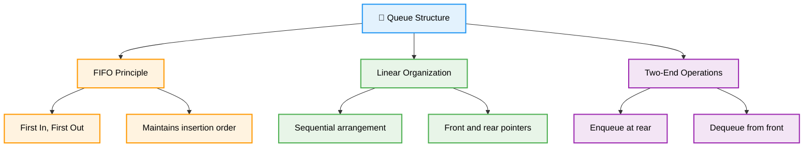
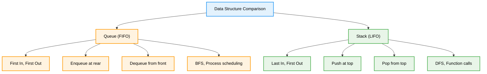
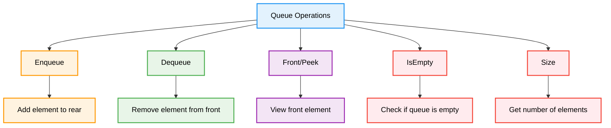
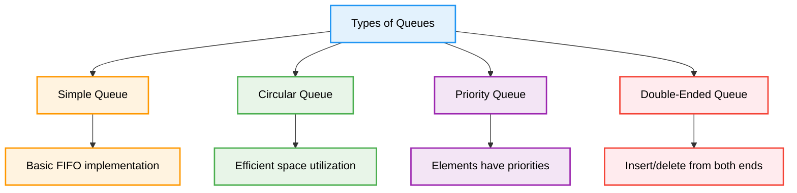
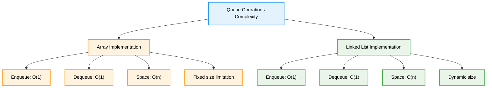
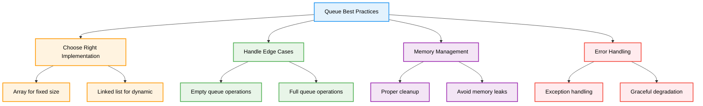

# 🚶 Queues — Complete Professional <div align="center">Guide</div>

<div align="center">


**Master First-In-First-Out data structure for efficient processing**

</div>

---

## 📑 Table of Contents

1. [Introduction](#introduction)
2. [Queue Fundamentals](#queue-fundamentals)
3. [Queue Operations](#queue-operations)
4. [Implementation Methods](#implementation-methods)
5. [Types of Queues](#types-of-queues)
6. [Advanced Applications](#advanced-applications)
7. [Performance Analysis](#performance-analysis)
8. [Best Practices](#best-practices)

---

## Introduction

**Queues** are linear data structures that follow the First-In-First-Out (FIFO) principle. Elements are added at the rear (enqueue) and removed from the front (dequeue), making them perfect for scenarios where order of processing matters.

<div align="center">

</div>

### Core Concept



---

## Queue Fundamentals

### How Queue Works

<div align="center">

</div>

### FIFO vs LIFO Comparison

<div align="center">

</div>

### Queue vs Stack



---

## Queue Operations

### Basic Operations



---

## Implementation Methods

### Array-Based Queue

```cpp
template<typename T>
class ArrayQueue {
private:
    T* arr;
    int front;
    int rear;
    int capacity;
    int size;
    
public:
    ArrayQueue(int cap) : capacity(cap), front(0), rear(-1), size(0) {
        arr = new T[capacity];
    }
    
    // Enqueue operation
    void enqueue(T item) {
        if (isFull()) {
            throw overflow_error("Queue is full");
        }
        
        rear = (rear + 1) % capacity;
        arr[rear] = item;
        size++;
    }
    
    // Dequeue operation
    T dequeue() {
        if (isEmpty()) {
            throw underflow_error("Queue is empty");
        }
        
        T item = arr[front];
        front = (front + 1) % capacity;
        size--;
        return item;
    }
    
    // Peek front element
    T peek() const {
        if (isEmpty()) {
            throw underflow_error("Queue is empty");
        }
        return arr[front];
    }
    
    // Utility functions
    bool isEmpty() const { return size == 0; }
    bool isFull() const { return size == capacity; }
    int getSize() const { return size; }
    
    // Display queue
    void display() const {
        if (isEmpty()) {
            cout << "Queue is empty" << endl;
            return;
        }
        
        cout << "Queue: ";
        for (int i = 0; i < size; i++) {
            int index = (front + i) % capacity;
            cout << arr[index];
            if (i < size - 1) cout << " <- ";
        }
        cout << endl;
    }
    
    ~ArrayQueue() {
        delete[] arr;
    }
};
```

### Linked List-Based Queue

```cpp
template<typename T>
class LinkedQueue {
private:
    struct Node {
        T data;
        Node* next;
        
        Node(T value) : data(value), next(nullptr) {}
    };
    
    Node* front;
    Node* rear;
    int size;
    
public:
    LinkedQueue() : front(nullptr), rear(nullptr), size(0) {}
    
    // Enqueue operation
    void enqueue(T item) {
        Node* newNode = new Node(item);
        
        if (isEmpty()) {
            front = rear = newNode;
        } else {
            rear->next = newNode;
            rear = newNode;
        }
        size++;
    }
    
    // Dequeue operation
    T dequeue() {
        if (isEmpty()) {
            throw underflow_error("Queue is empty");
        }
        
        Node* temp = front;
        T item = front->data;
        
        front = front->next;
        if (front == nullptr) {
            rear = nullptr;
        }
        
        delete temp;
        size--;
        return item;
    }
    
    // Peek front element
    T peek() const {
        if (isEmpty()) {
            throw underflow_error("Queue is empty");
        }
        return front->data;
    }
    
    // Utility functions
    bool isEmpty() const { return front == nullptr; }
    int getSize() const { return size; }
    
    // Display queue
    void display() const {
        if (isEmpty()) {
            cout << "Queue is empty" << endl;
            return;
        }
        
        cout << "Queue: ";
        Node* current = front;
        while (current) {
            cout << current->data;
            if (current->next) cout << " <- ";
            current = current->next;
        }
        cout << endl;
    }
    
    ~LinkedQueue() {
        while (!isEmpty()) {
            dequeue();
        }
    }
};
```

---

## Types of Queues

### Queue Variants



### Circular Queue Implementation

```cpp
template<typename T>
class CircularQueue {
private:
    T* arr;
    int front;
    int rear;
    int capacity;
    int size;
    
public:
    CircularQueue(int cap) : capacity(cap), front(0), rear(0), size(0) {
        arr = new T[capacity];
    }
    
    void enqueue(T item) {
        if (isFull()) {
            throw overflow_error("Queue is full");
        }
        
        arr[rear] = item;
        rear = (rear + 1) % capacity;
        size++;
    }
    
    T dequeue() {
        if (isEmpty()) {
            throw underflow_error("Queue is empty");
        }
        
        T item = arr[front];
        front = (front + 1) % capacity;
        size--;
        return item;
    }
    
    bool isEmpty() const { return size == 0; }
    bool isFull() const { return size == capacity; }
    int getSize() const { return size; }
    
    ~CircularQueue() {
        delete[] arr;
    }
};
```

### Priority Queue Implementation

```cpp
template<typename T>
class PriorityQueue {
private:
    struct Element {
        T data;
        int priority;
        
        Element(T d, int p) : data(d), priority(p) {}
        
        bool operator<(const Element& other) const {
            return priority > other.priority; // Higher priority first
        }
    };
    
    vector<Element> heap;
    
    void heapifyUp(int index) {
        while (index > 0) {
            int parent = (index - 1) / 2;
            if (heap[index] < heap[parent]) {
                swap(heap[index], heap[parent]);
                index = parent;
            } else {
                break;
            }
        }
    }
    
    void heapifyDown(int index) {
        int size = heap.size();
        while (2 * index + 1 < size) {
            int leftChild = 2 * index + 1;
            int rightChild = 2 * index + 2;
            int smallest = index;
            
            if (leftChild < size && heap[leftChild] < heap[smallest]) {
                smallest = leftChild;
            }
            
            if (rightChild < size && heap[rightChild] < heap[smallest]) {
                smallest = rightChild;
            }
            
            if (smallest != index) {
                swap(heap[index], heap[smallest]);
                index = smallest;
            } else {
                break;
            }
        }
    }
    
public:
    void enqueue(T item, int priority) {
        heap.emplace_back(item, priority);
        heapifyUp(heap.size() - 1);
    }
    
    T dequeue() {
        if (isEmpty()) {
            throw underflow_error("Priority queue is empty");
        }
        
        T item = heap[0].data;
        heap[0] = heap.back();
        heap.pop_back();
        
        if (!heap.empty()) {
            heapifyDown(0);
        }
        
        return item;
    }
    
    bool isEmpty() const { return heap.empty(); }
    int getSize() const { return heap.size(); }
};
```

### Double-Ended Queue (Deque)

```cpp
template<typename T>
class Deque {
private:
    struct Node {
        T data;
        Node* next;
        Node* prev;
        
        Node(T value) : data(value), next(nullptr), prev(nullptr) {}
    };
    
    Node* front;
    Node* rear;
    int size;
    
public:
    Deque() : front(nullptr), rear(nullptr), size(0) {}
    
    // Insert at front
    void pushFront(T item) {
        Node* newNode = new Node(item);
        
        if (isEmpty()) {
            front = rear = newNode;
        } else {
            newNode->next = front;
            front->prev = newNode;
            front = newNode;
        }
        size++;
    }
    
    // Insert at rear
    void pushRear(T item) {
        Node* newNode = new Node(item);
        
        if (isEmpty()) {
            front = rear = newNode;
        } else {
            rear->next = newNode;
            newNode->prev = rear;
            rear = newNode;
        }
        size++;
    }
    
    // Remove from front
    T popFront() {
        if (isEmpty()) {
            throw underflow_error("Deque is empty");
        }
        
        Node* temp = front;
        T item = front->data;
        
        front = front->next;
        if (front) {
            front->prev = nullptr;
        } else {
            rear = nullptr;
        }
        
        delete temp;
        size--;
        return item;
    }
    
    // Remove from rear
    T popRear() {
        if (isEmpty()) {
            throw underflow_error("Deque is empty");
        }
        
        Node* temp = rear;
        T item = rear->data;
        
        rear = rear->prev;
        if (rear) {
            rear->next = nullptr;
        } else {
            front = nullptr;
        }
        
        delete temp;
        size--;
        return item;
    }
    
    bool isEmpty() const { return front == nullptr; }
    int getSize() const { return size; }
    
    ~Deque() {
        while (!isEmpty()) {
            popFront();
        }
    }
};
```

---

## Advanced Applications

### Breadth-First Search

```cpp
class BFSApplication {
public:
    static vector<int> bfs(vector<vector<int>>& graph, int start) {
        vector<bool> visited(graph.size(), false);
        vector<int> result;
        queue<int> q;
        
        visited[start] = true;
        q.push(start);
        
        while (!q.empty()) {
            int current = q.front();
            q.pop();
            result.push_back(current);
            
            for (int neighbor : graph[current]) {
                if (!visited[neighbor]) {
                    visited[neighbor] = true;
                    q.push(neighbor);
                }
            }
        }
        
        return result;
    }
};
```

### Level Order Traversal

```cpp
class TreeTraversal {
public:
    struct TreeNode {
        int val;
        TreeNode* left;
        TreeNode* right;
        TreeNode(int x) : val(x), left(nullptr), right(nullptr) {}
    };
    
    static vector<vector<int>> levelOrder(TreeNode* root) {
        vector<vector<int>> result;
        if (!root) return result;
        
        queue<TreeNode*> q;
        q.push(root);
        
        while (!q.empty()) {
            int levelSize = q.size();
            vector<int> currentLevel;
            
            for (int i = 0; i < levelSize; i++) {
                TreeNode* node = q.front();
                q.pop();
                currentLevel.push_back(node->val);
                
                if (node->left) q.push(node->left);
                if (node->right) q.push(node->right);
            }
            
            result.push_back(currentLevel);
        }
        
        return result;
    }
};
```

### Process Scheduling

```cpp
class ProcessScheduler {
private:
    struct Process {
        int id;
        int burstTime;
        int arrivalTime;
        int priority;
        
        Process(int i, int bt, int at, int p = 0) 
            : id(i), burstTime(bt), arrivalTime(at), priority(p) {}
    };
    
public:
    // First Come First Serve (FCFS)
    static vector<int> fcfsScheduling(vector<Process>& processes) {
        queue<Process> readyQueue;
        vector<int> executionOrder;
        
        // Sort by arrival time
        sort(processes.begin(), processes.end(), 
             [](const Process& a, const Process& b) {
                 return a.arrivalTime < b.arrivalTime;
             });
        
        for (const Process& p : processes) {
            readyQueue.push(p);
        }
        
        while (!readyQueue.empty()) {
            Process current = readyQueue.front();
            readyQueue.pop();
            executionOrder.push_back(current.id);
        }
        
        return executionOrder;
    }
    
    // Round Robin Scheduling
    static vector<int> roundRobinScheduling(vector<Process> processes, int timeQuantum) {
        queue<Process> readyQueue;
        vector<int> executionOrder;
        
        for (Process& p : processes) {
            readyQueue.push(p);
        }
        
        while (!readyQueue.empty()) {
            Process current = readyQueue.front();
            readyQueue.pop();
            
            executionOrder.push_back(current.id);
            
            if (current.burstTime > timeQuantum) {
                current.burstTime -= timeQuantum;
                readyQueue.push(current); // Re-queue for remaining time
            }
        }
        
        return executionOrder;
    }
};
```

---

## Performance Analysis

### Time Complexity



### Space Complexity Analysis

| Implementation | Space Complexity | Pros | Cons |
|----------------|------------------|------|------|
| **Array-based** | O(n) | Cache-friendly, simple | Fixed size, memory waste |
| **Linked List** | O(n) | Dynamic size, no waste | Extra pointer overhead |
| **Circular Array** | O(n) | Efficient space usage | Complex index management |
| **STL Queue** | O(n) | Optimized, tested | Less control over implementation |

---

## Best Practices

### Implementation Guidelines



### Common Pitfalls and Solutions

```cpp
class QueueBestPractices {
public:
    // ❌ Not checking for empty queue
    void badDequeue(queue<int>& q) {
        int item = q.front(); // May crash if empty!
        q.pop();
    }
    
    // ✅ Proper empty check
    int goodDequeue(queue<int>& q) {
        if (q.empty()) {
            throw underflow_error("Queue is empty");
        }
        
        int item = q.front();
        q.pop();
        return item;
    }
    
    // ❌ Memory leak in linked implementation
    void badCleanup(Node* front) {
        front = nullptr; // Memory leak!
    }
    
    // ✅ Proper cleanup
    void goodCleanup(Node*& front) {
        while (front) {
            Node* temp = front;
            front = front->next;
            delete temp;
        }
    }
    
    // ✅ Using STL queue safely
    void safeSTLUsage() {
        queue<int> q;
        
        // Safe operations
        q.push(10);
        q.push(20);
        
        while (!q.empty()) {
            cout << q.front() << " ";
            q.pop();
        }
    }
};
```

### When to Use Each Queue Type

| Queue Type | Use Case | Example |
|------------|----------|---------|
| **Simple Queue** | Basic FIFO processing | Print job queue |
| **Circular Queue** | Fixed-size buffer | Ring buffer for streaming |
| **Priority Queue** | Priority-based processing | Task scheduling |
| **Deque** | Both-end operations | Sliding window problems |

---

## Summary

**Queues** provide efficient FIFO processing essential for many algorithms and applications. Key insights:

### Essential Concepts
- **FIFO Principle**: First element in is first element out
- **Two-End Operations**: Enqueue at rear, dequeue from front
- **Linear Structure**: Sequential organization with front/rear pointers
- **Order Preservation**: Maintains insertion order

### Core Applications
- **Graph Algorithms**: BFS traversal and shortest path
- **Tree Processing**: Level-order traversal
- **System Design**: Process scheduling, task queues
- **Buffering**: Data streaming and communication

### Best Practices
- Choose implementation based on size requirements
- Always check for empty/full conditions
- Handle memory management properly
- Use appropriate queue variant for specific needs

> **Master's Insight**: Queues are fundamental to fair processing systems where order matters. They're the backbone of scheduling, buffering, and breadth-first exploration algorithms.

---

<div align="center">

**🚶 Master Queue Data Structure • Implement FIFO Processing • Build Efficient Systems**

*From Theory to Practice • Order to Processing • Understanding to Mastery*

</div>