# 🎲 Randomized Algorithms — Complete Professional <div align="center">Guide</div>

<div align="center">


**Master probabilistic algorithms for efficient and robust solutions**

</div>

---

## 📑 Table of Contents

1. [Introduction](#introduction)
2. [Types of Randomized Algorithms](#types-of-randomized-algorithms)
3. [Deterministic vs Randomized](#deterministic-vs-randomized)
4. [Monte Carlo Algorithms](#monte-carlo-algorithms)
5. [Las Vegas Algorithms](#las-vegas-algorithms)
6. [Randomized Data Structures](#randomized-data-structures)
7. [Applications](#applications)
8. [Best Practices](#best-practices)

---

## Introduction

**Randomized Algorithms** use random choices during their execution to make decisions. They often provide simpler implementations, better average-case performance, or solutions to problems that are difficult to solve deterministically.

<div align="center">

</div>

### Core Concept

```mermaid
flowchart TD
    A["🎲 Randomized Algorithms"] --> B["Random Choices"]
    A --> C["Probabilistic Analysis"]
    A --> D["Expected Performance"]
    
    B --> E["Use random numbers"]
    B --> F["Non-deterministic decisions"]
    
    C --> G["Probability theory"]
    C --> H["Statistical guarantees"]
    
    D --> I["Average-case complexity"]
    D --> J["High probability bounds"]
    
    classDef default fill:#f9f9f9,stroke:#333,stroke-width:2px,color:#000
    classDef algorithms fill:#e3f2fd,stroke:#2196f3,stroke-width:2px,color:#000
    classDef random fill:#fff3e0,stroke:#ff9800,stroke-width:2px,color:#000
    classDef probabilistic fill:#e8f5e8,stroke:#4caf50,stroke-width:2px,color:#000
    classDef performance fill:#f3e5f5,stroke:#9c27b0,stroke-width:2px,color:#000
    class A algorithms
    class B,E,F random
    class C,G,H probabilistic
    class D,I,J performance
```



---

## Types of Randomized Algorithms

<div align="center">

</div>

### Algorithm Classification


---

## Deterministic vs Randomized

<div align="center">

</div>

### Comparison Analysis

```mermaid
flowchart TD
    A["Algorithm Comparison"] --> B["Deterministic"]
    A --> C["Randomized"]
    
    B --> D["Same input → Same output"]
    B --> E["Predictable behavior"]
    B --> F["Worst-case analysis"]
    B --> G["May be complex"]
    
    C --> H["Same input → Different outputs"]
    C --> I["Probabilistic behavior"]
    C --> J["Expected-case analysis"]
    C --> K["Often simpler"]
    
    classDef default fill:#f9f9f9,stroke:#333,stroke-width:2px,color:#000
    classDef comparison fill:#e3f2fd,stroke:#2196f3,stroke-width:2px,color:#000
    classDef deterministic fill:#fff3e0,stroke:#ff9800,stroke-width:2px,color:#000
    classDef randomized fill:#e8f5e8,stroke:#4caf50,stroke-width:2px,color:#000
    class A comparison
    class B,D,E,F,G deterministic
    class C,H,I,J,K randomized
```



### Advantages and Disadvantages

| Aspect | Deterministic | Randomized |
|--------|---------------|------------|
| **Predictability** | ✅ Always same result | ❌ Results may vary |
| **Simplicity** | ❌ Often complex | ✅ Usually simpler |
| **Performance** | ❌ Worst-case bound | ✅ Expected-case bound |
| **Debugging** | ✅ Reproducible | ❌ Hard to reproduce |
| **Analysis** | ✅ Straightforward | ❌ Requires probability |

---

## Monte Carlo Algorithms

### Characteristics



```mermaid
flowchart TD
    A["Monte Carlo Algorithms"] --> B["Fast Execution"]
    A --> C["Probabilistic Correctness"]
    A --> D["Error Bounds"]
    
    B --> E["Fixed running time"]
    C --> F["May produce wrong answer"]
    D --> G["Error probability ≤ ε"]
    
    classDef default fill:#f9f9f9,stroke:#333,stroke-width:2px,color:#000
    classDef monte fill:#e3f2fd,stroke:#2196f3,stroke-width:2px,color:#000
    classDef fast fill:#fff3e0,stroke:#ff9800,stroke-width:2px,color:#000
    classDef probabilistic fill:#e8f5e8,stroke:#4caf50,stroke-width:2px,color:#000
    classDef error fill:#f3e5f5,stroke:#9c27b0,stroke-width:2px,color:#000
    class A monte
    class B,E fast
    class C,F probabilistic
    class D,G error
```

### Monte Carlo Examples

```cpp
class MonteCarloAlgorithms {
public:
    // Monte Carlo Pi Estimation
    static double estimatePi(int iterations) {
        int insideCircle = 0;
        
        for (int i = 0; i < iterations; i++) {
            double x = (double)rand() / RAND_MAX;
            double y = (double)rand() / RAND_MAX;
            
            if (x * x + y * y <= 1.0) {
                insideCircle++;
            }
        }
        
        return 4.0 * insideCircle / iterations;
    }
    
    // Monte Carlo Integration
    static double integrate(function<double(double)> f, double a, double b, int samples) {
        double sum = 0.0;
        
        for (int i = 0; i < samples; i++) {
            double x = a + (b - a) * ((double)rand() / RAND_MAX);
            sum += f(x);
        }
        
        return (b - a) * sum / samples;
    }
    
    // Randomized Primality Test (Miller-Rabin)
    static bool isPrimeMonteCarlo(long long n, int k = 5) {
        if (n < 2) return false;
        if (n == 2 || n == 3) return true;
        if (n % 2 == 0) return false;
        
        // Write n-1 as d * 2^r
        long long d = n - 1;
        int r = 0;
        while (d % 2 == 0) {
            d /= 2;
            r++;
        }
        
        // Perform k rounds of testing
        for (int i = 0; i < k; i++) {
            long long a = 2 + rand() % (n - 3);
            long long x = fastPower(a, d, n);
            
            if (x == 1 || x == n - 1) continue;
            
            bool composite = true;
            for (int j = 0; j < r - 1; j++) {
                x = (x * x) % n;
                if (x == n - 1) {
                    composite = false;
                    break;
                }
            }
            
            if (composite) return false;
        }
        
        return true;
    }
    
    // Monte Carlo Matrix Multiplication Verification
    static bool verifyMatrixMultiplication(const vector<vector<int>>& A,
                                         const vector<vector<int>>& B,
                                         const vector<vector<int>>& C) {
        int n = A.size();
        
        // Generate random vector r
        vector<int> r(n);
        for (int i = 0; i < n; i++) {
            r[i] = rand() % 2;
        }
        
        // Compute A(Br) and Cr
        vector<int> Br(n, 0);
        vector<int> Cr(n, 0);
        
        // Br = B * r
        for (int i = 0; i < n; i++) {
            for (int j = 0; j < n; j++) {
                Br[i] += B[i][j] * r[j];
            }
        }
        
        // Cr = C * r
        for (int i = 0; i < n; i++) {
            for (int j = 0; j < n; j++) {
                Cr[i] += C[i][j] * r[j];
            }
        }
        
        // ABr = A * Br
        vector<int> ABr(n, 0);
        for (int i = 0; i < n; i++) {
            for (int j = 0; j < n; j++) {
                ABr[i] += A[i][j] * Br[j];
            }
        }
        
        // Check if ABr == Cr
        return ABr == Cr;
    }
    
private:
    static long long fastPower(long long base, long long exp, long long mod) {
        long long result = 1;
        base %= mod;
        
        while (exp > 0) {
            if (exp & 1) {
                result = (result * base) % mod;
            }
            base = (base * base) % mod;
            exp >>= 1;
        }
        
        return result;
    }
};
```

---

## Las Vegas Algorithms

### Characteristics


### Las Vegas Examples

```cpp
class LasVegasAlgorithms {
public:
    // Randomized QuickSort
    static void randomizedQuickSort(vector<int>& arr, int low, int high) {
        if (low < high) {
            // Randomly choose pivot
            int randomIndex = low + rand() % (high - low + 1);
            swap(arr[randomIndex], arr[high]);
            
            int pi = partition(arr, low, high);
            randomizedQuickSort(arr, low, pi - 1);
            randomizedQuickSort(arr, pi + 1, high);
        }
    }
    
    // Randomized Selection (QuickSelect)
    static int randomizedSelect(vector<int>& arr, int low, int high, int k) {
        if (low == high) {
            return arr[low];
        }
        
        // Randomly choose pivot
        int randomIndex = low + rand() % (high - low + 1);
        swap(arr[randomIndex], arr[high]);
        
        int pi = partition(arr, low, high);
        int rank = pi - low + 1;
        
        if (k == rank) {
            return arr[pi];
        } else if (k < rank) {
            return randomizedSelect(arr, low, pi - 1, k);
        } else {
            return randomizedSelect(arr, pi + 1, high, k - rank);
        }
    }
    
    // Random Sampling
    static vector<int> randomSample(const vector<int>& population, int sampleSize) {
        vector<int> sample;
        vector<int> indices(population.size());
        iota(indices.begin(), indices.end(), 0);
        
        for (int i = 0; i < sampleSize && i < population.size(); i++) {
            int randomIndex = i + rand() % (population.size() - i);
            swap(indices[i], indices[randomIndex]);
            sample.push_back(population[indices[i]]);
        }
        
        return sample;
    }
    
    // Randomized Binary Search Tree
    class RandomizedBST {
    private:
        struct Node {
            int key;
            int size;
            Node* left;
            Node* right;
            
            Node(int k) : key(k), size(1), left(nullptr), right(nullptr) {}
        };
        
        Node* root;
        
        int getSize(Node* node) {
            return node ? node->size : 0;
        }
        
        void updateSize(Node* node) {
            if (node) {
                node->size = 1 + getSize(node->left) + getSize(node->right);
            }
        }
        
        Node* insertAtRoot(Node* node, int key) {
            if (!node) return new Node(key);
            
            if (key < node->key) {
                node->left = insertAtRoot(node->left, key);
                node = rotateRight(node);
            } else {
                node->right = insertAtRoot(node->right, key);
                node = rotateLeft(node);
            }
            
            return node;
        }
        
        Node* rotateRight(Node* node) {
            Node* newRoot = node->left;
            node->left = newRoot->right;
            newRoot->right = node;
            updateSize(node);
            updateSize(newRoot);
            return newRoot;
        }
        
        Node* rotateLeft(Node* node) {
            Node* newRoot = node->right;
            node->right = newRoot->left;
            newRoot->left = node;
            updateSize(node);
            updateSize(newRoot);
            return newRoot;
        }
        
        Node* insert(Node* node, int key) {
            if (!node) return new Node(key);
            
            // Random decision: insert at root with probability 1/(size+1)
            if (rand() % (getSize(node) + 1) == 0) {
                return insertAtRoot(node, key);
            }
            
            if (key < node->key) {
                node->left = insert(node->left, key);
            } else {
                node->right = insert(node->right, key);
            }
            
            updateSize(node);
            return node;
        }
        
    public:
        RandomizedBST() : root(nullptr) {}
        
        void insert(int key) {
            root = insert(root, key);
        }
    };
    
private:
    static int partition(vector<int>& arr, int low, int high) {
        int pivot = arr[high];
        int i = low - 1;
        
        for (int j = low; j < high; j++) {
            if (arr[j] <= pivot) {
                i++;
                swap(arr[i], arr[j]);
            }
        }
        
        swap(arr[i + 1], arr[high]);
        return i + 1;
    }
};
```

---

## Randomized Data Structures

### Skip Lists

```cpp
class SkipList {
private:
    struct Node {
        int value;
        vector<Node*> forward;
        
        Node(int val, int level) : value(val), forward(level + 1, nullptr) {}
    };
    
    Node* header;
    int maxLevel;
    int currentLevel;
    double probability;
    
    int randomLevel() {
        int level = 0;
        while ((double)rand() / RAND_MAX < probability && level < maxLevel) {
            level++;
        }
        return level;
    }
    
public:
    SkipList(int maxLvl = 16, double p = 0.5) 
        : maxLevel(maxLvl), currentLevel(0), probability(p) {
        header = new Node(-1, maxLevel);
    }
    
    void insert(int value) {
        vector<Node*> update(maxLevel + 1);
        Node* current = header;
        
        // Find position to insert
        for (int i = currentLevel; i >= 0; i--) {
            while (current->forward[i] && current->forward[i]->value < value) {
                current = current->forward[i];
            }
            update[i] = current;
        }
        
        current = current->forward[0];
        
        if (!current || current->value != value) {
            int newLevel = randomLevel();
            
            if (newLevel > currentLevel) {
                for (int i = currentLevel + 1; i <= newLevel; i++) {
                    update[i] = header;
                }
                currentLevel = newLevel;
            }
            
            Node* newNode = new Node(value, newLevel);
            
            for (int i = 0; i <= newLevel; i++) {
                newNode->forward[i] = update[i]->forward[i];
                update[i]->forward[i] = newNode;
            }
        }
    }
    
    bool search(int value) {
        Node* current = header;
        
        for (int i = currentLevel; i >= 0; i--) {
            while (current->forward[i] && current->forward[i]->value < value) {
                current = current->forward[i];
            }
        }
        
        current = current->forward[0];
        return current && current->value == value;
    }
};
```

### Bloom Filters

```cpp
class BloomFilter {
private:
    vector<bool> bitArray;
    int size;
    int numHashes;
    
    vector<int> getHashes(const string& item) {
        vector<int> hashes;
        hash<string> hasher;
        
        for (int i = 0; i < numHashes; i++) {
            int hashValue = hasher(item + to_string(i)) % size;
            hashes.push_back(hashValue);
        }
        
        return hashes;
    }
    
public:
    BloomFilter(int s, int k) : size(s), numHashes(k) {
        bitArray.assign(size, false);
    }
    
    void add(const string& item) {
        vector<int> hashes = getHashes(item);
        for (int hash : hashes) {
            bitArray[hash] = true;
        }
    }
    
    bool mightContain(const string& item) {
        vector<int> hashes = getHashes(item);
        for (int hash : hashes) {
            if (!bitArray[hash]) {
                return false;
            }
        }
        return true;
    }
    
    double falsePositiveRate() {
        int setBits = count(bitArray.begin(), bitArray.end(), true);
        double ratio = (double)setBits / size;
        return pow(ratio, numHashes);
    }
};
```

---

## Applications

### Real-World Applications

```mermaid
flowchart TD
    A["🎲 Randomized Applications"] --> B["Cryptography"]
    A --> C["Load Balancing"]
    A --> D["Sampling"]
    A --> E["Game Theory"]
    A --> F["Machine Learning"]
    
    B --> G["Key generation, encryption"]
    C --> H["Consistent hashing"]
    D --> I["Statistical analysis"]
    E --> J["Mixed strategies"]
    F --> K["Stochastic algorithms"]
    
    classDef default fill:#f9f9f9,stroke:#333,stroke-width:2px,color:#000
    classDef applications fill:#e3f2fd,stroke:#2196f3,stroke-width:2px,color:#000
    classDef crypto fill:#fff3e0,stroke:#ff9800,stroke-width:2px,color:#000
    classDef load fill:#e8f5e8,stroke:#4caf50,stroke-width:2px,color:#000
    classDef sampling fill:#f3e5f5,stroke:#9c27b0,stroke-width:2px,color:#000
    classDef game fill:#ffebee,stroke:#f44336,stroke-width:2px,color:#000
    classDef ml fill:#e0f2f1,stroke:#009688,stroke-width:2px,color:#000
    class A applications
    class B,G crypto
    class C,H load
    class D,I sampling
    class E,J game
    class F,K ml
```



### Practical Examples

```cpp
class RandomizedApplications {
public:
    // Load Balancing with Random Choice
    static int randomLoadBalancer(const vector<int>& serverLoads) {
        // Choose two random servers and pick the less loaded one
        int server1 = rand() % serverLoads.size();
        int server2 = rand() % serverLoads.size();
        
        return (serverLoads[server1] <= serverLoads[server2]) ? server1 : server2;
    }
    
    // Reservoir Sampling
    static vector<int> reservoirSampling(const vector<int>& stream, int k) {
        vector<int> reservoir(k);
        
        // Fill reservoir with first k elements
        for (int i = 0; i < k && i < stream.size(); i++) {
            reservoir[i] = stream[i];
        }
        
        // Process remaining elements
        for (int i = k; i < stream.size(); i++) {
            int j = rand() % (i + 1);
            if (j < k) {
                reservoir[j] = stream[i];
            }
        }
        
        return reservoir;
    }
    
    // Randomized Caching (Random Replacement)
    class RandomCache {
    private:
        unordered_map<int, int> cache;
        vector<int> keys;
        int capacity;
        
    public:
        RandomCache(int cap) : capacity(cap) {}
        
        int get(int key) {
            if (cache.find(key) != cache.end()) {
                return cache[key];
            }
            return -1;
        }
        
        void put(int key, int value) {
            if (cache.find(key) != cache.end()) {
                cache[key] = value;
                return;
            }
            
            if (cache.size() >= capacity) {
                // Random eviction
                int randomIndex = rand() % keys.size();
                int evictKey = keys[randomIndex];
                cache.erase(evictKey);
                keys.erase(keys.begin() + randomIndex);
            }
            
            cache[key] = value;
            keys.push_back(key);
        }
    };
};
```

---

## Best Practices

### Implementation Guidelines


### Common Pitfalls and Solutions

```cpp
class RandomizedBestPractices {
public:
    // ❌ Poor random number generation
    void badRandomness() {
        srand(1); // Fixed seed
        int random = rand() % 10; // Poor distribution
    }
    
    // ✅ Better random number generation
    void goodRandomness() {
        random_device rd;
        mt19937 gen(rd());
        uniform_int_distribution<> dis(0, 9);
        int random = dis(gen);
    }
    
    // ❌ Not handling error probability
    bool badMonteCarloTest(int n) {
        return isPrimeMonteCarlo(n, 1); // Too few iterations
    }
    
    // ✅ Proper error probability management
    bool goodMonteCarloTest(int n, double errorBound = 1e-6) {
        int iterations = ceil(log(errorBound) / log(0.25)); // Calculate needed iterations
        return isPrimeMonteCarlo(n, iterations);
    }
    
    // ✅ Amplification technique
    bool amplifiedMonteCarloTest(int n, int rounds = 10) {
        int successes = 0;
        for (int i = 0; i < rounds; i++) {
            if (isPrimeMonteCarlo(n, 5)) {
                successes++;
            }
        }
        return successes > rounds / 2; // Majority vote
    }
    
private:
    bool isPrimeMonteCarlo(int n, int k) {
        // Implementation from earlier
        return true; // Placeholder
    }
};
```

### Performance Comparison

| Algorithm Type | Time Complexity | Correctness | Use Case |
|----------------|-----------------|-------------|----------|
| **Deterministic** | Worst-case bound | Always correct | Critical systems |
| **Monte Carlo** | Fixed time | Probabilistic | Approximation problems |
| **Las Vegas** | Expected time | Always correct | When correctness is crucial |
| **Atlantic City** | Bounded expected | High probability | Practical applications |

---

## Summary

**Randomized Algorithms** leverage probability to achieve simplicity, efficiency, and robustness. Key insights:

### Essential Concepts
- **Random Choices**: Use randomness to make algorithmic decisions
- **Probabilistic Analysis**: Analyze expected performance and error bounds
- **Algorithm Types**: Monte Carlo (fast, small error) vs Las Vegas (correct, random time)
- **Trade-offs**: Balance between time, correctness, and simplicity

### Core Applications
- **Sorting and Selection**: Randomized QuickSort and QuickSelect
- **Primality Testing**: Miller-Rabin probabilistic test
- **Data Structures**: Skip lists, Bloom filters, randomized BSTs
- **Sampling**: Reservoir sampling, random sampling techniques

### Best Practices
- Use high-quality random number generators
- Analyze and bound error probabilities
- Apply amplification techniques when needed
- Test algorithms statistically across multiple runs

> **Master's Insight**: Randomized algorithms often provide elegant solutions to complex problems by trading deterministic guarantees for simplicity and expected good performance. They're particularly powerful when exact solutions are difficult or unnecessary.

---

<div align="center">

**🎲 Master Randomized Algorithms • Embrace Probability • Build Robust Solutions**

*From Theory to Practice • Randomness to Efficiency • Understanding to Mastery*

</div>