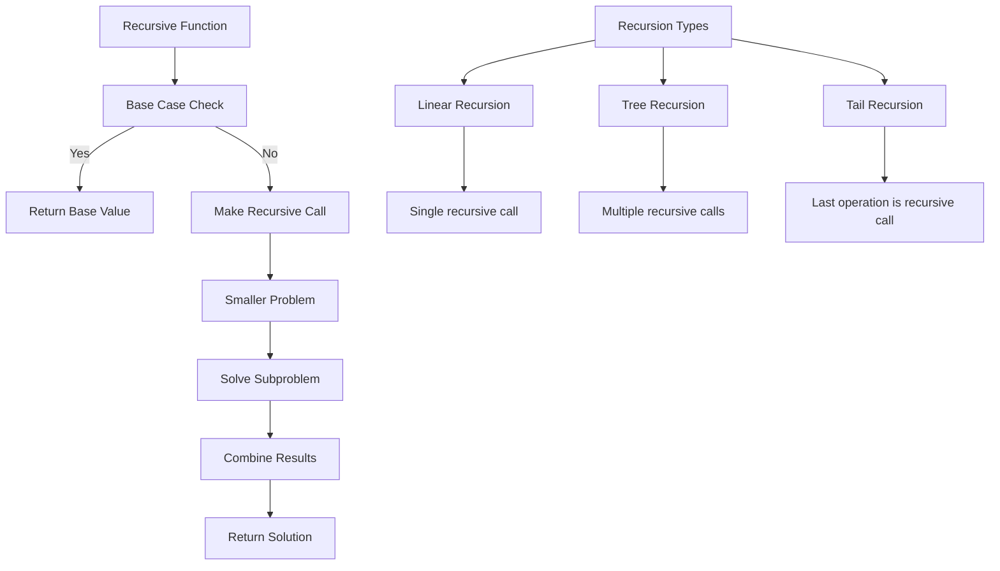
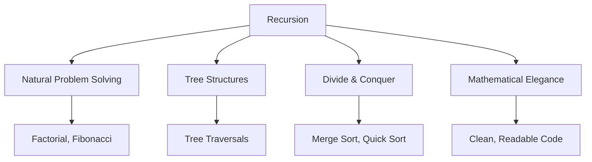
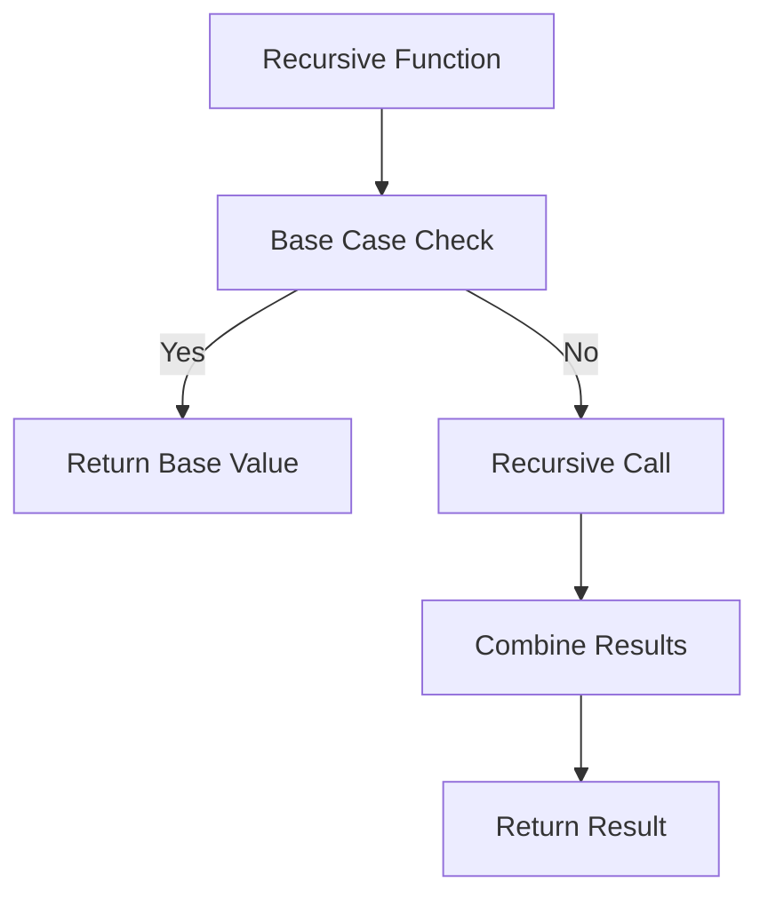
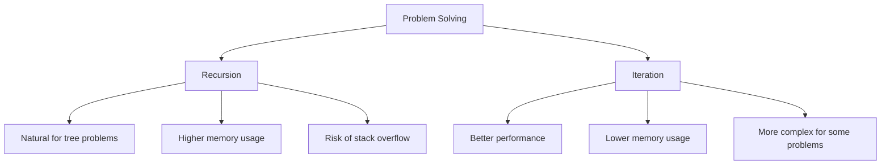

# 🔁 Recursion — Complete Professional Guide

<div align="center">


*Master the art of solving problems by breaking them into smaller versions of themselves*

</div>

---

## 📑 Table of Contents

1. [Introduction](#-introduction)
2. [Recursion Fundamentals](#-recursion-fundamentals)
3. [Types of Recursion](#-types-of-recursion)
4. [Classic Problems](#-classic-problems)
5. [Tree Recursion](#-tree-recursion)
6. [Optimization Techniques](#-optimization-techniques)
7. [Recursion vs Iteration](#-recursion-vs-iteration)
8. [Best Practices](#-best-practices)

---

## 🎯 Introduction

**Recursion** is a programming technique where a function calls itself to solve smaller instances of the same problem.

## 📊 Recursion Visualization Gallery

<div align="center">


</div>

### 🌊 Recursion Flow



### 🔑 Why Study Recursion?



### 📊 Recursion Components

| Component | Description | Example |
|:----------|:------------|:--------|
| **Base Case** | Stopping condition | `if (n == 0) return 1;` |
| **Recursive Case** | Function calls itself | `return n * factorial(n-1);` |
| **Progress** | Moving toward base case | `n` decreases each call |

---

## 🏗️ Recursion Fundamentals

### 🎯 Anatomy of Recursion



### 💻 Basic Examples

```cpp
// Simple Factorial
int factorial(int n) {
    // Base case
    if (n <= 1) {
        return 1;
    }
    
    // Recursive case
    return n * factorial(n - 1);
}

// Fibonacci Sequence
int fibonacci(int n) {
    // Base cases
    if (n <= 1) {
        return n;
    }
    
    // Recursive case
    return fibonacci(n - 1) + fibonacci(n - 2);
}

// Power Function
double power(double base, int exp) {
    // Base case
    if (exp == 0) {
        return 1.0;
    }
    
    // Handle negative exponents
    if (exp < 0) {
        return 1.0 / power(base, -exp);
    }
    
    // Recursive case
    return base * power(base, exp - 1);
}
```

### 🔧 Recursion Stack Visualization

```cpp
// Tracing factorial(4)
/*
factorial(4)
├── 4 * factorial(3)
    ├── 3 * factorial(2)
        ├── 2 * factorial(1)
            ├── 1 (base case)
        ├── 2 * 1 = 2
    ├── 3 * 2 = 6
├── 4 * 6 = 24
*/

class RecursionTracer {
public:
    int factorialWithTrace(int n, int depth = 0) {
        string indent(depth * 2, ' ');
        cout << indent << "factorial(" << n << ")" << endl;
        
        if (n <= 1) {
            cout << indent << "-> " << 1 << " (base case)" << endl;
            return 1;
        }
        
        int result = n * factorialWithTrace(n - 1, depth + 1);
        cout << indent << "-> " << result << endl;
        return result;
    }
};
```

---

## 🎨 Types of Recursion

### 🎯 Linear Recursion

```cpp
// Single recursive call per function execution
class LinearRecursion {
public:
    // Sum of array elements
    int arraySum(vector<int>& arr, int index = 0) {
        if (index >= arr.size()) {
            return 0;
        }
        
        return arr[index] + arraySum(arr, index + 1);
    }
    
    // Reverse string
    string reverseString(const string& str, int start = 0) {
        if (start >= str.length()) {
            return "";
        }
        
        return reverseString(str, start + 1) + str[start];
    }
    
    // Binary search
    int binarySearch(vector<int>& arr, int target, int left, int right) {
        if (left > right) {
            return -1;
        }
        
        int mid = left + (right - left) / 2;
        
        if (arr[mid] == target) {
            return mid;
        } else if (arr[mid] > target) {
            return binarySearch(arr, target, left, mid - 1);
        } else {
            return binarySearch(arr, target, mid + 1, right);
        }
    }
};
```

### 🎯 Tree Recursion

```cpp
// Multiple recursive calls per function execution
class TreeRecursion {
public:
    // Fibonacci (inefficient version)
    int fibonacci(int n) {
        if (n <= 1) return n;
        
        return fibonacci(n - 1) + fibonacci(n - 2);
    }
    
    // Tower of Hanoi
    void towerOfHanoi(int n, char from, char to, char aux) {
        if (n == 1) {
            cout << "Move disk 1 from " << from << " to " << to << endl;
            return;
        }
        
        towerOfHanoi(n - 1, from, aux, to);
        cout << "Move disk " << n << " from " << from << " to " << to << endl;
        towerOfHanoi(n - 1, aux, to, from);
    }
    
    // Generate all subsets
    void generateSubsets(vector<int>& nums, int index, 
                        vector<int>& current, vector<vector<int>>& result) {
        if (index == nums.size()) {
            result.push_back(current);
            return;
        }
        
        // Don't include current element
        generateSubsets(nums, index + 1, current, result);
        
        // Include current element
        current.push_back(nums[index]);
        generateSubsets(nums, index + 1, current, result);
        current.pop_back();
    }
};
```

### 🎯 Tail Recursion

```cpp
// Recursive call is the last operation
class TailRecursion {
public:
    // Tail recursive factorial
    int factorialTail(int n, int accumulator = 1) {
        if (n <= 1) {
            return accumulator;
        }
        
        return factorialTail(n - 1, n * accumulator);
    }
    
    // Tail recursive sum
    int sumTail(vector<int>& arr, int index = 0, int accumulator = 0) {
        if (index >= arr.size()) {
            return accumulator;
        }
        
        return sumTail(arr, index + 1, accumulator + arr[index]);
    }
    
    // Tail recursive GCD
    int gcdTail(int a, int b) {
        if (b == 0) {
            return a;
        }
        
        return gcdTail(b, a % b);
    }
};
```

---

## 🎯 Classic Problems

### 🔧 Combinatorial Problems

```cpp
class CombinatorialRecursion {
public:
    // Generate all permutations
    void permute(vector<int>& nums, int start, vector<vector<int>>& result) {
        if (start == nums.size()) {
            result.push_back(nums);
            return;
        }
        
        for (int i = start; i < nums.size(); i++) {
            swap(nums[start], nums[i]);
            permute(nums, start + 1, result);
            swap(nums[start], nums[i]); // backtrack
        }
    }
    
    // N-Queens problem
    bool solveNQueens(vector<string>& board, int row) {
        int n = board.size();
        
        if (row == n) {
            return true; // All queens placed
        }
        
        for (int col = 0; col < n; col++) {
            if (isSafe(board, row, col)) {
                board[row][col] = 'Q';
                
                if (solveNQueens(board, row + 1)) {
                    return true;
                }
                
                board[row][col] = '.'; // backtrack
            }
        }
        
        return false;
    }
    
    // Generate parentheses
    void generateParentheses(int n, string current, int open, int close, 
                           vector<string>& result) {
        if (current.length() == 2 * n) {
            result.push_back(current);
            return;
        }
        
        if (open < n) {
            generateParentheses(n, current + "(", open + 1, close, result);
        }
        
        if (close < open) {
            generateParentheses(n, current + ")", open, close + 1, result);
        }
    }
    
private:
    bool isSafe(const vector<string>& board, int row, int col) {
        int n = board.size();
        
        // Check column
        for (int i = 0; i < row; i++) {
            if (board[i][col] == 'Q') return false;
        }
        
        // Check diagonal
        for (int i = row - 1, j = col - 1; i >= 0 && j >= 0; i--, j--) {
            if (board[i][j] == 'Q') return false;
        }
        
        // Check anti-diagonal
        for (int i = row - 1, j = col + 1; i >= 0 && j < n; i--, j++) {
            if (board[i][j] == 'Q') return false;
        }
        
        return true;
    }
};
```

### 🔧 Mathematical Problems

```cpp
class MathematicalRecursion {
public:
    // Greatest Common Divisor
    int gcd(int a, int b) {
        if (b == 0) return a;
        return gcd(b, a % b);
    }
    
    // Fast exponentiation
    long long fastPower(long long base, long long exp, long long mod) {
        if (exp == 0) return 1;
        
        long long half = fastPower(base, exp / 2, mod);
        half = (half * half) % mod;
        
        if (exp % 2 == 1) {
            half = (half * base) % mod;
        }
        
        return half;
    }
    
    // Catalan numbers
    long long catalan(int n) {
        if (n <= 1) return 1;
        
        long long result = 0;
        for (int i = 0; i < n; i++) {
            result += catalan(i) * catalan(n - 1 - i);
        }
        
        return result;
    }
    
    // Pascal's triangle
    int pascalTriangle(int row, int col) {
        if (col == 0 || col == row) return 1;
        
        return pascalTriangle(row - 1, col - 1) + pascalTriangle(row - 1, col);
    }
};
```

---

## 🌳 Tree Recursion

### 🎯 Binary Tree Operations

```cpp
struct TreeNode {
    int val;
    TreeNode* left;
    TreeNode* right;
    
    TreeNode(int x) : val(x), left(nullptr), right(nullptr) {}
};

class TreeRecursionOperations {
public:
    // Tree height
    int height(TreeNode* root) {
        if (!root) return -1;
        
        return 1 + max(height(root->left), height(root->right));
    }
    
    // Tree size
    int size(TreeNode* root) {
        if (!root) return 0;
        
        return 1 + size(root->left) + size(root->right);
    }
    
    // Path sum
    bool hasPathSum(TreeNode* root, int targetSum) {
        if (!root) return false;
        
        if (!root->left && !root->right) {
            return root->val == targetSum;
        }
        
        int remaining = targetSum - root->val;
        return hasPathSum(root->left, remaining) || 
               hasPathSum(root->right, remaining);
    }
    
    // Symmetric tree
    bool isSymmetric(TreeNode* root) {
        if (!root) return true;
        return isMirror(root->left, root->right);
    }
    
    // Lowest common ancestor
    TreeNode* lowestCommonAncestor(TreeNode* root, TreeNode* p, TreeNode* q) {
        if (!root || root == p || root == q) {
            return root;
        }
        
        TreeNode* left = lowestCommonAncestor(root->left, p, q);
        TreeNode* right = lowestCommonAncestor(root->right, p, q);
        
        if (left && right) return root;
        return left ? left : right;
    }
    
private:
    bool isMirror(TreeNode* left, TreeNode* right) {
        if (!left && !right) return true;
        if (!left || !right) return false;
        
        return (left->val == right->val) &&
               isMirror(left->left, right->right) &&
               isMirror(left->right, right->left);
    }
};
```

---

## 🚀 Optimization Techniques

### 🎯 Memoization

```cpp
class RecursionOptimization {
private:
    unordered_map<int, long long> fibMemo;
    
public:
    // Memoized Fibonacci
    long long fibonacciMemo(int n) {
        if (n <= 1) return n;
        
        if (fibMemo.find(n) != fibMemo.end()) {
            return fibMemo[n];
        }
        
        fibMemo[n] = fibonacciMemo(n - 1) + fibonacciMemo(n - 2);
        return fibMemo[n];
    }
    
    // Memoized Catalan numbers
    long long catalanMemo(int n, unordered_map<int, long long>& memo) {
        if (n <= 1) return 1;
        
        if (memo.find(n) != memo.end()) {
            return memo[n];
        }
        
        long long result = 0;
        for (int i = 0; i < n; i++) {
            result += catalanMemo(i, memo) * catalanMemo(n - 1 - i, memo);
        }
        
        memo[n] = result;
        return result;
    }
};
```

### 🎯 Tail Call Optimization

```cpp
// Convert to iterative using stack simulation
class TailCallOptimization {
public:
    // Iterative factorial (simulating tail recursion)
    int factorialIterative(int n) {
        int result = 1;
        
        while (n > 1) {
            result *= n;
            n--;
        }
        
        return result;
    }
    
    // Iterative tree traversal
    void inorderIterative(TreeNode* root) {
        stack<TreeNode*> stk;
        TreeNode* current = root;
        
        while (current || !stk.empty()) {
            while (current) {
                stk.push(current);
                current = current->left;
            }
            
            current = stk.top();
            stk.pop();
            cout << current->val << " ";
            current = current->right;
        }
    }
};
```

---

## ⚖️ Recursion vs Iteration

### 🎯 Comparison



### 💻 Implementation Comparison

```cpp
class RecursionVsIteration {
public:
    // Recursive sum
    int sumRecursive(vector<int>& arr, int index = 0) {
        if (index >= arr.size()) return 0;
        return arr[index] + sumRecursive(arr, index + 1);
    }
    
    // Iterative sum
    int sumIterative(vector<int>& arr) {
        int sum = 0;
        for (int num : arr) {
            sum += num;
        }
        return sum;
    }
    
    // When to use recursion
    bool shouldUseRecursion(const string& problemType) {
        return problemType == "tree_traversal" ||
               problemType == "divide_conquer" ||
               problemType == "backtracking" ||
               problemType == "mathematical_definition";
    }
    
    // When to use iteration
    bool shouldUseIteration(const string& problemType) {
        return problemType == "simple_loops" ||
               problemType == "performance_critical" ||
               problemType == "large_input_size";
    }
};
```

---

## 🏆 Best Practices

### ✅ Do's

```cpp
// 1. Always define clear base cases
int safeFactorial(int n) {
    if (n < 0) {
        throw invalid_argument("Factorial undefined for negative numbers");
    }
    
    if (n <= 1) return 1;
    return n * safeFactorial(n - 1);
}

// 2. Ensure progress toward base case
int countdown(int n) {
    if (n <= 0) {
        cout << "Done!" << endl;
        return 0;
    }
    
    cout << n << " ";
    return countdown(n - 1); // Always decreasing
}

// 3. Use memoization for overlapping subproblems
class MemoizedSolution {
private:
    unordered_map<string, int> memo;
    
public:
    int expensiveRecursion(int a, int b) {
        string key = to_string(a) + "," + to_string(b);
        
        if (memo.find(key) != memo.end()) {
            return memo[key];
        }
        
        // Base case and recursive logic here
        int result = /* computation */;
        memo[key] = result;
        return result;
    }
};

// 4. Consider iterative alternatives for deep recursion
int fibonacciIterative(int n) {
    if (n <= 1) return n;
    
    int prev2 = 0, prev1 = 1;
    for (int i = 2; i <= n; i++) {
        int current = prev1 + prev2;
        prev2 = prev1;
        prev1 = current;
    }
    
    return prev1;
}
```

### ❌ Don'ts

```cpp
// Don't: Forget base cases
// int badFactorial(int n) {
//     return n * badFactorial(n - 1); // Stack overflow!
// }

// Don't: Use recursion for simple iterations
// int badSum(vector<int>& arr, int index = 0) {
//     if (index >= arr.size()) return 0;
//     return arr[index] + badSum(arr, index + 1);
// }

// Don't: Ignore stack overflow for large inputs
// Don't: Use naive recursion for problems with overlapping subproblems
```

---

## 🎓 Summary

Recursion is a powerful problem-solving technique. Master these concepts:

✅ **Base Cases**: Always define clear stopping conditions  
✅ **Progress**: Ensure movement toward base case  
✅ **Types**: Linear, tree, and tail recursion patterns  
✅ **Optimization**: Use memoization for overlapping subproblems  
✅ **Trade-offs**: Understand when to use recursion vs iteration  
✅ **Applications**: Trees, backtracking, divide & conquer  

**Next Steps**: Practice with tree problems and explore advanced recursion patterns.

---

<div align="center">

**🔁 To Understand Recursion, You Must First Understand Recursion**

*Elegant solutions through self-reference and mathematical induction*

</div>