# 🔁 Recursion — Complete Professional <div align="center">Guide</div>

<div align="center">


**Master the art of solving problems by breaking them into smaller subproblems**

</div>

---

## 📑 Table of Contents

1. [Introduction](#introduction)
2. [How Recursion Works](#how-recursion-works)
3. [Types of Recursion](#types-of-recursion)
4. [Classic Examples](#classic-examples)
5. [Advanced Recursion](#advanced-recursion)
6. [Optimization Techniques](#optimization-techniques)
7. [Recursion vs Iteration](#recursion-vs-iteration)
8. [Best Practices](#best-practices)

---

## Introduction

**Recursion** is a programming technique where a function calls itself to solve smaller instances of the same problem. It's a powerful approach for problems that can be broken down into similar subproblems, providing elegant and intuitive solutions.

<div align="center">

</div>

### Core Concept


---

## How Recursion Works

### Execution Flow


### Call Stack Visualization

```cpp
class RecursionDemo {
public:
    // Simple factorial example to show call stack
    static int factorial(int n) {
        cout << "Entering factorial(" << n << ")" << endl;
        
        // Base case
        if (n <= 1) {
            cout << "Base case reached: factorial(" << n << ") = 1" << endl;
            return 1;
        }
        
        // Recursive case
        cout << "Making recursive call: factorial(" << n-1 << ")" << endl;
        int result = n * factorial(n - 1);
        
        cout << "Returning from factorial(" << n << ") = " << result << endl;
        return result;
    }
    
    // Trace execution
    static void traceFactorial(int n) {
        cout << "Call Stack Trace for factorial(" << n << "):" << endl;
        cout << "========================================" << endl;
        int result = factorial(n);
        cout << "========================================" << endl;
        cout << "Final result: " << result << endl;
    }
};
```

---

## Types of Recursion

<div align="center">

</div>

### Recursion Classification


### Implementation Examples

```cpp
class RecursionTypes {
public:
    // Direct Recursion
    static int directFactorial(int n) {
        if (n <= 1) return 1;
        return n * directFactorial(n - 1);
    }
    
    // Indirect Recursion
    static bool isEven(int n);
    static bool isOdd(int n);
    
    static bool isEven(int n) {
        if (n == 0) return true;
        return isOdd(n - 1);
    }
    
    static bool isOdd(int n) {
        if (n == 0) return false;
        return isEven(n - 1);
    }
    
    // Tail Recursion
    static int tailFactorial(int n, int accumulator = 1) {
        if (n <= 1) return accumulator;
        return tailFactorial(n - 1, n * accumulator);
    }
    
    // Head Recursion
    static void headPrint(int n) {
        if (n > 0) {
            headPrint(n - 1);  // Recursive call first
            cout << n << " ";   // Then process
        }
    }
    
    // Tree Recursion (Multiple recursive calls)
    static int fibonacci(int n) {
        if (n <= 1) return n;
        return fibonacci(n - 1) + fibonacci(n - 2);  // Two recursive calls
    }
    
    // Linear Recursion (Single recursive call)
    static int linearSum(vector<int>& arr, int n) {
        if (n <= 0) return 0;
        return arr[n - 1] + linearSum(arr, n - 1);
    }
    
    // Binary Recursion (Divide and conquer)
    static int binarySum(vector<int>& arr, int low, int high) {
        if (low > high) return 0;
        if (low == high) return arr[low];
        
        int mid = (low + high) / 2;
        return binarySum(arr, low, mid) + binarySum(arr, mid + 1, high);
    }
};
```

---

## Classic Examples

### Factorial Implementation

<div align="center">

</div>

### Fundamental Recursive Problems

```cpp
class ClassicRecursion {
public:
    // Factorial
    static long long factorial(int n) {
        if (n <= 1) return 1;
        return n * factorial(n - 1);
    }
    
    // Fibonacci
    static int fibonacci(int n) {
        if (n <= 1) return n;
        return fibonacci(n - 1) + fibonacci(n - 2);
    }
    
    // Power calculation
    static double power(double base, int exp) {
        if (exp == 0) return 1;
        if (exp < 0) return 1.0 / power(base, -exp);
        
        if (exp % 2 == 0) {
            double half = power(base, exp / 2);
            return half * half;
        } else {
            return base * power(base, exp - 1);
        }
    }
    
    // Greatest Common Divisor
    static int gcd(int a, int b) {
        if (b == 0) return a;
        return gcd(b, a % b);
    }
    
    // Binary Search
    static int binarySearch(vector<int>& arr, int target, int left, int right) {
        if (left > right) return -1;
        
        int mid = left + (right - left) / 2;
        
        if (arr[mid] == target) return mid;
        if (arr[mid] > target) return binarySearch(arr, target, left, mid - 1);
        return binarySearch(arr, target, mid + 1, right);
    }
    
    // Tower of Hanoi
    static void towerOfHanoi(int n, char source, char destination, char auxiliary) {
        if (n == 1) {
            cout << "Move disk 1 from " << source << " to " << destination << endl;
            return;
        }
        
        towerOfHanoi(n - 1, source, auxiliary, destination);
        cout << "Move disk " << n << " from " << source << " to " << destination << endl;
        towerOfHanoi(n - 1, auxiliary, destination, source);
    }
    
    // Palindrome check
    static bool isPalindrome(const string& str, int start, int end) {
        if (start >= end) return true;
        if (str[start] != str[end]) return false;
        return isPalindrome(str, start + 1, end - 1);
    }
    
    // Array reversal
    static void reverseArray(vector<int>& arr, int start, int end) {
        if (start >= end) return;
        swap(arr[start], arr[end]);
        reverseArray(arr, start + 1, end - 1);
    }
    
    // Sum of digits
    static int sumOfDigits(int n) {
        if (n == 0) return 0;
        return (n % 10) + sumOfDigits(n / 10);
    }
};
```

---

## Advanced Recursion

### Tree and Graph Recursion

```cpp
class AdvancedRecursion {
public:
    // Binary Tree Node
    struct TreeNode {
        int val;
        TreeNode* left;
        TreeNode* right;
        TreeNode(int x) : val(x), left(nullptr), right(nullptr) {}
    };
    
    // Tree traversals
    static void inorderTraversal(TreeNode* root, vector<int>& result) {
        if (!root) return;
        inorderTraversal(root->left, result);
        result.push_back(root->val);
        inorderTraversal(root->right, result);
    }
    
    static void preorderTraversal(TreeNode* root, vector<int>& result) {
        if (!root) return;
        result.push_back(root->val);
        preorderTraversal(root->left, result);
        preorderTraversal(root->right, result);
    }
    
    static void postorderTraversal(TreeNode* root, vector<int>& result) {
        if (!root) return;
        postorderTraversal(root->left, result);
        postorderTraversal(root->right, result);
        result.push_back(root->val);
    }
    
    // Tree properties
    static int maxDepth(TreeNode* root) {
        if (!root) return 0;
        return 1 + max(maxDepth(root->left), maxDepth(root->right));
    }
    
    static bool isValidBST(TreeNode* root, long minVal = LONG_MIN, long maxVal = LONG_MAX) {
        if (!root) return true;
        if (root->val <= minVal || root->val >= maxVal) return false;
        
        return isValidBST(root->left, minVal, root->val) && 
               isValidBST(root->right, root->val, maxVal);
    }
    
    // Graph DFS
    static void dfs(vector<vector<int>>& graph, int node, vector<bool>& visited, vector<int>& result) {
        visited[node] = true;
        result.push_back(node);
        
        for (int neighbor : graph[node]) {
            if (!visited[neighbor]) {
                dfs(graph, neighbor, visited, result);
            }
        }
    }
    
    // Backtracking - N-Queens
    static vector<vector<string>> solveNQueens(int n) {
        vector<vector<string>> solutions;
        vector<string> board(n, string(n, '.'));
        backtrackQueens(board, 0, solutions);
        return solutions;
    }
    
private:
    static void backtrackQueens(vector<string>& board, int row, vector<vector<string>>& solutions) {
        if (row == board.size()) {
            solutions.push_back(board);
            return;
        }
        
        for (int col = 0; col < board.size(); col++) {
            if (isValidQueenPlacement(board, row, col)) {
                board[row][col] = 'Q';
                backtrackQueens(board, row + 1, solutions);
                board[row][col] = '.';  // Backtrack
            }
        }
    }
    
    static bool isValidQueenPlacement(const vector<string>& board, int row, int col) {
        int n = board.size();
        
        // Check column
        for (int i = 0; i < row; i++) {
            if (board[i][col] == 'Q') return false;
        }
        
        // Check diagonal
        for (int i = row - 1, j = col - 1; i >= 0 && j >= 0; i--, j--) {
            if (board[i][j] == 'Q') return false;
        }
        
        // Check anti-diagonal
        for (int i = row - 1, j = col + 1; i >= 0 && j < n; i--, j++) {
            if (board[i][j] == 'Q') return false;
        }
        
        return true;
    }
    
public:
    // Permutations
    static vector<vector<int>> permute(vector<int>& nums) {
        vector<vector<int>> result;
        backtrackPermute(nums, 0, result);
        return result;
    }
    
private:
    static void backtrackPermute(vector<int>& nums, int start, vector<vector<int>>& result) {
        if (start == nums.size()) {
            result.push_back(nums);
            return;
        }
        
        for (int i = start; i < nums.size(); i++) {
            swap(nums[start], nums[i]);
            backtrackPermute(nums, start + 1, result);
            swap(nums[start], nums[i]);  // Backtrack
        }
    }
};
```

---

## Optimization Techniques

### Memoization

```cpp
class RecursionOptimization {
private:
    static unordered_map<int, long long> fibMemo;
    static unordered_map<string, int> editDistanceMemo;
    
public:
    // Memoized Fibonacci
    static long long fibonacciMemo(int n) {
        if (n <= 1) return n;
        
        if (fibMemo.find(n) != fibMemo.end()) {
            return fibMemo[n];
        }
        
        fibMemo[n] = fibonacciMemo(n - 1) + fibonacciMemo(n - 2);
        return fibMemo[n];
    }
    
    // Memoized Edit Distance
    static int editDistance(const string& str1, const string& str2, int i, int j) {
        if (i == 0) return j;
        if (j == 0) return i;
        
        string key = to_string(i) + "," + to_string(j);
        if (editDistanceMemo.find(key) != editDistanceMemo.end()) {
            return editDistanceMemo[key];
        }
        
        int result;
        if (str1[i - 1] == str2[j - 1]) {
            result = editDistance(str1, str2, i - 1, j - 1);
        } else {
            result = 1 + min({
                editDistance(str1, str2, i - 1, j),     // Delete
                editDistance(str1, str2, i, j - 1),     // Insert
                editDistance(str1, str2, i - 1, j - 1)  // Replace
            });
        }
        
        editDistanceMemo[key] = result;
        return result;
    }
    
    // Tail Recursion Optimization
    static long long factorialTailOptimized(int n, long long acc = 1) {
        if (n <= 1) return acc;
        return factorialTailOptimized(n - 1, n * acc);
    }
    
    // Iterative conversion of tail recursion
    static long long factorialIterative(int n) {
        long long result = 1;
        while (n > 1) {
            result *= n;
            n--;
        }
        return result;
    }
};

// Static member initialization
unordered_map<int, long long> RecursionOptimization::fibMemo;
unordered_map<string, int> RecursionOptimization::editDistanceMemo;
```

---

## Recursion vs Iteration

### Performance Comparison

```mermaid
flowchart TD
    A["Recursion vs Iteration"] --> B["Recursion"]
    A --> C["Iteration"]
    
    B --> D["✅ Elegant and intuitive"]
    B --> E["✅ Natural for tree/graph problems"]
    B --> F["❌ Function call overhead"]
    B --> G["❌ Stack overflow risk"]
    
    C --> H["✅ Better performance"]
    C --> I["✅ No stack overflow"]
    C --> J["❌ More complex for some problems"]
    C --> K["❌ Less intuitive"]
    
    classDef default fill:#f9f9f9,stroke:#333,stroke-width:2px,color:#000
    classDef comparison fill:#e3f2fd,stroke:#2196f3,stroke-width:2px,color:#000
    classDef recursion fill:#fff3e0,stroke:#ff9800,stroke-width:2px,color:#000
    classDef iteration fill:#e8f5e8,stroke:#4caf50,stroke-width:2px,color:#000
    class A comparison
    class B,D,E,F,G recursion
    class C,H,I,J,K iteration
```



### Conversion Examples

```cpp
class RecursionVsIteration {
public:
    // Recursive Fibonacci
    static int fibRecursive(int n) {
        if (n <= 1) return n;
        return fibRecursive(n - 1) + fibRecursive(n - 2);
    }
    
    // Iterative Fibonacci
    static int fibIterative(int n) {
        if (n <= 1) return n;
        
        int prev2 = 0, prev1 = 1, current;
        for (int i = 2; i <= n; i++) {
            current = prev1 + prev2;
            prev2 = prev1;
            prev1 = current;
        }
        return current;
    }
    
    // Recursive Tree Traversal
    static void inorderRecursive(TreeNode* root, vector<int>& result) {
        if (!root) return;
        inorderRecursive(root->left, result);
        result.push_back(root->val);
        inorderRecursive(root->right, result);
    }
    
    // Iterative Tree Traversal
    static void inorderIterative(TreeNode* root, vector<int>& result) {
        stack<TreeNode*> stk;
        TreeNode* current = root;
        
        while (current || !stk.empty()) {
            while (current) {
                stk.push(current);
                current = current->left;
            }
            
            current = stk.top();
            stk.pop();
            result.push_back(current->val);
            current = current->right;
        }
    }
    
    // Performance comparison
    static void comparePerformance() {
        auto start = chrono::high_resolution_clock::now();
        
        // Test recursive
        int result1 = fibRecursive(35);
        auto mid = chrono::high_resolution_clock::now();
        
        // Test iterative
        int result2 = fibIterative(35);
        auto end = chrono::high_resolution_clock::now();
        
        auto recursiveTime = chrono::duration_cast<chrono::milliseconds>(mid - start);
        auto iterativeTime = chrono::duration_cast<chrono::milliseconds>(end - mid);
        
        cout << "Recursive time: " << recursiveTime.count() << "ms" << endl;
        cout << "Iterative time: " << iterativeTime.count() << "ms" << endl;
        cout << "Results: " << result1 << " vs " << result2 << endl;
    }
    
private:
    struct TreeNode {
        int val;
        TreeNode* left;
        TreeNode* right;
        TreeNode(int x) : val(x), left(nullptr), right(nullptr) {}
    };
};
```

---

## Best Practices

### Implementation Guidelines


### Common Pitfalls and Solutions

```cpp
class RecursionBestPractices {
public:
    // ❌ Missing base case
    static int badFactorial(int n) {
        return n * badFactorial(n - 1); // Stack overflow!
    }
    
    // ✅ Proper base case
    static int goodFactorial(int n) {
        if (n <= 1) return 1; // Base case
        return n * goodFactorial(n - 1);
    }
    
    // ❌ Inefficient recursion
    static int badFibonacci(int n) {
        if (n <= 1) return n;
        return badFibonacci(n - 1) + badFibonacci(n - 2); // Exponential time
    }
    
    // ✅ Optimized with memoization
    static int goodFibonacci(int n, unordered_map<int, int>& memo) {
        if (n <= 1) return n;
        if (memo.find(n) != memo.end()) return memo[n];
        
        memo[n] = goodFibonacci(n - 1, memo) + goodFibonacci(n - 2, memo);
        return memo[n];
    }
    
    // ❌ Deep recursion without tail optimization
    static int badSum(int n) {
        if (n <= 0) return 0;
        return n + badSum(n - 1); // Deep stack
    }
    
    // ✅ Tail recursion
    static int goodSum(int n, int acc = 0) {
        if (n <= 0) return acc;
        return goodSum(n - 1, acc + n); // Tail call
    }
    
    // ✅ Input validation
    static int safeFactorial(int n) {
        if (n < 0) {
            throw invalid_argument("Factorial not defined for negative numbers");
        }
        if (n > 20) {
            throw overflow_error("Result too large for int");
        }
        
        if (n <= 1) return 1;
        return n * safeFactorial(n - 1);
    }
    
    // ✅ Iterative alternative for deep recursion
    static long long iterativeSum(int n) {
        long long sum = 0;
        for (int i = 1; i <= n; i++) {
            sum += i;
        }
        return sum;
    }
};
```

### When to Use Recursion

| Problem Type | Recursion Suitable | Reason |
|-------------|-------------------|---------|
| **Tree/Graph Traversal** | ✅ Excellent | Natural recursive structure |
| **Divide & Conquer** | ✅ Excellent | Problem naturally divides |
| **Backtracking** | ✅ Excellent | Easy to undo decisions |
| **Mathematical Sequences** | ⚠️ Depends | May need optimization |
| **Simple Loops** | ❌ Poor | Iteration is better |
| **Deep Recursion** | ❌ Poor | Stack overflow risk |

---

## Summary

**Recursion** provides elegant solutions for problems with recursive structure. Key insights:

### Essential Concepts
- **Base Case**: Termination condition that stops recursion
- **Recursive Case**: Problem decomposition into smaller subproblems
- **Call Stack**: Function calls stored in memory stack
- **Self-Reference**: Function calling itself with modified parameters

### Core Applications
- **Tree Operations**: Traversals, searching, manipulation
- **Divide & Conquer**: Binary search, merge sort, quick sort
- **Backtracking**: N-Queens, permutations, maze solving
- **Mathematical Problems**: Factorial, Fibonacci, GCD

### Best Practices
- Always define clear base cases
- Ensure progress toward base case
- Consider memoization for overlapping subproblems
- Use iteration for simple linear problems
- Be mindful of stack overflow for deep recursion

> **Master's Insight**: Recursion transforms complex problems into simpler ones by leveraging the problem's inherent structure. The key is recognizing when a problem can be broken down into similar subproblems.

---

<div align="center">

**🔁 Master Recursion • Break Down Problems • Build Elegant Solutions**

*From Theory to Practice • Problems to Subproblems • Understanding to Mastery*

</div>