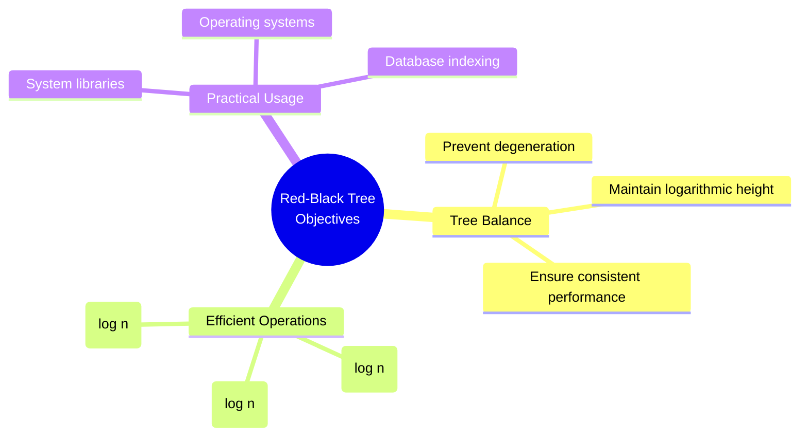
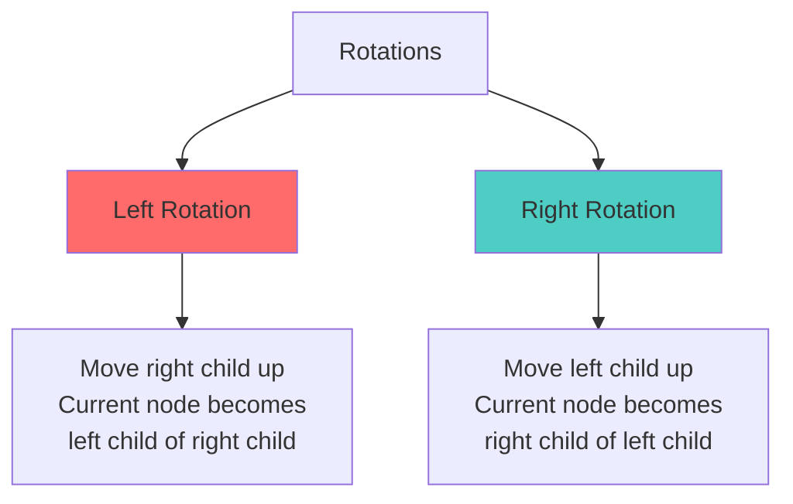
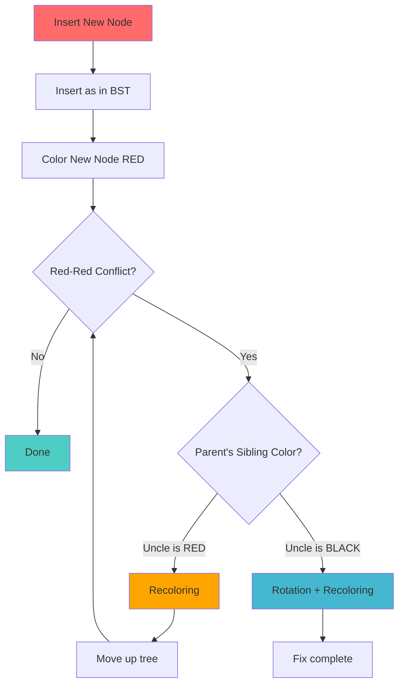
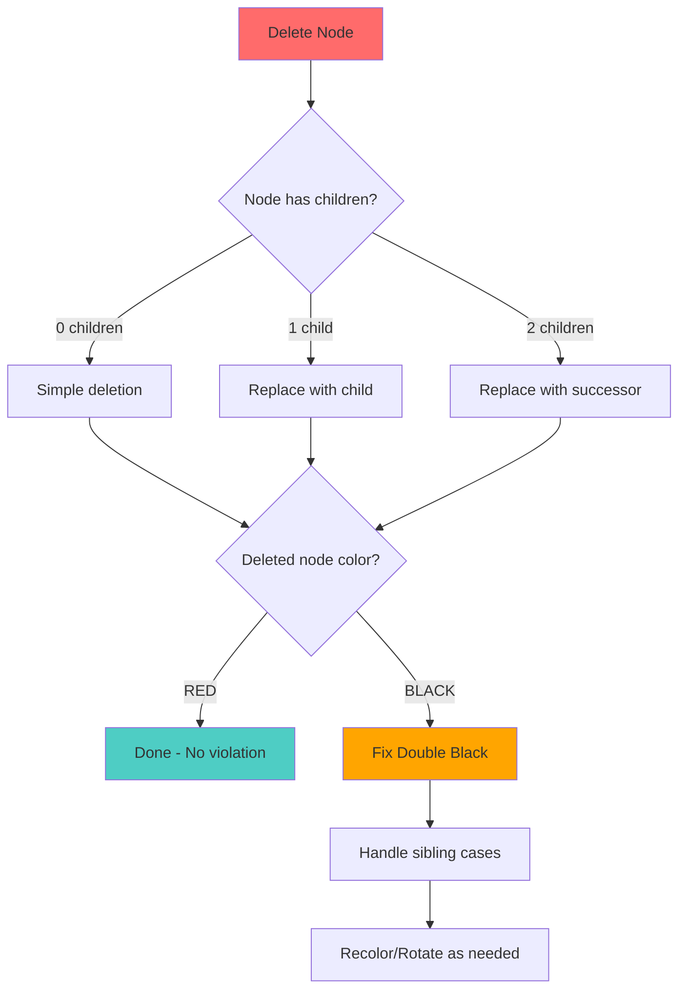
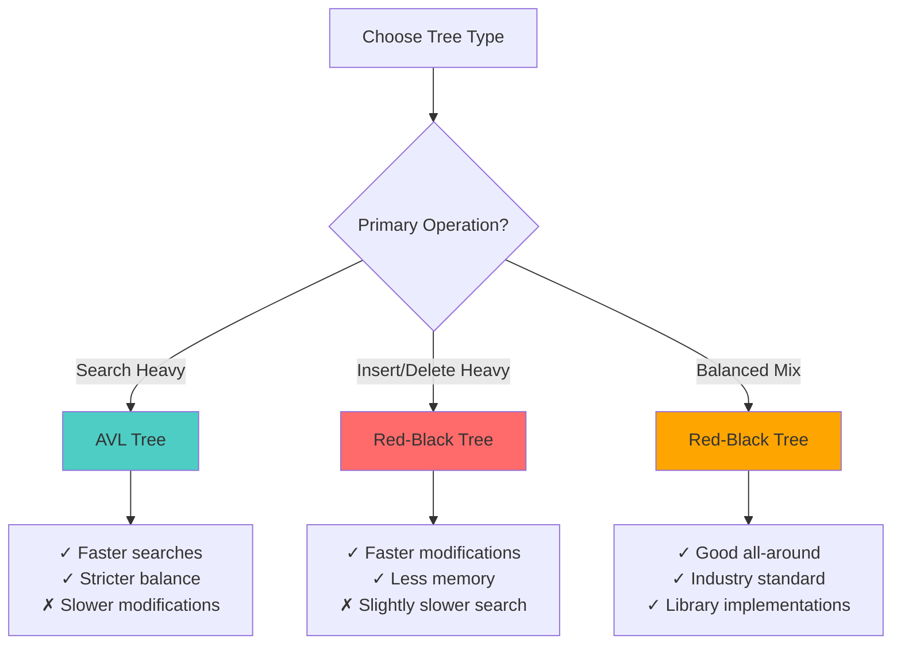
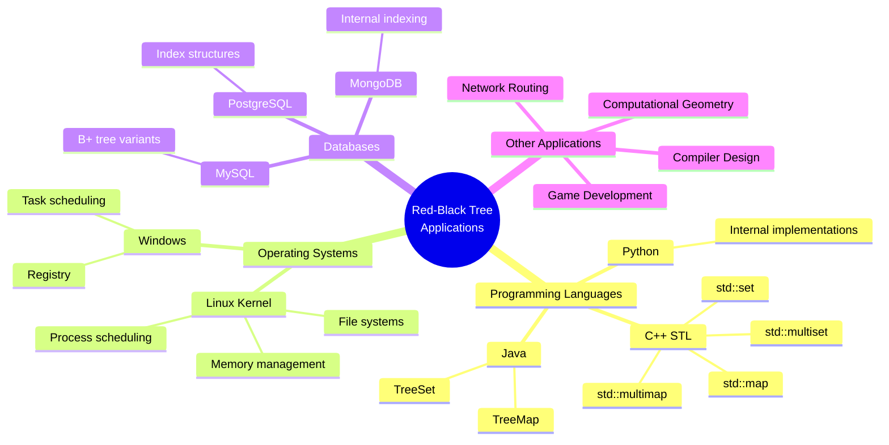
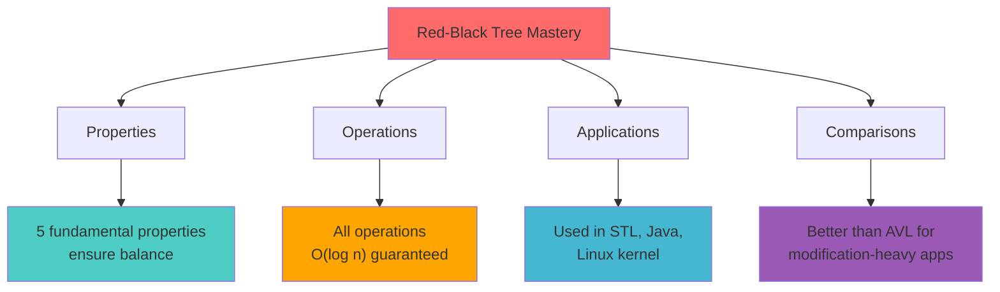

# 🌳 Red-Black Trees — Complete Professional Guide

<div align="center">


*Master the most widely used self-balancing binary search tree in system programming*

</div>

---

## 📑 Table of Contents

1. [🎯 Introduction](#-introduction)
2. [🔴⚫ Properties](#-properties)
3. [📏 Black Height](#-black-height)
4. [🔄 Rotations](#-rotations)
5. [➕ Insertion](#-insertion)
6. [➖ Deletion](#-deletion)
7. [⏱️ Time Complexity](#️-time-complexity)
8. [🆚 Comparison with AVL](#-comparison-with-avl)
9. [📦 Applications](#-applications)
10. [💻 Implementation](#-implementation)
11. [🧠 Interview Tips](#-interview-tips)
12. [🎯 Practice Problems](#-practice-problems)

---

## 🎯 Introduction

### 🔴 What is a Red-Black Tree?

**Red-Black Tree (RBT)** is a **self-balancing Binary Search Tree (BST)** where each node has a color (RED or BLACK) to maintain balance and ensure efficient operations.

```mermaid
flowchart TD
    A[Red-Black Tree] --> B[Self-Balancing BST]
    B --> C[Each Node has Color]
    C --> D[RED or BLACK]
    
    E[Guarantees] --> F[Search: O(log n)]
    E --> G[Insert: O(log n)]
    E --> H[Delete: O(log n)]
    
    style A fill:#ff6b6b
    style D fill:#4ecdc4
    style F fill:#45b7d1
    style G fill:#45b7d1
    style H fill:#45b7d1
```

### 🎯 Objective



---

## 🔴⚫ Properties

### 📋 Five Fundamental Properties (CRITICAL!)

```mermaid
flowchart TD
    A[Red-Black Tree Properties] --> B[Property 1]
    A --> C[Property 2]
    A --> D[Property 3]
    A --> E[Property 4]
    A --> F[Property 5]
    
    B --> B1["Every node is either<br/>RED or BLACK"]
    C --> C1["Root node is<br/>always BLACK"]
    D --> D1["All leaf (NIL) nodes<br/>are BLACK"]
    E --> E1["Red node's children<br/>are BLACK<br/>(No consecutive RED nodes)"]
    F --> F1["All paths from node to<br/>descendant NIL nodes have<br/>same BLACK node count"]
    
    style B1 fill:#ff6b6b
    style C1 fill:#2c3e50
    style D1 fill:#2c3e50
    style E1 fill:#ff6b6b
    style F1 fill:#2c3e50
```

<div align="center">

</div>



### 🔍 Property Details

#### 1️⃣ **Node Color**: Every node is either RED or BLACK
```cpp
enum Color { RED, BLACK };

struct Node {
    int data;
    Color color;
    Node* left;
    Node* right;
    Node* parent;
};
```

#### 2️⃣ **Root Color**: Root node is always BLACK
```
Root → Always BLACK
This ensures consistent starting point
```

#### 3️⃣ **Leaf Color**: All leaf (NIL/NULL) nodes are BLACK
```
NIL nodes → Always BLACK
Simplifies property checking
```

#### 4️⃣ **Red Node Rule**: Red node's children are BLACK
```
RED node → Both children must be BLACK
No two consecutive RED nodes allowed
```

#### 5️⃣ **Black Height**: Same BLACK node count on all paths
```
From any node to its descendant NIL nodes:
All paths have equal BLACK node count
```

### 💡 Why These Properties Matter

```mermaid
flowchart LR
    A[Properties] --> B[Balanced Tree]
    B --> C[Height ≤ 2 log(n+1)]
    C --> D[O(log n) Operations]
    
    style A fill:#ff6b6b
    style D fill:#4ecdc4
```

---

## 📏 Black Height

### 📐 Definition

**Black Height** of a node is the number of BLACK nodes on any path from that node to a descendant leaf (NIL node), **not counting the node itself**.

<div align="center">

</div>

### 🔢 Black Height Properties

```mermaid
flowchart TD
    A[Black Height Properties] --> B[Equal Paths]
    A --> C[Height Control]
    A --> D[Balance Guarantee]
    
    B --> B1["All paths from node<br/>to NIL have same<br/>BLACK node count"]
    C --> C1["Controls tree height<br/>Height ≤ 2 × Black Height"]
    D --> D1["Ensures logarithmic<br/>performance guarantee"]
    
    style A fill:#2c3e50
    style B1 fill:#4ecdc4
    style C1 fill:#ffa500
    style D1 fill:#45b7d1
```



### 📊 Example Calculation

```
        B(10) ← Black Height = 2
       /      \
    R(5)      B(15) ← Black Height = 1
   /   \      /    \
B(3) B(7) B(12) B(18) ← Black Height = 0
 |    |    |     |
NIL  NIL  NIL   NIL

Path from root to any NIL: 2 BLACK nodes
```

---

## 🔄 Rotations

Red-Black Trees use **rotations** for balancing, similar to AVL trees but with fewer rotations needed.

### 🔄 Rotation Types



### 🔄 Left Rotation

```cpp
Node* leftRotate(Node* x) {
    Node* y = x->right;
    x->right = y->left;
    
    if (y->left != NIL) {
        y->left->parent = x;
    }
    
    y->parent = x->parent;
    
    if (x->parent == NIL) {
        root = y;
    } else if (x == x->parent->left) {
        x->parent->left = y;
    } else {
        x->parent->right = y;
    }
    
    y->left = x;
    x->parent = y;
    
    return y;
}
```

### 🔄 Right Rotation

```cpp
Node* rightRotate(Node* y) {
    Node* x = y->left;
    y->left = x->right;
    
    if (x->right != NIL) {
        x->right->parent = y;
    }
    
    x->parent = y->parent;
    
    if (y->parent == NIL) {
        root = x;
    } else if (y == y->parent->right) {
        y->parent->right = x;
    } else {
        y->parent->left = x;
    }
    
    x->right = y;
    y->parent = x;
    
    return x;
}
```

---

## ➕ Insertion

### 🔄 Insertion Process Flow



### 📋 Insertion Steps

1. **Insert node using BST rules**
2. **Color the new node RED**
3. **Fix Red-Red conflicts if they occur**

### 🔧 Insertion Cases

#### Case 1: Parent is BLACK
```
No conflict → Done!
New RED node doesn't violate properties
```

#### Case 2: Parent is RED + Uncle is RED
```
Solution: Recoloring
- Parent → BLACK
- Uncle → BLACK  
- Grandparent → RED
- Move up and check grandparent
```

#### Case 3: Parent is RED + Uncle is BLACK
```
Solution: Rotation + Recoloring
- Perform appropriate rotation
- Recolor nodes to maintain properties
```

### 💻 Insertion Implementation

```cpp
void insert(int data) {
    Node* newNode = new Node(data);
    newNode->color = RED;  // Always insert as RED
    
    // Standard BST insertion
    bstInsert(newNode);
    
    // Fix Red-Black properties
    insertFixup(newNode);
}

void insertFixup(Node* z) {
    while (z->parent->color == RED) {
        if (z->parent == z->parent->parent->left) {
            Node* uncle = z->parent->parent->right;
            
            if (uncle->color == RED) {
                // Case 1: Uncle is RED - Recoloring
                z->parent->color = BLACK;
                uncle->color = BLACK;
                z->parent->parent->color = RED;
                z = z->parent->parent;
            } else {
                // Case 2 & 3: Uncle is BLACK - Rotation
                if (z == z->parent->right) {
                    z = z->parent;
                    leftRotate(z);
                }
                z->parent->color = BLACK;
                z->parent->parent->color = RED;
                rightRotate(z->parent->parent);
            }
        } else {
            // Mirror cases for right side
            // ... similar logic
        }
    }
    root->color = BLACK;  // Root is always BLACK
}
```

---

## ➖ Deletion

### 🗑️ Deletion Complexity

Deletion is the **most complex operation** in Red-Black Trees because:
- Removing BLACK nodes disturbs black height
- Need to handle **Double Black** cases
- Multiple cases based on sibling's color and children

### 🔄 Deletion Process



### 🔧 Double Black Cases

When a BLACK node is deleted, its replacement becomes **Double Black**, requiring fixes:

1. **Sibling is BLACK with RED child** → Rotation + Recoloring
2. **Sibling is BLACK with BLACK children** → Recoloring
3. **Sibling is RED** → Rotation + Continue fixing
4. **Double Black reaches root** → Remove extra BLACK

### 💡 Interview Insight

```
🎯 For interviews, focus on:
✓ Understanding the concept
✓ Knowing the 5 properties
✓ Basic insertion cases
✓ Deletion complexity (mention, don't implement)
```

---

## ⏱️ Time Complexity

### 📊 Operation Complexities

<div align="center">

| Operation | Time Complexity | Space Complexity |
|:----------|:----------------|:-----------------|
| **Search** | O(log n) | O(1) |
| **Insert** | O(log n) | O(1) |
| **Delete** | O(log n) | O(1) |
| **Min/Max** | O(log n) | O(1) |
| **Predecessor/Successor** | O(log n) | O(1) |

</div>

### 🎯 Why O(log n)?

```mermaid
flowchart LR
    A[Red-Black Properties] --> B[Height ≤ 2 log(n+1)]
    B --> C[Balanced Tree]
    C --> D[O(log n) Operations]
    
    style A fill:#ff6b6b
    style D fill:#4ecdc4
```

**Mathematical Proof**:
- Minimum nodes in RB tree of height h: 2^(h/2) - 1
- Therefore: n ≥ 2^(h/2) - 1
- Solving: h ≤ 2 log₂(n + 1)

---

## 🆚 Comparison with AVL Trees

### 📊 Red-Black vs AVL Detailed Comparison

<div align="center">

| Feature | Red-Black Tree | AVL Tree |
|:--------|:---------------|:---------|
| **Balance** | Loosely balanced | Strictly balanced |
| **Height** | ≤ 2 log(n+1) | ≤ 1.44 log(n+2) |
| **Rotations (Insert)** | ≤ 2 | ≤ 2 |
| **Rotations (Delete)** | ≤ 3 | ≤ log n |
| **Search Speed** | Slightly slower | Faster |
| **Insert/Delete Speed** | Faster | Slower |
| **Memory** | 1 bit per node | 2 bits per node |
| **Use Case** | General purpose | Search-heavy |

</div>

### 🎯 When to Choose Which?



### 💡 Interview Answer Template

```
Q: AVL vs Red-Black Tree - which is better?

A: "Red-Black Trees are better for insertion & deletion heavy 
   applications because they require fewer rotations, making 
   them ideal for real-time systems. That's why they're used 
   in system libraries like C++ STL and Java Collections."
```

---

## 📦 Applications

### 🌟 Real-World Usage



### 🔥 Why Red-Black Trees are Popular

1. **Guaranteed Performance**: O(log n) worst-case
2. **Fewer Rotations**: Better for frequent modifications
3. **Memory Efficient**: Only 1 bit per node for color
4. **Industry Standard**: Proven in production systems
5. **Balanced Complexity**: Good trade-off between performance and implementation complexity

---

## 💻 Implementation

### 🏗️ Complete Red-Black Tree Implementation

```cpp
#include <iostream>
using namespace std;

enum Color { RED, BLACK };

struct Node {
    int data;
    Color color;
    Node* left;
    Node* right;
    Node* parent;
    
    Node(int data) : data(data), color(RED), 
                     left(nullptr), right(nullptr), parent(nullptr) {}
};

class RedBlackTree {
private:
    Node* root;
    Node* NIL;  // Sentinel node for leaves
    
public:
    RedBlackTree() {
        NIL = new Node(0);
        NIL->color = BLACK;
        root = NIL;
    }
    
    // Left rotation
    void leftRotate(Node* x) {
        Node* y = x->right;
        x->right = y->left;
        
        if (y->left != NIL) {
            y->left->parent = x;
        }
        
        y->parent = x->parent;
        
        if (x->parent == NIL) {
            root = y;
        } else if (x == x->parent->left) {
            x->parent->left = y;
        } else {
            x->parent->right = y;
        }
        
        y->left = x;
        x->parent = y;
    }
    
    // Right rotation
    void rightRotate(Node* y) {
        Node* x = y->left;
        y->left = x->right;
        
        if (x->right != NIL) {
            x->right->parent = y;
        }
        
        x->parent = y->parent;
        
        if (y->parent == NIL) {
            root = x;
        } else if (y == y->parent->right) {
            y->parent->right = x;
        } else {
            y->parent->left = x;
        }
        
        x->right = y;
        y->parent = x;
    }
    
    // Insert fixup
    void insertFixup(Node* z) {
        while (z->parent->color == RED) {
            if (z->parent == z->parent->parent->left) {
                Node* uncle = z->parent->parent->right;
                
                if (uncle->color == RED) {
                    // Case 1: Uncle is RED
                    z->parent->color = BLACK;
                    uncle->color = BLACK;
                    z->parent->parent->color = RED;
                    z = z->parent->parent;
                } else {
                    // Case 2: Uncle is BLACK
                    if (z == z->parent->right) {
                        z = z->parent;
                        leftRotate(z);
                    }
                    // Case 3
                    z->parent->color = BLACK;
                    z->parent->parent->color = RED;
                    rightRotate(z->parent->parent);
                }
            } else {
                // Mirror cases for right side
                Node* uncle = z->parent->parent->left;
                
                if (uncle->color == RED) {
                    z->parent->color = BLACK;
                    uncle->color = BLACK;
                    z->parent->parent->color = RED;
                    z = z->parent->parent;
                } else {
                    if (z == z->parent->left) {
                        z = z->parent;
                        rightRotate(z);
                    }
                    z->parent->color = BLACK;
                    z->parent->parent->color = RED;
                    leftRotate(z->parent->parent);
                }
            }
        }
        root->color = BLACK;
    }
    
    // Insert operation
    void insert(int data) {
        Node* newNode = new Node(data);
        newNode->left = NIL;
        newNode->right = NIL;
        
        Node* parent = NIL;
        Node* current = root;
        
        // Standard BST insertion
        while (current != NIL) {
            parent = current;
            if (newNode->data < current->data) {
                current = current->left;
            } else {
                current = current->right;
            }
        }
        
        newNode->parent = parent;
        
        if (parent == NIL) {
            root = newNode;
        } else if (newNode->data < parent->data) {
            parent->left = newNode;
        } else {
            parent->right = newNode;
        }
        
        // Fix Red-Black properties
        insertFixup(newNode);
    }
    
    // Search operation
    Node* search(int data) {
        Node* current = root;
        while (current != NIL && current->data != data) {
            if (data < current->data) {
                current = current->left;
            } else {
                current = current->right;
            }
        }
        return current;
    }
    
    // Inorder traversal
    void inorderHelper(Node* node) {
        if (node != NIL) {
            inorderHelper(node->left);
            cout << node->data << "(" << (node->color == RED ? "R" : "B") << ") ";
            inorderHelper(node->right);
        }
    }
    
    void inorder() {
        inorderHelper(root);
        cout << endl;
    }
};
```

### 🧪 Usage Example

```cpp
int main() {
    RedBlackTree rbt;
    
    // Insert elements
    vector<int> elements = {10, 20, 30, 15, 25, 5, 1};
    
    cout << "Inserting elements: ";
    for (int elem : elements) {
        cout << elem << " ";
        rbt.insert(elem);
    }
    cout << endl;
    
    // Display tree
    cout << "Inorder traversal: ";
    rbt.inorder();
    
    // Search elements
    cout << "Searching for 15: " << (rbt.search(15) ? "Found" : "Not Found") << endl;
    cout << "Searching for 100: " << (rbt.search(100) ? "Found" : "Not Found") << endl;
    
    return 0;
}
```

---

## 🧠 Interview Tips

### 🎯 Common Interview Questions

#### Q1: What is a Red-Black Tree?
```
A: "A Red-Black Tree is a self-balancing BST where each node 
   has a color (RED or BLACK) to maintain balance and ensure 
   O(log n) operations."
```

#### Q2: What are the Red-Black Tree properties?
```
A: "Five properties:
   1. Every node is RED or BLACK
   2. Root is BLACK
   3. Leaves (NIL) are BLACK  
   4. RED nodes have BLACK children
   5. All paths have same BLACK height"
```

#### Q3: Why Red-Black over AVL?
```
A: "Red-Black trees have fewer rotations during insertion/deletion,
   making them faster for modification-heavy applications. That's
   why they're used in system libraries."
```

### 💡 Memory Tricks

#### 🎯 "RRB BBR" Rule
```
Red node's parent → BLACK
Black height → same for all paths
```

#### 🎯 Property Mnemonic
```
"Every Root Leaf Red Black"
1. Every node has color
2. Root is BLACK
3. Leaf (NIL) is BLACK
4. Red has BLACK children
5. Black height is same
```

### 🔥 Interview Do's and Don'ts

#### ✅ Do's
```
✓ Mention the 5 properties clearly
✓ Explain why properties ensure balance
✓ Compare with AVL trees
✓ Discuss real-world applications
✓ Focus on insertion cases, mention deletion complexity
```

#### ❌ Don'ts
```
✗ Don't implement full deletion in interview
✗ Don't confuse with AVL tree properties
✗ Don't forget to mention O(log n) guarantee
✗ Don't ignore the practical advantages
```

---

## 🎯 Practice Problems

### 🔥 LeetCode Problems

1. **Easy**: 
   - Validate Binary Search Tree (98)
   - Binary Tree Inorder Traversal (94)

2. **Medium**:
   - Insert into a Binary Search Tree (701)
   - Delete Node in a BST (450)
   - Kth Smallest Element in a BST (230)

3. **Hard**:
   - Serialize and Deserialize BST (449)
   - Count of Smaller Numbers After Self (315)

### 🧠 Conceptual Questions

1. **Design Question**: "Design a data structure that supports insert, delete, and find operations in O(log n) time."

2. **System Design**: "How would you implement a phone book that supports fast lookups and frequent updates?"

3. **Optimization**: "Your application does 70% searches and 30% updates. Which tree would you choose and why?"

---

## 📚 Summary & Key Takeaways

### 🌟 Essential Points



### 🎯 One-Line Exam Answers

- **Red-Black Tree**: Self-balancing BST with color properties
- **Root color**: Always BLACK
- **No two RED adjacent**: Ensures balance
- **Height complexity**: O(log n)
- **Best use case**: Modification-heavy applications

### 🔥 Interview Success Formula

```
1. 🎯 Know the 5 properties by heart
2. ⚡ Understand why properties ensure O(log n)
3. 🔄 Explain basic insertion cases
4. 🆚 Compare with AVL trees intelligently
5. 📦 Mention real-world applications
6. 💡 Use memory tricks for quick recall
```

---

<div align="center">

### 🌟 Master Red-Black Trees = Master Self-Balancing Data Structures!

**🔴⚫ From theory to implementation — your complete guide to industry-standard balanced trees**

*"In the world of data structures, Red-Black Trees are the perfect balance between performance and practicality."*

</div>