# 🔴⚫ Red-Black Trees — Complete Professional <div align="center">Guide</div>

<div align="center">


**Master self-balancing binary search trees with guaranteed logarithmic operations**

</div>

---

## 📑 Table of Contents

1. [Introduction](#introduction)
2. [Red-Black Properties](#red-black-properties)
3. [Tree Operations](#tree-operations)
4. [Insertion Algorithm](#insertion-algorithm)
5. [Deletion Algorithm](#deletion-algorithm)
6. [Rotations](#rotations)
7. [Applications](#applications)
8. [Best Practices](#best-practices)

---

## Introduction

**Red-Black Trees** are self-balancing binary search trees where each node has a color (red or black) and follows specific rules to maintain balance. They guarantee O(log n) time complexity for search, insertion, and deletion operations, making them ideal for applications requiring predictable performance.

<div align="center">

</div>

### Core Concept


---

## Red-Black Properties

<div align="center">

</div>

### Five Fundamental Rules


### Height Guarantee

The red-black properties ensure that the longest path from root to leaf is at most twice as long as the shortest path, guaranteeing O(log n) height.

---

## Tree Operations

### Node Structure

```cpp
enum Color { RED, BLACK };

template<typename T>
struct RBNode {
    T data;
    Color color;
    RBNode* left;
    RBNode* right;
    RBNode* parent;
    
    RBNode(T value) : data(value), color(RED), left(nullptr), right(nullptr), parent(nullptr) {}
};

template<typename T>
class RedBlackTree {
private:
    RBNode<T>* root;
    RBNode<T>* NIL; // Sentinel node for leaves
    
public:
    RedBlackTree() {
        NIL = new RBNode<T>(T{});
        NIL->color = BLACK;
        root = NIL;
    }
    
    // Basic operations
    void insert(T value) {
        RBNode<T>* newNode = new RBNode<T>(value);
        newNode->left = newNode->right = NIL;
        
        bstInsert(newNode);
        insertFixup(newNode);
    }
    
    void remove(T value) {
        RBNode<T>* nodeToDelete = search(value);
        if (nodeToDelete != NIL) {
            rbDelete(nodeToDelete);
        }
    }
    
    bool search(T value) {
        return searchHelper(root, value) != NIL;
    }
    
private:
    RBNode<T>* searchHelper(RBNode<T>* node, T value) {
        if (node == NIL || node->data == value) {
            return node;
        }
        
        if (value < node->data) {
            return searchHelper(node->left, value);
        } else {
            return searchHelper(node->right, value);
        }
    }
    
    void bstInsert(RBNode<T>* newNode) {
        RBNode<T>* parent = NIL;
        RBNode<T>* current = root;
        
        while (current != NIL) {
            parent = current;
            if (newNode->data < current->data) {
                current = current->left;
            } else {
                current = current->right;
            }
        }
        
        newNode->parent = parent;
        
        if (parent == NIL) {
            root = newNode;
        } else if (newNode->data < parent->data) {
            parent->left = newNode;
        } else {
            parent->right = newNode;
        }
    }
    
    // Rotation operations
    void leftRotate(RBNode<T>* x) {
        RBNode<T>* y = x->right;
        x->right = y->left;
        
        if (y->left != NIL) {
            y->left->parent = x;
        }
        
        y->parent = x->parent;
        
        if (x->parent == NIL) {
            root = y;
        } else if (x == x->parent->left) {
            x->parent->left = y;
        } else {
            x->parent->right = y;
        }
        
        y->left = x;
        x->parent = y;
    }
    
    void rightRotate(RBNode<T>* y) {
        RBNode<T>* x = y->left;
        y->left = x->right;
        
        if (x->right != NIL) {
            x->right->parent = y;
        }
        
        x->parent = y->parent;
        
        if (y->parent == NIL) {
            root = x;
        } else if (y == y->parent->right) {
            y->parent->right = x;
        } else {
            y->parent->left = x;
        }
        
        x->right = y;
        y->parent = x;
    }
    
public:
    // Tree traversal
    void inorderTraversal() {
        inorderHelper(root);
        cout << endl;
    }
    
private:
    void inorderHelper(RBNode<T>* node) {
        if (node != NIL) {
            inorderHelper(node->left);
            cout << node->data << "(" << (node->color == RED ? "R" : "B") << ") ";
            inorderHelper(node->right);
        }
    }
    
public:
    // Validation
    bool isValidRBTree() {
        if (root->color != BLACK) return false;
        
        int blackHeight = -1;
        return validateRBTree(root, 0, blackHeight);
    }
    
private:
    bool validateRBTree(RBNode<T>* node, int currentBlackHeight, int& expectedBlackHeight) {
        if (node == NIL) {
            if (expectedBlackHeight == -1) {
                expectedBlackHeight = currentBlackHeight;
            }
            return currentBlackHeight == expectedBlackHeight;
        }
        
        // Check red node property
        if (node->color == RED) {
            if (node->left->color == RED || node->right->color == RED) {
                return false;
            }
        }
        
        int newBlackHeight = currentBlackHeight + (node->color == BLACK ? 1 : 0);
        
        return validateRBTree(node->left, newBlackHeight, expectedBlackHeight) &&
               validateRBTree(node->right, newBlackHeight, expectedBlackHeight);
    }
};
```

---

## Insertion Algorithm

### Insertion Process


### Insertion Fixup Implementation

```cpp
template<typename T>
void RedBlackTree<T>::insertFixup(RBNode<T>* z) {
    while (z->parent->color == RED) {
        if (z->parent == z->parent->parent->left) {
            RBNode<T>* uncle = z->parent->parent->right;
            
            // Case 1: Uncle is red
            if (uncle->color == RED) {
                z->parent->color = BLACK;
                uncle->color = BLACK;
                z->parent->parent->color = RED;
                z = z->parent->parent;
            } else {
                // Case 2: Uncle is black, z is right child
                if (z == z->parent->right) {
                    z = z->parent;
                    leftRotate(z);
                }
                
                // Case 3: Uncle is black, z is left child
                z->parent->color = BLACK;
                z->parent->parent->color = RED;
                rightRotate(z->parent->parent);
            }
        } else {
            // Symmetric cases (parent is right child)
            RBNode<T>* uncle = z->parent->parent->left;
            
            if (uncle->color == RED) {
                z->parent->color = BLACK;
                uncle->color = BLACK;
                z->parent->parent->color = RED;
                z = z->parent->parent;
            } else {
                if (z == z->parent->left) {
                    z = z->parent;
                    rightRotate(z);
                }
                
                z->parent->color = BLACK;
                z->parent->parent->color = RED;
                leftRotate(z->parent->parent);
            }
        }
    }
    
    root->color = BLACK; // Ensure root is always black
}
```

---

## Deletion Algorithm

### Deletion Cases


### Deletion Implementation

```cpp
template<typename T>
void RedBlackTree<T>::rbDelete(RBNode<T>* z) {
    RBNode<T>* y = z;
    RBNode<T>* x;
    Color originalColor = y->color;
    
    if (z->left == NIL) {
        x = z->right;
        transplant(z, z->right);
    } else if (z->right == NIL) {
        x = z->left;
        transplant(z, z->left);
    } else {
        y = minimum(z->right);
        originalColor = y->color;
        x = y->right;
        
        if (y->parent == z) {
            x->parent = y;
        } else {
            transplant(y, y->right);
            y->right = z->right;
            y->right->parent = y;
        }
        
        transplant(z, y);
        y->left = z->left;
        y->left->parent = y;
        y->color = z->color;
    }
    
    if (originalColor == BLACK) {
        deleteFixup(x);
    }
    
    delete z;
}

template<typename T>
void RedBlackTree<T>::deleteFixup(RBNode<T>* x) {
    while (x != root && x->color == BLACK) {
        if (x == x->parent->left) {
            RBNode<T>* sibling = x->parent->right;
            
            // Case 1: Sibling is red
            if (sibling->color == RED) {
                sibling->color = BLACK;
                x->parent->color = RED;
                leftRotate(x->parent);
                sibling = x->parent->right;
            }
            
            // Case 2: Sibling's children are both black
            if (sibling->left->color == BLACK && sibling->right->color == BLACK) {
                sibling->color = RED;
                x = x->parent;
            } else {
                // Case 3: Sibling's right child is black
                if (sibling->right->color == BLACK) {
                    sibling->left->color = BLACK;
                    sibling->color = RED;
                    rightRotate(sibling);
                    sibling = x->parent->right;
                }
                
                // Case 4: Sibling's right child is red
                sibling->color = x->parent->color;
                x->parent->color = BLACK;
                sibling->right->color = BLACK;
                leftRotate(x->parent);
                x = root;
            }
        } else {
            // Symmetric cases
            RBNode<T>* sibling = x->parent->left;
            
            if (sibling->color == RED) {
                sibling->color = BLACK;
                x->parent->color = RED;
                rightRotate(x->parent);
                sibling = x->parent->left;
            }
            
            if (sibling->right->color == BLACK && sibling->left->color == BLACK) {
                sibling->color = RED;
                x = x->parent;
            } else {
                if (sibling->left->color == BLACK) {
                    sibling->right->color = BLACK;
                    sibling->color = RED;
                    leftRotate(sibling);
                    sibling = x->parent->left;
                }
                
                sibling->color = x->parent->color;
                x->parent->color = BLACK;
                sibling->left->color = BLACK;
                rightRotate(x->parent);
                x = root;
            }
        }
    }
    
    x->color = BLACK;
}

template<typename T>
void RedBlackTree<T>::transplant(RBNode<T>* u, RBNode<T>* v) {
    if (u->parent == NIL) {
        root = v;
    } else if (u == u->parent->left) {
        u->parent->left = v;
    } else {
        u->parent->right = v;
    }
    v->parent = u->parent;
}

template<typename T>
RBNode<T>* RedBlackTree<T>::minimum(RBNode<T>* node) {
    while (node->left != NIL) {
        node = node->left;
    }
    return node;
}
```

---

## Rotations

### Rotation Operations


### Rotation Visualization

```cpp
class RotationDemo {
public:
    // Demonstrate rotation effects
    static void demonstrateRotations() {
        cout << "Left Rotation:" << endl;
        cout << "Before:    x           After:     y" << endl;
        cout << "          / \\                    / \\" << endl;
        cout << "         A   y         =>       x   C" << endl;
        cout << "            / \\               / \\" << endl;
        cout << "           B   C             A   B" << endl;
        cout << endl;
        
        cout << "Right Rotation:" << endl;
        cout << "Before:      y         After:   x" << endl;
        cout << "            / \\                / \\" << endl;
        cout << "           x   C      =>      A   y" << endl;
        cout << "          / \\                   / \\" << endl;
        cout << "         A   B                 B   C" << endl;
    }
    
    // Rotation preserves BST property
    static bool verifyBSTProperty(RBNode<int>* root, int minVal = INT_MIN, int maxVal = INT_MAX) {
        if (root == nullptr) return true;
        
        if (root->data <= minVal || root->data >= maxVal) {
            return false;
        }
        
        return verifyBSTProperty(root->left, minVal, root->data) &&
               verifyBSTProperty(root->right, root->data, maxVal);
    }
};
```

---

## Applications

### Real-World Usage


### Practical Implementation

```cpp
template<typename K, typename V>
class RBTreeMap {
private:
    struct MapNode {
        K key;
        V value;
        Color color;
        MapNode* left;
        MapNode* right;
        MapNode* parent;
        
        MapNode(K k, V v) : key(k), value(v), color(RED), 
                           left(nullptr), right(nullptr), parent(nullptr) {}
    };
    
    MapNode* root;
    MapNode* NIL;
    
public:
    RBTreeMap() {
        NIL = new MapNode(K{}, V{});
        NIL->color = BLACK;
        root = NIL;
    }
    
    // Map operations
    void insert(K key, V value) {
        MapNode* existing = findNode(key);
        if (existing != NIL) {
            existing->value = value; // Update existing
            return;
        }
        
        MapNode* newNode = new MapNode(key, value);
        newNode->left = newNode->right = NIL;
        
        bstInsert(newNode);
        insertFixup(newNode);
    }
    
    V& operator[](K key) {
        MapNode* node = findNode(key);
        if (node == NIL) {
            insert(key, V{});
            node = findNode(key);
        }
        return node->value;
    }
    
    bool contains(K key) {
        return findNode(key) != NIL;
    }
    
    void erase(K key) {
        MapNode* node = findNode(key);
        if (node != NIL) {
            rbDelete(node);
        }
    }
    
    // Iterator support
    vector<pair<K, V>> inorderTraversal() {
        vector<pair<K, V>> result;
        inorderHelper(root, result);
        return result;
    }
    
private:
    MapNode* findNode(K key) {
        MapNode* current = root;
        while (current != NIL) {
            if (key == current->key) {
                return current;
            } else if (key < current->key) {
                current = current->left;
            } else {
                current = current->right;
            }
        }
        return NIL;
    }
    
    void inorderHelper(MapNode* node, vector<pair<K, V>>& result) {
        if (node != NIL) {
            inorderHelper(node->left, result);
            result.push_back({node->key, node->value});
            inorderHelper(node->right, result);
        }
    }
    
    // Include insertion, deletion, and rotation methods here
    // (Similar to previous implementations but adapted for MapNode)
};
```

---

## Best Practices

### Performance Comparison

```mermaid
flowchart TD
    A["Tree Comparison"] --> B["Red-Black Tree"]
    A --> C["AVL Tree"]
    A --> D["Regular BST"]
    
    B --> E["✅ Guaranteed O(log n)"]
    B --> F["✅ Fewer rotations"]
    B --> G["✅ Good for insertions"]
    
    C --> H["✅ Strictly balanced"]
    C --> I["❌ More rotations"]
    C --> J["✅ Better for lookups"]
    
    D --> K["✅ Simple implementation"]
    D --> L["❌ Can degenerate"]
    D --> M["❌ No guarantees"]
    
    classDef default fill:#f9f9f9,stroke:#333,stroke-width:2px,color:#000
    classDef comparison fill:#e3f2fd,stroke:#2196f3,stroke-width:2px,color:#000
    classDef rb fill:#fff3e0,stroke:#ff9800,stroke-width:2px,color:#000
    classDef avl fill:#e8f5e8,stroke:#4caf50,stroke-width:2px,color:#000
    classDef bst fill:#f3e5f5,stroke:#9c27b0,stroke-width:2px,color:#000
    class A comparison
    class B,E,F,G rb
    class C,H,I,J avl
    class D,K,L,M bst
```



### Implementation Guidelines

```cpp
class RBTreeBestPractices {
public:
    // ❌ Common mistake: Forgetting NIL sentinel
    struct BadNode {
        int data;
        Color color;
        BadNode* left;
        BadNode* right;
        BadNode* parent;
        
        BadNode(int val) : data(val), color(RED), 
                          left(nullptr), right(nullptr), parent(nullptr) {}
    };
    
    // ✅ Proper implementation with NIL sentinel
    struct GoodNode {
        int data;
        Color color;
        GoodNode* left;
        GoodNode* right;
        GoodNode* parent;
        
        GoodNode(int val) : data(val), color(RED), left(nullptr), right(nullptr), parent(nullptr) {}
    };
    
    // ✅ Always use NIL sentinel
    static void properInitialization() {
        GoodNode* NIL = new GoodNode(0);
        NIL->color = BLACK;
        // Use NIL for all leaf pointers
    }
    
    // ✅ Validate tree properties
    static bool validateRedBlackTree(GoodNode* root, GoodNode* NIL) {
        if (root == NIL) return true;
        
        // Check root is black
        if (root->color != BLACK) return false;
        
        // Check red-black properties
        int blackHeight = -1;
        return validateHelper(root, NIL, 0, blackHeight);
    }
    
private:
    static bool validateHelper(GoodNode* node, GoodNode* NIL, int currentBlackHeight, int& expectedBlackHeight) {
        if (node == NIL) {
            if (expectedBlackHeight == -1) {
                expectedBlackHeight = currentBlackHeight;
            }
            return currentBlackHeight == expectedBlackHeight;
        }
        
        // Red node cannot have red children
        if (node->color == RED) {
            if (node->left->color == RED || node->right->color == RED) {
                return false;
            }
        }
        
        int newBlackHeight = currentBlackHeight + (node->color == BLACK ? 1 : 0);
        
        return validateHelper(node->left, NIL, newBlackHeight, expectedBlackHeight) &&
               validateHelper(node->right, NIL, newBlackHeight, expectedBlackHeight);
    }
};
```

### When to Use Red-Black Trees

| Use Case | Red-Black Tree | Alternative |
|----------|----------------|-------------|
| **Frequent insertions** | ✅ Excellent | AVL (more rotations) |
| **Frequent lookups** | ✅ Good | AVL (slightly better) |
| **Memory constrained** | ✅ Good | Hash table (if no ordering) |
| **Ordered iteration** | ✅ Excellent | Hash table (no ordering) |
| **Worst-case guarantees** | ✅ Excellent | Regular BST (poor) |

---

## Summary

**Red-Black Trees** provide guaranteed logarithmic performance through self-balancing mechanisms. Key insights:

### Essential Concepts
- **Color Properties**: Five rules that maintain tree balance
- **Self-Balancing**: Automatic rebalancing through rotations and recoloring
- **Guaranteed Performance**: O(log n) worst-case for all operations
- **NIL Sentinel**: Simplifies implementation and edge case handling

### Core Operations
- **Insertion**: BST insert followed by fixup with rotations/recoloring
- **Deletion**: More complex with multiple cases and fixup procedures
- **Rotations**: Preserve BST property while changing tree structure
- **Search**: Standard BST search with guaranteed logarithmic height

### Best Practices
- Always use NIL sentinel nodes for leaves
- Implement proper fixup procedures for insertions and deletions
- Validate tree properties during development
- Consider red-black trees for applications requiring predictable performance

> **Master's Insight**: Red-Black trees strike an optimal balance between implementation complexity and performance guarantees, making them the foundation of many standard library implementations.

---

<div align="center">

**🔴⚫ Master Red-Black Trees • Guarantee Performance • Build Robust Data Structures**

*From Theory to Practice • Balance to Efficiency • Understanding to Mastery*

</div>